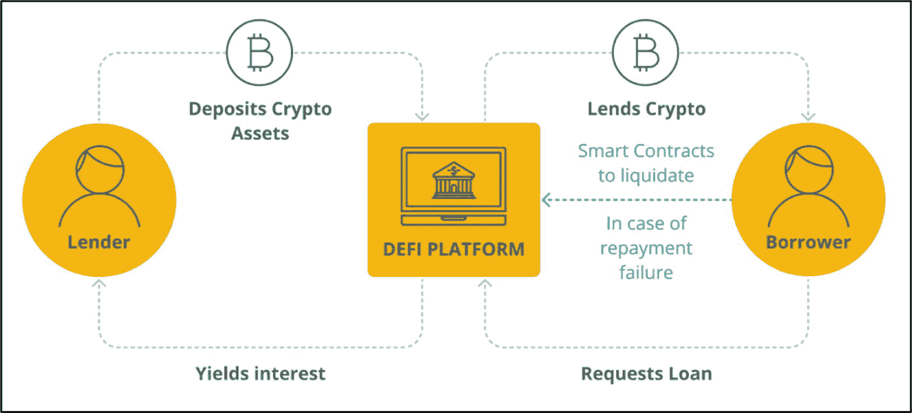
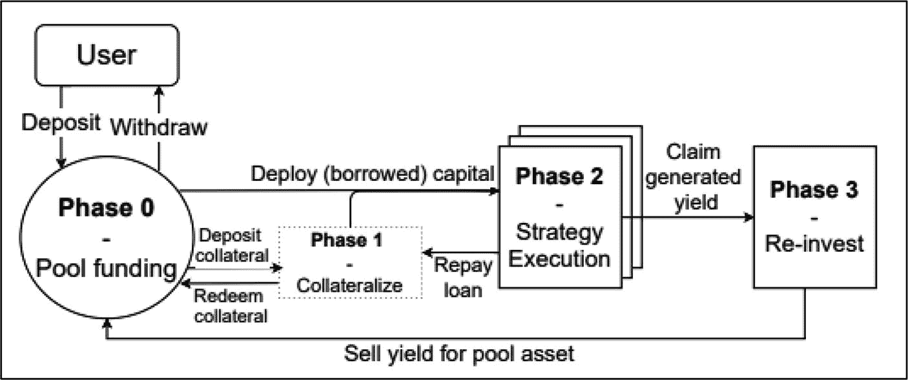
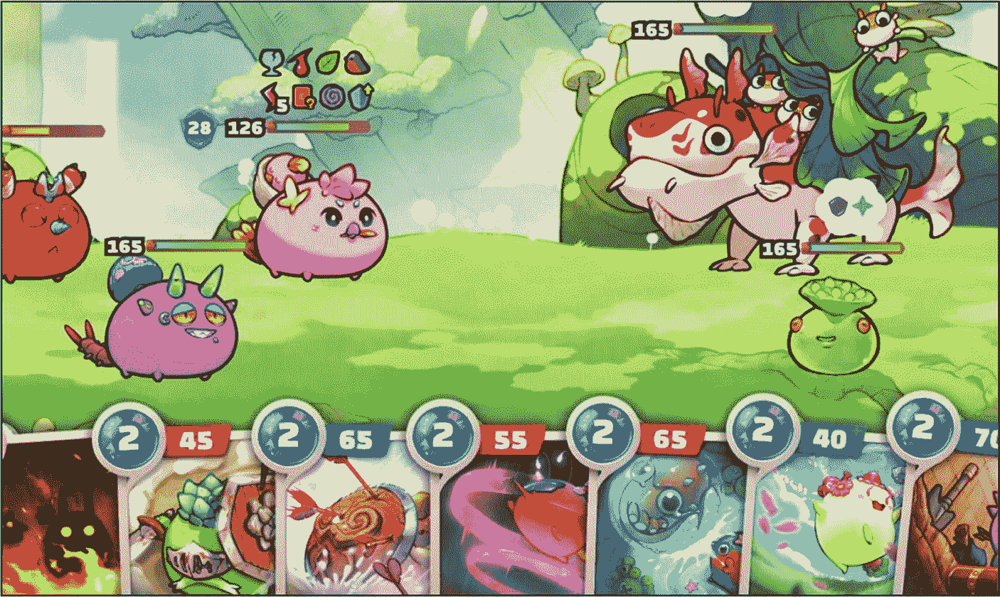

# 流动性收益 farming/ 收益农耕

**示例：** [Compound Finance](https://compound.finance/) 和 [Aave](https://aave.com/)

收益农耕是 DeFi 用户质押或借出其数字资产以赚取被动收入的过程。像 Compound Finance 和 Aave 这样的协议通过提供激励措施来吸引流动性提供者，将其资产借出或锁定在由智能合约驱动的流动性池中。通常，这些奖励来自交易费用、借款人的利息以及有时特定于平台的代币的组合。以 Aave 为例，在[安全模块](https://aave.com/docs/primitives/safety-module)中质押`AAVE`的用户会收到`stAAVE`代币，这代表了他们对协议安全的贡献。

流动性 farming 参与者通常质押或借出`USDC`、`USDT`或`DAI`等稳定币，因为这些资产有助于降低无常损失的风险。最近，流动性 farming 参与者也开始质押从流动性挖矿中获得的 LP 代币，通过提供流动性并重新质押奖励以获取额外收益，从而实现收益最大化。流动性 farming 的回报通常以 APY 表示，并考虑了复利。然而，由于池需求、协议激励和资产价格的变化，这些利率会频繁波动。

**图 13-6**
典型的收益农耕流程（源于[`cointelegraph.com/learn/what-are-defi-yield-aggregators-and-how-do-they-work`](https://cointelegraph.com/learn/what-are-defi-yield-aggregators-and-how-do-they-work)）

许多收益农耕平台在解除质押后会实施一个“冷却期”，要求用户在完全提取其代币之前等待一段时间。此措施旨在保护协议免受突然大额提款造成的干扰。例如，Aave 在其安全模块中强制执行十天的冷却期，以帮助维持稳定性。

**图 13-7**
Compound Finance 仪表板（源于[`app.compound.finance/?market=usdc-mainnet`](https://app.compound.finance/%253Fmarket%253Dusdc-mainnet)）

### 优势

- **高回报** – 与传统质押相比，有获得可观利润的潜力。
- **增强流动性** – 流动性 farmers 有助于提供充足的市场流动性，以平衡供需。
- **平台代币** – 许多平台用原生代币奖励流动性提供者。如果这些代币价值上涨，可以显著提高整体回报。

### 劣势

- **高费用** – 根据网络和策略，流动性 farmers 可能面临持续的高额费用。
- **无常损失** – 面临 AMM 交易对中价格比率波动的风险；LP 最终可能获得的资产价值低于单纯持有两种代币。
- **高风险** – 智能合约中的漏洞或缺陷可能导致重大损失。
- **复杂性** – 流动性 farming 可能很复杂，需要对其协议、无常损失、策略和风险水平有相当的理解。

### 收益聚合器

**示例：** [Yearn Finance](https://yearn.finance/) 和 [Beefy Finance](https://beefy.com/)

DeFi 收益聚合器，也被称为*收益优化器*，是一种特定类型的 DeFi 协议，通过组合并自动化收益耕种协议和策略的过程，帮助投资者实现利润最大化。聚合器通过将用户的数字资产汇集在一起，并通过自动化收益生成的智能合约将其投资于一系列高收益产品和服务的投资组合来实现这一点。

收益耕种的主要缺点是上述过程需要投资者手动执行，这需要时间和精力。收益聚合器会收取一定费用，将上述典型的收益耕种过程接管过来，并代表投资者将其完全自动化。这消除了许多不必要的压力和耗时。收益耕种策略的另一个问题是相关的费用。投资者在首次将他们的`LP`代币赎回为底层资产（或出售任何单独的奖励代币）时，以及当他们将这些新获得的代币重新投资到新的质押或流动性头寸时，都可能会产生费用。然而，由于收益聚合器汇集了大量来自不同投资者的资产，产生的费用由所有流动性提供者（`LP`）和质押参与者共同分担。这种成本分摊的方式通常能将费用的影响降至最低，常常使其接近于可忽略不计。收益聚合器的另一个显著优势是，它们通过自动复投奖励、降低交易成本并代表投资者管理整个过程来产生被动收入。

#### 收益聚合器架构

一个典型的收益聚合器池的操作可以概括为三到四个阶段，具体取决于特定的协议。

图 13-8

风格化的收益聚合器机制（致谢：Sok: DeFi 中的收益聚合器–[`​arxiv.​org/​pdf/​2105.​13891.​pdf`](https://arxiv.org/pdf/2105.13891.pdf)）

**阶段 0**

1.  提议、创建并将收益耕种策略部署到区块链上。
2.  通过治理或内部团队投票，收益耕种策略被批准或拒绝。
3.  一旦获批，就会为此特定的收益耕种策略创建一个资金池。收益农民现在可以将资金存入此池。
4.  存入资金后，收益农民会以“流动性代币”的形式获得池份额。
5.  退出策略时，农民交出他们的流动性代币，以赎回与其份额成比例的资金。

**阶段 1**

1.  将阶段 0 中汇集的资金用作抵押品，通过借贷平台（例如 Aave、Compound）借入另一种资产。
2.  根据策略的不同，汇集的资产可能会在进入阶段 2 之前先兑换成另一种代币（通常是稳定币）；许多金库式策略会保留原始资产或`LP`代币，并完全跳过此步骤。
3.  在后台，收益聚合器通过引导阶段 0 和阶段 1 中使用的智能合约之间的资金流向，来管理抵押资产以避免清算。

**阶段 2**

1.  来自阶段 0 和/或阶段 1 的资产被用于预先编程的策略中，这些策略开始产生收益。这些策略包括借贷策略或流动性策略等收益生成策略。
2.  如果阶段 1 中存入池中的资产是产生收益的代币（例如`LP`代币），则可以跳过阶段 1，汇集的资产直接从阶段 0 流向阶段 2。
3.  如果从原始池中发生较大规模的资金提取，借入的资产有可能流回阶段 1，以偿还部分贷款。

收益聚合器有许多优点和缺点；具体如下：

**优点**

*   **增加利润** – 与传统的收益生成型 DeFi 服务相比，由于费用降低和优化的自动化策略，具有获得高回报的潜力。
*   **代币奖励** – 收益耕作的参与者通常能获得参与奖励。
*   **灵活性** – 投资策略的选择范围更广。
*   **增加流动性** – 为所有 DeFi 用户提供极佳的市场流动性。

**缺点**

*   **高风险** – 智能合约漏洞和代码漏洞、无常损失（`IL`）以及潜在清算——如果使用了抵押头寸——会严重影响投资者。
*   **复杂性** – 管理风险和避免财务损失需要扎实理解复杂的风险因素和战略变量。
*   **波动性** – 代币价格下跌会显著降低所获奖励的价值。

### 治理奖励

治理奖励——大多数情况下会自动在链上发放——是奖励那些参与去中心化协议或平台决策过程的用户的激励措施。治理代币赋予资产持有者对各种改进网络的提案进行投票的权利。例如，`Uniswap (UNI)` 使持有者能够治理 Uniswap 去中心化交易所，而 `Maker (MKR)` 持有者负责管理 Maker 协议，这包括调整 Dai 稳定币的政策、选择新的抵押品类型以及改进治理本身。

### 边玩边赚奖励

游戏平台提供边玩边赚（Play-to-Earn）奖励，以激励玩家参与游戏体验。这些奖励通常以数字资产的形式提供。例如，当玩家达到特定目标或里程碑、赢得一场战斗或完成特定任务时，他们可以收集游戏内的`NFT`资产。根据游戏的主题，`NFT`（非同质化代币）可以是诸如定制化的头像皮肤、武器、载具、地块、收藏品或艺术品等资产。在游戏世界中，个人通过玩边玩边赚游戏赚取一些额外收入是很常见的。边玩边赚游戏的一些核心优势包括：

*   顶级玩家可以参加游戏竞赛，赢得可观的现金奖励。
*   为专注的游戏玩家提供赚取可观收入的机会。
*   玩家拥有代表其在链上游戏资产的`NFT`或代币，尽管游戏工作室仍可能限制这些资产在游戏内的运作方式。
*   有能力将收益再投资回游戏平台，或提取至其他平台或市场。
*   激励措施促使用户与其他玩家和更广泛的社区互动，这有助于提高采用率。

最受欢迎的边玩边赚游戏例子之一是 [Axie Infinity](https://axieinfinity.com/)，它允许玩家繁殖、养育并操控名为 Axies 的数字生物进行战斗。

图 13-9

Axie Infinity——战斗、收集和交易可收藏的 NFT 生物（致谢：[`​axieinfinity.​com/​`](https://axieinfinity.com/)）

