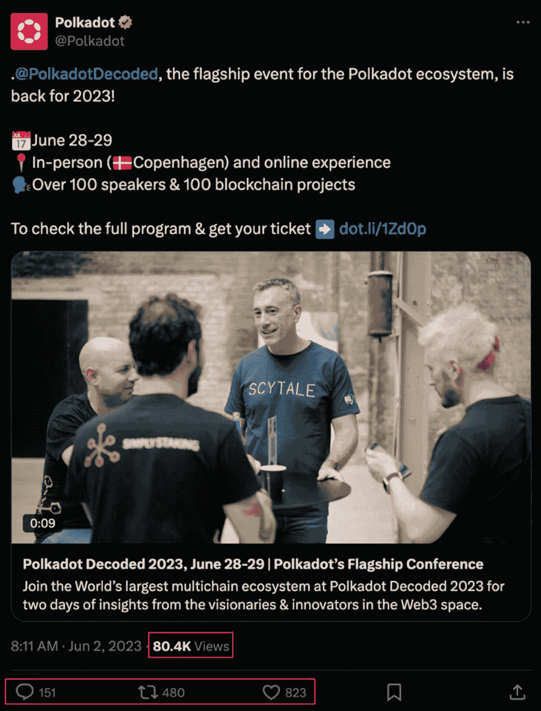

# 14. 社区与社交媒体

在加密货币领域，一个强大的社区以及管理良好且活跃的社交媒体存在，表明了项目的承诺及其潜在的长期成功。社区不仅仅是一群追随者；它是一个核心驱动力，有助于吸引更多兴趣，并推动项目走向成功。通过社交媒体渠道以及项目博客、`GitHub`仓库和治理论坛等其他官方渠道，社区成员聚集在一起分享知识、解答疑问、提供建议、制造声势、参与技术性和非技术性讨论，并了解项目团队发布的最新动态。

拥有活跃社区和在社交媒体上积极存在的项目，向公众、`dApp`用户、网络参与者、投资者等表明，团队致力于项目的成功、保持透明，并希望赢得更广泛社区的信任。相反，如果团队不活跃，社交媒体存在感差，导致与社区缺乏沟通，则表明他们并未全心投入。因此，其短期或长期成功都将受到严重威胁。

**本章讨论的基本内容：**

*   社交媒体的重要性
    *   内测
    *   代码协作
    *   网络效应
    *   持续反馈
    *   传播认知
    *   治理
    *   主流采用与接受
*   社交媒体与社区评估
    *   区块链社区的社交平台
    *   关注者数量
    *   发帖频率
    *   内容互动度
    *   社区管理员

## 社交媒体

“社交”一词指的是群体、社区或社会中成员之间的互动、交流和联系。像 Facebook、X、Instagram、TikTok 和 LinkedIn 这样的流行社交媒体平台，使得世界各地的人们能够以社交方式相互交流。此外，这些社交媒体平台不仅面向普通大众。它们也为小型企业、大型公司和组织提供营销和推广服务。

## 什么是社区？

社区可以描述为一群拥有共同兴趣的个体，在共享环境中相互交流。许多社区包括文化类、专业类、遗产类、技术类、体育类、动物类、音乐类以及各种区块链社区。社区成员通常共享一些主要特征，例如共同的价值观、相互尊重、归属感和紧密联系的关系。社区成员通过贡献信息和在必要时提供帮助来支持他人，这很常见。这有助于建立一个更强大、更稳固、更有意义的社区，并营造积极的知识共享氛围。

社区主要有两种形式：实体社区和虚拟社区。在实体、面对面的社区中，每位社区成员都在一个实体地点会面。这类社区通常具有地域性，来自城镇、城市或乡村、拥有共同兴趣的人们聚集在一起互动。顾名思义，“在线”社区是在线上进行的，每位社区成员通过互联网会面和互动。在大多数情况下，社区中的绝大多数成员可能从未见过面。许多社交媒体平台促进了在线社交互动。重要的是要注意，有时实体社区也可能拥有在线存在，成员们可以在实体聚会之外进行线上互动。此外，根据社区类型及其成员所在地，在线社区组织实体聚会和活动也很常见。

在区块链世界中，主要有三种类型的在线社区，分类如下：

1.  **开发社区** – 由众多开发者组成，他们团结协作，互相帮助、分享想法和知识，为区块链技术的整体进步做出贡献。
2.  **信息社区** – 由来自各个领域、学习区块链技术各方面知识的人组成。
3.  **投资社区** – 由各个级别的投资者组成，他们分享并阐述投资和获利了结的建议。

## 区块链项目社区的重要性

社区不仅仅重要，它是必不可少的。将区块链社区视为一个去中心化、多功能的营销武器，它以多种方式协助项目，影响项目的整体情绪、增长和长期成功。社区通过多种不同的方式实现这一目标，例如内测、代码协作、网络效应、传播反馈等等。下一节将深入探讨这些角色，并强调社区如何为区块链项目做出贡献。

### 内测

正如第 4 章“核心产品”中“产品测试”一节所述，内测是加密项目使用的一种安全技术，它们利用其社区在正式发布前测试其产品或服务。在此过程中，产品（例如 `DeFi` `dApp` 或 `NFT` 市场）会由若干社区成员进行试用和测试，他们的努力通常会得到激励。社区帮助发现产品中的故障、错误和漏洞。每个功能都会被测试，包括功能集、用户界面、网络交易、智能合约以及整体安全性和性能。这些信息会反馈给团队，所有数据和测试报告都会被汇总。然后实施更新和变更，以修正发现的错误、故障和代码漏洞。

### 代码协作

开源项目社区的成员对于项目的核心和灵魂——代码——至关重要。他们积极合作，为项目的整体开发做出贡献。这包括开发、评估和修改代码，以帮助优化项目的整体价值。

### 网络效应

“网络效应”这一术语用于描述一种产品或服务，其规模和价值随着用户数量的增加而提升——现有用户吸引新用户，新用户又吸引更多用户，从而以指数级速度推动产品增长。在加密货币领域，用户在某个平台、`dApp` 或协议上的互动增加，通常会导致网络的进一步增长和扩张。社区通过社交媒体发布和推广项目来帮助推动这种互动。这反过来又创造了额外程序员的需求，他们在一个强大的协作式环境中帮助相应地扩展协议。

### 持续反馈

在项目的整个生命周期中，团队必须了解代码中可能影响协议的任何故障、错误或漏洞。这是通过项目与社区成员之间的持续反馈循环来实现的。除了识别代码中的漏洞外，反馈循环还收集来自社区成员的有价值的意见和建议。这包括关于社区痛点、功能请求或相关项目的反馈。这些见解帮助团队识别、改进和实施新功能，从而增加项目的整体价值。

### 传播认知

一个项目的成功取决于其价值主张以及获得发展动力、吸引用户和构建强大生态系统的能力。社区成员传播认知有助于引发兴趣、推动采用、增强网络效应、组织合作以及确保建立伙伴关系。

### 治理

区块链治理是一个术语，指通过各种结构化的集体过程和机制做出决策。这些决策有助于建立和执行区块链网络发展、方向及管理的规则。持有治理代币的社区成员可以就提案进行投票并影响决策，但投票权通常集中在大型持有者（鲸鱼、`VC` 或核心团队）手中，这可能限制了更广泛社区最终能产生的影响力。

### 主流采用与接受

区块链社区在向大众介绍和传授区块链技术方面发挥着重要作用，包括其运作方式、去中心化的优势以及有影响力的用例，从而培养出更高效、信息更充分的参与者和信誉更高的项目。通过这样做，社区帮助营造一个有效的学习环境，从而实现主流采用。

## 社交媒体与社区评估

理解和解读社交媒体指标是任何项目评估流程的关键。它可以让投资者深入了解项目在受欢迎程度和参与度方面的运营状况，以及社交内容相对于竞争对手的表现。

社交媒体评估使投资者能够了解社区的总体情绪，每条帖文都提供了对项目总体态度和情绪反应的快照，无论环境是消极、中立还是积极。此外，情绪分析有助于识别潜在趋势和预测市场走势。例如，如果围绕某个特定项目有大量积极情绪，则可能引发更多兴趣，进而导致该数字资产价格上涨。

### 区块链社区的社交平台

**评估目标：确定项目团队是否使用了足够数量的社交平台，以优化与社区的沟通、认知、协作和支持。**

在当今世界，项目主要使用的社交平台有七个主要类型。加密货币项目利用这些平台来帮助与公众沟通并推销其产品或服务。此外，这些平台也是赋能社区成员的根据地，社区成员帮助推广众多项目生态系统，并在更广泛的范围内推动区块链采用。项目应力争使用本部分概述的大部分社交媒体平台——选择那些适合其规模、资源和发展阶段的平台——以帮助优化与社区的沟通、认知、协作和支持。

-   `X` – 这是一种“微博客”和社交网络平台。它允许人们发布包含照片、视频、链接和文本的“推文”消息。`X`，在区块链爱好者中也被正式称为“加密推特——‘CT’”，是区块链世界一些最具影响力人物的家园。在 `X` 上自然成长的区块链社区发表他们对新颖且令人兴奋的项目的意见、知识和信息。

-   `YouTube` – 它是一个视频分享平台，用户可以在线观看、点赞、分享、评论和上传自己的视频。区块链项目广泛使用它来为团队提供更新和教程视频。对于那些想要学习区块链技术、新闻以及关于现有和即将推出的功能丰富项目的信息的人来说，`YouTube` 极其有用。

-   `Discord` – 它是一个免费的通讯应用程序，使用户能够分享语音、视频和文本。由于其易于使用、功能丰富的用户界面，它被世界各地的区块链项目和爱好者广泛使用。`Discord` 深受项目团队的喜爱，因为他们可以在官方服务器内创建独立的频道（聊天室），每个聊天室满足项目不同方面的需求。这些聊天室的性质因项目而异；典型的聊天室可能包括新公告、主聊天、媒体、帮助和开发者聊天室。

-   `Telegram` – 它是一个基于云的安全消息和音频通话应用程序，允许用户发送消息、照片、视频和文件。区块链开发者、加密货币交易者和企业家利用 `Telegram` 其功能丰富的用户界面。它包含并促进隐私保护、多平台可用性、自动化机器人、`RSS` 订阅以及价格机器人。虽然并非原生功能，但 `Telegram` 的开放 `API` 允许交易者运行自定义机器人，将实时加密货币价格提醒和其他数据推送到其频道。

-   `Reddit` – 它是一个美国社会新闻聚合、内容评分和讨论网站。在决定优先显示哪些内容时，它优先考虑用户的反馈。凭借其独特的点赞和点踩系统，它能够及时且准确地识别出人们喜欢什么以及不想要什么。区块链项目利用 `Reddit` 来建立强大有力的社区。

-   `Medium` – 它是一个“博客”发布平台，人们可以在此发布和阅读关于他们最关心话题的重要且有深度的文章。区块链项目利用 `Medium` 向社区分发更新、想法、技术文档、新闻和公告。由于其博客型功能，它非常适合向用户和投资者普及他们的产品以及整个区块链技术。

- **[领英](https://LinkedIn.com/)** – 这是全球最大的在线职业社交网络。它用于寻找合适的工作或实习机会，建立并加强职业关系。对于区块链项目而言，领英尤其重要，有助于获取新的客户合作关系，并构建能惠及项目的广泛专业人士网络。
- **[Substack](https://Substack.com/)** – 它将博客与电子邮件通讯合并，因此每篇帖子都会直接发送到订阅者的收件箱。项目团队用它来发布长篇更新——比如开发者日记、治理说明或月度回顾——而无需依赖社交媒体算法。由于关注者会收到电子邮件通知，他们不太可能错过关键公告。项目还可以添加付费层级，用于提供高级研究或抢先体验内容，从而创造可选的收入来源。

### 行动步骤

遵循以下步骤，判断项目团队是否充分利用了足够多的社交平台，以优化与社区的沟通、认知、协作和支持。

1.  **社交媒体平台检查**

    检查项目是否使用了足够数量的社交媒体平台，例如 `X`、`YouTube`、`Discord`、`Telegram`、`Medium`、`Reddit` 和 `LinkedIn`。

2.  **记录笔记，并以你自己的风格记录发现**

3.  **将发现与基本面评估流程的其他部分相结合**

#### 结果评估

理想情况下，项目应在本节所述的多个社交媒体渠道上保持活跃。若不然，建议保持谨慎，并判断是否存在潜在问题，例如人手不足、资金匮乏或团队承诺度低下。

### 关注者数量

**评估目标：通过将项目在多个社交平台上的关注者数量与竞争对手进行比较，来评估其受欢迎程度。**

一个项目在社交媒体平台上的关注者（或订阅者）数量，通常是评估其线上影响力的最直接指标。然而，这并非总是最关键的因素。通常而言，庞大的关注者基础意味着项目具有高知名度、高人气、高关注度以及社区对其的信心。话虽如此，对于什么是“良好”的关注者数量，并没有明确的基准，因为有许多因素在起作用。需要注意一些警示信号，比如关注者数量突然激增、每条帖子的点赞或评论数量极低，或者存在大量空白头像的资料——这些可能暗示着僵尸粉或虚假互动行为。因此，投资者需要通过考虑以下要素来分析关注者数量：

1.  **成立年份** – 正如第 4 章“核心产品”中“成立年份”一节所述，公司的成立年份是至关重要的信息。建议将关注者数量与公司成立年份结合起来分析，以便更准确地理解。在大多数情况下，一个五年前成立的项目自然比一个几个月前成立的项目更有可能拥有更多的关注者。

2.  **竞争对手关注者数量** – 投资者只应在同一加密货币细分领域内比较关注者数量，例如 `DeFi`、区块链网络、游戏、去中心化交易所（`DEX`）等。

3.  **社交媒体平台** – 始终在同一平台上比较竞争对手的关注者数量，例如 `X` 对比 `X`，或 `Discord` 对比 `Discord`。

专家建议

要全面分析加密货币项目的社交媒体关注情况，包括 `Twitter`、`Discord` 和 `Telegram`，可以利用像 [AlphaGrowth](https://alphagrowth.io/makerdao) 这样的平台。

### 行动步骤

按照以下步骤，通过将项目在多个社交平台上的关注者数量与竞争对手进行比较，来评估其受欢迎程度。

1.  **社交媒体关注情况**
    1.  确定项目在 `X`、`YouTube`、`Discord`、`Telegram`、`Medium`、`Reddit` 和 `LinkedIn` 平台上的存在情况。
    2.  访问项目官方网站，查找其社交媒体账号链接。
    3.  记录每个平台上的关注者数量。

2.  **竞争对手分析**
    1.  访问 `CoinMarketCap.com`——或类似平台如 `CoinGecko` 或 `AlphaGrowth`——并选择项目所属的类别，例如 [Layer 1](https://coinmarketcap.com/view/layer-1/) 区块链项目。
    2.  选择三个市值相近的竞争对手。
    3.  访问每个竞争对手的社交媒体平台，并记录其关注者数量。
    4.  比较这些关注者数量，并参考每个项目的成立年份以获得更全面的背景信息。

3.  **记录笔记，并以你自己的风格记录发现**

4.  **将发现与基本面评估流程的其他部分相结合**

#### 结果评估

庞大的关注者数量值得称赞，但这并不能保证质量或成功。它表明该项目并非骗局，具有一定的知名度，并拥有足够的社区支持。该指标应与本章中的基础社交媒体指标结合使用。如果项目在多个平台上的关注者数量显著低于竞争对手，则可能预示着产品用例不佳、营销不力、知名度不足、内容质量低下以及项目管理团队不善。需要进一步调查。

### 发帖频率

**评估目标：评估项目团队的社交媒体活跃度，以帮助判断团队成员是否仍在积极活动。**

发帖频率是指公司或个人在特定时间范围内通过社交媒体平台、博客、通讯或播客发布新内容的频率。该指标显示了项目团队在不同社交媒体渠道上的活跃程度。至少，项目领导者和核心团队成员应在多个社交媒体上保持强大存在，原因包括：

- **活跃度** – 频繁发帖向社区表明公司仍在积极运作并努力。
- **可信度** – 定期发布高质量内容有助于彰显在特定领域的专业性，从而建立信誉。
- **社交引擎优化（SEO）** – 通过频繁发帖，公司页面的 `SEO` 排名可能会更高，使其在搜索结果中更显眼。
- **覆盖面** – 定期发帖有助于触达更多人，从而扩大受众范围。
- **受众参与度** – 定期发帖有助于保持受众的参与度。

专家建议

在分析项目的发帖活动时，建议快速浏览每条帖子，确保内容与团队的核心产品或服务相关。许多项目会发布大量“空话”，这些内容与实际价值主张无关，而是更广泛地关注市场状况或区块链相关材料。

### 行动步骤

按照以下步骤评估项目团队的社交媒体活跃度，以帮助判断团队成员是否仍在积极活动。

1.  **确定发帖频率**

    确定项目团队在不同社交媒体平台上的发帖频率。
    1.  访问项目官方网站。
    2.  找到项目社交媒体图标所在处。
    3.  访问团队使用的每个主要社交媒体平台，例如 `X`、`Telegram` 和博客（`Medium`）。
    4.  在每个平台上，统计团队在过去 30 天内的发帖数量，以衡量其活跃程度。

2.  **竞争对手分析**

    将数据与热门及直接竞争对手进行比较。

3.  **记录笔记，并以你自己的风格记录发现**

4.  **将发现与基本面评估流程的其他部分相结合**

#### 结果评估

主要目标是判断项目团队是否活跃并专注于产品。如果每个社交媒体平台（或至少是团队使用的主要平台）每月能看到大约十五到二十篇帖子，这将会令人赞赏。

### 内容参与度

**评估目标：** 判断团队是否分享了高质量、有吸引力的内容，以及社区的反馈如何。

评估项目在社交媒体上的帖子，关注点不只有数量；社区参与度同样至关重要，甚至更为关键。参与度的高低取决于项目团队能否通过有意义、有影响力且高质量的内容与社区建立联系。为了了解社区的活跃程度，投资者可以评估点赞、评论、转发、触及人数和曝光量等指标——这些数据能让你快速了解社区的健康状况和活跃度。

在任何社交媒体平台上发布的帖子，其互动方式都包括*点赞*、*转发*或*评论*（回复）。同时，*触及人数*用于识别看到该帖子的独立用户数量。图 14-1 是 [Polkadot 网络](https://polkadot.com/) 在 [X 平台](https://x.com/home) 上发布的一条帖子。该帖子获得了 80.4k 次浏览（触及人数）、151 条评论、480 次转发和 823 个点赞。

图 14-1

Polkadot 网络在 X 平台发布的帖子，突出了评论、转发、点赞和浏览数（触及人数）([`​x.​com/​Polkadot/​status/​1664620666690351​105`](https://x.com/Polkadot/status/1664620666690351105))

### 参与率

参与率 (ER) 衡量的是相对于点赞、反应、转发、评论、点击、投票和品牌提及次数等内容所生成的互动量。高 ER 代表强有力的参与和互动，而低 ER 则表示互动效果不佳。

参与率以百分比形式呈现；百分比越高，参与率就越高，反之亦然。每个社交媒体平台都有不同的 ER。例如，表 14-1 展示了 X 平台、YouTube 和 LinkedIn 上从差到极佳的参与率范围。这些范围借鉴了 [Rival IQ](https://www.rivaliq.com/blog/social-media-industry-benchmark-report-2024/) 和 [SocialInsider](https://www.socialinsider.io/social-media-benchmarks) 编制的 2024–2025 年参与度基准数据，这些数据分析了每个平台上数百万条品牌帖子。然而，由于社交媒体发展、算法和策略的动态变化，参与率评分会持续波动。因此，在进行基本面分析时，建议核查每个平台最新的 ER。

表 14-1

X 平台、YouTube 和 LinkedIn 的社交媒体参与率

| 参与率 |
| --- |
| 平台 | 差 ER | 良好 ER | 极佳 ER |
| --- | --- | --- | --- |
| X 平台 | 低于 0.02% | 0.02%–0.09% | 高于 0.09% |
| YouTube | 低于 1% | 1%–3% | 高于 3% |
| LinkedIn | 低于 0.5% | 0.5%–1.5% | 高于 1.5% |

根据衡量对象是触及人数、帖子数、曝光量、观看次数、粉丝数还是每日活跃度，计算参与率有多种方法。不过，我们将聚焦于一种主要的 ER 计算方法：*基于触及人数的参与率* (ERR)。

### 基于触及人数的参与率 (ERR)

基于触及人数的参与率 (ERR) 公式衡量的是，在每篇帖子的基础上，与内容互动的用户占看过该内容用户的比例。这种方法比基于粉丝的参与率 (ERF) 更准确，因为它根据实际触及人数而非总粉丝数来衡量参与度，后者可能包含从未看过内容的用户。

$$\mathit{ERR}\mspace{6mu} = \mspace{6mu}\frac{\textit{每篇帖子的总互动数}}{\textit{每篇帖子的触及人数}}^{\ast}\ 100$$

**公式 14-1.** 基于触及人数计算参与率 (ERR) 的公式

**计算示例：**

使用 Polkadot 网络的帖子数据（图 14-1）。

*   每篇帖子的总互动数：

151 (评论) + 480 (转发) + 823 (点赞) = 1454

*   触及人数（浏览数）= 80,400

Polkadot 帖子的 ERR 计算如下：

$$\textit{\textbf{Polkadot 帖子}}\ \mathbf{ERR} = \mspace{6mu}\frac{1454}{80400}^{\ast}\ 100 = 1.81\%$$

**公式 14-2.** Polkadot 网络在 X 平台社交媒体帖子的参与率 (ER)

**专家提示**

为获得更准确、更均衡的结果，请计算最近二十篇帖子的平均 ERR。

### 行动步骤

按照以下步骤判断团队是否分享了高质量、有吸引力的内容以及社区的反馈情况。计算几篇帖子的参与率，以清晰了解情况。

1.  **计算帖子参与率**

    确定项目在十到十五篇帖子中的平均参与率。

    1.  通过项目网站上的官方链接，导航至该项目的一个或多个社交媒体频道。

    2.  根据触及人数计算最近 10-15 篇帖子的参与率 (ERR)。将这些帖子的总互动数相加，除以帖子总数，再乘以 100 得出百分比。

2.  **与平台参与度评级进行对比分析**

    将计算出的 ERR 与各个社交媒体平台当前的参与度评级进行比较。

3.  **竞争对手分析**

    将 ERR 结果与热门及直接竞争对手的结果进行比较。

4.  **以你自己的风格记录发现并做笔记**

5.  **将发现与基本面评估流程的其他部分结合起来**

**专家提示**

在确定 ERR 和 AVERR（平均 ERR）时，花点时间阅读每条帖子和评论，以判断社区对项目是否持有良好情绪。积极情绪总是值得赞赏的；然而，也要注意识别那些可能为进一步调查提供线索的负面评论。

#### 结果评估

高参与率非常值得赞赏，尤其是当项目表现优于竞争对手时。然而，有些项目需要一段时间才能获得发展势头，特别是初创项目；因此，检查项目的启动时间非常重要。虽然参与率是一个重要指标，但不应赋予过重权重。投资者应始终将本章讨论的社交媒体基本分析的其他方面结合起来综合考量。

### 社区版主

**评估目标：** 通过评估社交媒体版主的素质和工作表现，来衡量团队对支持其社区的投入程度。

顾名思义，社区版主的职责是管理、维护并监督社区内的讨论。版主需要确保对话保持尊重、有序，并符合社区的目标和规则。通过这样做，他们帮助营造一个环境，让成员能够有效分享信息、交流想法、表达关切和观点，而不受垃圾信息、错误信息或冲突的干扰。在区块链领域，社区版主对于基于项目的社区至关重要，他们能在 X、Telegram、Discord 和 subreddit 等平台上促进有意义的互动。

社区版主承担着一些特定的任务和职责，以维护一个稳定、高效、友好且信息共享的环境，例如：

-   **执行规则** – 版主帮助确保社区成员遵守规则和指南。
-   **引导讨论** – 版主确保讨论内容与既定主题保持一致且相关。
-   **解决冲突** – 版主以友好的方式帮助控制和调解社区内的任何分歧、争论和冲突。
-   **移除垃圾信息** – 版主快速识别并移除此类不相关或有危害的垃圾信息。
-   **教育** – 版主传达核心团队的官方更新，回答问题，并帮助新人理解区块链和项目的基本概念。
-   **内容审核** – 版主决定频道上允许发布哪些内容。
-   **管理** – 版主经常组织和举办平台上的活动，例如与其他团队成员或区块链领域有影响力的人物进行采访（称为“问我任何问题”（AMA））。

无论社交平台是什么，投资者都必须考察版主的表现、素质和效率。如果版主似乎缺席、响应缓慢、提供模糊或错误的信息，或者未能消除垃圾信息的威胁，这被视为一个危险信号。这可能是由于人员配置不足、资金短缺或团队投入不够所致；无论如何，这都不是一个好迹象，也不值得你投资。

### 行动步骤

请按照以下步骤，通过评估社交媒体版主的素质和工作表现，来衡量团队对支持其社区的投入程度。

1.  **版主素质与表现**
    1.  通过项目网站上的官方链接，访问项目的一个或多个社交媒体频道，例如 Telegram。
    2.  根据以下标准扫描并评估版主、频道和聊天记录：
        1.  版主是否及时回答社区问题？
        2.  版主的覆盖范围是否合理分布在不同关键时区——在社区活跃高峰期提供及时响应，即使无法严格做到 24/7？
        3.  社区是否收到持续的项目更新？
        4.  是否提供了高质量的回复？
        5.  版主是否以易于理解的方式回答问题和关切？
        6.  频道的管理方式是否专业？
        7.  版主对待社区是否友善和令人愉快？
        8.  版主是否过滤了垃圾广告和与项目无关的内容？

2.  **以你自己的方式记录发现并整理笔记**

3.  **将发现与其他基础评估部分的结论相结合**

#### 结果评估

版主的形象直接反映了项目及其运营者。因此，版主必须专业、有礼貌、响应迅速且以专业态度履行职责，从而建立信任并增加可信度。然而，如果他们未能履行职责，则建议投资者保持谨慎，并观察该项目在其余基础评估中的表现如何。

