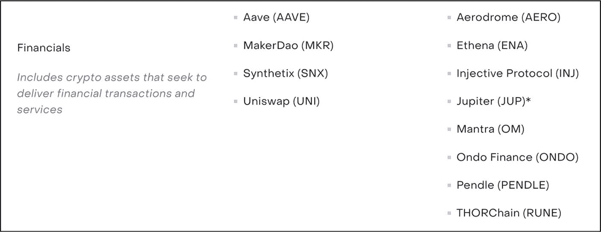

# 机构投资

## 投资工具

### 企业投资（[微策略](https://www.microstrategy.com/en)、[谷歌风投](https://www.gv.com/)、[英特尔资本](https://www.intelcapital.com/)、[IBM 区块链](https://www.ibm.com/blockchain)、[富达投资](https://www.fidelity.com/)）

企业投资公司是将利润或闲置现金用于投资，而非作为收入或存入银行账户的大型企业。它们通过直接投资或通过风险投资公司来实现。由于税收优势，企业投资是从公司提取资金的一种有吸引力的方式。例如，商业智能（BI）软件公司`微策略`截至 2024 年 11 月 24 日，其比特币持有量已增至 386,700 BTC。

### 投资信托（[灰度投资](https://grayscale.com/)）

投资信托是接收投资者资金并代表其投资于不同资产的金融产品。投资信托，也称为封闭式信托，允许投资者在公开市场上交易其份额。`灰度比特币信托（GBTC）`就是一个投资信托的例子。它允许投资者交易持有大量比特币的信托份额。`GBTC` 是全球最大的比特币基金，也是首个以数字货币为基础价值的公开交易信托。`GBTC` 基金使投资者能够通过证券获得 BTC 敞口，同时直接避免了购买、存储和保管 BTC 的挑战。

### 交易所交易基金（[方舟投资](https://ark-invest.com/)、[Amplify 转型数据共享 ETF (BLOK)](https://amplifyetfs.com/blok/)、[范埃克比特币策略 ETF (XBTF)](https://www.vaneck.com/us/en/investments/bitcoin-strategy-etf-xbtf/overview/)、[ProShares 比特币策略 ETF (BITO)](https://www.proshares.com/our-etfs/strategic/bito)）

交易所交易基金（ETF）是在美国证券交易委员会注册的投资公司，为投资者提供将资金集中投资于股票、债券或其他数字资产的基金。正如其名，ETF 在交易所进行交易，类似于股票，并跟踪基础资产的表现。此外，投资者还可能从基金中获得股息。大多数 ETF 由投资顾问进行专业管理。当投资者购买一份 ETF 份额时，他们就成为了该基金的 partial 所有者。ETF 可以专注于特定领域或行业，例如能源行业 ETF。就区块链领域而言，ETF 分为以下三种类型：

1.  **区块链 ETF** – 区块链 ETF 是主题型交易所交易基金，持有专注于开发区块链技术的公司股票。例如：[Amplify 转型数据共享 ETF (BLOK)](https://amplifyetfs.com/blok/)
2.  **实物数字资产 ETF** – 实物比特币 ETF 是一种提供现货数字资产价格敞口的 ETF。自 2024 年 1 月起，美国证券交易委员会已批准多只现货比特币（实物）ETF——例如，贝莱德 iShares 比特币信托 (IBIT) 和富达 Wise Origin 比特币基金 (FBTC)——使美国投资者能够受到监管地接入基础资产。
3.  **数字资产期货 ETF** – 一种跟踪数字资产期货合约表现的交易所交易基金。它们是一种衍生投资证券，允许投资者推测特定资产的未来价格。例如，通过投资比特币期货 ETF，投资者无需持有数字货币本身即可获得比特币价格波动的敞口。示例：[范埃克比特币策略 ETF (XBTF)](https://www.vaneck.com/us/en/investments/bitcoin-strategy-etf-xbtf/overview/) 和 [ProShares 比特币策略 ETF (BITO)](https://www.proshares.com/our-etfs/strategic/bito)

### 交易所交易产品（[富达 Wise Origin 比特币基金 (FBTC)](https://institutional.fidelity.com/advisors/investment-solutions/asset-classes/alternatives/fidelity-wise-origin-bitcoin-fund)）

交易所交易产品（ETP）是在交易所交易的一类金融证券。ETP 跟踪基础资产或指数的表现。一个例子是[富达 Wise Origin 比特币基金 (FBTC)](https://institutional.fidelity.com/advisors/investment-solutions/asset-classes/alternatives/fidelity-wise-origin-bitcoin-fund)。`FBTC` 由富达数字资产托管的比特币 100% 实物支持，并在美国（Cboe BZX）和欧洲交易所交易。

### 政府拨款（[欧盟区块链观察站](https://www.eublockchainforum.eu/)、[美国国家科学基金会 (NSF) 拨款](https://www.nsf.gov/)）

政府拨款是政府机构为支持和促进区块链研发提供的非股权资助。[欧洲区块链观察站与论坛](https://www.eublockchainforum.eu/)是欧盟委员会的一项倡议，旨在加速欧盟内部的区块链创新和区块链生态系统发展，并帮助巩固欧洲作为这项变革性新技术全球领导者的地位。

### 银行贷款（[摩根大通](https://www.jpmorganchase.com/)、[美国银行](https://www.bankofamerica.com/)、[富国银行](https://www.wellsfargo.com/)）

银行向区块链公司提供传统贷款，以助力区块链技术和新兴“加密货币”初创项目的发展。

## 机构投资优势

-   **可信度** – 机构投资者通过先进的长线投资策略、基本面与技术分析（包括市场研究、风险管理、宏观经济趋势）以及机构级工具进行的广泛尽职调查，为项目和资产增添了可信度与合法性。这有助于吸引大量散户投资者，并鼓励进一步投资。
-   **机构采纳** – 机构投资者的崛起推动着更高的合规标准，提升了透明度、市场诚信度和投资者信心。
-   **资本获取** – 通过大量机构投资，项目可以通过招募顶尖人才、加速开发和运营以及资助大规模营销活动，更快速、更高效地扩展规模。
-   **大额资金** – 机构投资者能够投入巨额资金，有助于降低波动性，同时增加稳定性。
-   **流动性** – 机构投资者将成熟的交易策略带入区块链市场，有助于提高流动性和市场效率。
-   **能见度与兴趣** – 机构投资吸引更多的专业投资公司和传统市场投资者进入加密货币领域。

## 机构投资劣势

-   **监管审查** – 机构投资者的参与可能会引起监管机构更多的关注，给项目带来额外的审查和合规挑战。
-   **依赖少数投资者** – 如果项目过度依赖机构资金，这些投资者的退出或失败可能会危及整个项目。
-   **项目声誉** – 如果机构投资者抛售其持有的代币，可能会损害项目声誉，导致项目团队和所有其他利益相关者产生不确定性。
-   **有限的风险承受能力** – 大多数机构投资者会避开非常早期或高风险的项目，而专门的加密货币风投公司和专项基金仍可能会对其进行配置。
-   **投资限制** – 根据项目注册地点的不同，机构投资者可能会被限制投资特定项目。

专业提示

访问信誉良好的机构和私人投资公司的网站，研究它们所投资的项目。这些投资公司在投资前会进行专业的基本面和技术分析。

### 机构投资评估

除比特币和以太坊之外的机构投资相当罕见，正因如此才更值得关注。当一家大型机构投资于某种另类数字资产时，可将其视为一个强烈的积极信号，因为这证实了该项目已通过严格评估并符合严格标准。识别这类资产对投资者而言可能是一个显著优势，因为机构参与意味着项目拥有扎实的基本面、合规性及强大的长期潜力。

#### 机构投资的验证

来自企业、风险投资公司、对冲基金、银行及政府机构的机构资金，能为区块链项目带来极高的可信度，使其区别于仅通过公开发行融资的项目。因此，虽然并非关键因素，但若有声誉良好的投资机构投资于该项目，则是一大优势。

投资者可通过访问项目官方网站，并通过在线研究核实其所声称的投资情况来评估项目的机构支持度。例如，以 [Aave](https://aave.com/) 为例，浏览器搜索结果显示`Aave`是`Grayscale`投资产品中持有的基础资产之一，投资者可通过该基金间接获得风险敞口。这一点已通过`Grayscale`官方网站得到验证（图 15-1），同时该资产也显示在`Grayscale DeFi Fund`的持仓中（图 15-2）。

图 15-2

Grayscale DeFi 基金（图片来源于 [`grayscale.com/products/grayscale-decentralized-finance-fund/`](https://grayscale.com/products/grayscale-decentralized-finance-fund/)）

图 15-1

Grayscale 2025 年数字资产组合（图片来源于 [`grayscale.com/assets-under-consideration-and-current-products/`](https://grayscale.com/assets-under-consideration-and-current-products/)）

### 行动步骤

请遵循以下步骤来评估潜在的机构投资，以判断该项目是否因机构支持而获得了额外的可信度和更强的基本面。

1. **判断是否存在机构投资**  
   访问项目网站，判断该项目是否拥有任何形式的机构投资。投资该项目的公司通常列在主页面上一一特别是那些知名、可信的机构投资者。

2. **核实机构投资**  
   通过查看投资机构的官方网站，核实其声称的任何机构投资。确认该机构是否确实投资了该项目。

3. **做好笔记，按自己的风格记录发现**

4. **将发现结果与基本面评估流程的其他部分相结合**

#### 结果评估

尽管机构投资具有诸多优势，但许多成功的项目在没有机构投资的情况下也同样蓬勃发展一一因此，它并非项目成功的关键因素。然而，如果项目拥有机构投资，应将其视为一个重大的积极因素。这代表该项目可能具备强大的基本面，因为它已通过了投资公司严格的基本面和技术评估。

## 私募融资

***评估目标：验证并评估项目的私募融资情况，包括评估相关投资机构的声誉和专业能力。***

区块链领域的私募融资是指由风险投资公司、天使投资人、私募股权公司或高净值个人等私人主体向区块链项目和基于 Web3 的公司进行的投资。虽然有时也包含机构投资，但它与代币发行或销售等公开发行方式不同，后者通常由散户投资者投入较小金额。私募融资通常涉及更大的投资金额，并可能附带特定条款，比如股权所有权、投票权、一定比例的代币供应或可转换债券。

### 私募融资类型

私募融资公司有多种不同的类型一一这些类别详见表 15-2。

表 15-2

区块链行业中的私募融资方案类型

| 私人融资 |
| --- |
| 融资类型 | 描述 |
| --- | --- |
| 天使投资人（[纳瓦尔·拉维康特](https://nav.al/)、[蒂姆·德雷珀](https://www.timothydraper.com/)） | 天使投资人是成功的创业者、商业专业人士或富裕的个人，他们为早期初创项目或公司提供资金，通常以换取股权为条件。天使投资人通常投资于高风险事业；除了资本投资外，他们通常会提供指导。`Tim Draper` 是一位著名的天使投资人，投资过许多区块链公司。除了比特币和以太坊，`Tim Draper` 还投资了其他项目，包括[比特币现金 (BCH)](https://bitcoincash.org/)、[Tezos (XTZ)](https://tezos.com/)、[瑞波币 (XRP)](https://ripple.com/)、[Polygon (POL)](https://www.polygon.com/)，以及向一家名为 [Aragon (ANT)](https://aragon.org/) 的新初创公司投资了 100 万美元。 |
| 对冲基金（[Valmar Capital](https://www.valmar.io/)、[Bluesky Capital](https://www.blueskycapitalmanagement.com/systematic-crypto/)） | 对冲基金是汇集私人及机构投资者资金的私人投资工具。它们从各种来源收集投资，然后跨不同资产类别（如证券、期货合约、期权、债券、货币和数字资产）以及金融市场实施交易策略。对冲基金通过收取管理服务费以及从为投资者赚取的利润中抽取一定百分比来产生收入。大多数美国专注于区块链的对冲基金顾问会向美国证券交易委员会（SEC）注册，但基金本身通常依据私募基金豁免条款（例如 `3(c)(1)` 或 `3(c)(7)`）运营，这意味着它们不受《投资公司法》全部规定的约束。尽管许多对冲基金策略旨在短期持有，但投资者的资本仍可能受到锁定期和预定赎回窗口的限制，因此流动性并非总是即时的。“*对冲基金通常被视为机构进入数字资产领域的门户*”。它们由行业投资专家和专业交易员管理，他们部署各种策略以帮助投资者最大化回报并降低风险。这些策略至少通常包括基本面和技术分析，同时利用市场波动并执行多头和空头头寸。针对不同的投资者，存在不同类型的对冲基金。对冲基金主要投资于货币、大宗商品、公开股票，以及近年来——数字资产。[Valmar Capital](https://www.valmar.io/) 是一个面向机构投资者的数字资产对冲基金示例。该平台的运作方式是将资本分配到多种交易策略和交易风格（系统化与基本面策略），这些策略有助于形成一个全面、多元化的投资组合，从而帮助降低和减轻投资者的风险。 |
| 风险投资公司（[Polychain Capital](https://polychain.capital/)、[Coinbase Ventures](https://www.coinbase.com/ventures)、[Pantera Capital](https://panteracapital.com/)、[Blockchain Capital](https://www.blockchaincapital.com/)） | 风险投资（VC）公司是资助新初创企业、早期阶段公司和创业项目的投资者，以此换取股权、资产以及可能的董事会席位。风险投资通常投资于可能盈利也可能不盈利，但具有长期盈利潜力的私营公司。因此，与投资于更成熟公司的对冲基金相比，风险投资策略被认为风险更高。此外，风险投资属于长期投资，投资者的资金会被锁定较长时间，被视为流动性差。风险资本融资的主要目标是为高增长潜力的企业提供财务支持、知识和行业专长、战略方向以及资源，以帮助这些公司成长。此外，风险投资公司还帮助处理监管障碍、业务发展、市场营销、社区建设和代币上市。这使得新初创公司和早期公司能够加速发展和扩大运营，从而实现快速扩张。一个著名的风险投资公司例子是 [Polychain Capital](https://polychain.capital/)。`Polychain Capital` 分析并投资于早期阶段的尖端区块链公司，包括 [Parity Technologies](https://www.parity.io/)、[0(1) Labs](https://o1labs.org/) 和 [Web3 Foundation](https://web3.foundation/)。 |
| 私募股权（[Franklin Templeton Blockchain Fund II, L.P](https://www.sec.gov/Archives/edgar/data/1974921/000197492123000001/xslFormDX01/primary_doc.xml)） | 顾名思义，私募股权是对私营公司的股权资本投资。在典型的私募股权交易中，资本从高净值个人、大型公司和机构筹集，以购买私营公司的股份，希望最终实现该股份价值的增长。私募股权投资是长期策略，期限从两年到十年以上不等。由于漫长的锁定期，投资者的资本被视为流动性差。私募股权公司通常更常与投资成熟企业相关联。然而，这些公司已开始对初创领域表现出越来越大的兴趣，其中一些公司已将资金分配给早期阶段投资。此外，近年来，私募股权公司已开始投资于更成熟的区块链公司，通常会购买大量股份。私募股权基金和风险资本基金都购买私营公司的股份，但它们的区别不仅仅在于时机：风险投资通常通过较小规模、基于里程碑的轮次来资助早期增长，而私募股权则将更大规模的资金池部署到后期或成熟公司中，通常采用并购或规模化策略以及独特的交易来源渠道。私募股权基金投资的公司比风险投资基金进入阶段的企业要成熟得多。私募股权基金在更晚的阶段投资这些公司，以确保公司承诺的技术或应用已被证明有效，并且公司已准备好规模化，从而降低基金的风险敞口。在撰写本书时，私募股权投资公司 [Franklin Templeton](https://www.franklintempleton.com/) 已向美国证券交易委员会（SEC）提交了一份名为“*Franklin Templeton Blockchain Fund II, L.P*”的私募股权基金申请。这个 Blockchain Fund II 是一只私募股权基金，最低投资额为 10 万美元。 |
| 自筹资金（自我融资型初创公司） | “自筹资金”一词指的是个人如何通过个人财务或新公司的营业收入来创办和建立公司的过程。自我融资的创始人不会利用任何形式的外部投资，而是通过使用血汗股权（Sweat Equity）、个人储蓄（包括从家人或朋友处借入或投资的资金）以及初始销售收入来自我资助业务。区块链项目经常采用自筹资金的方式来促进增长和扩张。自我融资的启动并不罕见——比特币（2009 年，无预挖或外部融资）和 [Monero](https://www.chainbits.com/reviews/monero-review/)（2014 年，无首次代币发行（ICO）或风险投资背景）都是从创始人的血汗股权和社区矿工开始的，这证明了一个项目可以在没有外部资本的情况下成长。 |
| 战略投资与合作伙伴关系 | 战略合作伙伴关系是两个或多个公司之间的关系，它们同意相互支持以帮助双方取得成功。尽管合作伙伴保持独立，但协作与伙伴关系旨在实现互惠互利、协同效应、长期利益、风险分担以及对联合行动的掌控。与纯粹旨在实现投资回报（ROI）的财务投资不同，战略合作伙伴关系通常是在公司需要在其现有业务中获取新能力时建立的。在区块链领域，这方面的例子可能包括“加密”项目投资于其他提供互补服务（如互操作性、可扩展性、安全性或创新）的项目。区块链领域战略合作伙伴关系的一个例子是 [Immutable](https://www.immutable.com/) 与 [Polygon Labs](https://polygon.technology/) 的合作关系。`Immutable` 和 `Polygon Labs` 合作，利用零知识技术构建一条专用的游戏区块链，以加速去中心化游戏开发，推动 Web3 更接近大规模普及。 |

