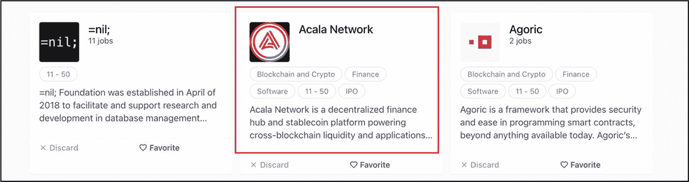
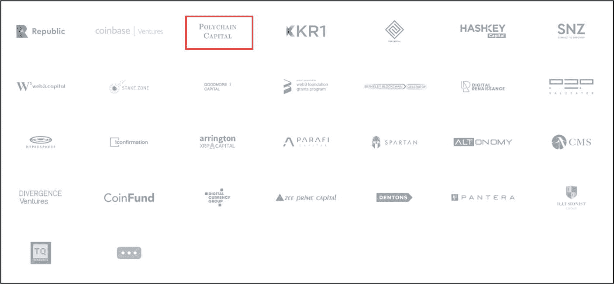

# 专业提示

由区块链研发公司`Web3 基金会`资助的项目在投资者眼中备受推崇。该基金会处于区块链技术和去中心化网络（Web3）的前沿，致力于筛选高质量项目，培育用于去中心化网络软件协议的前沿应用。

## 私募融资优势

-   **早期支持** – 私募融资公司更愿意对早期初创企业承担风险，而机构投资者则通常更青睐成熟项目。
-   **投资灵活性** – 某些私募工具，例如加密货币对冲基金，可以同时运行多头和空头策略，而私募股权和风险投资基金通常只做多。即便如此，与大多数传统机构基金相比，私募工具通常受到的投资组合授权限制更少。
-   **速度快** – 私募融资轮次比机构投资完成得更快，后者通常涉及更多的繁文缛节和尽职调查。
-   **关系更紧密** – 天使投资者和其他私募出资方通常会促进更密切的个人关系，从而带来更多信任、更好的沟通和共识。
-   **信誉背书** – 私募融资为项目增加了可信度和合法性，因为私募融资公司通常会进行透彻的技术和基本面分析。
-   **快速获得资金** – 通过私募融资，项目可以通过招聘顶尖人才、加速开发和运营、资助大规模营销活动等方式快速扩张。
-   **高风险投资** – 私募投资者，尤其是那些风险承受能力高的投资者，比机构投资者更愿意支持高风险项目。
-   **战略合作伙伴关系** – 除了资金，私募融资公司往往还提供战略指导、运营专长以及人脉资源，例如其他投资者、潜在客户和合作伙伴，这些都有助于项目获得高价值的战略合作。
-   **监管推动** – 当大量私募资本涌入一个区块链项目时，可能会使该项目（有时甚至是整个行业）进入监管机构的视野，从而可能加速制定更清晰的合规和披露规则。
-   **增加流动性** – 对冲基金和类似的私募投资者通常采用短期策略来提高市场流动性，使散户和机构参与者都能受益。
-   **专业知识和经验** – 私募融资公司经常带来专业的知识、运营经验和战略专长，帮助项目克服复杂的挑战。

## 私募融资劣势

-   **市场波动性** – 如果没有合适的归属时间表，私募股权公司大规模撤资可能会对散户投资者产生负面影响，导致代币价格下跌和市场波动加剧。
-   **资金有限** – 私募融资通常比机构投资提供的资金少，可能不足以支持大型项目。
-   **监管审查** – 私募融资可能会吸引监管机构更多的关注，从而带来额外的合规要求和审查。
-   **高股权占比** – 根据风险水平，私募投资者通常会要求较高的股权或代币供应比例。
-   **法律风险** – 非正式或结构不当的私募融资交易可能导致法律诉讼，尤其是在监管合规问题未得到解决的情况下。

## 私募投资评估

私募融资对项目可能非常有利，尤其是当资金来自信誉卓著的融资公司时。然而，一些加密货币项目会虚假声称获得了知名私募融资公司的支持，以提高自身可信度。因此，投资者在投资前，必须核实项目团队所做的任何私募融资声明，以及他们的过往业绩、声誉和能力。

### 核实私募融资

投资者应通过直接与融资来源确认，来核实任何私募融资的声明。这旨在确定团队是否值得信赖、透明且诚实。一个简单的检查就能确认某家私募融资机构是否投资了一个项目。例如，图 15-3 显示`Acala Network`声称`Polychain Capital`是其项目的私募投资者。这一点可通过`Polychain Capital`的官方网站（图 15-4）得到验证，网站上显示`Acala`是其投资组合的一部分。

图 15-4

`Polychain Capital`——在其投资组合中确认`Acala Network`（图片来源：[`jobs. polychain. capital/ companies`](https://jobs.polychain.capital/companies)）

图 15-3

`Acala Network`的投资者（图片来源：[`acala. network/`](https://acala.network/)）

### Crunchbase

投资者可以使用`Crunchbase`来核实一家知名的风险投资公司是否投资了一个项目。`Crunchbase`是一个为销售专业人士、CEO、风险投资家和投资者提供实时公司数据的平台。例如，通过使用`Crunchbase`，投资者可以核实项目声称已获得的任何融资、筹集了多少资金以及资金来源。以`Acala Network`从`Polychain Capital`获得融资为例——这一点已通过`Crunchbase`平台得到验证；见图 15-5。

图 15-5

通过`Polychain Capital`验证`Acala Network`的融资（图片来源：[`www. crunchbase. com/ funding_ round/ acala-network-series-a--bf148606`](https://www.crunchbase.com/funding_round/acala-network-series-a%252D%252Dbf148606)）

### 私募投资者的声誉与角色

项目通常从多家私募投资公司获得资金，其中一些可能不像`Polychain Capital`、`Coinbase Ventures`、`Pantera Capital`或`Blockchain Capital`这样知名。因此，对于长期投资者而言，研究和评估这些不太知名的公司的声誉及区块链经验至关重要。

此外，私募投资者通常能提供远超单纯资金的价值。如前所述，新成立的初创公司迫切需要并从经验丰富的私募投资公司那里获益良多，这些公司能提供优质的指导、专业知识以及专业人脉资源，助力项目充分发挥潜力。

在分析私募投资公司时，建议采用以下分析标准进行评估。可靠的公司信息通常可以通过在线研究获取，包括其官方网站和各种区块链社区论坛。

1.  **过往业绩**
    1.  他们此前资助过哪些区块链项目？
    2.  他们此前资助的项目成功吗？
2.  **投资方式**
    1.  他们通常在一个项目中投资多长时间？
3.  **声誉**
    1.  在网上能否找到关于该投资公司的负面或正面评价？
    2.  他们在区块链社区中的口碑如何？
4.  **超越资本的价值**
    1.  除了资金，他们是否提供指导和技术专长？
    2.  他们的顾问在区块链领域是否拥有良好、可信的声誉？
5.  **合作关系与网络**
    1.  他们能否带来战略联系和专业人脉网络？

### 行动步骤

请按照以下步骤验证和评估项目的私募融资情况，包括评估相关投资公司的声誉和专业知识。

1.  **私募投资公司**
    浏览项目的官方渠道（如项目官网和博客），获取团队声称的私募投资公司名单。
2.  **资金验证**
    验证项目声称已获得的任何融资。
    1.  访问私募投资公司的网站，查看其投资组合以核实项目融资情况。
    2.  此外，通过`Crunchbase`平台进一步核实任何融资信息。
3.  **调研**
    按照“私募投资者的声誉与角色”部分概述的评估标准，对每家私募投资公司进行调查。
4.  **做笔记并用你自己的方式记录发现**
5.  **将发现与基本面评估流程的其他部分相结合**

#### 结果评估

私募投资者在区块链领域拥有良好的声誉、可靠的过往记录和高水平的专业知识，并能将这些优势惠及项目，这无疑是值得赞赏的。然而，并非要求项目必须拥有私募融资，只要项目能从其他渠道获得充足资金、拥有足够的专业人脉以及内部技术专长来执行其愿景即可。

## 公开发行

**评估目标：将项目的公开发行融资模式评估为潜在的投资机会。**

区块链领域的公开发行通常指向公众出售数字代币以筹集资金的过程。这些代币销售通过加密货币项目使用的各种公开发行模式来执行，以便为开发价值主张获得资金。项目团队选择的公开发行方案类型受多种因素影响，包括融资金额、融资上限、开发阶段、监管考量、复杂性、可信度和信任度。

### 公开发行模式类型

本节将探讨不同类型的公开发行模式。了解每种融资模式的风险、缺点和局限性，有助于投资者在参与公开发行的代币销售时做出明智的投资决策。

#### 首次代币发行 (ICO)

**示例：** [以太坊 ICO](https://icodrops.com/ethereum/) 和 [IOTA ICO](https://icodrops.com/iota/)

首次代币发行 (ICO) 是一种创业项目筹集资金的过程，作为交换，投资者获得受密码学保护的数字资产，这些资产旨在成为该项目在去中心化应用 (dApp) 上未来产品或服务的唯一支付手段。在 ICO 中，项目团队从头到尾组织和管理整个代币发行。这包括在代币销售后直接向 ICO 参与者分发代币（或币）、处理监管问题（如有）、以及通过官方渠道（如项目网站、博客或第三方 ICO 广告网站）制定和执行营销策略。

ICO 通常面向散户投资者，为他们提供在项目早期开发阶段获得早期参与的机会。ICO 参与者投资比特币 (BTC)、以太坊 (ETH)、泰达币 (USDT) 等数字资产，有时也使用法定货币，以换取项目的代币。这些代币（或币）可能代表持有者的各种权利或利益，例如访问产品服务、治理权，或某种形式的实用性和网络参与权。然而，从投资者的角度来看，投资 ICO 的核心原因之一是为了获得短期或长期的财务收益。

尽管 ICO 有时能带来丰厚利润，但必须指出，与已建立的项目相比，它们被视为高风险投资。大多数通过 ICO 筹集资金的“加密货币”项目尚未拥有可用的产品或服务。这实质上意味着 ICO 参与者主要是在押注项目背后的团队。此外，除非高端机构或私募投资公司已经为 ICO 项目提供了资金，否则这些项目极不可能经受过专业、严格、复杂且昂贵的审计，这给 ICO 参与者带来了极高的风险。对于 ICO，无法保证项目或公司本身的质量或合法性，也无法保证代币或币的价值。许多“骗局”项目通过 ICO 募资，但很少或根本没有履行其承诺的意图。由于普遍存在的欺诈担忧，监管机构已经采取了打击行动——例如，美国证券交易委员会 (SEC) 在执法行动中一再裁定许多 ICO 属于未经注册的证券发行，并对多个发行方提起了诉讼。

**了解你的客户 (KYC)** 是金融机构和企业用于验证潜在投资者身份以防止洗钱或欺诈等非法活动的流程。许多 ICO 对投资者施加了`KYC`限制。这会因为增加额外步骤而减少潜在投资者数量，延长通过 ICO 筹集资金所需的时间，并可能影响其整体表现。投资者可以通过 [ICO Drops](https://icodrops.com/)、[CryptoRank](https://cryptorank.io/active-ico) 和 [ICO Holder](https://icoholder.com/) 等网站查找并获取 ICO 列表信息。参与 ICO 通常通过项目官网进行。

**成功的 ICO 案例包括**

[以太坊 ICO](https://icodrops.com/ethereum/) – [以太坊](https://ethereum.org/en/) 是一个智能合约和去中心化应用平台。它在 2014 年的 ICO 中筹集了约 1600 万美元，以每枚 0.31 美元的价格出售其代币。以太坊在 2021 年达到了 4878 美元的历史最高价。

[NEO ICO](https://icodrops.com/neo/) – [NEO](https://neo.org/) 是一个中国区块链项目，旨在通过数字资产、数字身份和智能合约打造智能经济。NEO 在 2015 年至 2016 年的 ICO 中筹集了约 505 万美元，以每枚 0.032 美元的价格出售代币。这些代币在 2018 年达到了 196 美元的历史最高价。