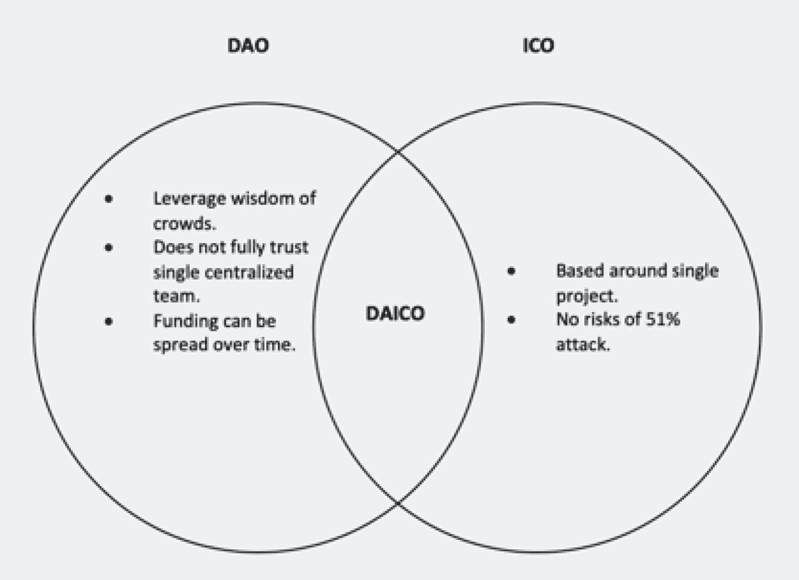

# 众贷

**示例：** [Polkadot 网络](https://www.polkadot.network/) 和 [Kusama 网络](https://kusama.network/)

加密货币众贷是一种区块链项目筹集资金并获得社区支持的新方法。与 ICO、IEO 和 IDO 等传统筹资活动（新的初创公司基本上向投资者出售代币）不同，在众贷中，项目向更广泛的社区借入代币（或币），然后利用筹集的资金为项目增加价值。作为回报，出借代币的社区成员会获得项目原生代币或其他激励作为奖励——可以将这些奖励视为普通贷款的利息。项目概述的预定条款和条件将规定此类标准，例如众贷的开始和结束日期、参与方式、奖励结构，以及借款人何时将最初出资返还给他们。

利用众贷筹资机制的知名项目示例有 [Moonbeam 网络](https://moonbeam.network/) 和 [Moonriver 网络](https://moonbeam.network/networks/moonriver/)。这两个网络都从更大的社区借入资金（DOT、KSM），并将筹集到的资金分别用于竞拍并赢得 [Polkadot 网络](https://www.polkadot.network/) 和 [Kusama 网络](https://kusama.network/) 上的 [平行链](https://wiki.polkadot.network/docs/learn-parachains) 插槽。筹集到的资金还用于支付每条平行链约两年的租约费用。他们通过在整个平行链租约期内锁定筹集到的代币来实现这一点。因此，筹集到的代币在整个平行链租期内被锁定在众贷模块中，项目方无法动用或转移；在租期结束时，所有出资参与者的出资将被返还。此外，所有贡献者都会获得线性分配的奖励（GLMR 和 MOVR），作为对其努力的认可。

Polkadot 数字拍卖过程的核心优势之一是其独特的“蜡烛拍卖”流程。传统的开放式数字拍卖容易发生“拍卖狙击”，即竞标者等到最后一分钟试图“狙击”出价。然而，通过 Polkadot 的“蜡烛拍卖”流程，可验证随机函数（VRF）决定了在拍卖期最后七天内的实际结束时间。这鼓励竞标者尽早真诚出价，使过程更加公平且不易被操纵。

### DAICO 融资

**示例：** Aragon 和 [MolochDAO](https://molochdao.com/)

2018 年，以太坊创始人 Vitalik Buterin 提出了一种去中心化自治首次代币发行（`DAICO`）。`DAICO` 是一种募资模式，旨在通过将 ICO 的收益锁定在去中心化自治组织（`DAO`）的智能合约中，来增强投资者对 ICO 的信任。投资者被赋予投票权，这使得贡献者能够在关键里程碑未达成时，投票调整或停止“水龙头”（一种每秒滴流的资金机制），而不是审批每一笔具体支出。

`DAICO` 是对 ICO 和 `DAO` 最佳理念与概念的一次独特融合，旨在保护投资者的资金免受诈骗和项目业绩不佳的影响。与 ICO 类似，`DAICO` 首先发起一次募资活动，投资者贡献（例如 `ETH`、`USDT`）以换取项目的原生代币。然而，与 ICO 不同的是，`DAICO` 拥有一个“水龙头”机制。该“水龙头”的唯一目的是允许 `DAO` 以秒为单位控制项目团队可获得的资金金额（资金分配）。因此，团队在任何特定时间点可用的资金量都受到限制。

资金通过 `DAICO` 筹集；其中一部分将预留给团队、开发、市场营销、国库、奖励、流动性等用途。例如，如果向开发者分期付款（例如每月一次），而开发者需要的资金超过了“水龙头”当前的出水量，他们必须请求代币持有者投票提高“水龙头”的速率；治理机制不能批准一次性的大额支付——只能调整（或停止）这种持续的资金流。`DAO` 有机会限制资金的访问权限，这有助于降低团队操纵代币和资金的风险。这种协同模式使得资金募集和分配尽可能透明和安全。此外，它赋予了代币持有者权力和控制权，从而保护了他们的投资。

在 `DAO` 的治理结构中，股东可以对特定的代币相关决议进行投票，包括提高“水龙头”（增加流向团队的资金量）或永久自毁合约，届时代币持有者将按比例提取剩余资金。这旨在防止团队操纵代币和资金，督促其对高质量的工作和项目进展负责，并信守其在白皮书和路线图中做出的承诺与定义的里程碑。

`DAICO` 的融资和治理模型在很大程度上仍处于理论阶段——仅有少数几个项目尝试过，目前尚无大规模的、长期运行的实例。然而，人们期望它能使得 ICO 资金的治理更加民主化，并为投资者提供一定程度的防欺诈保护。

**图 15-6** DAO-ICO 组合模型（图片致谢：DAO-ICO 组合：[`www.garbcan.com/blockchain/developing-better-initial-coin-offerings-icos-an-overview-of-daicos/`](https://www.garbcan.com/blockchain/developing-better-initial-coin-offerings-icos-an-overview-of-daicos/)）

### 优势

-   **民主化** – 允许非合格投资者参与代币销售，促进更具包容性和民主性的代币销售。
-   **信任与透明度** – 举行公开代币销售的项目通常会接受公众监督，经过尽职调查后可以增加信任度和可信度。
-   **社群精神** – 允许公众参与代币销售，能在社区中营造积极且令人振奋的氛围。
-   **平衡的代币分配** – 公开代币销售有助于确保代币分配更均衡、更去中心化，从而有利于网络安全和稳定。
-   **公众认知度** – 更多元化的投资者选择可以提升项目知名度。
-   **灵活性** – 允许包括开发者在内的团队做出更高效的决策，而不受大型私人或机构投资者的约束或限制。
-   **洞察力与创新** – 广泛的公众投资者群体可以带来来自不同行业、不同人群的深刻见解、观点和意见，从而提高创新水平。

### 劣势

-   **缺乏问责制** – 由于对公开代币销售筹集的资金监督、问责和关注较少，常常导致资金滥用。
-   **项目可行性** – 当仅依赖公共资金时，项目可能无法获得私人或机构投资公司的专业评估，从而降低了可信度。
-   **规模与增长** – 通常，公共资金无法提供足够的资本供项目发展并充分发挥其潜力。
-   **监管审查** – 各种公共筹资方式（例如 ICO）都面临过严格的审查和监管挑战，这给项目带来了不确定性和潜在的法律问题。
-   **战略指导** – 当仅依赖公共资金时，项目无法获得来自私人或机构投资公司的额外支持和指导。

### 公募模式总结

表 15-3 总结了各种类型的公共筹资模式。请注意，没有绝对正确或错误的模式类型；这完全取决于项目的范围和需求。然而，每种筹资模式都有许多明显的优点和缺点。项目团队和利益相关者有责任选择一种符合项目筹资目标、以及可能限制某些公众投资者参与的公开销售监管限制的模式。

**表 15-3** 公募 `ICO`、`IEO`、`IDO`、`STO` 和众筹对比

| 公共融资方式概述 |
| --- |
| 评估标准 | 首次代币发行（ICO） | 首次交易所发行（IEO） | 首次去中心化交易所发行（IDO） | 首次农场发行（IFO） | 证券型代币发行（STO） | 众贷 | DAICO 融资 |
| --- | --- | --- | --- | --- | --- | --- | --- |
| **募资托管平台** | 项目官网 | 中心化交易所（`币安 Launchpad`、`Gate.io`） | 去中心化交易所（`PancakeSwap`、`TrustSwap`、`Polkastarter`） | 去中心化交易所（`Pancake-Swap`） | 受监管平台（`Polymath`、`Securitize`、`Tokensoft`） | `波卡`、`Kusama` | `BUIDL-1` |
| **项目示例** | `以太坊 ICO`、`IOTA ICO` | `Band 协议`、`Polygon 网络` | `Astar 网络`、`Mantra DAO`、`Ferrum 网络` | `Duet 协议`、`Horizon 协议` | `tZERO (TZROP)`、`INX Limited (INX 代币)` | `Moonbeam 网络`、`Acala 网络` | `The Abyss`（类 DAICO 模式） |
| **监管要求** | 通常无监管 | 通常无监管 | 无监管 | 无监管 | 严格监管 | 无监管 | 无监管 |
| **筛选强度** | 低（由社区） | 高（由交易所） | 中等（由 IDO 平台） | 中等（由 IDO 平台） | 中等（社区、平台） | 低（由社区） | 中等（由 DAO） |
| **参与门槛** | 面向公众 | 特定交易所用户 | 面向公众 | 面向公众 | 通常要求合格投资者 | 面向公众 | 面向公众 |
| **KYC/AML** | 视情况而定 | 必须 | 无需 | 无需 | 必须 | 视情况而定 | 必须 |
| **募资成本** | 低 | 中等 | 低 | 低 | 中等 | 低 | 低 |
| **营销责任方** | 项目团队 | 项目团队与交易所（联合营销） | 项目团队与 IDO 平台 | 项目团队与 IDO 平台 | 项目团队 | 项目团队 | DAO |
| **自动上币** | 否（需联系交易所） | 是 | 是 | 是 | 视情况而定（取决于 STO 平台） | 否（需联系交易所） | 否（需联系交易所） |
| **流动性水平** | 中等（视情况而定） | 高 | 中到高（取决于流动性提供者数量） | 高 | 高（可能有部分限制） | 中等（视情况而定） | 低到中等 |
| **投资者保护** | 低（有限） | 中等（交易所保险、KYC 及 AML） | 无 | 无 | 高 | 低（有限） | 中等 |
| **发行方/项目方成本** | 适中 | 高（上币费） | 低 | 低 | 高（法律与合规成本） | 低 | 低 |
| **复杂程度** | 适中 | 适中 | 低 | 中等 | 高 | 中等 | 中等 |
| **执行速度** | 中到慢（取决于产品与营销） | 中到快（用户触达广，有部分限制） | 快（触达广泛，无限制） | 快（触达广泛，无限制） | 慢（受监管影响） | 中到快（取决于融资模式） | 中到快（取决于 DAO 的效率和结构） |
| **中心化程度** | 低到中等 | 高 | 去中心化 | 去中心化 | 高 | 中到高 | 大部分去中心化 |

### 公开发售评估

机构投资者和私人投资者在对任何项目进行投资前，都会进行复杂的评估和尽职调查。他们的专家团队会深入钻研项目的方方面面，然后才做出投资决策。然而，对于公共融资，责任主要落在普通公众、社区和散户投资者身上。投资者也可以应用特定的检查方法来评估公开代币销售，具体方法将在以下章节中概述。首先，识别代币分配模型至关重要。分配公开发售代币有两种方法或模型：公平`启动`和`预挖`代币模型。

#### 公平启动与预挖模型

代币分配有两种发行方式：公平`启动`或`预挖`。项目所采用的模型类型会影响公开发售代币的分配方式。例如，在公平启动中，代币会分配给那些提供价值的活跃协议参与者。另一方面，预挖模型则通过更常见的方式（如 ICO、IEO、IDO 或众贷）来分配代币。

