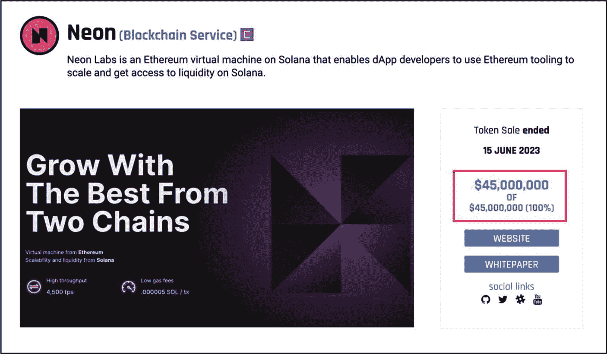
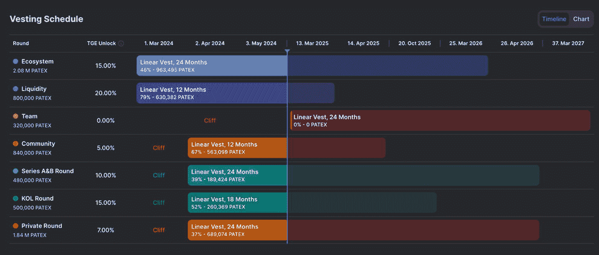
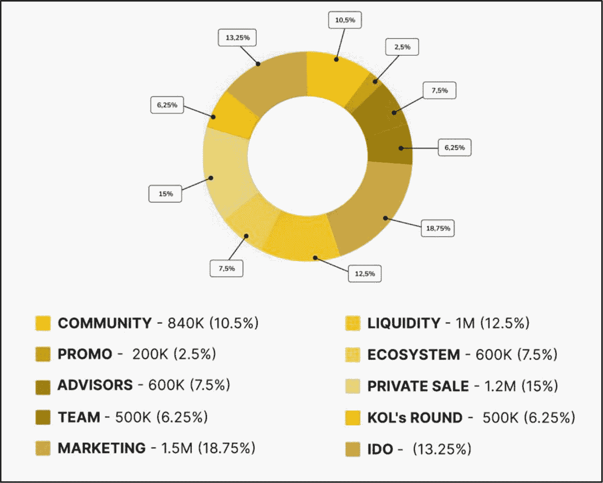
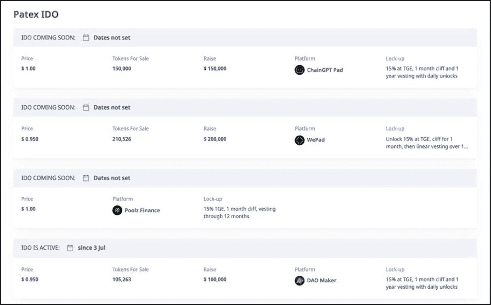

# 预挖发射

**示例：** [瑞波币](https://ripple.com/) 和 [恒星币](https://stellar.org/)

与公平发射模式相反，如今启动的大多数项目都采用预分配（通常称为“预挖”）方式。顾名思义，在预挖发射中，一定比例的总原生资产在发射前被预先挖出并分配给特定群体（例如创始团队、顾问、生态发展、投资者、私募和公募投资者等）。尽管这种方法有许多好处，但它通常会导致代币在初期高度集中于少数人手中（具体取决于代币分配结构），这可能引发中心化控制。有关代币分配细节的更多信息，请参见第 8 章“代币经济学”中的“代币分配模型”部分。

### 优势
*   **推动项目启动** – 项目团队可以高效地出售预挖资产，以在营销、合作、开发等关键领域启动项目，从而更有效地推动项目启动。
*   **激励开发者** – 分配给开发者的预挖资产有助于激励其持续进行开发。
*   **私募融资优势** – 来自私募投资公司的资金可以做好充分的财务准备，并为项目团队提供专业建议和策略，以辅助成功发射。

### 劣势
*   **崩盘风险** – 如果没有合适的代币分配模型，由于代币集中在少数人手中，项目面临很高的失败风险，这会导致过度中心化和治理问题。
*   **社区不信任** – 可能导致社区缺乏信任，尤其是在存在不公平或缺乏透明度认知的情况下。
*   **市场操纵** – 在发射时及随后的几周内，大型代币持有者施加巨大抛售压力的风险很高。

## 简化筛选公开发行项目

查看正在进行和计划中的公开代币销售（包括 `ICO`、`IDO` 和 `IEO`）最有效的方式是通过专门的加密货币市场洞察和分析平台进行搜索，例如 [ICO Drops](https://icodrops.com/)、[CryptoRank](https://cryptorank.io/active-ico) 和 [ICO Holder](https://icoholder.com/)。虽然公开发售项目很诱人，但切勿想当然地认为，仅仅因为它们是在合法平台上做广告和托管，风险就降低了——事实并非如此。这些网站很大程度上是列表聚合器，并不会对项目进行全面的尽职调查。这些平台上会持续推广新的加密货币初创公司，宣称它们将是下一个大项目。然而，鉴于新的加密货币初创公司风险最高，并且大多数在最初的炒作热潮过后就销声匿迹，因此在投资任何公开发售（`ICO`、`IEO`、`IDO`、`IFO` 等）之前，进行充分的尽职调查至关重要。投资者有责任避开公开发售骗局，同时识别出基础面强劲、风险最低且投资回报最高的项目。

在本节中，您将找到一系列快速基础检查清单，旨在帮助您筛选出骗局和基础面糟糕的项目。其目的是通过突出值得进一步关注的投资机会，来帮助简化您的公开发售项目筛选过程。但请注意，这些检查只是起点，一旦确定了初步筛选出的潜在公开发售投资项目，就需要按照本书所述进行完整、详细的基础面评估。

### 项目概要
每个为特定项目宣传 `ICO`、`IDO`、`IEO` 等公开发售的网站，都会包含一份价值主张摘要。例如，图 15-7 展示了摘自 [CryptoRank](https://cryptorank.io/) 的 [Patex Network](https://patex.io/) 的详细信息。这些细节至少应包括：公开发售类型（如 `IDO`）、硬顶（45 万美元）、项目分类（如区块链基础设施），以及项目及其价值主张的摘要。

图 15-7

[Patex Network](https://patex.io/)——CryptoRank.io 上的项目概要（图片致谢 [`​cryptorank.​io/​ico/​patex`](https://cryptorank.io/ico/patex)）

> **警告**
> 
> 那些缺乏技术评估能力的影响者，有时会被操控，去推广基本面很差且通常带有诈骗性质的公开发售项目。投资者必须自行进行基本面评估，不要依赖那些毫无可信度的影响者所传播的二手信息。

顾名思义，项目概要是对项目价值主张的简要总结。一份好的概要应当精确且切中要点。它应该包含关键信息，包括对独特用例及其所解决问题的简短描述。简而言之，高质量的用例能够解决已知问题——无论是针对加密货币项目还是传统中心化公司——或者提供某种价值主张，以补充如以太坊和比特币等重大项目，为整个区块链生态系统增加价值。投资者在审核公开发售项目的概要部分时，必须注意以下危险信号。

- **细节模糊** – 缺乏关于产品或服务的具体技术信息以及相应的价值主张。
- **资金分配不明确** – 硬顶不清楚，或未说明资金将如何在项目内使用。
- **时间线不清晰** – 关于代币生成事件、产品发布或其他关键里程碑没有明确的时间线。
- **模仿项目** – 用例或产品描述听起来与比特币或以太坊等重大项目相似。
- **匿名团队** – 没有提供关于团队（创始人、开发者等）的可见信息或资质证明，或者团队明确声明将保持匿名。
- **不合规** – 无视 `KYC/AML` 要求或其他法律准则——这对于受监管的发售（如 `STO`）是一个重大危险信号，但即使在无需许可的发售（如许多 `ICO` 或 `IDO`）中也值得注意。
- **语法错误** – 拼写错误或语法混乱表明缺乏专业性。

> **警告**
> 
> 当我刚开始投资数字资产时，我向一个骗局 `ICO`（首次代币发行）发送了一个 `ETH`。我受到了花哨、诡诈营销的影响，情绪占据了上风。直到发现自己被骗后，我才认真查看了那个网站。我注意到上面有很多拼写错误、低质量的图片、虚假的领英资料以及写得很差的白皮书。这是宝贵的教训。研究和尽职调查是关键。

### 软顶与硬顶
当加密货币项目通过公开代币销售获取资金时，会使用特定的财务参数，即*软顶*和*硬顶*。软顶和硬顶代表了项目旨在筹集的最低和最高资金额度。

**软顶** 是项目为能够启动或继续开发而旨在筹集的最低金额。它被视为项目在其路线图中实现基本目标所需的最低可行资金。如果未达到软顶，资金通常会返还给参与者——但前提是代币销售智能合约中编写了退款功能，因此投资者在出资前应始终审查这些条款。

**硬顶** 是项目旨在筹集的最高金额。项目资源需求决定了硬顶，通常包括用于开发、营销、运营、法律合规等领域的资金。一旦销售达到最大代币数量或筹集到目标资金金额（例如 100 万美元），则不再接受更多出资，公开融资轮次将关闭。例如，假设一个团队决定设定 3000 万个代币的硬顶，并在公开发售正式结束日期前成功售出此数量，那么无论投资者是否仍有兴趣，代币销售都将结束。筹集的资金使团队能够全力继续开发。硬顶的核心目的是防止项目资金过剩，这可能与资金不足一样有害，因为它可能扭曲代币经济模型，并导致管理不善或资金浪费。

### 硬顶分析
如果公开代币销售的硬顶已达到，这是非常值得称赞的。这表明早期投资者对该项目感兴趣。例如，图 15-8 展示了一个名为 Neon Labs 的项目的公开发售细节——它是一个基于 Solana 的以太坊虚拟机（`EVM`），使 `dApp` 开发者能够使用以太坊工具进行扩展并访问 Solana 的流动性。Neon Labs 设定了 4500 万美元的硬顶，并完全实现了这一目标。Neon Labs 硬顶被触及的事实表明，该项目引起了显著的早期兴趣，这是一个积极信号。此外，不仅硬顶达到了，而且与其他通过公开发售融资的项目相比，4500 万美元的额度也被认为是高的——这表明了强烈的兴趣。

图 15-8

ICO Drops 上的 Neon Labs `ICO`：达到 4500 万美元硬顶（图片致谢 [`​icodrops.​com/​sophiaverse/​`](https://icodrops.com/sophiaverse/)）

> **专业提示**
> 
> 通过评估项目是否已经盈利并需要额外资金，来验证指定融资硬顶的合理性。路线图中是否有重要的开发需求和里程碑？这笔资金是否用于提升公司价值？公司没有融资轮次能否生存？团队是否值得托付筹集的资金？谁控制着筹集的资金：团队、一个 `DAICO` 还是其他人？将这一点与竞争对手过去的融资轮次进行比较。

### 代币标准
审查代币标准有助于深入了解开发团队的工作投入和专业水平。例如，[ERC-20](https://ethereum.org/en/developers/docs/standards/tokens/erc-20/) 代币只需极低技术门槛即可创建。然而，在项目自有公链上发行代币则需要耗费大量精力、投入和专业能力。可以说，从宏观层面看，那些投入大量时间、精力和资源进行开发的项目往往更真实可靠——至少在首次代币发行（`ICO`）阶段如此。相反，旨在欺骗或诈骗的项目通常只会投入最少的时间和资源，企图快速牟取暴利。因此，对于涉及 `ERC-20` 或类似易于创建的代币标准的公开发售，建议格外谨慎并进行更深入的初步筛选。这类代币开发简单，常被试图偷工减料或快速获利的项目使用。投资者也可在项目白皮书中找到代币标准的详细信息。

### 代币单价
单独评估代币单价（或代币价格）可能具有误导性。例如，*项目 A* 公开发售单价为 `0.50 美元`，总供应量为 3000 万枚，其投资回报率（`ROI`）潜力高于 *项目 B*——后者单价同为 `0.50 美元`，但总供应量高达 100 亿枚。基于供需关系，*项目 A*（代币供应量较低）由于稀缺性、市场需求及较低的市值，盈利潜力更大，**价格**和**市值**翻倍的速度也更容易更快。

- *项目 A：市值 = 0.50 美元 x 3000 万 = 1500 万美元*
- *项目 B：市值 = 0.50 美元 x 100 亿 = 50 亿美元*

因此，建议在评估项目代币经济学中的代币单价时，应综合考虑发行时的代币数量以及相关的释放计划——详见第 9 章“财务指标”中“市值与完全稀释估值”部分，其中对此有更详细的讨论。

图 15-9 展示了 Patex Network 代币（`PATEX`）的计划中的首次去中心化交易所发行（`IDO`），代币单价范围为 `0.95 美元` 至 `1.00 美元`。考虑到 Patex Network 的最大代币供应量仅为 `8,000,000`（`PATEX`），并将供应量的 `13.25%` 分配给 `IDO` 参与者（图 15-10），该项目值得进一步研究。更具体地说，基于这些细节，包括颇具吸引力的释放计划（图 15-11），此次 `IDO` 代币单价被认为具有吸引力。

**图 15-11**
[Patex Network](https://patex.io/) — `PATEX` 代币释放计划（数据来源：[`dropstab.com/coins/patex/vesting`](https://dropstab.com/coins/patex/vesting)）

**图 15-10**
[Patex Network](https://patex.io/) — 代币分配（数据来源：[`patex.io/docs/Patex%20WP.pdf`](https://patex.io/docs/Patex%20WP.pdf)）

**图 15-9**
[Patex Network](https://patex.io/) — CryptoRank.io 上的 `IDO` 详情及代币单价（数据来源：[`cryptorank.io/ico/patex`](https://cryptorank.io/ico/patex)）

> **警告**
> 切勿依赖或假定任何第三方网站上项目代币销售信息的准确性。始终通过官方资源（如项目官网、`GitHub`、博客或社交媒体渠道）核实所有项目数据。

### 项目白皮书
如果项目连最基本的白皮书或精简白皮书都没有，请勿投资其公开发售。充斥着空洞术语的劣质白皮书和简陋的网站，仅需几千美元就能轻易生成。有关详细的白皮书评估步骤，请参阅第 3 章“项目文档”。

### 行动步骤
按照以下步骤确定项目的公开发售融资模式，并将其评估为潜在的投资机会。请注意，这主要适用于计划通过预定公开发售活动进行投资的投资者。投资者可通过访问加密货币市场洞察与分析平台（如 [ICO Drops](https://icodrops.com/)、[CryptoRank](https://cryptorank.io/active-ico) 和 [ICO Holder](https://icoholder.com/)）来查看活跃和预定的公开发售项目。

1.  **公平启动或预挖**
    确定项目采用的是*公平启动*还是*预挖*代币分配模式。
    - 每种模式的详细信息通常可在项目的官方网站、白皮书、博客及社交媒体渠道等一处或多处官方渠道中找到。

2.  **公开发售融资模式**
    如果采用预挖模式，需确定项目所使用的公开发售融资模式类型。
    - 请分别查看表 15-3 中概述的公开发售融资模式及对比摘要。
    - 该模式类型是否满足您的投资要求，例如公开发售的参与门槛、`KYC/AML`、筛选强度、监管、投资者保护、中心化程度等？

3.  **简化筛选公开发售项目**
    通过本章讨论并总结如下快速评估步骤，筛选出具有高盈利潜力的公开发售机会。
    - **项目摘要** – 审阅项目摘要，确认是否有清晰的产品描述、价值主张、具体技术细节，以及是否存在模糊描述、团队匿名、缺乏合规性等潜在警示信号。
    - **软顶与硬顶** – 检查软顶和硬顶的详细信息，以判断融资目标是否切合实际，是否与项目路线图中的工作范围一致。此外，还需确定是否存在硬顶上限及其是否已达成。
    - **代币标准** – 确认项目所采用的代币标准类型。由于自身创建带有原生代币的区块链项目涉及的工作量较大，这类项目诈骗的可能性相对较低。
    - **代币单价** – 结合代币经济学（包括总供应量、市值和释放计划）评估代币单价，以判断其实际盈利潜力。
    - **项目白皮书** – 确定项目是否拥有白皮书，及其质量是否优良。
    - **风险承受能力** – 评估您的风险承受能力，除非您能够接受本金可能损失的风险，否则切勿投资。

4.  **全面基础评估**
    对通过公开发售简化筛选流程的项目进行完整的基础评估。

5.  **以您自己的方式记录并整理发现**

6.  **将发现与其他基础评估环节相结合**

### 结果评估
投资公开发售项目风险极高。在早期阶段，团队尚未证明其能力或整体潜力。在许多情况下，甚至没有经过验证的产品概念或可供测试的测试版。因此，投资者本质上是在押注团队能够兑现其承诺。由于五成的新项目在第一年后便会失败，因此在参与公开发售前，建议极度谨慎并进行充分的研究。投资者在参与公开发售前，应根据自身的知识、经验和财务状况仔细评估其风险承受能力。此外，当您预先选定了一个公开发售投资项目后，强烈建议按照本书所述进行完整的、深入的基础评估。

## 合作伙伴关系

**评估目标：确定并评估项目的公开发售融资模式是否构成潜在的投资机会。**

合作伙伴关系是指两方或多方为共同实现惠及各方的目标而达成的合作协议。合作伙伴关系通常形成于利益存在一定程度重叠的公司或个人之间，从而有助于改善彼此的表现、共享资源并为所有相关方创造可衡量的价值。然而，在区块链领域，某些合作伙伴关系往往更注重表面光鲜而非实质内容。

例如，有些合作伙伴关系能带来实际价值——如改进产品、扩展生态系统或解决实际问题——而另一些则只是作秀，目的是吸引投资者的关注。此外，许多公司仅因从另一家公司获得了服务，就宣称建立了“合作伙伴关系”——这并非真正的合作。作为投资者，辨别哪些合作伙伴关系是真实且能提供实际价值的，哪些并非如此，至关重要。

区块链世界中的合作伙伴关系有多种类型，涵盖加密对加密、基于区块链的中心化对中心化，以及加密对中心化的合作。本节将讨论各种类型的合作伙伴关系，以及那些真正能提供价值的合作。

### 加密对加密（C2C）商业伙伴关系

加密对加密（C2C）伙伴关系是指在区块链领域内，两个加密项目之间直接建立的合作关系。这类合作关系通过实现平台集成、共享基础设施、增强流动性和扩展生态系统，从而提升加密产品与服务的价值。合法的 C2C 伙伴关系还能通过将项目介绍给彼此的社区来促进双方发展，这意味著更多的用户、开发者以及整体机遇。

**温馨提示**

为了提升知名度，项目方赞助各类活动已相当普遍。例如，`Crypto.com` 赞助了 2022 年 FIFA 世界杯和终极格斗冠军赛（UFC）。尽管这完全可以接受，但请注意，这并非合作关系，而仅仅是赞助协议。虽然并非`Crypto.com`，但有些项目将赞助协议粉饰为合作伙伴关系，这是不准确且具有误导性的。

C2C 伙伴关系的一个例子是 [Immutable](https://www.immutable.com/) 与 [Polygon Labs](https://polygon.technology/) 的合作。`Immutable` 是一家领先的 Web3 游戏公司，与主要 Layer 2（L2）区块链扩容平台 `Polygon Labs` 合作，共同推出了 `Immutable zkEVM`，这是一个专为游戏设计的、兼容以太坊的 L2 扩容解决方案。对于游戏社区来说，这堪称梦想成真，因为它通过提高可扩展性、速度和安全性，降低交易成本，增加新的游戏内功能，从整体上让游戏体验更流畅、更愉悦。

`Immutable` 与 `Polygon Labs` 的合作也使双方公司直接受益。例如，这次合作在游戏方面取得的进步吸引了更多的开发者和玩家加入 `Immutable` 生态系统。同时，`Polygon` 巩固了其在游戏领域的声誉，获得了更高的曝光度和可信度，从而促进了 `Polygon` 的 zkEVM 技术的采用，并为新的合作打开了大门。

**专业提示**

在评估和验证合作伙伴关系时，建议将所有声称的合作关系视为不存在或充其量是低质量的——“在证明清白之前，先视为有罪”。

### 加密货币与实体经济（C2T）企业合作

加密货币与实体经济（C2T）合作是指加密项目与专注区块链的传统企业之间的协作。C2T 合作旨在将区块链技术与传统业务相结合，从而为双方带来诸多益处。例如，加密项目与知名、成熟的传统企业合作，有助于提高其在区块链领域的采用率和可信度。传统企业通常通过提供各种集成方案、财务资源和行业专业知识来补充区块链公司的不足。另一方面，实施区块链解决方案可以提高运营效率，帮助简化流程、降低成本，并利用智能合约以去信任的方式实现流程自动化。将区块链与传统企业相结合，可以充分利用区块链的基本特性，从而全面推动创新和产品开发。

一个 C2T 合作的例子是 [Solana Pay](https://solanapay.com/) 与 [Shopify](https://www.shopify.com/) 的协作。`Solana Pay` 是一个构建在 [Solana](https://solana.com/) 区块链上的部分去中心化支付协议，它与大型电商平台 `Shopify` 合作，允许商家接受以 `USDC`（一种与美元挂钩的稳定币）进行的支付。这为传统信用卡支付提供了一种无缝且经济高效的替代方案，商家和客户无需中介即可进行交易，成本更低。客户可以享受隐私保护，无需共享敏感的财务信息，并且通过加密支付集成，支付可以即时结算，无需担心汇率或额外费用。因此，这种类型的合作为 `Shopify` 等平台及其客户，以及为推动区块链的广泛普及和应用带来了巨大价值。

**警告**

为了获得知名度和可信度，加密项目可能会在其营销策略中包括被 `福布斯`、`彭博社` 或 `纽约时报` 等知名权威出版物报道的计划。尽管这些报道可能会吸引更广泛的受众和潜在投资者，但它们并非真实的新闻报道，更宜归类为付费推广。

### 传统对传统（T2T）企业合作

传统对传统（T2T）合作是指两个专注加密领域的传统企业为了推进其共同的兴趣和目标而进行的合作。这类合作对于使区块链技术在现实世界中应用至关重要，因为它们有助于建立信任，并为加密领域之外的个人参与数字资产创造便捷的入口。

一个与加密相关的 T2T 合作例子是 [Paxos](https://paxos.com/) 与 [PayPal](https://www.paypal.com/us/home) 的合作。`Paxos` 是一家受纽约金融服务部监管（获许可并接受其监督）的支付公司，为购买、出售和持有各种数字资产的 `PayPal` 用户提供底层的托管和流动性支持。此外，`PayPal` 的数字美元 “`PayPal USD`” （[PYUSD](https://www.paypal.com/us/cshelp/article/what-is-paypal-usd-pyusd-HELP1005)）稳定币由美国国库逆回购协议支持，并“以美元存款、短期美国国债和类似的现金等价物作为支撑”。请注意，这种类型的合作提供了巨大价值，有助于无论市场状况如何，都能推动区块链技术和数字资产的普及。

**事实**

最强大的合作是那些能够对产品或服务产生积极影响并增加显著价值的合作。任何其他的合作都可以被视为薄弱或不相关的合作。

### 非合作关系的案例

识别骗局或低质量合作与识别高价值合作同样重要。欺诈项目通常会声称与信誉良好的公司有合作关系，以提升其可信度，即使实际上并不存在真正的关联，或者他们歪曲了对某公司服务的使用，将其说成是真正的合作。这些声明必须经过仔细审查，以验证其真实性。

因此，核实所呈现的合作类型以及合作双方是否在互相帮助至关重要。这些信息应始终从所涉各方的官方网站、新闻稿或其他可靠来源进行核实。在获得明确证据证明两家公司确实存在关联并正在利用各自的优势来增强产品和价值供给之前，投资者必须保持谨慎。务必通过官方渠道或声称的合作方的新闻稿来验证这些合作关系。对于无法提供其声称合作关系的明确证据的项目，应保持警惕。以下是一些与低质量合作相关的骗局的*虚构案例*。

1.  **Google Cloud 与 PlasmaPenguin 合作**

    区块链项目 `Plasma Penguin` 与 `Google Cloud` 合作，以集成并托管其部分许可区块链。这使得 `Plasma Penguin` 能够扩展其区块链，提供快速交易和低成本。

    **这不是合法合作关系的原因**
    1.  `Plasma Penguin` 只是像其他数千家公司一样，作为付费客户使用 `Google Cloud` 的服务。`Google Cloud` 并非一个有助于共同利益或共享利益的战略合作伙伴。
    2.  在线未找到 `Google Cloud` 发布的任何关于此类合作的官方声明。

2.  **CactusSquid 与 PortGlobal 合作**

    区块链项目 `CactusSquid` 宣布与供应链运营领域的知名全球领导者 `PortGlobal` 建立战略合作伙伴关系，通过创建一个安全透明的分类账来跟踪货物，减少欺诈，并在此过程中全面提高供应链效率。

    **这不是合法合作关系的原因**
    1.  经过仔细调查发现，`PortGlobal` 仅运行了一个小型试点项目来测试 `CactusSquid` 的区块链在其供应链管理系统中的应用——并未做出长期承诺。
    2.  甚至没有证据表明 `PortGlobal` 已在其供应链系统中实施该区块链。因此，该公告完全是基于推测的结果，而非实际采取的行动。
    3.  `PortGlobal` 未向 `CactusSquid` 投入任何资金或共享任何其他资源。`PortGlobal` 仅仅像其他客户一样，同意试用其服务和产品。因此，这不符合真正合作关系的条件。

3.  **Amazon Web Services (AWS) 与 FusionFerret 合作**

    区块链项目 `FusionFerret` 与 `AWS` 合作，通过 `AWS Marketplace` 提供各种区块链解决方案。这使得所有 `AWS` 用户都能接触到这些解决方案，以满足其业务和个人需求的独特应用。

    **这不是合法合作关系的原因**
    1.  `AWS Marketplace` 对任何希望销售其软件产品的企业、实体或个人都是开放的。`FusionFerret` 只是另一个在 `AWS` 平台上销售其产品的供应商——并无特殊之处。
    2.  `AWS` 并未与 `FusionFerret` 协作，共同开发新的创新产品或为实现共同利益而共享资源。
    3.  `FusionFerret` 只是像其他数千家公司一样，使用 `AWS` 的工具。
    4.  在线未找到 `AWS` 发布的任何关于此类合作的官方声明。

**警告**

虚假或误导性的合作关系表明项目团队缺乏透明度和诚信度，这构成了严重的警示信号。

### 行动步骤

遵循以下步骤和注意事项，有助于评估合作关系是否合法，且对双方公司真正有益。

1.  **识别合作方**

    列出项目声称的合作方名单，这些信息通常可以在其官网上找到。请谨慎行事，假设所有声称的合作关系要么不存在，要么被夸大其词。

2.  **查证官方公告**

    合作各方的官方公告至关重要。

    1.  搜索相关公司发布的官方新闻稿或合作确认函。重要的是，合作双方都应通过官方渠道发布正式公告，详细说明合作的类型、价值利益和收益。

    2.  核实多个可信来源的信息是否一致，并确认合作细节。

3.  **确定合作类型**

    确定所涉合作关系的类型，并判断其是否为双方带来价值。

    1.  **加密-加密合作** – 寻找互惠互利点，例如共享基础设施、技术、专业网络及其他相关资源。

    2.  **加密-传统合作** – 验证区块链如何改进传统业务运营，或增加其曝光度和采用率。

    3.  **传统-传统合作** – 确保该合作能在加密领域产生显著的区块链采用率和可用性。

4.  **检查交付成果与资源共享**

    必须明确合作项目的交付成果。

    1.  确定因合作而产生的、可衡量的共同利益或增值成果。这可能是一个创新的产品，或能够补充现有用户或生态系统的特定增值点。

    2.  检查共享资源，例如网络集成、技术基础设施（如预言机、API 和第 2 层扩展解决方案）、技术、生态系统工具、用户基础、流动性、金融资本、人力资本与专业知识等。

5.  **价值与收益**

    确定该合作关系是否让每个合作方都受益并创造价值。

    1.  例如，像 [Graph](https://thegraph.com/) 和 [Fantom Network](https://fantom.foundation/) 这样的“加密-加密”合作，促进了跨链互操作性。这项合作通过使 *The Graph* 能够支持跨多条区块链查询数据，同时让 Fantom 开发者能够使用这些工具构建应用程序并与以太坊进行跨链兑换，从而增加了显著价值。

6.  **调查合作方的可信度**

    研究相关合作方的过往记录，以判断其是否合法且信誉良好。合法的合作关系会公开其条款和收益。如果细节含糊不清或过度炒作，请深入调查或保持距离。

7.  **做笔记并以你自己的风格记录发现**

8.  **将发现结果与基础评估流程的其他部分相结合**

#### 结果评估

如果评估的合作关系是合法的——双方均已确认，存在明确的共同价值，且有清晰的交付成果——则视为绿灯。反之，如果对双方均无实际价值，网上缺乏相关证据，或交付成果含糊不清，则建议在进行更深入的研究之前，暂时避免投资。如果项目方试图欺骗投资者，让他们相信已经获得了合法的合作，那么真正的问题是：他们还在哪些事情上撒了谎？请将此视为一个危险信号。投资者有责任确定项目团队声称的所有合作关系都是强有力的、有效的且可信的。