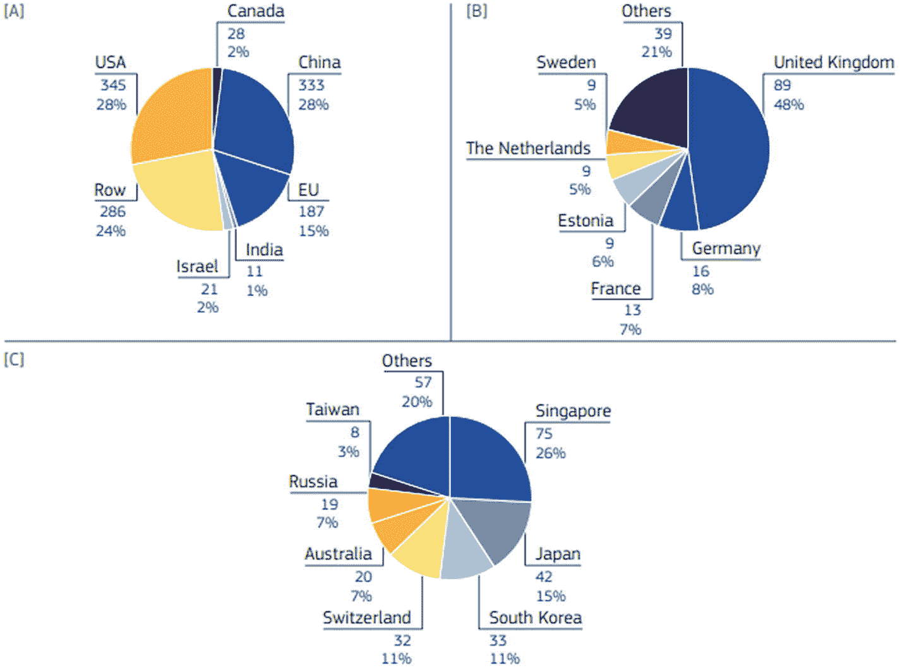
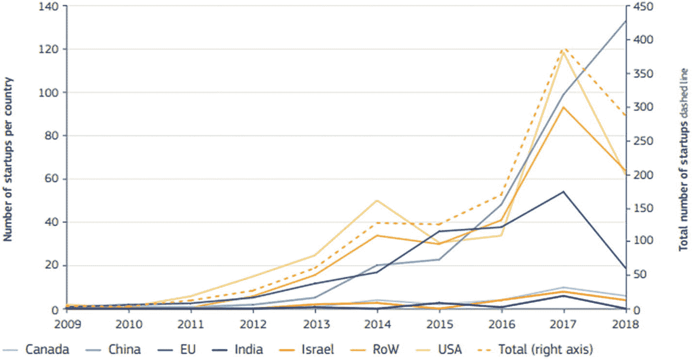
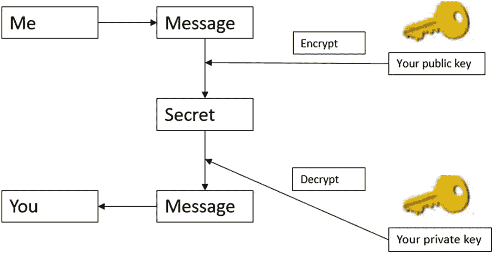
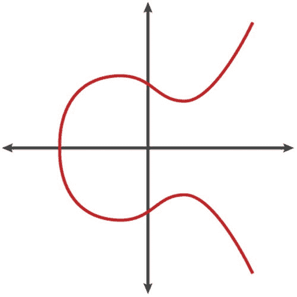
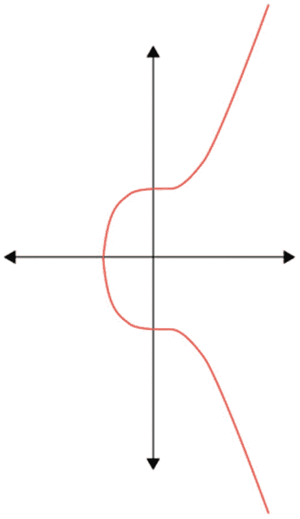
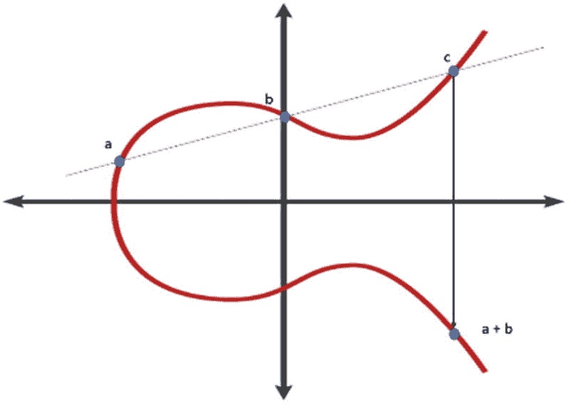
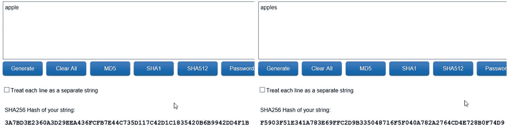
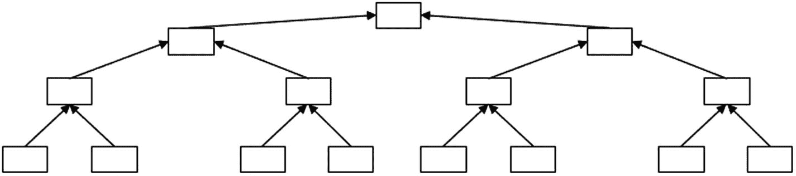

# 1. 商业中的区块链

## 关于过去的一点简述

虽然本书着眼于未来，但理解过去对你来说依然至关重要。过去曾有一些“实验”，例如由戴伟（Wei Dai）于 1998 年发布的一种加密货币——`B-money`。（比特币甚至以 `B-money` 命名，其重要性可见一斑。）甚至在 `B-money` 出现之前，大卫·乔姆（David Chaum）就在 1983 年创建了 `ecash`。人们往往认为寻求真正“数字”货币是近年之事，但自从互联网问世以来，人们就一直在寻找安全实施数字货币的方法。区块链正是源于这种追求。植根于安全性的技术（例如 `hashcash`）以及点对点网络的概念（我们从诸如 `Napster` 和 `BitTorrent` 这样的文件共享应用中熟知此概念），也都是最终促成区块链技术的关键部分。

开启整个区块链革命之人的真实姓名至今不为人知。我们只知道他/她/他们自称“中本聪”。2008 年，中本聪发表了一篇白皮书，题为：“Bitcoin: A Peer-to-Peer Electronic Cash System”（比特币：一种点对点的电子现金系统）。该论文提出了一种替代方案，用以解决计算机科学中著名的拜占庭将军问题以及经济学领域中更为人熟知的双重支付问题。拜占庭将军问题指的是：当多方发送消息，而其中一方或多方已变得不可靠时，我们如何知道某条信息是真实的？我们该信任谁？又如何知道谁在撒谎？双重支付问题则是围绕数字货币的一个经典案例。实体货币只能花一次，但如何防止数字货币被重复花费呢？

结合早期技术，中本聪引入了一个新概念：一种`工作量证明算法`，它允许分布式计算机系统接受交易，这与所有早期解决方案截然不同——后者或多或少都需要一个中央权威来接受交易或创造货币。共识是该论文的核心；即网络成员之间的共识。当你思考区块链的出现时，应该考虑的主要概念是“不信任”。比特币诞生于政治和金融动荡的时期，当时 2008 年金融危机正在全球蔓延。这种不信任的对象是任何可能腐败或变得“大而不倒”的中央实体。区块链恰好可以解决这个问题，因为其整个系统建立在“不信任对方”的基础上。你无需信任他们，也无需某个公正的第三方来验证其他参与者。网络本身会确保每个参与者遵守规则，否则最终将被网络淘汰。最后一句话听起来可能有点苛刻，但这正是需要理解的核心概念。

一年后，比特币网络才正式问世。第一个区块被挖出（这就是所谓的**创世区块**，标志着网络的诞生）。这个区块创造了最初的 50 个比特币，但它们完全无法使用！其创建者在区块中隐藏了一条信息：“The Times 03/Jan/2009 Chancellor on brink of second bailout for banks.” 这证实了该技术及整个加密货币网络的核心理念。当然，多年来，许多程序员对该实现进行了修订。中本聪仅在 2011 年前参与了开发，之后便从公众视野中隐退。社区不仅需要维护网络，还要定期更新它。这意味着，共识不仅存在于网络算法内部，也存在于网络周围的社区中。正如你之后会发现的，技术内部的共识被证明比社区内部的共识更可靠。多年来，比特币网络不断壮大（毫无疑问，它已发展成为一个巨大的市场）。但这种增长不可能一帆风顺，其他竞争者纷纷进入市场。

在随后的几年里，**山寨币**或替代加密货币开始出现，例如莱特币、域名币等。所有这些币种都与比特币拥有相同的代码库，但试图加入自己关于加密货币应有形态的见解。有些试图增强隐私性；有些则试图增加每个新区块产生的加密货币数量、增加交易数量等等。但底层模型基本保持不变。尽管世界各国政府都清楚加密货币的发展，但直到 2013 年，才有一个政府采取行动。美国当局冻结了与加密货币交易所`Mt. Gox`相关的所有账户，因为它未注册为资金传输机构。这开启了许多关于区块链技术和加密货币法律语境误解的开端。相关研究随之展开，但要真正提供一个法律框架仍需数年时间。时至今日，许多政府仍在努力创建一个可供个人和企业使用的实际框架。

比特币和其他山寨币开始面临的问题之一是与毒品贩运和恐怖主义的关联。早在 2013 年，比特币就在一次毒品调查中被查获，并且直到今天，仍有怀疑认为某些山寨币（尤其是那些注重隐私的）被用于资助犯罪活动。如今，加密货币交易所需要遵守与任何其他金融机构相同的法律，包括`KYC`（了解你的客户）法规和`AML`（反洗钱）法规。

除了与犯罪活动的关联外，比特币及类似网络还存在另一个主要问题。它们通过网络间的交互消耗了大量的计算能力。然而，事实证明，在比特币网络上开发应用程序（极其）困难。时至今日，开发人员仍在努力寻找利用计算能力构建强大且可信的去中心化应用程序的新方法。其中一位正在开发比特币应用程序的开发人员是一位名叫维塔利克·布特林的 19 岁程序员，他即将改变世界。他看到了区块链技术的潜力，并意识到其潜力可能远超加密货币和金融服务本身。

2013 年底，维塔利克·布特林发表了他的白皮书（《下一代智能合约与去中心化应用平台》），描述了一种新的工作方式和一种新的开源协议。他想要解决的主要问题是比特币没有用于帮助创建去中心化应用的脚本语言。由于在比特币社区内难以达成普遍共识，他提出了一个全新的平台：**以太坊**。该平台于 2014 年 1 月在迈阿密举行的北美比特币大会上正式宣布。很快，创始人决定将该平台及其开发置于一个非营利组织（以太坊基金会）之下。开发工作将通过一种名为**以太币**的新加密货币的众售来资助。在以太坊黄皮书中，加文·伍德详细阐述了将智能合约放入区块链的理念，该黄皮书描述了以太坊虚拟机。

2014 年 7 月，以太坊基金会举行了一次以太币众售，售出了超过 6000 万个代币。基金会还创建了约 1200 万个代币用于资助未来的开发和营销工作。该网络的第一个版本在一年后发布，名为**前沿**。后续的每一次开发都伴随着新的名称和版本，这证明了网络不断演进的历程。

随着时间的推移，越来越多的参与者带着各自对区块链技术或分布式账本平台的实现进入了这个领域，这些实现专注于特定的目标群体（例如，开发者甚至商业专业人士）或行业（例如，金融服务等）。其热度在随后的几年里不断攀升，并在 2018 年左右达到顶峰，此后则经历了一次大幅崩盘。与此同时，大约在 2015 年，`Hyperledger`项目诞生，可以说，它整合了当今企业区块链领域一些最著名的开发框架。目前已有超过 6000 种山寨币被创造出来，它们（大致）仍在运行。

### 加密货币崩盘

本节探讨加密货币崩盘（也称为比特币崩盘或大型加密货币崩盘）。2018 年 1 月发生了一场大规模抛售，导致比特币价值暴跌约 65%。许多其他加密货币崩盘得更为惨烈，有些甚至完全从市场上消失。当然，要出现崩盘，首先必须有一定程度的繁荣。在 2017 年之前的几年里，比特币和其他加密货币的价值一直在稳步增长。2017 年，加密货币及其价值经历了前所未有的繁荣。所有主要机构和投资者似乎都参与了加密货币市场，结果便是比特币在 2017 年价值增长了 2700%！

这导致许多小额投资者对加密货币产生了兴趣，其中一些人希望进入加密货币市场并承担巨大风险。这吸引了许多诈骗者，他们想利用轻信的投资者或那些想快速致富的人，就像早期加密货币市场中其他人所做的那样。由于缺乏明确的法律框架，大量首次代币发行（ICOs）被启动，聚集了大大小小的投资者，最终导致了资金滥用和盗窃。

对于那些不熟悉 ICO 术语的人来说，这是一种使用加密货币的融资方式。如果融资目标达成并且项目最终成功（这是一个很大的“如果”），这些加密货币可以成为功能性货币单位。举个例子，在 2017 年和 2018 年，所有 ICO 中只有大约一半能够存活超过四个月，而仅在 2018 年上半年，通过 ICO 筹集的资金就超过了 70 亿美元！其他骗局涉及“拉高出货” scenario，即几个人相互之间进行交易，以制造市场兴趣和价值的假象。其他投资者也会投资这种山寨币，之后最初的参与者会开始抛售他们持有的资产，让投资者手中的币变得一文不值。

最后一个需要考虑的重要方面是，大多数推出的山寨币都基于初创公司。众所周知，初创公司也往往会失败，它们推出的加密货币也随之消亡。所有这些都创造了一个极其动荡的市场，投资者认为自己比其他人更聪明，或者能再多坚持一会儿。尽管警告不断预测会出现重大泡沫，但这并没有阻止大多数投资者。

为了让您了解时间线，2017 年 12 月 17 日，比特币价格达到了 19,783.06 美元。几天后的 12 月 22 日，价格跌破 11,000 美元，这只是众多跌至历史低点的加密货币之一。坏消息并未停止，关于韩国可能禁止加密货币交易的传言导致了更多抛售。2018 年 1 月 28 日，当时日本最大的加密货币场外交易市场（OTC 市场，买卖双方直接互动）CoinCheck 遭受重大黑客攻击，导致价值 5.3 亿美元的 NEM（一个基于 Java 的区块链开发平台）损失。其他加密货币交易所也遭受黑客攻击和出现异常交易，导致市场更加不信任，投资者寻求从高度动荡的加密货币市场中逃离。到 2018 年 9 月，加密货币市场的市值已跌至其原始价值的不到 80%。这使得其正式比互联网泡沫破裂更严重，后者导致互联网相关公司的市值从 2000 年 3 月的峰值下跌至 2002 年 10 月的低点，跌幅约为 78%。

现在您知道了这个故事，或者至少是其中的一部分。像这样的故事有许多不同的视角需要考虑。我希望您记住的最重要的一点是，这些问题都与区块链技术本身无关。某些项目可能因为实施不当而与特定初创公司一起失败。与任何技术和应用程序一样，错误都可能发生。再次强调，这并不意味着底层技术存在问题。相反，这可能是由于人们不理解技术或不知道应该如何实施一个区块链项目。

崩盘的原因在很大程度上是金融层面的，就像任何泡沫一样，但对区块链技术的审视却从未停止。这意味着人们对分布式账本变得非常怀疑，他们不去探究该技术的可能性，反而宣称自己已经失去了“信念”，并质疑为什么还应该“继续相信”。正如我所说，质疑是否应该实施区块链平台是有理由的，但质疑底层概念不应成为理由之一。

### 现在

加密货币崩盘导致了极大的不信任。自那次重大崩盘以来，过去几年里又发生了其他崩盘。加密货币领域也出现了其他丑闻。（稳定币 Tether 就是一个典型例子。在四年多的时间里，一直存在关于其与美元平价的丑闻。审计问题、独立性问题、价格操纵指控等等层出不穷。我们将在最后一章更详细地讨论这个问题。）尽管如此，那些真正想用区块链做点什么的人并没有袖手旁观，他们已经在开发令人兴奋的新应用方面采取了措施。所有这些都催生了一个完整的行业，新的开发者和架构师在新的 IT 格局中占据了更突出的位置。Facebook 正试图通过创建 Libra 来推出自己的代币，其他大型支付提供商也在试图进入这个市场。随着 Ripple 等项目正在改变整个行业，无论好坏，区块链和加密货币都将长期存在。

区块链世界已经变得比我们预测的都要大得多，并且在持续增长。有像比特币和以太坊这样的“经典”开源实现。目前也有像 Hyperledger Fabric 和 Hyperledger Sawtooth 这样的“封闭式”实现，它们允许您在选定的合作伙伴群体之间创建联盟。然而，如果您遇到 DAG（有向无环图）、MerkleDAG、BlockDAG 等术语，请不要感到惊讶。这些都是实现去中心化网络的令人兴奋的新方法，它们都希望达到与区块链技术相同的最终目标。我们将在稍后提供高层次描述，让您了解这些方法的工作原理，以及您在哪个行业可能采用或实现某个特定平台。现在，我们专注于该技术的可能性。我们也会更深入地探讨一下加密货币市场，但这当然不是本书的目的。

近期，我们面临一场全球危机，一场大流行病使许多国家陷入困境，迫使我们生活在隔离之中。与此同时，还伴随着世界历史上无与伦比的经济危机。许多项目被终止或至少被搁置，很多人甚至（暂时）失业。在这样的时期，人们被推向极限，不仅要保持安全，还要维持生活水平。也正是在这样的时期，人们变得最有创造力，有些人甚至敢于承担通常不会承担的风险。如果在未来几个月出现新的应用和初创公司（不仅在区块链技术领域），并且它们以对现有问题的新颖见解震惊世界，我一点也不会感到惊讶。

## 区块链初创企业与未来图景

在深入探讨区块链技术的工作原理之前，我们先简要介绍一下区块链初创企业以及区块链技术的应用现状。这也能让你清楚地了解其市场价值是如何随时间增长的，并一窥人们正在推进的落地项目数量。人们常说的一句话是：“除了加密货币，我没见过区块链任何可用的实际案例。”那么，让我们来证明这种说法是错误的。即便是最持怀疑态度的人，也无法对利用区块链技术的初创企业浪潮视而不见。虽然早期的初创企业主要源于金融领域，但如今它们已扩展到你能想象到的每一个行业。据国际数据公司估算，区块链市场在 2019 年的总价值已达 25.5 亿美元，并预计到 2025 年将达到 555.4 亿美元。当前的经济危机可能会对 2020 年乃至未来几年的增长产生重大影响，但任何看到这些数字的人都应清楚，我们面对的是一个重要且不断增长、前景广阔的市场。SAP、可口可乐、阿里巴巴等许多大型企业也已实施过区块链项目。

另一个需要关注的重要方面是，初创企业的分布以及区块链技术在全球范围内的应用。显而易见，领先的创新主要来自美国和东方国家。这并不令人意外。美国一直是创新与变革的源泉，这里的人们敢于冒险。许多新初创企业（也包括区块链领域之外的）在美国诞生并蓬勃发展。然而，我们不应低估中国、日本、韩国、新加坡、台湾等国家和地区的影响，这些地方的科技创新和整个 IT 行业都经历了前所未有的增长。这些国家和地区的研究、创新和冒险精神不断提升，从而与世界各地的其他科技公司展开了激烈竞争。

在考察全球初创企业数量时，我们可以参考道琼斯旗下 Venture Source 的数据，以了解全球主要参与者[A]、欧盟成员国[B]以及世界其他地区[C]的相关信息，如图 1-1 所示。

图 1-1
全球区块链初创企业分布^(¹)

从这些数据来看，美国的区块链初创企业数量最多，其次是中国。欧盟仅占全球初创企业总数的约 15%。考虑到其中约 50%位于英国，而英国脱欧在即，这一比例将进一步下降。欧盟正努力进一步刺激创新和创业。数量偏低的原因与区块链技术相关的法律不确定性、分散的法律体系以及政治层面难以决策有关。此外，在商业风险承担方面，这里的环境更为严苛。在美国，商业失败被视为“一次有益的尝试”，是迈向下一次可能成功的尝试，而在许多欧盟成员国，商业失败仅仅被视为失败。

从图 1-1 中得出的一个重要结论是，这些初创企业大多在发达国家蓬勃发展，而它们在众多领域为发展中国家带来的潜在优势也不容小觑。然而，这些公司的影响力会随时间发生巨大变化，发展中国家在未来有可能跃居榜首。2018 年进入市场的新初创企业数量大幅下降（仅中国出现增长）。这是否标志着一种真正的趋势，还是仅是暂时性的下降，仍有待观察。见图 1-2。

图 1-2
初创企业总数。来源：道琼斯旗下 Venture Source

这些初创企业大多通过资本基金和 ICO（首次代币发行）融资，这对于了解该行业和领域的人来说并不意外。难题往往在于如何在初始融资活动后盈利赚钱。事实证明，这对许多此类项目来说相当困难。纯区块链市场盈利能力有限的原因可能有几点。一是区块链应用难以成为主流并吸引巨大市场。大多数去中心化应用的参与者和用户已经熟悉了去中心化的世界。这很奇怪，因为从用户角度来看，区块链应用与其他应用并没有本质区别。其中一些应用仍有可能实现市场渗透，但迄今为止，这种渗透非常有限。

第二个从一开始就困扰区块链项目的问题是扩展性。这些项目在达到一定规模前运行良好，但尤其是在较“经典”的实现中，一旦用户数量开始增加，交易费用就会大幅上涨，或者网络开始变得拥堵。同样，新的实现能够（部分）解决这些问题，并且扩展性大大提高。尽管如此，早期的这些担忧至今仍伴随着区块链初创企业。

第三个需要考虑的问题是，项目往往停留在某种试点阶段。即使这些初创企业提供或创建了某些平台，并能够为大型客户开展试点，但这些客户通常不会迈出下一步。原因可能是他们误解了平台的用途、工作方式，或者仅仅因为变革不是当务之急。与此相关的一个主要问题是，要使这样一个项目成功，需要多个愿意进行变革的合作伙伴的投入。如果你只是唯一一个尝试新工作方式的人，区块链项目永远不会成功。因此，你需要依赖多个独立方，这使得成功实施变得更加困难。

我们需要将这一点与大型企业中的区块链项目实施区分开来。在这些大型企业中，我们已经看到，由于此类平台的实施方式，它们可以带来显著的成本削减。同时，共同在网络上合作的合作伙伴之间的信任度也可能提高，这得益于透明度以及消除了可能随时间变得腐败或需要维护成本的第三方。

## 区块链投资趋势与技术基础

根据 IDC 的数据，全球在区块链用例和概念验证上的支出将在 2021 年达到约 18 亿美元，这对应于 2016 年至 2021 年间 66.6%的年复合增长率。尽管如此，大部分支出仍由银行业主导，其将占总支出的 47%。这并不令人惊讶，因为区块链技术的本质始于金融行业（或作为对其的反抗）。紧随其后的是分销和服务业（占总投资的 22%），区块链技术已被证明是有效管理供应链流程的绝佳替代方案。其他有重大投资的行业包括制造业和资源业（19%）、基础设施业（6%）以及公共部门。

区块链已被证明是一个有趣且成功的工具，可以帮助企业改造低效流程。技术本身是一个重要驱动力，但由于新应用程序的实施，人们和企业往往能够跳出固有思维模式，真正改变他们的工作方式。因此可以想象，区块链的实施可能对任何组织产生重大影响。这不仅是因为平台本身，还因为人们敢于摆脱经典模式、思考新工作方式的态度。当然，这得益于技术所促进的透明度和信任度的提升。

这就是为什么可以预见未来投资将持续增长，因为越来越多的公司将意识到通过优化现有流程所能创造的价值。将这种增长的价值创造与开放透明的流程相结合，客户和立法者都信任你的工作方式，这将进一步降低成本。

听起来很不错，对吧？然而，正如我之前所说，也有充分的理由不实施区块链解决方案。其一，区块链只有在组织开始合作时才有效。只要你的竞争对手、供应商或客户不愿意合作，你的项目就注定失败。区块链只有在各方愿意在同一网络和应用程序中协作时才能发挥作用。信任可以真正内置于你所提供的解决方案中。但同样，你需要每个参与方的支持，否则最终的实施必然会失败。

另一个区块链平台可能不是最佳解决方案的情况是处理定制化交易时。定制化是区块链应用程序并不总能良好应对的问题。你可以创建自己的网络、平台、工作方式和去中心化应用程序。你也可以通过使用智能合约创建自己的订单类型，但这些订单必须存在某种可以通过自动化标准化的通用实践。如果使用的订单类型变化过多，创建不同类型的智能合约就会变得过于麻烦和昂贵。

最后一个考虑因素与处理速度和可扩展性有关。即使现在有一些平台和技术能够承担负载，但只有做出正确的选择，你才能通过区块链平台处理所有事务。否则，可能会面临网络内部的拥塞。根据具体用例，在做出最终决策之前，你应该综合考虑所有这些因素。

### 区块链技术快速入门

首先，我需要简要解释什么是公钥密码学。*公钥密码学*（或非对称密码学）通常用于生成两种类型的密钥：私钥和公钥。公钥可以公开分享，而私钥必须保密（这显而易见）。为了生成这些密钥，需要使用单向函数。这在安全通信中解决了由来已久的问题。我们都熟悉对称密钥密码学：只需生成一个私钥，并将其用作账户、锁或其他任何东西的密码或口令。很简单，对吧？想象一下，我们希望相互发送加密消息，只有我们才能读取这些消息。只需共享同一个密码，问题就解决了！但其实并非如此，因为首先，我们需要找到一种安全的方式来相互共享这些密钥。这本身就可能是一个大问题。第二个问题是数量问题。你可能想向我发送安全消息，但可以想象，你也会想对你的所有朋友、家人和同事做同样的事情。那将需要发送和存储大量私钥！这在现实世界中简直是混乱不堪。公钥密码学找到了解决方案。你可以将公钥公开给所有人，将其存放在公共数据库中，并通过不安全的网络传输。它本意就是让所有人都知道并共享。如果你现在用我的公钥加密一条消息，那么只有我才能用我的私钥解密它。参见图 1-3。

图 1-3 公钥密码学

你们中的一些人可能已经将其与区块链和加密货币联系起来了：你的钱包地址和你用来访问它的私钥。当然，公钥密码学还有更多用途。想想用于验证消息发送者的数字签名。这些密钥的生成方式大多基于散列算法，这些算法根据熵产生特定结果。当你丢失私钥时再也无法访问钱包，这并非偶然。这些算法旨在不可破解。当然，当算法被攻破时，你的密钥也可能被破解。根据你使用的区块链平台，会使用不同类型的散列算法来生成这些密钥。这也是为什么某些币可以一起存储而其他币不能的原因。通常还会添加一些额外程序：这就是以太坊和比特币地址看起来如此不同的原因。

你还会用到*椭圆密钥密码学*。这可能会让你有点不适（特别是如果你对密码学完全陌生的话）。首先，我们需要讨论有限域，它可以定义为一个有限数字集合，以及满足特定规则集的两个运算（加法和乘法）。下一步是椭圆曲线。其形式为：`y² = x³ + ax + b`。参见图 1-4。

图 1-4 连续椭圆曲线

这些椭圆曲线被用于密码学和区块链实现。对于比特币而言，其曲线为`y² = x³ + 7`或`secp256k1`（见图 1-5）。据称，选择这个特定实现是因为美国国家安全局植入后门的概率最低。这也是许多其他区块链平台使用相同椭圆曲线的缘由。

图 1-5 secp256k1

但接下来要探讨的是“为什么”：我们为什么需要椭圆曲线？椭圆曲线用于一个非常特定的目的：点加法。点加法实际上正如其名。我们将位于曲线上的两个点相加。奇怪的是，这种加法运算的结果（即第三个点）也会落在曲线上！^(³) 这是一个非常有趣的特性，幸运的是它已被付诸应用。见图 1-6。

**图 1-6**  
点加法

现在，我们的探索之旅已近终点：我们将把有限域与椭圆曲线结合起来。所有这些最终汇聚成业务的核心：椭圆曲线密码学，为此我们需要有限循环群。那么，什么是群？群是仅包含一种运算的有限域，在这里，这种运算就是点加法。

掌握了所有这些信息后，你就可以开始创建自己的密码学曲线，并将其用于椭圆曲线公钥密码学。它有很多用途，但在区块链世界中，它被用于签名和验证交易。很明显，确保这些底层曲线不被攻击者攻破至关重要，否则整个系统的安全性将面临风险。再次重申，如前所述，许多区块链平台之所以选择`secp256k1`，是因为它被 NSA 植入后门的可能性最小。

当我们谈论区块链时，我们谈论的是账本。在传统工作方式中，需要一个第三方来验证支付、公证交易、使用托管服务，并允许投票和注册。随着区块链的出现，我们摆脱了这些集权于自身的第三方机构。集权本身未必是坏事，但它往往导致效率低下、成本高昂、隐私和控制的丧失、腐败等问题。而在分布式网络中，这种情况不再可能发生，因为由参与者来决定交易的结果和有效性。这里存在一个单一的真相，必须由多数节点支持，而非由网络中的单个权力实体决定。

人们常常忘记这项技术本身是什么，而直接开始关注其实现。然而，要理解其可能性，你首先需要真正理解并意识到这项技术代表了什么。其中一个重要部分是点对点网络的存在。如今，人们在互联网方面习惯了集中式的工作方式。当我们访问一个网页时，我们知道它运行在某个服务器上，并且我们访问的是同一个位置。然而，情况并非一直如此。互联网的初始形态就是一个点对点网络，计算机之间直接相互通信。这种技术至今仍被用于通过 BitTorrent 和其他网络共享文件。另一个例子是 TOR 网络，这是一个免费的开源网络，用于匿名通信（它也因被用于地下活动而名声不佳）。

像互联网这样的中心化网络的问题在于，存在中心化的提供商，它们可以提供或拒绝访问、控制可看到的内容等。这个第三方可能被黑客攻击、发生故障甚至腐败。这正是区块链技术最初摆脱中心化实体的原因。我们移除所有中心化服务器，允许参与节点直接相互通信。更为重要的是第三方带来的成本。这些成本常常使流程过于昂贵，使许多人和（小）企业难以承担这些服务。问题在于，对于流程的正常运行而言，这些成本是不必要的，因为它们仅被用作合规性检查。有了区块链，你可以自动化这些检查，并显著降低这些成本。

理解这项技术的最后一部分是*哈希*的概念。当你对某个数据集（可以是一个单词、一句话、一些数字，甚至一整本书）进行哈希运算时，你会得到该数据集的唯一标识符。无论输入大小如何，输出大小始终相同。除此之外，如果你只改变一个数字、字母或符号，生成的哈希值也会看起来完全不同。当我说“完全”时，我的意思是*彻底不同*。这样，你就能确保数据未被修改。如图 1-7 所示，单词“apple”和“apples”的哈希值之间的差异是显而易见的。

**图 1-7**  
哈希值的差异

目前存在许多不同的哈希算法，但它们需要具备一些关键特性才能成功。其一，它们必须具有抗碰撞性，即你无法找到两个能产生相同输出的输入。其二，它们应具有抗原像性，即你无法根据输出的哈希值推测出输入。这些算法在网络安全中常用于密码方案，以提高应用程序的安全性。应用程序不再直接存储密码，而是存储密码的哈希值，这样密码就不会轻易被从应用程序中窃取（尽管常用密码仍可能被攻击者破解）。过去，有好几种此类算法被“攻破”，意味着人们可以逆向将哈希值还原为原始输入。

这在区块链技术中是如何应用的？有多种方式，稍后你会看到。你可能能想到这可以在任何领域应用的几种方式。你可以对一份文档进行哈希运算，并将其安全地存储在某处；如果你想证明该文档未被修改，只需重新计算文档的哈希值，并与存储的哈希值进行比较即可（这实际上是除了加密货币之外，区块链的首批用例之一）。

在区块链中，这种技术被用于使生成的交易能够被快速比较。当你开始对交易进行哈希运算时，你也可以对哈希值进行哈希，并从一组哈希值中最终生成一个单一的哈希值。这被称为*默克尔树*，可用于压缩大量数据。默克尔树可用于证明一个区块中包含哪些数据（见图 1-8）。

**图 1-8**  
简单的默克尔树

所有这些区块都由一组组交易组成，这些交易链条连接成一个巨大的账本。实际上，区块链仅仅代表了网络中已发生交易的历史概览。这些技术共同帮助我们创建了一个只能追加交易的账本，该账本分布在整个网络的所有节点上。这些交易包含在一个由区块组成的链表中。

