# 构建基石

“区块链”这一术语指代的就是该技术的核心。其底层数据结构是由包含交易的区块构成的有序反向链表。这些交易代表了区块链网络中所有参与者之间的支付行为。这里的“支付”一词应被宽泛地理解。它既可能包括我们通常通过加密货币进行的支付，也可能指代依据不同区块链平台，在两方之间进行的任何操作确认。区块之间通过使用上一个添加到链中的区块的哈希值来彼此链接，如图 1-9 所示。细想一下，包含交易数据的区块链，只不过是一个数据以不同方式组织起来的账本。

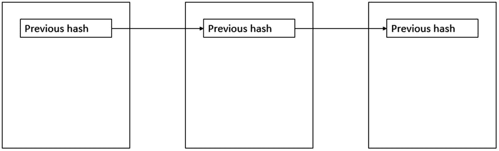

图 1-9 - 区块之间的链接

因为我们知道每个哈希值都是一个独一无二的指纹，所以总能确切地知道该区块是否属于这条链。这里需要注意的一点是，一个父区块（最新添加的区块）可以有多个子区块，而一个子区块则始终只有一个父区块。如果存在多个子区块，那么我们就遇到了系统分叉的情况。通常，这些分叉会被解决，只会使用其中一个子区块来延续主链（并且该子区块本身也会成为父区块）。然而，在某些情况下，部分分叉会持续存在，我们就会处理多条始于同一父区块的独立链。我们总是需要一个起点，即第一个区块，它被恰如其分地称为*创世区块*。因为从视觉上可以理解为区块是一个接一个堆叠的，所以我们把最新的区块称为“尖端”或“顶部”，而到创世区块的距离则称为“高度”。^(⁴) 这个高度越大，改变早期某个区块的难度就越大。从某个特定区块开始，链越长，重新计算所有区块中包含的信息所需的计算能力就越大。

区块中还存储了哪些内容？我们需要区分两个主要部分：区块本身和区块头。上一个区块的哈希值就是存储在区块头中的项目之一。通过这种方式，区块之间的链得以创建。但这并非唯一的内容——根据区块链平台的不同，你还可以在其中找到默克尔根、时间戳、随机数，以及其他一些参数（例如，难度目标、版本等）。图 1-10 展示了比特币区块链的一个例子。

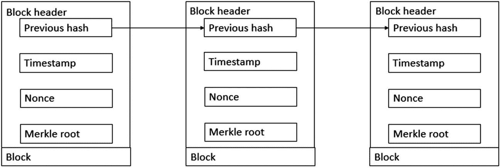

图 1-10 - 比特币区块头信息

眼下，并非所有这些信息都会清晰明了，但不用担心，随着我们阅读本书的深入，我们会一一解释。默克尔根提供了存储在区块本身中的交易的数字指纹。这是一种基于交易 ID 或“TXID”的“哈希值的哈希值”。这个哈希值对于该区块内的交易来说是独一无二的。见图 1-11。

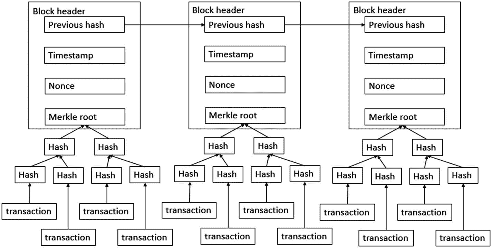

图 1-11 - 比特币默克尔根中包含的内容

再次强调，这只是对区块头中内容的简化展示。当然，区块包含的内容远不止区块头。区块的主体部分由交易构成。见图 1-12。

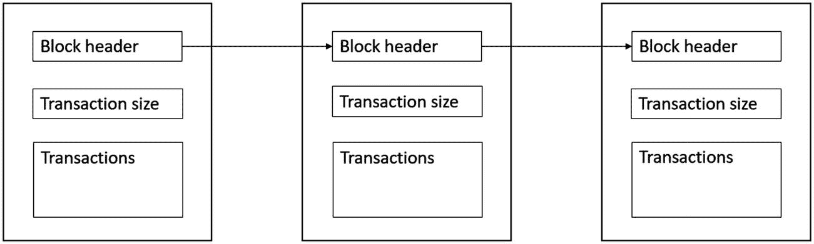

图 1-12 - 整个链

正如你所见，我们处理的是海量数据，不仅存在于区块中，也存在于区块头中。正是最终根据整个区块计算出的哈希值，能够正确且唯一地识别该区块在整个区块链中的位置。^(⁵) 对于比特币，使用`SHA-256`算法结合`RIPEMD-160`来计算这些哈希值，但这些算法可能因你使用的平台不同而有很大差异。既然我们已经了解了交易是如何被打包进区块，以及所有内容是如何链接在一起的，但主要问题依然存在：我们如何进行交易？其理念是，你可以用你的私钥对交易进行签名，这样不仅能清楚表明你是花费方，还能证明你拥有花费权，并且你没有重复花费该货币。交易通过网络广播并被挖掘到区块中。只有当这些交易基于所有参与者都同意的共识规则执行时，它们才会被处理。

简而言之，交易的生命周期如下：

1.  交易由创建者创建并签名。该交易应立即包含验证和执行交易所必需的所有信息。

2.  这些被提议的交易会与网络中的其他节点共享，由这些节点进行验证。

3.  如果被接受，交易会在整个网络中传播；否则，它们会被丢弃。挖矿节点可以将这些交易包含在可被挖掘的区块中，并最终将其添加到之前已被接受的交易链中。

## 区块链还是分布式账本？

我在此想立即指出一个重要说明，即区块链与分布式账本技术（简称 DLT）之间的区别。通常，人们说每个区块链都是一个分布式账本，但并非每个分布式账本都是区块链。分布式账本是一种数据库，它试图在地理位置不同的地点之间共享数据，而没有中央角色对整个网络进行控制。可以看出，它们在概念和目标上有一些相似之处。两者之间的一个主要区别在于新数据是如何附加到平台上的。在区块链技术中，人们使用一种共识算法来添加新信息，而分布式账本并不总是具备这样的算法。

正如你将在本书中看到的，DLT 的应用形式多样，区块链平台的应用亦是如此。使用“区块链”或“分布式账本”这两个名称有着许多含义。不仅技术本身不同，这两个名称带给人们的感知也不同。前者闻名遐迩，在全球备受追捧，而后者则相对隐匿于幕后，在 IT 专家中更为人所知。那么，为什么用一个名称而不用另一个呢？一些公司希望搭乘炒作热潮，使用“区块链”；而另一些公司则希望远离炒作，表明他们真正关注的是技术本身，因此使用“分布式账本”。

你应该考虑的另一点是目前存在的区块链“类型”。有公有、无需许可的区块链（如比特币和以太坊），它们在访问或参与方面没有任何限制。我们也可以称它们为“真正的”区块链。我们也有私有、需要许可的区块链，只有特定的一群人才能访问和参与（如 Rubix 和 Hyperledger 平台）。还有一些平台存在于这两种极端情况之间。第一种是公有但需要许可的区块链，它允许所有人进行交易和查看交易日志，但只有少数人能够参与共识机制（如瑞波币和以太坊的私有版本）。最后，还有私有但无需许可的区块链，其共识算法对所有人开放，但交易仅限于特定数量的参与者。目前还没有一个网络完全实现这一点的真实例子（目前最接近的可能是 Exonum 网络）。

还有 DAG，即有向无环图，它们也带着自己的解决方案和网络进入了区块链领域。为了使本书的进程不过于复杂，我将把区块链和分布式账本这两个术语视为同义词（我知道有些人可能不同意这种方法），并且在详细讨论 DAG 时会特别指出来。

## 区块链地址

理解区块链世界的下一步是区块链地址。区块链地址 ^(⁶) 是区块链和加密货币中的主要概念之一。它基于公钥密码学（也称为非对称密码学），其中使用一个私钥和一个公钥。正如你可能从名称中推断出的那样，公钥是公众可以知道的密钥。它们主要用于识别你的身份，而私钥则应始终保持私有。它们用于签署交易或解锁你账户上的加密货币。有多种算法可以生成这样的公钥和私钥。随着时间的推移，出于安全考虑，这些区块链地址已经从这些公钥演变为这些公钥的哈希值。这可以通过多种不同的方式完成，以至于对于每种加密货币都有不同的区块链地址，并且通常不可能将不同的加密货币发送到同一个区块链地址（算法上的差异阻止了这一点）。如果支付通过网络发送到区块链地址，这些“地址”只能通过使用相应的私钥来解锁。根据这些地址的派生方式，有可能在同一個地址上存储山寨币（不同的加密货币）。

## 区块链钱包

与地址密切相关的是区块链钱包的概念。这些钱包并非用于存储加密货币，而是用于与网络进行交互。它们用于生成发送和接收加密货币所需的信息，为此，它们会生成多个私钥-公钥对。这可以通过使用随机种子随机生成，也可以基于密码短语、密码、种子词等，在所谓的“确定性”钱包中生成。地址（如前所述）用于接收交易。私钥用于签署交易。^(⁷) 钱包软件（如果我们处理的是数字钱包）会计算钱包中每个地址关联的余额，求和，并将此显示为你的余额。因此，再次强调，你的加密货币并非直接存储在钱包本身中。这只是一种处理公钥-私钥体系结构的更方便的方式。

根据使用钱包的方式，它们可以被定义为“冷钱包”或“热钱包”。热钱包最容易理解，因为它是一个连接到互联网的钱包。有几种提供商允许你创建钱包。热钱包也称为软件钱包，有几种不同的类型。有可以在浏览器中创建的网络钱包；另一种类型是桌面钱包。这些可以下载到你的机器上，因此被认为比网络钱包更安全。尽管如此，你仍需确保钱包安全，并在可能的情况下进行备份。

另一方面，冷钱包与互联网没有连接，用于离线存储加密货币。这是一种更安全的存储方式（假设你不会丢失你的冷钱包），因为热钱包容易受到网络攻击。硬件钱包是冷钱包的第一种形式。这些是用于更长时间存储代币的物理设备。也有一些实现可以类似地用于执行交易。这里的问题可能是钱包的固件实现，它并不总是像它应该的那样安全。一个永久保持离线的智能手机可以被视为具有类似安全性的硬件钱包。最后，还有纸钱包。正如你可能想象的那样，这仅仅是一张印有包含公钥和私钥的二维码的纸。纸钱包非常危险，因为一张纸显然会面临特定的风险。除此之外，这类钱包只能使用一次，用于将全部金额发送到另一个地址。

## 节点

当我们谈论区块链及其所代表的网络时，也必然会提及节点。`节点`是网络的命脉，因为它们始终负责一组特定的任务。这些任务可能包括创建、接收和传输消息。如果没有节点，即使软件仍是最新版本，网络也将不复存在。这些节点分布在全球各地，遍布于一个广泛的网络之中。^(⁸)

那么什么是节点呢？节点是任何连接到网络并拥有 IP 地址的电子设备。网络的主要目的之一是维护区块链的副本并处理交易（具体取决于节点类型）。这些节点的所有者自愿使用他们的硬件、算力和能源来维护网络。

我们还应区分不同类型的节点：全节点、超级节点、矿工节点和简易支付验证（SPV）客户端。尽管它们在网络中地位平等，但每种类型都以不同的方式支持网络。首先，全节点会下载区块链的完整副本，并根据所使用的共识协议检查任何新交易。它们负责使用共识算法（稍后解释）验证交易和区块。它们还能够将新的交易或区块中继到区块链。当这个全节点公开可见时，我们称之为`超级节点`。全节点的所有者可以选择将其运行为隐藏节点（通过使用防火墙或 TOR 网络对他人不可见）或可见节点。超级节点的优势在于，它可以连接到任何想要建立连接的其他节点并进行通信，充当一个分发点，既用于分发节点中存储的数据，也用于促进与网络上其他节点的通信。

另一方面，轻节点（或 SPV 节点）引用了全节点上的区块链副本。其名称源于 SPV 方法，即“简易支付验证”方法，用户无需下载和维护整个区块链数据库即可验证一笔交易是否已被包含在某个区块中。这些节点依赖超级节点提供的信息，并仅作为通信端点（这在钱包软件中很常见）。

最后，我们应强调客户端节点和矿工节点之间的区别。虽然任何人都可以运行全节点（具备必要的硬件要求），但这与挖矿节点不同。当一个全节点仅仅验证交易时，我们称之为客户端节点。如果所有者愿意投资昂贵的硬件（取决于共识协议），他也可以在运行节点时挖掘新区块。挖矿的概念将在下文中解释。

## 挖矿

`挖矿`是区块链技术中的关键概念之一。它是新交易被新区块^(⁹)接受并添加到现有链中的方式，也是新加密货币的创造方式。它通常被用作防止欺诈的对策，并确保网络中的所有参与者保持诚实。挖矿本身成本相当高，因为它需要用于挖矿过程的硬件、驱动挖矿的能源以及时间。

挖矿分几个步骤进行。首先，挖矿节点需要收集等待在交易池中待处理的未确认交易。这些交易被打包成一个区块（区块是交易及其一些额外元数据的集合）。每个矿工可以选择相同或不同的一组交易（这可能是由于节点参数或地理位置决定的）。下一步，取决于共识算法，是根据网络规则对交易进行签名。这可能是一个数学难题、参与者的投票数或其他系统。如果找到了有效解，矿工就可以将他的区块和解广播给其他参与者，其他参与者可以验证该解。如果解正确，并且区块内的所有交易都能根据区块链历史记录执行，则该区块被确认并添加到这些节点的区块链中。这被称为`胜出`区块。

如上所述，为此，矿工应该获得奖励。奖励通过两种方式实现：矿工获得区块中包含的交易的手续费，以及新区块被添加时创建的新币。矿工可以基于网络所使用的算法（工作量证明、权益证明或其他）来获得此奖励。

挖矿过程不仅是创造新加密货币的关键，也是在无需信任的环境中帮助建立去中心化共识的机制。网络上的所有节点都会接收到区块，并因此能够验证其有效性。这意味着共识会随着时间的推移而逐渐形成，因为这不是在特定时刻进行选举，而是通过网络中所有节点的异步交互来实现的。你必须认识到，在像比特币这样的网络中，为竞争和挖掘下一个区块所需的算力已经呈指数级增长。这是因为市场参与者的增加以及硬件解决方案的演进。随着时间的推移，矿池应运而生。通过合作，矿池找到下一个胜出区块的机会更大，这样奖励就可以在参与者之间分享。挖矿设施的基础设施随时间发生了巨大变化，根据不同的区块链平台，我们将深入探讨这些发展的时机和原因。对于其中一些平台，需要相当先进的基础设施，而其他平台则仍然对所有人开放。

当然，在处理区块链平台的企业级实施时，你不会使用传统的矿工节点。相反，你将使用一种更简单的共识算法，在这种算法中，每个参与者都可以轻松检查和验证网络中发生的事情。竞争的需求降低了，因为这些参与者实际上已经相互认识，因此欺诈交易很容易被追溯。这样一来，当参与者试图在联盟中欺骗其商业伙伴时，他们可以因此被从网络中移除。

## 共识协议

我们在谈论区块链技术时经常提到协议。当然，这并非区块链所独有，而是可以在任何电信技术的实施中发现。当我们谈论协议时，我们指的是决定如何连接到系统并与之交互的一整套规则。这些规则可能非常详尽，因为它们可以决定你必须使用哪种硬件、允许使用哪种软件，以及通过网络传输的消息的语义是什么。与其他电信服务一样。当谈到像比特币或以太坊这样的开源区块链实现时，对硬件没有限制，所需的软件也完全免费。尽管对于私有区块链实现来说情况仍然如此，但我们可以预见未来可能不再如此的发展趋势。

### 工作量证明

工作量证明是区块链网络中首个使用的共识协议。首个采用此类共识协议的网络是比特币网络。其理念是，矿工需要利用他们的节点来求解一个数学问题。该问题的求解需要耗费大量的工作和算力，但验证其结果却相对简单。这种共识方式被设计得难度较高，并且需要大量的计算能力。如果求解变得过于简单，可能会引入某些安全问题——挖矿速度可能过快，导致区块和链的浮动，从而无法形成主链。以比特币为例，其目标是每十分钟生成一个新的区块。随着时间的推移，算力不断增强，参与者数量增加，网络中投入的算力也随之成倍增长。这意味着工作量证明算法的难度也需要相应提高。一些网络曾尝试通过创建能抵抗挖矿软件的算法来另辟蹊径。这样一来，每个人都可以继续使用经典计算机进行挖矿（使网络尽可能保持民主）。网络会设定一个目标哈希值，节点必须尝试基于区块和随机数（nonce）计算出低于该目标值的哈希。目标值越低，参与者找到正确且可接受的哈希的难度就越大。工作量证明协议可以通过使用前述的随机数以及将消息组合成区块的方式，帮助解决拜占庭容错问题。为了防止预计算，该随机数对每个节点都是唯一的，且只能使用一次。

关于此类协议的一个重要批评点在于，应用该协议的网络所消耗的能源量巨大。在气候变化、资源稀缺和经济危机的时代，这一点是需要考虑的重要因素。

目前，有许多不同的工作量证明共识协议被各个网络所采用。

### 权益证明

权益证明是在工作量证明协议之后发展起来的，并越来越多地被用于区块链网络。首个实施此类协议的网络是 2012 年的 Peercoin（点点币）。在权益证明网络中，下一个区块的矿工是伪随机选出的，节点持有的加密货币数量会影响其被选中的几率。被选中的概率与你在该网络中的权益（stake）直接相关。

与工作量证明共识协议相比，它显然更具成本效益，因为矿工无需消耗能源去求解数学问题。其次，它已被证明更加安全。一个常见的例子是 51%攻击，一旦某个参与者拥有了网络中 51%的算力，区块链网络就会变得脆弱。从那一刻起，他就可以无视其他参与者的意愿，验证自己所有的交易，因为其他人已无法阻止他。这看似矛盾，但持有最大权益的利益相关者有动机维护网络，因为如果发生攻击，这将损害网络声誉，而他们受到的伤害也最大。这个协议也有一个缺点，被称为*无利害关系*（nothing at stake）问题。当网络发生共识失败，且网络中的参与者没有什么可失去时，就没有任何东西能阻止这些参与者支持不同的侧链。

### 委托权益证明

委托权益证明协议在网络中维持着一个无可争议的真理共识。该协议结合实时投票和声誉来达成共识。这使得每种加密货币的持有者都能影响网络。

该网络使用代表（delegates），他们通过选举担任该角色，并需将一定数量的加密货币存入一个基础账户中。存入的金额越大，该代表对网络施加的影响力就越大。如果出现恶意行为，这个基础账户中的资金将被没收。我们也可以称其为基于存款的权益证明。虽然代表负责交易验证，但参与者也需定期请求检查已挖出的区块是否包含所有正确的交易。这确保了网络能够自我治理和监管。你大概能感觉到，这比其他共识协议更加民主。

### 权威证明

权威证明（PoA）是一种替代方案，常用于私有区块链^(¹⁰)网络（更常与分布式账本网络相关），它将“节点身份”作为网络中的权益来替代工作量证明。只有被选中的节点才被允许挖掘新区块。这些“验证者”节点被允许将交易添加到区块中，这些区块随后会被添加到区块链上。通过权威证明和验证者机制，还引入了一个新概念——*声誉*。验证者的声誉对于网络的存在至关重要。如果某个验证者的声誉或其权威受损，其他参与者可能会离开网络，或质疑新创建的区块及其交易。

与其他协议实现相比，该协议有利有弊。PoA 的主要风险在于，如果只有一个验证者节点，就会将风险集中到单点故障上。在讨论分布式网络时，这是一个需要考虑的主要风险。

然而，PoA 不需要使用工作量证明的网络所必需的巨大算力。PoA 相比权益证明也有一个优势。在 PoA 中，节点的整个身份都被置于考量之中。如果参与者行为恶意，他们将失去在网络中的全部权益。而在权益证明中，参与者只会失去其预先投入的当前权益。这意味着，在网络中整体参与度较低的人，其损失会小于在网络中投入巨资的人。

### 区块链平台中使用的其他协议

在区块链平台中，还可以使用其他几种类型的协议来达成共识。其中一种与权益证明密切相关的协议是*重要性证明*。与权益证明的区别在于，在 PoI 环境中，用户的交易也会被纳入考量。通过这种方式，该协议试图衡量节点在整个网络中的信任度和重要性。^(¹¹) 另一个有趣的协议是与工作量证明和权益证明相关的活动证明。它比工作量证明更节能，因为它仅在第一个阶段使用工作量证明，而在第二个阶段则使用权益证明。还有容量证明，其主要驱动力是硬盘的可用空间（而非工作量证明协议中使用的 CPU）。^(¹²)

你可能会遇到的其他协议还包括：复制证明、燃烧证明、空间证明、时空证明、存款证明、数据持有证明等等。你可以清楚地看到，许多不同的区块链平台正在尝试各种解决方案，以期在分布式和去中心化环境中以安全高效的方式达成共识。这些协议各有优劣，具体取决于你试图达成的目标以及所在组织的运作方式。

## 区块链分叉

区块链分叉是区块链领域中的一个重要主题。它指的是同一网络内存在竞争或共存的侧链。仅仅因为网络的去中心化结构，分叉的出现似乎是自然而然的。区块在网络中传播，并在不同时间到达不同节点。这也可能是所谓孤块产生的原因。通常情况下，节点会尝试扩展累计难度最大的那条链。^(¹³)

当有两个或更多的候选区块相互竞争以形成最长链时，我们就称之为分叉。如果某个矿工发现了一个“正确”的区块，它会立即发送给其邻近节点。多个节点可能同时发现不同的解，并通过网络进行广播。距离该区块原始矿工最近的节点将基于此区块开始构建它们的链，并继续处理下一个区块。如果以这种方式产生了分叉，问题通常会在一个区块内得到解决。原因是，即使网络中的计算能力在几个竞争群体之间平均分配，也会有一组矿工首先找到下一个解。这个新解将在网络节点间共享、被接受并通过网络传播。竞争节点将会收到这个新解，接受它，并停止对竞争解的求解工作，从而解决分叉。^(¹⁴) 见图 1-13。

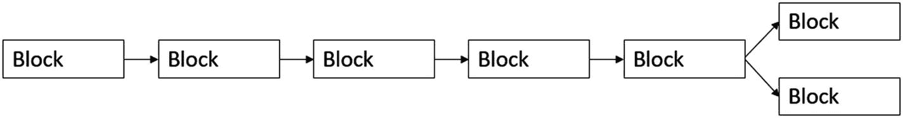

图 1-13

区块链分叉

还存在一种*硬分叉*。当网络上进行软件更新，或者协议与挖矿程序升级时，就会发生硬分叉。一旦升级完成，使用旧软件挖出的交易将不再被升级后的节点接受。这样，一条新的、持久的分支就形成了。在不同的链上会发生一组并行的交易。而*软分叉*是一种软件变更，它只是使之前的区块和交易变得无效，但同时仍保持向后的兼容性。硬分叉和软分叉的另一个区别是，对于软分叉，只需要大多数矿工进行升级。而硬分叉则要求所有节点都升级到新版本。

## 侧链

通过对分叉的解释，你可以开始设想侧链的存在。侧链是相互连接的区块链（*父链*和*子链*）。由于这种连接，资产能够以固定的确定性汇率在网络上互换，同时侧链可以完全独立于父链运行，并使用自己的共识协议。见图 1-14。

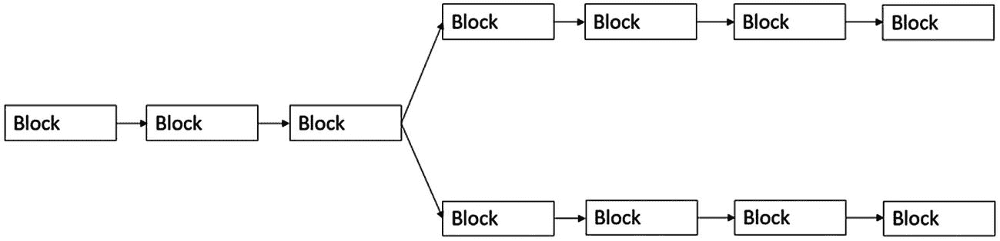

图 1-14

侧链

实际上，这种转移不过是一种假象。代币在父链中被锁定，等量的代币在子链中被解锁。如果你想转移，子链中的代币会被锁定，而父链中的加密货币则再次被解锁。要实现这一点，有几个前提条件。

你需要理解的最重要的基本原则是所谓*结算最终性*的要点。结算最终性这个概念在金融服务行业很常见。它指的是你能确信交易已成定局且不再会被撤销的那个时刻。在采用工作量证明算法的区块链环境中，这个时刻可能难以确定，因为在任何给定的时间点，都有可能（尽管随着时间的推移可能性变小）产生一条不包含某些交易的更长的链。如果我们考虑使用工作量证明的公链，标准做法是等待六个确认（在我们交易所在区块之上新挖出的区块）后，一笔交易才被视为最终确认。其实际含义意味着我们必须信任两条链上参与者的诚实性，并且它们都能抵制审查。所有这一切都要求参与者是诚实的，包括那些持有锁定代币的参与者。否则，你可能会陷入锁定代币被花费的境地，从而导致双花问题再次成为可能。

子链也可能缺乏结算最终性。在这种情况下，可以使用所谓的*托管人*，他们必须对何时锁定或解锁一定数量的代币进行投票。这种投票系统可以适应任何形式，最适合所连接的区块链。这使得它成为一个相当灵活的系统。实现这个系统有几种方式。第一种是使用一个中心化交易所，通过仅在属于链 2 的等量代币被锁定时，才解锁链 1 的代币，来强制执行两条链之间的双向锚定。见图 1-15。

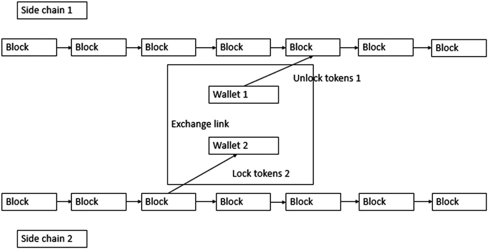

图 1-15

中心化交易所

你可以清楚地看到，使用这种系统违背了区块链的本质。你重新引入了单点故障，并且再次使用了中心化。你可以尝试通过使用多方参与的多重签名方式来建立一种去中心化的形式。这在私有环境中可能非常有效。见图 1-16。

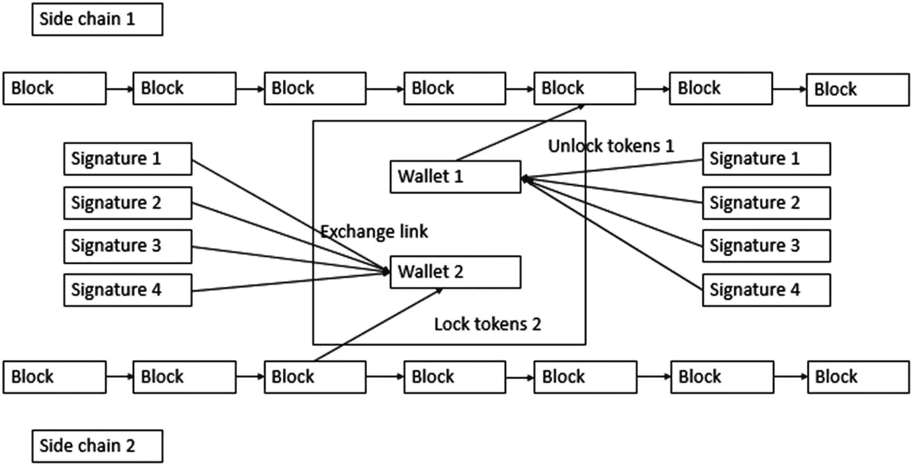

图 1-16

多重签名方式

第二种方法涉及摆脱任何中心化，通过实现理解每条链的共识机制来连接两条链。这样，代币可以在链能够验证存在锁定交易的那一时刻被解锁。当你在一个其中一条链没有最终结算性的系统里工作时，这会带来一些安全隐患。这一点或许可以应用于私有区块链/分布式账本环境，但鉴于这种设置在一个本质上无需信任的环境中会带来的风险，它不适用于公有领域。

你可以使用多种方式来创建这种特定设置，但最终都必须归结为一种简化的交易确认方法，因此需要使用梅克尔根（Merkle root），它在区块链领域中以各种方式被频繁使用。见图 1-17。

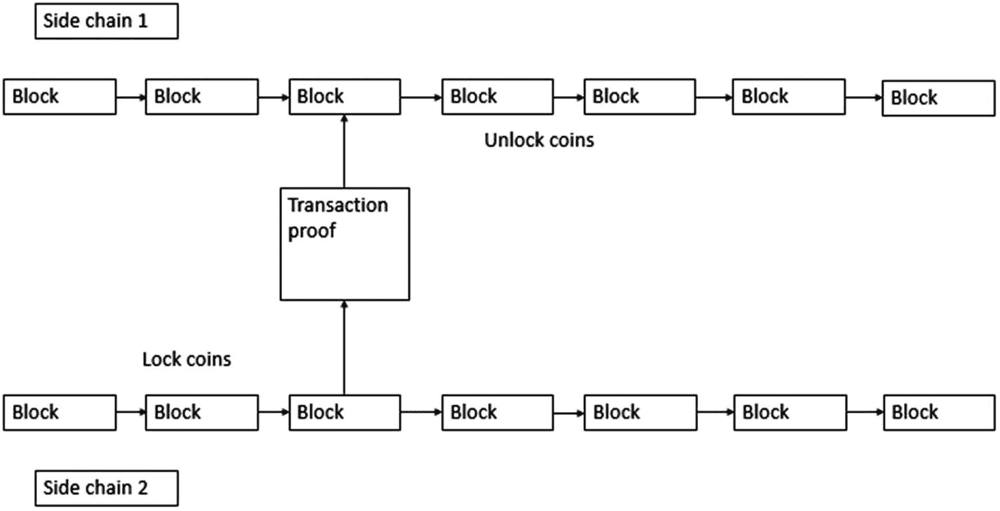

图 1-17

通过共识链接

另一种与前述例子相关的方法称为“纠缠区块链”。在这里，两条独立链之间的关系被提升到了新的层面。当一条链上的币被锁定时，另一条链上等量的币会立即被释放，反之亦然。见图 1-18。

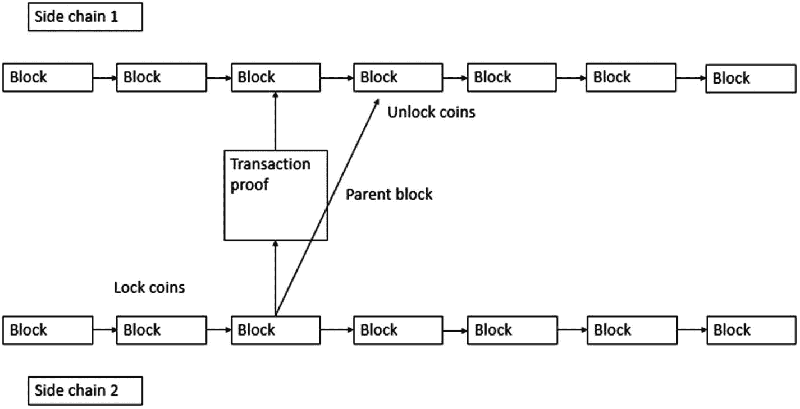

图 1-18

纠缠链

我们要看的最后一个例子是“驱动链”。在这里，参与者可以投票决定何时释放锁定的币以及何时将其发送到另一条链。这些投票可以被锁定在交易信息的特定部分中。这些投票者通常与其中一条链相关联，同时也决定了另一条链上发生的行为。你在图 1-19 中可以清楚地看到，对参与者的信任是这里的主要考量。

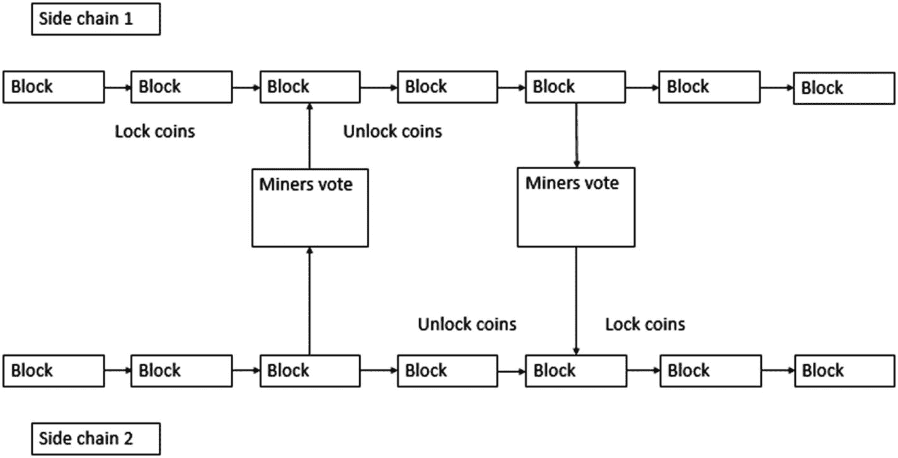

图 1-19

驱动链

当然，这些只是可以独立使用的明确示例。实际上，将这些方法进行多种组合是极有可能的。根据你具体的用例，拆分或组合这些方法可能是你最好的解决方案。很大程度上取决于私有/公有以及许可/非许可的方法，再加上对参与者信任度的预期。

## 区块链技术栈

与其他技术实现不同，当你希望在组织内部署区块链技术时，你必须考虑该技术的整个“技术栈”（见图 1-20）。其核心是去中心化和共识。因此，你必须审视你的基础设施，并问自己一个问题：“你们目前准备好接受一种新的工作方式了吗？” 在某种意义上，你必须放弃中心化和控制的经典观念，为一种不再有单点故障的互联系统腾出空间。

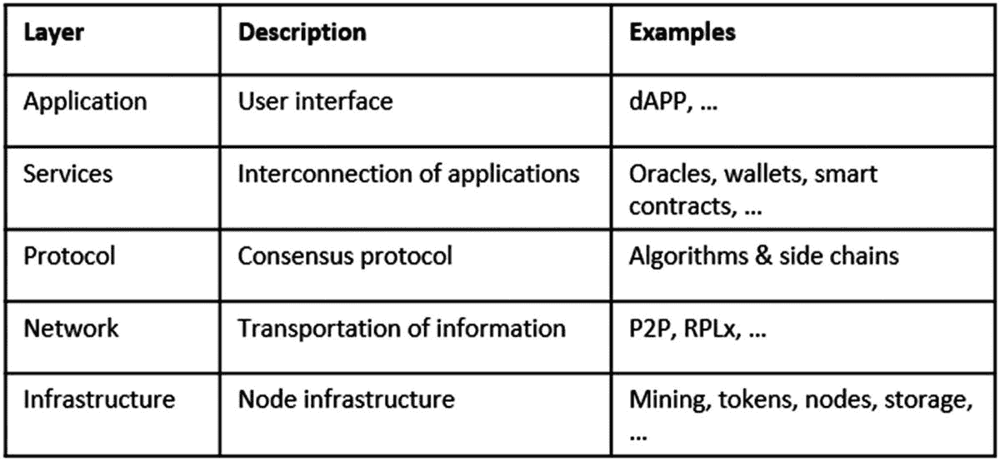

图 1-20

区块链技术栈

它既带来优势也带来挑战，但在你考虑应用区块链时，每一个“层级”都必须被考虑进去。正如你很快就会发现的，它远不止是加密货币本身。当你开始这段旅程时，请将这幅图铭记于心。

## DAG（有向无环图）

如同区块链一样，DAG 是另一种形式的分布式账本技术。主要区别在于，在 DAG 的世界里，不再有区块。这可能看起来令人困惑，因为你刚刚读到区块链世界中的一切基本上都是“链式区块”，但当然，正如生活中的一切，事情并非那么简单。对于 DAG 而言，交易是直接相互链接的。它们并非排列成整齐的行列，而是形成一片交易云，链接到几个新交易，以此类推。其名称本身——有向无环图——实际上已经告诉你需要了解的一切。它是*有向的*，这意味着所有的链接都指向同一个方向，如图 1-21 所示。正因为此，网络中不可能出现循环。因此它是*无环的*。

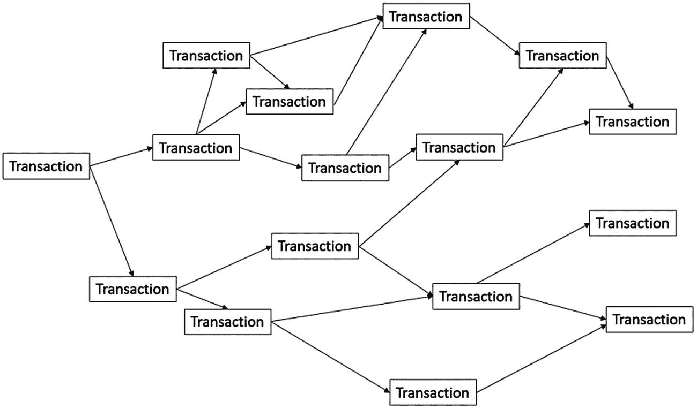

图 1-21

DAG 运作原理

DAG 本质上试图提供与区块链相同的功能，但性能更优。^(¹⁵) 它提供了更好的可扩展性和更低的交易费用（因为网络中不存在矿工）。与你从区块链技术中学到的相反，在这里，随着等待验证的交易数量增加，网络会开始运行得更快（从而最小化网络拥塞的可能性）。目前 DAG 的主要关切点是在网络中找到达成安全去中心化共识的最佳方式。一旦这个问题得到解决，DAG 可能会因其带来的优势而对当前的区块链格局构成威胁。

DAG 通常也被称为“区块链 3.0”，因为它被视为去中心化应用领域自然而然的下一步，以及未来的工作方式。一如既往，这只是对 DAG 非常宽泛的解释。实际上，每种实现都差异巨大，并且各有其优缺点。在后续章节中，我们将更详细地探讨目前已存在的实现以及近期可能实现的功能。现在也有了 MerkleDAG，它将梅克尔树的密码学能力与 DAG 结构相结合。

## BlockDAG

此外，还有 BlockDAG 范式，如图 1-22 所示。当你从宏观层面理解了区块链和 DAG 的运作方式后，这个概念就会相当清晰。我们依然使用区块，但不再只有单一的父区块。取而代之的是，每个区块都会引用矿工在本地所能观察到的图的所有端点。你可能会立刻发现这里的问题。由于存在许多区块以及许多相互引用的区块分支，因此极有可能出现属于同一条链的冲突交易。因此，BlockDAG 需要特定的共识协议来在整个网络上实现一定程度的安全性。

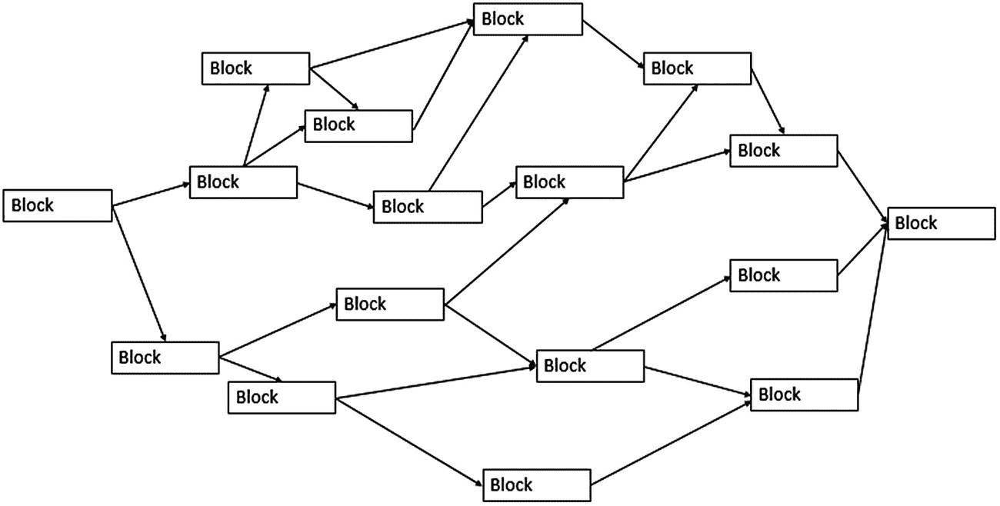

**图 1-22** BlockDAG 结构

借助一个运行良好的 BlockDAG 网络，你可以将交易速度提升至秒级，将费用降至最低，并支持网络去中心化（因为可以挖掘更多的区块）。孤块的数量会减少，自私挖掘的动机也会大大降低。^(¹⁶) 基于 BlockDAG 的网络试图在中本聪、维塔利克·布特林以及 DAG 所设计的网络之间找到一种合适的关系。实现这种技术的一个网络示例是 Soteria。

脚注 1 2 3 4 5 6 7 8 9 10 11 12 13 14 15 16

