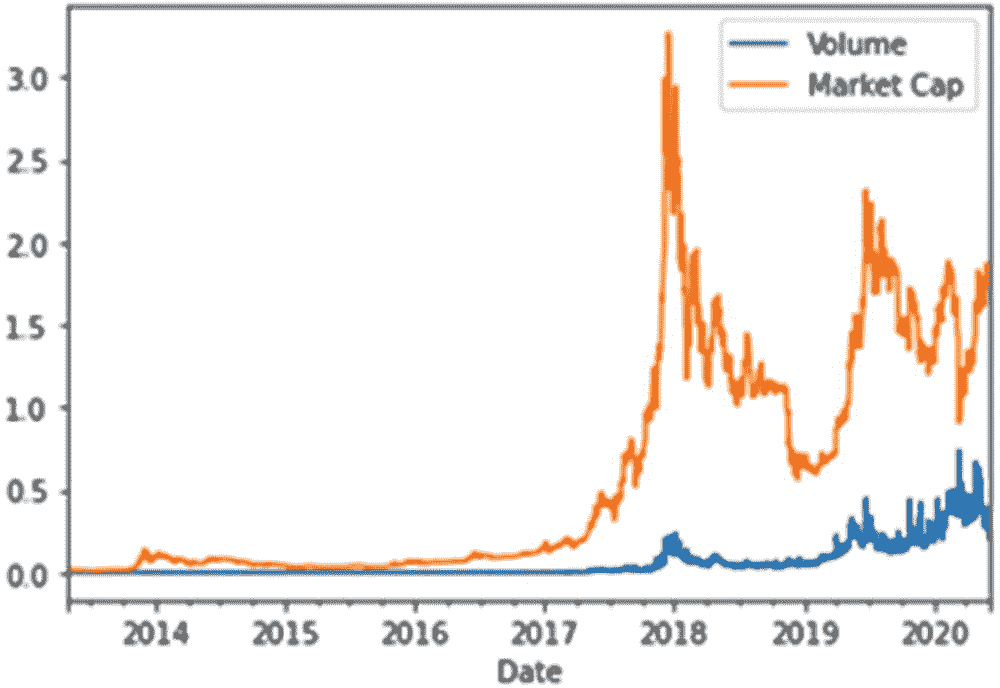

# 5. 区块链与加密货币

至此，你已经对区块链技术有了不少见闻和了解。然而，在本书的结尾，我想再介绍一些你应该知晓并理解的核心概念。这将有助于你深入观察加密货币市场，理解其运作方式。随着加密货币的诞生，多种新型金融工具被设计出来，同时已有的金融资产也纷纷进入了加密货币的世界。

## 加密市场简史

加密货币及资产的历史与区块链技术本身的历史紧密相连，至少最初是这样。遗憾的是，在 2018-2019 年巨大的炒作热潮之后，市场崩盘，这项技术的声誉也受到了损害。^((247)) 正如我们在第 1 章中所见，一切始于 2008 年 10 月，一位名叫中本聪的匿名人士发布了一份描述比特币的白皮书。这个最初的构想既引发了兴趣也招致了怀疑，而第一个区块链区块——比特币的创世区块——于 2009 年 1 月诞生。同样是在这个月，发生了第一笔交易，发生在中本聪和一位名叫哈尔·芬尼的开发者之间。这便是加密货币世界的开端。2009 年 10 月，新自由标准对比特币进行了首次估值，当时`$1 = 1,309 BTC`。第一个比特币市场`dwdollar`于 2010 年 2 月成立。这是首次，其他参与者可以买卖这种加密货币。

2010 年 5 月，比特币世界迎来了一个至今仍被许多加密货币爱好者和参与者铭记的重要里程碑。拉斯洛·汉耶茨花费了大约 10,000 BTC 从棒约翰买了一份披萨。这是首次使用加密货币购买实物商品的真实世界交易。这种认知的高度在几个月后（2010 年 8 月）就被击碎了，当时首次发生了一次黑客攻击，恶意利用了比特币网络的一个漏洞，导致产生了 1820 亿枚比特币。这种加密货币的价值几乎跌至零。同年 9 月，当更多漏洞被发现时，比特币的形象遭受了更大的损害；而在 10 月，一份报告表明比特币可能被用于洗钱和资助恐怖活动。^((248)) 尽管如此，在 2010 年 11 月，市场价值仍达到了 100 万美元（估值为`$0.50/BTC`）。

2011 年，比特币出现了第一次价格飙升，到 6 月份估值达到`$31/BTC`（从 1 月份的平价开始）。快进到 2013 年 6 月，市场规模达到了 10 亿美元。也大约在这个时候，美国金融犯罪执法网络发布了第一份监管规定。几个月后，又发生了一起重大盗窃事件，^((249)) 接着是另一起安全漏洞，将比特币的价值击垮至`$0.01`。同年 8 月，美国联邦法官马赞特^((250)) 首次声明比特币可以用作交换商品和服务的货币。与此同时，彭博社开始在其门户网站中整合比特币数据，提高了这种加密货币的接受度。^((251))

第一次重大分歧发生在 2013 年 11 月至 12 月。当美国参议院开始举行首次关于比特币的听证会时，美联储主席本·伯南克却对网络给予了祝福和支持。另一方面，在中国，则首次禁止金融机构处理比特币交易。^((252)) 2014 年，Overstock.com 成为第一家接受比特币支付的大型零售商，而 Elliptic 推出了首个受保险的比特币存储服务。同年晚些时候，丝绸之路被关闭，其比特币（29,000 枚）被美国政府出售。^((253)) 在新泽西州，首个受监管的比特币投资基金（GABI）获得了认证。^((254)) 到年底，TeraExchange 开始在受监管的交易所上开展首笔基于比特币的交易。这意味着这种货币进一步融入了标准工作方式，并得到了主要金融机构的接受。

2015 年，纽约证券交易所成为 Coinbase 的投资方之一，英国财政部开始就数字货币征集信息，巴克莱银行也开始接受比特币。第二年，日本内阁承认虚拟货币具有与常规货币相似的功能，南非的 Bidorbuy 和 Steam 平台开始接受比特币作为支付方式。8 月，Bitfinex 发生了一次新的重大黑客攻击事件。2016 年晚些时候，瑞士铁路运营商 SBB 在其售票机上接受比特币支付。

2017 年，接受比特币及其他加密货币的商店数量进一步激增，俄罗斯和挪威分别接纳、合法化并进一步整合比特币支付账户。在 2018 年和 2019 年，越来越多的商店开始接受加密货币，但与常规货币相比，它们仍处于边缘地位。这些年份的市场也经历了进一步的崩盘和上涨。随着新冠病毒的出现，常规市场和加密货币市场都经历了严重下滑。从长远来看，它将如何影响这些市场，只有时间才能给出答案。

### 加密货币市场

加密货币市场是一个波动性极高的市场，近年来以剧烈涨跌为特征。与其他金融市场不同，加密货币市场的特点是其去中心化属性。这意味着它们依赖于点对点市场，交易通过节点传播并最终存储在区块中。这也意味着没有中央机构或政府为这种货币提供背书。

与其他市场类似，供需法则影响着加密货币的价格。代币总数量及其发行或销毁的速度是主导供应端的主要因素。有些加密货币如`Bitcoin`，总供应量有限（仅能挖出 2100 万枚`Bitcoin`，此后由于网络算法中设定的限制，挖矿将变得不可能）。这与`Ethereum`完全不同，后者对可挖出的`Ether`总量没有上限。`Ripple`则是第三个例子，其加密货币会分多轮发行。

市值（供需关系）是决定加密货币价值的第二个因素。投资者对某种加密货币的兴趣越浓，需求就会越高，进而推动该加密货币的价值上升。其他影响因素包括加密货币在（线上）商店和电子商务支付系统中作为可用支付手段的整合程度。某种特定加密货币的普遍接受度越高，其本身价值增长的可能性就越大。

监管变化——例如接受加密货币作为合法的支付或投资手段、为`ICO`建立框架、以及进一步推动区块链基础设施投资——会极大地影响加密货币的价值（正如我们在 2018 年崩盘时所看到的）。其他因素包括媒体报道、投资者接受度以及有趣的区块链应用案例的增长。最后，对诱骗投资者投资于不存在的加密货币、创建虚假`ICO`并窃取投资者资金的行为进行追查，也会进一步提升合法加密货币的价值。

加密世界的第二个方面是加密资产的存在。加密货币是加密资产的一个方面，但还有其他可交易的数字资产。除了加密货币，还有平台代币（或称加密商品）、实用型代币和交易型代币。`Ether`（来自`Ethereum`网络）被视为一种平台代币，因为该平台可用于创建去中心化应用。实用型代币存在于其他平台（如`Ethereum`）之上。这些代币是围绕特定使用场景开发的。最后是交易型代币，例如`Ripple`、`IOTA`和`Stellar`。这些代币用于实现跨境支付。

除了加密货币，衍生品交易也应运而生。这些金融工具与加密货币的价值及其随时间的变化息息相关。市场上还有期权等其他高风险但承诺高回报的工具。如果这些工具被大量使用和交易，它们可能会在本已动荡的市场中引入更多不确定性。

你应该明白，人们会不断寻找创造新金融工具的方法。理解这些工具及其所在的市场，对任何投资者都至关重要。

### 核心加密货币概念

在本节中，我们将介绍如果你决定进入加密货币市场，几乎肯定会听到或读到的核心概念。理解这些核心概念不仅有助于你更好地理解这些市场，也有助于理解这些市场可能存在的问题。

#### 原子交易

原子交换是指在没有交易所等第三方参与的情况下，在点对点之间发生的加密货币交易。首次原子交换发生在 2017 年 9 月 20 日，在`Decred`和`Litecoin`之间进行。^(²⁵⁵) 这些交易可以通过多种方式进行——要么直接在各自拥有不同原生代币的独立区块链之间进行，要么通过链下通道进行。这些不同加密货币之间的交易使得整个加密货币系统更加灵活。

随着原子交换的出现，我们迎来了一个可能实现免手续费交换的世界。这些（链上）交换之所以能够发生，是因为参与者基于一个共享秘密进行协作。类似于`Lightning network`（一种建立在`Bitcoin`网络之上用于提升可扩展性和交易速度的网络），这里我们同样使用哈希时间锁定合约（`HTLCs`）。简而言之，当两个参与者想要交换两种不同类型的加密货币时，他们需要开通一个支付通道。第一个参与者创建一个支付地址。该地址由第一个参与者存入一笔资金，随后会生成一个数值。这个数值就是钥匙，而该数值的哈希值则是锁。第一个参与者将哈希值发送给第二个参与者。第二个参与者生成一个地址，但使用了他们收到的哈希值来完成此操作。然后，他们将他们的代币发送到第二个地址。

还在跟上吗？好吧，只有第一个参与者能够通过使用他们的数值来解锁第二个地址。这可以通过签署针对第二个参与者地址的交易来实现。同样地，第二个参与者签署针对第一个参与者地址的交易。有一个问题：第二个参与者没有数值来解锁他们的新代币。当第一个参与者签署他们的交易时，这个数值就会被揭示出来。这样，第二个参与者就能解锁该账户。

这里的假设是，两种货币都支持哈希时间锁定合约。此外，它们需要有相同的哈希算法。如果不满足这些条件，这两种货币之间就无法进行原子交换。当然，可以尝试通过多个步骤来实现交换（`BTC`和`ETH`之间无法直接交换，但可以通过`DOGE`来实现）。链下交易则通过诸如`Lightning network`之类的第二层协议进行。

在实践中，`Komodo`平台和`blockchain.io`都专注于多方之间的原子交换。

#### 首次代币发行（ICO）

首次代币发行（`ICO`）是指向潜在投资者公开销售新型加密货币的行为。^(²⁵⁶) 过去几年，由于缺乏监管，这种模式成为吸引投资者的诱人途径。然而，这也导致了许多骗子趁虚而入，尤其是在加密货币泡沫的高峰时期。投资者不再仔细审查投资标的，只想从加密货币市场的巨额利润中分一杯羹。一些`ICO`纯粹基于概念，没有其他任何实质内容，却能毫无根据地筹集数百万美元。其中部分项目取得了成功，但大多数仅有概念支撑的`ICO`最终都无果而终。举例来说，在 2018 年大约 4.5 个月的时间里，通过`ICO`筹集了 63 亿美元！表 5-1 列出了一些迄今为止规模最大的`ICO`骗局。^(²⁵⁷)

**表 5-1** 迄今为止规模最大的 ICO 骗局

| 骗局名称 | 诈骗金额（美元） |
| --- | --- |
| Pincoin 和 iFan | 660,000,000 |
| CentraTech | 32,000,000 |
| Onecoin | 30,000,000 |
| Plexcoin | 15,000,000 |
| Bitcard | 5,000,000 |
| Opair 和 Ebitz | 2,900,000 |
| Benebit | 2,700,000 |
| Bitconnect | 700,000 |
| Confido | 375,000 |
| REcoin 和 DRC | 300,000 |
| Ponzicoin | 250,000 |
| Karbon | 200,000 |

这是否意味着每个`ICO`都是骗局？当然不是，但正如常规投资一样，你需要对`ICO`背后的项目和公司进行尽职调查，同时也要关注监管问题和潜在陷阱。这还涉及到个人责任（还记得 DAO 事件吧！）。也要调查`ICO`项目背后的开发团队。编造虚假创始人和履历来增加项目可信度是常见手段。即使开发团队真实存在，他们的经验是否属实？^(²⁵⁸) 接下来，仔细阅读白皮书。文档内容合理吗？他们能否实现预期目标？你认为这个项目有前景吗？即使有令人信服的白皮书（如 Plexcoin 的案例），也不要立即信任。另一个危险信号是你无法清晰了解`ICO`流程。对于合法的公司而言，展示流程运作方式和销售期间的进展并不困难。如果他们隐瞒这一点或使其极难理解，你就应该知道有问题了。最后，也是我要强调的一点：考虑投资`ICO`时，务必保持谨慎。快速致富的想法固然美好，但实现的可能性微乎其微。如果某事听起来好得不像真的，那它很可能就是假的。

虽然历史上的首个`ICO`可能是 2013 年初的瑞波币（Ripple）销售，但真正引起公众关注的是 2014 年的以太坊（`Ethereum`）`ICO`，因为它筹集了 1840 万美元。投资者得到了什么回报？通常情况下，答案是“代币”，这可以代表价值、股权、投票权或相关任何事物。根据美国证券交易委员会（SEC）的定义，代币仅分为两种类型：证券型代币和实用型代币。

证券型代币通过豪威测试（Howey test）进行识别，该测试包含三个问题：

- 是否涉及资金投资？
- 是否投资于共同企业？
- 是否期望从第三方发起人的努力中获得利润？

如果并非所有问题都能得到肯定回答，那么你面对的就是实用型代币。这类代币赋予持有者使用网络或通过投票利用网络的权利。

那么，项目方为什么要发起`ICO`呢？最主要的原因是他们无法启动 IPO（首次公开募股）。`ICO`让他们有机会发起项目，而无需满足 IPO 相关的所有监管要求。但可能最重要的优势在于，它在项目与社区之间建立了紧密联系。由于大多数项目也需要这个社区来生存和发展，`ICO`提供了创建互利关系的完美平台。表 5-2 列出了迄今为止回报率最高的`ICO`。

**表 5-2** 迄今为止回报率最高的 ICO

| 名称 | 投资回报率（ROI） |
| --- | --- |
| NXT | 1,265,555% |
| Iota | 424,084% |
| NEO | 378,453% |
| 以太坊 | 279,843% |
| Spectrecoin | 149,806% |
| Stratis | 102,338% |
| Ark | 37,805% |
| Lisk | 26,367% |
| DixigDAO | 12,044% |
| QTUM | 9,225% |

然而，你也应该考虑到其缺点，而且为数不少。如前所述，骗子们正等着利用那些不关注细节的人。除此之外，即使项目背后的开发团队是真诚的，仍有 90%的初创公司会失败！另一个缺点是“加密货币巨鲸”的出现，他们是立即购买大量`ICO`代币的投资者，通过支付高额交易手续费插队，从而破坏了去中心化的理念。例如 BAT 的`ICO`，少数投资者在 24 秒内就筹集了 3500 万美元。

第四个缺点是某些热门`ICO`会有效堵塞网络，从而阻止投资者参与，甚至完全中断`ICO`流程！最后，我还应该提及`ICO`及整个安全平台的安全性。过去曾发生过几起臭名昭著的黑客事件，导致数百万美元被盗。由于加密货币的本质，总有一些安全措施你必须考虑，而对于新颖或未经测试的东西，可以想象即使是顶尖开发者也会忽视其中的缺陷。

尽管`ICO`仍在进行，但你也应该知道监管机构对此越来越关注。美国 SEC 强制要求新的`ICO`申报其是否属于证券，而中国和印度则全面禁止了`ICO`。在欧盟内部，`ICO`必须满足现行的反洗钱/了解你的客户（AML/KYC）法规。它被视为高风险投资，应受到严格监管以保护投资者。不过，欧盟认为应支持创新，因此并未禁止这种做法。^(²⁵⁹) 未来将揭示监管如何随时间变化，以及`ICO`可能如何演变。

#### 部分准备金银行制度与比特币

关于部分准备金银行制度以及使用`比特币`（或任何其他加密货币）的讨论早已有之。基本上，看待这一概念主要有两种观点：凯恩斯学派观点和奥地利学派观点。^(²⁶⁰) 从第一种观点来看，这与任何其他货币没有实质区别。银行仍然可以向客户展示任何代币为“可提取”，同时又能将这些代币作为贷款发放给其他客户。

当然，银行有责任保持充足的存款储备，以确保能够处理客户的提款和支付。这些银行需要依赖自己的准备金，因为一旦发生违约，中央银行将无法救助它们。以`比特币`为例，我们可以理解，尽管`比特币`的最大供应量为 2100 万枚，但通过部分准备金银行制度，`比特币`的货币供应量可以通过货币乘数成倍放大。一些支持`比特币`（或任何其他加密货币）部分准备金银行制度的人认为，这种有限的供应量可能使其比任何其他货币更适合部分准备金银行制度，因为其他货币传统上更容易引发通货膨胀，而供应量有限的货币则更可能具有通缩性质。

奥地利学派观点则采取了不同的角度。要使部分准备金银行制度对货币供应量产生影响，银行所使用的债务工具必须被接受为货币本身。过去曾出现过一些其他形式的`比特币`，例如`Casascius`实体`比特币`（于 2013 年停止）和`Bitbills`（于 2012 年停止）。历史上也曾有过其他债务工具发行，但由于其使用范围狭窄，往往导致问题频发。在`比特币`网络之外发生的交易与网络本身并不兼容。过去还曾出现过消除过剩工具的问题（2011 年 6 月的`Mt. Gox`黑客攻击）、破产（`mybitcoin`）或投资者纾困等情况。基于以上信息，我们必须考虑过度发行、债务工具被普遍接受的程度，以及债务工具的市场价格与发行方准备金率之间的差异。

那么，是否有可能用加密货币建立部分准备金银行制度呢？过去已出现过多种观点，认为如果从加密货币的背景、监管问题，以及可扩展性和透明度相关的问题来看，这只能是一种幻觉。另一些人则相信这种制度，例如有报道称`MasterCard`一直在尝试为加密货币部分准备金银行制度申请专利。^(²⁶¹) 这种制度要出现并取得成功，关键要素之一是某种加密货币（或多种）应成为被广泛接受的支付手段。同一种加密货币还必须用于大型机构之间的大额交易，这对当今的加密货币来说是两项严苛的要求。

部分准备金银行制度对加密货币的其他影响还体现在价格方面。通过采用部分准备金银行制度，你可能会降低持有特定存款的投资者所持有的加密货币的价值。这意味着支持这些做法可能不符合他们的利益。有几种方法可以抵消这些影响。其一是，通过部分准备金银行制度存放的加密货币存款的最大金额，必须是流通中加密货币总量的有限倍数。其二是，投资者可能决定持有更多部分准备金银行制度下的加密货币存款，而非其基础加密货币。

如您所见，讨论加密货币部分准备金银行制度理论可能性的方式有多种，但目前这些都仍停留在理论层面。在一个人甚至考虑部分准备金银行制度之前，需要满足的基本条件相当苛刻。即使是在最理想的情况下，这也是有风险的。再加上监管问题、任何类型政府都难以进行明确监管的问题，以及投资者缺乏明确保险保障的现状，便清楚地表明这在短期内似乎并不现实。中央银行和政府更适合应对“传统”货币和银行所带来的风险，而加密货币本身则带来了一系列自身的风险。

### 稳定币

`稳定币`是区块链世界和加密货币中另一个需要我们重视的重要方面。这类币种专门设计用于降低加密货币的波动性，通常与一种稳定的资产或一篮子资产挂钩。^(²⁶²) 这些货币可以由大宗商品、法定货币或其他加密货币作为支撑。

第一个例子是`Digix Gold Token`，它由黄金支撑。这种代币将金本位引入加密货币世界，明确地与一种贵金属挂钩并以其为支撑，这比由法定货币或其他加密货币支撑的稳定币提供了更高的安全性。^(²⁶³)

法定货币支撑的稳定币的价值基于与之挂钩的法定货币，由第三方（受监管的金融实体）持有该支撑法币的价值。这些代币可以在发行方处交易并兑换成支撑货币。不应低估这种挂钩的成本，因为需要考虑维持支撑储备、法律合规性、维持许可证、审计等方面的成本。`TrustToken`是一家专注于发行稳定币的公司，例如`TrueUSD`、`TrueGBP`、`TrueAUD`等。^(²⁶⁴) 它利用多家第三方金融机构来维持与这些货币的挂钩，并声称过去已通过多项安全审计。^(²⁶⁵)

第二种、也是更具争议的法定货币支撑的稳定币是`Tether`。其白皮书由 J.R. Willett 于 2012 年 1 月发布，描述了一种基于比特币网络的新型加密货币。通过使用`Mastercoin`和`Mastercoin 基金会`（现为`Omni 基金会`），他（与 Brock Pierce 共同）创建了`Tether`加密货币。它曾声称由美元支撑，但在 2019 年 3 月 14 日改变了这一说法。^(²⁶⁶) 从那天起，其支撑资产还包括对关联公司的贷款，因此立即危及了其作为稳定币的地位。

更糟糕的是，纽约总检察长指控`Bitfinex`挪用了高达 8.5 亿美元的`Tether`储备金，以掩盖其自身的资金缺口，此事发生在 2018 年年中，且从未公开披露。^(²⁶⁷) `Tether Limited`现在甚至声称，`Tether`持有者没有合同权利或法律权利要求将`Tethers`兑换成美元。2019 年 4 月 30 日，`Tether Limited`的律师声称，每个`Tether`有 0.74 美元的现金及现金等价物支撑。^(²⁶⁸)

该公司还被指控未能提供支撑`Tether`的充足储备所承诺的审计结果、操纵比特币价格、与`Bitfinex`交易所关系不明确（天堂文件泄露表明两者存在关联，因为 Philip Potter 和 Giancarlo Devasini 于 2014 年在英属维尔京群岛负责设立了`Tether Holdings Limited`；此外，还有事实表明，`Bitfinex`和`Tether`的发言人称两者的首席执行官均为 Jan Ludovicus van der Velde^(²⁶⁹)），以及缺乏长期银行合作关系（曾有交易通过一家台湾银行，再回溯到富国银行进行）。^(²⁷⁰) 2017 年，其他`Tether`币被发行——比特币 Omni 层上的`Euro Tether`，以及以太坊网络上作为 ERC-20 代币的 USD 和`Euro Tether`。

`Tether`的案例清楚地表明，不能盲目信任稳定币。然而，你应该了解`Tether`的流行程度，就每日交易量而言，它是交易量最大的加密货币。它在亚洲非常受欢迎，甚至有人担心其每日产生的交易数量会堵塞以太坊网络。

另一个希望填补空白并创建主要稳定币的参与者是 Facebook，其项目名为“Libra”。`Libra`（以前称为`GlobalCoin`或`Facebook coin`）的发布预计最早在 2020 年，所以目前还不存在，但围绕该项目已经出现了一些争议。该项目始于 2017 年，由 Morgan Beller 负责 Facebook 的区块链计划（后来 David Marcus 和 Kevin Well 加入该项目）。^(²⁷¹) 到 2019 年 2 月，已有约 50 名工程师在一个完全独立的部门从事该项目。

该项目遭到了大量批评，这也与 Facebook 在用户隐私方面的可疑声誉有关。过去的一些丑闻表明，该公司对隐私监管相当轻视（想想 Cambridge Analytica 事件），因此，与这家互联网巨头挂钩的加密货币似乎是控制我们个人数据的下一步。其他担忧则与该公司庞大的规模和用户数量有关，这使其可与许多法定货币相抗衡，但却缺乏中心化货币所具备的制衡机制。`Libra`也不会是一种去中心化货币，而是采用中心化系统，其核心是位于瑞士日内瓦的“Libra 协会”。`Libra`的储备篮将由 50%美元、18%欧元、14%日元、11%英镑和 7%新加坡元组成。

由于来自公众和许多监管机构的批评，该货币的推出已被叫停。9 月 4 日，马克·扎克伯格宣布，在所有（美国）监管问题得到解决之前，将推迟推出。^(²⁷²) 最初，这些计划得到了多家大型和重要的支付机构的支持。`PayPal`于 2019 年 10 月 4 日退出该项目，而`eBay`、`MasterCard`、`Stripe`、`Visa`和`Mercado Pago`于 10 月 11 日退出，`Bookings Holdings`则于 14 日退出。一些公司仍支持该协会，例如`Uber`、`Spotify`、`Lyft`、`PayU`、`Coinbase`等众多机构。

美国的反应相当严厉，特朗普总统声称 Facebook 必须遵守银行监管规定，并质疑他们是否还希望继续该项目。^(²⁷³) 欧洲，尤其是法国的反应更为激烈，法国财政部长布鲁诺·勒梅尔声称`Libra`可能对国家的货币主权构成威胁，因此不应被允许开发。他还表示，`Libra`可能涉及滥用市场支配地位，并可能引入系统性金融风险。德国欧洲议会议员 Markus Feber 也警告称，Facebook 凭借其对`Libra`的控制权，可能成为影子银行。

日本政府也已开始调查`Libra`可能如何影响其货币政策与金融监管。最后，瑞士也发出了警示信号，联邦数据保护与信息专员表示从未收到过 Facebook 的任何联系（而 David Markus 此前曾在美国参议院声称他们将监督该项目）。

最后，还有加密货币支持的稳定币。虽然它们与法定货币支持的加密货币非常相似，主要区别在于加密支持的稳定币以去中心化的方式使用智能合约来支撑其价值。^(²⁷⁴) 这些稳定币通常还允许用户通过智能合约获取贷款，并锁定一定数量的抵押品。如果抵押品的价值下跌到接近用户提款价值时，这些智能合约可能会清算用户的贷款。你可以立即感觉到，这些币需要更多的编码工作来实现，从而引入了出现漏洞和可能被利用的风险。过去有`DAI Maker`稳定币（目前已经转变为与美元挂钩的法定货币支持稳定币），但`Synthetix`公司除了提供法定货币支持的稳定币外，仍然提供加密货币支持的稳定币。

最后一个我们应该研究的例子是铸币税风格的稳定币，它们没有任何资产支持。这里，有算法来调节货币供应量，以确保货币维持一定的价格。一个想要实现这一目标的项目叫做“Basis”，但最终因美国证券法规的适用性而被关闭。^(²⁷⁵)

### 数字孪生与区块链

近年来，另一个受到额外关注的领域是创建数字孪生以保护品牌免受假冒。^(²⁷⁶) 当然，数字孪生并不仅限于区块链技术，正如我们通过数字身份所知。然而，区块链平台提供了一种新的方式，可以安全地存储数字孪生，且没有中心化的控制点或单点故障。

区块链提供了添加数据并跟踪资产流程的可能性，而无法轻易修改或破坏已存储的数据。将这一理念与数字证书或区块链关联身份相结合，你就能设计一个流程，在全球范围内跟踪资产、服务和产品。非同质化代币（NFT）的概念在这里扮演着重要角色，因为它们代表了数字世界中的资产。

那么，数字孪生能在哪里证明其价值呢？一个非常有趣的例子是药品和假冒产品。通过在区块链上创建数字孪生，可以轻松追踪产品从生产者到消费者的全过程，任何与系统数据不匹配的产品都可以被标记为至少可疑。这可以为当前打击药物滥用和药品假冒的斗争增加一层保障。第二个例子是房地产市场的公证服务，人们可以基于区块链上的数字孪生来买卖房屋。

基于以上例子，你应该很容易想到一些其他例子，说明数字孪生可能在哪些方面证明其有用性或趣味性，并能增强当前的工作方式。与任何去中心化技术一样，其成功很大程度上取决于流程中不同参与方的合作。

`Luxtag`是一家专注于产品和资产安全的公司。^(²⁷⁷) 他们提供了一个基础`API`，用于将产品作为数字孪生进行跟踪，同时还提供防篡改凭证。

### 区块链与数字身份

当今世界一个常见的问题是个人身份问题。尽管在联合国《儿童权利公约》中它已被确定为一项基本人权，但我们经常在许多国家发现问题。这些问题与那些经历过战争、贫困或缺乏治理的地方有关。没有基本的个人信息，你在几乎所有方面都会受到限制，因为你无法拥有财产、投票、接受政府服务、拥有银行账户、找到工作、寻求保护或追求其他任何事情。^(²⁷⁸)

按照目前的运作方式，集中式机构需要为你提供身份，即使提供了，它们仍可能不当处理你的数据。最后一个考虑因素是身份盗窃的可能性，这在现代世界中始终存在。如果你看一下难民的案例，通常很难核实他们的身份、背景故事和资质，尤其是当他们来自一个处于战争状态、信息被破坏且无法核查的国家时。根据世界银行集团 2018 年的#ID4D 全球数据集，全球有近 10 亿人难以证明自己的身份！^(²⁷⁹) 除此之外，大约有 17 亿人没有银行账户。^(²⁸⁰) 区块链解决方案不仅可能为那些被现代世界中心化方案排除在外的人提供支付手段，还可能帮助他们最终证明自己的身份。

它能如何应对数字身份当前的挑战呢？好吧，当我们想到身份盗窃时，关键就在于我们如何让两个不同的人极难使用同一个身份。试图对同一个数字单位使用两次也被称为“双重支付”问题。类似于防止双重支付，区块链技术可以防止系统中的恶意分子双重使用单一身份。通过使用哈希值，可以确保数字文件未被篡改，否则你会立即发现数据中的某些内容发生了变化，从而证明他们处理的已不再是原始文档。最后，还有在系统中尝试执行某些进程时可能存在的恶意意图。通过使用去中心化共识，这些进程可以在系统中被阻止，从而保护参与者免受攻击者的侵害。

最重要的是，如果我们能在全球范围内就一个去中心化系统达成共识，身份将不再是问题。我们将拥有每个人不可逆转的证明，而无需质疑数据是否正确或数据是否属于另一个人。当然，这不会在明天实现，但已有多个项目正在使用区块链技术进行数字身份建设，例如`Sovrin`基金会（也是`Hyperledger Indy`背后的组织）、`Civic`和`uPort`。

### 加密货币的价值从何而来？

加密货币领域的新手常会问一个重要问题：加密货币的价值源自何处。这很大程度上取决于你所涉及代币的类型和种类。正如我们提到的，有稳定币，它们试图与某种资产、法定货币或加密货币（或一篮子此类资产）挂钩。这些代币的价值源于它们试图维持的锚定关系，但我们已看到这并非总能成功，这会立即导致代币贬值。

很多人会说，这完全取决于供求关系。在某种程度上，这无疑是正确的。正如我们过去（以及现在）所见，价格波动可以清晰地与特定代币的需求挂钩，正如对某种加密货币的需求消失可能会摧毁其价格。然而，在考察特定代币价值的潜在驱动因素时，我们还应考虑其他一些方面。

当我们从稳定币转向更通用的加密货币时，有几个因素需要考虑。首先，这些代币既可以被视为交换媒介，也可以被视为价值储存手段。^(²⁸¹) 当我们从比特币的案例推广开来时，某种加密货币的价值储存估值与其作为交换媒介的能力相关。如果一种代币作为交换媒介不成功，它就无法充当价值储存手段。第二个考虑因素是，加密货币的合法性可能随时间推移而增加或减少，导致这些代币的采用率随之变化，进而影响其波动性。第三，我们必须审视投机性估值泡沫的出现。这些泡沫降低了这类货币对寻求稳定环境的参与者的吸引力。其他可能的考虑因素包括：这些代币是否可用于部分准备金银行制度（或不能），以及这些代币的供应量是有限还是无限。你还可以考虑挖矿所消耗的能源，以及其他过程中创造的价值（例如，对科学或特定行业的贡献）。最后，有些代币代表特定的服务或产品，例如互联网接入、媒体分发、投票权等。

只有当你将所有这些驱动因素，连同支持社区健康（且希望是不断增长的）兴趣都考虑在内时，你才能尝试理解某些加密货币的价值是如何产生的，以及它们的价值未来会如何变化。

### 加密货币粉尘

“加密货币粉尘”是加密货币世界特有的事物，但你务必知晓。你可能已经猜到，“粉尘”指的是某种代币的微量价值。这些微小的输出是在多次交易后产生的，最终其交易所需费用超过了其实际价值。这是因为这些微小交易在区块链上占用的空间与大额交易一样多，导致了需要支付的费用与交易实际价值不匹配。^(²⁸²)

你可以想象，对于许多加密货币来说，交易费用与网络的流行程度和拥堵程度相关。这意味着今天某个数值可能不成问题，而明天却可能变成“加密货币粉尘”。解决粉尘问题的唯一方法是收集足够多的这些粉尘值，并将它们合并成一笔交易。这项技术取决于你使用的钱包以及你想要合并的加密货币。这样做唯一可能的问题是你要付出的代价：你的隐私。当你从不同的找零地址向你的主钱包账户发送大量粉尘时，其他参与者可能会明显发现这些地址也与您有关联。特别是如果你已经通过了验证身份（金融机构打击金融犯罪所必需的）的“KYC”（“了解你的客户”）流程，这种关联很容易被建立起来。

与此问题相关的是所谓的“粉尘攻击”，它被用来确定参与者的身份。^(²⁸³) 这种攻击由发送到受害者钱包的粉尘交易组成。攻击者会记录这些交易，过一段时间后，他们就能将多个钱包关联起来，并确定某个钱包背后之人的身份。某些钱包，例如`Samourai`钱包，现在默认将粉尘交易标记为可疑以保护其用户。

### 交易所与攻击

当我们谈论加密货币交易所时，我们指的是允许参与者根据数字资产的市场价值，将一种数字资产兑换为另一种数字资产的在线平台。^(²⁸⁴) 你不应将此类交易所与钱包或钱包经纪商混淆，后者仅允许你买卖有限种类的加密货币，而这些加密货币又可进一步兑换为其他代币。大多数交易所允许你用一种代币交易另一种代币，而有些交易所还允许你兑换有限数量的法定货币（例如 `Kraken`）。

当你想要开始使用这些交易所，或开始交易加密货币时，你应首先创建自己的在线账户。一个可供操作的示例是 `Coinbase`。当然，你也可以使用任何其他在线服务，但务必始终考虑这些在线服务的安全性，因此请在开户前做好研究。你要确保自己投入的资金不会突然消失。网上也有一些清单可供参考，例如在比利时，`FSMA` 就发布了一份与欺诈相关的网站的非详尽清单。

然而，一旦你设置好账户，很可能只能购买特定的加密货币（即 `Bitcoin` 和 `Ether`）。如果你想购买其他币种，则必须在交易所开设账户。在那里，你可以将所购的 `Ether` 或 `Bitcoin` 交易为其他代币。对于大多数其他代币，如果你想套现（或至少目前如此），通常无法直接将其兑换回法定货币。这意味着你必须先将它们换回 `Ether` 或 `Bitcoin`，然后再兑换成法定货币。除此之外，在涉及交易利润和加密货币方面，你还需要考虑当地法规。

这一切似乎相当容易理解。那么，为什么这些交易所却经常成为网络攻击的受害者呢？^(²⁸⁵) 首先，这些交易所必须持有大量加密货币以确保其流动性（这直接证明，犯罪分子会被成功可能带来的金钱所诱惑）。同时，这里也发生着大量交易。对网络安全的投资往往有限，因为这些公司需要资金来发展和创新，而且套现被盗的加密货币通常比套现法定货币容易得多。这使得交易所对潜在犯罪分子更具吸引力。

许多人似乎认为，要成功攻击这样的交易所，必须使用非常特定的攻击向量。实际上，我们面对的是一个网络服务，它容易受到许多与其他网络服务相同的攻击，这意味着存在一系列可以执行的服务器端和客户端攻击。当我们查看 `hackernoon` 提供的报告时，可以看到有四个与交易所相关的攻击类别（报告针对日交易额至少为 10 万美元的交易所进行研究）：用户安全、域名和注册商安全、Web 安全以及 DoS 防护。^(²⁸⁶)

我不会详细说明每个类别所有可能的攻击向量，但重要的是要理解，没有一家交易所获得 A+ 评分，这意味着没有一家是理想的。只有 21 家获得了 A 评分，而大多数获得了 B 评分，意味着它们存在一些问题。表 5-3 列出了在 `Hackernoon` 报告中获得 A 评分的 21 家交易所。

**表 5-3** 获得 A 评分的交易所。来源：Hackernoon.com

| Kraken | Cobinhood | Poloniex | BitMEX | Bitfinex | Bitlish | BitMart |
| --- | --- | --- | --- | --- | --- | --- |
| BtcTurk | Coinbase Pro | GOPAX | Livecoin | UEX | HitBTC | BTC-Alpha |
| LiteBit | Exrates | Luno | Kucoin | Paribu | Bitso | Coinbe |

为应对这些风险，已经开发出多种钱包解决方案。最后一个例子是由 `NGRAVE` 开发的 `ZERO`。交易所平台存储的私钥可能在攻击中被盗，而这款钱包则与任何类型的网络连接隔绝，拥有自己的密钥生成方法，并考虑到了二维码的使用。它是迄今为止唯一能获得 `EAL7 通用标准认证` 的钱包。^(²⁸⁷)

### 加密货币市值
当你研究加密货币或开始研究特定币种时，你几乎会立即遇到讨论代币市值的图表。^(²⁸⁸) 它们是什么意思？请参考图 5-1 所示的示例，以更好地理解这个概念。

**图 5-1** 加密货币图表。数据来源：coinmarketcap.com

为了更好地理解某种加密货币的价格，你应该查看这些图表。这些图表可以让你了解一种货币的市场价值、交易量以及随时间的变化趋势，你还可以追踪某些事件的影响。分析师通常使用这些图表来做出明智的投资决策，因为这些图表显示了 `当前流通币总量 * 当前价格`。

这些图表通常用作投资者所涉风险程度的指标。然而，你应始终考虑到我们面对的是加密货币市场，与其他“经典”投资形式相比，该市场本身就给投资者带来了更高的风险。未来这种情况可能会改变，我很清楚有些人不同意这种观点，但当你计划投资加密市场时，应始终将此纳入考量。

回到我们的话题，与股票市场类似，你可以根据市值变化将币种分为小盘币、中盘币和大盘币。显而易见，大盘币是更稳定的币种，但小盘币可能带来巨大回报（通常伴随着巨大风险）。虽然 `Bitcoin` 目前拥有最大的市值，但你也可以研究较小的山寨币，并思考它们未来的增长潜力。当然，你也应该知道，这些图表并不能保证加密货币的未来价值。在做出最终决定之前，你应该研究你想要投资的币种，分析其供应量和背后的假设/技术。市值也无法提供有关加密货币流通速度的信息。趋势需要随时间进行分析。重要的是要考虑大量关于加密市场价格操纵的指控。^(²⁸⁹) 研究显示，`Bitcoin` 价格以及许多山寨币市场中“大型”参与者的数量存在系统性趋势，这意味着你需要更加仔细地审视这些投资。

常见的现象包括：洗售交易（用自己的资金买入卖出以制造市场活跃的假象）、拉高出货（人为买入山寨币，然后将持仓卖给受害者）、暗池交易（在标准交易所之外进行的大宗交易）、吹捧（为了个人利益而围绕一种币制造虚假热度）以及巨鲸交易（大型投资者将价格推向对自己有利的方向）。^(²⁹⁰) 在考察整个加密市场的总市值时，最后需要考虑的一点是“死币”的存在，它们应从总数中扣除（尽管确切数量未知）。进行更深入市场分析的替代方法可以在基本面分析的领域中找到。

### 加密货币期货交易
感兴趣的各位请注意：期货交易也已进入加密货币世界。2017 年 12 月，芝加哥商品交易所推出了首个比特币期货合约。^(²⁹¹) 这些期货以现金结算，这意味着在合约结束时，需将当前市场价值与约定价格进行比较，随后进行价值转移。这类合约常用于平滑投资者（或矿工）因持有一定数量代币（此处指比特币）而面临的风险。然而，投机者也可利用它们来押注加密货币的价格波动。

在一个已有市场操纵指控的市场中，持有此类合约时，您应考虑到所面临的额外风险。其他批评也指出，现金交割期货并未强制投资者实际持有山寨币，这引发了可能导致市场供应稀释的担忧。此外还存在实物交割期货，例如 `Bakkt` 提供的产品。^(²⁹²) 结算时，参与者之间会进行比特币的“实物”交换。`Kraken` 提供以太坊、莱特币、比特币现金、瑞波币和比特币的期货。^(²⁹³)

由于本书不专注于期权交易，我不会深入探讨做空、做多和追加保证金的具体细节。我所能做的，只是向想要进入这类市场的人发出警告。这是一个能够提供流动性并为现有头寸提供对冲工具的市场，但如果你对未来价格进行投机，它也可能引入巨大风险。^(²⁹⁴) 与任何市场一样，规则始终相同：了解你进入的市场，并理解你正在买卖的工具的风险。即便如此，也请务必做好尽职调查。

### 加密货币股息
在本书中，我已经展示了加密货币过去和现在如何以类似于“经典”投资工具的方式被使用。它们被用于首次代币发行（ICO）为初创企业筹集资金，创建数字孪生体和加密资产，人们还通过挖矿和交易山寨币赚了钱。^(²⁹⁵) 然而，部分山寨币为投资者实施了一种新的盈利策略：股息。有两种方式可以通过加密货币开始赚取股息：

*   质押：在特殊钱包中持有权益证明币
*   持有：在钱包中购买并持有山寨币

一个支付股息的山寨币的实例是 `Komodo`（`KMD`），你可以在购买后将其存入质押钱包进行质押。它承诺年化收益率为 5%。`NEO` 是一种类似于以太坊的智能合约代币，你可以质押你的 `NEO` 来获得以 `GAS` 形式支付的收益。^(²⁹⁶) `VeChain` 使用与 `NEO` 相同的机制，但支付的是 `VTHOR` 而非 `GAS`。

另一个例子是 `BTMX`，它是 `BitMax` 交易所的代币。你可以锁定该币以赚取 `USDT`（奖励每日计算并分发）。`Kucoin`（`KCS`）是与 `KuCoin` 交易所关联的山寨币，它将交易费的 50%分配给代币持有者。`Coss` 交易所的 `Coss` 代币也有类似的机制。

其他有趣的代币包括 `Pundi X`、`PIVX` 和 `BiBox`。未来肯定会出现更多具有不同支付方式的山寨币。如果你对这种投资感兴趣，务必确保进行尽职调查，以便了解分红机制和所涉及的风险。

### 关联托管合约
关联托管合约是区块链智能合约能够有效帮助优化现有公司和法规的领域。^(²⁹⁷) 这些智能合约可以帮助消除许多现有服务中的中间商，有效地使这些流程对消费者更友好、更便宜，并且在某些情况下更安全。当我们谈论托管服务时，智能合约可以引入“安全远程购买”。^(²⁹⁸) 对于那些不知道托管服务是什么的人，简单来说，就是当你处理买卖双方之间不信任的关系时，它涉及一个可信的第三方。一个例子是众多处理二手商品的在线平台之一。如果你在这样的平台上出售产品，你通常不认识买家，那么当你发货时，如何确保能收到钱？反之亦然，当买家付款给卖家时，又如何知道能收到产品？托管服务会锁定买家的付款，只有在买家确认收到产品后，才会向卖家释放付款。当然，这需要收取费用。

考虑用智能合约替代托管服务。代码可能因用例而异，但它通常会强制卖方和买方都存入一笔保证金，这样双方都有动机遵守协议条款。当其中一方不遵守协议规则时，智能合约的代码将惩罚该参与者，他们将失去其保证金。这不仅降低了参与者的成本（因为你通常不需要为智能合约付费，即使需要，费用也远低于你目前为托管服务支付的费用），而且还确保了参与者遵守规则。

### 双重投注策略
双重投注策略是一种已在比特币参考矿工中预先编程的挖矿策略。^(²⁹⁹) 这意味着，如果一个矿工发现了一个区块，同时另一个矿工发现了一个竞争区块，该矿工不会简单地切换到另一个区块。相反，他们会继续在自己的链上进行挖矿。这是因为两个矿工都不知道这两个区块中哪一个会成为大多数矿工继续挖矿的区块。

你可以理解这不是最优的工作方式，因为当同时开采多个区块且其他矿工在冲突链上构建时，算力和能源会被浪费。为了解决这个问题，已经提出了几种算法，例如 `DECOR` 和 `GHOST+DECOR`。

### 代币管理注册表
代币管理注册表是基于同质化代币和数字稀缺性的去中心化应用的基础组件。^(³⁰⁰) 此类注册表的两个例子是 `adChain` 注册表（用于保存发布商域名的加密安全记录）和 `Messari`。^(³⁰¹,³⁰²)

`adChain` 和其他注册表是由代币持有者生成的列表，这些列表可以是任何内容，从哈希记录到存储在 `IPFS` 中的实际详细记录。TCR 用作一种身份机制，使广告商能够在不与列出的参与者建立预先关系的情况下了解他们，并排除那些想要利用的欺诈参与者。^(³⁰³) 参与者如何成为白名单的一部分？他们可以提交押金以加入白名单，之后会进入一个挑战期。在此期间，现有参与者可以挑战新成员，并针对新成员的押金提交等额资金。在这种情况下，会开始一个投票期，白名单中的所有其他成员都可以就此事投票。如果挑战者成功，他们将在自己的押金之外获得特殊奖励，并且所有投票支持他们的其他投票者也将获得新成员押金的一部分（在这种情况下，新成员将不会成为会员）。如果新成员获胜，他们将拿回自己的押金，并最终成为会员。当然，如果出现欺诈行为的证据，会员在任何时候都可能受到挑战。对 TCR 押金要求的变更，如果参与者不遵守，可能导致他们被移除。

你可以看到，这个系统有助于在去中心化的世界中创建某种质量标签。这是否意味着 TCR 是一个完美的系统？当然不是，因为这些实现也受到了一些批评。^(³⁰⁴) `Aleksandr Bulkin` 引用了区块链预言机的例子，他认为其运作方式与 TCR 相反。原因是预言机要求人们押注于（容易）公开观察到的信息，诚实的玩家获得奖励，不诚实的玩家损失押金。让大多数参与者投票支持错误答案是极其困难的，几乎不可能。预言机的关键组成部分是存在可以低成本公开观察到的客观信息。一旦这些信息不再公开可用，或者验证这些信息的成本很高，参与者就可能被操纵，不再支持正确答案。当我们将这种逻辑外推到旨在收集和验证难以确定信息的 TCR 时，我们知道其经济激励机制存在潜在问题。因此，取决于 TCR 的运作环境，它要么会非常成功，要么无法带来去中心化网络参与者所期望的确定性。

### 一些结语
我希望你觉得这本书是区块链技术和发展领域的一个有趣资源。我试图提供一份初步指南，这意味着我无法详细解释所有概念、框架和网络。这些话题中的每一个都值得（并且通常已有）一本完整的著作。我的目标是介绍这些概念，以便你能根据自己的兴趣进一步探索它们。互联网上充满了让你可以学习更多知识的免费资源，此外也有许多课程和书籍能让你对这些话题有更深入的了解。像 `Hackernoon.com`、`medium.com` 和 `blockgeeks.com` 这样的网站提供了大量信息，可以帮助你更好地理解区块链和加密货币的世界。

我想提出的第二点是，这几乎是一件“历史文物”。这意味着在我完成这本书的那一刻，某些点就已经过时了。一个例子是以太坊网络的未来发展计划，它随时可能改变，并且已经发生了改变。这意味着历史信息就是历史信息。同样地，我为本书中的勘误道歉。我怀着极大的热情写作，但我确信我遗漏了一些错误。

最后，我想补充一点，我很荣幸你选择阅读我的书。感谢你成为我的读者。如果你想与我联系，请随时在 LinkedIn 上联系我，或访问我的网站 [`www.stijnvanhijfte.com`](http://www.stijnvanhijfte.com)。