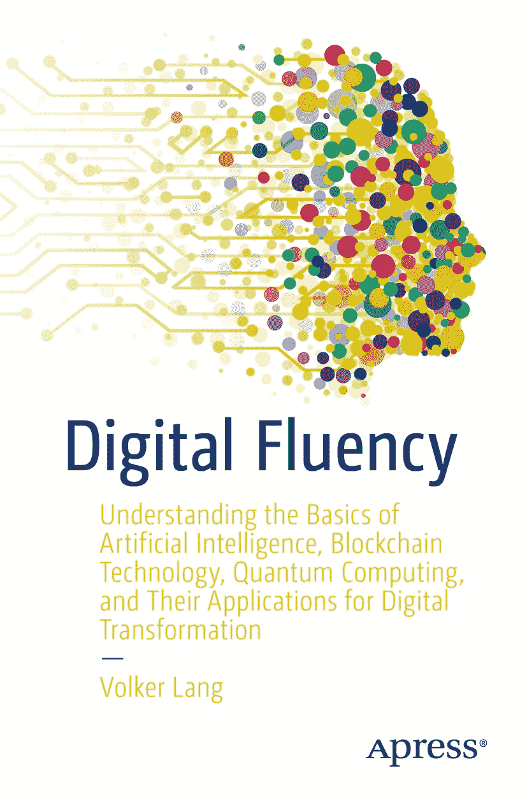

# 《数字素养》

`ISBN 978-1-4842-6773-8` `e-ISBN 978-1-4842-6774-5` [`doi.org/10.1007/978-1-4842-6774-5`](https://doi.org/10.1007/978-1-4842-6774-5) © Volker Lang 2021 本作品受版权保护。所有权利均由出版社独家授权，无论涉及材料的全部或部分，具体包括翻译、重印、插图再利用、朗诵、广播、微缩胶片或其他任何物理形式的复制、传输或信息存储与检索、电子改编、计算机软件，或目前已知或未来开发的类似或不同方法。本出版物中使用的通用描述性名称、注册商标、商标、服务标记等，即便未有特别声明，也不意味着这些名称不受相关保护性法律和法规的约束，因此可被普遍使用。出版商、作者和编辑假定，本书中的建议和信息在出版之日是真实准确的。出版商、作者和编辑均不对本书所含材料或可能存在的任何错误或遗漏提供明示或暗示的保证。出版商在已出版地图和机构隶属关系的管辖主张中保持中立。本书通过 Springer Science+Business Media New York（地址：1 New York Plaza, New York, NY 100043，电话：1-800-SPRINGER，传真：(201) 348-4505，电子邮箱：orders-ny@springer-sbm.com，或访问 www.springeronline.com）在全球图书贸易中发行。Apress Media, LLC 是加利福尼亚州的有限责任公司，其唯一成员（所有者）是 Springer Science + Business Media Finance Inc (SSBM Finance Inc)。SSBM Finance Inc 是特拉华州的公司。

*献给我的家人和朋友。*

## 对《数字素养》的赞誉

“如果你正努力让你的组织适应 21 世纪，那么《数字素养》就是你的终极指南。本书以丰富的实践案例、有价值的总结和可操作的框架，为我们这个时代最激动人心的数字技术提供了易于理解且全面的介绍。无论你是商业领袖、初创企业家、政策制定者还是学生，《数字素养》都为你提供了所需的一切，让你为我们面前激动人心的数字未来做好准备。”

> — Rasmus Rothe，Merantix AG 创始人

“在一个日益被流行语主导的技术世界里，《数字素养》将为你提供必要的理论和实践背景，让你理解人工智能、区块链和量子计算等关键数字技术。它将为当今的商业领袖提供先发优势，也是任何寻求通过利用数字技术重塑未来的人的必读之作。”

> — Jean-Luc Scherer，Innoopolis 首席执行官兼创始人

“在第四次工业革命曙光初现之际，Volker Lang 为我们呈现了一部前瞻性的杰作，让我们所有人都对数字未来感到安心。在《数字素养》中，技术和商业领域的学生及专业人士将找到宝贵的建议，这些建议将引导他们在不断发展的数字世界中，通过转型之旅找到自己应有的位置。如果你想了解人工智能、区块链和量子计算如何持续增强人类体验，那么这本优秀的指南就是为你准备的。”

> — Greg Coquillo，LinkedIn 2020 年人工智能与数据科学领域顶级声音

“通过聚焦人工智能、区块链、量子计算及其现实世界的应用，Volker Lang 写出了一本通俗易懂的书，它将赋予企业员工和领导者实现数字化转型所需的信心。我强烈推荐阅读《数字素养》。”

> — Vincent Anandraj，Mynah Partners Ltd. 管理合伙人

“数字化和数字化转型是 21 世纪的核心议题。在他的书中，Volker Lang 为最重要的数字技术建立了基本的理解，并全面描述了它们对行业和社会的影响。最终，本书清楚地表明，没有人能逃避未来，但我们都有机会和责任去塑造未来。这是一本为所有在数字时代寻求方向的人而写的书。”

> — Christoph Bornschein，TLGG 首席执行官兼创始人

“《数字素养》是对未来技术超越流行语的绝佳介绍。书中充满了大量将数字技术应用于自身工作的实践案例，强烈推荐给所有有抱负的颠覆者，从学生到经验丰富的高管。”

> — Michael Berns，普华永道人工智能与金融科技总监

“作为一个行业，我们成功地将人工智能从‘研究’转型为一项技术，它已成为全球无数人生活的一部分。而这仅仅是个开始！《数字素养》提供了企业如何有意义地拥抱人工智能的绝佳范例。”

> — Ewa Dürr，Google Cloud 人工智能产品战略与运营主管

“区块链将与其他技术不同，塑造从 2020 年到 2030 年的岁月。但只有与其他技术结合，它才能发挥其真正的能力。《数字素养》对这些不断重塑我们世界的关键技术提供了富有洞察力的介绍，并全面概述了它们的潜在应用。它促进了新的数字思维，巧妙地激发了新的应用，因此是所有领导者的必读之作。”

> — Philipp Sandner，法兰克福金融管理学院教授兼法兰克福学院区块链中心负责人

“Volker Lang 以清晰且结构良好的方式描述了解决我们时代关键问题的最相关前沿技术，使读者能够在其自身业务活动中理解并应用它们。《数字素养》是面向投资者、企业家以及私人和公共组织专业人士的数字价值创造的引人入胜的指南。”

> — Alessandra Sollberger，Top Tier Impact 创始人兼技术投资者

“数字技术塑造了过去的五十年，而新兴的数字技术有望塑造我们的未来。例如，量子计算机正走出物理实验室——它们在规模和性能上已达到成熟，即将在解决重要问题方面超越传统超级计算机。《数字素养》从当前云上可用的量子芯片到正在探索的最令人兴奋的商业应用，提供了当今量子计算行业的最新视角。”

> — John Morton，伦敦大学学院纳米电子学与纳米光子学教授

“Volker Lang 以极大的清晰度和务实精神，用通俗易懂的方式解释了数字经济的关键概念和流行语，并通过众多案例激发了对包括银行和金融在内的多种行业的新应用、产品和服务的灵感。《数字素养》是我们这个时代最重要的数字主题的绝佳介绍，也是任何在我们生活的数字世界中寻找指导的人的必读之作。”

> — Laure Frank，Raiffeisen Switzerland 数字化负责人

“《数字素养》是一本充满重要信息的愉快指南，适合那些对实现组织数字化转型的新兴技术感兴趣的人。Volker Lang 提供了对最重要数字技术的非常易于理解的概述，并为公司成功完成数字化转型提供了宝贵的建议和工具。”

> — Angeliki Dedopoulou，华为技术欧盟公共事务高级经理

## 引言

`数字化`与`数字化转型`、`大数据`与`人工智能`，以及`量子计算`与`区块链技术`，是当今媒体中最热门、被引用最多的流行词汇。人人都听说过它们，但很少有人真正理解。打个比方，它们仿佛登上一列即将出发的高速列车，无人知晓其来处与去向，但人人都想立刻上车，以免错失良机。因此，数字技术一直受到政治、工业和社会领域的激烈投机和争议性讨论，而这些讨论往往由过度的希望与恐惧所驱动。乐观主义者强调数字技术的美好前景，并预见到全新的实用应用将到来，这些应用创造的就业机会甚至比`数字化`所摧毁的还要多。而悲观者则散布恐惧，担心超越人类智能的智能且常具暴力性的机器人会导致大规模失业，从而使数百万个岗位变得多余。

无论哪一方的论据更充分，双方通常都认同数字技术将继续产生巨大的社会和经济影响。想想互联网和智能手机，它们彻底改变了我们彼此沟通、获取信息、互动以及交易的方式。例如，智能手机最初只是一个更好用的电话，后来演变为提供互联网接入的移动应用数字平台，并很快成为我们日常生活中不可或缺的一部分。随着数字技术，尤其是智能手机的到来，可随时获取的信息和数据量呈爆炸式增长。迄今为止，我们在零售、广告、媒体和音乐等行业看到了最显著的影响，但其他行业也蓄势待发。例如，谷歌每秒处理超过 40,000 次搜索。YouTube 用户每秒观看超过 68,000 个视频，Twitter（推特）上每秒发送超过 5,800 条推文。受这种惊人规模的启发，谷歌首席经济学家哈尔·瓦里安在 2013 年巧妙地指出：“十亿小时前，现代智人出现。十亿分钟前，基督教诞生。十亿秒前，IBM 个人电脑发布。而十亿次谷歌搜索前……是今天早上。”^(¹) 社交网络服务 Instagram（照片墙）则是另一个例子，其日均使用时长 28 分钟，每天超过 890 万张新照片和视频被上传，这有力地展示了互联网、智能手机和其他数字设备如何彻底改变了我们消费信息的方式。新闻不再通过印刷报纸和杂志阅读，而是通过在线媒体平台和 Facebook（脸书）等社交网络获取，这完全颠覆了传统媒体和新闻出版公司的业务。亚马逊、阿里巴巴、微软、Netflix（网飞）和 Spotify（声田）只是少数几个早期探索并抓住这一数字趋势，成功利用数字技术颠覆现有业务并创造高利润数字化收入流的公司例子。

如今，我们也看到了金融服务行业数字化转型的开端。在那里，老牌投资银行和数百家金融科技初创公司——背后有数十亿美元的风险资本支持——正在运用一系列数字技术来提升其产品和服务。它们用量子计算机优化金融价值链和定价模式，提供由区块链技术驱动的易用零售银行和支付服务，并通过人工智能增强网络安全——正如你将在本书的精选案例中所见。

由 2020/2021 年全球肆虐的致命 COVID-19 病毒引发的严重冠状危机所加速，数字化转型也已开始冲击经济上非常重要的汽车行业。我们可能将在不远的将来看到，例如：由人工智能驱动的自动驾驶汽车，基于区块链技术、具备车载支付系统的全互联车载信息娱乐服务，以及利用嵌入移动云基础设施中的量子计算来识别拥挤城市中最快路线的导航系统。汽车行业的数字化转型有望通过新功能改善客户体验，并带来生产力、效率提升和成本节约方面的巨大收益，因此它席卷现代工业和社会各个领域只是时间问题。

任何关于数字化转型的讨论，如果不提及其对政府组织（如中央银行、税务局、国家法院、公证处和卫生部门）的广泛影响，都将是不完整的。数字化转型不仅帮助私人组织简化内部流程，也帮助公共机构减少官僚主义并优化公共产品和服务组合。毫无疑问，无论是私营还是公共组织，今天拥抱数字技术的那些，将决定其在未来几十年中的竞争地位。

《数字素养》旨在成为一本面向私人和公共组织员工及决策者的入门手册，帮助那些希望理解数字技术并将其应用于自身生态系统中的人。因此，本书广泛尝试综合关键概念，并汇集当今促进组织数字化转型的最重要技术。你将在本书中看到，`量子计算`、`区块链技术`和`人工智能`是最重要的数字技术，因为它们可以应用于现代工业和社会所有部门的众多用例。

但是，数字技术究竟是什么，它们又是如何运作的？我们如何在工作和日常生活中应用它们？我们如何利用它们来优化现有机会并创造有价值的新机会？`量子计算`、`区块链技术`和`人工智能`最突出的用例是什么，它们何时具有实际意义？与现有技术相比，它们的优缺点是什么，利用它们涉及哪些限制和挑战？《数字素养》将回答你心中关于`数字化`和数字技术的所有首要问题。这些答案将使你能够深入理解它们，这是评估它们对你自身专业生态系统影响、并为等待我们的激动人心的数字未来做好准备的重要前提。读完本书，你将能够更好地理解数字技术，批判性地审视关于它们的每日新闻，并且——最重要的是——评估它们对你个人生活和职业生涯的相关性和影响。

如果您是商业领袖，`数字素养`能让您深入了解数字技术及其对管理和决策的影响。如果您是学生，本书将为您提供不同的技术框架，用于思考数字行业的工作和职业生涯演变。如果您是金融分析师或风险投资人，`数字素养`能为您提供富有启发性的见解，助您制定并实施高利润的投资策略。另一方面，如果您是政治家或政策制定者，您将更清楚地理解数字技术如何影响社会及政府组织，尤其是如何用于简化行政流程。如果您是普通读者，不属于上述任何一类，您将对数字技术如何影响现代工业与社会，以及它们将如何在一个日益全球化、高度互联的数字化世界中塑造我们每个人的未来感到惊讶。

阅读本书时，您会意识到，数字转型与数字技术的历史是一场跨越经济学、行为科学、信息技术、自然科学和物理学等多个学科领域的愉快且引人入胜的旅程。这就是为什么在接下来的章节中，我将向您介绍现代科学中最基本、最迷人的一些概念，而无需您具备超出初中水平的数学技能。

`数字素养` 共分为五个章节，旨在涵盖关键科学概念并突出重要的应用示例。以下是各章节的简要介绍：

-   **第 1 章“数字化与数字转型”**：本章为您提供数字化和数字转型的基础知识。您将了解到这两个概念源于`量子计算`、`区块链技术`和`人工智能`等不同数字技术的融合，这些技术本质上是颠覆性的。此外，我们将探讨组织的数字生态系统，并识别其中最重要的数字转型驱动力，例如可持续性、网络安全，以及产品和服务日益增长的复杂性和连接性。我们还将审视数字转型战略，包括亚马逊、谷歌、微软和 IBM 的创新模式，以强调数字转型远不止是简单更新组织的 IT 基础设施。来自诺基亚和伊士曼柯达公司的广为人知的案例将说明数字颠覆的致命后果——这是一种竞争力量，常常导致现有企业如果不能及时利用数字技术就会失败。本章最后将简要介绍经典信息处理，这是现代计算机、智能手机以及我们日常生活中使用的其他数字设备运行的基础。

-   **第 2 章“量子计算”**：在本章中，您将学习`量子计算`的关键概念，这是最令人兴奋且技术上最具挑战性的数字技术之一。量子计算机有时被称为“下一阶段的超级计算”，因为它们可以同时进行海量计算，与传统计算机相比，在计算速度和性能上提供指数级的提升。这种巨大的提升与不同的量子效应有关，例如叠加和纠缠，这些效应被用于编码和处理量子信息。我们还将涵盖最重要的物理实现方案和基本类型的量子计算机（这些在媒体中常被错误使用）。除此之外，还将介绍当今市面上一些最相关的量子计算机，例如 D-Wave 名为 5000Q 的量子退火器和谷歌传奇的 Sycamore 量子处理器。后者最近引起了媒体的极大关注，因为谷歌在 2019 年首次展示了量子霸权，这是量子计算机发展中的一个重要技术里程碑。最后但同样重要的是，我们将讨论最重要的应用，例如药物开发、金融投资组合优化和量子机器学习。

-   **第 3 章“区块链技术”**：在本章中，我们将审视`区块链技术`，该技术最初是为比特币而创建的。比特币是迄今为止全球首个且最流行的数字货币或加密货币。您将了解到`区块链技术`——有时被称为“终极信任机器”——如何在不可信环境中部署信任。它因此使得两个或更多交易方之间能够进行可信的价值交换，即使他们既不了解也不信任对方。您可能会惊讶地了解到，此处的价值可以指任何有价值数字信息，例如数字货币、知识产权和其他数字化资产。对最重要的关键概念（包括点对点计算机网络、数字签名和梅克尔树）的生动解释，也将使您能够更好地理解用于转移货币价值的整个比特币交易生命周期。此外，我们将涵盖智能合约，作为`区块链技术`的一个重要扩展，它使得组织中的行政流程自动化成为可能。虽然大多数专家认为比特币曾是一时热潮，但我们在本章末尾将看到，`区块链技术`的应用仍在持续增长。为此，我们将讨论最重要的应用，例如国际贸易平台、供应链管理系统，以及电子税务和电子投票。