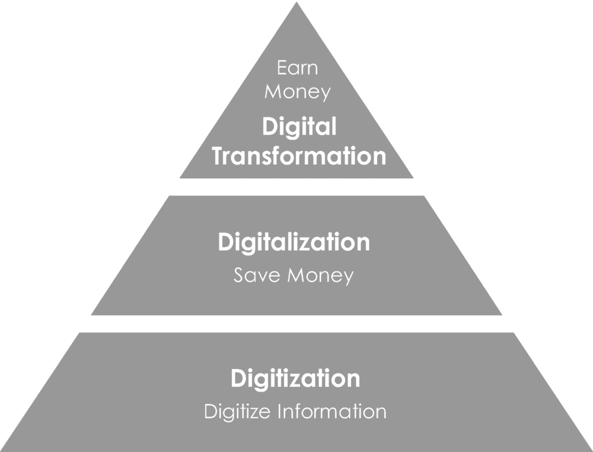
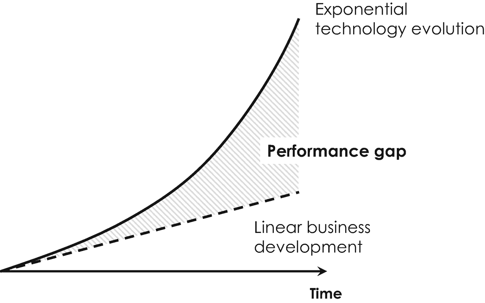
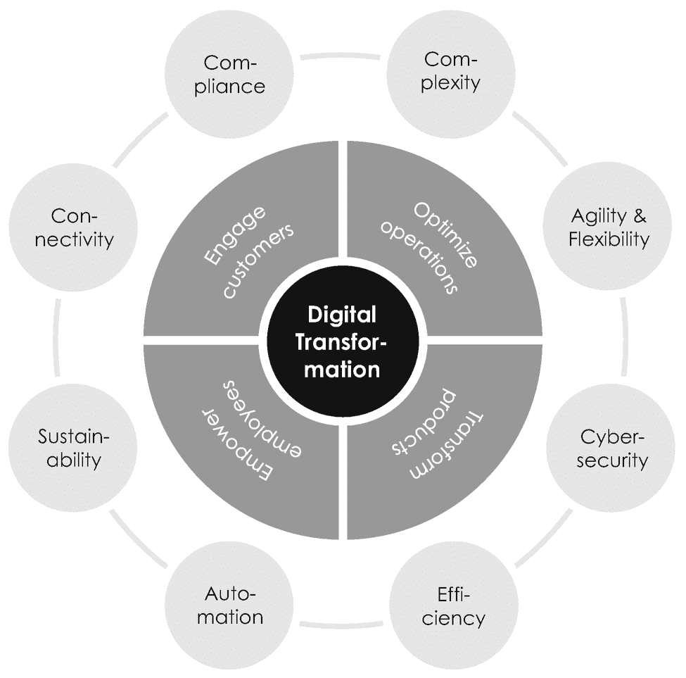
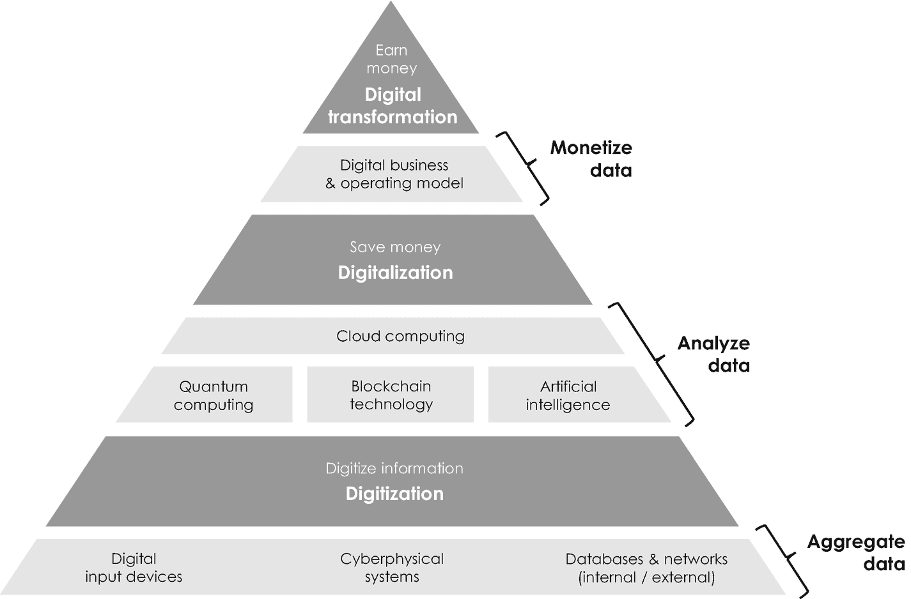
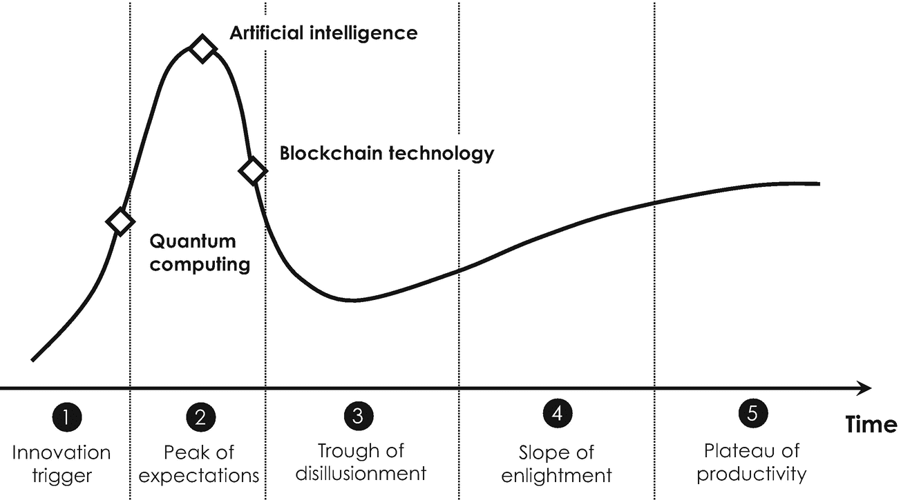
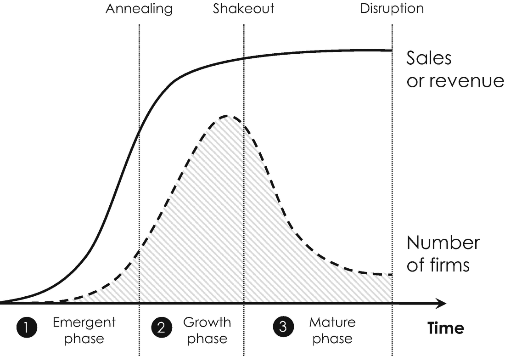
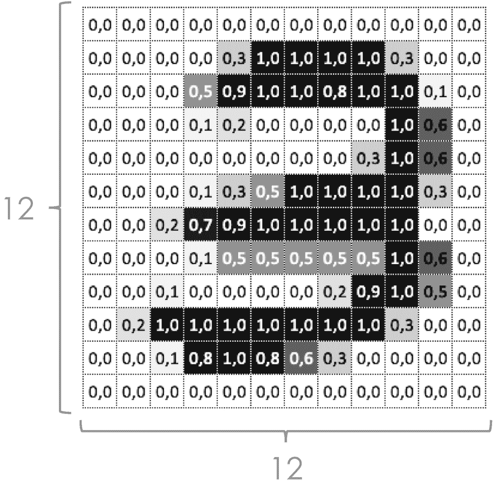

# 1.3 数字生态系统

由于数字化和数字化转型对商业和社会具有重大意义，学术界对它们进行了深入研究。管理咨询公司以及谷歌、微软、亚马逊等数字时代企业，也经常在其博客上发表富有洞察力的相关文章和报告^(¹¹)。随着时间的推移，数字化和数字化转型出现了不同的定义，每个定义都强调了不同的方面。例如，两位传播学者斯科特·布伦南和丹尼尔·克雷斯通过数字通信和媒体对当代社会生活的影响来定义数字化 [18]。《牛津英语词典》则提供了一个更为实用的定义，该词典将“数字化”一词的首次使用追溯到 20 世纪 50 年代中期计算机的出现，并将其定义为“一个组织、行业、国家等采用或增加使用数字或计算机技术”。此外，这部英语语言的主要词典区分了数字化（digitalization）和数字转换（digitization），后者被定义为“数字转换的行为或过程；将模拟数据（尤其是在后来的使用中，图像、视频和文本）转换为数字形式。”实际上，最直观的定义之一可以在高德纳的 IT 术语表中找到，该术语表为这些术语提供了以下定义^(¹²) [19]：

*   “*数字转换*是从模拟形式到数字形式的改变过程……换句话说，数字转换将一个模拟过程改变为数字形式，而过程本身没有任何本质上的改变。”
*   “*数字化*是利用数字技术改变商业模式，并提供新的收入和价值创造机会；它是向数字业务转型的过程。”
*   “*数字化转型*可以指从 IT 现代化（例如，云计算）到数字化优化，再到发明新的数字商业模式等一切事务。该术语在公共部门组织中广泛使用，指的是诸如将服务上线或传统系统现代化等适度的举措。”

换句话说，数字化和数字化转型是由数字通用技术推动的企业变革过程。这些定义表明，这三个术语本质上是相互关联并依次出现的。这就是为什么学者们有时会使用图 1-1 所示的金字塔结构来举例说明它们之间的关系。这个简单的图形说明，数字转换、数字化和数字化转型是层层递进的，其中数字转换是它们的基础。数字转换只是将来自传感器和其他输入的信息转换为数字格式，以便进行进一步的数据处理。中间层的数字化则利用这些数字信息来得出结论或发现隐藏的、有洞察力的模式，从而通过优化和自动化业务流程来节省资金。该金字塔的最高层是数字化转型。它使企业能够节省资金，同时还能通过创造新市场和提供新的商业机会来赚取额外收入。数字化转型是由数字技术推动的。这就是为什么它有时被称为*技术驱动的数字化转型*，以强调它依赖于将不同的数字技术整合并跨学科地融合到组织的所有核心领域——这是一个重要方面，我们将在下文中更详细地讨论。



**图 1-1** 数字转换、数字化和数字化转型之间的关系

## 数字化转型

数字化转型是一个战略性规划且影响深远的变革过程，旨在建立一个以软件和数据为中心的组织。它由数字转换和数字化所推动，并得益于利用量子计算、区块链技术和人工智能等数字支持技术。

*数字技术*通常有助于数字信息的（1）处理、（2）通信和（3）存储。过去几十年的经验观察发现，这三个核心方面的时序演进可以用三个指数定律来描述：

1.  *摩尔定律*描述了处理能力的指数级演进，指出计算机芯片中的处理单元数量每 18 个月翻一番 [22]。
2.  *巴特定律*与网络的通信速度有关，该速度每 9 个月翻一番 [23]。
3.  *克莱德定律*指出存储容量每 13 个月翻一番 [24]。

考虑到像汽车这样的成熟产品需要超过 24 个月的开发时间，这些时间尺度确实是指数级且令人惊叹的。虽然数字技术的三个核心维度呈现指数级的时序演进，但我们的大脑通常不习惯这种指数级发展。这也是大多数领导者低估数字技术对组织影响的原因，因为他们过去几年看到的往往是线性发展。为清晰起见，图 1-2 描绘了由此产生的指数级技术发展与线性业务演进之间的差距。这种差距通常与未开发的商业机会有关，并且经常由利用数字技术的创新初创企业来填补。这种绩效差距随着时间的推移而扩大，直观地显示了技术驱动型数字化转型的必要性。



**图 1-2** 线性业务发展（虚线）与指数级技术演进（实线）。由此产生的差距（阴影区域）通常由创新型初创企业填补

然而，如前所述，数字化转型远不止是将数字技术整合到现有的 IT 基础设施中以实现流程无纸化。例如，首席信息官社区“企业家项目”指出：“数字化转型是将数字技术整合到业务的各个领域，从根本上改变你的运营方式和为客户提供价值的方式。这也是一种文化变革，要求组织不断挑战现状、进行试验，并坦然面对失败” [25]。在面对深刻的经济、环境和社会变革的日益全球化和互联互通的世界中，数字化转型有助于组织持续提升生产力和竞争力。柯达公司的例子（以及其他例子）清楚地表明，抵制某些技术的组织面临被颠覆的风险。

专家们提出了各种可能预示某个行业容易受到颠覆的因素。最重要的颠覆迹象包括：

*   客户满意度下降。
*   客户群正在老化。
*   客户感到不便 [26]。
*   客户忠诚度低 [27]。
*   产品和服务的高成本促使人们使用技术来节省成本，而不是为客户的生活增加价值 [26]。
*   风险资本家兴趣增加，他们作为局外人，看到了该行业隐藏的机会。


### 1.3.1 主要驱动力

数字化颠覆是一股非常强大的力量，自出现以来一直在改变着企业格局。当今的组织不仅被推动着将数字技术整合到其核心流程中，如今也频繁地发现自己要与本行业之外的创新型新参与者竞争，例如汽车制造商和出行服务提供商 [28]。随着汽车互联程度日益提高，传统汽车制造商的商业模式正受到数字商业模式的威胁，这些商业模式为按需娱乐和信息娱乐服务提供市场。这两种功能正越来越多地嵌入到汽车生态系统中，例如，针对在途自动驾驶汽车的驾驶员和乘客——可以说，汽车变成了一个“车轮上的智能手机” [29]。出行服务提供商 `Uber`、`Lyft`、`DiDi` 和 `Waymo`，以及由 `Google Automotive Services` 提供的（开源）汽车操作系统，只是为高度互联和面向服务的驾驶体验指明方向的几家公司。正因如此，预计软件平台提供商未来将在汽车行业中占据越来越核心的位置，并有望连接和“协调”传统上各自为战的参与者。汽车行业的这一转型预计还将影响到相关的商业领域，包括保险公司、车辆维修保养提供商、（充电）基础设施提供商、执法机构，以及依赖汽车税收等其他政府机构。哈佛商学院的三位经济学家罗伯特·博克、马尔科·扬西蒂和卡里姆·拉哈尼最近的一项研究表明，那些拥抱数字技术以创新商业模式的“数字领导者”，其运营利润率和利润比“数字落后者”高出超过一个数量级 [30]。换句话说，及早进行正确的技术投资，将为日后带来更高的盈利能力和收入增长 [31]。那么，这场转型的主要驱动力是什么？为了充分发挥数字技术的潜力，我们需要了解它们的哪些方面？最重要的几个驱动力如图 1-3 所示，并将在下文依次进行解释。



**图 1-3** 外部驱动力（浅灰色）与数字化转型的四大支柱（深灰色）

#### 主要驱动力：复杂性

复杂性可能是最强大的驱动力之一，并且有多种催化剂。它尤其受到以下因素的驱动：(1) 个性化，即营销的终极目标，旨在为客户提供量身定制的产品体验；(2) 全球化及其日益复杂的供应链，包含众多的供应商和合作伙伴；(3) 数字化以及决策中需要考虑的数据量不断增加。关于个性化以及日益多样化的产品和服务，`Netflix` 的传播总监乔里斯·埃弗斯在 2013 年向《纽约时报》巧妙地总结道：“有 3300 万个不同版本的 `Netflix`” [32]，这意味着每位用户的客户体验都变得越来越个性化，并针对个人需求量身定制。

#### 主要驱动力：敏捷性与灵活性

在一个日益全球化的世界里，要在高度动态和快速变化的商业环境中取得成功，需要具备内部业务流程的敏捷性、灵活性和速度。例如，敏捷的产品开发流程对于缩短开发周期、满足客户的期望至关重要，客户期望频繁的更新以及将他们的反馈快速整合到现有产品和服务中。

#### 主要驱动力：网络安全

网络安全关乎保护对组织竞争优势至关重要的数据（如知识产权和客户数据）免遭盗窃或损害。在数字时代，这一点越来越重要，因为数据不再局限于封闭的数据库和遗留系统，而是可以无阻碍地在网络中流动。仅靠高标准的网络安全本身不太可能赚大钱，但糟糕的网络安全可能会给组织带来大量的时间、金钱和麻烦。这方面最著名的例子之一是“`WannaCry`”程序，该程序于 2017 年春季侵入了全球 150 个国家的众多组织。该程序通过电子邮件传播，锁定计算机，并要求用户支付一定金额才能解锁设备——此次网络攻击造成的经济损失估计约为 40 亿美元。网络攻击对个人、企业和政府而言是快速增长的风险，会造成财务和声誉损害。因此，IT 安全市场以每年 10% 的速度增长也就不足为奇了。但遗憾的是，这种增长并未跟上威胁数量的增长，后者大约每年翻一番——这是指数级技术增长与线性业务反应之间不匹配的又一个例子。

#### 主要驱动力：效率

效率是一种自始至终都在塑造组织的趋势。它通常描述避免浪费资源的能力，包括材料、能源、精力、金钱和时间。*效率原则*是一项经济信条，指出当企业以尽可能低的成本生产其产品和服务时，其效率最高。由于数字技术也可以通过简化内部流程来节省资金，效率几乎是组织数字化转型的一种自然驱动力。

#### 主要驱动力：自动化

自动化指的是通过自动化生产流程来提高生产力。这包括通过智能的、具有环境感知能力的机器人实现工业制造的自动化，也包括物流和库存管理系统等更偏行政性流程的自动化。行政流程自动化的一个例子是，在满足特定合同条件（例如，公司仓库收到货物）时自动执行付款。

#### 主要驱动力：可持续性

可持续性指的是对有限（自然）资源的最佳利用。这一驱动力涵盖从避免浪费到最大限度地减少对环境有害的排放，并依赖于优化材料和能源消耗流程。一个例子是电动出行，它有助于在纯电动汽车的生产和运营过程中减少对环境有害的排放。


#### 主要驱动力：连接性

从客户的角度来看，客户端的连接性指的是由以往各自为政的参与者开发的、完全互联的产品与服务。只需想想分别嵌入汽车导航和娱乐系统中的 `Google Maps` 和 `Apple CarPlay` 即可。从公司的角度来看，连接性也可能指将越来越多的数字设备添加并互连到制造基础设施中，以实现预测性维护或用于自动化生产流程的工业物联网。因此，连接性可能指组织内部和外部的技术趋势。

#### 主要驱动力：合规性

对于处于高度监管生态系统中的组织而言，透明地管理与安全和质量相关的信息是合规性以及防范不当行为风险的关键组成部分。对记录某些业务流程（例如生产车辆安全气囊）的要求贯穿整个组织，这是因为法律法规和内部最佳实践迫使组织提升运营卓越性、组织性、清晰度、透明度及问责制。数字技术可以帮助实现信息透明化、增强整个价值链的可追溯性，并完整且不可篡改地记录业务流程。

生态系统日益增强的连接性和复杂性，与另一个在当今媒体中持续备受关注的概念有着内在联系。这里指的是大数据这一术语。`大数据`指的是对规模过大或复杂到传统信息处理技术无法应付的数据集进行系统性收集和分析。该术语最早出现在 1997 年由 NASA 研究人员 Michael Cox 和 David Ellsworth 撰写的一篇论文中，他们写道：“[数]据集通常非常庞大，对主内存、本地磁盘甚至远程磁盘的容量都构成了挑战。我们称之为大数据问题” [33]。随着 2004 年 Facebook 和 2005 年 YouTube 的登场与迅猛崛起，智能手机和其他移动设备全天候消费和创造数据的时代开始了。自那时起，通过万维网的月数据流量持续增长，并于 2010 年达到每月 200 亿 GB。根据 GSMA 报告 [34]，四年后，移动连接数达到 72.2 亿，首次超过了地球上的人口数量。2018 年，全球各地的人们每分钟在 YouTube 上上传超过 400 小时的视频。同年，全球每分钟还发送约 1.56 亿封电子邮件，并发布超过 45.2 万条推文，这相当于每天数据量增加超过 1 泽字节或 `10²¹` 字节的数据^(¹⁴)——这真是一个令人叹为观止的大数据实例。

大数据的分析通常需要使用统计方法来提取具有相关商业影响和经济价值的信息。大数据通常由三个 V 来表征：体量（Volume）、速度（Velocity）和多样性（Variety）。`体量`仅指数据量，而`速度`指数据生成的速度。`多样性`则表征了不同数据格式（如文本、音频、视频及其他数据类型）的可用性。^(¹⁵)

从战略角度来看，如果严格避免数据泄露和滥用，大数据可以成为持久的竞争优势。赢得并维护客户信任是数据核心型及数字技术驱动型公司的核心。这在 2012 年《纽约时报》一篇题为《公司如何了解你的秘密》的热门文章中有所阐述 [35]。记者讲述了这样一个故事：一位父亲去他常去的杂货店投诉，抱怨他十几岁的女儿奇怪地收到了婴儿用品优惠券。店经理道了歉，几天后又打电话再次道歉，却得知这个女儿实际上已经怀孕了。你可以想象，这家店最终不可挽回地失去了这位女儿顾客。

#### 大数据

大数据指的是组织日常收集的、庞大且多样化的数据集，可以通过挖掘获得有价值的洞察和信息，从而提供增值。它通过以下三个方面来描述：(1) 体量或规模，(2) 创建和收集数据的速度或速率，以及 (3) 所涵盖数据点的多样性或范围。


### 1.3.2 数字化转型战略

这些驱动力对于希望采用数字技术的企业来说意义重大，因为它们必须超越现有的业务和运营模式，寻找创新且高效的方式将其整合。迄今为止，数字化转型代表了一种端到端的业务转型，从根本上改变了组织的运作方式以及为客户创造价值的方式。在此过程中，组织需要将运营变革管理建立为核心能力，以管理数字化转型——我们将在第 5 章“您的数字行动计划”中更详细地探讨这一方面。国际数据公司（IDC）的 Jessica Goepfert 在此背景下指出：“这种[数字]转型因行业不同而呈现出不同的形态。例如，在银行和零售业……投资主要围绕管理和重振客户体验。而在制造业，企业正在重塑自我，本质上成为高科技公司，利用其产品作为平台来支持和提供数字服务”[36]。

那么，面对前文概述的数字驱动力和技术趋势，组织应如何应对？在我们仔细审视亚马逊、谷歌及其他公司的数字化转型战略之前，有必要介绍一个文献中经常在此处出现的经典辩论。这场辩论为解决先前讨论过的克莱顿·克里斯坦森的“创新者困境”铺平了道路，其核心在于“利用”与“探索”之间的平衡[37, 38]。*利用*是指专注于现有的收入来源，并在既定领域优化运营卓越性；而*探索*则是发现并试验新的增长机会[39]。著名的加拿大商业管理学者兼作家亨利·明茨伯格从战略角度描述了这种决定性的平衡，并指出商业机会和战略通常源于两个不同的方面：(1) 可预期和计划内的机遇，以及 (2) 通常在尝试实施原始计划或战略时出现的意外机遇。第一种选择被称为*预定战略*，最适合通过分析未满足的客户需求并据此设计未来的产品和服务，来利用现有的收入来源。第二种选择称为*应急战略*，涉及探索新机遇并解决未预料到的问题。战略几乎总是预定计划与意外机遇的结合，因为它源于无数日常决策，以在实践中共追求特定机遇并优先发展某些产品和服务。这也是英特尔创始人兼前首席执行官安迪·格鲁夫曾说过的话：“如果你想知道一家公司的战略是什么，不要听他们说什么，要看他们做什么。”

过于侧重两种战略方向中的任何一种都会带来风险。如果公司过于关注利用其现有（且历史上成功）的业务活动，它们就会忽视探索新领域的需求——这些新领域可能在未来为其提供新的商业机会，并增强其长期生存能力。这种风险通常被称为*成功陷阱*[40]。一个非常著名的例子是瑞典电信公司诺基亚，它长期是手机销售市场的领导者，但未能及时转向为现代智能手机铺平道路的触摸屏技术[41]。

另一方面，如果公司主要专注于探索新的业务活动，它们就会面临所谓的*永久搜索陷阱*的威胁，这指的是公司未能将早期创新规模化并实现盈利。在这方面，一个经常被引用的例子是技术公司施乐（Xerox），它是美国大型办公设备生产商。早在 1984 年苹果推出 Macintosh 之前，施乐位于硅谷和斯坦福大学创新中心附近的 PARC 实验室的工程师就提出了诸如计算机鼠标和图形用户界面等开创性发明。然而，施乐当时未能平衡这两种技术的潜力，未能以相匹配的驱动力将其利用到现有产品中。相反，他们公开向其他商业领袖展示，包括苹果的传奇创始人史蒂夫·乔布斯。乔布斯在参观施乐 PARC 实验室时曾指出：“你们坐在一座金矿上。为什么不用这项技术做点什么？你们可以改变这个世界！”

那些在利用数字技术方面特别成功的组织，其特点在于能够平衡这两种战略方向。它们通过使产品和服务持续适应当前的客户需求和期望来利用现有收入来源，同时通过探索和试验新的商业机会来适应环境变化。这就是经济学家在此背景下谈论*双元性组织*的原因[42]。双元性以及谨慎平衡利用与探索的能力，是所有数字化转型的核心，如下面的例子所示。

微软公司是成功制定战略以平衡利用与探索，从而持续调整其产品和服务以适应不断变化的商业环境的典范。微软是全球数字化和数字技术的领先倡导者和拥有者之一。在 2016 年微软全球合作伙伴大会的主题演讲中，微软首席执行官萨提亚·纳德拉将数字化转型描述为以下四个基本支柱，如图 1-3 内圈所示[43]：

1.  *运营优化*包括内部业务流程的数字化，通常始于将公司的 IT 基础设施转变为基于平台的架构——我们将在第 5 章“您的数字行动计划”中进一步讨论这一措施。任何优化的基础都是对现状的透明度，这也是各种数字技术的主要目标。

2.  *产品与服务转型*是指通过整合新技术来推进现有的产品或服务组合，从而创造新的商业机会和收入来源。

3.  *员工赋能*对于成功的数字化转型至关重要。需要让员工能够随时随地、在任何设备上发挥最佳工作状态，从而提高他们的效能、效率和生产力。此外，还需要授权员工自主工作，并根据他们个人的优势劣势、兴趣、工作经历和资质来选择项目。

4.  成功数字化转型的另一个先决条件是*客户互动*，即通过征求客户反馈并分析他们的反应，来更好地理解其需求并据此个性化产品。客户的期望决定了未来的产品和服务，这就是为什么它们从广义上定义了任何数字业务转型的战略方向和目标。


微软的四大支柱清晰表明，数字化转型并非企业 IT 基础设施的一系列代际升级，也不是基于企业数据迁移至数字平台的业务流程简单数字化。数字化转型的真正内涵在于：（1）通过开放且善于沟通的文化塑造创新思维，（2）汇聚充满热情且多元背景的人才，（3）提供高效且同样实用的 IT 工具，从而以最优方式支持人员与业务流程。这正是企业在日益全球化和互联互通的世界中实现持久增长与保持竞争力的秘诀。

世界经济论坛在 2016 年发布的一份颇具影响力的白皮书中，对数字化转型有如下论述：

> 机器人技术与人工智能系统不仅将用于替代人类任务，更将增强人类技能。这同样会给企业带来挑战，企业需要对员工进行再培训，使其能够有效地与新技术协同工作。[……] 要充分实现技术增强的潜力——不仅要提高生产力，还要减轻自动化带来的失业问题——再培训将至关重要[44]。

或许没有哪家企业比亚马逊更能体现一家公司如何利用数字技术实现业务转型，正因如此，我们也将更深入地审视这个堪称双元型企业的成功典范。1994 年，美国计算机科学家杰弗里·贝佐斯凭借其高超的*故事讲述*技巧，向多位风险投资人阐述了他关于在线市场的商业构想。他的故事引人入胜且同样简洁明了：他设想通过持续投资于客户利益——如最低价格、丰富的产品选择以及快速配送——来打造地球上最大的商店。在那之前，风险投资人的宠儿始终是利润。杰弗里·贝佐斯成功打破了这一传统，用令人信服的愿景和巨大的增长前景取代了利润。他筹集了 21 亿美元的投资资金，并于 1994 年创立了亚马逊，最初以在线图书市场起步——图书在他看来是开拓电子商务利基市场的完美品类，因为它们是定制化产品，具有较低的财务价值和风险。为了超越竞争对手并强化“品类齐全”这一核心价值，他很快开放了名为`sales platform`的亚马逊市场平台，引入第三方卖家^(¹⁶)，并开始销售电子产品、软件、视频游戏以及其他一系列（消费）商品。

随着客户、供应商及第三方卖家数量的稳步增长——亚马逊市场平台如今已占亚马逊销售额的 40%以上——这家公司开始变得像任何一家传统企业，并陷入了日益复杂的成本问题以及制约其进一步增长和创造价值的其他严重瓶颈。亚马逊演变成了一种“筒仓式”架构，拥有众多基于不同零售领域、客户和产品细分市场的组织子部门。每个部门都实施自己的软件解决方案，以满足其特定职能的需求，并在各自孤立的企业环境中进行自我优化。其结果是，IT 基础设施高度碎片化，充斥着大量不兼容的软件应用，运行在互不兼容的 IT 系统上，并访问着众多分散、充满不一致和非标准化数据的数据库。

此时，杰弗里·贝佐斯意识到，管理这种日益复杂的基础设施的唯一途径，就是对其公司进行数字化转型，使其成为一个充分利用数字技术优势、以软件和数据为驱动的现代组织。为此，他试图打破多年来形成的组织和技术壁垒。他摒弃了通过将复杂性分解为更小、专注于单一和高度专业化任务的职能单元来进行管理的方式，而是构想出一个具有集成特性团队、符合著名*镜像假设*的敏捷组织。这一观察可追溯至美国计算机科学家梅尔文·康威，他在 1967 年就敏锐地指出，公司设计的系统必然受限于其组织结构中普遍存在的沟通模式 [45]。换句话说，高度集成且复杂的软件应用无法由高度解耦的职能单元开发出来，这解释了为何杰弗里·贝佐斯要为其公司引入一种由敏捷协作模式支撑的新组织结构。这一组织变革对于基于共享软件平台（该平台包含中央数据管道以及可通过清晰用户界面快速部署的标准化软件模块）实现公司核心基础设施的数字化亦至关重要。^(¹⁷) 这些软件和数据分析工具被用于分析客户、了解其偏好，并创建个性化优惠和产品推荐，从而促进销售并维持持久增长。

这个中央数据和软件平台由亚马逊云服务（Amazon Web Services）提供和维护，该部门发展迅速，现已对公众开放，并在 2018 年贡献了亚马逊 2300 亿美元总年收入的 11%以上。成立十二年后，亚马逊最大的业务板块仍是其在线零售市场，贡献了总年收入的 52%以上——这是数字化转型书写的又一个持久成功故事，并由数字技术赋能得以实现。


### 1.3.3 数字关键技术

前述示例已表明，**数字化**、**数字化转型**以及**数字变革**建立在不同的支持技术之上。数字化从三大类用于数据创建、聚合和收集的设备与系统中获取数据。第一类是数字输入设备，例如计算机键盘或图像扫描仪，它们能够促进信息从模拟向数字的直接转换。信息物理系统包含传感器，是第二大信息来源。它们用于实时监控工业生产线上物理对象和过程，包括测量能耗的智能电表、辅助工人的可穿戴设备，或检测机器中工件是否存在的光传感器。第三类则是组织内外的数据库和网络，例如私有内部网和公共互联网。数字输入设备、信息物理系统以及数据库和网络是最重要的信息来源，也是典型数据聚合基础设施的基础，如图 1-4 中的扩展金字塔所示。



**图 1-4** 数字化、数字化转型和数字变革（深灰色）之间的关系，以及它们在聚合、分析和变现数据（浅灰色）方面的赋能因素。所有数字技术的基础是数据聚合系统，它负责将模拟数据转换为数字数据。

从这些来源获得的数据通常存储在一个数据聚合平台或数据湖上，以便进行数据处理。^(¹⁸) 这正是本书介绍的三大焦点技术发挥作用的地方。量子计算、区块链技术和人工智能，使我们能够处理、分析并最终将数据变现。它们是公共和私营部门实现数字化转型和数字变革最重要的赋能技术，也是让数据创造利润的先决条件。包括量子计算、区块链技术和人工智能在内的数字技术可以通过三种方式创造价值：它们（1）通过自动化等方式降低成本；（2）通过推动销售和效率等方式增加收入；（3）创造新的业务线。组织可以通过建立自身内部资源和能力，或通过订阅云计算服务来使用这些支持技术，我们将在第 5 章“你的数字化转型行动计划”中详细讨论。云计算——在这里需要说明的是——是一种 IT 基础设施，它通过互联网按需提供不同的计算服务。云计算不仅为常规的数据存储和处理提供资源，也提供更先进的数字技术，如量子计算、区块链技术和人工智能。最流行的云计算供应商是 AWS、Microsoft Azure、Google Cloud 和 IBM Cloud。

量子计算有时被描述为计算领域的前沿，因为它能够解决非常复杂且计算密集型的商业问题。另一方面，区块链技术是通过加密且可信的数据库来管理信息的概念性突破，这些数据库使得加入分布式区块链网络的任何人都可以使用数据。在这三者中，人工智能可能是最受欢迎的支持技术。它能够从大数据中推断模式，以简化、优化和自动化业务流程，包括制造和行政流程。围绕这些技术的大量炒作，源于媒体上众多关于理论可能性与现实可实现性对比的文章和报道。美国科学家和未来学家罗伊·阿马拉曾就此指出：“我们（人们）倾向于高估一项（新）技术在短期内的影响，而低估其长期影响。”这一观察后来被称为阿马拉定律。

全球研究与咨询公司 Gartner 根据新兴技术获得的公众关注度，分析了技术采用的不同阶段。其结果是 Gartner 的“技术成熟度曲线”[47]，该曲线定性地描述了技术采用所经历的五个阶段，如图 1-5 所示：

1.  **技术触发期**：技术成熟度曲线的起点。由一项技术的公开引入开始，该技术在公众和媒体中引发了日益增长的兴趣。

2.  **期望膨胀高峰期**：与新兴技术相关的期望和希望超越了其能力的现实情况。以互联网的引入为例，这种炒作体现在 2001 年突然破裂的“互联网泡沫”中。

3.  **泡沫破裂幻灭期**：泡沫破裂的结果，最初对技术潜在价值的兴奋被幻灭所取代。

4.  **稳步爬升复苏期**：随着早期采用者克服初步障碍，找到新兴技术有价值的应用，从而吸引越来越多的追随者，兴趣重新增长。

5.  **生产成熟期**：技术成熟度曲线的最终阶段。随着越来越多的组织意识到一项技术的实际益处，并决定将其用于自身业务，采用率急剧上升。这种采用率的急剧上升在图形上类似于曲棍球棒曲线。



**图 1-5** Gartner 技术成熟度曲线的五个阶段，以及量子计算、人工智能和区块链技术的当前状态。转载自[48]

Gartner 会定期更新其品牌化的技术成熟度曲线，最新版本（2018 年）可在[48]上获取。该曲线显示，量子计算目前即将进入第二阶段，区块链技术处于第三阶段。人工智能目前正处于第二阶段的顶峰，这解释了它目前在媒体上的高人气和高度关注。Gartner 技术成熟度曲线因其缺乏实证支持以及与实践中技术采用情况不完全匹配而受到一些人的批评。然而，它确实为理解媒体如何认知技术以及如何解读相关文章和新闻提供了有用的参考。


`S-curve`（S 曲线）是描述技术采用在行业层面，其销售额和收入随时间发展的一个常见工业模式，而 Gartner 的炒作周期则从媒体关注度和公众期望的角度来描述技术采用。该模式揭示了三个主要阶段，如图 1-6 所示。第一阶段由早期采用者主导，他们探索和试验新技术，以找出其潜在用例以及最适合客户需求的实用“主导设计”（或“行业标准”）——在这一所谓的“涌现阶段”，相关的销售额和收入都很低。随着主导设计的出现，越来越多的公司追随技术趋势，使得销售额和收入在“增长阶段”急剧增加。随着越来越多的公司采用新技术，市场竞争加剧，迫使一些公司退出。这种洗牌是“成熟阶段”的开始，在此阶段，增长率下降，销售额和收入趋于饱和。这个阶段以另一种技术的出现而结束，这种技术颠覆了市场，标志着一个旧技术 S 曲线的结束和一个新技术 S 曲线的开始。同样的模式也将在量子计算、区块链技术和人工智能中观察到。例如，后者预计到 2025 年将成为一个价值 1260 亿美元的业务 [[49]](#505424_1_En_1_Chapter.xhtml#Par252)。



图 1-6

新技术随时间推移的典型销售额或收入演变（黑线）呈现 S 曲线形态，并经历三个不同阶段。虚线描绘了在每个阶段与该技术相关的公司数量。

### 1.3.4 Google、Amazon 等公司的创新模式

为了更好地全面理解数字化转型，有必要简要了解 Google、IBM 和 Amazon 为实现自身持续数字化转型而实施的创新模式。让我们从强调 Google 创新模式的几个方面开始。Google 的业务始终由数据、网络和软件驱动。从将世界上最好的搜索算法商业化开始，Google 很快转向开发和增强其广告技术。此外，它还将 Android 变成了世界上最受欢迎的软件平台，并最近成功推出了其新颖的云计算业务。如果没有其独特的创新模式，这一切都不可能实现。据报道，该模式依赖于以下九条创新原则 [[50]](#505424_1_En_1_Chapter.xhtml#Par253)]:

1.  创新无处不在，来自公司内外、自上而下、自下而上，以及你最意想不到的地方。
2.  专注于用户或客户，稍后再考虑赚钱问题。
3.  在改进事物时，力求做到十倍好，迫使自己跳出固有思维模式——仅 10% 的改进只会带来渐进式变化。
4.  押注于那些独特并能引领重大创新的技术洞察。
5.  尽早并频繁地发布和迭代你的产品，不要等到它们完美无缺。让用户根据他们的反馈帮助你迭代改进产品和服务。
6.  给予员工 20% 的工作时间，让他们追求自己热衷的项目，Google 的首席社交布道师 Gopi Kallayil 曾说过，“他们富有创意的思考会令你惊喜。”
7.  默认采用对所有用户开放的程序，以最终激发整个用户群的集体能量。
8.  善于失败并从中学习，因为失败是业务不可或缺的一部分，也是长期创新的成功之道。
9.  拥有一个能引起人们共鸣且至关重要的使命或愿景。

从这一套非常通用的原则中，我们可以推断出 Google 的创新文化非常开放、技术驱动，并且完全以客户为中心——这也是我们从 Microsoft 对数字化转型的定义中知道的三个方面。然而，Google 的一个关键成功因素在于其将科学人才引入其创新生态系统，并整合新想法和技术的独特方式。为此，Google 每年都会邀请数十名顶尖研究人员在公司度过一个休假年。最近公布的一个例子是美籍华裔计算机科学家和企业家 Andrew Ng，他于 2011 年在他的休假期间来到 Google。在他第一次访问期间，他启动了“Google 大脑项目”，并在此基础上为 Google Cloud 的人工智能服务奠定了基础。据报道，Google 在这个业务部门开发了超过一千种不同的工具，其应用包括在线搜索、广告、地图、电子邮件、翻译和驾驶等 [[51]](#505424_1_En_1_Chapter.xhtml#Par254)。人工智能（我们将在第 4 章“人工智能”中更详细地讨论）是当今 Google 非常成功且盈利的云计算服务的核心，其年收入超过 80 亿美元，约占 Google Alphabet 2019 年总收入的 19%。事实上，Google 很早就被迫研究人工智能和大数据分析，以跟上为其搜索引擎索引和标记网站的步伐，该引擎正以惊人的指数级速度增长，如今每秒处理超过 40 万次搜索或每天处理 35 亿次查询。


在许多方面，IBM 与谷歌形成镜像关系。尽管谷歌相当年轻，而 IBM 则建立在悠久的历史之上，其产品组合每十年都会发生变化。国际商业机器公司（IBM）由美国商人托马斯·沃森和查尔斯·弗林特于 1911 年创立，最初销售制表设备，随后进入计算机硬件业务，专注于设计大型 IT 系统。这些系统包括所谓的**大型计算机**，专为企业和大公司设计。另一方面，谷歌则从向消费者销售最终产品起步，其核心产品是`Google Search`，并以此为基础构建了多样化且不断增长的产品组合。直到最近，两家公司都进入了云计算业务，提供按需 IT 服务，并支持包括量子计算、区块链技术和人工智能在内的多种数字支持技术。IBM 持久不衰且持续创新的秘诀在于其核心研究部门，该部门广泛探索那些在商业上可行且具有明确应用之前很久的技术。IBM 前首席执行官塞缪尔·帕米萨诺 (Samuel Palmisano) 曾指出：“创新发生在发明与洞察的交汇点。它关乎发明的应用——融合新发展和新方法来解决问题。”由于每个人，尤其是在科技行业，最终都会被颠覆[52]，IBM 建立了一个非常成功的创新模式，该模式基于两大支柱：(1) 内部创新平台，员工可在其中发布想法；(2) 开放的协作平台，将外部业务合作伙伴和直接客户的创意与反馈整合到 IBM 的生态系统中，以促进新产品和新服务的开发[53, 54]。因此，IBM 非常确信，创新和创意的首要来源是员工、业务合作伙伴和直接客户——创新实际上无处不在。

与谷歌和 IBM 不同，亚马逊建立了一种以客户为中心的创新流程，该流程基于故事叙述而非花哨的`PowerPoint`幻灯片[55]。每一项创新都始于客户，以及一份六页的备忘录，该备忘录内部称为`PR FAQ`文档，在实现新产品或服务之前需要获得内部批准。这份更具叙述性和启发性的文档包含三个部分：(1) 新闻稿，(2) 常见问题解答部分，以及 (3) 可视化内容，旨在回答关于拟议创新（产品或服务）的以下五个核心问题：

*   客户是谁？
*   客户的痛点或机遇是什么？
*   最重要的客户利益是否明确？
*   你如何知道客户需要或想要什么？
*   客户体验是什么样的？

新闻稿是开启对话、实现清晰度和客户聚焦的工具，通常篇幅为 1 到 2 页，并以简单、清晰、以客户为中心的方式描述拟开发的产品或服务。接下来的 4 到 5 页 FAQ 部分回答了内部和外部利益相关者（包括客户）可能对产品或服务产生的所有首要问题，这对于在团队中建立信任和可操作性至关重要。此部分还包括财务评估，以及对推出或不推出拟议产品或服务相关的财务和战略风险的评估。所有无法用语言描述的创新方面，都通过`PR FAQ`文档第三部分中的粗略绘图来可视化。这个可视化部分可以描绘整体客户旅程，或者关于产品或服务处理和使用方面的关键细节。通过这种方式，可视化部分传达了整体概念，使读者更容易理解拟议的创新。`PR FAQ`文档会在组织内多次流转，反复修改，直到准备好由亚马逊管理团队最终批准。`PR FAQ`文档的叙述性和可视化特性促进了思维的清晰，并迫使开发团队站在客户的角度思考问题。通过这种方式，在产品发布之前很久就预见到了假设的客户反应和问题，这使得亚马逊能够简化其产品开发流程，明确其使命，并使产品或服务在后续成功满足客户需求的市场中定位。这种非常强烈的客户关注贯穿了整个产品开发过程，可以被视为“从客户出发，逆向工作”的创新，而大多数组织则是先创造新产品或服务，然后再寻找潜在客户。杰夫·贝佐斯 (Jeffrey Bezos) 曾用以下话语描述这个过程：“大多数公司先编写软件，让它全部运行起来，然后把它扔给营销部门，说‘这是我们做的，去写新闻稿吧。’这个过程实际上是颠倒的。”为此，亚马逊开始系统地分析其网络中自然流动的信息——阿里巴巴战略负责人兼学术顾问曾鸣将这一过程称为“数据化”[56]。因此，亚马逊的服务随着客户数量和销售商品数量等规模的扩大而改进[¹⁹]，而传统企业则面临复杂性成本，这些成本有时可能导致成功组织的衰落，如前所述。

对数字技术最著名倡导者和拥有者的创新模式的简要介绍表明，每个组织都必须找到适合自己的创新方式——不幸的是，没有放之四海而皆准的方法。然而，这三个创新模式有一些共同点：它们都以客户为中心，并培养一种开放、沟通式的创新文化，利用数字技术和敏捷协作模式来整合客户反馈，并迭代地改进产品和服务。

为了更好地理解量子计算、区块链技术和人工智能如何利用数据获取可货币化的更深入洞察，在下一节中简要了解经典数据处理将大有裨益。

## 1.4 经典数据处理

我们在前面的讨论中已经了解到，数字化转型建立在采用移动和非移动计算设备处理信息的数字技术之上。此外，我们意识到任何数字技术的核心都是`digitization`，它促进了数字、文本、录音带和视频向数字格式的转换。创建这种格式的秘诀称为数字代码，我们将在下面更详细地探讨它。


### 1.4.1 数字代码

数字代码的基础参考点可以追溯到 1679 年，当时德国数学家戈特弗里德·威廉·莱布尼茨（Gottfried Wilhelm Leibniz）发展了现代*二进制数系统* [57]。该系统使我们能够将任何十进制数编码（或表达）为一串“0”和“1”。例如，十进制数 1 对应二进制数`0001`，十进制数 2 对应二进制数`0010`，3 对应`0011`，以此类推。因此，二进制系统中的方程

```
0000 + 0001 + 0010 = 0011
```

(1.1)

对应你在小学最熟悉的十进制系统中的

```
0 + 1 + 2 = 3
```

(1.2)

当你比较这两个方程时，你会发现在二进制数系统中，第一个方程只揭示了两种数字符号（“0”和“1”），而十进制版本则需要使用四种不同的数字符号（“0”、“1”、“2”和“3”）。这个简单的比较表明，二进制数系统中的计算比十进制系统更简单，也更容易执行。这种复杂性的降低从计算角度来看是一个主要优势，也是数字技术使用二进制而非十进制数字来编码信息的主要原因。

但在我们讨论现代计算机和数字设备如何处理这些数字之前，引入一些进一步的术语是方便的。第一个术语是*比特（bit）*。一比特是二进制数的一位。这种信息量化的概念最初是由“信息论之父”、贝尔实验室的美国数学家克劳德·香农（Claude Shannon）在 1948 年提出的 [58]。例如，二进制数`0001`总共由 4 比特组成，这就是为什么这个二进制数系统也被称为 4 比特编码方案。由于每比特只能取值“0”或“1”，一个 4 比特编码方案总共可以编码`2⁴ = 2 * 2 * 2 * 2 = 16`个不同的符号。16 个符号显然不足以编码所有可能的十进制数字和拉丁字母表中的字母。这就是为什么在 1968 年开发了另一种更通用的编码方案，即“美国信息交换标准代码”或*ASCII*。这种 ASCII 码使用 8 比特（也称为 1*字节*）的二进制编码方案，总共能够编码`2⁸ = 256`个符号，这足以表示十进制数字 0, 1, ..., 9 以及拉丁字母 A, B, ..., Z。ASCII 码是当今数字设备中最常用的编码方案。在其现代版本中，ASCII 码将以下数字、字母和符号转换为 8 比特二进制数：

```
!"#$%&'()*+,-./0123456789:;<=>?@ABCDEFGHIJKLMNOPQRSTUVWXYZ[\]^_`abcdefghijklmnopqrstuvwxyz{|}~
```

(1.3)

类似的编码方案也已针对其他信息源（如图像、音频和视频数据）开发和优化。例如，一张图像通常由不同的*像素*网格编码，即具有特定位置和颜色的小图像元素，这两者都可以转换为二进制数。图 1-7 展示了一个手写数字“3”的灰度图像，以示意性地说明这种编码方案。该图像有 12 行和 12 列，因此总共有`12 * 12 = 144`个像素。在不深入细节的情况下，我们可以将像素的颜色和位置都与一个 4 比特二进制数关联，并将它们连接成一个序列。因此，根据以下编码方案，位于第二行第三列的黑色像素可能与二进制数`100000100011`相关联^（20）：

```
黑色彩色  第二行   第三列
  1000     0010     0011
```

(1.4)



*图 1-7* 手写数字“3”的数字图像。每个方框对应一个像素；整个图像总共由`12 * 12 = 144`个像素构成。

彩色图像的编码方案遵循相同的原理。为此，每个像素的颜色首先被分解为基色红、黄、蓝的组成部分。然后，这些组成部分以类似于灰度图像编码方案的方式转换为二进制数字。由此产生的编码方案是一种常用的图像编码，通常被称为*RGB 颜色代码*，原因显而易见。那么，计算机究竟是如何处理这些代表数字信息的二进制数的呢？计算机和其他数字设备到底是如何工作的？


### 工作原理

经典数据处理的思想可追溯至英国著名数学家与计算机科学家艾伦·图灵。他于 1936 年发表了一篇标题颇为晦涩的里程碑式论文——《论可计算数及其在判定性问题中的应用》。在这篇论文中，他描述了一种计算设备的理论概念，这一概念至今仍作为包括个人电脑和智能手机在内的数字设备的架构蓝图。

他提出的所谓*图灵机*概念使用二进制数（或其它“符号”）来编码、读取、操作和保存信息。更准确地说，它由以下四个关键组件构成：

-   一条可任意延伸的*纸带*，对应于现代个人电脑的临时工作存储器（也称为“缓冲区”或“缓存”），用于临时保存待处理的信息。
-   一个可在纸带上读写符号的*读写头*，对应于个人电脑工作存储器的读出机制（或“读头”）。
-   一个所谓的*状态寄存器*，用于存储图灵机的当前状态，可以将其视为你个人电脑内部的“英特尔芯片”。这个组件也理所应当地被称为“中央处理器”或 CPU。
-   一个有限的*指令表*，用于控制前文所述三个组件，例如“读取符号”、“擦除符号”、“写入符号”、“移动读写头”等指令。为完成特定计算任务（如两个数相加）而组合的不同指令，被称为*程序*或*算法*。在现代个人电脑中，这些程序由控制 CPU 及所有其他组件的基础操作系统来执行。

图灵机通过反复执行一系列指令来操作信息，这些指令代表了诸如两个（二进制）数相加或相减之类的逻辑运算。这些逻辑运算背后的概念由英国数学家乔治·布尔于 1847 年提出。乔治·布尔用*逻辑门*来描述每一种逻辑运算。一个逻辑门将两个被称为*输入*的二进制数合并为一个被称为*输出*的二进制数。输入表示执行运算所需的数据，而输出对应于运算得到的结果。最直观的逻辑门是“与门”，它仅在两个输入值（通常标记为`A`和`B`）都为“1”时，才输出二进制数“1”。否则，与门输出比特“0”。表 1-1 示例性地列出了更多的逻辑门实例。

**表 1-1** 选定逻辑门（即与门、或门以及或非门）的真值表，其输出取决于二进制输入值 `A` 和 `B`

| 输入 | 输出 | | |
| --- | --- | --- | --- |
| `A` | `B` | `A` 与 `B` | `A` 或 `B` | `A` 或非 `B` |
| 0 | 0 | 0 | 0 | 1 |
| 0 | 1 | 0 | 1 | 0 |
| 1 | 0 | 0 | 1 | 0 |
| 1 | 1 | 1 | 1 | 0 |

当你让计算机执行特定操作时，比如打开一个网站，你显然不会告诉它要使用哪一组逻辑门。而是通过鼠标和键盘，在图形用户界面（GUI）上输入网址。这个界面本质上是一个高级软件，它将你的键盘和鼠标指令分解为一系列不同的计算步骤，并促进这些输入自动转换为“更底层”的程序代码。这种所谓的*机器代码*直接在 CPU 上运行，并促进自动选择一组适当的经典逻辑门，这些逻辑门在 CPU 微芯片上以物理方式实现。这一级联过程极大地简化了个人电脑的使用。

**图灵机与逻辑门**

图灵机是针对理想化计算机的一个理论概念，描述了现代个人电脑及其他能够处理数字信息的数字设备的主要构成模块。其*硬件*包括一个硬盘驱动器以及一个执行特定指令的中央处理器。每条指令都可以描述为一系列逻辑操作，这些逻辑操作可由逻辑门实现，而逻辑门则是控制包括个人电脑在内的数字设备的*软件*的构建模块。

“更高级别”操作系统（例如微软 Windows 或苹果 OSX）的实现，为个人电脑和数字设备在商业和社会中的广泛普及奠定了基础。

### 计算机与其他数字设备

在上一节中，我们了解了二进制代码和图灵机等理论概念，这些是当今构建个人电脑和其他信息处理设备最重要的先决条件。但是，数字信息如何在这些设备中流动？经典逻辑门又是如何在微芯片中物理实现的呢？逻辑门物理实现背后的核心思想相当古老，可追溯到 1886 年。美国数学家兼哲学家查尔斯·皮尔斯首先认识到，逻辑门可以通过*电气开关电路*来实现。这些电路由电气开关——你家里电灯开关的微型版本——组成，它们反复接通和断开电流。如果通过某个特定开关的电流是接通的，我们将它的状态与二进制数“1”关联起来，断开则与“0”关联。

计算机的 CPU 通常包含数百万个开关，它们电气互联，形成不同的逻辑门。不同的开关电路本身又彼此电气连接，以执行不同的计算操作，例如两个二进制数的加法或减法。简单来说，一个*1 位加法器*（即一个可以对两个各一位的二进制数进行相加的电路）就可以通过以特定方式连接两个与门、一个或门和一个非门来实现。

#### 第一代计算机：机械开关

早期，开关电路是通过机械方式而非电气方式实现的。第一台自动化机械计算器是英国博学家查尔斯·巴贝奇于 1822 年制造的“差分机”。他的机器通过摇动手柄提供动力，能够对十进制数执行特定操作。世界上第一台基于二进制系统的可编程计算机是德国计算机科学家康拉德·楚泽于 1938 年制造的`Z1`。`Z1`能够读取和处理由穿孔赛璐珞片携带的二进制输入：胶片上的孔代表二进制比特“1”，无孔代表“0”。然而，由于机械工程的精度限制导致了各种计算错误，`Z1`始终未能超越开发阶段。

#### 第二代计算机：机电继电器

早期机械计算机的高错误率通过采用*机电继电器*得以克服。机电继电器是一种简单的电气开关形式，早已基于著名的*摩斯电码*，被用于早期的电报机中远距离传输文本消息。第一台基于此类继电器的全功能计算机是康拉德·楚泽于 1941 年完成的`Z3`。`Z3`配备了数千个电磁继电器，能够对两个十进制数进行加、减、乘、除运算。一次乘法运算大约需要 3 秒钟。


### 第三代计算机：真空管

1905 年，德国物理学家阿尔伯特·爱因斯坦发现了*光电效应*（他因此于 1922 年获得诺贝尔奖），此后，人们开始使用真空管（一种非常精密且易碎的玻璃管）构建开关电路。然而，这些真空管制造十分困难，运行效率也很低。第一台基于真空管的计算机是“电子数值积分器和计算机”（ENIAC），由约翰·埃克特和约翰·莫奇利于 1946 年建造。它包含超过 18,000 个真空管，占地面积约 140 平方米，执行一次十进制乘法需要大约 2.8 毫秒。

### 第四代计算机：晶体管

尽管 ENIAC 的速度已经比康拉德·楚泽的`Z3`快约 1,000 倍，但此前的技术进步仍是渐进式的。*晶体管*（一种三端电子器件）的发明彻底改变了这一局面，它引发了第四代计算机的发展。晶体管革新了数据处理方式，因此被视为现代计算机设计和数字技术的奠基性参考点。晶体管由美国物理学家、后来的诺贝尔奖得主约翰·巴丁、威廉·肖克利和沃尔特·布拉顿于 1947 年在著名的加州贝尔实验室（该实验室被称为“创意工厂”[63]，也是传奇硅谷的摇篮）发明。

晶体管是一种电子开关。与你家里的电灯开关不同，晶体管不是通过按下按钮以机械方式激活的。相反，它通过向三个端子之一（即所谓的*栅极*接触点）施加电压以电气方式激活。施加栅极电压会激活开关，允许电流在另外两个端子接触点（即所谓的*源极*和*漏极*）之间流动。因此，反复开关晶体管——相应的频率称为*时钟频率*——使我们能够通过电子开关电路构建经典的逻辑门。

事实上，晶体管促进了高度*集成*电路的制造，以及将整个中央处理器集成到单个微芯片上，这极大地降低了计算机的尺寸和价格。因此，计算机开始可以大规模地供大型企业甚至家庭私人用户使用。早期的例子之一是英特尔传奇的 8 位微处理器`8080`（“八十八十”），它于 1973 年发布，拥有 16 位内存空间和大约 3 MHz 的时钟频率，相当于每秒三百万次操作。当今最先进的个人微处理器的时钟频率要高出 1000 倍以上。随后便是历史的发展，个人电脑很快进入了我们的家庭。

#### 晶体管

晶体管是一种可用作电子开关的三端电子器件。通过向基极接触点施加电压或不施加电压，该器件可以打开或关闭从发射极流向集电极接触点的电流。晶体管是微芯片的基本构建块，用于处理当前最先进的计算机以及我们日常使用的所有其他数字设备中的电子信号。

这种极高的性能以及将越来越多的晶体管集成到单个微芯片中，只能通过不断缩小晶体管的尺寸来实现，这一技术趋势称为*微型化*。早期的晶体管尺寸为几毫米，而现代晶体管的尺寸则小于 0.00000002 米（即 20 纳米），这大约是人类头发直径的万分之一^(²¹)。在绘制微芯片中晶体管数量随时间变化的图表时，美国商人戈登·摩尔发现了晶体管密度与时间之间著名的指数定律，该定律已在本书前面介绍过[22]。

### 第五代计算机：多核

通过并行使用多个微处理器（即所谓的*多核*）来处理数据，性能得到了进一步提升。这种*并行计算*架构并非面向个人使用，而是专为大型企业和 IT 公司运营的高性能超级计算机而设计。一个例子是美国半导体公司 AMD 制造的 64 位微处理器“AMD Epyc Rome”。该处理器于 2019 年推出，拥有 395 亿个晶体管（即每平方毫米 1088 个晶体管！），工作时钟频率高达 3.4 GHz，相当于每秒超过 30 亿次操作。这样的微处理器常用于处理海量数据，正如我们在第 4 章“人工智能”中讨论人工智能和大数据分析时将看到的那样。

对第五代计算机的描述，为我们关于经典数据处理的旅程以及本书的第一章画上了句号。我们将在本书中不时回顾选定的术语和概念，因为它们为所有数字技术提供了概念基础。


## 1.5 关键要点

-   **数字化**是指利用二进制数（即一系列 0 和 1）对信息进行编码。二进制码构成了计算机、智能手机及其他数字设备进行经典信息处理的基础。
-   经典信息处理依赖于由晶体管构成并内置于微芯片中的电子开关电路。
-   **数字化应用**建立在数字化基础之上，旨在通过使用和分析数据来优化内部流程、创造更好的产品与服务，从而节约成本。
-   **数字化转型**建立在数字化应用基础之上，旨在通过利用量子计算、区块链技术和人工智能等数字支持技术来创造收益。它同时涉及（1）运营优化、（2）产品与服务转型、（3）员工赋能以及（4）客户互动。
-   数字技术促进了数字信息的（1）处理、（2）通信和（3）存储。这三个维度在过去几年中都经历了指数级的技术改进，这分别由`摩尔定律`、`巴特定律`和`克赖德定律`进行了经验性描述。
-   推动数字化转型的主要驱动力包括：日益增长的复杂性、敏捷性与灵活性、网络安全、效率、自动化、可持续性、互联互通以及合规性。
-   **物联网**指的是一系列互联物体的网络，这些物体通过交换和分析数据，自主执行适当操作以实现流程自动化。该方法对于优化生产和实现制造自动化尤其重要。
-   **大数据分析**旨在从海量数字数据中获取有价值的见解。大数据的特征在于其（1）体量或规模、（2）生成速度或速率，以及（3）数据类型或范围，例如文本、音频和视频文件。如今，众多组织利用它来改进产品、服务以及相关流程和收入流。
-   **颠覆**一直在塑造着行业和社会——它导致现有公司失败，并催生出新的初创企业。根据颠覆性战略理论，初创公司通常会填补技术进步速度与客户能够利用或吸收的性能之间自然形成的空白。颠覆性战略理论区分了以下几点：
    1.  **持续性创新**通常通过改进现有产品和服务来瞄准市场利润率高端的客户。
    2.  **颠覆性创新**本身分为两类：
        1.  **低端颠覆性创新**指的是“足够好”的产品和服务，通常瞄准市场利润率低端被过度服务的客户。它们通常从现有产品和服务中夺取市场份额，因此对于新市场进入者来说，是创造新增长业务的宝贵工具（和竞争战略）。
        2.  **新市场颠覆性创新**指的是为现有市场提供较低性能，但为之前未使用该产品或服务的客户提供更高性能的产品和服务。新市场颠覆性创新通常通过提高可负担性和可及性来扩大采用范围。
-   那些既能通过持续性创新成功开发现有业务，又能同时利用颠覆性创新探索新收入流的公司，最不容易受到数字颠覆和失败的影响。这就是为什么如今组织的数字化转型比以往任何时候都更加重要。

## 1.6 延伸阅读

如果你想深入了解本章的某些主题，以下是一些延伸阅读推荐：

-   Iansiti, M. 和 Lakhani, K. R.：《人工智能时代的竞争：当算法和网络主宰世界时的战略与领导力》。哈佛商业评论出版社（2020 年）。
-   Rogers, D. L.：《数字化转型手册：为数字时代重塑你的业务》。哥伦比亚商学院出版社（2016 年）。
-   Siebel, T.：《数字化转型：在大灭绝时代生存与繁荣》。RosettaBooks 出版社（2019 年）。
-   Galloway, S.：《四巨头：亚马逊、苹果、Facebook 和 Google 的隐藏基因》。Portfolio 出版社（2018 年）。
-   Bezos, J.：《创造与漫游》。哈佛商业评论出版社（2021 年）。
-   Hastings, R. 和 Meyer, E.：《不拘一格》。WH Allen 出版社（2020 年）。
-   Christensen, C.：《创新者的窘境：当新技术导致大公司失败时》。哈佛商业评论出版社（2016 年）。
-   O’Reilly III, C. A. 和 Tushman, M. L.：《引领与颠覆：如何解决创新者的窘境》。斯坦福商业书籍出版社（2016 年）。
-   Geroski, P.：《新市场的演变》。牛津大学出版社（2003 年）。


