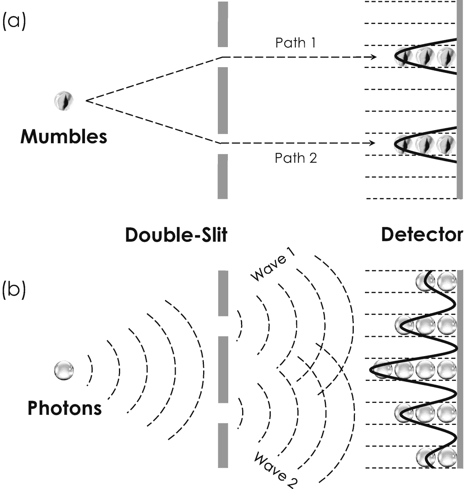
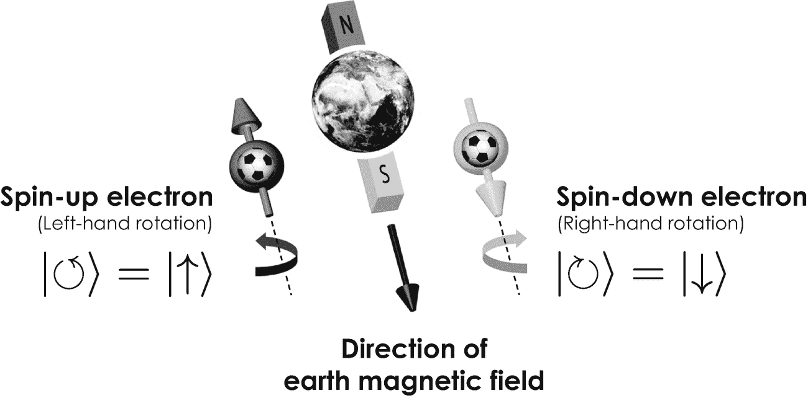
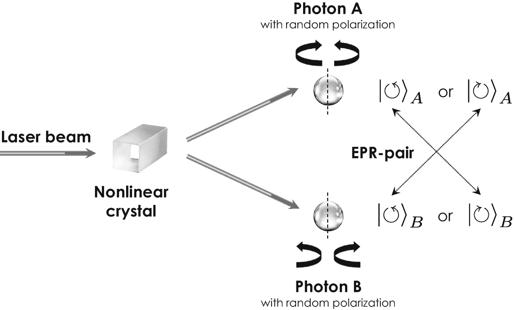
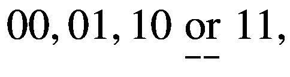
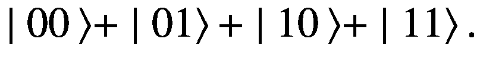
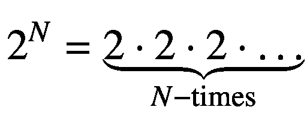
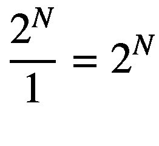

# 量子力学与薛定谔的猫

我可以安抚你，如果你仍然犹豫是否接受这种量子怪诞性，因为你绝不是唯一一个这样想的人。甚至连阿尔伯特·爱因斯坦也无法相信量子力学的概率本质、外部观测者的决定性作用以及波函数的突然坍缩。这种对量子力学的解释自诞生以来一直挑战着人类的想象力，并在 20 世纪引发了维尔纳·海森堡、马克斯·玻恩和丹麦物理学家尼尔斯·玻尔之间的激烈讨论，他们首先提出了波函数的概率解释。他们的努力是首次对能量和物质在最微观尺度上的奇异而令人困惑的世界进行一般性理解的尝试，如今被称为*哥本哈根诠释*，以纪念这位奠基人的家乡。如今，哥本哈根诠释是量子力学中最常用的解释，因为其他竞争性解释，包括*隐变量理论*^(²⁶)和*多世界诠释*^(²⁷)，对我们的想象力提出了更大的挑战。为了论证和可视化哥本哈根诠释的奇异后果，围绕这种概率解释构建了各种思想实验，如今被称为*爱因斯坦-波多尔斯基-罗森悖论*（EPR 悖论），并以三位争论的物理学家的名字命名[6]。EPR 悖论中最著名且有些残酷的版本是*薛定谔的猫*。在他的著名思想实验中，德国物理学家埃尔温·薛定谔试图通过将一只坐在封闭盒子里的快乐猫的经典世界与猫旁边的放射性原子的量子力学行为联系起来，将量子力学的概率概念归结为荒谬。如果——按照他的想象——放射性原子衰变，它会发射一个光子，进而触发一个锤子打碎一小瓶致命气体，偶尔会杀死猫。换句话说，原子的放射性衰变导致薛定谔的猫死亡。如果你关上盒子，并通过以下论证问自己猫是死是活，悖论就出现了。我们知道，放射性原子的衰变是一个完全量子力学的、因此是概率性的过程。由于原子的状态和猫的生命通过释放毒气的锤子高度相互依赖，猫的健康状况也必须由一个概率性的波函数来描述。例如，考虑量子力学告诉我们，放射性原子在 30 秒后衰变的概率为 50%。那段时间后猫的健康状况如何？它是活的、死的，还是可能介于两者之间？

量子力学的答案非常简单且同样令人震惊：猫确实同时既死又活，各占 50%的概率。然而，如果你——作为一个外部观察者——打开盒子往里看，描述其健康状况的猫的波函数会突然坍缩，我们将要么发现猫活着，要么发现猫死了，但显然不会同时处于两种状态。换句话说，打开盒子并目视检查（或测量）猫的健康状况会导致波函数瞬间坍缩。这有多奇怪？

感谢后来的诺贝尔奖得主、英国物理学家保罗·狄拉克，有一种非常方便的数学方法可以描述猫的这种悲惨处境，值得解释清楚，以便我们稍后进一步讨论量子计算机。物理学家通常用所谓的*态矢量*来表示猫的健康状况，用符号`| cat 〉`表示，并将猫的两种经典可能状态称为*本征态*，分别用符号`| alive 〉`和`| dead 〉`表示。在保罗·狄拉克的符号中，薛定谔的猫的健康状况可以很容易地写成：

```
| cat ⟩ = α ⋅ | alive ⟩ + β ⋅ | dead ⟩ .
```

(2.1)

这个方程表明猫的状态等于两个本征态`α ⋅ | alive ⟩`和`β ⋅ | dead ⟩`之和。`α`和`β`是 0%到 100%（或 0.00 到 1.00）之间的任意数字，分别描述了猫活着和死去的概率。^(²⁸) 换句话说，如果`α`大于`β`，猫更可能活着，反之亦然。

## 测量

测量过程在量子力学中起着至关重要的作用。测量或“观测”一个量子力学对象，会导致其波函数（即所有可能状态的概率分布）坍缩为一个单一状态。因此，测量量子力学对象的状态总是会揭示一个唯一且离散的结果，这是我们从经典物理学和周围世界中熟知的行为。

在考虑猫的健康状况（或态矢量）随时间演化时，事情变得有趣起来，这种演化由著名的*薛定谔方程*描述。在不深入细节的情况下，这个方程告诉我们，方程 2.1 中的两个*态振幅`α`和`β`*会随时间变化：`α`减小，而`β`相应增大，因为放射性原子衰变的概率随时间增加。换句话说，我们在打开盒子之前等待的时间越长，薛定谔的猫就越可能死去——这是另一个非常奇怪且违反直觉的量子现象。

方程 2.1 中的求和有时被称为两个本征态`| alive ⟩`和`| dead ⟩`的*叠加*或“干涉”。态的叠加是量子力学最基本的性质之一，也是量子计算机中使用的一个非常重要的资源。你可能实际上对经典物体的叠加非常熟悉。想想声波和现代降噪耳机。这种设备基本上会镜像周围的声波，将它们反转，并在传入声波和反转声波之间建立一个叠加态，使得最终的声音消失，外部噪音被抵消。



**图 2-2** 经典玻璃弹珠（a）和量子力学光子（b）的著名双缝实验的示意图。探测器屏幕上的轮廓显示玻璃弹珠有两个峰（顶部实黑线），而光子的情况是复杂的干涉轮廓（底部实黑线）

## 叠加原理

叠加指的是量子力学原理，通过该原理，一个系统的两个或多个状态——很像你家浴缸里的水波——可以相加（“叠加”）形成系统的另一个量子状态。


自发现以来，量子力学叠加原理已在多种现实实验中得到验证和观测。为了更好地理解这一极为重要的物理原理，有必要了解一个最具代表性的实验，该实验通过量子力学概率波的叠加进行了解释。这个实验被称为***双缝实验***，由英国医生兼物理学家托马斯·杨于 1802 年首次进行[7]。他的实验装置将光源（由太阳发出）射向一张带有两条极窄狭缝的硬纸板。光子穿过狭缝后落在探测屏幕上，屏幕的亮度用于衡量每个位置的光子数量。如果光子是由经典力学描述的宏观物体，比如弹珠——你小时候可能玩过的那种小玻璃球——它们会穿过纸板上的第一条或第二条狭缝。因此，探测器会在两个区域之一探测到弹珠，如图 2-2 (a)中两个峰值所示。

但由于光子是量子力学物体，托马斯·杨观察到的情况完全不同。他并未在仅两个区域探测到光子，而是在所有可能的区域都探测到了光子，其中计数最大值出现在恰好位于两条狭缝中间的区域。因此，亮度呈现出一种复杂的曲线图案，即所谓的***干涉图样***，如图 2-2 (b)中黑色实线所示。托马斯·杨起初无法相信这一观测结果，认为实验装置可能存在问题。但由于这种图案没有变化，并且被发现取决于纸板上两条狭缝之间的距离，他最终相信了自己的观测，并将该结果解释为光波根据纸板上的特定位置，会相互交替地抵消和增强。物理学家分别用***相长干涉***和***相消干涉***这两个术语来指代波的关键性质。在量子力学中，这种干涉图样对应于分别穿过第一条和第二条狭缝的两个波函数的叠加。后来，使用电子[8]（携带电流的粒子）以及其他更大的量子力学物体进行的双缝实验，也得出了相同的主要结果。这一观测结果的意义相当显著：量子力学物体似乎同时既是粒子又是波——既是弹珠又是光子。这就是著名的***波粒二象性***，它是叠加原理的直接结果，也是量子计算机所采用的另一个非常基本的性质。

## 波粒二象性

波粒二象性是指量子力学物体同时表现出粒子和波的行为的自然现象。根据具体的实验，量子力学物体既会表现出粒子的典型性质，例如能量和质量的量子化，也会表现出通常归因于波的性质，例如叠加和干涉。

但量子力学还蕴含另一个惊喜，即***纠缠***，这可能是当今量子计算机所利用的最神秘但也同样至关重要的现象。要最好地描述纠缠现象，首先需要更仔细地研究基本粒子的一个特殊性质。例如，光子表现出一种奇特的性质：它们总是绕着自身旋转（转动）。这种性质被称为***圆偏振***，可以类比为足球——一旦被踢到空中，它总是绕着某条轴线自转。圆偏振光可以表现为左旋圆偏振或右旋圆偏振，在狄拉克符号中分别用`|↺〉`和`|↻〉`表示。事实证明，圆偏振光可以由一种称为***非线性晶体***的特殊固体材料非常容易地产生。如图 2-3 示意性地所示，这些晶体将入射的激光束²⁹分成两束独立的光束*A*和*B*。如果我们反复从光束*A*和光束*B*中各取出一对光子，并测量它们的偏振态，我们会得到一个惊人的发现：这对光子会呈现出随机但始终相反的偏振态，即分别是`|↺〉`和`|↻〉`。由于历史原因，这样的光子对被称为爱因斯坦-波多尔斯基-罗森对，或简称为***EPR 对***，因为这三位物理学家在使用它们进行以下思想实验以展示量子力学的惊人后果时，曾为此进行了激烈的讨论。

设想我们在空旷空间中用一块非线性晶体生成一个 EPR 对，并使用一组反射镜将它们射向相反方向。由于光子以接近 30 万公里/秒的光速传播，只需几分钟，这两个光子就会被一个难以想象的巨大距离隔开。现在想象我们取其中一个光子，比如光子*A*，并测量其偏振态为左旋。这个结果对光子*B*意味着什么？好吧，由于 EPR 对中的光子总是表现出相反的偏振态，我们无需测量就知道光子*B*的偏振态必定与光子*A*相反，因此是右旋！这令人震惊，因为似乎存在一种非常奇怪的相互作用，告诉光子*B*，光子*A*的偏振态已被测量为左旋。这尤其怪异，因为这种相互作用是瞬时发生的，尽管——你可能还记得高中知识——没有任何东西能超过光速。换句话说，光子*A*不可能瞬间与光子*B*交换任何关于其偏振态的信息。那么，为什么描述光子*B*偏振态的波函数会突然坍缩，即使我们并没有测量它？阿尔伯特·爱因斯坦同样对这个结果感到惊讶，并将这种现象称为“幽灵般的超距作用”，因为他无法相信 EPR 对具有这种非常反直觉的性质。与光子的偏振类似，电子一旦被置于外部磁场中，也会绕着彼此旋转。由于历史原因，这种性质不叫偏振，而是被称为（电子）***自旋***。在从北极指向南极的磁场中，电子会相对于磁场方向向左或向右自旋，如图 2-4 所示。如果它们向左自旋，其自旋状态称为***自旋向上***，用符号`|↑)`表示。相应地，向右自旋的电子称为***自旋向下***，用符号`|↓〉`表示。事实证明，两个电子*A*和*B*的自旋也可以纠缠。针对此类 EPR 电子的实验也确实揭示了这种幽灵般的超距作用。


好的，作为一名高级文档工程师和翻译员，我将遵循您的注意事项，将给定的英文文本准确翻译为中文。




**图 2-4**

电子在地磁场中的奇特行为。电子——类似于空中的足球——要么向左自旋（自旋向上），要么向右自旋（自旋向下）。物理学家分别将其记为 `|↺⟩ = |↑⟩` 和 `|↻⟩ = |↓⟩`。



**图 2-3**

通过激光束激发的非线性晶体产生一对纠缠的偏振光子 A 和 B。在不测量任一光子偏振的情况下，你无法判断每个光子的偏振状态。你只能从量子力学中得知，这两个光子具有相反的偏振。

换句话说，纠缠确实会以某种方式“连接”或“交织”两个（或更多）电子的量子力学自旋态，从而使它们永远相互依赖。物理学家通常用符号 `|ψ⟩`（来自希腊字母“psi”）来标记两个自旋相反、纠缠在一起的电子 *A* 和 *B* 的整体状态，并用狄拉克符号表示。


**(2.2)**

用来描述要么电子 *A* 自旋向上、电子 *B* 自旋向下（第一项），要么电子 *A* 自旋向下、电子 *B* 自旋向上（第二项）。^((30)) 各自的概率由两个态振幅 *α* 和 *β* 描述，类似于方程 2.1 中的叠加态。

另一种或许更生动的阐释这种诡异量子效应的方法，是将一本普通的电子书（例如本书的电子版）与一本虚构的“量子书”进行比较。电子书中的信息以比特编码，而量子书中的内容则以纠缠的量子比特编码。这对你的阅读体验有如下重大影响。电子书的内容可以随时一页一页地轻松阅读。但是，查看量子书的各个页面只会揭示出随机噪声，其中包含的信息内容非常少，因为它的故事并非记录在不同页面上，而是记录在它们之间复杂的关联中——不同的页面只是简单地纠缠在一起。因此，要理解整本量子书，你必须同时集体阅读许多页面，同时识别出它们之间的复杂关联——你可以想象，这是一次真正有压力的阅读体验。

这个关于纠缠的生动例证，结束了我们对量子力学奇异世界的简短探索。在本节中，我们讨论了现代量子力学中几个非常引人注目和令人不安的现象，每一个都将在当今的量子计算中得到利用。如果量子力学的某个方面让你感到困惑，请放心，因为你不是唯一一个。理查德·费曼曾这样描述量子力学：量子力学是对物质和光行为所有细节的描述，特别是对原子尺度上所发生事件的描述。在非常小的尺度上，事物的行为与你所能直接体验到的任何事物都不同。它们的行为不像波，不像粒子，不像云，不像台球，不像弹簧上的重物，也不像你见过的任何东西 [9]。此外，他后来在 1964 年于康奈尔大学著名的量子力学讲座中指出：“我想我可以有把握地说，没有人真正理解量子力学。”

## 纠缠

纠缠是指量子物理学中的一种自然现象，当两个或更多量子力学对象（例如光子和电子）一起产生（或相互交互）时，它们的个体量子态就无法再独立于彼此来描述。换句话说，对第一个对象的测量决定了测量第二个对象的结果。这种现象没有经典类比，即使纠缠对象在空间上相隔非常远的距离，也可以被观察到。

有了这些关于不确定性原理、叠加、纠缠以及偏振和自旋（特别是）的知识，我们现在就具备了理解量子计算机如何运作以及为什么它们能够在计算性能和速度方面超越最先进的超级计算机所需的一切。


### 2.2.2 量子计算机如何运作

量子计算机的基本构想源于两位美国物理学家。其中一位是保罗·贝尼奥夫，他在 1980 年提出了量子力学图灵机的理论模型[10]。两年后，理查德·费曼在思考如何最高效地模拟分子和蛋白质等复杂量子力学系统时，也构想出了类似的概念^(³¹)。他得出结论：本身遵循量子力学法则的微型计算机最适合进行此类计算，“量子计算机”这一术语由此诞生[14]。

从第 1.4.2 节中我们了解到，经典计算机将信息编码为可由经典逻辑门处理的二进制比特。与经典计算机类似，量子计算机将信息编码为量子比特——即所谓的*量子比特*——并相应地通过*量子逻辑门*对其进行处理。到目前为止，这个概念并没有什么惊人之处。经典计算机与量子计算机的根本区别在于比特和量子比特的实现方式及其相互作用的特定方式。经典计算机需要大约 10,000 个电子的集合体来编码一个二进制比特。在这种大规模集合体中，不同电子的量子力学特性会彼此平均化，从而使整个系统类似于一个经典比特。而量子计算机则利用单个量子力学对象（例如孤立的电子或光子）来编码一个量子比特，因此保留了其量子力学特性。

在实践中，量子计算机采用一个量子力学的*二能级系统*，例如电子的自旋或光子的偏振，正如我们之前所介绍的，该系统分别由两个状态向量`|↓⟩`、`|↑⟩`以及`|↺⟩`、`|↻⟩`来描述。对于电子自旋量子比特，通常将状态向量`|↑⟩`与二进制数字“0”相关联，而将`|↑⟩`与二进制数字“1”相关联，以类比经典比特——实际上，只要我们在量子信息处理过程中不改变这一关联规则，采用相反的关联规则也同样可行。

这种从经典比特到保留量子力学特性的量子比特的转变，具有两大主要优势。即，量子信息处理能够带来（1）存储容量和（2）计算速度的提升。第一个优势可以通过比较用于保存编码在比特和量子比特中信息的经典寄存器（或内存）与*量子寄存器*得到最佳体现。一个经典的 2 比特寄存器能够存储以下二进制数中的一个



(2.3)

正如我们从第 1.4.1 节所知，它们分别对应十进制数 0、1、2 和 3。而一个 2 量子比特寄存器则保留了其量子力学特性，因此可以利用叠加原理来存储如下状态向量：



(2.4)

换言之，经典的 2 比特寄存器一次只能保存一个二进制数，而一个 2 量子比特寄存器通过利用叠加原理，可以同时存储 2² = 2 ⋅ 2 = 4 个二进制数。这一特例可以很容易地推广到 *N* 比特和 *N* 量子比特寄存器，其中 *N* 表示任何大于或等于 1 的自然数。由于每个量子比特可以同时编码二进制数字“0”和“1”，因此一个 *N* 量子比特寄存器总共能够保存



(2.5)

个二进制数（每个数有 *N* 位）。相比之下，一个经典的 *N* 比特寄存器只能存储一个具有 *N* 位的二进制数，因为每个比特只能是“0”或“1”，而不能像量子比特那样同时表示两者。因此，与 *N* 比特寄存器相比， *N* 量子比特寄存器在存储容量上的增益为



(2.6)

从而表现为指数级增长。例如，你智能手机中的经典寄存器（或活动内存）通常约为 2 GB 大小，这相当于总共 160 亿个经典比特。^(³²) 基于量子比特的活动工作内存理论上仅需 32 个量子比特即可存储等量的信息，因为`2³²`已经大于 4 GB。换句话说，32 个量子比特可以存储比 160 亿个经典比特更多的信息。这种真正的指数级存储容量增长，体现了量子信息处理相对于经典信息处理的第一个主要优势。

第二个优势涉及计算速度的提升，这是量子计算机处理量子信息的特定方式的结果。假设我们希望分两步执行两个计算：


(2.7)

经典计算机需要分两步连续执行这些计算。而量子计算机则利用叠加原理，将编码在`|01⟩`中的二进制数简单地加到二进制叠加态 *α* ⋅ `|00⟩` + *β* ⋅ `|01⟩`上，从而同时进行两种计算。这种高度并行的计算可以用以下方程表示：

![$$ {\displaystyle \begin{array}{l}\mid 01\left\rangle \oplus \left(\alpha \cdot |00\Big\rangle +\beta \cdot |01\Big\rangle \right)=\alpha \cdot \mid 01+00\right\rangle +\beta \cdot \mid 01+01\Big\rangle \\ {}\kern6.359996em =\underset{\mathrm{Result}\kern0.17em \mathrm{of}\kern0.17em \mathrm{step}\;1}{\underbrace{\alpha \cdot \mid 01\Big\rangle\;}}+\underset{\mathrm{Result}\kern0.17em \mathrm{of}\kern0.17em \mathrm{step}\;2}{\underbrace{\beta \cdot \mid 10\Big\rangle\;}}\kern0.24em \end{array}} $$](img/505424_1_En_2_Chapter_TeX_Equ8.png)

(2.8)

其中符号“⊕”表示编码在状态向量中的两个二进制数的加法。因此，量子计算机的输出将是步骤 1 和步骤 2 所得结果的叠加态。换句话说，量子计算机能够一次执行两个计算，因此其速度比经典计算机呈指数级提升。然而，从量子计算机中读取并获取该结果的唯一途径最终涉及某种类型的测量，这被称为*基于测量的量子计算*。但从我们之前的讨论可知，对量子态的任何测量都会导致其波函数坍缩。换句话说，一旦我们试图通过测量编码二进制数的电子自旋量子比特来读取叠加态，结果将是随机的，我们只能根据参数 *α* 和 *β* 获得步骤 1 或步骤 2 的结果。棘手之处在于，我们通常不知道获得的结果属于我们计算的步骤 1 还是步骤 2。那么，我们该如何解决这个归属问题呢？


