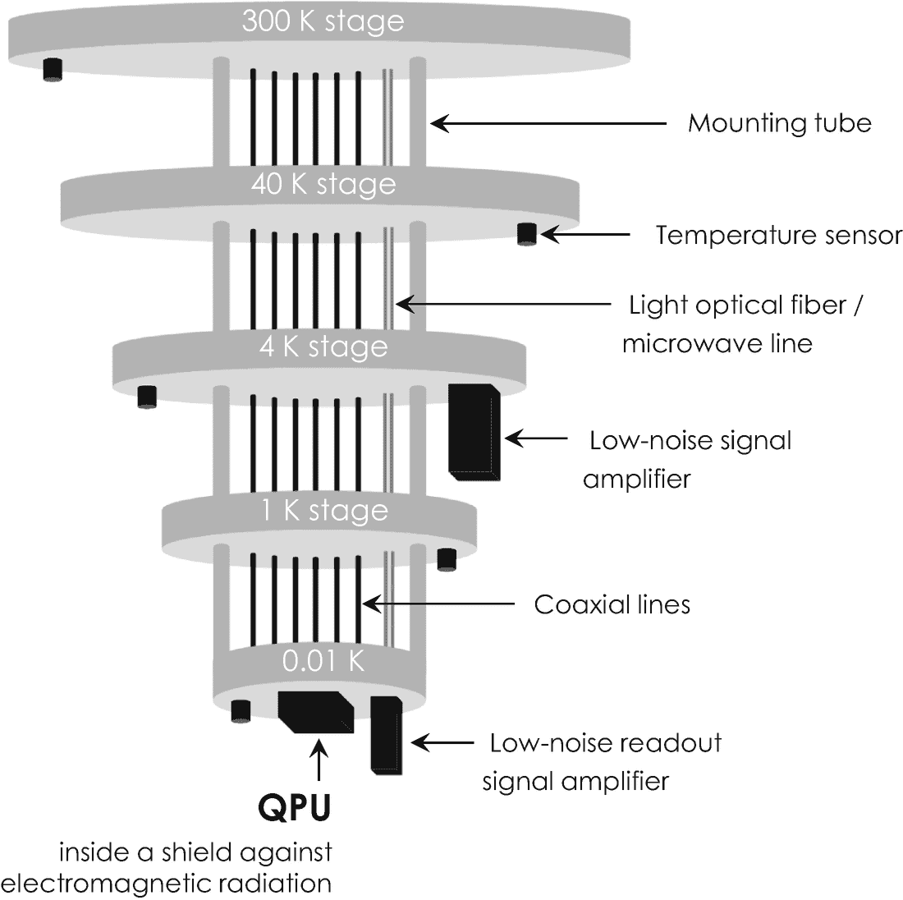
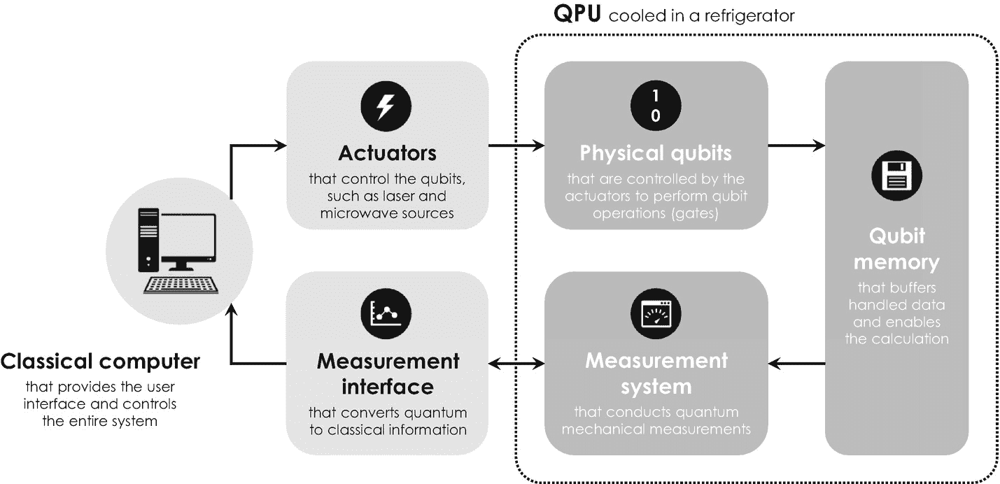

# 量子计算中的关键概念

不涉及任何数学细节，这个问题通常通过使用纠缠作为额外的量子资源来克服，它允许我们将计算的二进制输入和输出值（或状态向量）关联起来。如果你愿意，纠缠为与步骤 1 和步骤 2 相关的部分结果添加了一个标签，使我们能够识别计算结果属于步骤 1 还是步骤 2。然后，通过对方程`2.8`中的叠加态进行多次测量，可以得到步骤 1 和步骤 2 的最终结果。同样的原理也适用于更复杂、步骤更多的计算。

在量子计算机中，这类计算实际上是通过量子逻辑门来实现的，这与经典计算机中的逻辑门类似。从第`1.4.2`节我们知道，逻辑门——无论是经典的还是量子的——是一种物理结构，它接收一组输入并将它们组合成一个输出。经典逻辑门与量子逻辑门之间最重要的区别在数学上被称为**可逆性**。量子逻辑门是可逆的，因为它们保留了量子关联，例如叠加和纠缠。因此，它们的输入总是可以根据输出重建，而这在经典逻辑门中通常是不可能的，因为不同的输入值可能具有相同的输出值，如表`1-1`所示。换句话说，量子逻辑门不会丢失通过它们的任何信息——它们在整个计算过程中安全地保存信息及其关联。这是量子逻辑门的一个非常重要的特性，因为它允许我们对叠加和纠缠的量子比特进行逻辑运算——正如我们从之前的例子中所知，这是发挥量子信息处理全部潜力的重要先决条件。

不涉及任何细节，最重要的量子逻辑门是：（1）`Hadamard`门，（2）受控非门（`controlled-NOT`），以及（3）`Toffoli`门[15]。`Hadamard`门尤为重要，因为它可以将两个量子比特置于叠加态。为此，它使用特定类型的光——电磁辐射，例如激光或微波脉冲——来操纵所涉及量子比特的量子态。通过组合不同的量子逻辑门，我们可以构建各种量子算法来解决不同的计算问题。

总之，量子计算机利用叠加和纠缠同时执行多个计算步骤，这就是为什么量子计算有时被描述为**大规模并行计算**和超级计算的下一个前沿。它在内存容量和速度方面提供了指数级的提升。例如，一个`300`量子比特的寄存器可以存储`2³⁰⁰`个二进制数，其组合数量比整个宇宙中的粒子还要多！这种内存容量和计算能力的巨大增长，使得量子计算——即使尚未完全成熟——有望在不久的将来彻底改变超级计算领域。

## 2.2.3 对完美量子比特的挑剔探寻

科学中常常如此，理论比实践容易得多。量子计算也是如此，科学家在物理实现合适的量子比特时面临着重大的技术挑战。大多数挑战都与一个称为**退相干**的过程有关，这是一个令人困扰的“退化”过程，通过该过程，编码在量子比特中的信息会被破坏并退化为随机噪声——这样的量子计算机因此被称为“有噪声的”。

顺便提一下，噪声在经典计算中也是有害的，但很容易处理，因为我们可以为每个比特保留两个或多个备份副本，这样任何变化都会作为异常值显现出来。然而，这种基于备份副本的策略不能用于量子计算机，因为任何复制量子态的尝试最终都涉及进行测量以查看我们想要复制的对象。但是，正如我们从第`2.2.1`节所知道的，测量会导致波函数坍缩，从而破坏叠加和纠缠，并导致量子信息不可逆地丢失。这个我们不能复制（或克隆）量子态的基本原理被称为**非克隆定理**[16, 17]，这并没有使量子计算机的操作变得更容易。

退相干通常是由量子比特与其宿主环境之间的相互作用引起的。各种随时间变化的因素通常会促进退相干，例如机械振动、温度波动以及周围实验室中电子设备发出的振荡电磁杂散场。物理学家通常区分由退相干引起的自旋翻转过程和能量弛豫过程，由于它们对量子计算机的物理实现具有重大意义，下文将对两者进行简要说明。

### 退相干：自旋翻转过程

我们考虑的第一个退相干机制是所谓的**自旋翻转**过程。在电子自旋的情况下，这个过程简单地改变量子比特的自旋状态，并诱导从`|↑〉`到`|↓〉`或反之的跃迁。所有这些都随机发生，并破坏量子计算机内的所有物理关联，因此其结果只会是随机噪声。发生此类自旋翻转过程的时间尺度称为**相干时间**，它衡量量子比特在被自旋翻转过程破坏之前的“寿命”。相干时间通常为几微秒（百万分之一秒），基本设定了在量子计算机上完成一个计算步骤的最大可用时间。

### 退相干：能量弛豫过程

退相干的第二个非常重要的来源与著名的海森堡不确定性原理有关，我们从第`2.2.1`节了解到该原理，它禁止同时精确确定量子力学粒子的动量和空间位置。但由于量子力学粒子的动量和空间位置总是存在一定的不确定性，它们的运动也无法非常精确地定义。换句话说，微观尺度上的自然总是在运动，量子力学粒子总是在抖动。这种量子力学对象的随机运动可以与一种运动能量相关联，这种能量可以与量子比特的宿主环境进行交换。量子比特与其宿主环境之间的这种随机能量交换被称为**量子涨落**，它引发了量子计算机中第二个最重要的退相干机制。

### 退相干：技术解决方案

`自旋翻转`和`能量弛豫`过程都会引入随机噪声，并干扰量子计算机的计算。由于这两种机制无法完全抑制，我们不得不在某种程度上接受量子计算机的这种“有缺陷的本质”（或错误）。为此，科学家们开发了不同的措施来应对退相干引起的噪声。

第一个也是最重要的措施，使得大多数量子计算机看起来像约 1 米高、30 厘米宽的小型倒挂圣诞树，如图 2-5 所示。这种架构被称为*稀释制冷机*，它提供液态氦浴，并允许量子计算机在接近绝对零度（0.01K，即-273.14°C 或-459.65°F）的极低温度下运行，从而实现最小的退相干。稀释制冷机在一个封闭的钢罩内运行，该钢罩容纳了液态氦浴，并覆盖了其内部结构，内部结构包括多个相互悬挂的不同金色平台³³。实际的*量子处理单元*（QPU）——类比于经典 CPU 的量子计算机核心——安装在制冷机底部温度最低的层级上[18]。这些平台上装饰着数百个银色芯片、导线和发光的管子，例如文献[19]所示。

**图 2-5**
在稀释制冷机环境下实现量子计算机的实验系统设计。该系统展示了五个（或更多）温度层级，从室温（300 K）一直降到接近绝对零点的低至 0.01 K 的低温。每个层级都配备有温度传感器以监控液氦冷却系统。金属安装管用于机械地稳定各个层级，不同的同轴电缆和光纤则用于将电信号和光信号传输到 QPU。

除了在极冷环境下运行，科学家们还开发了不同的计算策略来主动纠错，这通常被称为*容错量子计算*。这些方案通常基于将许多脆弱的量子比特（称为*物理量子比特*）分组到一起，形成所谓的*逻辑量子比特*，由于概率效应和统计平均，这些逻辑量子比特更不易受噪声影响。这种分组的设计目的是使逻辑量子比特能够在足够长的时间内不受外部噪声影响，以完成相应的计算步骤。实现纠错的理论最小值是每个纠错逻辑量子比特需要五个物理量子比特。可以想象，这种策略会带来巨大的计算开销，这使得量子计算机的物理实现从技术角度来看更具挑战性。

由于稀释制冷机和量子纠错单元都需要额外的计算资源来自动控制其运行，如今的量子计算机通常被实现为*混合系统*，如图 2-6 所示。该混合设置提供了一个图形用户界面，并自动控制各个子组件，如液氦管理系统、真空泵以及传感器和执行器，确保整个系统在安全条件下运行。这一点尤其重要，因为液氦可能导致严重烧伤。

**图 2-6**
当今量子计算机系统实现的基本概念。QPU 本身（虚线框内）由一台经典（桌面）计算机控制，该计算机提供易于使用的用户界面，并运行软件来控制系统的所有其他组件。

构建稳定且抗噪的量子计算机所涉及的各种技术挑战，激发了对寻找完美量子比特的激烈研究。早在 2000 年，美国物理学家大卫·迪文森佐就为寻找这种完美量子比特提供了有用的指导，并提出了理想物理实现的五个主要标准[20]，了解这些标准有助于评估不同量子信息处理技术实现方案的相关性。完美的系统：

1.  基于特性明确且稳健的量子比特，这些量子比特是*可扩展的*，从而允许实现多量子比特系统。
2.  可以轻松*初始化*到一个简单的基准初始量子态，该状态充当计算的起点。
3.  具有显著长于完成计算所需时间（操作时间）的*相干时间*。
4.  允许我们执行*通用*量子门集合，从而实现所有可想象到的量子比特操作。
5.  允许我们*单独控制*和*读出*（或测量）QPU 中的不同量子比特。

至今，这些*迪文森佐准则*为全球数千名旨在实现地球上最强大量子计算机的科学家划定了研究范围。接下来我们将简要讨论三种最重要的实现方案，这有助于你更好地理解当今谷歌、IBM、D-Wave Systems 等公司商业化的量子计算机。

