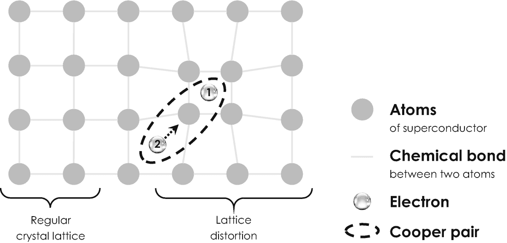
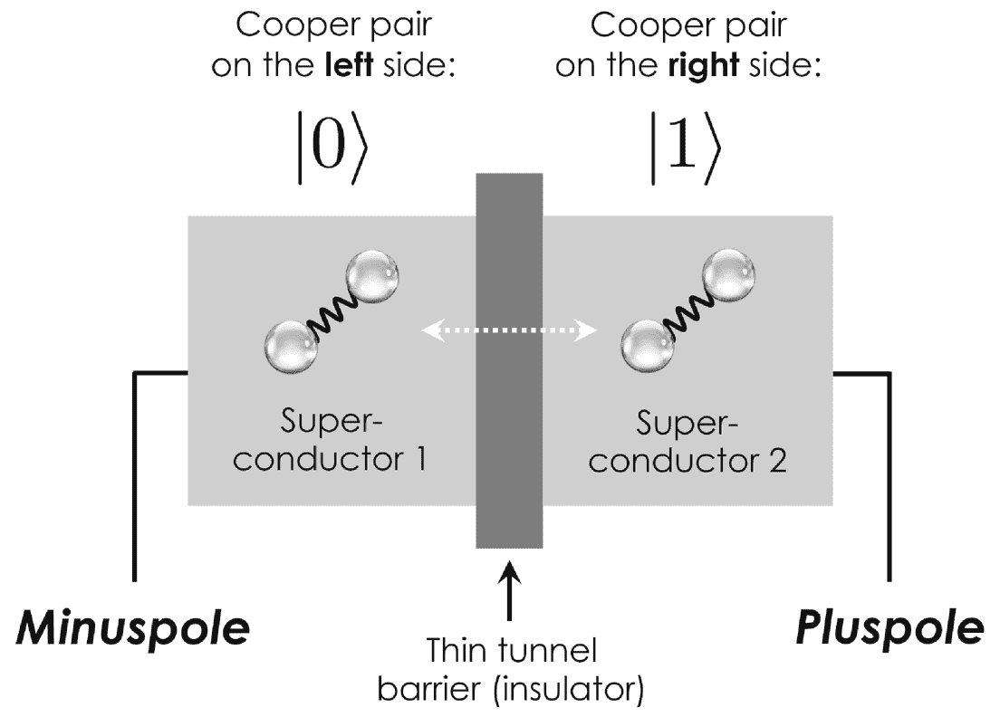
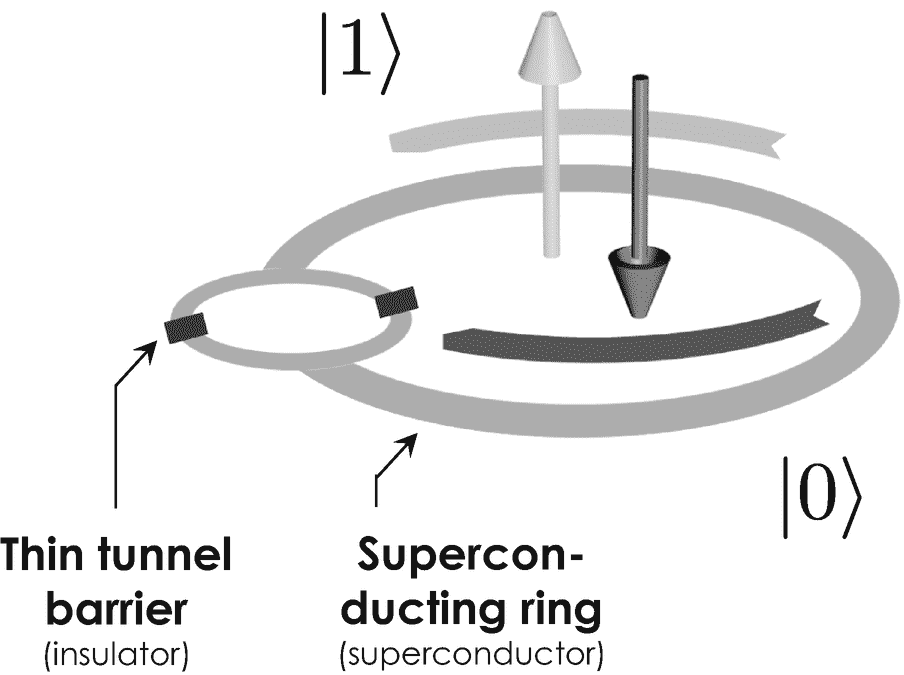
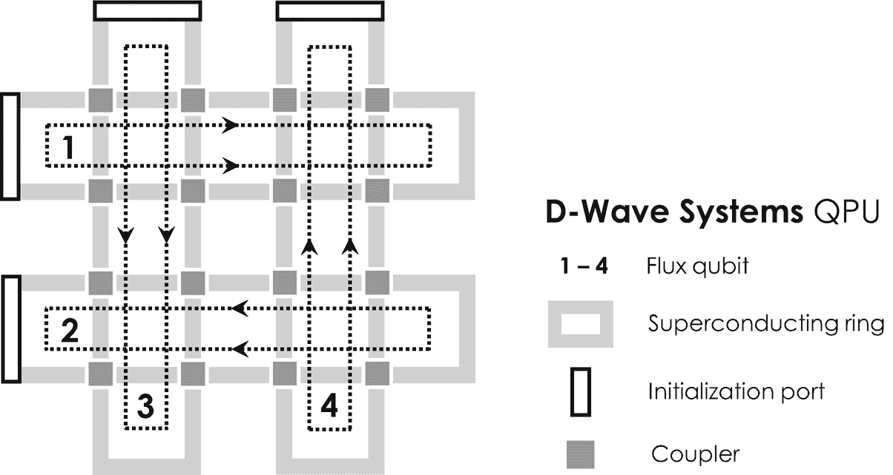
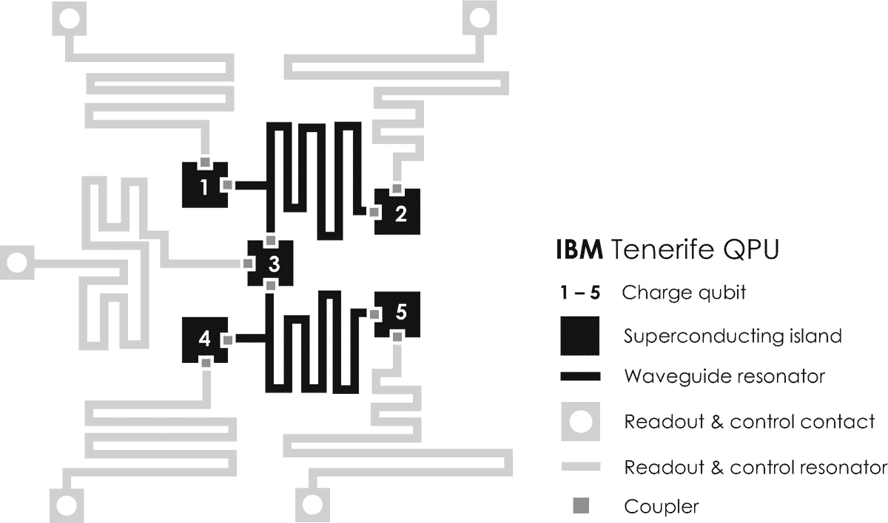
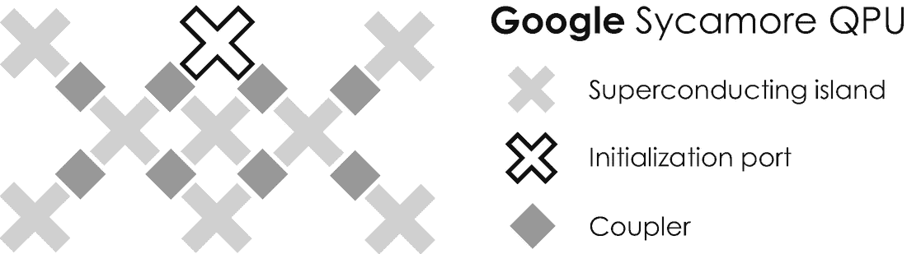

# 量子比特类型：电子自旋量子比特

电子自旋量子比特的历史与现代半导体物理和技术的兴起密不可分 [29]。半导体是一种导电性能优于绝缘体（如玻璃）但次于导体（如铜和其他金属）的材料。技术上最重要的半导体是`硅`，它通常通过熔化石英砂并从 2273 K 高温熔体中去除氧化物来工业化生产。由此获得的银白色硅通常含有低浓度的其他化学元素，这些元素在技术上被称为`杂质`。一种特别令人感兴趣的杂质是化学元素磷，因为这种化学元素或原子同时表现出核自旋和电子自旋。

硅中的这种杂质在 1998 年引起了美国物理学家布鲁斯·凯恩（Bruce Kane）的注意，并启发他提出了一种创新的硅基量子计算方法 [30]。他的方法极具影响力，因为它似乎与当时制造微芯片的主流技术——最先进的硅微电子学相兼容。`凯恩模型`基于嵌入纯硅衬底（作为基底材料）中的磷原子阵列。它允许在磷原子的核自旋中编码量子比特，而相邻两个或多个磷原子之间的叠加和纠缠则通过磷原子内部核自旋和电子自旋之间的自然相互作用来介导。

**表 2-1：最流行的量子计算方法优缺点对比。** 品质因数衡量单量子比特或多量子比特操作中的错误率和噪声水平。

| 量子比特类型 | 相干时间 (最大值) | 优点 | 缺点 |
| --- | --- | --- | --- |
| 囚禁离子 | 10 秒 [32] | + 长相干时间+ 良好隔离的离子+ 高品质因数+ 高个体可控性 | – 可扩展性差 |
| 电子自旋 | 60 毫秒 [33] | + 中等相干时间+ 中等可扩展性 | – 中等品质因数– 中等个体可控性 |
| 超导量子比特 | 4 微秒 [34] | + 良好的可扩展性+ 大规模集成+ 高个体可控性 | – 短相干时间– 低品质因数 |

在布鲁斯·凯恩提出量子计算方案前后，美国物理学家大卫·洛斯（David Loss）和大卫·迪文森佐（David DiVincenzo）提出，通过金属电极阵列将单个电子空间约束在某些硅衬底中 [31]——这种器件架构通常被称为静电定义的`量子点`。^(³⁵) 根据我们施加正电压还是负电压，这些栅电极会吸引或排斥带负电的电子，并有助于控制它们的运动。置于外磁场中时，这种量子点能够约束和控制单个电子自旋，从而实现某些量子逻辑门。它们相对于 DiVincenzo 标准的主要优缺点汇总在表 2-1 中。尽管这两种在硅中利用电子自旋量子比特的方法不太可能用于大规模量子计算，但它们对于基础量子研究来说是极其重要的器件结构。



**图 2-7：** 超导材料中库珀对的形成。电子“1”局部扭曲了超导体的规则原子晶格。电子“2”被这种扭曲所吸引（虚线箭头），因为这是晶格中能量上更有利的位置。因此，当第一个电子在晶格中移动时，会拖动第二个电子随之移动。这两个电子之间的连接被称为库珀对。


### 量子比特类型：超导量子比特

在当前最先进的量子计算机中，技术上最重要的量子比特实现方案是超导量子比特，这就是为什么我们现在要更详细地研究它们。

*超导性*本身是一种自然现象，由荷兰物理学家海克·卡末林·昂内斯于 1911 年在著名的荷兰莱顿大学发现。他在低温下研究固态汞时观察到，当温度达到接近绝对零点的约 4.2 K 时，其电阻会突然消失 [35]。在此临界温度以下，由电子携带的电流可以自由地流过材料，没有任何电阻或其他耗散效应——因此电流会永远持续流动。我们之前讨论第一个晶体管时认识的约翰·巴丁、利昂·库珀和罗伯特·施里弗后来通过他们基于量子力学的所谓 *BCS 理论*解释了这一效应，该理论从电子对的角度解释了超导性。为了理解这些所谓的*库珀对*的形成，我们首先简要研究超导体的一些基本性质。

固体物质由规则排列在所谓*晶格*中的原子组成，如 图 2-7 左侧所示。在室温下，构成晶格的原子会运动，导致整个晶格强烈振动——它们运动得越快，材料的温度就越高。当自由电子穿过振动的晶格时，它会与晶格原子发生各种碰撞，类似于台球中白球频繁撞击彩球。直观地说，如果温度升高且原子振动更剧烈，电子与原子之间的碰撞就更可能发生。因此，金属的电阻率通常随温度升高而增加。在极低温度下，晶格原子振动非常缓慢，并且由于量子力学的量子化原理，这些振动的能量会以阶梯方式变化。最小的振动能量称为*声子*，其行为类似于量子力学粒子。³⁶ 穿过这种冷晶格的电子会遇到一些但非常少的碰撞。因此，冷金属的电阻率很低，但不为零。



**图 2-8** 约瑟夫森结中库珀对的量子力学隧道效应。库珀对要么停留在左侧的“超导体 1”中，要么隧穿通过绝缘隧道势垒进入右侧的“超导体 2”（白色虚线箭头）。第一种情况可与量子比特 `|0⟩` 关联，第二种情况与 `|1⟩` 关联。

在超导材料中，这幅图景完全改变。超导晶体的特定几何结构允许电子吸收晶格声子，并相互反复交换它们，而不会减速或损失任何运动能量。两个电子之间的这种相互作用将电子对“粘合”在一起，形成库珀对，如 图 2-7 右侧所示。这个库珀对可以不受阻碍地穿过晶格，从而携带零电阻的电流。超导转变发生在低于某个特定材料温度时，该温度促进了库珀对的形成。

广泛用于实现超导量子比特的器件结构被称为*约瑟夫森结*，以纪念其美国发明者、后来的诺贝尔奖得主布赖恩·约瑟夫森。它由两个被薄绝缘隧道势垒隔开的超导体组成。基于量子力学隧道效应（我们在 2.1 节中了解到的奇异现象），库珀对可以越过这个隧道势垒。约瑟夫森结通常允许实现三种不同的超导量子比特。第一种选择如图 2-8 所示，称为超导*电荷量子比特*，因为它最终依赖于隧道势垒左侧和右侧超导体中是否存在库珀对。这种特定器件被称为*库珀对盒*。

第二种也是迄今为止使用最广泛的实现方案是超导*磁通量子比特*或“持久电流量子比特”。该方案基本上是通过库珀对携带的、分别在超导环中顺时针和逆时针流动的电流来编码量子比特。其底层器件结构称为*超导量子干涉器件*或简称“SQUID”，如图 2-9 所示。当注入环中时，根据我们在 2.2 节中了解的波粒二象性，库珀对基本上表现为量子力学波。这些由库珀对携带的超导电流可以干涉形成叠加态，并同时（以一定概率）沿顺时针和逆时针方向流动。当我们测量流动方向时，相应的波函数坍缩，库珀对将沿两个方向之一流动。根据右手定则，³⁷ 顺时针电流感应出一个向下的磁场，通常与量子比特 `|0⟩ = |↻⟩ = |↓⟩` 关联，逆时针电流相应地与 `|1⟩ = |↺⟩ = |↑⟩` 关联。超导量子比特是量子信息处理最有希望的候选者，这主要归因于它们的大小和宏观特性：超导磁通量子比特通常涉及在尺寸达 0.1 mm 的器件中约 10⁹ 个库珀对的集体运动。这种宏观集合体比与环境隔离的单个电子、原子或离子更容易控制。但更宏观的量子比特通常遭受更快的退相干时间，这就是为什么超导量子比特在所有量子比特中显示出最快的退相干时间。



**图 2-9** SQUID 中的超导磁通量子比特。库珀对的顺时针持久电流与量子比特 `|0⟩` 关联，逆时针方向的持久电流与 `|1⟩` 关联。两个约瑟夫森结允许两个波函数干涉并同时沿两个方向循环。

然而，早期实验中观察到的令人困扰的短退相干时间已通过先进的电路设计和更稳健的量子比特得到延长和改善。最新实验获得的退相干时间足以实现所有相关的量子逻辑门，这就是为什么在所有大规模量子计算实现方案中，它们提供了最乐观的前景，并吸引了众多量子计算公司的高度关注，我们将在下面看到。

## 量子计算现状

量子计算不再局限于学术研究，最近已在工业界和大企业中首次亮相 [37]。目前有各种不同的系统可供商业使用，既可以直接本地购买，也可以通过互联网按需访问的云计算服务获取。它们采用不同的量子比特实现方案，其中超导电路和离子阱目前是其中最重要的。


### 2.3.1 商用系统

表 2-2 汇总了部分商用系统，并按量子比特数量自上而下排序。这些系统属于三种根本不同类型的量子计算机，它们决定性地影响了应用范围和使用场景。量子计算机通常分为 (1) 量子退火机、(2) 量子模拟器和 (3) 通用量子计算机。了解这些差异将有助于您更好地理解媒体上的新闻和新闻稿，并能选择最适合您自身应用或使用场景的最佳量子计算机或云计算供应商。

**表 2-2** 精选的商用且可访问的量子信息处理设备与系统（截至 2020 年 8 月）。IBM 和 Google 的系统仅通过其云计算服务提供。目前尚无公司实现通用量子计算机。

| 公司 | 名称 | 类型 | 量子比特数 | 来源 |
| --- | --- | --- | --- | --- |
| D-Wave Systems | 5000Q | 退火机 ^a | 5,000 | [38] |
| D-Wave Systems | 2000Q | 退火机 ^a | 2,000 | [39] |
| NIST | 未命名 | 模拟器 ^b | 300 | [40] |
| IonQ | 未命名 | 计算机 ^c | 79 | [41] |
| Google | Bristlecone | 计算机 ^a | 72 | [42] |
| IBM | Hummingbird | 计算机 ^a | 65 | [43] |
| Google | Sycamore | 计算机 ^a | 54 | [3] |
| IBM | Q53 | 计算机 ^a | 53 | [44] |
| Intel | Tangle Lake | 计算机 ^a | 49 | [45] |
| IBM | Qiskit | 模拟器 ^b | 30 | [46] |
| IBM | Raleigh | 计算机 ^a | 28 | [47] |
| Rigetti Computing | 19Q Acorn | 计算机 ^a | 19 | [48] |
| Alibaba | Aliyun | 计算机 ^a | 11 | [49] |
| Honeywell | Model H1 | 计算机 ^c | 10 | [50] |
| Honeywell | Model H0 | 计算机 ^c | 6 | [36] |

^a 超导电路  
^b 经典计算硬件  
^c 线性离子阱微芯片

#### 商用系统：量子退火机

*量子退火机*是我们将详细探讨的第一类量子计算机。它们于 1994 年被从理论上提出[51, 52]，并首先通过超导磁通量子比特得以实现[53]。自 2011 年起，加拿大公司 D-Wave Systems 开始提供商用量子退火机。其首个系统名为 `D-Wave One`，配备 128 个量子比特，并在公开发布后不久便出售给了美国国防公司 Lockheed Martin。据报道，D-Wave 的首位客户后来升级了其系统，并一直使用拥有高达 2,048 个量子比特的 `D-Wave 2000Q` 直至今日。最新系统 `D-Wave 5000Q` 于 2019 年发布，并首次售予位于美国新墨西哥州的洛斯阿拉莫斯国家实验室。



**图 2-10** D-Wave 量子退火机中使用的主要器件设计——为简化起见，系统被缩减为 4 个量子比特。与四个磁通量子比特相关的超导持续电流在矩形环路中流动，每个环路对应一个磁通量子比特。磁通量子比特可以通过 16 个耦合器相互作用，这些耦合器允许超导电流发生量子力学隧穿。特殊的初始化端口或触点有助于将相应电流注入器件中。

D-Wave 量子退火机的 QPU 由二维超导环阵列构成，这些超导环承载着超导磁通量子比特，形成所谓的*自旋玻璃晶格*[52]，如图 2-10 所示。这些环通过超导*耦合器*相互连接，耦合器促进了量子力学隧穿，并可用于叠加和纠缠相邻的磁通量子比特。QPU 还配备了一系列不同的电触点，用于施加偏置电压以调节库珀对的隧穿概率和能量。(38) 据报道，例如 `5000Q`，包含约 40,000 个耦合器和超过 1,000,000 个约瑟夫森结，这使其成为有史以来最复杂的超导集成电路之一。

与其他任何计算机一样，量子退火机旨在解决数学问题，例如*旅行商问题*，该问题是优化领域中的一个传奇基准，也是在此背景下被引用最多的例子之一。其目标是为一位置身在故乡、需要拜访分布于世界各地的一系列其他城市的销售员找到最短的可能路线。在这个问题中，销售员必须恰好拜访列表中的每个城市一次，并在故乡结束旅程。如果城市列表非常短，这个组合问题很容易解决。但一旦列表长度增加，可能的组合数量就会呈指数级增长。例如，对于 5 个城市，有 12 条可行路线，这是个可控的数字。但对于 12 个城市，旅行商就会陷入困境，因为他需要考虑近 2000 万条可行路线(39) —— 可怜的销售员。那么，D-Wave Systems 的量子退火机通常是怎样处理一个计算问题的呢？


每项计算的第一步，是将当前的数学问题转化为由节点和边构成的二维几何图案，这种图案被称为*图*，它需要能够适配 D-Wave 定制设计的设备架构——图中的节点对应量子比特，边则对应耦合器。以旅行商问题为例，该问题在数学上通过一个无向加权图来描述：不同的城市是图的节点，城市之间的路径是图的边，而路径的距离则对应边的权重，也就是一个衡量相邻城市间空间距离的任意数值。问题的这种图形表示，本质上充当了在 QPU 上连接和控制量子比特的蓝图。^(⁴⁰)

从待求解的数学问题映射到量子比特的二维图形表示这一过程，通常并不直观，正因如此，D-Wave Systems 通过在传统计算机上运行一个带有图形用户界面的支持软件来自动化这一过程。该软件允许用户轻松输入相应的问题——通常以数学方程的形式给出，例如用于衡量旅行商问题中总旅行距离的成本函数——并自动生成最合适的图形表示。一旦找到这种表示方法，一切准备就绪，就可以开始实际的计算或退火过程。

退火过程通常包含四个主要步骤：

1.  *量子比特初始化*：此步骤基于一系列特定的微波脉冲，根据问题的图形结构初始化量子比特的配置，以此作为起点。选择这些脉冲的理想目的是让芯片上二维阵列中的所有量子比特彼此纠缠。这一点至关重要，因为这种纠缠使得量子比特配置能够广泛探索当前问题的所有可能解决方案。

2.  *问题初始化*：第二步涉及开启编码在一组特定量子比特和耦合偏置电压中的问题描述。为了成功执行此过程，需要缓慢增加电压，以便量子比特只与彼此相互作用，而不与外部环境相互作用。这一点特别重要，因为任何与环境（如热能交换）的相互作用都会导致退相干，从而造成信息的不可逆丢失。^(⁴¹) 在这个所谓的*绝热相变*过程中，不同的量子比特会了解计算问题，并通过量子力学隧穿效应经由耦合器（取决于设定的特定偏置电压）相互影响。

3.  *弛豫过程*：在第三个计算步骤中，量子比特和耦合偏置电压会突然关闭。随着时间的推移，纠缠的量子比特网络会演化，并最终弛豫到能量上最有利的配置，即系统的所谓*基态*。这种随时间演化由量子涨落和不确定性原理导致的隧穿效应推动，通常涉及相邻量子比特间的自旋翻转跃迁。

4.  *读出过程*：最后一步是测量系统的基态。此测量会导致整体波函数坍缩，我们得到一个按顺时针或逆时针方向流动的超导电流阵列。根据关联规则 `|0〉 = |↻〉` 和 `|1〉 = |↺〉`，这些电流分别对应一个由 0 和 1 组成的阵列。由于能量已最小化，这个图状态代表了当前计算问题的最终且最优的解决方案。

所有这些过程都在不到一秒钟的时间内完成，并且会重复多次，因为量子退火器存在噪声。统计上出现频率最高的解，可被视为系统的真实基态和问题的最佳解。这个最终的 0 和 1 阵列随后由运行在传统计算机上的特殊软件处理，并被转换为一个有序的城市列表，从而解决特定的旅行商问题。

量子退火器已被应用于广泛的商业问题，并已证明在经典超级计算机中能提供显著的运行时间优势。事实证明，其应用主要分为两大类，在考虑将量子退火器应用于特定问题时，理解这两类非常重要：

1.  第一类是*组合优化问题*，例如前面描述的旅行商问题或寻找具有最高回报率的股票投资组合。这类问题通常涉及从数量庞大的可能解决方案或组合中找到最佳的那个。^(⁴²)

2.  *采样问题*是量子退火器非常擅长的第二类问题。这类问题涉及在可能的解决方案或组合中，找到一个更好但不一定是最佳的解。这对于量子机器学习 [55] 尤其有用，因为这门技术通常需要大型数据集才能成功训练机器学习模型，我们将在第 4 章“人工智能”中了解到这一点。在此背景下，量子退火器可用于通过生成完美模拟现实的新数据，将小数据转化为大数据，这些新数据可用于训练机器学习模型。另一个例子是关于材料建模和寻找更好的机翼空气动力学形状，这是欧洲航空航天公司空客近期报道的量子退火器应用案例 [56]。

量子退火器是世界上首批商用量子计算机，研究人员从一开始就密切关注这项技术。虽然其中一些人对这种特殊的量子计算方法感到非常兴奋，但另一些人则对这类机器的长期潜力持怀疑态度，因此它们长期被认为是世界上最具争议的量子计算机 [57]。这种争议主要源于一个事实：量子退火器（与通用量子计算机不同）不需要实现量子逻辑门。整个计算过程依赖的是物理系统随时间推移通过量子涨落和隧穿效应演化到其能量最优状态（基态）的基本属性。

然而，D-Wave Systems 在推广这项技术方面做得很好，他们与其跨国企业客户合作，将其应用于广泛的领域。在过去的几年里，他们成功地将量子退火器确立为“专用量子计算机”，这类计算机在优化和采样问题上表现最佳，能提供巨大的运行时间优势。


#### 商用系统：量子模拟器

`量子模拟器`是最原始的量子计算机类型[58]，其历史可追溯到 1981 年，当时理查德·费曼在加州理工学院发表了著名的“计算讲座”[59]。他当时思考的问题是：能否在经典计算机上高效模拟量子力学系统（例如超导体中的库珀对集合）[14]。通过分析，他证明采用量子力学效应的计算机可以指数级速度模拟某些量子系统，远超经典计算机[60]，因此这种量子计算方法自此被称为`量子模拟器`。

如今，该术语通常指具备足够能力模拟量子计算机某些特性的经典计算硬件栈。量子模拟器主要用于学术界，因其能够探索物理、化学、生物学和材料科学等领域的基础问题与量子现象。此外，量子模拟器还可用于优化 QPU 并验证其结果，这对新型量子算法与软件的开发尤为重要。

#### 商用系统：通用量子计算机

`通用量子计算机`是功能最强大、应用最广泛的量子计算机，但遗憾的是，它也是目前最难构建的类型。由于大规模物理实现与运行面临重大技术挑战，这类机器目前尚未问世，甚至在近期内也难以实现。在此背景下，文献区分了`含噪中等规模`与技术更先进的`全纠错`（或容错）量子计算机。全纠错通用量子计算机可能需使用超过 10 万个量子比特，以快速解决任意极大复杂度的计算问题。谷歌、IBM、霍尼韦尔、阿里巴巴和亚马逊的通用量子计算机均属于含噪中等规模量子计算机类别，其应用范围与全纠错系统相比相对有限。

```

```

图 2-11

IBM 五量子比特特内里费量子处理器的架构设计。其核心是五个容纳电荷量子比特的超导岛。这些量子比特可通过波导谐振器相互作用，从而促进叠加与纠缠量子比特态的形成。读出与控制触点则用于电荷量子比特的初始化和测量。

最早的一个系统是图 2-11 中所示的 IBM 五量子比特特内里费 QPU。该系统由五个容纳超导电荷量子比特的岛组成。这些量子比特与在`波导谐振器`内传播的单光子发生强相互作用，从而促进相连岛上两个超导电荷量子比特之间的叠加与纠缠。^(⁴³) 尽管这一早期器件设计实现了多项原理验证实验，但因其量子比特-光子相互作用难以实现高保真度和高质量控制，最终被证明噪声较大，不太适合大规模实现。

因此，科学家们开发了第二种通用量子计算机的方法，即利用库珀对集合（而非单个库珀对）来编码超导电荷量子比特。这些`transmon 量子比特`不易发生退相干[61, 62]，并且能够实现更大的多量子比特系统。它们通常被实现在一种称为`门模型超导电路`[63, 64]的器件架构上。

```

```

图 2-12

谷歌 Sycamore QPU 的架构设计——为简化起见，整体布局从 54 个量子比特缩减至 8 个。一个由十字形超导岛组成的二维阵列容纳着 transmon 量子比特，这些量子比特可通过一组耦合器实现量子力学隧穿相互作用。特殊的初始化端口便于将库珀对注入岛中。基于叠加与纠缠的量子逻辑门通过微波脉冲实现，分别用于单量子比特门和多量子比特门的实现。


## 排版后的内容

迄今为止，在此领域最受欢迎的设备是谷歌的 54 量子比特“悬铃木”`QPU`，它由美国及全球顶尖量子物理学家约翰·马蒂尼斯领导的研究团队开发，并于 2019 年底向公众展示。其主要的设备架构示意性地展示在图 2-12 中，为简化起见已缩减为 8 个量子比特。^(⁴⁴) 与其他任何`QPU`一样，“悬铃木”处理器安装在稀释制冷机的底部，并在低温环境下运行。该设备包含一个由十字形超导岛组成的二维阵列，总共可容纳 54 个传输子量子比特。不同的岛之间通过总共 88 个耦合器（每个岛有 4 个约瑟夫森结）相互连接，使得传输子能够在岛之间进行量子力学隧穿，从而实现叠加和纠缠。不同的量子逻辑门通过微波脉冲实现，这些脉冲驱动单个或多个量子比特的自旋翻转过程。对于单量子比特门，这一过程大约需要 25 纳秒，对于多量子比特门则需要 12 纳秒。

2019 年底，“悬铃木”`QPU`引发了争议性讨论，当时谷歌声称其芯片有史以来首次实现了量子霸权 [3]，因此能够以远超经典多核超级计算机的速度解决某个计算问题。“量子霸权”一词由加州理工学院的物理学家约翰·普雷斯基尔于 2012 年提出，他将量子霸权定义为执行“[……]使用受控量子系统完成的任务，超越了传统数字计算机所能达到的水平” [65]。自那时起，实现量子霸权被认为是迈向世界首台通用量子计算机之路上的一个核心里程碑。^(⁴⁵) 然而，谷歌的声称需要审慎地理解，因为他们解决的是一项高度专门化的计算问题。概括而言，位于加州山景城谷歌研究院的约翰·马蒂尼斯研究团队在短短 200 秒内生成了一串纯随机数，并声称经典计算机完成同样任务需要超过 1 万年。IBM 的科学家很快反驳说，经典计算机仅需 2.5 天即可完成，这便将谷歌的成就降低到了展示量子“优势”的层面。此外，IBM 认为该问题是故意挑选出来并经过“定制”的，仅仅是为了演示量子霸权。生成随机数对经典计算机来说本质上极其困难，这也是为什么经典计算机生成的随机数被准确地称为“伪随机数”，但对量子计算机来说却相当容易，因为量子力学固有的概率随机性。IBM 科学家提出的另一个论点涉及量子霸权本身。他们认为这个概念总体而言意义不大，因为并非每个量子算法都有等效的、能够解决相同计算任务的经典算法——因此无法进行严格比较。

基于此，IBM 提出了一种由其研究团队于 2018 年开发的新的性能衡量标准，该标准允许对量子计算机进行更具代表性的比较。这种衡量和比较量子计算机性能的指标被称为`量子体积` [66]，它考虑了相干时间、错误率和其他参数来评估量子计算机的整体性能 [67]。`量子体积`这一性能指标尚未被科学界广泛采用。然而，大多数研究人员认同，只有当量子计算机利用叠加和纠缠作为计算资源来并行化不同计算步骤时，它才能超越经典计算机。^(⁴⁷) 因此，任何未运用这些量子效应的设备都不应被视为通用量子计算机。从技术角度来看，谷歌的霸权声明无疑是一个里程碑，因为此前没有一家公司能够在一个`QPU`中成功构建并控制如此大量的传输子量子比特。“悬铃木”处理器已通过谷歌的云计算服务开放使用，因此在工业领域具有广阔的应用前景。

2020 年年中，与美国科技巨头霍尼韦尔合作的，由超过 100 名科学家、工程师和软件开发人员组成的团队展示了另一种非常有前景的通用量子计算机设备设计 [36]。他们的`QPU`设计被称为`离子阱量子电荷耦合器件`，能够约束一个一维离子链，这些离子悬浮在微芯片架构上方，类似于保利阱中的离子链。霍尼韦尔的设备使用镱-171 离子作为量子比特，并使用钡-138 离子进行协同冷却。^(⁴⁸) 离子量子比特（电荷态和运动态）可以通过安装在微芯片上的超过 198 个薄电极进行控制，该微芯片大小约 1 厘米，其图像可参见例如文献 [71]。自 2020 年底起，霍尼韦尔的量子计算机已通过微软的`Azure Quantum`云计算服务投入商用。

## 2.3.2 当前的商业应用

多年来，量子计算机最大的客户一直是大型政府机构，例如军方和情报部门，这些机构至今仍是该领域最重要的公共科研资助方之一。他们最初对此产生浓厚兴趣，要追溯到美国数学家彼得·肖尔的开创性工作 [72]，他在 1994 年设计了一种著名的量子计算算法，该算法可能被用于破解网络安全密码。随着后续几年更多算法的发展，例如用于搜索大型非结构化数据库的`Grover 算法` [73]、用于求解线性方程组的`HHL`算法 [74]以及其他算法 [75]，研究的重心已转向私营部门中越来越多的应用领域。

IBM 是率先顺应这一趋势的公司之一，它开始将量子计算应用于现实商业问题 [76]，随后 D-Wave Systems、Google 和 Microsoft 也很快跟进。与众多较小的初创公司（如 `IonQ`、`Zapata Computing`、`Rigetti Computing` 和 `Quantum Motion`）一起，他们在过去几年中大力推广这项技术，并且大多数量子计算机已通过按需提供的云计算服务投入商用。


