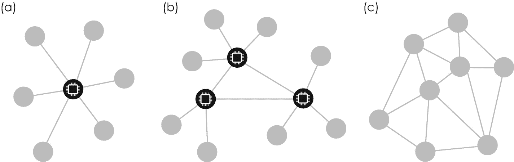

# 第 3 章  

本章将围绕比特币背后这项令人着迷的使能技术展开，该技术如今已成为数字化转型的重要支撑技术，因为它为政府开辟了新的机遇，并在公共和私营部门分别创造了全新的商业模式。本章将介绍区块链技术及其核心原则与概念。我们将学习区块链技术及其分布式网络架构如何在不可信环境中实现涉及货币或其他可交易资产的加密安全交易与转移。在此背景下，我们将探索区块链这一基础且不可篡改的数据结构，以更深入地理解比特币交易的生命周期。此外，我们还将讨论该数据结构的巧妙扩展——通过智能合约实现业务流程自动化。随后，我们将探讨当前最热门的商业应用案例，并展望区块链技术的未来前景及其对工业、政府和社会的影响。本章将让你深刻理解区块链技术的工作原理、可适用的应用场景，以及哪些场景并不适合这项数字技术。在本章结尾（与其他章节一样），我将为你提供一个易于使用的区块链技术框架，帮助你判断该技术能否应用于你自己的用例或商业构想。  

## 3.1 区块链场景设定  

区块链技术的兴起源于一个持久的谜团。2008 年——在全球金融危机最严峻的时期——中本聪（Satoshi Nakamoto）向一个密码学邮件列表⁵²发送了一封主题为“比特币 P2P 电子现金论文”的电子邮件，发布了一篇革命性论文。据称，他对全球银行体系深感失望，在邮件中说明他“正在开发一种完全点对点、无需可信第三方的全新电子现金系统”，并将相应的白皮书上传至[`www.bitcoin.org`](http://www.bitcoin.org) [6]。这篇论文很快引起了广泛关注，随后的几个月和几年里，人们试图了解这位日文名作者的真实身份。然而，迄今为止这些尝试均未成功，比特币及其底层区块链技术的创造者身份至今仍是个谜。  

在这篇开创性论文发表约两个月后，2009 年 1 月 3 日，中本聪创建了第一个比特币，比特币网络正式诞生⁵³。九天后，中本聪与美国软件开发者哈尔·芬尼（Hal Finney）进行了第一笔比特币交易。2009 年 10 月 5 日，比特币（货币代码：BTC）与美元的汇率首次确立，仅为 1 BTC = 0.00076 美元。在 2017 年底比特币热潮的顶峰时期，汇率飙升超过 260,000%，达到近 1 BTC = 20,000 美元——这确实是惊人的增长和投机热潮。但在深入探讨这一革命性技术之前，回顾货币与交易在历史上所扮演的关键角色将颇具启发性。  

### 3.1.1 交易与货币在历史上的角色  

社会中交易和商品交换的需求自然产生，主要源于地域和地理差异。例如，沿海地区鱼类资源丰富，而内陆地区则稀缺；相反，内陆拥有广阔的谷物种植田地，而沿海地区则相对匮乏。沿海与内陆之间的鱼与谷物交换只是商品交换的一个例子——人们总是渴望拥有自己所没有的东西。一般而言，任何剩余产品历来都是理想的交易物，这也是为什么在青铜时代早期就已经出现了*物物交换*。当时人们开始使用谷物、兽皮、干鱼、牛、盐和其他天然物品进行日常交易。这种特殊的“货币”如今被称为*原始货币*，因为它通常具有即时价值，可直接用于食用或其他用途，如表 3-1 所示。希腊哲学家和博学家亚里士多德在公元前 350 年的名著《政治学》中就已经指出，物品始终具有两种用途：一是物品被设计和制造出来的原本用途，二是作为出售或交换的物品[7]。值得注意的是，这种原始货币的精炼版本甚至延续到了罗马帝国时期，帝国有时用盐——一种重要的食物防腐剂——作为军饷支付士兵。这种支付方式在拉丁语中被称为*salarius*，意为“属于盐的”，并后来演变为现代英语中的“salary”（薪水）。  

除了具有即时价值的天然物品，人们偶尔也开始使用其他稀有物品进行交易，例如贝壳。这些小型海洋贝壳很快变得非常流行，因为它们非常坚硬、便于携带，而且最重要的是——不易腐烂。出于同样的原因，人们开始使用金属，包括金、银和铜，而非其他材料。金属有两个主要优势：(1) 由于稀有性而具有内在价值；(2) 易于铸造成基本物品，如箭头和其他用于狩猎和自卫的工具。公元前 800 年，生活在今天土耳其地区的吕底亚人推出了原始的金属*硬币货币*，最初仅用于礼物、奖励和祭祀供品。但这一理念在地中海地区迅速传播，人们也开始将这些硬币用于交易，而希腊人则是第一个大规模使用硬币进行日常交易的国家。包括雅典和科林斯在内的古希腊城邦很快开始铸造自己的硬币，例如德拉克马。硬币的制作相对困难，但非常便于日常交易。然而，在中世纪鼎盛时期，由于重量和体积问题，硬币越来越限制了其在长途大规模商品交易中的使用。这就是为什么中世纪意大利中部著名的贸易城市——包括热那亚、威尼斯和佛罗伦萨——铸造了装饰精美的金币，例如弗罗林金币，其价值更高，更适合长途贸易。任何硬币的最终价值衡量标准始终是其贵金属含量，而这由发行主权方（如政府或前述贸易城市）定义。  

**表 3-1** 历史上的货币类型

| 类型 | 出现年代 | 优点 (+) 和缺点 (−) |
| --- | --- | --- |
| 原始货币 | 公元前 | + 本身可直接使用 – 价值难以确定，不便携带，部分易腐烂 |
| 贵金属 | 青铜时代 | + 不易腐烂，可铸造成基础工具，因稀有性而价值稳定 – 难以成型和铸造，不便携带 |
| 铸币 | 8 世纪 | + 非常便携，不易腐烂，因原材料稀有而价值稳定 – 大量交易时体积庞大，易遭抢劫 |
| 纸币 | 11 世纪 | + 非常便携，通过印刷易于规模扩展 – 无内在价值，易受通货膨胀影响，易遭抢劫和伪造 |
| 记账货币 | 14 世纪 | + 非常便携，存储方便安全，交易简单 – 仅虚拟存在，无内在价值，无商品支撑，易受欺诈 |
| 法定货币 | 20 世纪 | + 交易简单，通过密码学确保安全交易，货币政策由中央银行及其“官方法定货币”定义 – 仅虚拟存在，无内在价值，无商品支撑 |
| 加密货币 | 21 世纪 | + 交易非常简单，通过密码学确保高度安全交易，成本效益高，便于微支付，通过开放网络实现自我监管政策，无需中介即可转账 – 因缺乏监管机构而无法控制通货膨胀，仅虚拟存在，无内在价值，无商品支撑 |

相当有趣的是，数千年来人类迄今仅开采了约 16.3 万吨黄金，这只相当于一个边长约 20 米的立方体——这也是黄金仍被视为抗衰退货币的主要原因之一，正如我们在 2008 年金融危机和 2020/21 年全球新冠疫情中所见。

随着越来越多的人开始使用硬币进行交易，铸币的供应日益短缺。由于这种短缺，卖方开始允许买方延期付款，这通常通过汇票来记录。从 11 世纪的中国开始，不久后欧洲也跟进，这种汇票本身逐渐被接受为一种支付形式，于是*纸币*的概念应运而生。纸币非常便携，且在货币短缺时易于增发。但由于它实际上是无内在价值的第一种货币形式，因此极易受到严重通货膨胀的影响。正因如此，它在 14 世纪被*记账货币*广泛取代，这是一种非物质化的货币形式，仅以数字形式存在于实体账簿或账户中。我们今天日常交易中最常用的货币被称为*法定货币*，这是一种由政府发行的、不以黄金或其他具有内在价值的商品为支撑的货币。相反，法定货币的价值由相应国家的*中央银行*控制，该政府机构负责发行国家官方货币，并通过增加或限制供应量来控制其价值及通货膨胀。

## 3.1.2 货币在社会中的基本功能

这段简短的历史回顾揭示出，在更抽象的层面上，货币的主要目的是使双方之间能够进行有价资产的*可信交易*，无论他们是否彼此信任。换言之，货币在社会中通常执行以下四项关键功能：

1.  *价值转移手段*：为商品和劳动的交换进行支付
2.  *计价单位*：衡量商品和劳动的价值
3.  *价值储藏手段*：为未来支出储蓄货币（即所谓的“储备金”）
4.  *资金来源*：将货币投资于经济和商业发展

印度创新策略师兼区块链倡导者卡里亚帕·比马亚在其畅销书《区块链替代方案：重新思考宏观经济政策与经济理论》[8]中，将货币称为“社会内部信任的物理体现”。我们将在下文中看到，恰恰是在不可信环境中这种信任的扩散，使得价值转移成为可能——这里的“价值”可以是从知识产权或所有权到比特币的任何事物——而这正是区块链技术的核心。因此，让我们深入探究区块链及其关键概念和应用。

## 3.2 区块链基础

区块链技术和数字货币是被称为*分布式账本技术*的两种最重要的应用。分布式账本是一种在线数据库或登记册，其信息分布在由大量计算机和其他电子设备组成的大型网络中。作为一种簿记形式，账本在古代就已用于记录和记载涉及货币或其他实物资产的交易。它是一个永久性的摘要，按日期列出每笔交易，并记录已从一方转移到另一方的特定价值，如货币金额。虽然账本的核心思想与用途保持不变，但其物理实现形式随着时间演变，从青铜时代的泥板^(⁵⁴)，到中世纪的纸质登记册，再到数字时代的电子记录。

我们熟悉的大多数账本，如土地登记册，都依赖于一个中心化权威机构。在这种情况下，土地登记处运营着一台中心化计算机或*服务器*，这使得登记册中的信息可供网络中所有其他用户或*客户端*访问，包括各地区土地登记处及其他相关政府机构。土地登记册就是所谓*中心化账本*的一个例子，在这种账本中，所有参与者都排列在一个*客户端-服务器网络*中，服务器扮演着单一控制权威的角色，它运营并控制着整个网络，类似于发行货币的主权政府。因此，该网络的所有用户都依赖于一个单一的主服务器，如图 3-1 (a)所示。迄今为止，中心化账本是最常见的提供在线服务的网络，因此被包括亚马逊和 eBay 在内的各种组织所使用。如果未通过加密算法和备份服务器加以保护，中心化账本通常极易受到网络攻击，因为黑客只需要攻击并篡改中心服务器保存的账本文件，就能更改所有权记录或修改账户余额等。

图 3-1

不同计算机组成的网络通常可以配置为三种形式：(a) 中心化网络有一个中心节点（带电脑图标的黑圈），该节点位于网络中心并通过虚线连接到所有其他节点（灰圈）。(b) 去中心化网络有多个中心节点，每个节点都与其他一些节点相连。(c) 在分布式网络中，每个节点拥有平等权利，并与全部或部分其他节点相连。这种配置用于实现区块链。

### 3.2.1 去中心化与信任的到来

分布式账本揭示了一种完全不同的网络架构。它们是一种特殊的数字账本，其中的记录并非由一台中心化的、可能被黑客攻击的计算机或服务器保存，而是分布在一个庞大的*分布式网络*上。^(⁵⁵) 这个网络包含位于不同地点的多台计算机或*节点*，由不同的机构和组织运营，如图 3-1 (c) 所示。这类网络通常包含所谓的*全节点*。它们专门运行网络的底层操作软件，即所谓的*网络协议*，以确保网络中共享的所有信息都符合某些标准，例如安全性、数据格式和区块大小。为了提高可访问性，不同的节点通常通过互联网连接（而非通过固定的网络电缆），因此文献中也常称其为*对等网络*或 P2P 网络。

由于每个节点都复制账本文件并保存一份相同的副本，分布式网络中不再需要中心服务器（或权威机构），这实际上是分布式账本技术最重要且同等具有开创性的特征。因此，账本中任何合法的信息变更都会通过网络传播，并反映在所有去中心化的副本中。因此，分布式账本通过其固有的去中心化特性来维护交易的安全性、可追溯性和准确性，因为每个节点都充当着信任的守门人。当与最先进的加密算法相结合时，分布式网络上的信息交换可以安全地实施，并且可以针对每个节点单独控制访问权限和许可权。换句话说，分布式账本技术使得那些互不相识、互不信任的人们，无需任何中心化中介即可相互交易，因为他们可以信任网络本身。从经济学家的角度来看，这极大地降低了“信任成本”，并可能有助于在长期内减轻社会对银行、政府机构、公证人以及其他监管合规官员的依赖。尤其是分布式账本和区块链技术，为信息的收集和共享方式提供了一种全新的范式。通过去掉中间人，区块链技术有望彻底改变个人、企业和政府之间相互交易的方式。

**分布式网络**

与中心化网络相比，分布式网络将信息分布在一个广泛的计算机网络中。不需要中央服务器或中介权威，因为网络中的每台计算机同时是中央服务器和客户端。

### 3.2.2 不可变的数据结构

但区块链文件中的信息是如何组织的？它又是如何在不可信的环境中提供信任的呢？区块链技术根据其底层网络协议中的技术规范，将交易数据和信息打包成标准化、固定大小和数据格式的*区块*。

**表 3-2**

基于 SHA-1 哈希函数的一条示例交易消息的哈希值。两者之间的比较表明，即使输入中的微小变化（粗体文本）也会导致输出的重大变化。为清晰起见，输出中添加了空格和换行符。输出是使用[`www.blockchain-basics.com/HashFunctions.html`](http://www.blockchain-basics.com/HashFunctions.html)上的公共哈希函数生成器生成的。

| 行 | 消息（输入） | 消息的哈希值（输出） |
| --- | --- | --- |
| 1. | 发件人：Alice (1PrsFtga)，收件人：Bob (3kLMnbTY)，金额：美元 **10** | ED83 1EC2 B307 C014 ADBA 2E10 670F CD7F 24D0 9E77 |
| 2. | 发件人：Alice (1PrsFtga)，收件人：Bob (3kLMnbTY)，金额：美元 **100** | BE3D 4C54 8705 ACC1 9D2B 0E44 D594 6C31 58A5 8CF1 |

这些区块本身通过采用*密码学哈希函数*进行“链接”或与前面的区块连接在一起。

但在我们仔细研究这种特定链接之前，先了解一下密码学哈希函数的一些基本属性是很有帮助的。像任何其他数学函数一样，它们有输入值和输出值。输入由实际的交易文本组成，例如“发件人：Alice (1PrsFtga)，收件人：Bob (3kLMnbTY)，金额：美元 10”，该文本记录了 Alice 从其账户号 `1PrsFtga` 向 Bob 的账户号 `3kLMnbTY` 转移了 10 美元。对于密码学哈希函数，每个交易实体的个人账户号称为*公钥*，由数字和字母组成，其原因将在后面变得明显。最流行的哈希函数之一是安全哈希算法 1 或 *SHA-1*，它是由美国国家标准与技术研究院和美国国家安全局于 1993 年联合开发的，用于实现数字签名。^(⁵⁶) 像任何其他哈希函数一样，`SHA-1` 将任意长度的明文信息转换为固定长度的字母和数字字符串——在 `SHA-1` 的情况下，输出值始终显示总共 40 个符号。

除了将任意长度的输入转换为固定长度的输出之外，密码学哈希函数还有另一个显著特性：即使是输入值的微小变化也会导致输出的重大变化，如表 3-2 示例所示。密码学哈希函数通常具有以下非常重要的属性。它们是

*   *伪随机*，即输入的改变会导致输出不可预测地变化^(⁵⁷)
*   *确定性*，即输入决定输出
*   *不可逆*，因此无法基于输出构造输入
*   *唯一*（或“抗碰撞”），即每个输入具有唯一的哈希值，且相同的输入将产生相同的输出^(⁵⁸)

由于输出始终具有固定长度且是唯一的，密码学哈希函数提供了一种理想且非常高效的技术，用于判断两个数字对象是否相等。

**密码学哈希函数**

密码学哈希函数是一种算法函数，它将任何信息（例如任意长度的文本消息）转换为由数字和字母组成的字符串。其核心特性之一是，输出字符串的长度是固定且始终相同的，与输入信息的长度无关。此外，密码学哈希函数的输出是 (1) 伪随机的、(2) 确定性的、(3) 不可逆的，以及 (4) 唯一的，也就是说，不同的输入将始终产生不同的输出。

