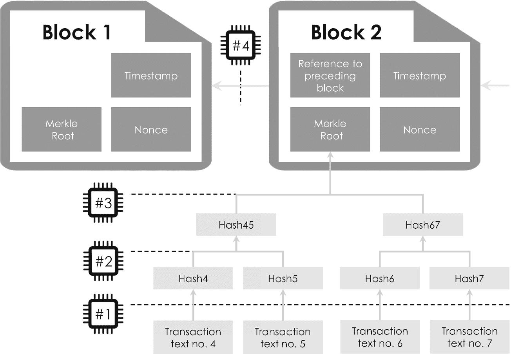
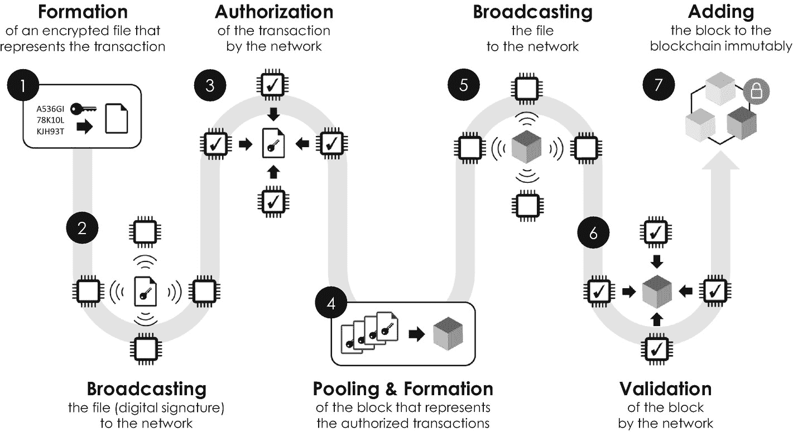

# 加密哈希函数与区块链结构

加密哈希函数对于构建区块链的各个区块以及将它们链接成一个大型区块链文件都至关重要。这一过程基于将其反复应用于交易消息，并将产生的输出值排列成一种特殊的数据结构，称为 `*默克尔树*`，以纪念美国计算机科学家拉尔夫·默克尔，他于 1988 年将其开发用于数字签名领域 [10]。`*默克尔树*` 是层次结构，通常表示为倒置的树，交易消息位于最底层，如图 3-2 示意所示。在此特定示例中，区块二在其最底层包含四笔交易——一个典型的比特币区块通常总共包含约 500 笔交易。此示例 `*默克尔树*` 的第二层是通过将加密哈希函数应用于每笔交易的明文而构建的，这一过程自然被称为 `*哈希运算*`。其结果分别表示为 `Hash4`、`Hash5`、`Hash6` 和 `Hash7`。

图 3-2
区块链一个示例部分的整体数据结构。区块头中包含的信息以深灰色突出显示——区块 1 是该区块链的创世区块，是第一个没有指向前一个区块的区块。“区块 2”的默克尔根对应于包含该区块所有交易信息的默克尔树的哈希值。灰色箭头表示哈希函数（微处理器图标）在四个不同层级（用“#1”至“#4”表示，虚线）上的连续应用

第三层是通过再次应用此算法函数创建的。但这一次，它不是应用于每笔交易消息的明文，而是应用于成对的、已哈希的交易消息，这些消息被合并成一个字符串，即 `Hash4` 和 `Hash5` 以及 `Hash6` 和 `Hash7`。产生的输出以相同的表示法标记为 `Hash45` 和 `Hash67`。这个过程最终在生成整个 `*默克尔树*` 的单一哈希值时终止，即在当前示例中，将 `Hash45` 和 `Hash67` 合并进行哈希运算。这个位于 `*默克尔树*` 顶端的最终哈希值被称为 `*默克尔根*`，它间接包含了所有交易的信息。

## 默克尔树

`*默克尔树*` 是一种树状数据结构，它允许组合和加密链接不同的哈希值与交易消息。

`*默克尔根*` 是每个区块所谓的 `*区块头*`（一个信息性标签或元数据类型^(⁵⁹)）中最重要的组成部分之一，它提供了每个区块唯一的交易摘要。一个区块的 `*区块头*` 通常包含以下组成部分：

*   `*默克尔根*`，它间接包含了该区块的整个交易历史。
*   前一个区块的 `*引用*` 编号。
*   `*时间戳*`，记录了区块的创建时间，并由网络中的其他客户端进行安全校验。
*   `*Nonce*`（意为“仅使用一次的数字”），一个 32 位二进制数，它“归一化”区块的哈希值，以确保其低于某个特定的目标值。正如下一节所讨论的，这个数字在交易过程本身中起着关键作用。

## 区块链

区块链技术是一种创新工具，用于通过加密安全保护的账本或数据库来安全地存储和共享各种数字信息。数据只能被添加到账本中，既不能修改也不能删除。信息以数据块链的形式组织，并分布在由众多节点（计算机）组成的大型网络中。每个节点都通过保留一份相同的区块链文件副本充当着信任守护者的角色，正因如此，区块链技术也被称为分布式账本技术。

有了这四个组成部分，我们现在可以通过——你猜对了——再次应用加密哈希函数来完成我们的区块链。为此，我们将区块头的所有组成部分合并成一个字符串，然后对其进行哈希运算。因此，区块链的一个区块归根结底就是一个由数字和字母组成的字符串，它对应于其区块头文件中各个组成部分的哈希值。由于每个区块的区块头还包含对其前一个区块的引用，哈希函数的这最后一次应用将所有区块不可篡改地链接在一起，完成了区块链的构建。图 3-2 中的区块 1 没有引用任何前一个区块，因为它是我们示例区块链的第一个区块，即所谓的 `*创世区块*`。至此，仍有一个问题：这样一个具有精细数据结构的区块链如何用于在区块链网络中的两方之间交换价值？这是下一节的重点。

### 3.2.3 数字价值转移

但在讨论区块链交易生命周期之前，为了进行对比，简要回顾一下当今货币交易的组织方式是很有启发性的。想象一下，您希望通过传统的国际 SWIFT^(⁶⁰) 交易，将 100 欧元从您在德国的银行账户转账到您在美国的朋友的银行账户。此交易过程通常按以下六个主要步骤进行组织：

1.  您首先登录您的网上银行账户，点击“转账”，然后被要求输入交易详情，例如您朋友的收款人姓名、他们的国际银行账号或“IBAN”以及要转账的金额。此外，您需要通过输入某个（手机）交易号码或 TAN 来授权和验证此交易。

2.  一旦验证成功通过，您的主银行（“付款行”）会将款项发送给一家德国的代理行，该代理行与一家国际清算银行有双边业务协议。

3.  然后，您的代理行将款项转给国际清算银行，国际清算银行根据当天的官方汇率将 100 欧元兑换为约 110 美元。

4.  国际清算银行将款项转给一家美国代理行。

5.  这家美国代理行将款项转给您朋友作为收款人的主银行（“收款行”），交易至此完成。

图 3-3
区块链交易生命周期按七个步骤组织（编号圆圈，黑色）：(1) 形成包含交易消息的加密文件，(2) 将该文件广播到网络节点（微处理器图标），(3) 由网络对交易进行授权，(4) 将多笔已授权交易打包并形成一个区块，(5) 将区块广播到节点，(6) 通过网络通过共识算法对区块进行验证，以及 (7) 将区块不可篡改地添加到区块链中

您可能已经注意到，这个过程涉及五家不同的银行，且相当复杂。此外，国际交易通常产生相对较高的交易费用，并且需要数天才能完成。基于区块链的价值转移要简单快捷得多。尽管我们现在将在货币背景下讨论这种价值交易过程，但务必记住，同样的方案适用于任何其他类型的价值转移，包括知识产权和其他有价值的数字资产。