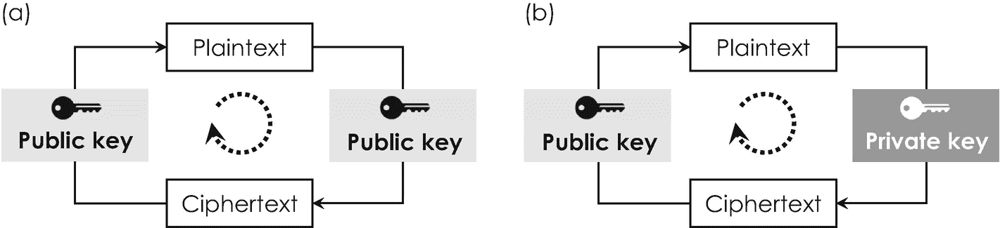
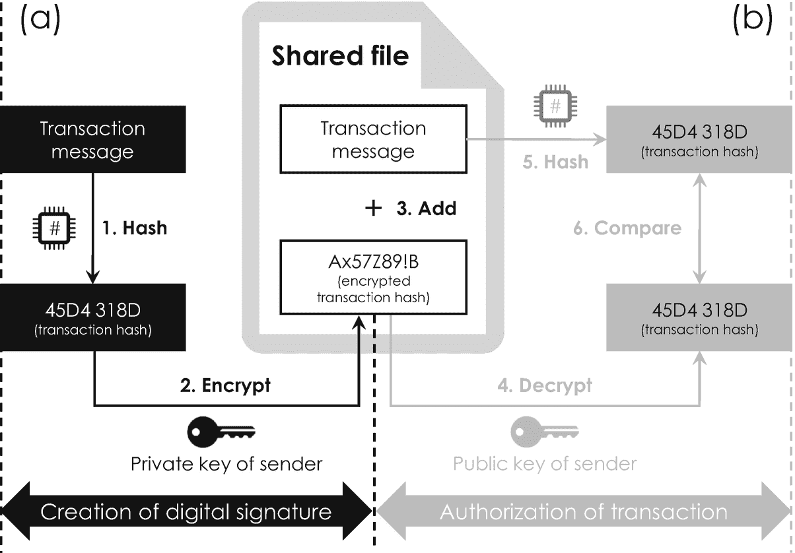

# 区块链交易生命周期

区块链交易生命周期通常分为七个步骤，如图 3-3 所示。假设您想向美国朋友 Bob 发送 10 个 BTC——实际上这是一笔相当可观的金额，因为在 2020 年 9 月，汇率约为 1 BTC = 10,500 美元。从表 3-2 可知，相应交易消息的明文可能为：“发件人：发件人姓名（其`private key`），收件人：收件人姓名（其`private key`），金额：10 BTC。”比特币交易流程始于生成一个加密文件，即所谓的*数字签名*，其中包含您交易消息的哈希值。将此文件广播到网络后，在第三步中，您的交易将由网络中的一个节点授权——关于此步骤的更多细节将在下一节中详细描述，此处为清晰起见暂不讨论。由于每个区块为了提高效率包含多笔交易，您的交易消息很可能会被缓冲到一个等待池中，即所谓的*mempool*（交易内存池），该池在授权交易被组装成 Merkle 树之前收集它们。一旦池化完成，^(⁶¹) 将如前所述通过迭代应用加密哈希函数来创建整个 Merkle 树。此外，所有其他组件都被添加到区块头中，包含您交易消息的区块最终被创建。然后，该区块在区块链交易生命周期的第五步被广播到网络。第六步是整个交易过程中最重要的步骤之一。它涉及在网络内就该区块的有效性达成共识。这种验证基于解决一个计算难题，在比特币区块链中称为*工作量证明*，我们将在下文中详细探讨。一旦其中一个节点解决了这个难题，解决方案就会被广播到网络，该区块被标记为已验证，并最终被不可篡改地添加到区块链中。网络进行自我更新，在最后一步中，最新且达成一致的账本版本被单独保存在每个节点上。

以上概述为您提供了关于整个区块链交易生命周期的初步印象。至此，需要注意的是，这一切都在几分钟内自动完成，并且没有任何第三方介入——您可以回想一下，通过 SWIFT 进行的传统银行交易涉及五家以上的银行，并且总共可能需要数天时间。这实际上是经典 SWIFT 与基于区块链的（货币）价值转移之间最重要的区别。由于没有任何第三方中介，区块链交易流程显著降低了交易速度（译者注：此处根据上下文逻辑推断应为“时间”）和成本。

我们对区块链交易生命周期的简要讨论揭示了两个对于区块链安全运行尤其重要的步骤：(1) 交易的授权 和 (2) 通过工作量证明对区块进行验证，即分别对应图 3-3 中的第三步和第六步。这两个步骤将在以下两个小节中详细讨论。

## 通过数字签名授权交易

数字签名在整个交易生命周期中扮演着至关重要的角色，因为它允许我们：(1) 明确识别用户及其账户，以确保提交的交易是以他们的名义进行的；(2) 授权交易，以确保提交新交易的用户确实是待转移的相关信息或资产的合法所有者。第一个功能类似于您在法律合同（如房屋销售协议）上的签名，第二个功能则类似于在本例中由公证人对该签名进行的司法验证。这两个功能对于保证整个区块链的完整性以及保护其免受未经授权的访问和滥用尤为重要，因为其开放的 P2P 架构允许任何人登录、访问并添加新的交易数据。

创建数字签名的特定概念可以追溯到美国密码学先驱拉尔夫·梅克尔——我们通过 Merkle 树了解到的这位科学家——以及他在密码学和加密数字签名方面的开创性工作 [11]。但在详细讨论数字签名及其用法之前，先讨论一些密码学的基本术语和概念是很有启发性的。密码学通常涉及三个主要步骤，即：

1. 加密（交易）消息
2. 传输加密后的（交易）消息
3. 合法的接收者解密传输的（交易）消息

加密后的数据也称为*密文*，指的是一串无意义的字母和数字，对于没有正确“配方”来解密它的人类或计算机来说毫无意义。这个“配方”被称为*密钥*，本质上是一串字母和数字，它决定了消息的明文如何转换为其密文。换句话说，密钥决定了用于加密明文消息的密码算法的输出，该算法在与另一方交换消息之前使用。

加密和解密可以依赖于对称密钥或非对称密钥，每种密钥都有其特定的优缺点。*对称加密*方案基于一个密钥，该密钥既可以由发送者用于加密明文，也可以由相应的接收者用于解密密文，如图 3-4(a)所示。这种加密方案非常易于实现，但也非常容易被破解，因为任何获取到该密钥的人——通过窃取或拦截通信信道——都可以轻易解密消息。

**图 3-4** 对称加密方案(a)与非对称加密方案(b)的比较。对于对称加密算法，公钥既用于加密明文，也用于解密密文。非对称加密方案使用两个独立的密钥，私钥用于加密，公钥用于解密。

这就是为什么随着时间推移，人们开发出更精密的加密方案，其中*非对称加密*（也称为*公钥密码学*）是最流行且广泛使用的一种。它也是实现防篡改区块链的关键要素，并被选用于多种网络安全应用，例如第 2.3.2 节中介绍的 `RSA` 算法^(⁶²) 。与对称加密方案相反，非对称加密使用两种不同的密码密钥：仅限其所有者使用的*私钥*，以及分布在网络上的相应*公钥*。无需深入细节——对非对称加密的详细理解实际上需要相当高级的数学概念，例如非线性椭圆曲线——可以说这两个密钥是*互补*的，这意味着它们只能组合使用，并且只能按一个方向使用，如图 3-4 (b) 所示。例如，用公钥加密的明文，只能使用其互补的私钥解密。互补密钥对通常可以以两种方式使用：

1.  *私钥到公钥*交易——如图 3-4 (b) 所示——发送方使用其*私钥来加密*他的消息。然后消息被发送给接收方，接收方可以使用互补的公钥解密。这种方法不能保护消息不被读取，但允许接收方验证发送方的身份，因为加密的消息只能使用合法发送方的公钥解密。

2.  *公钥到私钥*交易——未在图 3-4 中显示——发送方使用*接收方的公钥来加密*他的消息。接收方随后可以使用其私钥相应地解密。与第一种应用选项相比，这种方法保护消息不被读取，因为由特定公钥加密的数据只能由预期接收方拥有的互补私钥解密。

区块链网络中用于授权交易的数字签名基于非对称私钥到公钥的加密方案。它的创建分为三个步骤，如图 3-5 (a) 所示：(1) 对实际交易消息进行哈希处理，(2) 使用发送方的私钥加密哈希后的交易消息，(3) 最后通过将加密后的交易哈希添加到交易消息的明文中来创建数字签名。然后，此数字签名被分发到网络中。一个节点将随机拾取它，并通过执行图 3-5 (b) 中描绘的以下三个步骤来授权交易：(4) 使用发送方的公钥解密交易哈希，(5) 对文件中包含的交易消息进行哈希处理，以及 (6) 将两个结果进行相互比较。如果两个结果相同，则该节点可以断定：

*   消息确实由发送方签名，因为数字签名能够使用发送方的公钥成功解密。
*   数字签名中包含的交易消息是正确的，因为解密后的交易哈希与由授权节点独立生成的交易哈希相匹配。

如果此比较未显示相同的结果，则该交易不会被网络授权，并且相关交易会被识别为欺诈交易，不会被转发到内存池。您可能已经注意到，只有私钥最终被保密，才能避免欺诈交易。一旦私钥被恶意第三方窃取，就无法避免欺诈和非法交易，这就是为什么私钥的存储在区块链生态系统中起着非常关键的作用。

用户的私钥通常由一个所谓的*钱包*来存储。钱包是一种软件或硬件，它通过提供一个易于使用的区块链网络网关，允许用户访问区块链网络并授权交易。钱包可以在始终在线并连接网络的计算机上实现，也可以在永久离线并与区块链网络断开连接的计算机上实现。在线钱包也称为*热钱包*，因为由于保持连接，它们总是暴露给黑客和其他恶意用户。出于同样的原因，离线钱包被称为*冷钱包*，主要用于将用户的私钥安全地存储在某些离线设备上。最简单但也同样不安全的冷钱包是*纸钱包*，即您将私钥写在一张纸上。根据您的记忆力，最安全的钱包之一是*脑钱包*，即记住您的私钥而无需写下来。

**图 3-5**

数字签名在交易授权中的使用。(a) 展示了如何创建数字签名，而 (b) 则描绘了如何使用它来授权交易。这种授权基于将直接对交易进行哈希处理得到的哈希值，与对网络中共享的文件进行解密得到的结果进行比较。

在选择最合适的钱包来存储您的私钥时，务必牢记私钥是访问区块链的唯一途径。换句话说，丢失您的私钥意味着您将被永久锁定在区块链之外，并且所有关于您的存储信息都将不可挽回地丢失，因为无法重置或重新创建私钥。例如，用于访问比特币区块链的大多数私钥都存储在热钱包中，这些热钱包由托管钱包服务、加密货币交易所和比特币交易商（例如多资产经纪商 `eToro`）提供。

### 3.2.5 通过共识与挖矿建立信任

在授权交易之后，区块验证是在区块链网络中建立信任的另一个典型过程。以比特币区块链为例，区块验证基于求解一个称为工作量证明的计算难题。这种工作量证明属于更广泛的*共识算法*范畴，这类算法通常能实现对分布式网络的集体控制。

#### 挖矿

`挖矿`是指通过求解一个名为“工作量证明”的计算难题来寻找有效区块的过程。例如，它能够消除涉及双重花费的欺诈交易。

在没有中央中介机构来调解各方协议交换的情况下，对此类算法的需求，最早由 1982 年的*拜占庭将军*问题所阐述 [13]。这个著名的思想实验是这样一群军队将领，他们分别率领着拜占庭军队中地理上分隔的几部分，正计划进攻一座设防城市。他们知道，成功的唯一方法是同时协调进攻这座城市。那么，如果其中一位或多位将军是叛徒，或者传递误导性、模棱两可的信息，他们又如何能就联合进攻的时间达成一致呢？类比到分布式网络，将军可以看作是节点，而信使则是不同节点之间的连接。拜占庭将军问题在理论上由米格尔·卡斯特罗和芭芭拉·利斯科夫解决，他们在 1999 年提出了“实用拜占庭容错”算法 [14]。它的首次实际应用是在十年后，随着匿名者中本聪发明了比特币区块链及其工作量证明原理才得以实现。这种可行共识算法的实现，实际上是区块链技术的关键创新之一。

工作量证明是一个迭代的试错过程，其中区块头中的`nonce`值作为自由变量被顺序更改，直到区块的哈希值低于由底层网络协议设定的预期目标值。^(⁶³) 一旦某个节点找到了满足此条件的区块，该区块就被验证并不可篡改地添加到区块链中。寻找有效`nonce`值的这个过程被称为*挖矿*，这借鉴了电脑游戏《矿工》及其“淘金或开采宝石”的隐喻。通过挖矿解决计算难题，使得网络能够对所有交易实现集体控制，因为它提供了一条途径来共同判断一笔交易是允许的还是欺诈的——这也是传奇的拜占庭将军们所需的方法。

此处的“欺诈”是指区块链网络的恶意用户（类似于拜占庭叛徒），试图通过在两笔独立的交易中使用同一笔价值（比特币）来实现双重花费。这种企图通常被称为*双重支付*攻击。尽管挖矿减少了欺诈交易的动机，但如果攻击者掌握了超过 51%的挖矿算力来强制并逆转交易，理论上双重支付仍有可能发生。好消息是，比特币和区块链技术为这种*51%攻击*提供了一个非常有效的解决方案，该方案基于以下两种对策的结合：

*   *增加难度*：*难度*是一个参数，它衡量找到解决计算难题的`nonce`值的可能性（或概率）。由于比特币是一个任何人都可以加入的开放网络，它吸引了越来越多的用户，这些用户可能将他们的算力合并到更具成本效益且高度专业化的*矿池*中。此类矿池偶尔会捕获超过 51%的挖矿算力，理论上这使他们能够发起 51%攻击。为了避免这个问题，随着越来越多的用户加入网络，网络会通过提高计算难题的难度来频繁地重新平衡。特别是，比特币协议每 2016 个区块（目前相当于大约两周时间）增加一次难度。

*   *引入挖矿激励*：引入*挖矿奖励*是第二种防止恶意企图的措施。它通过奖励第一个解决工作量证明计算难题的节点操作者以新生成或铸造的比特币，来激励诚实行为。鉴于难度会自动增加，这种挖矿奖励使得使用超过 51%的算力诚实挖矿并赚取比特币，比试图欺骗系统更有利可图。从历史上看，激励性的挖矿奖励也吸引了早期采用者，这有助于比特币在初期诚实地达到临界规模，并利用*网络效应*。^(⁶⁴)

为了完整性起见，有必要指出工作量证明并不是实现定制区块链时普遍可用的唯一共识机制。另一种被称为*权益证明*，其核心理念是网络中的某个节点或用户在该系统中拥有足够的权益，这使得任何恶意方的攻击都变得无望。*消逝时间证明*是另一种共识算法，目前芯片制造商英特尔等公司正在探索，其目标是通过使用 CPU 内部的安全指令来达成共识——该相关产品名为`Intel SGX`（“软件保护扩展”） [15]。

### 3.2.6 智能商业合约

区块链技术有一项特别有趣的功能，我们迄今尚未讨论，但它为有益的应用带来了巨大希望。这项功能涉及构成大多数商业关系核心的合约，例如房屋的销售合同或汽车的租赁合同。正如我们在本章引言部分所学到的，古老的贸易和易货规则早在古代就已存在。现代合同法始于 1750 年的工业革命时期，当时工厂工人数量不断增加，需要用更正式的方法来规范现金工资、工作条件和安全标准。直到今天，法律合约仍然是所有商业关系和交易的组成部分。合约是两个或多个当事方之间具有法律约束力和可执行力的协议，它承认协议中每一方的权利和义务。它们通常涉及任何形式的（货币）价值转移，一旦协议标的物得以履行，该转移即被授权。

区块链技术通过实现“自动化合约”来自动化这种价值转移。这些合约被称为*智能合约*[16]，一旦区块链网络就合约条件已得到一致履行达成共识，它们便会自动执行。智能合约是*去中心化应用*或`DApps`的一个子类别，即在区块链网络上运行的软件片段。根据自动化程度的编程设定，智能合约可以是部分或完全自执行的，并且首次在以太坊区块链协议中实现。^(⁶⁵)

智能合约

智能合约是在底层网络协议之上实现的程序，它在区块链网络中体现特定的业务逻辑。它可用于自动化某些业务流程，如签约、清算、结算和记录保存。

智能合约应用的一个例子是一家全自动汽车租赁公司，该公司利用此功能在收到付款后自动解锁车辆。一旦租期届满，系统可自动要求用户为继续使用付费，或在下一个机会将车停好交还。如果租车人因某种原因未能履行此合同义务，汽车租赁公司可以锁定车辆，从而无需任何第三方中介或政府机构介入即可自动执行合同。可以想象，这种可自动执行的合约通过精简和自动化行政流程以提高效率，能够优化组织运营并提高企业盈利能力。

在实践中，智能合约的实施仍伴随着技术挑战和监管风险。最常见的问题与用户忘记其私钥有关，这会直接导致财务损失，因为正如我们之前所知，区块链不支持任何重置或重新创建私钥的选项。解决此问题的一种方法是*多方签名*，即需要多个签名才能访问区块链或授权交易。但在以太坊区块链的情况下，这种方法已因利用其协议中的代码错误和其他难以发现的漏洞而被黑客攻击。例如，2017 年，恶意用户攻击了多重签名钱包的智能合约，并非法将价值 2.8 亿美元的加密货币转移到他们的账户中[17]。此事件和其他事件表明，智能合约还不是完全成熟的功能。然而，如果在私有区块链网络中明智地实施，它们已经可以为某些商业应用提供一些优势。

表 3-3

根据权限模型以及不同用户之间读写访问权限的分布来划分区块链的基本类型。表格灵感来源于[19]

|   |   | 读取 | 写入 | 示例 |
| --- | --- | --- | --- | --- |
| 开放 | 公共无需许可 | 任何人 | 任何人 | 比特币和以太坊 |
|   | 公共需许可 | 任何人 | 仅限授权参与者 | Sovrin 基金会^(⁶⁶) |
| 封闭 | 联盟链 | 授权参与者 | 授权参与者 | 运营共享账本的多个银行 |
|   | 私有需许可 | 仅限完全私有或授权节点 | 仅限网络运营者 | 母公司与供应商或分包商共享的内部企业账本 |

## 3.3 当今的区块链技术

尽管区块链技术最初是为比特币设计的，但潜在的应用清单非常庞大且与日俱增。潜在的应用遍及所有组织、行业和业务，并且可以在任何两个或多个当事方互相交易以交换某种价值或资产的地方找到。但在讨论区块链技术最流行的应用之前，我们必须认识到几种根本不同的区块链实现方案，它们在访问和权限方面存在差异。

区块链通常可以设置为开放或封闭网络，如表 3-3 所示。*开放区块链*也称为“公共区块链”，因为任何人（包括潜在的恶意用户）都可以加入该网络。对此类网络的信任通常通过采用激励机制来建立，例如比特币区块链中的挖矿奖励，它奖励对网络有生产力的行为，并激励不同参与者之间的诚实行为。尽管如此，公共区块链必须被视为信任度较低的环境，因为任何人都拥有对存储在区块链文件中的数据的读写权限。

另一方面，*封闭区块链*规范了读写访问权限，并将其限制在可信的参与者范围内，因此也被称为“私有区块链”。它们更适合私有组织和企业，这些组织和企业在更安全、可信的环境中运营，不喜欢与所有人分享其信息[18]。由于此类环境中的所有参与者都经过充分了解和审查，与比特币和其他开放区块链相比，封闭区块链不需要任何激励机制[19]。在封闭区块链中，所有参与者通常共享相同的首要目标，并依据法律条款和条件对其对网络的贡献负责。换句话说，他们被激励去诚实行为，以避免由区块链网络外部的法律和政府机构执行的法律起诉。区块链的关键特征汇总在表 3-4 中作为总结。

### 3.3.1 企业面临的实施挑战

由于区块链技术尚未成为标准化技术，因此不存在通用的实施方案能帮助您针对特定用例选择最佳选项。区块链的不同组件（如协议和用户界面）必须由熟悉区块链编程的专家根据具体需求和规格进行定制和调整。因此，了解企业应用中区块链的以下关键设计参数至关重要 [19]：

1. 区块链网络的*速度*或性能可能是最重要的设计参数，必须谨慎选择，因为它决定了每秒最大交易数量（即 `“tps”` ），从而决定了总体交易吞吐量。^(⁶⁷) 速度可以通过网络带宽来调整，也可以通过调整区块验证所需的共识算法来调整。

2. *可扩展性*是另一个非常重要的设计参数，它决定了网络在新用户加入或新增节点时的扩展能力。这两者都会增加所谓的网络*延迟*，即无法处理新交易的等待时间。随着交易历史的增长，新用户和节点也会增加所需的计算能力和内存使用量，这在区块链设计阶段必须予以考虑。

**表 3-4** 区块链技术十大关键特性与概念

| 编号 | 特性 | 底层概念 |
| --- | --- | --- |
| 1. | 不可篡改性 | 共识算法使更改成本过高，并阻止他人更改；因此区块链能抵御恶意更改 |
| 2. | 仅可追加 | 数据只能添加到区块链中，既不能修改也不能删除 |
| 3. | 可追溯性 | 通过交叉引用前一个区块增强可审计性，确保所有变更和交易的无缝记录 |
| 4. | 可信赖性 | 使用点对点网络将信任分散到所有节点 |
| 5. | 防篡改性 | 实现与前一区块的加密链接 |
| 6. | 可扩展性 | 易于集成新节点；通常会增加延迟并降低吞吐量 |
| 7. | 自我调节性 | 没有中央机构或中介——策略由运行在开放网络上的网络协议实现 |
| 8. | 有序性 | 存储在区块链中的数据带有时间戳并按区块组织 |
| 9. | 安全性 | 权限系统允许合规监管，因为个人会获得访问区块链的加密密钥 |
| 10. | 激励性（仅限加密货币） | 对寻找有效区块所消耗的能源给予挖矿奖励 |

3. *治理流程*^(⁶⁸) 将决策过程（包括访问权限和许可）以及所使用的特定共识算法制度化。在私有区块链中，此流程可能包含任何激励用户诚实行为的行为准则。该流程的精确定义对公有区块链尤其重要，因为它可能为网络攻击打开可能性，即拥有足够挖矿算力的网络参与者可以强制网络撤销交易历史。在发生任何违规或侵权时，设置安全防护措施可能是有益的。

4. *合规框架*使参与者受监管要求的约束，并使网络能够覆盖多个司法管辖区。由于内部有约束性法规，在私有区块链中保证合规相对容易。

5. *隐私*和*机密性*规则确保交易具有一定程度的私密性和透明度。例如，在公有区块链中，这些规则确保所有交易对所有参与者可见，而在私有区块链中，此要求可能因特定参与者在企业内的层级不同而有所差异。

6. 最后但同样重要的设计参数是*最终结算性*，它指的是替换和更新当前及之前已确认区块链的法律概念。此参数对于企业应用尤其重要，因为一旦确认，法律交易就不应被撤销。

为特定用例的实施选择最优的一组设计参数并不总是显而易见的，尤其是一些设计参数相互冲突，无法同时优化。设计过程通常涉及评估两个特别重要的权衡取舍。第一个是关于*透明度与隐私*，涉及在公有和私有区块链网络之间进行选择 [20]。区块链基于交易历史明确数字资产的所有权，因此应对所有人可用。同时，透明度是验证交易的核心概念，而一定程度的隐私有助于最小化恶意攻击的风险，例如双重支付和交易撤销。此外，部分用户可能出于合规原因（例如欧洲通用数据保护条例）要求某些交易数据或细节对外部不可访问。因此，透明度和隐私是相互冲突的目标，一方面需要透明度来明确所有权，另一方面则需平衡部分用户更高的隐私需求。第二个权衡是关于平衡*安全性与速度及可扩展性*，涉及在许可链和非许可链网络之间进行选择 [21]。为了保护区块链免受操纵而采用更高的安全标准，可能涉及更复杂的计算难题，例如，这不仅使恶意篡改区块的成本高得令人望而却步，也会减慢新交易添加的速度。

大量可根据不同用例进行调节的自由设计参数，对企业应用尤其有利，因为它们通常需要将区块链集成到现有业务流程、遗留系统、法律法规、框架和现有 IT 基础设施中。在决定设计参数时，参考其他企业已实施的区块链应用，通常能为您的自身用例提供很好的指导。

### 3.3.2 当前业务应用

区块链技术的应用非常广泛，涵盖社会的各个领域。根据德勤 2017 年的一项研究，每年在软件开发平台 GitHub 上启动的区块链新项目超过 8600 个 [22]。这些项目中的大多数基于开源软件平台 *hyperledger fabric*，该平台由美国 LINUX 基金会支持，旨在促进区块链协议的创建、开发和孵化。^(⁶⁹) 该平台汇集了来自世界各地的众多程序员，并提供即插即用的软件模块，包括用于实施您自己区块链的共识算法和成员服务。

### 当前商业应用：加密货币与募资

我们首先讨论的、实际上也是区块链技术基础的应用是加密货币。它建立在数十年的密码学研究和多种支持技术（如数字签名和哈希函数）之上。最早提出创建数字货币的方案之一可追溯到 1982 年，当时美国密码学家大卫·乔姆提出了一种方案，利用“盲签名”（一种经过伪装、加盲的消息）来构建一种无法追踪的货币[23]。其基本思路相当务实：提出由一家公共银行通过签署一个呈现给用户的随机盲序列号来发行数字货币。随后，用户可以凭借这种由本地银行支持的数字货币与第三方进行交易。此流程仍遵循中心化交易模式，因为债务方银行作为监管中介为整个交易过程提供信任背书。后来，大卫·乔姆完善了他的概念，开发了一种名为`ecash`的数字货币，它利用一些私人身份数据来构建交易消息，但仍未能解决双重支付问题。

#### 币

`币`是加密货币的基本单位，即基于区块链技术设计的、能够随时间存储货币价值的数字货币。`币`仅可用于买卖物品，并且通常具备与货币相同的特征：可互换、可分割、可接受、便携、耐用且供应有限。

作为解决这一普遍问题的方案，英国密码学家兼黑客亚当·巴克于 1997 年提出了工作量证明概念，并建议将`hashcash`作为抵御非法、未经请求的垃圾邮件系统。^(⁷⁰) 他提出的基本思路是：要求每封电子邮件的发送者完成一道计算难题，该难题需要额外的计算工作和资源，从而阻止人们发送大量垃圾邮件。一年后，美国计算机工程师戴维采用了这一概念来生成一种名为`B-money`的数字货币。然而，这个系统在共识算法方面缺乏重要环节，最终也未能成功避免双重支付问题。比特币架构的一个直接前身是`比特黄金`，这是一种由美国计算机科学家尼克·萨博于 1998 年提出但从未实现的去中心化数字货币。他曾这样描述自己的方法：“我试图在网络空间中尽可能逼真地模仿黄金的安全性和信任特征，其中最主要的一点是它不依赖于一个可信的中心化权威”[24]。这也是他被猜测为 2008 年以匿名“中本聪”名义发表的开创性比特币论文作者的原因之一（尽管还有其他候选人）。但尼克·萨博对此坚决否认[25]。

受比特币显著热潮的启发，随后开发了多种加密货币，如今这些货币被称为`山寨币`。到 2017 年底，所有加密货币都经历了剧烈的金融投机，在平台`www.coinmarketcap.com`上列出的币种超过 4500 种。这股热潮引发了一场惊人的金融泡沫，随后不久泡沫便破裂了。在此期间，加密货币的汇率表现出极高的波动性，比特币汇率在一个月内从超过 20,000 美元跌至 7,500 美元。这些价格波动至今仍以不那么显著的方式持续存在，这就是许多专家不相信加密货币会在自由市场上被广泛采用的原因。

最受欢迎的代币分别是：以太坊（货币代码：`ETH`）、瑞波币（`XRP`）和莱特币（`LTC`）。其中一些代币是基于全新的软件代码实现的，并支持额外的功能，因此这组山寨币有时也被称为`元币`[26]。例如，以太坊区块链作为最流行的元币，额外支持智能合约的实施，以及存储和转移具有任何（货币）价值的更通用的数字资产[27]。

一种具有某种价值的数字资产通常被称为`代币`。在文献中，“币”和“代币”常常混用，但在实现区块链应用时，两者存在根本的概念性差异需要重点考虑。币是由区块链技术驱动的加密货币的基本单位，仅具有货币价值；而代币则是特定区块链项目中的可交易份额证书，可以同时具有货币价值和非货币价值。例如，音乐会的门票可以被视为一种“现实生活中的代币”，它可以在特定时间用于特定的音乐厅。但是，你不能用它来支付餐厅账单，因为它只在特定生态系统（本例中为音乐厅）内才有价值。另一方面，代币是更通用的数字证券，代表某种权益，其本质不一定是货币性的。代币通常在一次`首次代币发行`或区块链项目的`ICO`中发行，这指的是通过向公众发售经过密码学保护的区块链代币，来为特定区块链项目或企业的发展筹集资金[28]。

#### 代币

`代币`是存储在有形或无形对象（如公司股份、债券、艺术品或房地产投资、可互换的贸易商品及其他贵重物品）中的价值的独特数字表现形式——一个“软件片段”。作为特定区块链项目内的可交易资产，`代币`在无任何中心化中介的情况下，搭建了现实世界资产与其在数字世界中进行交易、存储和所有权转移之间的桥梁。`代币`也是“币”的统称，因此为数字化具有货币或非货币价值的资产提供了一种更通用的方法。

`ICO`通常由以下四个原因驱动：(1) 通过公众关注度吸引早期员工，(2) 为投资者提供盈利性投资机会，(3) 为潜在的并购建立货币基础，(4) 筹集现金以推动区块链项目发展。ICO 市场尤其充满活力，2017 年通过 ICO 筹集了超过 7.5 亿美元资金，而同年“传统”风险投资仅达到 2.32 亿美元[29]。一旦 ICO 的融资目标达成且公司成功成立，ICO 中发行的代币便会发挥作用并开始增值。这也是 ICO 被称为`证券型代币发行`的原因，这是一种现代且日益流行的风险投资募资方式。^(⁷¹) 如今，此类代币必须获得其发行所在国的交易所监管机构的批准，例如“美国证券交易委员会”（`SEC`）或“欧洲证券和市场管理局”（`ESMA`）。随着时间的推移，代币已涌现出三种重要的应用类型：

