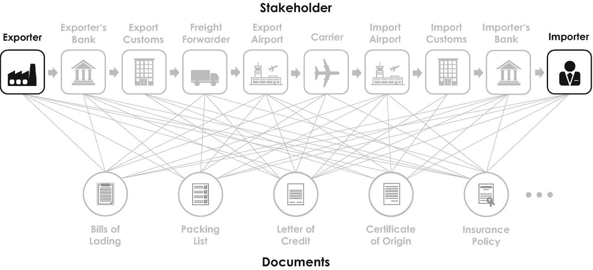

# 代币类型与资产代币化

*安全代币*是最常见的代币类型，代表金融投资，例如公司股份或私营公司股票，这些投资受政府市场监管机构和现有证券法的监管。与传统资产的主要区别在于，从传统证书到加密安全证书的概念性转变、特定的结算流程，以及从传统结算机构和清算所向分布式区块链基础设施的转移。总之，安全代币是受监管的金融产品，为投资者提供保护。此外，它们可以在`P2P`基础上交易，构成股票、债券和其他有价物的部分所有权凭证，提供广泛的市场准入，并作为包括小投资者在内的所有人的资产类别。

*实用代币*是与特定区块链用例相关的数字凭证，赋予其所有者访问相应区块链网络的权利。大多数情况下，公司将实用代币与特定服务关联，例如在网络内启用功能或额外的`DApp`。根据美国证券交易委员会（`SEC`）的规定，实用代币不得具有任何财务激励，即发行方不得向投资者提供任何形式的货币回报。

*支付代币*是像`Bitcoin`和`Litecoin`这样的加密货币，可在区块链项目的生态系统内用作支付方式。支付代币通常拥有自己的区块链，用于记录完整的交易历史。这些代币的唯一目的是支付，因此其应用范围非常广泛。

对于传统资产，例如房地产投资[[30]](#505424_1_En_3_Chapter.xhtml#Par232)或私营公司股票，买卖双方通常必须通过个人人脉和专门经纪人找到彼此，这一过程阻碍了全球贸易和价值转移。*资产代币化*，即传统资产的数字化，允许基于区块链技术实现简单的全球转移和所有权验证，该技术运行在广泛的国际网络上，例如公司的全球供应链。鉴于此类代币化资产透明度和国际性的提高，该领域的倡导者认为，与包括流动性极差的私营公司股票在内的传统资产相比，代币化提供了更高的流动性。此外，代币化资产可以完全在区块链上进行管理，而投资资金、相关货币转账和赎回可以基于智能合约方便地自动执行。代币与智能合约相结合，使得银行和其他（金融）组织内部的（行政）流程能够实现自动化，这就是为什么这一研究领域在过去几年中吸引了极大关注。

## 当前业务应用：交易、支付和共享服务

交易是我们天性的一部分，自从我们的祖先开始在地球上繁衍，并交换在某些地方常见而在其他地方稀有的物品时起便是如此，正如我们从本章引言部分所了解的那样。早期，人们只有在认识并信任彼此时才会进行交易。鉴于全球化的发展，公司和个人几乎不可避免地会与那些我们既未谋面也未曾交易过的陌生伙伴进行交易——试想一下`Amazon Marketplace`、`Alibaba`以及其他在线零售商上的全球卖家网络，我们在那里接触到成千上万的未知专业大型卖家和私人小型卖家。与陌生方交易存在诸多法律、金融和文化风险，这引出了一个可能我们所有人都思考过一段时间的问题：我们能信任一个我们既未谋面也未曾交易过的（海外）交易伙伴吗？

在其持续的商业关系早期，`IBM`和瑞士投资银行`UBS`基于区块链技术探索了在非可信环境下的交易问题，并于 2016 年创建了一个区块链联盟^((72))和在线贸易金融平台。他们的联合平台被命名为“`Batavia`”，为全球贸易提供了一个可信生态系统，作为承担与非可信交易对手方交易风险的一个可行解决方案。不久之后，蒙特利尔银行、`CaixaBank`、德国商业银行和`Erste Group`也加入了该联盟，并帮助建立了一个可访问的国内和跨境交易开放网络，面向全球的公司客户和贸易伙伴[[31]](#505424_1_En_3_Chapter.xhtml#Par233)。后来，`Batavia`与增长更快的平台“`we.trade`”^((73))合并——该平台原名“`Digital Trade Chain`”或`DTC`——由包括德意志银行、汇丰银行、荷兰合作银行、桑坦德银行和法国兴业银行在内的九家欧洲银行于 2018 年创立[[32]](#505424_1_En_3_Chapter.xhtml#Par234)。如今，`we.trade`被宣传为一个银行支持的贸易金融区块链平台，帮助客户：

*   寻找（新的）可信贸易伙伴
*   以简便的方式申请银行融资
*   在不可篡改的分类账上追踪整个交易过程
*   通过智能合约实现支付和交易的自动化与安全化

此外，该平台确保所有相关方都能实时访问其贸易交易信息，从而没有任何个人或中心化方能够单独控制数据。数据实际上是分布在整个网络上的，未经所有其他用户的批准，任何数据都无法被更改——正如我们之前所学，这是区块链技术的关键特征之一。

`we.trade`及类似平台对中小企业尤为有益，因为它们面临明显的市场缺口，许多企业缺乏获得贸易融资的渠道。世界银行估计，高达 50%的中小型组织无法通过任何正规信贷渠道获得融资，这导致全球信贷缺口高达 2.6 万亿美元。近年来，通过将传统金融服务与创新数字技术相结合来缩小这一缺口并为这些企业创造新机会，因此在银行业引起了极大关注。此类银行业务现在被统称为*金融科技公司*，这是对实施基于数字技术的金融创新的总称。

另一家探索基于区块链的银行和交易服务的美国投资银行是摩根大通，该公司与微软 Azure 合作推出了一个智能合约平台。这个开源平台名为 `Quorum`，旨在让金融机构更轻松、更快捷、更廉价地构建自己的区块链应用程序。^(⁷⁴) `Quorum` 基于以太坊协议，并通过 `Aztec-protocol`^(⁷⁵) 进行了扩展，可为任何通用数字资产类别实现机密交易 [33]。与 `Zether Protocol`（Aztec 的功能前身）不同，交易方的账号和账户余额等个人数据也被隐藏和加密，因此此类交易被称为 `零知识交易`。`Quorum` 区块链的独特卖点在于其协议中嵌入了极高的数据保护和隐私要求，能够对整个区块链（包括交易和智能合约）进行高效加密。这一点对于投资银行及其他金融机构尤为重要，因为它们的整个商业模式都建立在信任和保护客户个人数据的基础上，专注于私人价值转移和资产治理。`Quorum` 还采用了一种名为 `QuorumChain` 的非常特殊的共识机制，允许授予某些用户特定的投票权。此外，`Quorum` 还提供了一种名为 `JPM Coin` 的专属加密货币，该币与美元挂钩，因此相比其他无担保加密货币，其价格水平稳定性和波动率都要低得多 [34]。此类由银行背书的硬币被视为加密货币的圣杯，并因其显而易见的原因被称为 `稳定币` [35]。

一些此前并未涉足金融科技领域的公司，例如德国汽车零部件制造商采埃孚（ZF Friedrichshafen），也在探索区块链技术为金融和支付服务带来的机遇。该公司与 IBM 和瑞银集团（UBS）共同创立了德国初创企业 `Car eWallet GmbH`^(⁷⁶)，旨在为包括汽车共享在内的出行服务端到端集成提供金融交易网络。该合资企业还致力于将自动驾驶汽车全面连接到汽车云，使其成为能够通过智能合约自动按需消费和支付停车、充电等出行服务的商业实体。这种由区块链驱动的机器对机器交易，是基于物联网实现传统商业模式数字化转型的绝佳范例。

除了交易和支付服务外，区块链技术也有望影响我们现代的 `共享经济` [36]，它指的是私人个体和利益团体之间对物品的系统性借用。在此背景下，有两个非常有趣的例子值得一提，即两个去中心化、由社区拥有的交通平台 `LaZooz` 和 `Arcade City`。这两家初创公司都利用区块链技术构建点对点的拼车网络，用以管理司机和用户之间的直接交互。这种方法有时被称为 `平台合作主义`，因为用户既是平台的贡献者，也是其贡献平台的股东。另一个非常有趣的例子是免费在线市场 `OpenBazaar`。与亚马逊和 eBay 类似，`OpenBazaar` 允许用户注册商品，并向连接到网络的其他用户进行推广。但由于 `OpenBazaar` 利用区块链技术让买家和卖家直接互动，无需任何中心化中间商，因此它实现了零交易费和零平台费。只有当双方之间出现（法律）问题时，网络才需要第三方调解方介入，以决定是否放行付款。

### 当前商业应用：供应链管理与物流

除了交易平台和支付服务之外，区块链技术的另一个非常流行的商业应用是`供应链管理` [37]。在贸易日益全球化的推动下，供应链在过去几年中变得非常复杂，并涉及位于不同国家的众多利益相关者。除了出口商和进口商，国际供应链通常还涉及托运人和货主、银行和保险公司、货运代理、多式联运运营商、海运和空运承运人、港口和码头运营商以及海关当局等。为了推进其特定服务，每一方都需要并签发某些文件，这些文件需要发送给供应链中的特定方，以成功通过特定的运输节点，例如图 3-6 所示。

例如，一辆电动汽车包含大约 6,000 个不同的零件，由数百家国际供应商和分包商制造。每个供应商都需要提供某些文件，例如用于会计核算和质量控制的文件，以确保整个供应链和制造过程的透明度和可追溯性——鉴于全球关于二氧化碳和其他对环境有害排放物的可持续发展目标，这一点变得越来越重要。区块链技术可以帮助管理、简化和优化这种复杂的全球网络。这对于全球运营的企业尤其重要，例如汽车制造商及其供应商，他们需要找到经济高效且实用的解决方案来有效管理日益复杂的供应链，同时遵守监管可追溯性要求。

区块链驱动的供应链管理系统最著名的例子之一是开放的数字航运平台“TradeLens”，该平台由 IBM 和全球最大的集装箱航运公司 A. P. 穆勒-马士基集团 [38] 共同实施。这个协作平台连接了全球范围内参与集装箱运输的所有相关利益相关者。整个供应链上的定制权限模型规定了谁可以添加、查看和更新特定信息，例如装箱单、提单、发票以及运输过程每个阶段不同利益相关者所需的其他证书。TradeLens 提供各种工具，用于资产规划和利用、海关清关经纪、日程安排和风险评估等，并收集用于贸易融资和保险的实时信息。由于其更高的透明度，TradeLens 区块链允许不同的利益相关者端到端地优化和简化他们的供应链，摆脱基于纸张的传统工作流程。此外，它还允许更高的可预测性，从而可以显著降低安全库存和资产。据报道，该平台目前每周处理约一千万个事件和超过 100,000 份文档 [38]。这种方法潜力巨大，因为任何时候都有超过 1500 万个集装箱在国际水域中运输或等待清关。食品行业也采用了类似的方法，以提高货物在整个供应链中的可追溯性，以便在出现健康或安全问题时，不同的利益相关者能够迅速做出反应 [39]。^(⁷⁷)

图 3-6

典型的国际供应链，展示了最重要的利益相关者（顶行，方块）以及在流程中签发和交换的选定文件（底行，圆圈）。请注意，顶行中从左到右的水平箭头不表示货物的物理流动，而是表示运输过程的方向

德国汽车制造商宝马最近宣布了其基于区块链技术的“PartChain”供应链管理系统，该系统源于一个成功的购买前大灯的数字试点项目 [41]。PartChain 扩展了这种方法，并将其扩展到更多的国际供应商，以确保关键和安全相关的汽车零部件及原材料的无缝可追溯性——从矿山到冶炼厂的全过程。宝马的愿景是“创建一个开放平台，允许供应链中的数据在整个行业内安全、匿名地交换和共享” [42]。由于通用标准和控制模型对于此类平台的成功推广至关重要，宝马还于 2018 年共同创立了跨行业倡议 MOBI，即移动出行开放区块链倡议，该倡议汇集了全球 120 家领先的汽车、移动出行和技术公司。^(⁷⁸)

### 当前商业应用：消费品防伪

区块链技术的另一个非常有趣的应用是密码学溯源平台，代号为“Aura”，目前由法国奢侈品牌集团 LVMH 酩悦·轩尼诗-路易·威登与微软 Azure 以及美国区块链设计工作室 ConsenSys [43] 联合开发。据称，Aura 将基于以太坊区块链提供强大的产品跟踪和追溯工具。这些工具允许消费者通过访问产品从原材料到最终销售点（包括二手市场）的端到端历史记录来验证其产品的真实性。Aura 旨在涵盖价值链中的所有专业参与者，包括原材料矿商、制造商和分销商、金匠以及其他高度专业化的服务提供商。通过提供防欺诈的真实性证明，Aura 致力于有效且有针对性地打击近来在二手市场上日益增多的假冒伪劣产品的大规模生产。在该项目的第二阶段，该联盟旨在探索保护创意知识产权以及适用于奢侈品行业的其他应用。

### 当前商业应用：能源商品平台

区块链技术在能源领域也有有趣的应用，这些应用大多与支付服务相关。例如，德国科技集团西门子和英荷石油天然气公司壳牌都投资了美国初创公司 LO[3] Energy。LO[3] 与当地公用事业公司和零售商合作，提供了一个名为“Pando”的基于区块链的社区能源平台。这个本地能源市场汇集了风能、太阳能等本地分布式能源资源，从而使客户能够买卖能源，同时自动在社区层面优化电网的利用。^(⁷⁹)

#### 当前商业应用：政府服务

在本研究过程中，我还了解到中国综合性企业腾讯、中国信息通信研究院与深圳市税务局之间另一项有趣的合作，它们共同探索区块链技术在税务领域的应用 [44]。这项合作旨在创建并确立一种基于区块链的发票标准，从而支持实现自动化税务或*电子税务*系统，以简化审计流程、减少逃税行为并避免双重征税。^(⁸⁰) 该基础标准是作为名为“基于分布式账本技术发票通用框架”的总体项目的一部分而制定的，该项目得到了包括英国、瑞士和瑞典在内的多个国家的支持。这只是一个非常有趣的例子，展示了区块链技术如何用于自动化传统且以往基于纸张的政府流程和服务。

#### 当前商业应用：区块链联盟

由于行业中的大多数区块链应用都是侧重于形成协同网络的协作方式，因此各类组织开始在不同的区块链*联盟*中开展合作。迄今为止，全球已建立了超过 40 个不同的联盟，它们或侧重于业务，或侧重于技术。第一类联盟针对特定的业务问题，例如供应链管理或支付服务；而第二类联盟则致力于开发可重复使用且标准化的软件模块，供联盟成员用于构建自己的区块链应用。一些联盟同时涵盖这两类活动，例如美国公司`r3`，它运营着一个名为“Corda”的区块链平台。全球区块链联盟的精选（非全面）列表如表 3-5 所示，供您参考。^(⁸¹)

**表 3-5**

旨在促进区块链技术在商业中更广泛应用的精选国际联盟。牵头公司以斜体表示，区块链平台名称相应置于括号中。本概览部分基于文献 [45–47]。

| 名称 | 精选成员（区块链平台） | 联盟范围 |
| --- | --- | --- |
| `Corda` | `r3` (`Corda`)、安联保险、西班牙对外银行、法国巴黎银行、荷兰国际集团、英特尔、马士基、微软、纳斯达克、西门子、州立农业保险、瑞银集团 | 寻求在商业中（例如支付服务）更广泛应用区块链技术的开源平台 |
| `eTradeConnect` | `香港金融管理局` (`Hyperledger`)、中国农业银行、法国巴黎银行、星展银行、汇丰银行、中国工商银行、渣打银行 | 旨在提高国际贸易融资效率的贸易融资平台 |
| `FoodTrust` | `IBM` (`Hyperledger`)、金州食品、雀巢、沃尔玛 | 通过追踪食品原料和货件的来源以查明食品安全事件，从而提高食品安全性 |
| `GSBN` | `CargoSmart` (`Hyperledger`)、达飞轮船、中远海运集运、中远海运港口、赫伯罗特、和记港口、东方海外、青岛港、新加坡国际港务集团和上海国际港务集团 | 为供应链上的所有利益相关方提供安全可信的数据交换平台 |
| `komgo` | `ConsenSys` (`Quorum`)、荷兰银行、法国巴黎银行、花旗银行、荷兰国际集团、荷兰合作银行、法国兴业银行、壳牌 | 大宗商品交易后处理平台 |
| `Marco Polo` | `r3`、`Tradeix` (`Corda`)、法国巴黎银行、德国商业银行、戴姆勒、黑森州立银行、荷兰国际集团、巴登-符腾堡州立银行、国民西敏寺银行、渣打银行 | 贸易融资区块链网络 |
| `MOBI` | `IBM`、`MOBI` (`Hyperledger`)、埃森哲、宝马、博世、电装、福特、通用汽车、本田、现代、雷诺、采埃孚 | 实现通行费、停车费及其他车辆支付的自动支付 |
| `TradeLens` | `IBM`、`马士基` (`Hyperledger`)、APM 码头、现代货箱码头、哈利法克斯港、新加坡国际港务集团、Seaboard | 用于简化和管理国际供应链的开放数字航运平台 |
| `Quorum` | `摩根大通` (`Quorum`)、ConsenSys、瑞信、荷兰国际集团、微软 Azure | 用于简化交易和数字支付的开源智能合约平台 |
| `Voltron` | `r3`、`Crypto BLK`、`贝恩公司` (`Corda`)、盘谷银行、西班牙对外银行、法国巴黎银行、中国信托商业银行、汇丰银行、国民西敏寺银行、加拿大丰业银行、瑞典北欧斯安银行 | 信用证数字化 |
| `we.trade` | `IBM` (`Hyperledger`)、德意志银行、凯克萨银行、德国商业银行、奥地利第一储蓄银行、汇丰银行、比利时联合银行、法国外贸银行、北欧银行、荷兰合作银行、桑坦德银行、法国兴业银行、瑞银集团、意大利联合信贷银行 | 由银行支持的贸易融资区块链平台 |

### 3.3.3 更多应用场景

区块链技术还被提出用于一些尚未实施的场景。其中大部分涉及现代社会的核心领域，例如政府服务、法律和医疗保健。以下简要介绍最重要的潜在应用场景。

### 潜在应用场景：政府服务

现代政府提供种类繁多的公共与民用服务，涉及多个官方机构，包括市政厅登记处、社会福利机构，以及援助和税务部门。根据您的具体国家和城市，与这些服务相关的官僚流程和内部运作可能相当繁琐，且整体运营成本高昂。根据欧盟委员会最近发布的一份报告，`区块链`技术非常适合应用于此类政府生态系统，因为它“[...]可以减少官僚主义，提高行政流程效率，并增强公众对公共记录保存的信任度”[48]。正因如此，`区块链`技术及其促进不同公共机构、公民和经济主体之间直接、可信交互的能力，已经吸引了全球多个政府的关注。目前分别在公共和政府部门推进的`区块链`实验清单可在[49]中找到。

`区块链`技术在政府服务中一个特别有趣的应用是投票。大多数国家仍然通过纸质选票进行政府投票，尽管在我们这个日益互联的社会中，这些本应利用最先进的数字技术在线完成。但由于对安全和数据保护的担忧，这种电子投票或`e-votings`至今仍受到抵制。`区块链`技术可以通过提供防篡改、不可篡改且透明的投票记录来解决选民欺诈问题。基于`区块链`的电子投票的另一个优势是，人们可以舒适地在家中进行投票，这有望提高投票率，同时显著减少政治冷漠。

另一个非常流行的应用是数字身份，它有时可以替代政府签发的身份证，并授权访问各种政府在线服务和网站。此处的`数字身份`可以被视为一个代表个人和组织的个人信息在线记录。目前，这些数据掌握在无数在线平台和移动应用程序手中，包括`Google Gmail`、`Amazon`、`Facebook`等。这可能相当成问题，因为运营这些应用的集中式实体越来越容易受到身份盗窃、数据泄露或仅仅是数据滥用的影响。基于`区块链`的数字身份可以通过将数据的控制权和所有权交还给用户和合法所有者来避免这些问题，这种方法有时被称为`自我主权身份`。在这种情况下，个人拥有一个加密的数字中心，可以安全地存储个人可识别信息。此外，它允许个人通过仅在需要时授予访问权限来控制谁可以访问数据。从社会经济学的角度来看，这尤其有趣，因为它将“失去”了数字主权给数字平台和跨国公司的个人，重新置于对其个人数据及其利用的控制之下。`自我主权身份`还可能允许营销人员通过向消费者提供定制优惠和奖励，以换取他们与相应营销人员共享个人信息，从而直接与客户建立更好的关系——营销人员将直接为消费者的关注付费[50]。此外，更重要的是，这种身份可能促进联合国开发计划署雄心勃勃的第 16 号目标，该目标旨在到 2030 年“为所有人提供法律身份，包括出生登记”[51]。

### 更多应用场景：法律

另一个前瞻性应用案例是基于`区块链`的`土地所有权登记册`。这样的账本将允许公民向相应的服务大厅、融资机构或公证处提交安全的在线请求，以申请登记或验证土地所有权摘要。一旦该请求获得授权且网络批准了价值转移，相应的机构就可以相应地更新土地所有权登记册上的所有权。此登记册很可能以私有许可型`区块链`网络的形式实施，通过其固有的加密和哈希算法保证所有土地所有权和不动产转移的完整性。与传统的纸质土地所有权管理相比，这种基于`区块链`的解决方案允许公民和机构只需在线检查土地所有权是否合法。当然，这个概念可以应用于任何防欺诈的公证流程，例如涉及存储和验证数字化文件（如合同、婚姻协议和遗嘱）的流程。

`区块链`技术对于管理`知识产权`（IP）权利以及专利律师和法院的业务也具有显著的价值增值，因为它有助于实现一个平台，用于准确记录这些资产的所有权。关于创意或专利的起源和所有权的法律纠纷，可以通过将当事方引向防篡改的`区块链`来轻松解决，该区块链会为上传的数据添加时间戳，并准确指示有争议的创意是在何时由何人记录的。这种实施方案可以为知识产权持有人提供更强的能力，以保护其知识产权资产免受包括专利流氓在内的侵权者的侵害，同时简化所涉及的不同机构和利益相关者的底层行政流程。

### 更多应用场景：医疗保健

记录我们病史（包括任何疾病和手术）的健康记录，可能是关于我们最有价值且同样敏感的个人信息。每当我们咨询医生时，我们必须分享这些信息或至少其中一部分，以便他能够为我们提供有效的治疗或医疗保健解决方案。如今，我们的医疗数据通常包括各种纸质文件，如医疗评估、报告和检测证明，这些文件容易被未经授权的复制和伪造。`区块链`技术可以通过作为一个加密且防篡改的账本，不可篡改地存储患者的这些记录、诊断和药物，来帮助缓解这些问题。该网络可以配备一个精细的权限系统，允许患者单独控制哪位医生可以访问哪些医疗数据。它甚至可用于解决医疗供应链中的假药问题，通过基于在整个价值链和供应链的每个阶段记录的信息来验证药品的真伪。

前面讨论的当前和前瞻性应用案例令人信服地表明，`区块链`技术是一种用途非常广泛的数字技术，可以应用于现代经济和社会的所有部门，以优化现有业务机会并创造新的商机。因此，它是推动公共和私营组织数字化和数字化转型的绝佳工具。

### 3.4 关键要点

*   区块链是一种分布式账本技术，也是一种现代化的记账方式，可用于存储数字信息。其底层数据结构具有不可篡改、仅可追加、可追溯、可信赖、防篡改、可扩展、自我调节、有序且安全的特点。
*   区块链技术允许任意两方或多方在不依赖中介的情况下达成协议、进行交易、转移价值、验证身份、建立信任，并执行其他对当今商业活动至关重要的管理任务。例如，这些任务包括交易、签约、清算、结算、记录保存，以及借入、存储和出借有价值的数字资产。
*   区块链技术建立在多种支持性技术之上，例如分布式点对点网络、加密哈希函数、默克尔树、数字签名和公钥密码学。
*   通过提供单一的事实记录，区块链独特的数据结构在不可信的环境中部署了信任机制，允许互不相识、互不信任的人们在没有任何第三方中间人或中介的情况下进行交易。这就是为什么区块链技术有时被称为“终极信任机器”。
*   这种交易通常涉及具有货币或非货币价值的数字信息的转移。区块链交易中的信息通常存储在币（数字货币）或代币（数字资产）中。
*   区块链技术在公共和私营部门都有广泛的应用。最流行的应用是加密货币，例如比特币和以太坊。比特币的交易过程按七个步骤组织：（1）形成交易消息，（2）广播交易文件，（3）通过比较数字签名授权交易，（4）汇集交易并形成区块，（5）广播新区块，（6）通过工作量证明验证新区块，（7）将该区块添加到区块链文件中。
*   除了加密货币和众筹之外，区块链的应用还包括交易和支付服务、供应链管理系统、反欺诈检测、交易平台、身份和声誉管理、保险和风险管理，以及包括公证、审计和税务服务在内的政府服务。

### 3.5 区块链技术框架

您是否正在考虑在您的组织中使用区块链技术，或将其应用于您的特定用例？如果以下实施清单中大多数关键问题的答案是“是”，那么区块链技术很可能有助于您实现自己的商业构想或用例。

1.  您的用例是关于什么的？您的用例是否属于以下通用类别之一？ 是 □ 否 □
    *   审计
    *   资产跟踪
    *   价值交易
    *   加密货币
    *   身份管理
    *   业务流程自动化
    *   所有权/作者身份证明
2.  是否存在可以很好自动化的现有业务或交易流程？ 是 □ 否 □
3.  在您的流程或价值链中，是否存在多个可信或不可信的利益相关方？ 是 □ 否 □
4.  是否存在一个通常负责协调不同数据（即对账）的中心化中间人或信任中心？ 是 □ 否 □
5.  是否存在货币或非货币的价值转移？ 是 □ 否 □
6.  实施不可变的记录或登记册是否有价值？ 是 □ 否 □
7.  您的业务或内部流程是否需要高水平的数据完整性，或者是否能从中受益？ 是 □ 否 □
8.  实施您的构想所需的数据是否非常宝贵且独特？外部人员是否有（经济）动机去破坏或歪曲这些数据？ 是 □ 否 □
9.  您是否具备在组织中应用区块链技术所需的所有人力资源（例如，项目经理和代码编写人员）？ 是 □ 否 □

规划实施时需考虑的更多问题：
*   在实施您的区块链时，您需要遵守哪些监管框架？
*   您的用例是允许使用公有区块链，还是需要私有部署？
*   该区块链能否集成到您现有的 IT 基础设施中，还是需要额外的计算资源？
*   谁需要运行和维护不同的节点？
*   预期谁会使用该应用程序，他们有什么期望？

### 3.6 延伸阅读

在本章末尾，如果您想更深入地了解区块链技术及其应用，我想为您提供一些延伸阅读的建议：

*   Drescher, D.：《区块链基础：25 步非技术性入门》。Apress 出版社（2017 年）。
*   Shrier, D. L.：《区块链基础：它是什么以及将如何改变我们的工作和生活方式》。Robinson 出版社（2020 年）。
*   Bashir, I.：《精通区块链（第二版）：分布式账本技术、去中心化和智能合约详解》。Packt 出版社（2018 年）。
*   CoinDesk. [`www.coindesk.com/tag/blockchain-reports/`](https://www.coindesk.com/tag/blockchain-reports/)
*   Cointelegraph. [`www.cointelegraph.com/`](https://www.cointelegraph.com/)

