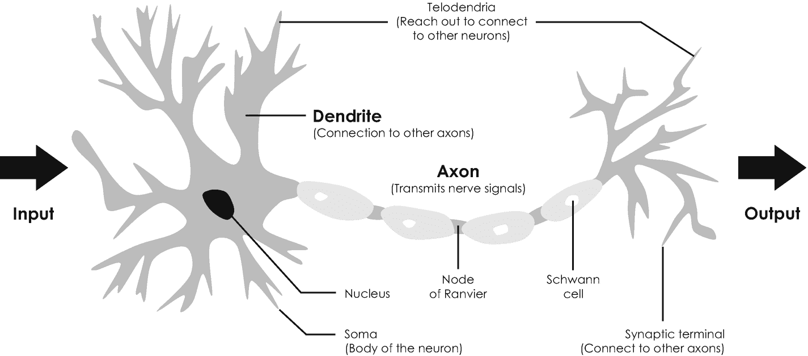

# 4. 人工智能

人工智能（`AI`）是本书介绍的最具多功能的数字技术，也是当今媒体中最常使用的流行语之一。它常与机器学习、神经网络、大数据和深度学习等相关术语一同使用，这些内容我们也将在这章中讨论。我们将看到，人工智能在现代商业和社会的各个领域都提供了广泛的应用。

与量子计算和区块链技术不同，人工智能不需要任何昂贵的硬件和昂贵的 IT 基础设施，因为它的大部分优势已经可以在合理的时间范围内，通过现有的计算硬件和开源软件实现。这就是人工智能成为推动数字化转型最流行的数字技术的原因。在过去的几年里，它几乎已经渗透到所有行业，因此两位美国经济学家埃里克·布林约尔松和安德鲁·麦卡菲正确地指出：“我们这个时代最重要的通用技术是人工智能”[2]。根据麦肯锡公司的预测，到 2030 年，人工智能将创造 13 万亿美元的 GDP 增长[1]，其中大部分将来自非互联网行业，例如制造业、能源、农业和物流。但是，即使其经济和社会意义无可争议，其运作方式和能力仍然普遍被误解。虽然高管们常将其视为我们时代最重要的颠覆性技术，但员工们则经常担心它会破坏就业，并因此对它嗤之以鼻。

本章将帮助你屏蔽所有这些噪音，理解人工智能的基本运作原理和最重要的应用。我们将首先回顾这项激动人心的技术的丰富历史，并着重介绍最重要的历史里程碑和研究项目。这一回顾将表明，人工智能是机器学习和深度学习这两个子类别的总称，每个子类别都有特定的用例和应用。我们将讨论人工神经网络作为深度学习以及其他一些强大概念的组成部分，这些概念目前仍是全球学术研究的重点。在本章的第二个部分，我们将审视这项技术的机遇与局限，并了解其最重要的用例和应用，范围从艺术和工业设计，到药物发现，再到自动驾驶。与前两章类似，本章也会为你提供一个易于使用的框架，让你能够评估人工智能是否可能为你自己的用例或应用（你在阅读本书时可能心中已有想法）增加价值。

## 4.1 设定人工智能的背景

在我们深入探讨这项迷人数字技术的波澜壮阔的历史之前，退后一步并问问自己，我们实际上会如何定义与人工智能相对的**自然**或**人类**智能，这是有益的。对于这类语言问题，《牛津学习词典》总是一个好顾问，它将智能定义如下：智能是“学习、理解并以逻辑方式思考事物的能力；以及做好这件事的能力。”人工智能的相应定义是：“一个研究如何让计算机模仿人类智能行为的研究领域。”换句话说，人工智能模仿人类行为，使机器能够像人类一样推理和行动。这就是为什么科幻小说将类人机器人和自主机器人的到来设想为未来一个可怕的景象。从历史上看，科幻小说对于理解新技术对商业和社会的影响及意义一直至关重要。因此，人工智能及其前身概念在科幻文学中引起了极大关注也就不足为奇了，例如在俄裔美国生物化学家、作家艾萨克·阿西莫夫于 1950 年出版的有影响力的故事集《*我，机器人*》中。你可能也知道 2004 年由二十世纪福克斯发行的这部小说的传奇大片改编版。广阔的前景和巨大的潜力是人工智能被研究数十年并仍然是现代计算机科学和信息技术中最深奥的课题之一的两个主要原因。

由于人工智能旨在模仿人类的智能行为，简要了解一下我们的大脑如何处理信息是有益的。我们的大脑由超过 860 亿个神经细胞组成，即所谓的*神经元*，它们相互连接形成一个非常庞大的*神经网络*。神经元处理由我们的感觉器官（例如检测光线的眼睛或感知声波的耳朵）产生的电信号中编码的信息。我们看到的光和我们听到的声音会触发某些化学反应，从而产生电信号。^（^（82））^ 然后，这些信号通过构成我们中枢神经系统的神经束，从我们的感觉器官传递到我们的大脑。神经束是由所谓的*轴突*束组成的，这些轴突由某些专门的神经细胞（即所谓的*施万细胞*）构成，擅长在长距离传输电信号——人类轴突的总长度实际上可以达到一米。神经束末端的*突触终端*将电信号引导至图 4-1 中示意性显示的实际神经元中。一旦这个信号的强度达到某个阈值电压——即所谓的*激活电位*——该神经元就被称为“被激活”，并通过其树突和更细的*终末树突*将信息传递给网络中的其他神经元。这些神经元随后会根据它们各自的激活电位被激活或不激活。根据我们感觉器官的某个视觉刺激激活了广泛分支网络中的哪些神经元，我们将这种激活模式与一个具体的物理对象（例如房屋、汽车或书籍）关联起来。我们大脑中这种高度简化的神经网络模型，启发了计算机科学及相关学科的众多研究人员开发人工神经网络，我们将在下文看到这一点。

**图 4-1**  
单个神经元的示意图。电信号在左侧被接收，转换为输出信号并沿轴突传送到右侧，终末树突在此处连接到其他神经元（未显示）

