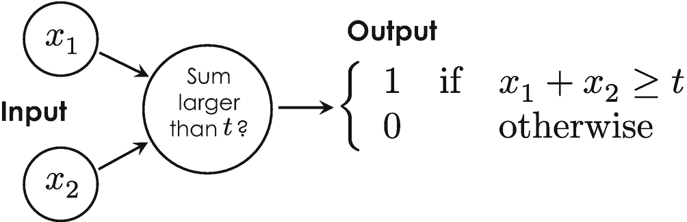

# 神经生物学与信息论的共生

人工智能的早期历史与一门诞生于 20 世纪 40 年代、名为控制论的科学学科密不可分。从词源学上讲，这个术语源于希腊语单词 *cybernētēs*，意为舵手、管理者、飞行员或船舵，因此控制论可以被译为“舵手之术”。^(⁸³) 在科学领域，*控制论*指的是对神经生物学与信息论之间联系的系统性研究。它也常被称为一门基于*反馈循环*来控制和调节机器的科学，类比于生物体通过其感觉器官以及彼此间的社会交流来接收反馈。这一有趣研究领域的先驱是美国数学家兼哲学家诺伯特·维纳，他在 1948 年将控制论定义为“对动物和机器中控制与通信的科学研究” [3]。尽管他名为《控制论：或动物与机器中的控制与通信》的著作是一部充满复杂数学方程的学术性作品，但它一经出版便立即成为畅销书，并登上了《纽约时报》畅销书排行榜。控制论最重要的任务之一是实现过程的自动化，包括复杂系统中的自我调节。控制论后来衍生出了“赛博”这一缩写词，如今它被用作与计算机创造的虚拟现实相关的各种语境中的前缀，例如赛博空间和赛博安全。

最早的控制论模型之一由美国神经生理学家沃伦·麦卡洛克和逻辑学家沃尔特·皮茨于 1943 年提出 [4]，该模型常常与当时弗洛伊德心理学的传统观念相悖，并因此被称为`麦卡洛克-皮茨神经元` [4]。该控制论模型最基本的版本如图 4-2 所示。它处理两个二进制输入值，记为`x[1]`和`x[2]`，将其相加，并提供一个二进制输出值，该值可以是 1 或 0，取决于输入之和`x[1] + x[2]`是否等于或大于某个阈值，该阈值是一个整数，记为`t`。类比于生物神经元，这个阈值对应于激活电位，并决定一个神经元是否被激活。如果你回顾表 1-1 中 AND 函数的真值表，就不难验证阈值`t = 2`的`麦卡洛克-皮茨神经元`代表了一个经典的逻辑与门。其他经典逻辑门可以通过相应调整阈值来实现。这个控制论模型与生物神经元之间的相似性惊人：两种神经元都处理多个输入，并根据特定的阈值将其转换为单一输出。这种类比表明，我们大脑的基本运算可以用经典的逻辑门（如与门、或门和非门）来建模，这一点在原则上已经被证实——这难道不令人惊讶吗？

## 神经元

神经元是人脑的基本构建单元。它们是电可兴奋细胞，处理电输入信号并将其转换为电输出信号。机器学习中使用的人工神经元模拟了这种行为，并被用于构建人工神经网络。

这可能是沃伦·麦卡洛克和沃尔特·皮茨最重要且同样引人入胜的发现，也是他们 1943 年那篇题为《神经活动中内在思想的逻辑演算》的开创性论文能引发全球如此广泛关注的原因 [4]。1949 年，加拿大心理学家唐纳德·赫布观察到，一个神经元的不同输入不能被同等对待，因为其中一些输入比其他输入更为重要 [5]。因此，他引入了`突触权重`的概念，这一概念后来被称为`赫布理论`。

早期控制论与信息论的另一个非常重要的贡献来自英国博学家艾伦·图灵，我们在第 1.4.2 节讨论`图灵机`时就已认识他。1950 年，艾伦·图灵指出，人类利用信息和推理来解决问题并做出决策。因此，他想知道机器是否也能做同样的事情。为此，他在其著名论文《计算机器与智能》 [9]中提出了构建智能机器的制造手册以及测试其智能的概念。后来，为了纪念他，这个测试被称为`图灵测试`，它至今仍被用于测试机器展现智能行为的能力，并将其与人类进行比较。图灵测试本质上是一个三人游戏：一个是被测试的计算机或系统，另外两个是人类。其中一位人类玩家（即测试中的评估者）会提出开放式问题，并旨在从另外两个玩家中识别出人类玩家。如果评估者无法在不见面的情况下做出判断并识别出人类玩家，那么这台计算机或机器就被认为是智能的。



```
图 4-2 具有两个输入 `x[1]` 和 `x[2]` 的`麦卡洛克-皮茨神经元`的基本电路图。如果输入之和大于或等于阈值`t`，则结果等于 1，否则为 0。
```