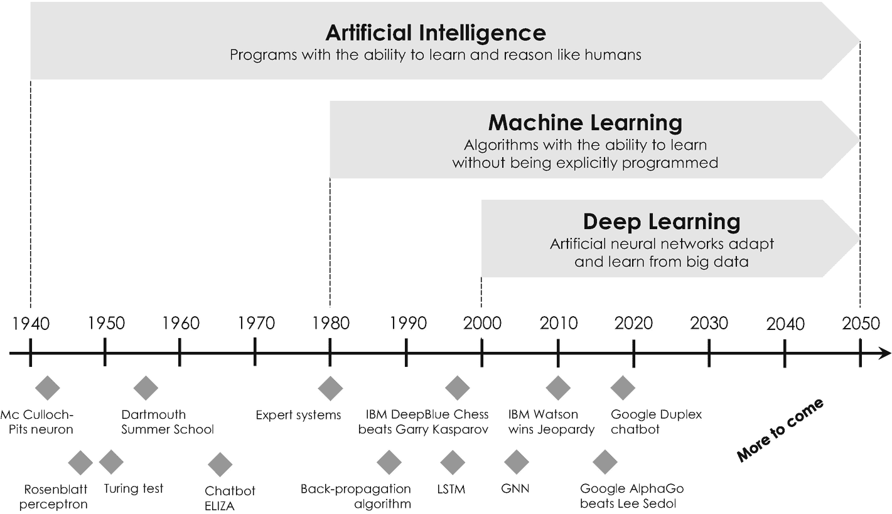

# 图灵测试及其哲学意涵

图灵测试很快在科学界引发了争议性讨论，部分科学家认为该测试可能被操纵。其中最著名的批评者是美国哲学家约翰·塞尔，他于 1980 年设计了一个思想实验来揭示图灵测试的缺陷[10]。该实验被称为`中文房间`，描述了两位人类参与者：一位中文教师和一位中文学习者。实验中的学习者鲍勃坐在封闭房间里，手边有几本包含简单规则的指南，用于将中文字符翻译成英文。房间外是名叫爱丽丝的教师，她通晓中文，以数字方式向鲍勃提交不同中文字符并要求其翻译。经过一段时间的训练后，实验结束，爱丽丝将收到鲍勃提供的准确译文。现在假设鲍勃创建了一个能够翻译中文字的智能计算机程序。约翰·塞尔认为，这个计算机程序不能被证明具有智能并理解中文，因为编写该程序的鲍勃本人完全不懂这门语言。因此他断言，任何计算机都无法拥有人类所不具备的东西——这似乎是一个合理论证，说明我们可能无法实现约翰·塞尔所称的超越人类智能的`强人工智能`。所谓强人工智能（也称通用人工智能），他指的是“一台具有适当输入输出的编程计算机，其拥有心智的方式与人类完全相同”[10]。而`弱人工智能`则指仅为特定任务设计、无法解决未经训练任务的计算机或程序。从历史角度看，约翰·塞尔的研究是对数学家约翰·麦卡锡一年前开创性论文《将心理属性赋予机器》的回应，该论文提出了相反观点[11]。这场关于人工智能哲学意涵的争论至今未决，并催生了名为`伦理 AI`的新研究领域——遗憾的是这已超出本书范围。

## 图灵测试

图灵测试是评估计算机智能思维与行为能力的应用最广的科学方法。

## 4.1.2 开启一切的会议

常与艾伦·图灵并称为“人工智能之父”的约翰·麦卡锡，其职业生涯比约翰·塞尔早开始数年。在普林斯顿与斯坦福大学短期任职后，他成为著名的达特茅斯学院（美国九所最古老大学之一）数学助理教授。在达特茅斯期间，他受 IBM 首台科学大型主机“IBM 701”的设计者纳撒尼尔·罗切斯特邀请[12]，于 1955 年夏季在纽约波基普西的 IBM 罗切斯特信息研究部工作。此后，两位科学家说服信息论之父克劳德·香农与当时哈佛大学数学与神经学初级研究员马文·明斯基，共同在达特茅斯学院组织研讨会。他们的资助提案[13]提交至洛克菲勒基金会并最终获批，于是具有里程碑意义的“达特茅斯夏季人工智能研究项目”于 1956 年夏季进行了六周。11 位参与者中包含三位计算机科学家艾伦·纽厄尔、克里夫·肖和赫伯特·西蒙，他们在同年早些时候演示了传奇性的“逻辑理论家”——这是智能计算机程序的首个真正概念验证。^( ⁸⁴ ) 在这次会议上，约翰·麦卡锡首次提出“人工智能”一词，并后来给出选择该词的兩个主要原因：其一，他希望将达特茅斯夏季项目成果与他此前关于`自动机理论`的数学研究区分开来；^( ⁸⁵ ) 其二，他想避免与控制论及其对模拟反馈的关注产生任何关联，他认为这种关注存在偏差。遗憾的是，会议未达其预期，议程在某种程度上更偏向愿景而非实践。但更重要的是，这次开创性会议催化了此后 20 年的人工智能研究。

1956 年至 1974 年间，受计算机快速同步发展的推动，人工智能成为科技界最热门领域之一。在传奇的达特茅斯夏季项目两年后，美国计算机科学家兼心理学家弗兰克·罗森布拉特受艾伦·图灵和唐纳德·赫布开创性工作的启发，对麦卡洛克-皮茨模型进行了如下改进：他引入了两个突触`权重`——用`w[1]`和`w[2]`表示的两个十进制数——使其能根据赫布理论，依据两个不同输入值的重要性对其进行增减。数学上，弗兰克·罗森布拉特将麦卡洛克-皮茨模型中的输入之和`x[1] + x[2]`替换为加权和`w[1] · x[1] + w[2] · x[2]`。与麦卡洛克-皮茨模型相比，他的模型多了两个可单独设置与调优的自由参数，因此其概念更灵活、更适合模拟人类智能。在其开创性论文《感知机：大脑中信息存储与组织的概率模型》中，他将此概念称为`感知机`[6]，该概念至今仍是构建人工神经网络的概念基础，也是对这个高度活跃研究领域最重要的贡献之一。《纽约客》称感知机为“非凡的机器”[7]，《纽约时报》则盛赞：“海军今日展示了电子计算机的雏形，预计它将能行走、交谈、观看、书写、自我繁殖并感知自身存在”[8]。

随着计算机能够存储越来越多的信息，速度更快、成本更低、在学术界更易获取，人工智能接连蓬勃发展。早期的演示，例如由艾伦·纽厄尔和赫伯特·西蒙开发的名为“通用问题求解器”的模拟程序，在解决人类问题的目标上显示出巨大潜力。另一个颇具娱乐性和交互性的软件程序是`ELIZA`，这是一个自然语言对话程序，旨在展示人机交流的表面性。该程序由德裔美国计算机科学家约瑟夫·维森鲍姆于 1966 年创建，基于一种称为*模式匹配*的技术[14]。在这种方法中，程序会检查输入序列中是否存在（或缺少）某些文本成分或模式，生成相应的回答，并让用户产生程序能理解他们的错觉。^(⁸⁶)

`ELIZA`和其他成功的研究项目激励了开创性的达特茅斯夏季研讨会的组织者之一马文·明斯基，他在 1970 年告诉《生活》杂志：“[...] 在三到八年内，我们将拥有一台具备普通人一般智能的机器。”遗憾的是，事实证明他错了，并且在接下来的几年里，对该领域的资助和兴趣迅速降温，部分原因是当时的计算机仍然相对昂贵，其计算能力和内存过于有限，无法处理实质性任务。例如，当时科研的首选计算机`DEC PDP-11/45`的工作内存只能扩展到`128 KB`，比当今智能手机的内存少了`20,000`倍以上。结果，越来越多的学者从对人工智能的乐观态度转向了怀疑。或许最直言不讳的怀疑者是美国哲学家休伯特·德雷福斯，他于 1965 年出版了颇具影响力的著作《炼金术与人工智能》[15]，并于 1972 年出版了《计算机仍不能做什么：对人工智能理性的批判》[16]，阐述了他的观点，即人工智能将远远无法实现其崇高的期望。由于对人工智能的热情在 20 世纪 70 年代初开始消退，从 70 年代中期到 90 年代中期这段时间被称为“AI 寒冬”。

但即使在这个寒冷时期，仍然有一些创新出现。其中之一是 20 世纪 80 年代和 90 年代出现的*专家系统*，其兴起源于这一时期低性能个人电脑的爆炸式增长。专家系统模拟人类专家的决策能力，其基础是一个由简单的`if-then-else`语句构建的大型数据库，^(⁸⁷)这一概念被称为*符号逻辑*，由马文·明斯基此前提出。专家系统有望从职业领域专家（如医生、工程师和律师）那里学习知识。它们将这些知识捕获到数据库中，以解决例如金融或汽车制造中的特定问题，并使更广泛的从业者能够获得这些知识。尽管专家系统通常应用范围狭窄且难以跨业务类别应用，但它们很快变成了一个价值数十亿美元的产业。一个很好的例子是`MYCIN`，这是一个 20 世纪 70 年代中期在斯坦福大学开发的早期用于诊断医疗感染的专家系统[17]。用户需要回答各种问题。配备了超过`600`条规则的`MYCIN`随后通过逻辑推理分析这些答案，识别出导致医学问题的细菌类型，并推荐合适的抗生素，剂量根据患者体重进行调整。`MYCIN`的准确率达到`69%`，并且据称比初级医生更有效[18]。尽管如此，这个程序从未在临床环境中使用过，但它是一个早期专家系统和现代机器学习先驱的绝佳范例。

### IBM 的传奇项目：深蓝与沃森

具有讽刺意味的是，在缺乏政府资助的情况下，人工智能在 AI 寒冬之后再次被两大力量点燃。首先是摩尔定律的实际作用，即计算能力的迅速提升（参见第 1.4.3 节）。其次，互联网的发展引发了从数百万到数十亿消费者数据的爆炸式增长，这些数据突然变得可用，并亟需分析。在经历了十多年专家系统和并行计算的研究与开发之后，IBM 推出了其国际象棋计算机“深蓝”。深蓝配备了`256`个并行处理器，每秒可以检查`2`亿种可能的走法[19]。1996 年，深蓝击败了传奇的俄罗斯国际象棋大师加里·卡斯帕罗夫，登上了各大报纸的头版。据报道，这场备受媒体关注的事件是计算机程序首次击败在位世界象棋冠军，这是向人工智能决策程序迈进的重要一步。然而，深蓝下棋的方式与你或任何其他智能人类截然不同。它只是被编程了定义明确的国际象棋规则和一个明确的目标，即吃掉对手的王。基于这种基于规则的编程，计算机分析了它可能采取的每一种走法以及对手随后可能做出的每一种回应——这种方法最早由美国数学家克劳德·香农在 1950 年描述[20]。通过搜索这个潜在走法的树状图，计算机通常会向前看`8`步到多达`30`步，以在每一轮中选择最佳走法。在当时，规则和逻辑仍然是创造智能机器的最重要元素。

但是，除了规则和逻辑，人类下棋也会追求概念性的想法，例如“控制中心”或“从右侧进攻”，并从经验中学习。想象一下你的孩子正在学习走路，以便更好地理解这一根本性差异。为此，你实际上并不会告诉孩子站起来，适当保持平衡，然后小心地一步一步走。孩子们更倾向于观察父母走路，模仿他们的行为，并基于试错法从自己的经验中学习。如果因失足摔倒而经历的痛苦，会导致相关的突触权重减弱。其他的则通过长期的训练得到加强，孩子最终学会安全地走路。通过写下指令来教孩子走路几乎是不可能的，因为我们拥有的大部分知识都是隐性的，也就是说，我们无法完全解释它。换句话说，我们知道的总比我们能说出来的多，这被称为*波兰尼悖论*，以纪念匈牙利裔英国哲学家、博学家迈克尔·波兰尼[21]。

人类与计算机在学习策略上的这一根本差异，对人工智能研究产生了真正的革命性影响，并催化了范式的转变：从基于规则和逻辑的学习，转向通过训练样例和经验进行数据驱动的学习[22]。这实际上是当今所谓`machine learning`（机器学习）的核心和基础。`Machine learning`这个词由美国先驱计算机科学家`Arthur Samuel`创造，他于 1959 年开发了一款电脑跳棋游戏^⁸⁸，这被认为是第一个机器学习系统。在其影响深远的论文中，他将自己的方法描述为：“……一个研究领域，它赋予计算机无需明确编程就能学习的能力”[23]。实现这一点并非依靠规则和逻辑推理，而是利用统计学和概率论的高级概念来训练系统。这也是为何机器学习更合适的称呼是`statistical learning`（统计学习），因为它完全基于对海量训练数据（或大数据）的统计分析[24]。图 4-3 示意性地描绘了最重要的几类人工智能以及最具历史意义的里程碑事件。

**图 4-3** 人工智能、机器学习与深度学习之间的区别，以及这些学科最重要的历史里程碑（显示在时间轴下方）

从基于规则和逻辑的学习到数据驱动学习的革命性范式转变，也为 IBM 的下一代人工智能“`Watson`”铺平了道路[25]。`Watson`以 IBM 传奇创始人`Thomas Watson`的名字命名，由`David Ferrucci`在`DeepQA`项目中开发，最初设计为一个问答系统。为此，`Watson`配备了 720 个 CPU 和 160 亿字节的工作内存。这个大规模并行超级计算机的数据库塞满了大量数据集，包括整个维基文库、书籍、电影以及其他人类知识来源。基于这个庞大而全面的知识库，`Watson`能够将问题解析成不同的关键词和片段，以查找统计上相关的短语作为答案。该系统同时执行数百个自然语言处理和分析程序，以找到给定问题的一小部分潜在正确答案。然后，`Watson`将这些潜在答案与其数据库进行核对，以确定它们是否有意义，并最终通过文本转语音程序合成的电子语音，口头输出最合理的答案。

2008 年，IBM 代表与传奇美国智力竞赛节目 *Jeopardy!* 的执行制片人`Harry Friedman`进行了沟通，提议让`Watson`与两位 *Jeopardy!* 冠军`Brad Rutter`和`Ken Jennings`进行一场比赛。第一场未经公开的宣传比赛于 2010 年举行，暴露了`Watson`复杂程序的诸多弱点。`Watson`最大的劣势之一是它无法听到对手的答案，因此无法从中学习。为此，IBM 研究团队实现了一个附加功能，使`Watson`能够以电子方式接收对手的正确答案。在解决了这个问题以及其他几个关键问题后，`Watson`逐渐接近了两位 *Jeopardy!* 冠军的竞技水平。`Harry Friedman`曾用“我想我们已经从印象深刻变成了目瞪口呆”来描述这种性能的急剧提升，并最终同意在 2011 年 2 月 16 日安排一场公开的电视比赛。那一天，不可思议的事情发生了：`Watson`击败了蝉联冠军的 *Jeopardy!* 选手`Brad Rutter`和`Ken Jennings`，赢得了 100 万美元的一等奖，而这项比赛长期以来一直被视为智力的象征。IBM——或者更确切地说是`Watson`——实际上将它的奖金等额捐赠给了慈善组织`World Vision`和`World Community Grid`。^⁸⁹

在那场历史性的比赛之后，`Watson`再也没有参加过比赛，但基于一整套机器学习算法的卓越能力，成为了 IBM 机器学习服务的基础，这些服务很快作为按需服务在 IBM 云上提供。随后的几年里，人工智能的研究和发展蓬勃发展，越来越多的公司在广泛的商业应用中启动了自己的项目和计划。

## 4.2 人工智能背后的核心思想

我们简短的历史回顾表明，人工智能是一个非常跨学科的科学领域，建立在数学、计算机科学、神经科学、控制论等多种学科的思想和概念之上。即使该领域的一些非常现代的方法非常复杂，需要掌握诸如矩阵和微积分等高等数学知识，但大多数算法及其应用背后的基本思想，可以通过下面介绍的两个主要概念来描述。

