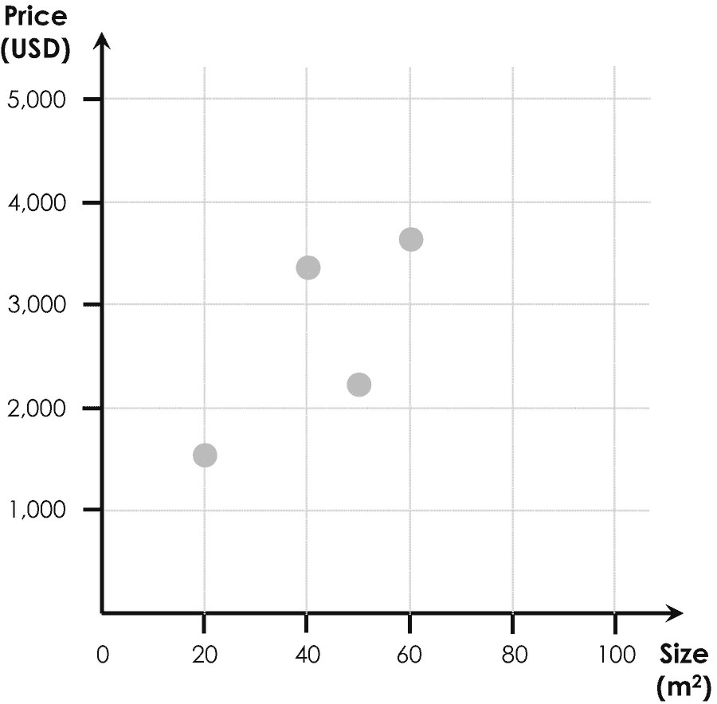
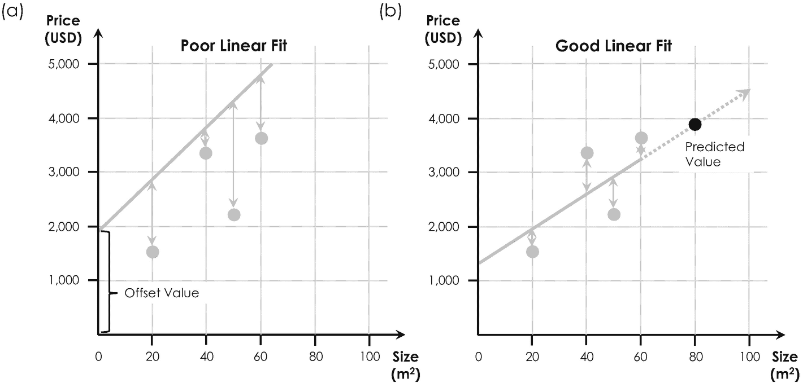

# 4.2.1 代价函数

第一个概念是**代价函数**。为进一步说明，设想你将搬往另一个城市，比如位于传奇硅谷中心的旧金山——这里是数字技术的摇篮，也是美国众多互联网巨头的总部所在地。你做的第一件事可能是寻找一套体面且租金合理的公寓。为此，你可能会在网上、当地报纸及其他信息渠道浏览各种租房信息。假设你找到了四套公寓，月租金不同，面积分别为 20、40、50 和 60 平方米。再假设这些公寓都不符合你的期望，因为它们都显得太小了。此外，想象你的预算中还剩下几百美元，你好奇一套 80 平方米的公寓可能要花多少钱，以及考虑到你的财务限制，这是否可行。此时，你可能回想起在学校学到的一个好方法：将数据可视化在图表中。于是你拿出一张纸，绘制价格与面积的对比图。你的图表可能类似于图 4-4 所示。此外，你可能还记得本科数学课上讲过的知识：这样的点分布——技术上称为点云——最好通过一条穿过所有点中心的直线来描述，这条线称为质心。但我们如何找到那条完美拟合这些点、并可用于预测⁹⁰80 平方米公寓最可能价格的直线呢？

**图 4-4** 不同租房信息的价格与面积散点图

这是第一个机器学习算法的简单示例，数据科学家称之为线性回归模型。该模型输出一条直线，并为其提供一个简单的数学公式，完美描述了市场上公寓的常规租金与其面积的关系。有了这个公式，我们可以在最后一步将直线延伸至四个数据点之外，从而确定一套 80 平方米公寓最可能的月租金。为了找到完美拟合该点云的直线，算法会先随机绘制一条具有特定斜率和偏移值的直线，如图 4-5(a)所示。

**代价函数** 机器学习算法或程序的代价函数用于评估输入数据与预测输出之间的误差。所有机器学习算法的最终目标都是最小化这个误差，因此代价函数有时也被称为优化目标。

为了判断这条直线是否拟合良好，线性回归模型会评估直线与点云中各点之间的距离——这些距离在图 4-5(a)中用垂直箭头表示。事实证明，将这些箭头的长度相加并求平方，是确定拟合质量更便捷的方法，因为平方处理能同等对待正负距离值。在机器学习中，这种偏差的平方和由于历史原因被简称为代价函数。一般来说，代价函数是机器学习模型的优化目标，每个算法都有自己的代价函数。但我们如何进一步利用这一关键概念来找到最佳拟合呢？

## 4.2.2 代价函数的最小化

凭直觉你可能会猜到，为租房信息找到完美线性拟合的最佳策略是：最小化点云中各点与拟合直线之间的距离。换句话说，我们只需最小化代价函数。实现这一目标最快、最便捷的方法是使用一种称为梯度下降的最小化（或优化）算法，这是人工智能和机器学习中第二重要的概念。以你的租房信息为例，梯度下降通过反复绘制穿过点云的不同直线来实现：每一步计算代价函数，并基于最有效的措施力求将其最小化。从数学上讲，我们有系统地增大（或减小）直线的斜率和偏移值，并在每次迭代后计算代价函数。例如，如果某次迭代中减小斜率能降低代价函数，算法就会在下一次迭代中继续减小斜率，以此类推。在机器学习中，这种迭代过程被称为在线形训练线性回归模型。因此，点云在这种特定情况下也被称为训练数据集。

**梯度下降** 梯度下降是最常用于最小化机器学习算法代价函数的数学概念。

整个过程的原理图如图 4-5 所示。图 4-5(a)显示了一条位于所有点之上的直线，因此梯度下降算法会先同时减小斜率和偏移值这两个参数，使直线下移，从而降低整体代价函数。这个过程会持续进行，直到直线偶然落入点云内部，这会导致代价函数上升。这个代价函数在连续迭代中停止下降并开始上升的“转折点”，可以被视为斜率和偏移值的最佳、最完美的组合。最终结果如图 4-5(b)所示。梯度下降所做的无非就是找到这个转折点，它对应于点云数据的最佳线性拟合。通过将直线从点云延伸至 80 平方米处，我们最终可以预测出 80 平方米公寓的最可能价格，约为每月 4000 美元。

**图 4-5** 描述点云（灰点）中租房信息的两条直线对比。(a) 显示了一条拟合效果较差的直线，因为它位于所有点之上，导致偏差非常大（灰色垂直箭头）。而拟合效果良好时，偏差则小得多 (b)。将直线延伸至点云之外（(b)中的虚线箭头），使我们能够预测 80 平方米公寓的价格（黑点）

至此，你可能会明智地指出，公寓的价格不仅取决于面积，还取决于房间数量、到市中心的距离以及其他关键特征。好消息是，线性回归模型可以轻松扩展，以处理除面积之外的多类输入数据。为此，我们只需在代价函数中添加其他项，用以量化额外的特征，例如房间数量。由此产生的模型，出于显而易见的原因，被称为多维线性回归，非常适合预测常规房地产价格。

这就是机器学习如何帮助我们为你找到完美公寓的——当然，该算法在商业领域也有其他用例。然而，这个简单的例子阐明了人工智能的两个最基本概念，即：(1) 代价函数，以及 (2) 通过梯度下降或其他优化算法对其实现的最小化。⁹¹