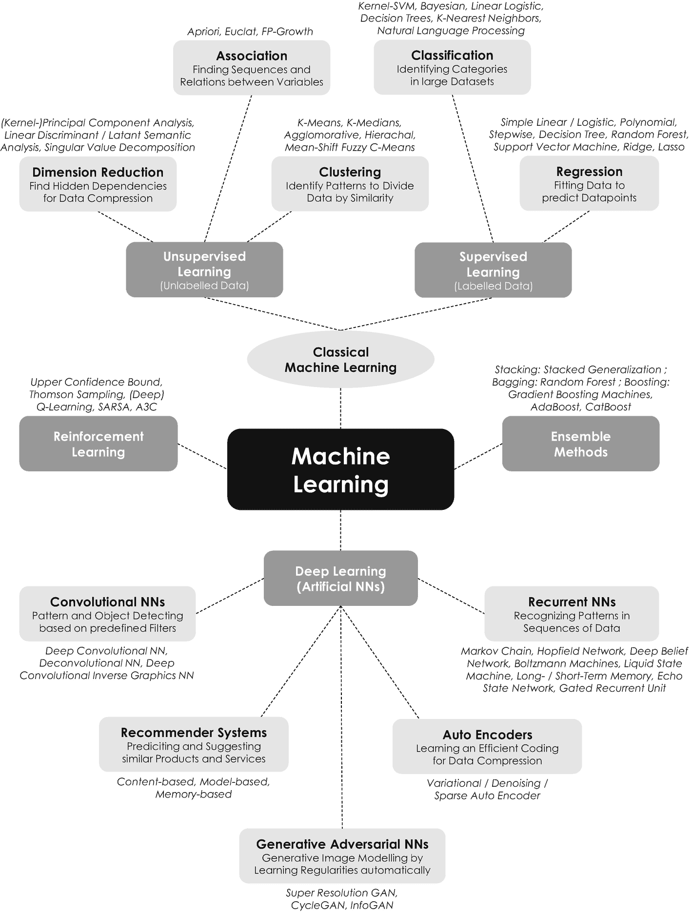
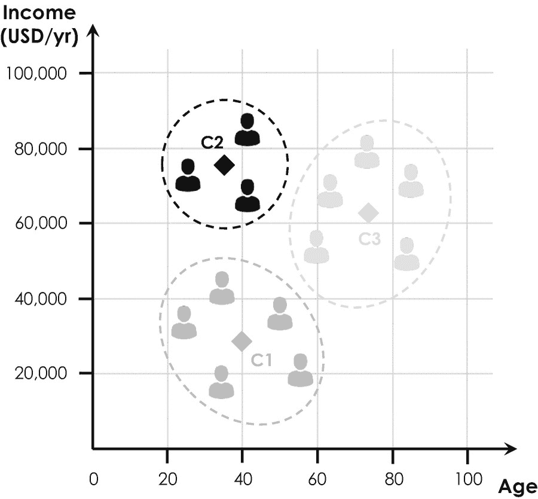
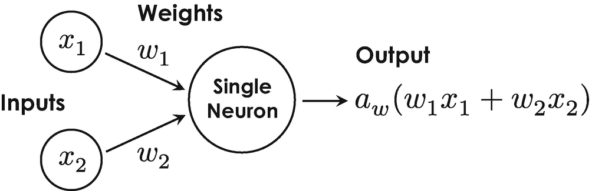
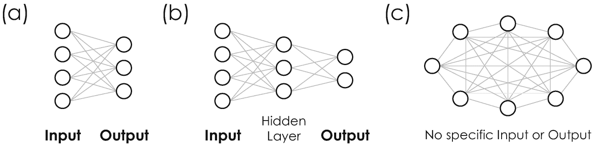
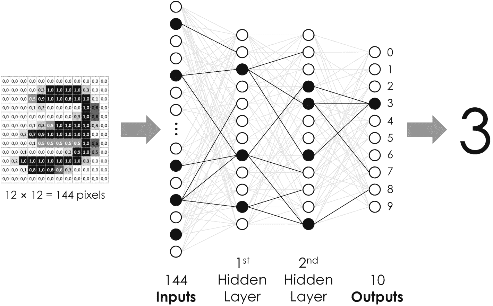

# 4.3 学习的五大类别

在上述回归模型的基础上，数据科学家们又开发了一系列更广泛的机器学习算法，每种算法都有其特定的应用场景。^(⁹²) 尽管由此产生的应用范围非常广泛且同样多样，但这些算法根据其特定的训练策略可以分为五大主要类别。这些类别分别称为监督学习、无监督学习、深度学习、强化学习以及集成方法。图 4-6 展示了最流行算法的一个通用但不全面的概述，我们将在下文中对其进行更详细的讨论。

## 4.3.1 监督学习

细心的读者会在我们之前的例子中注意到，线性回归模型是通过迭代比较其输出（拟合线）与其输入（训练数据集）来进行优化的。这就是*监督学习*的一个例子，它始终基于*标注数据*。标注数据指的是一个与前述例子类似的数据集，其中每个输入值（公寓面积）都与一个输出值（公寓价格）相关联。在这种情况下，代价函数很容易定义，因为我们可以直接将计算出的输出与输入训练数据集进行比较，并迭代地最小化任何偏差。监督学习通常需要大量（专家）标注的数据来训练模型，以产生更准确的结果。在此背景下，需要牢记的是，大规模、具代表性且高质量的数据集通常能降低*过拟合*的风险，并使模型能够很好地泛化到新数据上。过拟合指的是一种数学效应，表现为模型学习的是学习数据中的噪声（或统计波动），而非真正统计上最相关的模式。

**图 4-6** 机器学习最重要的类别与算法概览。五大主要类别以深灰色突出显示，相应的子类别以浅灰色显示。每个子类别中最流行的机器学习算法的技术名称以斜体字母表示。经典机器学习（浅灰色椭圆形）是一个历史术语，传统上用于指代经典的无监督学习和监督学习算法

然而，大部分可用数据通常是没有标注的，并且手动提供标注可能相当耗时。这就是为什么人们开发了非常有创意的方法来应对这一挑战。例如，ImageNet 是一个层级数据库，提供了大量带标注的图像，它是通过众包方式创建的。^(⁹³) 数据也可以自动标注。想想 Facebook 的应用机器学习小组 [26]，例如，他们利用其拥有超过 35 亿张照片的庞大数据库，基于一个非常复杂的预测模型，该模型使用 Instagram 照片的标签来自动标注其数据 [27]。虽然有些标签能很好地非视觉描述照片，但其他标签描述得则非常模糊，这就是为什么 Facebook 将其方法称为*弱监督数据* [28]。由于当今数据能创造竞争优势 [29]，数据标注很快成为了一个独立的行业和全球市场，拥有众多全球知名的成熟企业，如 Dataloop、Labelbox、Scale AI、Supervisely 和 Heartex Labs。^(⁹⁴) 其中一些管理型数据标注服务专注于特定的图像领域，例如用于支持医疗保健行业客户的医学扫描、用于货运业务的高空导航数据，或用于支持保险行业的卫星和航拍图像。芝加哥美国家庭保险公司衍生出的 Arturo.ai 以及总部位于圣地亚哥的初创公司 Lytx，只是这个不断增长的数据标注行业的两个例子，预计到 2025 年，该行业的全球市场规模将达到 16 亿美元 [30]。

**监督学习**  
在监督学习中，机器学习算法或程序通过标注数据进行训练，即输入和输出对，在训练期间告诉算法正确的答案，并允许调整其自由参数。一旦算法经过迭代训练，它就可以以一定的准确率预测未知输入的输出。如果你有可用的标注数据，或者知道如何手动分类和标注数据，那么这种方法非常适合。

### 监督学习：回归

*回归*是目前为止最简单的监督学习方法。它基于法国数学家阿德里安-马里·勒让德的开创性工作，他于 1805 年提出了“回归的最小二乘法”，用于根据天文观测确定绕太阳运行的轨道 [31]。回归算法通过一条直线（线性回归）或曲线（多项式回归）来逼近训练数据集。该算法的输出是描述最佳拟合直线或曲线的参数，这些参数可以扩展到训练数据之外，并用于预测未经训练的输出，就像前面的公寓租赁例子一样。线性回归广泛应用于预测和预报，例如金融和保险公司用于销售预测和风险评估分析。进一步的例子包括根据一天中的时间预测交通流量，或者根据公司的增长预测需求数量。特别值得关注的是多元线性回归或多元多项式回归，它允许基于独立的多输入数据集来预测输出，例如根据车辆的里程数、品牌、事故次数、维修次数、车主数量以及其他决定其价值的关键特征来预测其市场价值。多元多项式回归模型也可能允许我们预测营销人员所谓的“客户流失”^(⁹⁵)，该预测基于不同的变量，例如使用的频率和强度、满意度、人口统计特征以及与其他用户的关系。公司可以利用此类预测，例如自动提供特殊优惠以留住易流失的客户。

#### 监督学习：分类

属于*分类*范畴的机器学习算法，能够将（大型）数据集分割成具有某些相似性或属性的共同标签或数据组。分类与回归类似，但我们预测的不是一个数值，而是一个最能描述输入数据的类别。到目前为止，最常用的算法称为*K-近邻算法*，它获取一组带标签的数据点，并将它们分组到`*K*`个类别中，其中`*K*`是一个整数。

该算法的一个日益流行的应用场景是金融科技公司计算信用评分和评级。其分类模型会考虑多种因素，如收入、还款历史和居住地，来对潜在借款人进行分类。其他应用还包括垃圾邮件过滤、语言检测、情感分析和欺诈检测 [32]。例如，每当我们标记一封垃圾邮件，我们的邮件服务商就会更新其机器学习模型，以便在未来识别最新、最狡猾的骗局。Facebook 在新上传的照片中建议朋友姓名的功能，也是基于我们之前标记输入所训练的该算法。另一个例子是美国金融支付卡公司 Visa 开发的高级授权分析工具，它帮助金融机构每年防止约 250 亿美元的欺诈行为 [33]。

### 4.3.2 无监督学习

与监督学习相反，*无监督学习*处理的是*未标记的数据*。此类算法在学习过程中独立运行。它们通常从猜测输入数据中的相似性和模式开始，然后通过迭代调整各自模型的不同参数，力求获得越来越好的结果。优化目标或成本函数可以通过多种定量方法实现，例如欧几里得度量或距离，它允许我们根据数据点在坐标系中的空间距离来评估其相似性。最著名的例子之一是谷歌的 PageRank 算法，它成为了谷歌搜索引擎的原型。该算法是谷歌两位传奇创始人拉里·佩奇和谢尔盖·布林及其在斯坦福大学的同事们的智慧结晶，他们于 1998 年发表了题为《PageRank 引用排名：为网络带来秩序》的开创性论文 [34]。在为其专利（专利号 US 6,285,999）提交申请一年后 [35]，他们推出了谷歌搜索引擎的第一个版本。自那时起，无监督学习已被应用于一系列其他商业应用中。全球顶尖的人工智能科学家之一杨立昆预测：“[...] 从长远来看，无监督学习将变得重要得多。人类和动物的学习在很大程度上是无监督的：我们通过观察世界来发现其结构，而不是通过被告知每个物体的名字。”[36]

#### 无监督学习

在无监督学习的情况下，机器学习算法或程序在没有预定义类别的情况下扫描输入数据以寻找模式和结构，并迭代地识别出统计上最佳的分类方式。如果你不知道如何标记数据，并且希望算法为你找到相似性和模式来进行分类，这种方法非常适用。

#### 无监督学习：聚类

聚类是经典无监督学习中最流行的子类别。简单来说，可以将其类比为你洗完衣服后，不记得自己所有衣服的颜色，于是按颜色来分类衬衫。这类算法通常允许我们分割没有预定义类别或分类的大型数据集。算法会自行寻找相似的对象，将它们合并到一个聚类中，并以此自动找到分割数据集的最佳方式。迄今为止，该子类别中最常用的算法是*K-均值聚类*，它选取`*K*`个中心点或*质心*，将它们分布到数据集中，并将不同质心附近的所有数据点合并到一个聚类中。质心的位置会被迭代调整，直到所有数据点与其关联质心之间的平均距离最小化，从而建立起统计上最稳健的分组。此外，该算法允许绘制一个“曲棍球棒图”或“肘部图”，通过绘制数据与质心之间的平均距离与`*K*`值的关系，我们可以确定统计上理想的聚类数量。该图通常呈曲棍球棒形状，其拐点处即为理想的聚类数量。K-均值聚类最流行的应用可能是营销活动中的*市场*和*客户细分*，如图 4-7 示例所示。

另一个应用是*情感分析*，它挖掘社交媒体数据以识别社会总体趋势。例如，这对于一家时尚公司来说至关重要，可以帮助他们了解如何在下一条服装线中调整已识别的风格。另一个例子是在城市地图上标记热门地点。例如，当你在谷歌地图上寻找餐馆时，你可能已经注意到，谷歌的聚类引擎会在非常低的缩放级别下，将搜索结果聚集到带有数字的块状区域中。这是一个非常重要的功能，否则，当你的浏览器试图同时在地图上绘制成千上万家餐馆时，可能会卡死。你还可以想到政府背景下的国家安全机构和执法组织，他们可以使用聚类来寻找异常模式并识别潜在的安全威胁，这种应用被称为*异常检测*。在这些情况下，聚类算法尤其有用，因为我们通常不知道要寻找的具体异常模式。

**图 4-7** 通过绘制客户年收入与年龄的关系进行客户细分。在此示例中，算法找到了三个质心，分别标记为“C1”、“C2”和“C3”（菱形），这三个质心刻画了三个客户群体（黑色、中灰色和浅灰色虚线）

### 无监督学习：关联

*关联*（或称关联规则学习）是另一类采用无监督学习策略的算法，例如被用于亚马逊“购买此商品的顾客也购买了”板块中为你推荐类似书籍。这些算法通过选取基于不同重要性和显著性度量的规则，在（非常）大型的数据集中寻找变量之间的模式和关系 [37, 38]。该模型的 `support` 参数用于量化一个项集（例如一组商品列表）在数据集中出现的频率，而 `confidence` 则指示一条关联规则在数据中被发现的概率。例如，*先验*关联规则算法首先设定最小支持度和置信度阈值，然后迭代地识别并排列所有具有更高支持度和置信度的子集。如今，该算法被用于分析购物车和自动化营销策略——这种方法被称为行为微目标定位，因为它寻找任何一组商品之间共同出现的频率和概率，并建立未来不同种类商品之间可能发生的关联。

一个具体的例子是超市中的商品摆放。设想一位顾客拿着一打啤酒走向收银台。我们是否应该在路上摆放口香糖？也就是说，啤酒和口香糖的销售是否在某种程度上存在关联？获取有价值的客户洞察以推动超市和仓库的销售，是关联规则学习一个相当典型的应用场景。一般来说，只要你有某种序列数据，并且希望在其中发现显性和隐性的模式及关系，都可以应用此方法。例如，英国线上超市 Ocado 从其数据中发现尿布和啤酒之间存在强相关性。他们了解到，新晋父母不常外出，因此当这些顾客购买尿布时推荐啤酒和葡萄酒，结果证明不仅利润丰厚，也提升了客户满意度。

### 无监督学习：降维

*降维*（或泛化）旨在大型数据集中寻找比碎片化特征更适合数据处理的抽象模式。例如，所有具有三角形耳朵、长鼻子和大尾巴的狗可以概括为牧羊犬类别，这对于解释和处理该品种的特性来说，比单独描述其生理特征更为有用。这类算法已被用于潜在语义分析，通过将特定词语聚类到主题，从而将具体词汇抽象为其含义。除了这种所谓的*主题建模*，降维最流行的应用可能当属*推荐系统*和*协同过滤*，用于基于多个方面、视角、数据源等分析客户的行为模式。

### 4.3.3 深度学习

除了监督学习和无监督学习，深度学习构成了第三大类学习策略，通常被用于训练人工神经网络。*深度学习*是机器学习的一个子类别，其灵感来源于（人类）大脑的结构和功能。它是人工智能领域最年轻的研究领域，近期在媒体上引起了广泛关注，部分原因在于它提供了一系列高度跨学科的应用。

**图 4-8** 具有两个十进制输入 `x[1]` 和 `x[2]` 的单个神经元的基本电路模型。其输出是输入的加权和 `w[1] x[1] + w[2] x[2]` 的数学函数，用 `a[w]` 表示，并被称为激活函数

#### 人工神经网络

人工神经网络是一种由相互连接的神经元组成的结构，这些神经元通常排列成多个层。每个神经元都与前后层中的神经元相连，并具有特定的激活函数。每个连接强度的权重，结合每个神经元的激活函数，共同控制信息如何通过网络从输入层传递到输出层。人工神经网络模仿大脑的智能行为，可应用于广泛的应用场景。

#### 深度学习：人工神经网络

深度学习采用由相互连接的人工神经元构成的*人工神经网络*。这里的“人工”一词指的是：我们使用的并非真实的生物神经元，而是通过运行适当软件代码（即机器学习模型）的先进计算硬件来模拟其行为。现今人工神经网络中使用的神经元，是对弗兰克·罗森布拉特的感知器模型的泛化。根据我们在第 4.1.2 节的讨论，你可能记得感知器的输出值取决于输入的加权和，我们在数学上用 `w[1] · x[1] + w[2] · x[2]` 以及输入 `x[1]`、`x[2]` 和权重 `w[1]`、`w[2]` 来描述这一点。对弗兰克·罗森布拉特模型的这种特殊泛化被称为*激活函数*，它所做的无非是根据一个可选择的公式，将输入的加权和转换为一个小数——因此，这是一种更精细的控制激活电位的方式。激活函数为模型增加了一个自由度（或自由参数），并通过为其选择最合适的激活函数，使得能够更好地针对特定用例调优人工神经元。人工神经元的整体概念如图 4-8 所示。

图 4-9

三种最基本的人工神经网络类型。(a) 显示了一个两层神经网络，包含一个由四个神经元（圆圈）构建的输入层和一个由三个神经元构建的输出层。(b) 显示了一个包含一个隐藏层的三层设计，(c) 显示了一种相当特殊类型的神经网络，称为“玻尔兹曼神经网络”，它没有特定的输入或输出。

当我们将这些神经元连接起来，形成类似于我们大脑中生物神经网络的人工神经网络时，这些神经元的真正力量才得以展现。神经元可以连接起来形成任何类型的*网络架构*，这取决于手头的特定用例。在此语境下，“架构”一词指的是不同神经元相互连接的特定方式（或布线图）——这种连接当然是人工的，因为它是由软件模拟的。选择最合适的架构实际上需要大量的经验和专业技术。图 4-9 展示了一些基本示例供你参考。该图表明，人工神经网络中的不同神经元通常排列在不同的层中，其中神经元仅与相邻层中的邻近神经元连接。既不是输入层也不是输出层的层称为*隐藏层*。从历史上看，“隐藏”一词引出了*深度学习*这个术语，因为隐藏层在神经网络中“深”处秘密地运作，不产生任何可见的输出。当输入数据非常多样化、庞大且复杂时，例如用于图像、物体和语音识别的数据，通常会使用隐藏层。

为了更详细地解释人工神经网络的基本原理，我们现在将讨论一个非常流行的例子。这个用例如图 4-10 所示，是关于读取手写数字并将其转换为数字形式以供进一步处理。例如，一些邮政分拣中心会使用这类网络来读取邮政地址，并根据邮政编码自动分拣邮件，这种方案也很容易扩展到读取手写地址和其他文本。

图 4-10

通过人工神经网络进行手写数字分类。该网络获取手写数字的图像，并将其转换为数字形式。根据输入图像的像素数，该网络的输入层包含 144 个神经元（圆圈）。此外，它包含两个隐藏层，每层有 12 个神经元，以及一个输出层，该输出层总共包含 10 个神经元，分别对应数字 0、1、…、9。被激活的神经元以及权重最高的最主要连接以黑色突出显示。

图 4-10 中的神经网络总共由四层构建而成：一个输入层、一个输出层和两个隐藏层。其输入是 12 × 12 像素的图像，例如我们在第 1.4.1 节介绍灰度图像二进制编码方案时讨论过的那种。这些图像逐行输入到神经网络中，即每个像素作为输入层中一个神经元的输入，因此输入层总共包含 12 × 12 = 144 个神经元。根据某个像素的值是否足以激活相应的神经元，该输入要么被前馈到下一层，要么被认为无需进一步处理而忽略。在当前的例子中，下一层是第一个隐藏层。其神经元将信息转发到第二个隐藏层，但会根据另一个激活函数来进行，该函数允许聚焦于输入数据中的某些模式。第二个隐藏层包含的神经元比其前一层少，并且也为其构成神经元采用了一种特殊的激活函数。最后，输出层基于一种称为*sigmoid 函数*的激活函数，对其来自第二个隐藏层的输入进行平均。该 sigmoid 函数的输出对应一个介于 0 和 1 之间的数字，可以用概率来解释⁹⁶。输出值 1 对应 100%的概率，相应地，输出 0 对应 0%的概率。在此特定案例中，概率最高的神经元是第三个，因此网络正确地将以手写数字 3 输入的图像归类为数字 3，其不确定性由相应的概率给出。

### 深度学习

深度学习是指采用包含一个或多个隐藏层的人工神经网络的机器学习算法或程序。它对于解决复杂任务特别有用，例如图像和物体识别或自然语言处理。

与线性回归模型类似，这种手写数字分类只有在神经网络之前已经用包含数千个手写数字的大型训练数据集进行过训练的情况下，才能正确工作。未经任何训练，神经元之间不同连接的权重只是随机值。因此，神经元会被任意激活，并且其激发几乎与输入图像无关。那么，这个训练是如何进行的呢？人工神经网络实际上是如何学习的？

人工神经网络通常可以通过使用标记数据或未标记数据进行训练，即采用监督学习或无监督学习。当前例子中的人工神经网络是使用标记数据集进行训练的。这些数据集包含数千张手写数字图像，每张图像都与正确的数字关联（或被标记）。因此，可以通过将计算出的输出与标记的输入值进行比较来定义神经网络的成本函数⁹⁷。

与所有其他机器学习算法一样，人工神经网络是通过迭代最小化其成本函数来进行训练的。训练通常包括五个主要步骤：

1.  第一步，用随机小数初始化不同的权重，为简单起见，这些数字通常介于 0 和 1 之间。
2.  之后，将训练数据集的第一张图像输入到输入层，每个像素对应一个神经元。

3. 数据随后从输入层向输出层逐层传播，每个神经元的输出等于其激活函数对相应加权输入和的计算结果。这一过程被称为*前向传播*，因为它从输入层指向输出层。

4. 在第四步中，算法将计算结果与输入图像的标签进行比较，并计算输出层每个神经元产生的误差。

5. 第五步被称为*反向传播*，其理论基础源于美国数学家 Paul Werbos 和美国心理学家 David Rumelhart 的先驱性工作 [39, 40]。反向传播标志着人工智能研究的一个重要里程碑，因为在此之前的神经网络无法被准确高效地训练。^(⁹⁸) 在此过程中，计算出的误差从输出层反向传播至输入层，同时根据各权重对误差的贡献程度进行更新。通过这种方式，部分连接的权重增加而变强，其他连接的权重相应减少而变弱。单次迭代中权重更新的最大幅度被称为*学习率*，它决定了人工神经网络的学习速度。

步骤 1–5 会重复执行，直到训练数据集中的每张图像都已通过网络处理，并达到预期的识别精度。训练数据集中所有图像完整地完成一次前向和后向传播，被称为一个*周期*。人工神经网络的训练通常涉及数百个周期，这就是为什么整个训练过程可能非常耗时且计算密集。

形象地说，人工神经网络隐藏层中的不同神经元在训练过程中会捕捉特定的图像特征和形状，从而将图像分解为其最主要的子成分。因此，第一个隐藏层的神经元会逐步识别简单的形状，例如直线、边缘、角、矩形、圆形和其他嵌套特征。第二个隐藏层的神经元可能识别出输入图像中占主导地位的、更复杂的特征或这些简单形状的组合。训练完成后，便建立了一个通用的简单形状集合，该集合能够很好地适用于识别所有可能的手写数字，其方法是将手写数字分解为基本形状，并根据特定的分解方式将其关联到一个数字。

