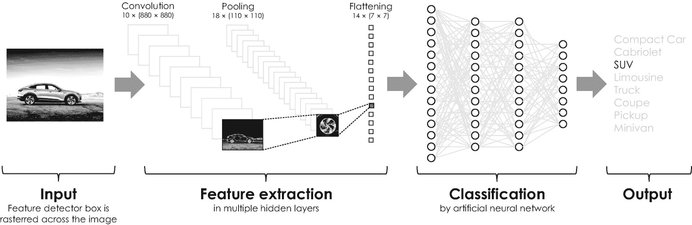
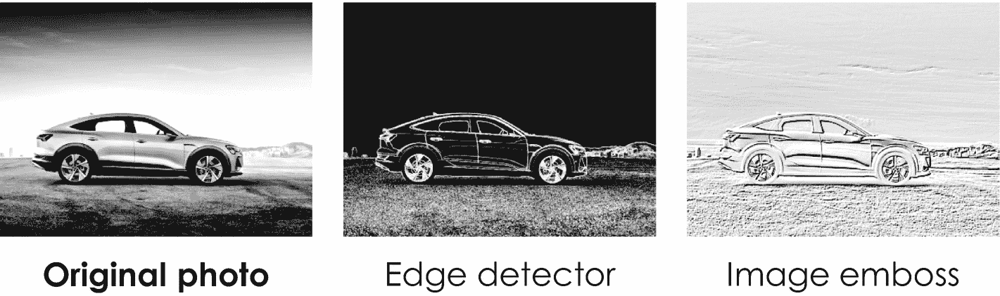

# 深度学习：卷积神经网络

与任何其他人工神经网络一样，卷积神经网络建立在历史上发展出的多种科学概念和思想之上。其核心思想可追溯到德国神经科学家、诺贝尔奖得主 David Hubel 和 Torsten Wiesel，他们在 1959 年研究了猫视觉皮层中的神经元 [42]。基于实验结果，他们很快认识到，猫视觉皮层（即大脑中处理来自眼睛视觉信号的部分）中的神经元仅对视野中的小区域产生反应，他们将这些区域称为`感受野`。此外，他们还发现相邻神经元的感受野相互重叠，形成一个光栅，共同构成了猫的整个视野。这种重叠在数学上被称为`卷积`，类似于应用于图像以突出特定结构、纹理、特征及其他方面的局部滤波器。为清晰起见，图 4-11 展示了两种非常常见的卷积滤波器在一张示例灰度图像上的效果。

受 David Hubel 和 Torsten Wiesel 开创性工作的启发，日本计算机科学家 Kunihiko Fukushima 于 1980 年开发了一种多层人工神经网络，他将其命名为“`Neocognitron`” [36, 43]。这种特殊的人工神经网络采用完全不同的网络架构，能够识别类似前述示例的手写字符。其方法的真正创新在于将人工神经网络与基于卷积滤波器的特征提取单元相结合，因此他的网络架构后来被称为`卷积神经网络`。图 4-12 示意性地展示了此类网络的一个非常简单的示例。这个特定的卷积神经网络可用于图像识别，并根据车辆类型（如紧凑型轿车、敞篷车、SUV 和豪华轿车）对车辆进行分类。它由两个子组件组成：(1) 特征提取单元和 (2) 分类单元。特征提取单元用于图像预处理，由三个具有特定激活函数的神经元层组成。第一层称为`卷积层`，它通过在输入图像上逐行、逐列移动任意滤波器（类似于图 4-11 所示的滤波器）来扫描图像，以检测特定的（对比度）特征和结构。此过程会创建一个所谓的`特征图`，突出显示汽车统计上最相关的特征，例如车轮、车门、车灯以及其他方面，具体取决于所选的滤波器。之后，Kunihiko Fukushima 引入了一个所谓的`池化层`，该层对这些特征进行累加，并根据其统计相关性进行评级。由于其特殊的激活函数，池化层进一步确保了即使检测到的特征在输入图像中发生偏移或倾斜，也能被正确识别。^(⁹⁹) 此外，它还减小了图像尺寸，因此池化层有时也被称为“下采样层”。池化后的特征图作为后续`flattening 层`（特征提取单元的第三层，也是最后一层）的输入。该层进一步缩小特征尺寸，并将特征图转换为一列神经元。这一列神经元本身又作为卷积神经网络第二个子组件（一个全连接的人工神经网络，即分类单元）的输入。这个人工神经网络最终能够将检测到的特征分类为特定的车辆类型，类似于前一个示例中用于分类手写数字的人工神经网络。

**图 4-12** 用于根据车辆类型对车辆图像进行分类的卷积神经网络架构设计。特征提取单元由`卷积层`、`池化层`和 `flattening 层`组成，识别图像中的特定特征和结构。根据哪些特征最终被证明最为主要，一个人工神经网络将这些特征分类为特定的车辆类型。

**图 4-11** 两个特征检测器对原始图像的效果。“边缘检测器”强调图像中的所有边缘，而“图像浮雕”则赋予图像三维外观，从而突出图像中的任何纹理，例如车辆下方的地面。