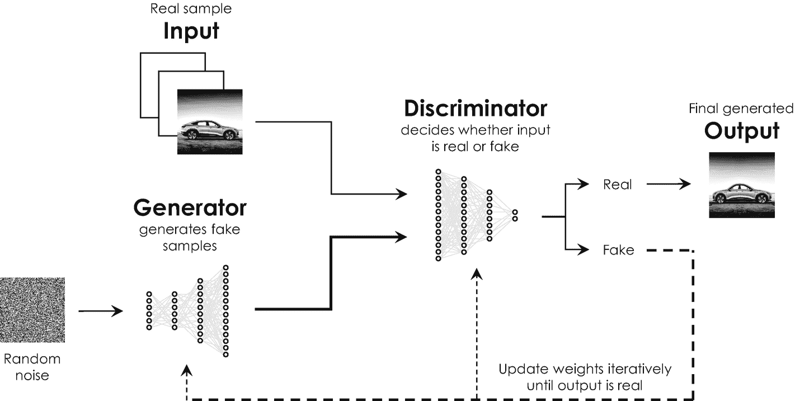

# 深度学习：卷积神经网络

卷积神经网络通常使用包含数万张图像的带标签数据集进行训练。训练卷积神经网络的一个里程碑是 Yann LeCun 的反向传播算法，他于 1989 年在著名的新泽西贝尔实验室开发了该算法[44]。他精心设计的算法不仅能训练神经网络，还能同时自动调整特征提取单元中使用的滤波器或`卷积核`。一旦训练完成，特征图将显示在整个训练数据集中统计上最相关的特征。他的方法后来成为现代`计算机视觉`的基础[60]，正如我们将在本章的应用部分所见，它为商业和工业应用提供了特别广泛的范围。此后，卷积神经网络被用于例如照片和视频中的对象搜索、人脸识别、图像风格迁移以及提高照片图像质量等任务。

人脸识别发挥着特别重要的作用，并且是许多初创企业的焦点。例如，在该领域最近引起媒体和投资者高度关注的一家公司是美国初创公司`Affectiva`。`Affectiva`于 2009 年从麻省理工学院媒体实验室分离出来，它结合了人脸识别和语音模式分析来确定人们的情绪和认知状态。潜在的应用范围包括：通过感知驾驶员的情绪状态（如愤怒、疲劳或注意力不集中）来提高道路安全，增强商店中的客户体验，以及提高营销活动的影响力。这些应用如今被统称为`情感计算`[45]或`情感 AI`[46]。

## 深度学习：循环神经网络

人工神经网络和卷积神经网络非常擅长检测大型（图像）数据集中的模式。然而，事实证明，这两种网络都非常不擅长记忆先前的输入，因为它们没有任何短期或长期记忆。换句话说，它们全部的学习历史仅被不可挽回地编码在不同神经连接的权重中，并且它们无法确定之前是否已经见过某个输入图像。

然而，对于需要数据历史记录的应用（例如语音识别和语音合成）来说，这种记忆非常有益。这就是为什么科学家们开发了另一种称为`循环神经网络`的网络架构，它能够记忆先前处理过的数据。第一个循环神经网络，即所谓的`Hopfield 网络`，是由美国物理学家 John Hopfield 于 1982 年开发的[47]。他称之为“联想记忆”的模型可以被训练来存储不同的图像或模式，并且随后能够在其他输入图像中识别出其中任何一个。然而，早期循环神经网络实现的性能非常有限，因为它们不容易被训练。^((100)) 自那时起，人们开发了各种类型的循环神经网络，每种都有其特定的优点和缺点[48–53]。

最强大的联想记忆是所谓的`长短期记忆网络`。这种特殊类型的循环神经网络由德国计算机科学家 Sepp Hochreiter 和 Jürgen Schmidhuber 于 1997 年开发[54]，旨在识别数据（时间）序列中的模式。长短期记忆很快革新了自然语言处理和翻译，因为语言是词语的序列，通常只有将词语相互关联起来才能正确翻译。如今，长短期记忆也被用于语音识别和声学建模[55, 56]，这是实现虚拟助手和聊天机器人的重要前提。

图 4-13

生成对抗神经网络的架构原理和操作示意图。生成器网络生成假图像，这些图像作为判别器网络的输入。判别器估计该输入是真实的还是伪造的。当判别器确定输出为真实时，迭代训练结束。