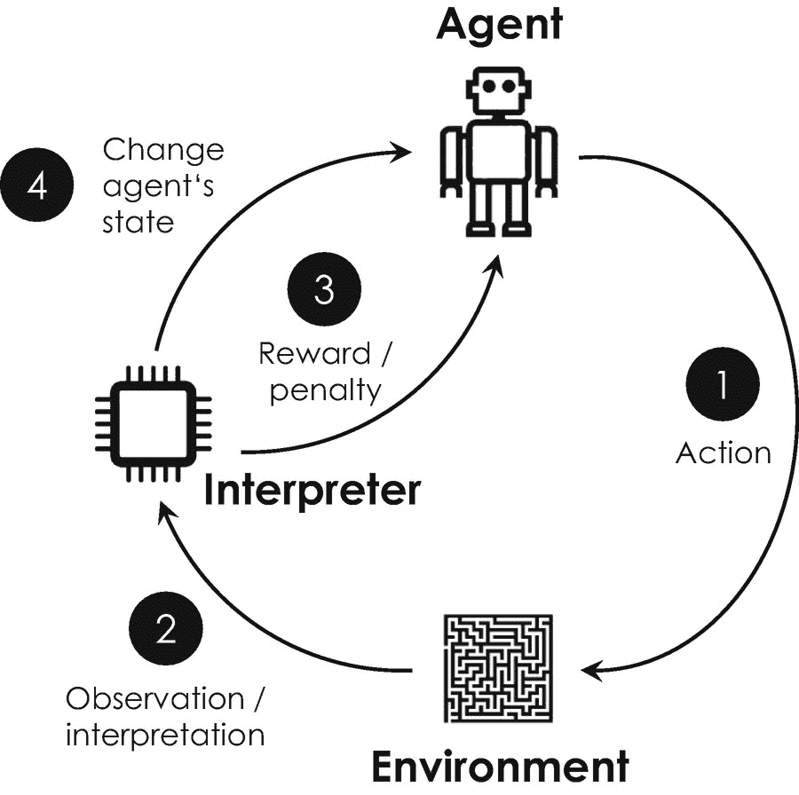

# 深度学习：生成对抗神经网络

另一类非常有趣且相对较新的机器学习模型是*生成对抗神经网络*，法裔美国计算机科学家、Facebook 人工智能研究总监扬·勒昆曾称之为“过去十年中最有趣的想法” [57]。该模型由美国计算机科学家伊恩·古德费洛及其蒙特利尔大学的同事于 2014 年发现 [58]，由两个相互竞争的人工神经网络组成。这种竞争关系催生了“对抗”一词，其概念源自*博弈论*，这是一门用于模拟理性决策的数学学科。^(¹⁰¹) 其基本架构示意如图 4-13 所示。一个生成对抗神经网络包含两个子组件：*生成器网络*和*判别器网络*，每个子组件都展现出不同的架构。生成器网络的初始输入是随机噪声，而判别器网络的输入数据集同时包含真实样本图像（训练数据）和生成器的输出图像。在这种配置下，生成器旨在创建虚假图像，而判别器则评估其输入是真实图像还是虚假图像。随着两个竞争网络在训练过程中不断优化，生成器最终被迫在每次迭代中创建出越来越逼真的新图像。经过若干轮次（epoch）后，判别器会将其生成的输入图像估计为真实图像，训练过程随即结束。此时，生成对抗神经网络已达成其主要目标：从包含真实图像的数据集中生成一张全新的、看似真实的（虚假）图像。

此时，你完全有理由问自己：这种网络除了让数据科学家用来生成有趣的图像之外，是否还有其他实际用途？首先，需要指出的是，从概念角度来看，*对抗学习*特别引人注目，因为它提供了一种无需任何成本函数的统计学习新方法。生成对抗神经网络反而能够自行学习其成本函数，从而避免了需要精心设计和构造成本函数的麻烦，而后者通常非常费力且耗时 [61]。扬·勒昆曾在 2016 年的 NIPS 大会（世界上最大的人工智能研究会议之一）上，将这种为特定用例寻找合适成本函数的挑战描述如下：“如果智能是一个蛋糕，那么无监督学习就是蛋糕本身，监督学习是蛋糕上的糖霜，而强化学习则是蛋糕上的樱桃。我们知道如何制作糖霜和樱桃，但不知道如何制作蛋糕。” 三年后，在旧金山举办的 ISSCC 上发表演讲时，他更新了自己著名的*蛋糕类比*，将“无监督学习”替换为“自监督学习”。他用这个术语指代一种学习策略，即数据本身提供监督并充当训练者，类似于其在生成对抗神经网络中的作用。在他看来，“下一次人工智能革命将不是监督式的，也不是纯粹的强化式。未来是属于自监督学习的，它需要海量数据和非常庞大的网络。”

除了这种概念上的相关性，生成对抗神经网络在多种应用中也展现出优于其他神经网络架构的性能。在此背景下，最受欢迎的应用包括高级照片编辑（涵盖风格迁移^(¹⁰²) [62]和图像融合）、图像修复 [63]、人脸老化及基于（肖像）图像的年龄估计 [64]、照片级真实感图像生成 [65]，以及用于姿态不变人脸识别的人脸正面视图生成 [66]。最后一个应用在分析公共安全摄像头数据时可能发挥关键作用，例如，用于独立于姿态和风格地视觉追踪和识别罪犯，以减少犯罪并执行起诉。生成对抗神经网络最近也登上了国际艺术品拍卖舞台，当时英国拍卖行佳士得售出了首张由这种网络创作的图像。这幅图像名为《埃德蒙·贝拉米肖像》，描绘了一位身材魁梧、可能为法国绅士的人物，身着深色礼服大衣，搭配素白领子。这幅图像于 2018 年 10 月 25 日在佳士得的“版画及限量作品”拍卖会上以——信不信由你——432,500 美元的价格成交，是其最高估价的近 45 倍 [67]。

生成对抗神经网络的另一个日益流行的应用是*生成式设计*，指的是一种迭代设计过程：程序根据用户指定的某些约束条件，生成一系列可供用户后续微调的设计对象。例如，剑桥咨询公司的一个团队创建了一个名为“Vincent AI”的程序，可以根据预先选定的风格将粗糙的人体草图转化为艺术作品。^(¹⁰³) 欧特克的“Dreamcatcher AI”项目^(¹⁰⁴) 也一直在探索类似的方法，并开发了一个商业可用的平台，能够基于用户上传的 CAD 文件（工业设计应用的主要数据格式）自动生成不同的设计方案。

这些例子表明，人工智能也正在成为艺术领域的一股颠覆性力量。许多公司捕捉到了这一趋势，并开始探索艺术、设计、创造力与人工智能之间令人兴奋的联系。例如，谷歌在 2016 年启动了其“艺术与机器智能项目”，该项目汇集了来自世界各地的艺术家和工程师，共同探讨人工智能如何改变创意实践 [68]。

然而，不幸的是，生成对抗网络也被恶意用于一些不那么光彩的事情。一个例子是所谓的*深度伪造*，即利用这项技术创建误导性的虚假图像、视频或新闻。例如，基于生成对抗网络的风格迁移技术，可以让你让任何知名政客或国家领导人说出你想要他们说的任何话——这对于基于虚假新闻的政治宣传来说是一种真正危险的工具。

### 深度学习：推荐系统

像亚马逊、奈飞、Pandora 和领英这样的公司也应用了另一类机器学习算法——*推荐系统*——来帮助其平台的用户发现可能感兴趣且值得购买的新项目（例如书籍、视频、音乐和文章）。因此，推荐系统在提升各自平台或市场供应商的销售额和收入的同时，也创造了愉悦的用户体验。图 4-6 区分了三种不同类型的推荐系统：(1) 基于内容的推荐系统，(2) 基于模型的推荐系统，以及 (3) 基于记忆的推荐系统。例如，在美国音乐流媒体和网络广播服务公司 Pandora，一个由音乐人组成的团队会手动为每个音乐电台标注数百个属性和关键词，例如流派和艺术家。然后，每当用户选择某个特定的音乐电台时，Pandora 会自动添加具有相同属性的歌曲，并最终为其数百万用户中的每一位生成个性化的播放列表。这是一个*基于内容*的推荐系统的例子，它将用户档案与具有相同属性和关键词的不同项目进行匹配。这类算法计算速度快且可扩展性强，因为它们可以轻松地扩展到新的项目和客户。

在*基于模型*的推荐系统中，算法从大型数据集中提取一些信息或行为模式，并将其作为模型来做出未来的推荐。这种方法对于随时间变化缓慢且不需要频繁更新的模式特别有用，因为构建模型通常是一个既耗时又消耗资源的过程。其中一个例子是基于社交知识的系统 [69]。

*基于记忆*的推荐系统的一个例子是亚马逊网站上“购买了您购物车中商品的顾客也购买了”板块的早期电商代理 [70]。由于以下论点，这个代理可能对亚马逊的商业模式产生有趣的影响。随着代理随着时间的推移变得越来越好，其预测准确性有时可能会超过某个阈值，超过这个阈值，亚马逊直接将预测你会想要的商品运给你，而不是等你下单，会更为有利可图。从亚马逊的角度来看，这种*预测性*或*预期性发货*有两个优势：(1) 其便利性降低了你就从竞争对手那里购买这些商品的可能性，(2) 它促使你购买那些你考虑过但最终可能不会购买的商品——这两种情况最终都会增加亚马逊在你消费份额中的占比。由于购物者可能不希望为退回不想要的商品而费心，亚马逊可能会投资于方便处理退货的基础设施，例如类似运输卡车的工具或定期（比如每周一次）上门收集商品的自主无人机。作为一名持怀疑态度的读者，你可能会惊讶地发现，亚马逊早在 2013 年就获得了美国预期性发货的专利，专利号为 US 8,615,473 B2 [71]。

然而，实现推荐系统最重要的算法在技术上被称为*协同过滤*，它采用特定措施来识别数据集中用户-项目对和项目-项目对之间的相似性 [72]。然后，这些相似性度量被用来预测数据集中不存在的新对的评分。显然，在这种情况下，数据科学家会区分*基于用户*和*基于项目*的协同过滤。

### 深度学习：自编码器

自编码器是一种非常特殊的神经网络，它通过采用无监督学习，能够高效地对数据进行编码。自编码器的目标是利用迭代优化过程，学习最佳的编码和解码方案。自 20 世纪 80 年代末期以来，它们就已存在 [73–75]，并且传统上被用于*降维*，即通过移除不必要和不相关的数据来减小数据集的大小。其工作原理类似于 ZIP 文件格式，该格式允许我们压缩和归档各种数据。与 ZIP 算法不同，自编码器的数据压缩方案不是预定义和固定的，而是通过基于待压缩数据集中普遍存在的统计上最相关的特征和模式进行迭代训练来学习和优化的。

### 4.3.4 集成方法

*集成方法*将多种机器学习算法整合为一个预测模型，以充分利用各算法的优势——用亚里士多德的名言来说就是“整体大于部分之和”。为此，集成方法会对不同算法的输出结果进行“平均”，最终输出集成值最高的预测结果，该结果可理解为一种集成平均值。根据这种平均值的具体计算方式，数据科学家将其区分为三种不同方法：

1.  **Bagging**（装袋法）：用于降低预测的方差
2.  **Boosting**（提升法）：用于降低预测的偏差（“偏见”或“刻板印象”）
3.  **Stacking**（堆叠法）：用于改善预测效果

*Bagging* 代表“自助聚合”，指通过对所有结果求平均来计算集成值的集成方法。最著名的例子是*随机森林*算法，它直接对集成中不同算法所形成的决策树各分支结果取平均值。例如，当你用智能手机或数码相机拍照时，其面部识别功能会在人物面部周围绘制方框以优化人像效果。这一功能极有可能就是随机森林算法的结果：集成中的一个算法负责识别眼睛，另一个算法负责识别耳朵、嘴巴等。每个算法都会输出检测到这些面部特征的一定概率。集成算法对这些概率求平均，并输出一个整体的集成值或检测到输入图像中人脸的概率。若该概率超过某个阈值（如 60%），相机应用便会相应地在特征周围绘制方框。随机森林算法特别适合实时图像处理，因为它们通常在速度上优于人工神经网络。*Stacking*（堆叠法）则采用某种决策模型（如多项式回归）来计算集成中各算法的平均值。这种方法在实践中通常效果较差，因为决策模型难以针对特定应用场景进行灵活调整。*Boosting*（提升法）作为第三种集成方法，对集成中的各算法按顺序依次应用。该方法的主要优势在于，后续算法可以修正前一个算法的错误。然而，它们并不能很好地并行处理，但通常仍然比人工神经网络更快。例如，据报道，谷歌和 Facebook 在其搜索引擎中使用提升算法，按相关性对搜索结果进行排序。

另一个你可能非常熟悉的集成方法应用是包括 WhatsApp、微信或 iMessage 在内的即时通讯应用中的查询自动补全功能。该功能会在你开始输入信息时预测可能的后续词语。例如，如果你开始输入“he”，应用可能会建议“hello”或“here”——即在该语境中最常使用的词语。谷歌在 2006 年推出的谷歌翻译中也使用了这类算法，并持续改进至今，现已支持 100 多种语言和超过 1000 亿个单词[76]。然而，谷歌于 2016 年将其多语言翻译系统切换为深度学习算法，因为长短期记忆网络在最终证明更强大、更准确，它们同样能够评估词语的上下文含义。这也是谷歌将其翻译系统更名为“神经机器翻译系统”的原因[77]。

### 4.3.5 强化学习

最后，我们接触到一种看起来像真正人工智能的方法。这是因为这种方法与数据无关，而是关乎对未知（虚拟）环境的探索，例如一辆在陌生城市中行驶的自动驾驶汽车。事实证明，掌握世界上所有的道路规则和地图知识，并不能教会自动驾驶汽车的自动驾驶系统如何安全合规地行驶[78]——这一现象在其他应用中也同样存在。

正是因此，科学家们开发了一种全新的学习方法，称为*强化学习*。这种方法类似于通过奖励饼干来训练狗。早期的实验可以追溯到俄罗斯心理学家伊万·巴甫洛夫，他在 19 世纪 90 年代末用狗进行了一系列实验。为此，他每次在笼子里喂狗时都会摇铃。重复几次这个过程后，他观察到摇铃总会引发唾液反应，狗偶尔学会将铃声与附近的食物联系起来并做出相应准备，这在心理学上后来被称为*经典条件反射*。条件反射不仅成为心理学行为主义的基础，也成为今天强化学习的基本思想。在上述例子中，狗被更正式地称为*智能体*，其笼子称为*环境*。在此环境中执行*动作*，例如“听到铃声”或“获取食物”，被认为会改变狗的*状态*。从技术上讲，智能体的状态描述了其在环境中的位置或处境。智能体的动作和状态这两个参数，决定了其采取动作后获得的*奖励*。在此例中，伊万·巴甫洛夫是教练，他决定智能体是否获得奖励，技术上称为*解释器*。强化学习中的智能体遵循某种*策略*，即一系列旨在最大化奖励的动作。该策略在训练过程中迭代优化，如图 4-14 所示。根据策略的优化是否基于环境的某种模型，科学家区分了*基于模型*和*无模型*的强化学习。由于无模型强化学习更加灵活，能够适应随时间变化的环境，因此这无疑是这一迷人研究领域中最流行的方法，拥有众多应用。

**图 4-14** 试图逃离迷宫的智能体（机器人）的强化学习循环过程。(1) 过程从智能体做出一个任意步骤或动作开始。(2) 解释器观察智能体的动作，并评估该动作是否使其更接近迷宫出口。(3) 如果是，解释器奖励机器人；否则，在智能体的成本函数上施加惩罚。(4) 每个动作最终都会改变机器人在环境中的状态，然后过程重新开始。机器人通过多次执行此循环过程来改进其行为，同时力求每一步都最大化其奖励（或最小化其成本函数）。

