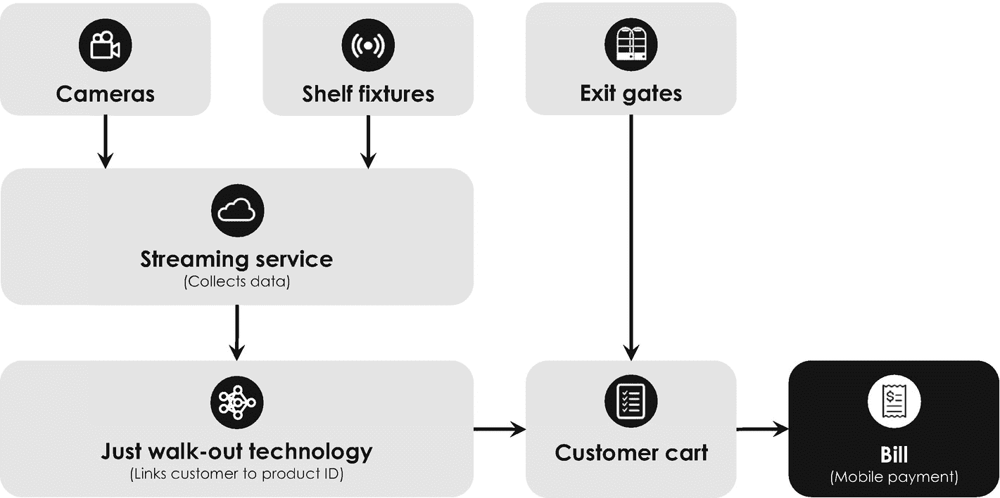

# 强化学习的数学概念

强化学习的数学概念可以追溯到理查德·贝尔曼（Richard Bellman）于 1954 年关于*动态规划*的开创性工作[79]，其中他提出了著名的*最优性原理*，证明了动态优化问题的每个解都由更简单的部分解组成。理查德·贝尔曼用以下话语描述了他的原理：“一个最优策略具有这样的性质：无论初始状态和初始决策是什么，剩余的决策必须针对由第一个决策所产生的状态构成一个最优策略”[79]。为了进行更定量的数学描述，他引入了一个递归数学函数，该函数将智能体在环境中的最优行动与预期奖励和结果状态联系起来。这个方程被称为*贝尔曼方程*，至今仍是强化学习的理论基础。

## 强化学习

强化学习是关于智能体在环境中采取行动。智能体或“行动者”会根据其行动是否使其更接近最大化奖励的最终目标，而获得奖励或惩罚。这种方法适用于你无法定义智能体在环境中的理想状态，并且了解环境的唯一方式是与之交互的情况。

贝尔曼方程后来通过将确定性环境替换为更符合现实的、随机且随时间变化的环境而得到了改进（或抽象化）。例如，一个更现实的环境可能涉及第二只竞争的狗，它也在试图抓住有奖励的食物。随机环境会影响智能体的最优行动选择策略，在数学上被称为*有限马尔可夫过程*。^(¹⁰⁵) 英国计算机科学家克里斯托弗·沃特金斯（Christopher Watkins）于 1989 年首次描述了通过有限马尔可夫过程对贝尔曼方程进行的抽象[80, 81]，这后来被称为*Q 学习*——其中的`Q`代表“质量”（quality），因为智能体学习在每种情况下执行最“高质量”的行动。Q 学习可以被视为强化学习的一个重要扩展，因为它允许将这些模型应用于现实生活场景[82]。

强化学习最著名的演示之一就是计算机程序“AlphaGo”。这个程序由后来被谷歌收购的 DeepMind Technologies 开发，旨在用于下围棋。围棋由神话中的中国皇帝尧在 2500 多年前发明，用于教导他的儿子纪律、专注和精神平衡，这是一种非常流行的两人中国策略棋盘游戏，如今全球玩家超过 4600 万。在每局游戏开始时，两名玩家会获得一套白色或黑色的棋子（称为“石子”）。执黑棋的玩家先手，两名玩家轮流将他们的棋子放置在网格线的交叉点上^(¹⁰⁶)，目标是创建一个相连的棋子组，包围比对手更大的一片封闭领地。当一个玩家包围了一颗或多颗敌方棋子时，他们会吃掉这些棋子并将其永久移出棋盘。游戏继续进行，直到双方都不愿再走一步或无法再吃掉对手的棋子。由于玩家通过包围空领地来得分，因此最终拥有最大领地的玩家获胜。尽管规则相对简单，但围棋非常复杂，因为其棋盘更大，可能的下一步走法比国际象棋多得多。合法棋盘位置数量的下限估计为`2 × 10¹⁷⁰`[83]，这远远超过了宇宙中基本粒子的数量。这就是为什么 DeepMind 不能使用*暴力破解*^(¹⁰⁷)，而 IBM 在 20 年前曾用这种方法实现了他们的国际象棋计算机“深蓝”。相反，由英国计算机科学家、DeepMind 创始人戴密斯·哈萨比斯（Demis Hassabis）领导的 AlphaGo 研究团队，使用了一种经过强化学习训练的复杂模式识别算法，因为可能的走法几乎是无穷无尽的，实际无法编程和预测。AlphaGo 依赖于由不同深度神经网络构建的三个主要组件[84]：(1) 用于选择走法的策略网络，(2) 用于搜索可能下一步走法的树搜索算法，以及 (3) 用于评估不同棋盘局面的价值网络。策略网络根据当前棋盘局面和获胜的最高概率，被训练来选择最佳的下一步走法。为此，它首先基于人类专家玩家的数据进行监督学习训练，然后在第二步中通过基于自我对弈强化学习的方式与自己博弈来进行提升。在扫描当前棋盘局面后，策略网络启动树搜索算法，该算法会查找游戏的不同变体，并试图预测几步之后可能发生的事情——为此，它通常会向前看大约 50 到 100 步。然后，价值网络会对这些不同的变体进行评估，计算每个变体的获胜概率，以便策略网络能够相应地选择获胜概率最高的走法。2016 年，AlphaGo 在五局比赛中以 4:1 击败韩国围棋大师李世石（Lee Se-dol）后，占据了各大报纸的头条[85]，这被认为是人工智能发展的一个关键里程碑。^(¹⁰⁸) 在那之前，围棋被认为过于复杂，任何智能程序都无法掌握。著名台湾计算机科学家、谷歌中国创始总裁兼技术投资人李开复（Kai-Fu Lee）在其最新著作《AI Superpowers》中指出，中国政府将谷歌 AlphaGo 计算机的惊人表现视为自己的“斯普特尼克时刻”，并随后决定将世界级的人工智能领导地位作为国家优先事项[86]。在此背景下，他进一步评论道：“美国和加拿大拥有世界上最优秀的人工智能研究人员，但中国拥有数百名优秀人才以及更多的数据……人工智能是一个需要算法和数据共同演进的领域；大量的数据会带来巨大的不同。”

## 4.4 主要应用场景与商业实践

前文对人工智能的介绍表明，大多数深度学习算法需要大规模数据集才能进行高效训练。此外，它们的训练还需要借助（高性能）计算机系统，这些系统能够在合理的时间尺度上以数字方式模拟神经网络。正因如此，历史上人工智能的应用与大数据、高效训练算法以及能够并行处理不同计算的强大计算机的发展密不可分。现代意义上的术语 `big data` 最早由奥莱利传媒的市场研究总监罗杰·马古拉斯于 2005 年提出。他用这个术语来描述那些在当时几乎无法通过商业智能工具进行管理、操作和处理的超大型数据集。^(¹⁰⁹) 随着互联网的兴起以及智能手机和其他数字设备的问世，大数据变得触手可及，人工智能的研究与开发也随之蓬勃发展。其提出的应用场景数量不断增加，复杂度逐步提升，应用领域也自此持续拓宽。但在详细探讨人工智能最重要且同样激动人心的应用场景之前，我们先简要了解一下最新的计算硬件是很有益的，这些硬件支撑了广泛的应用，并允许训练高度复杂的机器学习模型。

### 4.4.1 AI 芯片

绝大多数深度学习算法的训练在数学上涉及反复计算激活函数和权重。简而言之，这些计算包括对表征不同神经元及其连接关系的成千上万个数字进行乘法和加法运算。这些数字通常排列在特殊的数组中，数学上称为 `matrices`（矩阵）。早期，这类矩阵计算通常在 CPU 上执行，CPU 已存在多年——世界上第一个 CPU 是英特尔于 1971 年发布的 Intel 4004 [104]——其设计目的是非常快速但并非同时地执行单个操作。在当今最先进的个人电脑中，CPU 仍然是许多对时间不敏感且不依赖高度复杂和计算密集型算法的人工智能应用的首选硬件。

CPU 的基本架构由传奇的德国计算机先驱约翰·冯·诺依曼于 1945 年构思，包括计算核心和存储器等物理子组件。这两个组件通常在 CPU 微芯片上位置相近但在空间上彼此分离，并通过带宽有限的通信系统或 `bus`（总线）连接。这种限制仅允许在特定时间内，一定量的数据在计算核心和存储器之间流动。有限的带宽造成了数据传输速度上的瓶颈，即所谓的 `冯·诺依曼瓶颈`，这使得在传统 CPU 上使用大数据训练神经网络变得效率极低。^(¹¹⁰) 为了加速深度学习算法的训练计算，多家公司开始转而使用 `graphical processing units`（图形处理器，即 GPU）来并行化不同的计算。与 CPU 不同，GPU 最初是为电脑游戏行业设计的，目的是高效处理快速变化的高分辨率图像。^(¹¹¹) 例如，美国计算机科学家吴恩达及其在斯坦福大学的同事在 2009 年通过利用 GPU 训练一个拥有超过 1 亿参数（权重和激活函数）的多层神经网络，令人印象深刻地展示了这种方法的优势。他们的实验表明，在他们的特定案例中，在 GPU 上训练的速度比当时最先进的 CPU 快 70 倍以上 [105]。从那时起，GPU 成为训练复杂人工神经网络的首选方法。

然而，CPU 和 GPU 都不是为机器学习而设计和优化的。因此，近年来，多家科技公司开始研发专门用于高度并行计算的定制芯片组，并针对在超大规模数据集上训练人工神经网络进行了优化。这些微芯片通常包含数千个所谓的 `multiply-accumulate cores`（乘积累加核心，MAC 单元），这些单元由相互连接的晶体管电路构成，反复执行 `A + (B · C)` 类型的矩阵计算。其中，`A`、`B` 和 `C` 代表表征人工神经网络不同参数的三个矩阵，每个矩阵通常包含多达 8,500 个十进制数。集成了此类 MAC 单元的微芯片在文献中被称为 `neural processing units`（神经网络处理器，NPU）、神经网络加速器或 AI 芯片。

表 4-1
AI 芯片供应商的微芯片架构设计（按字母顺序排列）

| 传统冯·诺伊曼类架构 | 片上计算与存储 |
| --- | --- |
| `SoC` | `CPU`/`GPU` | `TPU` | 近存计算 | 存内计算 |
| --- | --- | --- | --- | --- |
| • Ambarella• Blaize• Cadence• Kneron• Lightmatter• Movidius• Nvidia• Qualcomm• Wave | • Intel Xenon• Nvidia• SambaNova | • Alibaba• Amazon• Cambricon• Google• Groq• Habana• Horizon• Intel Nervana | • Cerebras• Graphcore• Hailo• Syntiant• Untether AI | • Mythic |

`NPU`的计算性能很难直接比较，因为这关键取决于用来比较性能的人工神经网络的具体架构。为此，由百度、谷歌、哈佛大学、斯坦福大学和加州大学伯克利分校联合创立的在线平台`MLPerf`^(¹¹²)开发了一套标准化的基准测试。该测试被称为“`ResNet-50`”分类基准，涉及对来自`ImageNet`数据库^(¹¹³)的一百万张图像（分为 1000 个物体类别）使用一个标准化的、预训练的 50 层卷积神经网络进行分类——其记录的性能指标是每秒分类的图像数量，即`IPS`。根据微芯片设计分类的最流行的 AI 芯片制造商汇总在表 4-1 中，下文将举例说明。

*   *阿里巴巴*于 2019 年推出了其首款 AI 芯片“`含光 800`”。该芯片专为云计算应用设计，在`ResNet-50`上每秒可分类多达 69,306 张图像（`IPS`）。它包含 170 亿个晶体管，尺寸仅为 12 纳米，因此这项技术也被称为 12 纳米制程工艺。在这种情况下，晶体管的大小约为人头发横截面的万分之一。

*   *亚马逊*于 2018 年通过亚马逊云服务（AWS）发布了其“`Inferentia`”AI 芯片。该芯片是亚马逊于 2015 年收购美国半导体公司 Annapurna Labs 的成果，同样专为云计算应用而设计。它在`ResNet-50`性能基准测试中每秒能够处理约 15,000 张图像（`IPS`）。

*   *Facebook*和*英特尔*正在联合开发一款 AI 芯片，计划很快发布。英特尔之前一直在研究神经网络加速器，但在 2020 年初以 20 亿美元收购以色列芯片制造商 Habana Labs 后不久，便停止了其代号为“`NNP-T1000`”的“`Nervana Spring Crest`”处理器的开发。Habana Labs 最近推出了其“`Gaudi HL-2000`”芯片，该芯片在`ResNet-50`上每秒可分类多达 1,650 张图像（`IPS`）。该微芯片基于 16 纳米制程工艺。

*   *谷歌*：其最新版本的“`TPU v3`”芯片（*张量处理单元*的缩写）专为谷歌的云计算服务设计，据报道在`ResNet-50`上每秒可分类多达 32,716 张图像（`IPS`）。该特定技术迄今尚未公开，这足以让你感受到这个高度动态市场中激烈的竞争态势。

*   *Nvidia*目前是`GPU`芯片的市场领导者。其性能最强的特斯拉系列最新版本是“`Nvidia Tesla V100 GPU`”，旨在加速不同的深度学习算法，据报道在`ResNet-50`上每秒可分类 55,597 张图像（`IPS`）。它总共包含 211 亿个晶体管，基于 12 纳米制程工艺。Nvidia 还提供一系列用于自动驾驶的片上系统或`SoC`系统，这将在第 4.4.2 节中介绍。

*   *Cerebras Systems*是一家美国初创公司，其方法大胆：他们打算制造有史以来最大的 AI 芯片。他们的“`晶圆级引擎`”（`WSE Gen2`）`NPU`大约是有史以来最大的`GPU`“`Nvidia A100`”芯片的 56 倍大，据称容纳了基于 7 纳米制程工艺的 2.6 万亿个晶体管。^(¹¹⁴)其`ResNet-50`性能尚未公布，但据推测将在训练神经网络时提供巨大的速度提升。

*   *索尼*于 2020 年发布了其首款用于智能视觉的 AI 芯片[106]。“`IMX500/501`”智能视觉传感器能够在单芯片上捕获和分析 1230 万像素的图像以及 4K 视频^(¹¹⁵)。该微芯片可以嵌入数码相机中，用于捕获图像、分析图像，并输出其含义而非原始数据，从而显著减少输出数据量。这种方法不需要任何集中式的、可能基于云的图像分析。这类设备对*边缘计算*尤其有吸引力，在边缘计算中，数据处理由位于网络“边缘”的、生成数据的设备完成。边缘计算有助于减少网络流量、隐私泄露风险、电力消耗以及将原始数据从一个设备传输到另一个设备的相关成本。

*   *特斯拉*：2019 年推出的“`FSD 计算机`”（“全自动驾驶”的缩写）是特斯拉自动驾驶系统的核心。它每秒可处理多达 1200 张全高清图像，包含基于 14 纳米制程工艺的 9216 个`MAC`单元和 60 亿个晶体管。

除了前述精选的科技公司之外，最近各种小型初创公司在创新且强大的 AI 芯片开发方面也加快了步伐，例如两家中国公司寒武纪和地平线机器人，以及美国初创公司 SambaNova Systems。其他值得注意的初创公司包括 Blaize、Graphcore、Groq、Kneron、Lightmatter、Mythic、Untether AI 和 Wave Computing。我们在讨论人工神经网络时认识的 Yann LeCun 曾指出：“硬件能力……激励并限制了 AI 研究人员所能想象并愿意去追求的想法类型。我们可用的工具塑造我们思想的程度，远超我们所愿意承认的。”[107]

由于有如此多的资金和资源投入到人工智能领域，过去几年间涌现了大量创新和应用。人工智能已经能很好地胜任许多“人类”的工作，因此两位商业顾问 James Wilson 和 Paul Daugherty 中肯地指出：通过这种*协作智能*，人类和人工智能能够积极地增强彼此互补的优势——前者（人类）的领导力、团队合作、创造力和社会技能，与后者（AI）的速度、可扩展性和定量分析能力。对人来说自然而然的事情（例如讲个笑话），对机器来说可能很棘手；而对机器来说轻而易举的事情（例如分析千兆字节的数据），对人类来说几乎是不可能的[108]。

在接下来的章节中，我们将看到人工智能已被应用于涵盖汽车、医疗、能源和金融等所有行业的广泛业务应用中。为了内容的完整性，表 4-2 整理了一个更全面的精选业务应用概览。我们将在下文详细探讨其中最流行的一些应用。

### 4.4.2 计算机视觉

计算机视觉近期在工业界和媒体界引起了广泛关注，因为它提供了多种应用，例如亚马逊无人商店的“即拿即走”购物技术、视觉引导机器人，以及特斯拉用于自动驾驶的“全自动驾驶计算机”，我们将在本节中更详细地研究这些内容。

**表 4-2** 最广泛使用的机器学习算法及其应用

| 学习类别 | 算法 | 典型应用 |
| --- | --- | --- |
| 监督学习 | 回归 | 价格点优化、周期时间分析、质量保证 |
| | 分类 | 预测性维护、客户细分、垃圾邮件过滤、欺诈检测 |
| 无监督学习 | 关联规则 | 购物车分析以及根据相似消费者的偏好推荐客户下一步应购买的其他商品（例如，文章、书籍、视频） |
| | 聚类 | 智能制造、在线质量控制与保证、客户细分、情感分析、欺诈检测 |
| | 降维 | 数据压缩、图像、语音和音频处理、主题建模 |
| 深度学习 | 人工神经网络 | 车间管理、计算机视觉、目标检测、人脸和语音识别 |
| | 卷积神经网络 | 自动驾驶目标检测、根据医学扫描诊断健康疾病、计算机视觉、通过在线摄像头检测缺陷产品进行质量控制 |
| | 循环神经网络 | 虚拟助手和聊天机器人的自然语言处理与翻译、跟踪图像随时间推移的视觉变化、通过创建标题和关键词为图像添加标签、基于信用卡使用的欺诈检测 |
| | 生成式神经网络 | 照片编辑、生成逼真图像、正面人脸生成以及姿态不变的人脸识别 |
| | 推荐系统 | 基于用户画像、商品属性或历史销售记录，向客户推荐相似商品（文章、书籍、视频及其他产品） |
| | 自动编码器 | 通过移除不相关数据实现高效的文件和数据压缩 |
| | 集成方法 | | 根据相关性对搜索引擎结果进行排序、人脸识别、语言翻译 |
| | 强化学习 | | 自动驾驶、交易策略优化、平衡需求变化的电网、机器人编程、实时拍卖价格优化 |

#### 计算机视觉：购物技术

亚马逊无人商店于 2018 年推出，是在美国运营的一家连锁便利店，在西雅图、芝加哥、旧金山和纽约市已开设或宣布开设了 26 家门店。这些商店实现了部分自动化，顾客无需经过收银员或使用自助结账台即可购买商品。顾客只需在智能手机应用上登录，该应用即可授权顾客进入商店，并提供用于自动结账的移动支付系统。这种亚马逊称之为“即拿即走”的技术，基于由深度学习和`sensor fusion`^(¹¹⁶) 驱动的计算机视觉，能够自动跟踪您拿取的商品并将其添加到您的虚拟购物车中。该系统包括众多摄像头、货架上的感应装置以及自动出口闸门，如图 4-15 示意所示。这些组件的信号首先由一个流媒体服务聚合，这是一个云平台，它使所有数据可用于进一步处理。“即拿即走”技术单元分析这些数据，识别顾客，分析他们的活动，并识别商品，从而将特定的顾客 ID 与所选商品集合关联起来。为此，深度学习被用于顾客关联、物品识别、姿态估计和行为判定，以精确回答关于“谁拿了并打算买什么”这一关键问题。这些信息会被持续添加到虚拟购物车中，并在结账时被检索以向相应顾客收费。据亚马逊此项技术的首席科学家 Gerard Medioni 称，主要的挑战确实在于人员识别步骤，因为顾客可能彼此靠得很近，或者被店内的某些物品挡住视线，他们分别称之为“纠缠状态”和“遮挡”。亚马逊还于 2020 年开始向其他零售商授权这项技术 [87]。关于这种基于人工智能的复杂数字技术的非常详细的介绍，可参见例如 [88]。

**图 4-15** 亚马逊无人商店及其他越来越多的零售店中使用的亚马逊“即拿即走”技术的高层架构图

#### 计算机视觉：视觉引导机器人

结合物理机器人，计算机视觉还可用于自动化和加速工业制造流程及仓库物流。例如，美国初创公司 Vicarious（其投资者包括杰弗里·贝索斯、埃隆·马斯克和马克·扎克伯格）正致力于开发基于人工智能和实时数据分析的、无需编程的视觉引导机器人，用于配套作业、码垛、机器看护、包装、料箱拾取和分拣。^(¹¹⁷) 另一个例子是总部位于旧金山的初创公司 Kindred AI，该公司最近推出了名为“AutoGrasp”的机器人智能平台。它将计算机视觉与先进的抓取和操控技术相结合，以控制用于例如在线零售配送和履约中心的拣选机器人。^(¹¹⁸) 他们的产品已被证明在 2020 年灾难性的 COVID-19 疫情期间特别有用，能够处理在此期间日益增多的在线订单，同时由于社交距离规定，履行订单的员工却更少 [89]。

