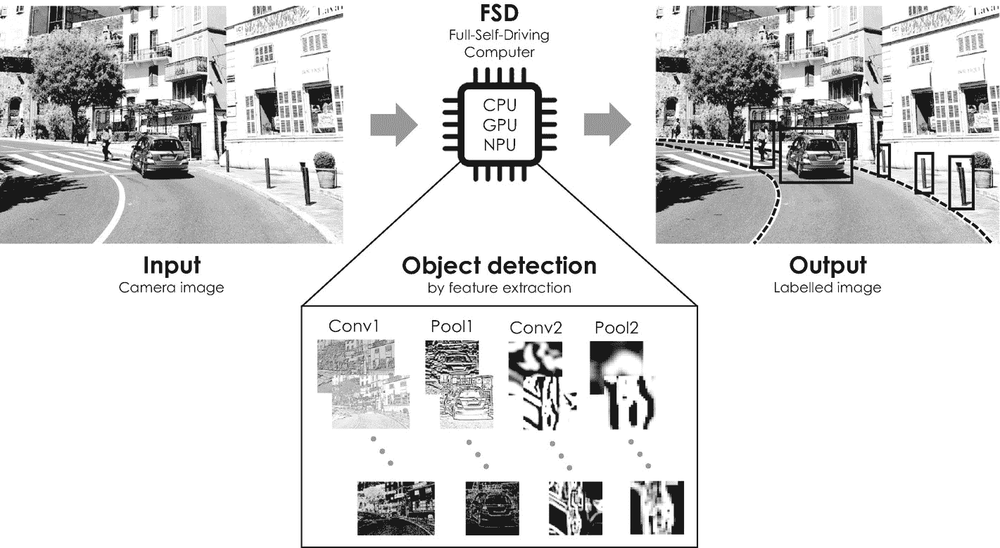
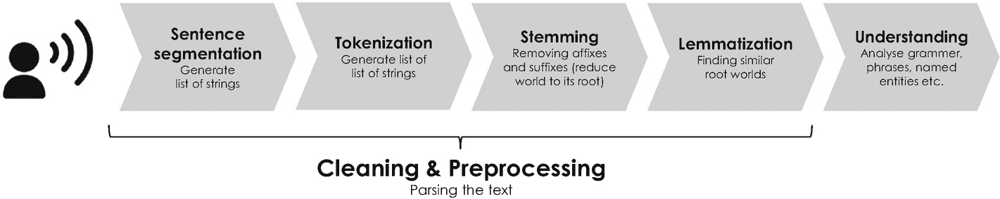
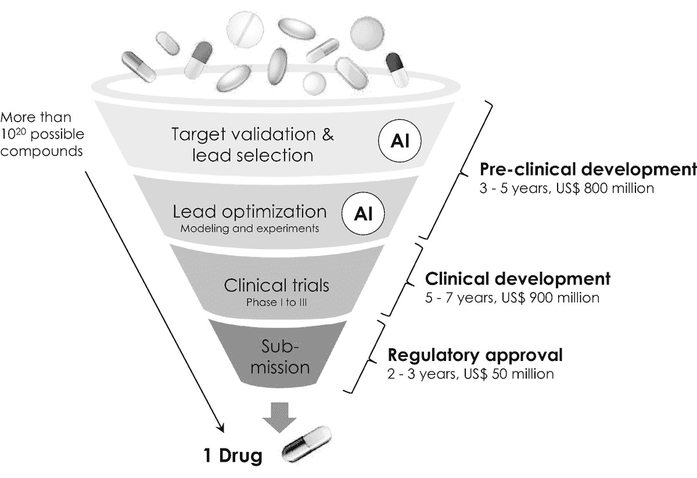

# 计算机视觉：自动驾驶

自动驾驶是计算机视觉的第三项应用，值得提及并详细阐述。尽管自动驾驶汽车常被视为非常新颖的技术，但研究人员和工程师已经为此努力了三十多年。对计算机控制车辆的研究始于卡内基梅隆大学，1986 年他们制造了全球首辆计算机控制车辆，名为"Navlab 1"。`Navlab 1`由雪佛兰厢式货车改装而成，配备了五台计算机硬件机架，包括一个全球定位系统（`GPS`）。遗憾的是，这辆车受到各种软件限制，直到 20 世纪 80 年代末才完全投入运行。大约在同一时间，迪恩·波默洛在同一机器人研究所开始开发`ALVINN`，即"基于神经网络的自主陆地车辆"。`ALVINN`在驾驶室顶部安装了一台摄像机，专为道路跟随任务设计。它由一个由伊恩·古德费洛的反向传播算法训练的人工三层神经网络控制，能够以高达 70 英里/小时的速度行驶[90]。这是卡内基梅隆大学经过八年军方资助研究的结果。

另一辆具有历史意义且同样传奇的自动驾驶汽车于 1985 年出现在大洋彼岸的德国，由德国动态计算机视觉先驱恩斯特·迪克曼斯开发[91]。他重达五吨的改装梅赛德斯厢式货车名为`VaMoRs`（德语"用于自主移动和计算机视觉的实验车辆"的缩写），能够基于摄像机记录的图像序列的实时评估，自动控制方向盘、油门和刹车。`VaMoRs`成功展示了其在高速公路上高速行驶、在双车道公路上以 19 英里/小时的速度行驶并实现昼夜避障的能力。其运行同样基于一个控制这辆半自主车辆的学习机。

然而，自动驾驶的真正转折点出现在 2004 年的伊拉克战争期间，当时美国国防高级研究计划局（DARPA）提出使用此类车辆来提高士兵的安全性。自那时起，各种（半）自动化车辆被制造出来，除了知名汽车制造商外，Google Alphabet+Waymo、Amazon+Zoox、Argo AI、Lyft 和特斯拉等公司也纷纷进入这一全球业务。为了满足极高的安全标准，自动驾驶需要对一系列不同的传感器和控制单元进行冗余信号分析，包括摄像头、超声波和雷达传感器、车轮脉冲和转向角传感器以及导航系统。^(¹¹⁹) 即使在低级别的自动驾驶中，自动驾驶车辆也需要处理超过 10 GB/s 的数据量——这是一个非常庞大的数据量；相比之下，你的 32 GB 存储内存的智能手机如果以这种高速存储数据，不到四秒就会存满。最高级别的全自动驾驶汽车甚至预计需要高达 100 GB/s 的带宽来运行。为了理解不同自动化程度之间的细微差别，SAE International（原美国汽车工程师学会）制定了以下五个 SAE 自动驾驶级别：

*   **0 级** – 无自动化：人类在没有自动化技术的情况下完全控制车辆。
*   **1 级** – 驾驶员辅助：计算机控制有限功能，例如自适应巡航控制或限速器，但一次仅控制一项功能。
*   **2 级** – 部分自动化：车辆具有组合的自动化功能，例如加速和转向，可以同时启用。
*   **3 级** – 条件自动化：汽车自动化所有安全功能。驾驶员无需监控环境，但必须准备好在出现问题时进行干预。
*   **4 级** – 高度自动化：汽车通常可以自动驾驶，但在极少数情况和场景下，驾驶员需要参与。
*   **5 级** – 完全自动化：自动驾驶的圣杯，汽车完全自主，除非驾驶员愿意自己驾驶，否则无需做任何事。

由于解决自动驾驶任务需要解读海量数据，人们普遍认为人工智能是实现完全自动化最有前景的方式。从技术角度来看，当前主要有两种基于人工智能实现 SAE 5 级自动驾驶的方法，它们在用于确定物体距离和速度的传感器方面有所不同。(1) 基于摄像头的方法仅依赖光学摄像头和雷达，而(2) 基于激光雷达的方法则结合使用激光扫描仪、摄像头和雷达来导航自动驾驶车辆。在这里，LiDAR 代表"光检测与测距"，指的是一种通过用激光照射物体并用传感器测量其反射来测量物体之间空间距离的方法。这两种技术最著名的支持者分别是特斯拉（第一种方法）和 Waymo（第二种方法）。

特斯拉的自动驾驶方法非常独特，与 Waymo 及其他汽车制造商完全不同，因为他们既不使用激光雷达进行距离探测，也不使用高清导航地图。特斯拉采用了一种完全基于视觉的方法，涉及基于人工神经网络对来自八个摄像头的原始视频流进行实时处理和分析。为了处理如此大量的数据，特斯拉开发了自己的"全自动驾驶"或`FSD`计算机，用于处理来自 8 个摄像头、12 个超声波传感器、1 个雷达传感器以及 GPS 和导航系统的地图数据。特斯拉`FSD`计算机的最大输入速率达到每秒 25 亿像素，这大约相当于每秒 1200 张全高清图像（一张"全高清"图像定义为包含 1,920×1,080 像素）。自 2012 年`AlexNet`（一个拥有 8 层和超过 6000 万个权重的卷积神经网络）赢得 ImageNet 竞赛[92]并超越人类基准[93]以来，这些网络已成为图像分类和物体识别的首选方法。^(¹²⁰) 因此，特斯拉的`FSD`计算机配备了两个模拟卷积神经网络的冗余 NPU。^(¹²¹) 整个流程如图 4-16 所示。每个 NPU 包含超过 60 亿个晶体管，每秒可执行超过 72 万亿次加法和乘法运算。关于特斯拉`FSD`计算机的更多技术信息，可参阅例如[95, 96]。

**图 4-16** – 特斯拉自动驾驶系统示意图。`FSD`计算机输入不同摄像头的图像；运行不同的物体识别算法，例如道路预测（虚线）；并在输出图像中标记检测到的物体。

但这并非特斯拉创新性自动驾驶方法唯一有趣的方面。第二个方面是关于 FSD 计算机中 NPU 的训练。为此，特斯拉建立了一整套 IT 基础设施和生态系统，从道路上的车辆收集原始视频流和数据，以迭代方式提高其自动驾驶仪的性能。这些数据在一个大型全栈式共享骨干网络（类似于云）中进行分析，该网络包含不同的残差网络，特斯拉称之为“HydraNets”。每个`HydraNet`都是一个共享骨干网络，它对自动驾驶任务进行子采样，并专注于优化特定的子任务，例如标注交通标志、车道线、道路标记，或预测道路布局以优化车辆的遥测数据。特斯拉敏捷且迭代的软件开发流程依赖于快速原型设计和测试。该流程通常分为三个主要步骤：

1.  第一步是开发某个功能的第一个近似版本，并使用`HydraNet`数据引擎对其进行训练，以便为 FSD 中不同的卷积网络找到一组合理的初始权重。
2.  然后，这个近似版本通过无线软件更新部署到车队，但不会直接激活。它是在*影子模式*下运行的，这使得可以在真实条件下进行进一步测试。此模式还会收集软件仍然表现异常、运行不正确的交通状况的照片和视频流。^(¹²²)
3.  第三步涉及标记收集到的数据，并将其作为额外的示例纳入特斯拉`HydraNet`数据引擎的训练数据集中。这些额外的训练数据随后作为输入，用于通过相应的`HydraNet`进一步优化近似软件模型。

这个三步流程有时被特斯拉称为*主动学习*，并会重复进行，直到软件能够在影子模式下记录的所有真实条件下可靠、安全地运行。一旦训练完成，软件的最终版本将通过无线更新部署到车队，同时影子模式被停用。多年来，特斯拉不断优化这一软件开发流程，并通过其自动驾驶仪从超过 50 个国家累积了超过 10 亿英里的数据。这些大数据未来可能会成为相对于其他汽车制造商的关键竞争优势^(¹²³)。

与特斯拉不同，`Waymo`和大多数传统汽车制造商采用基于激光雷达的自动驾驶方法。`Waymo`，前身为谷歌的自动驾驶汽车项目，目前是位于加利福尼亚州山景城的`Alphabet`（谷歌母公司）的美国子公司，旨在根据其自身信息打造“世界上最有经验的驾驶员™”。其产品组合包含两项服务：一项名为“`Waymo One`”的商业自动驾驶出租车服务，以及一项名为“`Waymo Via`”的商业货物配送服务。`Waymo`的竞争优势在于其独特且高度精细的测绘技术，这些技术能帮助车辆即使在传统地理定位系统难以工作的区域（如隧道或摩天大楼之间）也能导航。`Waymo`的技术套件由四个定制构建的关键组件组成：（1）用于生成高精度环境地图的激光雷达扫描仪，（2）视觉摄像头，（3）雷达传感器，以及（4）一个基于 AI 的计算平台[97]。其最新的第五代“`Waymo Driver`” [98]于 2020 年首次安装在旧金山湾区部署的一系列全电动`Jaguar I-Pace`车辆上。该系统配备了四个周视激光雷达，以提供无与伦比的覆盖范围和宽视场角，用于短距离探测。此外，它还在车顶的“`Waymo Dome`”盒子中安装了一个 360 度激光雷达，可提供车辆以及周围行人和物体的 300 米鸟瞰视图。该系统辅以 29 个视觉摄像头，用于 360 度和周边远距离探测，其中 16 个位于穹顶的激光雷达下方。另有 13 个摄像头集成在车身周围，其中一些能够以高分辨率看到超过 500 米远的距离。周视和周边视觉系统与六个高分辨率成像雷达协同工作，这些雷达能够在雨、雾、雪等恶劣天气条件下跟踪静止和移动的物体。由于海量的感官数据，`Waymo`开发了一种完全不同的环境数据处理方法，称为“`VectorNet`” [99]。这个相当新的机器学习模型首先将从其高精度地图（如车道、停止线和交叉路口）获得的语义信息转换为向量，即具有长度和方向的几何对象。然后将这些向量输入一种特殊的人工神经网络，称为*层次图神经网络* [100]，该网络能更好地捕捉各种向量之间的关系，因为其神经元通常不再按层组织，而是分布在一个网络——即所谓的*图*——中。例如，当汽车进入交叉路口或行人接近人行横道时，就会发生这种物体轨迹与道路特征之间的关系。`Waymo Driver`中使用的特定图被特意选择用来最佳描述不同感官输入之间非常复杂且高度相互依赖的关系。作为`Alphabet`的一部分，`Waymo`使用谷歌强大的云计算基础设施来访问不同的`TPU`以训练其图神经网络，这支撑了公司达到`SAE`（美国汽车工程师学会）5 级自动驾驶的雄心壮志以及最终的自动驾驶技术领导地位的主张。从 2020 年 10 月开始，`Waymo`宣布将在短期内向其打车服务的所有客户开放完全无人驾驶服务，前排座位上无需安全驾驶员[101]。

由于自动驾驶技术整体市场已变得越来越模块化，像`Nvidia`这样的成熟微芯片制造商最近也开始投资这项技术。根据具体的自动驾驶级别，`Nvidia`在其`DRIVE AGX`系列中提供一整套基于摄像头和激光雷达的自动驾驶计算机^(¹²⁴)。其最新的芯片组`Nvidia DRIVE AGX Orin`已于 2019 年发布，被设计为一个可从`SAE`（美国汽车工程师学会）2 级扩展到 5 级的自动驾驶平台[102]，这对于那些决定不自行开发该技术的传统汽车制造商来说尤其具有吸引力。根据其自身信息，`Nvidia`目前正在与大众、丰田、奥迪、梅赛德斯-奔驰、宝马和沃尔沃等公司合作。

### 4.4.3 医疗保健

人工智能在过去几年中也已进入医疗保健行业，早期采用者和初创公司开始将各种机器学习算法应用于一系列医疗问题。其中大多数属于医学影像中的图像识别和特征检测范畴，旨在协助医生诊断某些疾病[[103]](#505424_1_En_4_Chapter.xhtml#Par343)。

一个例子是美国的“阿尔茨海默病神经影像学倡议”（ADNI），该项目位于旧金山加州大学旧金山分校放射学与生物医学影像系。尽管目前尚无治愈阿尔茨海默病的方法，但最近已有多种药物问世，有助于延缓疾病进展并改善患者的医疗状况。为此，需要尽早开具这些药物，因此在阿尔茨海默病的早期阶段进行诊断至关重要。这正是 ADNI 图像识别算法的用武之地。它通过分析正电子发射断层扫描（一种分析人体软组织疾病如阿尔茨海默病的首选技术）记录的“医疗大数据”，协助医生诊断这种无法治愈的疾病。ADNI 模型能够在临床诊断前最多六年诊断出阿尔茨海默病，准确率超过 92%。ADNI 的计算机科学家之一 Jae Ho Sohn 这样描述这一用例：这是深度学习的理想应用，因为它特别擅长发现非常细微但弥漫性的过程。人类放射科医生在识别像脑肿瘤这样微小局灶性病变方面非常强大，但我们在检测更缓慢、整体性的变化方面存在困难。考虑到深度学习在这类应用中的优势，尤其是与人类相比，这似乎是一种自然的应用[[109]](#505424_1_En_4_Chapter.xhtml#Par349)。

图 4-17

例如亚马逊 Alexa 所使用的自然语言处理的五个基本步骤

类似的公司、研究计划和合作在全球范围内比比皆是——另外两个例子是英国的初创公司 Kheiron Medical 和 Oxford Heartbeat——这再次证明了人工智能在医疗保健领域的巨大潜力及其对社会的有益影响。据预测，该行业到 2026 年将达到 1500 亿美元的规模。关于更多示例，请参见例如[[110]](#505424_1_En_4_Chapter.xhtml#Par350)。

### 4.4.4 自然语言处理

*自然语言处理*从一开始就吸引了人工智能领域众多研究者的关注。受到 Joseph Weizenbaum 的开创性工作以及 1966 年推出的 ELIZA（见第 4.1.2 节）的启发，微软在 2014 年发布了其第一款聊天机器人。这款聊天机器人名为“小冰”，并集成到了腾讯的微信应用中——微信至今仍是中国最大的社交信息服务商。小冰在短短几年内迅速吸引了超过 4000 万用户，据报道，到 2019 年其在全球拥有超过 6.6 亿用户。在小冰成功推出两年后，微软准备在美国复制这一成功故事，并在微博客和社交网络服务 Twitter 上推出了聊天机器人“Tay”。微软表示：“你跟 Tay 聊得越多，它就越聪明，学会通过随意和有趣的对话与人互动。”然而，这场原本旨在探索对话理解的实验很快就变成了微软的一场灾难。仅仅用了不到 24 小时，Tay 就被调教得开始散布不那么有趣、甚至是种族主义和性别歧视的信息，这导致了它在公开发布后不久就被关闭。然而，从科学角度来看，此类失败以及其他不成功的项目非常重要，因为它们使开发者能够从中学习，并迭代地一代代改进产品和服务。

自然语言处理通常分为五个步骤，如图[4-17]所示。整个过程始于*分词*，它根据标点符号、段落和其他文本特征将书面文本分割成更小的字符串。之后，这些字符串被解析并进一步分割成语法成分，例如单个名词、动词、数字和标点符号，这个过程称为*标记化*。这对于机器学习算法来说尤其具有挑战性，因为书面文本通常存在语法和拼写错误等问题。第三步称为*词干提取*，指的是通过移除词缀和词尾来将单词还原为其词根——例如，“reading”一词通过此过程转换为“read”。最后一个预处理步骤称为*词形还原*，涉及寻找具有相同语义词根的其他单词。一个例子是单词“better”，它可能被词形还原为“good”。这是任何自然语言处理算法的最后一步，也可能是最具挑战性的步骤的先决条件，即理解语言以得出某些结论并采取行动。此步骤通常采用无监督学习方法和其他深度学习模型，例如循环神经网络或聚类算法，来分析单词序列并在书面文本中识别模式和簇。

与*语音识别*技术相结合，自然语言处理如今已成为一项相当普遍的技术——只需想想智能手机的语音拨号功能即可。有趣的是，第一个语音识别系统实际上是在 1952 年由美国著名的贝尔实验室开发的，名为“Audrey”（自动数字识别系统）。Audrey 能够识别从零到九的口头数字发音，基于对所谓*音素*（语音的基本单位）的检测，准确率超过 90%。这对于语音识别的发展是重大且同样令人瞩目的一步，因为当时的计算能力和内存容量都非常有限。

如今，语音识别与自然语言处理技术的结合，正被用于实现*虚拟助手*，它们会随着你的每次使用而变得更好、更智能。苹果的 Siri、微软的 Cortana、谷歌 Home 以及亚马逊的 Alexa —— 其名称致敬了著名的亚历山大图书馆 [111] —— 都只是最受欢迎的几个例子。此类助手近期也已进入汽车领域，协助驾驶员操控车辆，或执行某些车载信息娱乐及导航功能。另一个例子是 2015 年由 Roy Raanani 创立的以色列初创公司 Chorus，它利用自然语言处理技术分析销售人员的通话录音。该平台负责录制、整理并转录通话内容，以便学习能够推动及改善销售的最佳实践 —— 即特定的短语和文本模式。虚拟助手和聊天机器人^(¹²⁵)也可用于*语音商务*，这是一种允许用户通过语音指令在线搜索和购买商品的技术。这些系统能够以零边际成本，同时与近乎无限数量的客户进行沟通。由于这项技术消除了传统呼叫中心和客服中心中的人力瓶颈，该行业预计到 2023 年市值将达到 800 亿美元 [112]。

虚拟助手还可以通过自动转录会议，并将可语音搜索的版本分发给无法参会的人员，从而简化组织的内部流程。这类智能体也将对营销行业产生深远影响。例如，毅伟商学院的营销学荣誉教授 Niraj Dawar 认为：“AI 助手将改变公司与客户连接的方式。它们将成为人们获取信息、商品和服务的主要渠道，而营销将变成一场争夺它们注意力的战斗。” [113]

### 4.4.5 能效

由于其庞大的数据中心设施，谷歌是全球最大的电力消费者之一。其数据中心内安装的计算机和服务器需要持续冷却，以使其保持在适宜温度，而无论设施外部的气候条件如何 —— 这也是为什么谷歌及其他 IT 公司近年来开发了高效服务器和计算硬件的原因。然而，现代数据中心的能耗依然巨大，即便能效上的微小改进也能带来可观的成本降低。正因如此，谷歌在 2014 年以超过 5 亿美元收购了总部位于伦敦的初创公司 DeepMind Technologies。当时，DeepMind 正在研究一种能优化数据中心设施能耗的机器学习算法 [114]。他们的深度神经网络集成模型，利用数千个传感器收集的历史数据进行训练，这些传感器测量的数据包括（但不限于）IT 负载、冷却泵速度、冷水机、冷却塔以及湿球温度 [115]，并用于预测特定操作条件下的未来*电能使用效率*。^(¹²⁶) 这些预测旨在模拟不同操作的影响，从而使 DeepMind 能够选择最佳方案及相应的能源组合 —— 这是一个基于信息透明度进行数据驱动决策的绝佳示例。通过采用深度神经网络并创建更高效、更具适应性的框架来理解数据中心动态，谷歌在 2016 年成功将冷却能耗大幅降低了 40% [116]，同时将风能的价值提升了约 20% [117] —— 这是迈向具有更优碳足迹的超高效数据中心设施的重大突破。这个例子突显了人工神经网络在优化能效方面的巨大潜力。希望此例也能为其他同样消耗大量电力、热能及其他能源的行业（如汽车制造业）提供蓝图。

### 4.4.6 药物发现

人工智能一个特别令人振奋、且对社会财富与健康有着巨大影响的应用是针对一系列（不治）人类疾病（包括阿尔茨海默症及其他神经退行性疾病）的*药物发现*。这些疾病通常源于我们 DNA 中^(¹²⁷)控制着体内关键过程（如基因调控、蛋白质合成和细胞内信号传导）的突变基因。由于功能失常的基因会引发各种疾病，它们通常作为*靶点*，用于开发能够通过修复相应的功能失常来为患者提供治疗效果的化学物质。这类化学物质在药理学上被称为*化合物*或*先导物*。一个获得监管机构（如美国食品药品监督管理局）市场批准的先导物被称为*药物*，并可在药店和药房商业购买。

图 4-18

通用的药物发现流程，显示了不同阶段通常所需的时间和资金。人工智能 (AI) 能够通过协助先导物选择和优化阶段来减少时间和成本。

传统上，药物发现分为两个连续的阶段：（1）临床前开发和（2）临床阶段。这两个阶段通常涉及大量的试错过程，因此非常耗时、昂贵且效率低下。临床前阶段涉及靶点发现与验证以及先导物的选择与优化。临床阶段包括对选定患者进行的多次临床试验，并以向监管机构提交药物申请而告终。整个流程如图 4-18 所示，通常需要耗费 10 年以上时间，研发费用高达 18 亿美元甚至更多，才能最终获得药物的市场批准。

由于大多数药物在临床阶段失败，人工智能尤其针对药物发现过程中的这个关键阶段。它通过协助选择合适患者、规划整个临床试验以及在流程早期尽可能识别出最有效的先导化合物来加速研究 [118, 119]。人工智能协助搜索、选择和优化值得在实验室中进行研究和实验的化合物。此外，它还被用于分析数十亿种具有不同医疗特性的潜在化学品，以应用于患者。因此，药物发现可以被视为一个多目标优化问题，非常适合通过人工智能实现某些步骤的自动化。

这就是为什么众多制药公司一直在建立庞大的化合物数据库，这些数据库会根据全球专业期刊发表的研究发现和成果频繁更新。为了使用最先进的机器学习算法处理化合物，它们通常基于一种名为`SMILES`（简化分子线性输入规范）的编码方案被特征化或转换为文本。一个化合物的`SMILES`字符串由代表化学元素的字母和编码不同元素之间化学性质及键合（“连接”）的符号组成。例如，水的`SMILES`表示（化学符号为`H[2]O`）可以写作`[H]O[H]`，因为水由一个氧原子和两个氢原子构成，分别用`O`和`H`表示。随后，这些字符串被用于训练人工神经网络，以便学习最成功的药物，并根据化学规则和识别出的关于哪些元素（符号）可能相互跟随的模式来预测新药设计——如果你愿意，这可以说是“医学语言处理”的一种创新方法。早在 1986 年，人工神经网络就已经被应用于药物发现[120]，以响应著名的反向传播算法的发展，正如我们在前几节中学到的，该算法使得有效训练此类网络成为可能。自那以后，众多研究人员通过使用更大的化合物数据库和深度学习模型，更高效地在更大数据库上训练人工神经网络，从而改进了这一方法[121–124]。

成功将这种创新方法应用于药物发现的一家公司是英国初创公司 Benevolent AI。这家成立于 2013 年的公司，采用不同的机器学习算法来构建数据库、在知识图谱中可视化相关出版物，并预测新化合物。其中一些算法用于自动挖掘当前的科学文献，并将最相关的文献保存到化合物数据库中；另一些则用于根据从这些数据中得出的模式来设计新化合物。为此，Benevolent AI 的研究人员构建了一个循环神经网络，例如，该网络基于科学文献中报告的数百万现有化合物的`SMILES`数据进行了训练，这些化合物随后被列在其数据库中。这个预训练网络被用来根据从训练数据中得出的统计上最相关的模式，逐字符地迭代预测新的`SMILES`字符串。生成的字符串对应真实空间中的某种化合物，而该化合物可能通过其他方式无法被发现。它可以被化学合成，随后在实验室中针对不同的医学特性进行评估，例如其在人体内的有效性、选择性、毒性以及潜在的副作用。这种表征结果通过采用强化学习技术作为微调人工神经网络的输入，这一反馈过程有时被称为`多参数优化评分`。通过这种方式，人工智能为 Benevolent AI 的研究人员提供了补充，使他们能够在药物开发过程的早期就专注于最佳化合物，从而大幅缩短开发时间并显著削减相关成本。Benevolent AI 还采用这种方法设计了一种针对 COVID-19[125]引起的急性肺部疾病的潜在疗法。据报道，COVID-19 这种致命的冠状病毒首先出现在中国湖北省，并在 2020 年导致全球超过 4300 万人感染和超过 116 万人死亡。^(¹²⁸) 这个例子和其他例子凸显了人工智能在药物发现方面的巨大潜力，并证明深度学习可以显著加快医疗行业的开发、优化及其他业务流程。

### 4.4.7 金融服务与保险

金融服务与保险行业实际上是人工智能最早的应用领域之一，部分原因是 Klarna、Revolut、N26 等不同金融科技公司以及其他旨在颠覆传统银行机构的在线银行和支付服务提供商的兴起。例如，美国最大的投资银行、总资产超过两万亿美元的摩根大通，正在将其人工智能应用推至投资银行业务之外，并最近在其资产管理业务部门内设立了一个专门的股权数据科学部门。

#### 金融服务与保险：网络安全

他们的一项项目涉及网络安全，因为摩根大通在 2014 年遭遇了一次重大数据泄露事件。在那次网络攻击中，据报道黑客入侵了与超过 8300 万个银行账户相关的客户数据，这被认为是历史上针对组织 IT 系统最严重、规模最大的入侵之一[126]。幸运的是，尽管与这些账户相关的登录信息并未泄露，但黑客获取了客户的姓名、电话号码以及电子邮件和邮政地址，这随后引发了公众对潜在钓鱼攻击的严重担忧。自那以后，摩根大通投入巨资升级其 IT 系统，同时正在探索人工智能在网络安全方面的一系列应用。其中一项项目是关于实施一个早期预警安全系统，以便在恶意行为者开始使用钓鱼邮件针对特定员工之前，检测恶意软件、特洛伊木马和其他高级持续性威胁[127]。为此，他们实施了一个大型在线存储库，用于收集和存储与摩根大通在线流量相关的所有原始数据。这些数据首先存储在一个数据湖中，作为循环神经网络架构的输入，该网络学习在线流量的平均数据大小、主机名、请求频率和其他关键特征。随着越来越多的数据通过该网络，它能够了解欺诈性和非欺诈性（“正常”）流量的样貌。每当恶意行为者准备发起网络攻击时，在线流量就会发生变化，循环神经网络会偶尔检测到异常活动，并立即通知银行的安全人员启动相应的反制措施。据报道，该早期预警系统还采用了自然语言处理算法，用于寻找模式，例如不匹配的互联网地址、拼写和语法错误，以检测来自恶意行为者的电子邮件。这是循环神经网络日益流行的一种应用，属于`异常检测`范畴，用于识别欺诈性银行活动并降低相关风险——这种方法对于所有在网络空间面临风险的行业也高度相关。

#### 金融服务与保险：新闻分析与智能定价

`新闻分析`和`智能定价`是另外两个例子。`摩根大通`及其他金融机构正着手运用人工智能。`新闻分析`通常基于自然语言处理算法，这些算法会扫描在线媒体，寻找与特定客户、行业或投资决策相关的新闻。这些扫描结果经过分类，以创造信息透明度，为数据驱动的决策奠定基础。据报道，全球投资管理公司`贝莱德`（全球最大的资产管理公司，管理资产超过`6.8 万亿美元`）也为其名为`Aladdin`^(¹²⁹)的风险管理系统采用了`新闻分析`技术，该系统由`贝莱德解决方案`运营[128]。金融产品及服务的`智能定价`，是指根据多种客户和市场变量（如时段、地点、实时需求及客户的购买历史）实时计算最优价格。此类算法为从规则驱动到数据驱动的定价模型铺平了道路，使机构能够通过个性化和情境化的定价来提升盈利能力和竞争力。这类算法通常采用多项式回归模型、集成方法和人工神经网络，以识别客户行为数据中的特定模式。当然，数据驱动的`智能定价`和个性化报价也与众多其他业务领域相关，包括超市和在线仓储。

希望你喜欢我们穿越激动人心的人工智能世界及其多方面应用的旅程。作为一种通用技术，人工智能被用于推动收入和利润增长，或建立全新的商业模式——它是第三种，也可能是用途最广泛的数字技术，能够实现私营和公共部门组织的数字化转型。

## 4.5 关键要点

*   人工智能指的是可由计算机执行的软件，具备像人类一样学习和推理的能力。这种软件将现实（商业）问题转化为数学模型，技术上称为算法。

*   人工智能分为两个主要子类别：(1) 机器学习：指一组无需显式编程就能学习的能力的算法。(2) 深度学习：采用人工神经网络处理数字信息。为了正常工作，人工神经网络必须通过大型训练数据集（大数据）进行训练。

*   机器学习建立在两个关键概念之上：(1) 成本函数或优化目标，它用数学方式描述现实问题；(2) 优化算法（如梯度下降），它能够最小化成本函数并解决当前问题。最流行的算法有回归、分类、聚类和关联。

*   深度学习采用人工神经网络，即由软件模拟的、相互连接的神经元层状结构，排列成输入层、输出层以及一个或多个用于特征检测的深层。根据神经网络的具体拓扑结构，可以区分为(1) 卷积神经网络、(2) 循环神经网络、(3) 生成对抗神经网络、(4) 推荐系统和(5) 自编码器。

*   人工智能采用多种学习策略来训练算法，即：(1) 使用标记数据的监督学习，(2) 使用非标记数据的无监督学习，(3) 深度学习，(4) 集成方法，以及(5) 强化学习。

*   人工智能最流行的应用包括大数据分析、优化与预测、通过情感分析和推荐实现个性化、特征检测与模式识别、自然语言处理、包括图像识别和目标检测的计算机视觉，以及异常和欺诈检测。

## 4.6 人工智能框架

你是否正在考虑在你的组织中使用人工智能，或将其应用到自己的用例中？如果下面对以下实施清单中大部分关键问题的回答是“是”，那么人工智能很可能有助于你实现自己的商业构想或用例。

1.  你的用例是关于什么的？它是否属于以下通用类别之一？是 □ 否 □
    *   大数据分析
    *   建模与仿真
    *   数据与文件压缩
    *   优化与预测
    *   产品与服务个性化
    *   特征检测与模式识别
    *   情感分析与推荐系统
    *   自然语言处理与语音识别
    *   计算机视觉（包括图像识别与目标检测）
    *   聚类与分类（包括异常和欺诈检测）

2.  之前是否有类似的使用案例通过人工智能解决过——表 4-2 中是否提及？是 □ 否 □

3.  （大）数据分析是否已经在你的日常决策过程中发挥关键作用？是 □ 否 □

4.  对于你的应用而言，所需的大数据（从三个 V，即数据量、速度和多样性的角度来看）是否已经从内部或外部数据库可用？是 □ 否 □

5.  用于训练你模型的可获取数据量是否呈指数级大于搜索空间（即针对你问题的可能解决方案的数量）？是 □ 否 □

6.  在分析你的大数据时，你期望看到什么样的模式、结构或特征？你是否具备判断算法得出的结果是否合理或仅仅是统计副作用的专业知识？是 □ 否 □

7.  是否有定期更新数据的自动化流程？是 □ 否 □

8.  你是否能够获取实施你的应用或用例所需的所有人力和计算资源（硬件和软件）？是 □ 否 □

    规划实施时需考虑的进一步问题：
    *   预计谁会使用实施的算法，他们的期望是什么？
    *   谁将负责维护你的人工智能服务，包括硬件基础设施和共享软件工具？
    *   你的应用是需要标记数据还是非标记数据来训练你的人工智能算法？
    *   在处理大数据时，你需要遵守哪些监管框架？

## 4.7 延伸阅读

在本章末尾，如果你希望更深入地了解人工智能、机器学习及其应用，我想为你提供一些延伸阅读建议：

*   Taulli, T.: 《人工智能基础：非技术性入门》。Apress 出版社，2019 年。
*   Thamm, A. 等：《终极数据与 AI 指南：关于人工智能、机器学习与数据的 150 个常见问题解答》。Data AI 出版社，2020 年。
*   Hastie, T. 等：《统计学习基础：数据挖掘、推断与预测》。Springer 出版社，2009 年。
*   Nilsson, N. J.：《探寻人工智能：思想与成就的历史》。剑桥大学出版社，2010 年。
*   Chollet, F.：《Python 深度学习》。Manning 出版社，2017 年。
*   Hawkins, J. 和 Blakeslee, S.：《智能时代：新认知如何催生真正的智能机器》。圣马丁格里芬出版社，2005 年。

