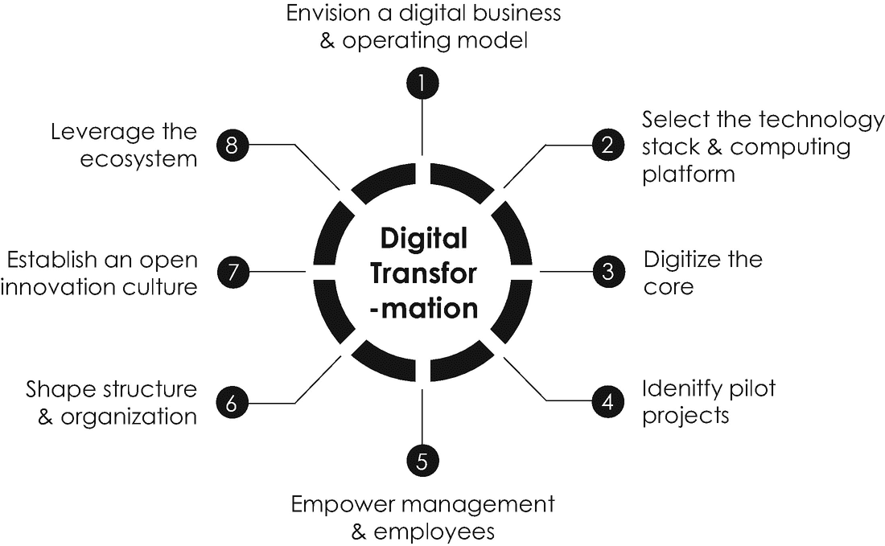
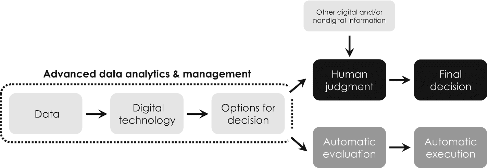
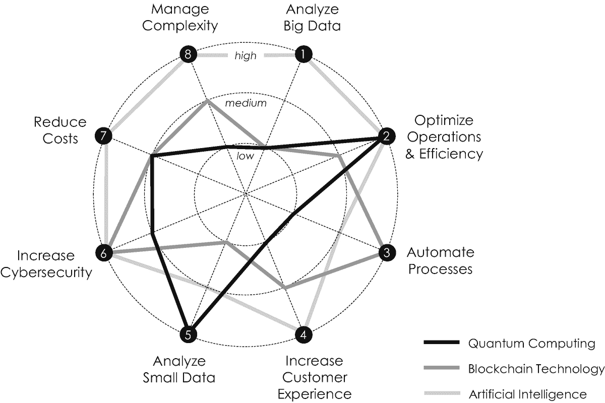
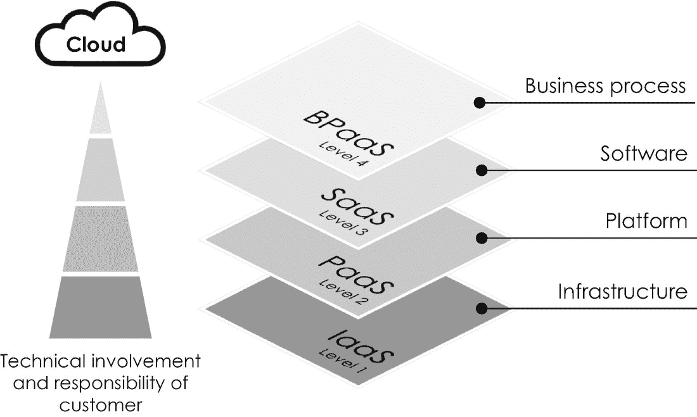
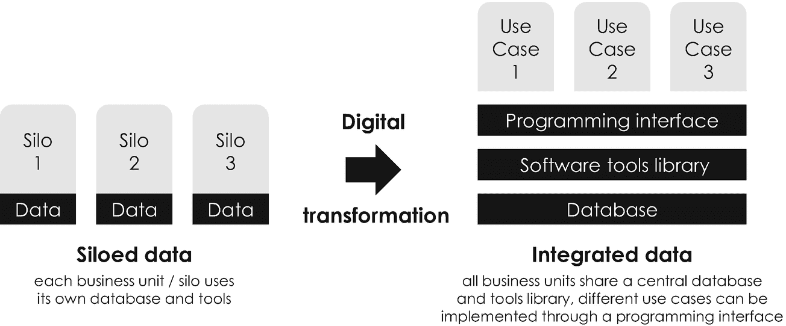
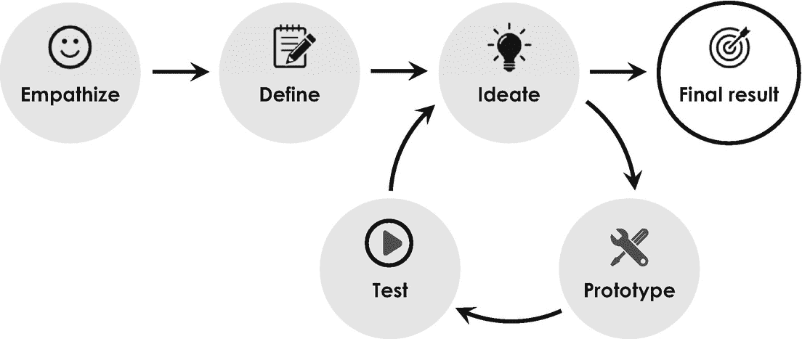

# 5. 你的数字化行动计划

前几章让你深入了解了推动私人和公共组织数字化转型的三项最重要的数字技术：量子计算、区块链技术和人工智能。每章末尾以示例方式描述的不同应用和用例表明，每项技术不仅能够优化现有产品和服务，还能在成熟市场或全新市场及环境中探索新的增长机遇。

第 2 章“量子计算”将量子计算介绍为一种变革力量，适用于那些利用（超）计算来解决高度复杂的优化、建模和仿真问题的组织。我们还了解了区块链技术的深远潜力及其独特能力：在不可信环境中建立信任，并实现两个或多个交易伙伴之间经过加密保护的价值转移。最后同样重要的是，我们研究了作为大数据分析、机器学习及其他应用基础技术的人工智能，这些应用使得大型数据集能够变现，并实现数据驱动——因而更加透明和客观——的决策流程。

为此，还有一个非常重要的问题有待回答：我们如何利用这些数字技术，开始对我们自身生态系统或组织的数字化转型？这正是本章的重点。我们将讨论一个易于使用的数字化行动计划，该计划将指导你完成自身的数字化转型，并介绍你的数字化议程中应考虑的八个关键维度，如图 5-1 所示。我们将首先深入探讨如何开发合适的业务和运营模式，这些模式由数字技术驱动，并由适当的技术栈和计算平台支持。之后，我们将讨论如何通过提供连贯且共享的数据平台来数字化组织的核心。我们还将了解识别合适试点项目的关键标准，以及赋能管理层和员工所带来的变革性（但往往被低估的）影响。此外，基于敏捷协作模式来塑造组织结构，对于成功完成数字化转型也至关重要。最后同样重要的是，我们将看到，成功的数字化转型依赖于一种开放创新的文化，这种文化通过将你的生态系统作为另一个关键维度，促进反馈和新想法的整合。

*图 5-1* — 数字化转型的八个关键维度

但在我们根据数字化转型的八个关键维度详细讨论这一数字化行动计划之前，先来看看微软的数字化转型案例有助于我们理解一些相似之处：2011 年，微软是一家疲态尽显的公司。它面临着一系列由互联网引发的严峻竞争威胁，并遭遇了严重的反垄断审查，这两者都对其现有业务模式构成了威胁。其传统的软件业务是将软件光盘运往全球各地，将 `Microsoft DOS`、`Windows` 和 `Office` 安装到每台计算机上。除了利用这一经典软件业务外，微软当时还在试验一项名为 `Microsoft Azure` 的小型云计算服务，用于按需交付软件和服务。然而，这个探索性项目被普遍认为是一个不盈利的失败品，这也是微软当时专注于挖掘其传统业务的原因。但时任微软服务器与工具事业部负责人的萨提亚·纳德拉（Satya Nadella）并不同意这一战略评估，他坚信云计算将是微软的未来。三年后，萨提亚·纳德拉接替史蒂夫·鲍尔默（Steve Ballmer）出任首席执行官，并在给员工的第一封邮件中强化了他的宏伟愿景，他写道：“我们的行业不尊重传统——它只尊重创新。[……] 我们的工作是确保微软在一个移动优先、云优先的世界中蓬勃发展” [1]。为了实现他清晰而令人信服的愿景，他在随后的几年里重新设计了微软的软件交付流程，将底层传统业务模式从“将软件安装在本地计算硬件上”转变为“通过云计算按需提供软件即服务”。为此，萨提亚·纳德拉扩大了数字试点项目 `Azure` 的规模，为其添加了越来越多的基于云的应用程序，例如 `Microsoft Office 365` 和 `Microsoft Dynamics`（一种企业资源规划和客户关系管理软件）。2018 年收购 `GitHub`（一个非常受欢迎的开源软件项目和工具在线存储库）进一步推动了他的战略。凭借他对云计算未来的清晰愿景和坚定信念，他成功地将微软转型为一家云软件公司。因此，在他担任首席执行官的的头三年里，微软的股价上涨了两倍。但这并非他议程上的最后一次数字化转型。受其好友、谷歌首席执行官桑达尔·皮查伊（Sundar Pichai）著名的“AI 优先”宣言^(¹³⁰) 的启发 [2]，萨提亚·纳德拉在 2018 年调整了自己的愿景，并规划了微软下一次转型为“智能云和智能边缘”计算提供商的计划 [4]，同时利用本书介绍的三项数字支持技术。他后来在接受采访时指出，“人工智能是运行时，它将塑造我们所做的一切” [5]——这是微软凭借其 `Azure` 云计算平台至今仍在非常成功地推行的一项数字商业战略。

我们可以从微软的数字化转型历程中学到什么？最重要的教训是，成功的新产品或服务并非没有创业风险，因而也并非没有财务风险。例如，亚马逊过去几年确实有过一些价值数十亿美元的惊人失败案例 [6]，例如 `Amazon Auctions`、`zShops` 和后来分别成为其极为成功的产品 `Amazon Marketplace` 和 `Amazon Alexa`/`Echo` 基础的 `Fire Phone`。亚马逊创始人杰弗里·贝佐斯（Jeffrey Bezos）曾在 2016 年致股东的信中就此发表过著名评论：

失败与发明是一对不可分割的孪生兄弟。要发明，就必须进行实验，如果你事先知道它会成功，那就不算实验。大多数大型组织都接受发明的理念，但不愿意忍受实现发明所必需的一系列失败实验。超额回报往往来自于逆常规思维而行，而常规思维通常是正确的。如果一项投资有 10%的机会获得 100 倍的回报，你应该每次都押注于此。但你十次中仍有九次会错[7]。

新的商业构想始终是对未来的假设，因此也是对客户未来可能需求的直觉判断。因此，大多数高管常常犹豫是否采用新技术并转型其业务，因为这些技术可能会威胁到现有的流程、业务和收入来源。

要学习的第二个教训是，数字化转型是一个旅程。这个旅程始于制定一个清晰且令人信服的愿景，一个战略目标，它能在员工中建立高度承诺，引导组织完成转型，并让所有利益相关者认为他们正参与一场激动人心的冒险——借用传奇的法国皇帝拿破仑·波拿巴的话来说，“领导者的角色是定义现实，然后给予希望”。领导者的愿景捕捉商业和社会中的关键趋势，并清晰地阐明这些趋势如何转化为一个能够为客户和其他利益相关者创造价值的整体运营模式。

从微软要学习的第三个教训是，数字化转型总是从在试点项目中探索新技术开始，这些项目偶尔可以扩大规模并推广，最终实现整个组织的转型。数字化转型并非止步于组织的层级结构，还涉及战略、文化、员工以及组织其他核心能力的重大变革。仔细审视之下，这并不令人惊讶，因为数字化转型是由数字技术推动的，而这些技术最终依赖于某种算法、程序或软件所促进的数据处理。但根据其复杂性，开发并直接向客户部署一个没有 bug 的软件几乎是不可能的。这就是为什么软件开发——以及类似的数字技术——提倡一种迭代式的产品创新和开发方法，这种方法由开放的创新文化和员工之间敏捷的协作方式所支撑。这就是为什么数字化转型会影响组织的所有维度，并且远不止是使用数字技术将以前基于纸质的流程数字化。

在比较微软的数字化转型之旅与其他公司的转型之旅时，你很快就会注意到，不幸的是，不存在一个放之四海而皆准的数字化转型方法。然而，下面的框架从八个关键维度描述了数字化转型，并可能很好地为你自己的数字化转型之旅提供指导。它聚焦于成熟公司（在数字化转型过程中需要继续运营现有传统业务）的数字化转型。

## 5.1 构想数字化战略

每个组织——无论是私营还是公共——的主要目的是创造、交付和获取价值。这种价值源于两个概念。第一个是*商业模式*，它定义了一个组织如何在经济、社会、文化或其他背景下创造和获取价值^((131))。第二个是组织的*运营模式*，它定义了组织向客户交付价值的特定方式——如果你愿意，可以称之为“完成任务的计划”。换句话说，商业模式定义了理论，而运营模式则捕捉了组织价值创造过程的实践。数字化转型就是通过利用数字技术的力量，重新思考和重新架构商业模式和运营模式。它通常旨在 (1) 通过简化内部流程来提高运营卓越性，或 (2) 增强客户体验[8]，从而将传统的商业模式和运营模式转变为数字化的。

### 5.1.1 构想数字化战略：开发数字化商业模式

从历史上看，构想一个能够创造可持续竞争优势^((132))的成功商业模式的过程，主要由两种方法主导：(1) 市场定位和 (2) 基于资源的组织观。第一种方法涉及寻找一个具有高进入壁垒的（行业）领域，并使产品和服务与竞争对手区分开来。第二种方法利用组织稀有且有价值的资产和能力，例如专利或高度专业化的机器，这些是竞争对手难以模仿的。鉴于来自数字化商业模式的竞争日益激烈，这两种方法如今似乎都不适用，因为数字化组织通过平台和网络而非实物商品和基础设施来创造价值。

因此，构想数字化商业模式的最佳途径是从以客户为中心的视角出发，旨在通过更好的客户体验来取悦客户。一种有助于更好地了解客户（包括其消费行为和动机）且富有洞察力的方法是*客户旅程*，即对客户在使用特定产品或服务时所经历体验的深入、逐步分析[11, 12]。在整个客户旅程中，客户处于“宇宙的中心”，因为它始于客户而非产品或服务。在过去几年中，它已被众多组织成功用于识别未满足的需求和其他客户不满意的来源。这两种洞察都极具价值，因为它们揭示了现有产品和服务的优缺点，从而开辟了新的商业机会。构想数字化商业模式的下一步是将从客户旅程中得出的不同见解整合起来，并问自己如何改善客户体验，以及需要哪些（新的）产品和服务来实现这一目标。例如，众所周知，亚马逊经常进行客户旅程分析，以在零售领域提供最佳的客户体验^((133))。

克莱顿·克里斯坦森，这位我们在本书引言章节中认识的著名哈佛经济学家，开发了一种非常流行的方法。该方法与客户旅程互补，用于捕捉客户需求并推导出相应的商业模式。在问自己为什么客户购买某种产品而不是另一种时，他意识到客户实际上并不是购买产品，而是“雇佣”产品来解决特定问题。换句话说，客户雇佣产品来完成一项任务，这就是为什么他的概念如今被称为客户的“待办任务”（`job to be done`）[14]。待办任务有两个维度：(1) 功能维度，衡量待办任务是否已完成；(2) 情感或社会维度，描述拥有和使用特定产品或服务的感觉。例如，考虑购买一辆电动汽车。在此情况下，功能待办任务是实现零排放的移动，从一点到达另一点。其情感和社会层面可能在于向所有人展示自己处于技术前沿，或电动汽车其他不可衡量的方面，如社会地位和（财务）福祉。根据克莱顿·克里斯坦森著名的颠覆性战略理论[15]，一个成功的商业模式完美地围绕客户的待办任务展开，这就是为什么这常被描绘为创新中的“北极星”。换句话说，任何能让客户更好地完成其任务的事物，都是组织应关注的创新，因为它们为现有产品或服务提供了巨大的增长机会。将客户置于“你的宇宙中心”是推进现有商业模式或构想新商业模式及其基础战略的重要前提。^(¹³⁴)

在此背景下，重要的是要记住，只有少数幸运的公司能够以一个最终带来成功的数字商业模式起步。大多数公司最初会采用应急策略（`emergent strategy`）探索不同的机会，直到找到真正有效的方法。这就是为什么你应该准备好尝试不同的数字技术和机会，随时准备 pivot（转向），并持续调整你的方法，直到你找到一个真正有效的方法——此时，应急策略就变成了新的深思熟虑的策略。

用克莱顿·克里斯坦森的话来总结，“大多数产品之所以失败，是因为公司从错误的角度开发它们。公司过于专注于他们想卖给客户的东西，而不是客户真正需要的东西。所缺失的是同理心：对客户试图解决什么问题的一种深刻理解” [52]。我希望从这些思考中获得的见解能够激励并帮助你，为你自己的数字化转型之旅构想一个数字商业模式。

### 5.1.2 构想数字战略：推导数字运营模式

一旦定义了数字商业模式，重要的是要问自己：你将如何向客户交付价值？哪种运营模式最能支持这个价值创造过程？这正是数字技术发挥作用的地方。理解数字运营模式特征的最佳方式是将它们与那些不基于数字技术、不以数据为中心的传统模式进行比较。传统与数字运营模式的根本区别源于其利用数据的特定方式。传统运营模式将数据视为支撑其运营的“必要之恶”，而没有从中获取经济价值。随着产品、服务、客户数量以及与之相关的数据量增加，传统运营模式最终会因无法管理复杂性而受到限制。对于那些不以数据为中心的商业模式，在某一点上，要在整个组织中实现数据一致性^(¹³⁵)会变得不切实际且成本过高。如果不同的部门随时间演变成了功能上分离的业务单元，拥有自己的数据库和遗留系统，这一点尤其具有挑战性。数据分散到去中心化的数据库中，意味着传统运营模式中的决策常常基于信息不透明，从而基于对决策选项不完整且不充分的评估。

另一方面，数字运营模式克服了这些障碍，并利用数字技术分析（海量）数据，识别出可能的决策选项，从而实现更一致、更客观的决策，如图 5-2 示意性所示[9]。换句话说，数字技术允许从数据中提取有价值的见解，以补充人类的判断，从而促成更好的决策——在数字运营模式中，某些决策甚至可以通过使用智能合约（`smart contracts`）等方式被自动评估和执行。

**图 5-2**

一个数据驱动的决策过程结合了基于数字技术的高级数据分析与人类智能。人类的判断（黑色）在整个过程中继续扮演核心角色。综合自[9]

此外，数字运营模式拥抱了与数字技术相关的指数级规模、范围和学习优势。在此上下文中，规模（`Scale`）指的是以最低成本为尽可能多的客户交付尽可能多的价值。范围（`Scope`）描述了一个公司提供的活动范围，即产品和服务的多样性。^(¹³⁶) 数字学习（`Digital learning`）决定了组织持续改进和创新其流程、产品和服务的迭代能力。

## 5.2 选择合适的技术栈

一旦确定了数字业务和运营模式的基石，选择最合适的技术栈来完美支撑它们就显得尤为重要，因为每种数字技术都有其特定的优势和劣势，这决定了其适用于特定的商业构想。图 5-3 初步比较了这三种技术在数字化转型八个关键领域上的表现。该图仅提供粗略指导，并突显了本书介绍的三种数字技术之间的一些差异——其所涵盖的领域和呈现方式当然并非详尽无遗。

图 5-3

数字属性蛛网图，以低到高的等级评估不同支撑技术对数字化转型选定领域的相对影响

但无论你打算使用哪种数字技术栈，你都可以考虑 (1) 在内部建立自己的数字能力，或 (2) 与外部合作伙伴和云计算供应商合作。如果你的目标是在中长期内将内部的数字专长作为竞争优势，那么第一种选择最佳。否则，最佳选择是订阅外部的云计算服务，这在大多数情况下耗时更少，投入也更少。

### 云计算

`云计算`指的是一种主动管理的可配置计算资源池，包括可通过互联网按需访问的硬件和软件应用程序。

`云计算`在第一章“数字化与数字化转型”中已有简要介绍，通常指可通过互联网按需访问的计算硬件和软件基础设施。它基于一种名为`虚拟化`的技术，该技术于 1970 年首次随 IBM 的 `CP-40` 操作系统发布[18]。`虚拟化`允许从可与他人共享的物理硬件系统中模拟出（私有或公共）环境或“分区”，其中包括专用的计算处理能力、网络和存储。美国国家标准与技术研究院将云计算定义为“一种模型，用于实现无处不在、便捷、按需的网络访问，访问一个共享的可配置计算资源池（例如网络、服务器、存储、应用程序和服务），这些资源可以以最少的管理成本或服务提供商交互快速配置和释放”[19]。租用由第三方提供、管理并让用户访问的计算资源这一想法在当时确实具有革命性，因此云计算很快成为价值数十亿美元的业务也就不足为奇了。云计算服务通常分为四大主要服务类别，在订阅特定供应商时，考虑这些类别非常重要。它们在客户的技术参与度和自主性方面有所不同，如图 5-4 所示，并解释如下：

图 5-4

云计算服务的四种基本服务类别模型，即：基础设施即服务、平台即服务、软件即服务和业务流程即服务

1. `基础设施即服务`或`IaaS`是客户自主性最高的最低服务层级。`IaaS`包含所有基础设施构建块，例如数据服务器、存储、网络和虚拟机。^(137) 所有资源均由云供应商按需提供，并按使用量付费的定价模式交付。

2. `平台即服务`或`PaaS`提供即用型硬件基础设施和软件开发工具，使用户能够构建、测试和部署自己的云应用程序——此服务类别中的所有计算资源也由相应的云供应商进行管理和维护。

3. `软件即服务`或`SaaS`是第三个服务层级，指托管云基础设施，按需为用户提供完全开发好的软件应用程序以及所需的硬件。用户只需通过网络浏览器登录，上传待处理的数据，便可在供应商的软件和硬件栈上使用不同的应用程序来进一步处理和分析数据。此服务类别对于无法自行构建软件、硬件和人员等资源的用户尤其有吸引力。

4. `业务流程即服务`或`BPaaS`允许完全外包独立的业务流程，例如薪资管理（包括工资单录入和法律申报）和支付流程。此服务类别专为不喜欢建立内部数字能力并希望完全外包特定业务流程的公司而设计。

除了这些服务类别之外，云计算服务在其所有权模型方面也有所不同，通常分为所谓的`公有云`和`私有云`。`公有云`基础设施向公众开放，任何人都可以使用，而`私有云`则仅为单一组织的利益所拥有和运营。在实践中，组织通常实施结合了两种所有权模型优势的`混合云`。最流行且市场领先的公有云供应商包括`AWS`、`Microsoft Azure`、`IBM Cloud`^(138) 和 `Google Cloud`。它们的服务组合不断扩展，包括计算能力、数据库存储和应用程序等资源，还包括量子计算、区块链技术和人工智能。它们的服务在性能、价格和应用多样性方面各不相同，这就是为什么大多数组织会使用多个云供应商，以从各自的最佳产品和服务中受益，同时避免`供应商锁定`，即依赖单一的云计算提供商。与外部云计算供应商合作相比在内部构建自己的计算资源，通常有三个主要优势：

1. `性能`：云计算服务的卓越性能源于超级计算机在大型数据中心中的协同集中效应。由于其频繁的硬件和软件更新，云服务在网络攻击或组织 IT 系统其他故障后能提供非常可靠的灾难恢复机制。

2. `敏捷性`：云计算服务非常灵活，因为它们可以根据计算需求的增减进行扩展或缩减，这一特性被称为`超大规模`。一些供应商在此背景下常将其服务称为`弹性云`，以强调其服务能动态确定所需资源量，并自动相应地配置云基础设施。

3. `成本`：与自建内部数字能力相比，云计算服务还能通过减少硬件和软件的初始投资，让您受益于巨大的规模经济。在某些条件下，它还可能降低硬件和软件基础设施的总拥有成本。这就是为什么云计算对于没有足够财力和人力资源来维护自有数据中心的较小公司尤其有利。

大多数云计算供应商提供精心设计的网页界面，以便轻松配置 IT 基础设施，并针对特定用途或业务案例快速定制工具。然而，开发更高级的软件工具和应用程序，需要对数据科学中一些最常见且主要是开源的编程语言有深入了解，例如`Python`^(139) 和 `R`。为了方便，编程语言中的不同命令通常被分组到特定的包和库中。表 5-1 展示了可用于在您所在组织内部实施本书介绍的三种数字技术的最重要包，供您参考。

## 5.3 数字化核心

所选的技术栈提供了对组织`核心`进行数字化转型的基础技术。根据美国商业战略家兼顾问杰弗里·摩尔提出的“情境 vs. 核心”模型^(140)，核心是创造竞争优势、市场差异化，并最终赢得和留住客户的部分。情境则包括财务、销售和营销等其他一切。在其著作《与达尔文打交道》[24]中，杰弗里·摩尔以美国高尔夫冠军泰格·伍兹为例阐释了这一概念。泰格·伍兹的核心业务是打高尔夫，而他的情境业务是营销。虽然营销能赚钱，但没有高尔夫（核心），就没有营销（情境）。

数字化转型的一个方面，是利用适当的技术栈实现组织核心的数字化。对于现有组织而言，从技术角度来看，这可能是最具挑战性的转型步骤，因为它需要重新构建包括硬件和软件在内的整个 IT 基础设施。现有组织通常使用大量随时间演变并满足不同业务部门（如财务、研发、生产和人力资源）特定需求的 IT 和遗留系统。由于这些业务部门之间通常只是松散连接，大型企业的整体 IT 基础设施往往呈现出孤立且结构不佳的数据架构。

**表 5-1** 用于数据科学、量子计算、区块链技术和人工智能的最重要 Python 包和库

| 数字技术 | 库网站 | 包描述 |
| --- | --- | --- |
| 通用数据科学 | [`www.numpy.org/`](http://www.numpy.org/) | `NumPy` 是一个用于大数据分析和科学计算的标准包，允许定义复杂的数字数组 |
| | [`www.pandas.pydata.org/`](http://www.pandas.pydata.org/) | `Pandas`，即“Python 数据分析库”，为大数据分析和操作提供了众多工具 |
| | [`www.matplotlib.org/`](http://www.matplotlib.org/) | `Matplotlib` 是一个用于绘图和数据可视化的综合库，常与 `NumPy` 和 `Pandas` 结合使用 |
| 量子计算 | [`www.qutip.org/tutorials.html/`](http://www.qutip.org/tutorials.html/) | `QuTip` 是一个用于模拟开放量子系统动力学的开源量子工具箱 |
| | [`www.qiskit.org/`](http://www.qiskit.org/) | `Qiskit` 是一个用于实现研究、教育和商业领域量子计算软件的开源库 |
| | [`www.tensorflow.org/quantum/`](http://www.tensorflow.org/quantum/) | `TensorFlow Quantum` 是谷歌研究团队于 2020 年发布的最新库之一，支持量子机器学习算法的快速原型开发 |
| 区块链技术 | [`www.pypi.org/search/?q=blockchain/`](http://www.pypi.org/search/%253Fq%253Dblockchain/) | `PyPi blockchain` 提供了用于实现区块链或加密货币的各种工具 |
| 人工智能 | [`www.tensorflow.org/`](http://www.tensorflow.org/) | `TensorFlow` 由谷歌大脑团队于 2015 年为经验丰富的专家开发，支持机器学习算法（包括人工神经网络）的轻松实现 |
| | [`www.pytorch.org/`](http://www.pytorch.org/) | `PyTorch` 是一个开源机器学习库，由 Facebook 于 2016 年首次发布 |
| | [`www.keras.io/`](http://www.keras.io/) | `Keras` 由微软于 2015 年作为面向初学者的开源库发布，可用于构建，特别是卷积神经网络等模型 |

数字化核心的一个绝佳范例和榜样是微软及其业务部门“核心服务工程与运营”（简称 `CSEO`）。^(141) `CSEO` 处于微软的核心位置，在全球拥有超过 5500 名员工，其工作贯穿价值链的广泛环节，从发布产品、运营零售店到人力资源管理。其核心使命是构建产品和工具，通过将组织内的每个人连接到中央数据目录、通用软件组件库和共享算法仓库，赋能员工在各自业务单元内独立驱动生产力。通过数字化其核心，微软能够快速实现数字化，赋能并部署跨所有业务单元的数字化产品和服务，从而为整个公司提升效率并创造创新的业务成果。在其 2020 年的畅销书《在人工智能时代竞争》中，哈佛商学院的两位美国经济学家 `Marco Iansiti` 和 `Karim Lakhani` 将这种依赖于高度集成的模块化软件和数据平台的数字运营模式称为“`AI 工厂`”。此外，他们解释道：

> [...] 当生产被工业化时，分析和决策在很大程度上仍然是传统的、特殊的流程。 [...] `AI 工厂`是可扩展的决策引擎，为二十一世纪公司的数字化运营模式提供动力。管理决策越来越多地嵌入到软件中，这使得许多传统上由员工执行的流程实现了数字化 [29]。

换句话说，`AI 工厂`将决策制定视为一个由大数据分析驱动的工业流程 [30]。数据驱动的决策系统性地将信息转化为有价值的业务预测、洞察和选择，以指导甚至自动化某些业务流程。这正是数字化公司核心和实施数字运营模式的核心所在。`Marco Iansiti` 和 `Karim Lakhani` 进一步解释道：

> 每个工厂都包含四个基本组件。第一个是数据管道，这是一个半自动化的流程，以系统、可持续和可扩展的方式收集、清理、集成和保护数据。第二个是算法，它生成关于业务未来状态或行动的预测。第三个是实验平台，在该平台上测试关于新算法的假设，以确保其建议产生预期效果。第四个是基础设施，即将此流程嵌入软件并将其连接到内部和外部用户的系统 [31]。

**图 5-5** 公司运营模式从孤岛式到高度集成数据架构的数字化转型，其中以前孤立的业务单元共享一个公司范围的数据库。图示灵感来源于 [29]

### 5.3.1 数字化核心：创建中央数据库

组织数字化核心的第一步是将分散的数据资产和分布式信息源——通常嵌入在复杂的`Excel`电子表格中 [25]——整合到一个组织级的高度集成数据库中，作为单一事实来源。如此一来，先前分布和孤立的数据就变成了结构化的大数据，允许进行全面的数据分析和处理，如图 5-5 所示意。将分布式数据集成到单个数据库中尤为重要，因为数据的真正价值在于整合来自不同业务单元、因不同原因、在不同背景下收集的不同信息源。想想来自物流部门的库存数据和来自销售部门的客户订单数据。这两种信息源的整合创造了关于它们之间相关性的透明度，并允许相应地根据需求优化库存——当然，还有一系列其他不那么明显的例子，展示了极具价值的数据合并，正如前一章所述。

除谷歌和 `Facebook` 之外，最成功的美国媒体公司是将分布式数据的融合及其通过最先进的实时数据分析进行解释，从而转化为成功数字商业模式的典范是位于纽约市的彭博社。由美国商人 `Michael Bloomberg` 于 1981 年创立，彭博社从互联网收集公开数据，例如官方新闻稿和报纸文章，并将其与从内部新闻研究中获得的专有数据相结合。这种数据融合通过最先进的数字技术进行分析，包括由人工智能驱动的大数据分析，以衍生出进一步具有经济价值的商业洞察。然后，这些稀缺信息通过彭博终端 [26] 提供，这是其为金融和信息行业的机构客户销售突发商业新闻的核心创收产品——这些新闻经常影响股票价格和其他（影响深远的）投资决策。^(142)

将分布在不同数据格式中的信息源整合到一个统一的数据平台的过程通常依赖于四个步骤：

1.  `收集`：从包括开源和第三方数据在内的不同内部和外部信息源收集数据。
2.  `清理`：移除任何无用或没有价值的、不需要和不必要的数据。
3.  `标准化`：将数据转换为一系列标准化和预定义的数据格式，适用于结构化数据（例如，财务信息、地址、电话号码、产品信息）和非结构化数据（例如，图像、视频、音频文件、社交媒体推文和帖子）。
4.  `集成`：将数据上传到云或数据湖，并使其在整个组织的平台上可访问。

这种预处理可能非常耗时，需要在您的数字化议程的整体时间表中予以考虑 [28]。尽管如此，这个过程至关重要且不可避免，因为您数据输入的质量从根本上决定了输出的质量，正如之前关于人工智能及其应用的例子所示。

### 5.3.2 数字化核心：开发软件工具库

如果没有人能够访问和使用，中央数据库就没有价值。这就是为什么数字化组织核心的第二步涉及在数据库之上构建一个工具库，以部署标准化软件模块，用于分析存储在共享数据库中的数据，如图 5-5 所示。理想情况下，可以通过一个编程接口来访问这个软件库，该接口称为“应用程序编程接口”或`API`，它允许不同的功能团队轻松地将标准软件适配到他们的特定用例或业务问题。`API`的设计应促进工具和算法的模块化和重用，例如通过部署不同的机器学习算法、用于在量子计算机上运行复杂仿真的软件代码，或用于操作区块链网络的编程工具。

## 5.4 确定试点项目

一个组织的数字化改造当然不可能在一夜之间完成——这是一个转型之旅，而非一场短跑。此外，成熟企业往往需要在数字化改造组织架构和流程的同时，继续运营传统业务。因此，关键是要从试点项目（^(143)^）开始启动数字化之旅，以此在整个组织内激发热情，并推动其数字化转型。像微软或谷歌这样的创新型数字组织，总是会同时启动多个试点项目，以增加成功的几率。

要使试点项目成功，它们需要满足某些关键标准。以下清单或许能帮助你为自身组织和应用场景（^(144)^）确定并筛选出最有前景的试点项目：

-   **速赢**：为了在整个组织内激发热情，并说服利益相关者投资建设数字能力，理想的试点项目应能追求早期成果和快速胜利。一个试点项目从启动到交付最终成果，通常需要 6 到 12 个月的时间。

-   **可扩展性**：试点项目应具备可扩展性，以便在完成后能扩展到其他业务部门——可扩展性差是大多数试点项目面临的主要障碍。

-   **行业特定重点**：试点项目应聚焦于那些你打算大规模推进、创造收益，并期望长期创造价值的领域。

-   **具体的业务目的**：成功的试点项目始终聚焦于具体、明确的业务问题或挑战，以此进行试验和学习。这可能是一个棘手的内部流程，或是一个以前难以解决、现在可由数字技术处理的问题。换句话说，数字化和数字化转型需要满足具体的业务目的，其本身并非一种时尚的终点。

在实践中，试点项目常常面临一个重大挑战，而这实际上是数字化转型失败的主要原因之一 [34]。这个挑战与第二个筛选标准——可扩展性相关，并被称为“`概念验证陷阱`”。它指的是那些拥有无限试点阶段的项目，这阻碍了原型及时在整个组织内成功推广。此类项目变成了无休止的“科学实验”，即使有简单可用的解决方案并能快速带来价值，它们也会部署过于复杂的方案来炫耀技术能力。这部分源于数字试点项目常常以非常“手工艺”的方式进行创新，缺乏既定的流程和交付计划。通过持续关注具体的业务目的，并在创新与工业化之间做出合理折衷，可以避免`概念验证陷阱`。成功的试点项目会同时探索有前景的创新原型及其工业化概念，而非按先后顺序进行。这种方法允许在产品或服务的第一个简单原型版本确立后，就能迅速推广成功特性——例如，想想前一章讨论过的特斯拉的自动驾驶及其主动学习策略。

沃达丰集团首席执行官维托里奥·科劳将试点项目比作海上的船只，并用下面这些话精彩地阐述了相关的领导力挑战：

> 在数据分析、自动化和人工智能领域，正刮起强大的新风——它们不会以完全相同的方式吹遍整个组织。在我的船队中，有些船会加速，而另一些船帆较小，无法捕捉到同样的动力。问题在于，你是允许每艘船按照自己的巡航速度前进（就像我们开始时那样），还是想整编船队并将其纳入一个大型计划（就像我们现在试图做的那样）。整编船队对组织有益，但你也冒着迫使他们以线性速度前进，最终被颠覆者超越的风险 [35]。

## 5.5 赋能管理层与员工

数字化转型另一个非常关键的方面是通过教育和培训持续赋能员工。再怎么强调这一措施也不为过，因为——简单来说——是人推动了变革 [36]。数字化转型需要传统组织通常缺乏的技术技能。数字试点项目依赖于多学科和敏捷的创新团队（^(145)^），在其中，不同的人才相互补充——多样性是成功的关键 [37]。一个成功的数字产品开发团队（或“小队”（^(146)^））所需的技能范围，从数据科学（将数据转化为有价值的洞见和行动的能力）到项目管理、产品设计、软件开发、敏捷方法论（包括设计思维 [39]、蓝海战略 [40] 和 Scrum [41]）、市场营销和讲故事的能力 [42]。例如，文献 [43] 为在数字时代建立成功的项目团队提供了一个富有洞见的框架。

为了使数字化转型长期成功，每个团队成员，无论其技术背景如何，都必须对数字技术有基本的了解，并适应数字化思维方式。这正是两位美国谷歌高管埃里克·施密特和乔纳森·罗森伯格所称的“智慧创意者” [44]，指的是将技术深度与商业智慧和创造力相结合的新型员工。数字教育不仅对于开发数字产品和服务、解读（大）数据分析结果至关重要，而且对于预测技术趋势以及评估其对组织短期和长期的潜在影响也至关重要。这就是数字化转型通常涉及开展以下工作的原因：

1. 大型内部技能提升计划，以激活和留住数字人才
2. 外部招聘计划，以在数字技能和知识稀缺的领域吸引新人才
3. 与 `Upwork`、`Topcoder` 和 `Kaggle` 等在线人才平台进行外部合作，以临时雇佣试点项目所需的数字专业知识

第三个选项尤为重要，因为组织无法一次性学会所有东西。他们反而必须专注于内部开发核心数字能力，并从外部渠道雇佣其他所有能力。这就是为什么组织提前确定并优先考虑他们最需要的数据技能至关重要 [45]。

例如，鉴于人工智能对其业务日益增长的重要性，美国软件公司 Adobe 最近为其全球超过 5000 名工程师启动了一个为期六个月的机器学习培训和认证项目。然而，你在数字试点项目中所需的特定技能，将很大程度上取决于你打算在多大程度上深入数字技术及相关任务（如软件开发和编程）。好消息是，许多云计算供应商和开源平台免费提供软件工具和在线培训——数字技术和知识正在慢慢普及化。

赋能员工也涉及培养数字化领导者以及转变管理层的角色。根据马可·伊安西蒂和卡里姆·拉卡尼的观点，

`作为监督的管理`，尤其是对执行例行任务的员工的监督，终于结束了。在 AI 驱动的运营模式下，管理者是设计师，他们塑造、改进并（希望）控制着那些感知客户需求并通过交付价值做出响应的数字系统。管理者是创新者，因为他们构想这些数字系统将如何随时间演变。管理者是整合者，因为他们致力于连接不同的数字系统，并识别公司运营模式与其所服务客户之间的新联系。管理者也是守护者，因为他们努力维护其所控制的数字系统的质量、可靠性、安全性和责任感 [29]。

埃里克·施密特、乔纳森·罗森伯格和艾伦·伊格尔进一步指出：

> 每位管理者的首要工作是帮助员工在工作中更有效率，并帮助他们成长和发展。[……]管理者通过支持、尊重和信任来创造这种环境。支持意味着为员工提供成功所需的工具、信息、培训和指导。这意味着要持续努力地发展员工的技能。优秀的管理者帮助员工卓越表现和成长。尊重意味着理解员工独特的职业目标，并对其生活选择保持敏感。这意味着以符合公司需要的方式，帮助员工实现这些职业目标。信任意味着放手让员工完成工作并做出决策。这意味着相信员工想把事情做好，并相信他们能做到 [46]。

## 5.6 塑造组织与结构

一个组织的结构反映了其产品和服务架构 [47]。这一基于经验的观察被称为镜像假说或康威定律，以美国计算机科学家梅尔文·康威的名字命名，他于 1967 年提出这一观点：“设计系统（广义上）的组织，其产生的设计方案结构，必然是组织沟通结构的复制。” [48] 换言之，相互关联的任务，如复杂产品和服务的开发，最好由跨职能且高度整合的团队来执行，这些团队专注于开发端到端的客户特性，而不仅仅是整体产品或服务的单一功能或组件。这就是为什么数字化运营模式需要敏捷且高度互联的组织结构，而没有任何孤立的信息孤岛。因此，重塑组织结构以建立新的协作方式是数字化转型的另一个关键维度。

### 5.6.1 塑造组织与结构：组建敏捷项目团队

敏捷创新团队规模很小。杰夫·贝索斯有一个著名的观点：一个不能被两份披萨喂饱（人数超过五到十人）的团队，不可避免地会因沟通和项目管理需求过高而导致效率低下，这被称为双披萨规则 [49]。此外，敏捷项目团队依赖跨学科性，由拥有不同才能、紧密协作的成员组成，并涵盖完成指定项目所需的所有数字和物理技能。他们培养主人翁意识和自主性，并遵循探索式的创新方法，使其能够利用涌现式策略在不同的解决方案之间灵活切换——在数字试点项目的早期阶段，灵活快速地响应变化比坚持计划更重要。敏捷团队通常重视创造性工作环境和较少的层级官僚体制，并专注于创建可工作的原型而非繁多的文档。他们的方法以客户为中心，协作比固定的规范更重要。

以敏捷团队的形式组织，试点项目是探索和试验新协作方式（包括敏捷方法论及其他方法）的理想选择。从组织角度来看，将此类团队整合到现有组织和层级结构中有三种主要方式：

1. 去中心化模式：数字化举措被整合到所有业务部门中，并或多或少独立执行。每个业务部门都有自己的敏捷团队和试点项目。

2. 中心化模式：数字化举措由组织内的一个独立实体统一协调，该实体可能由首席数字官领导。这个卓越中心汇集了来自不同业务部门的产品经理、数据科学家、业务分析师以及硬件和软件开发者，并围绕不同的试点项目协调整个组织。一个例子是德国汽车供应商采埃孚（ZF Friedrichshafen），它成功地建立了一个中心化的分析实验室 [50]。

3. 孵化器模式：数字化举措与组织的核心业务并行运行，有时甚至与其他业务单元竞争。一个数字孵化器^（147）作为组织外部的初创型企业，利用数字技术创造创新产品和服务。其创业努力提供了宝贵的见解和经验，可作为组织其他部门未来创新和试点项目的蓝图。

根据优先事项和特定的起点，许多组织通常选择运行混合模式，同时实施数字卓越中心和孵化器，以支持其数字化议程。

### 5.6.2 塑造组织与结构：建立双速 IT

推进数字议程中的各项举措和试点项目，需要一个敏捷的 IT 部门及基础设施，以满足敏捷项目团队的期望和需求。这一点尤为重要，因为传统的 IT 支持通常会拖慢敏捷项目的创新周期。但一个传统组织应如何构建其 IT 部门，使其既能运营养老业务，又能同时支持数字试点项目呢？

事实证明，实现这一目标的最佳组织结构是双速 IT，这一组织方法由著名管理咨询公司麦肯锡于 2014 年提出 [51]。双速 IT 基于两个并存但侧重点不同的 IT 团队：（1）慢速后端和（2）快速前端。慢速后端或工业速度团队专注于成熟运营和业务流程（如物流运营、支付和银行服务），提供运营养老业务所需的 IT 产品和服务。其服务设计以稳定性和高质量数据管理为目标。而快速前端或数字速度团队则专门支持数字试点项目，并为尝试尚未在养老业务中应用的新型数字技术提供资源和支持，如表 5-2 所示，以便进行更好比较。工业速度团队的工作方式基本与传统 IT 部门相同，而数字速度团队则以敏捷方式运作，实现基于客户反馈的快速迭代和测试。

双速 IT 仅作为数字化转型的临时组织结构。组织最终应推动两个团队的融合，建立一个统一的 IT 部门，使其以数字速度团队的速度运转，并能根据需求灵活交付硬件和软件解决方案，同时与已建立的数字运营模式保持一致。这只有通过培养并反复强化开放的创新文化才能实现，我们将在下一节中更详细地讨论这一点。

**表 5-2 双速 IT 运营模式中两个并存 IT 团队的比较**

|                | 慢速后端                                                                 | 快速前端                                                                                             |
| :------------- | :----------------------------------------------------------------------- | :--------------------------------------------------------------------------------------------------- |
| **重点**       | 养老业务 – 支持并赋能成熟的核心理念运营，如物流和生产                   | 试点项目 – 支持敏捷软件开发，推动数字技术实验                                                       |
| **方法**       | 瀑布式方法，软件开发按顺序从概念到测试，每个阶段由不同团队负责           | 基于敏捷软件开发方法（包括 `Scrum`、快速原型设计和设计思维）的实验性“测试与学习”方法                |
| **团队**       | 专业专家，任务狭窄且清晰 – 此类工作通常为孤岛式                         | 高度跨学科，成员背景多样化，例如商业、客户研究、软件与应用开发等                                     |

## 5.7 建立开放创新文化

建立敏捷开放的业务文化对于成功完成数字化转型至关重要。在此背景下，业务文化一词指的是组织通过创新为客户和员工创造价值的集体能力，这也是为何在此特定语境中它有时被称为创新文化。受麻省理工学院社会学家埃德加·沙因（组织文化领域世界顶尖学者之一）的启发，克莱顿·克里斯滕森将这一组织的核心组成部分定义如下：“文化是一种朝着共同目标协同工作的方式，这种方式被如此频繁且成功地遵循，以至于人们甚至不会考虑尝试其他方法。如果文化已经形成，人们会自主地做他们需要做的事情来获得成功” [52]。换言之，文化是内部规则和工作流程的独特组合，使员工能够完成日常工作中频繁出现的特定任务。他们成功解决任务的次数越多，工作流程就越本能化。因此，业务文化并非一蹴而就，而是通过反复重复形成的。要成功建立一种新的业务文化，仅仅传达文化是什么是不够的。相反，组织的管理层——作为员工的榜样——需要遵循这种文化，并通过做出与之一致的决策和优先安排项目来不断强化它。在转型传统文化并建立新创新文化时，这是一个需要牢记的重要点。

### 5.7.1 建立开放创新文化：大规模采用敏捷

传统业务文化最适合成熟的业务流程和开发现有收入来源，而数字创新文化则最擅长基于数字技术探索新流程并创造新收入来源。开放创新文化培养了一种更加敏捷、协作和一体化的创新方法，具有强烈的以客户和产品为中心的观点。数字文化不依赖顺序化、僵化且通常缓慢的产品开发流程，而是培养新想法的涌现，并通过基于客户反馈采用更少线性、更迭代的产品开发方法，赋能员工更快地交付成果。在整个公司范围内使用敏捷方法论——有时被称为大规模敏捷 [57]——因此本身并非目的，而是达成目标的手段。

此外，开放创新文化通过给予员工自由和空间来探索新颖想法（这与弗雷德里克·赫茨伯格的著名激励理论一致^(¹⁴⁸) [53]）来激励他们。埃里克·施密特、乔纳森·罗森伯格和艾伦·伊格尔曾在此背景下指出：

> 你需要……超越“传统的（员工）管理观念，即侧重于控制、监督、评估和奖惩”，以营造一种沟通、尊重、反馈和信任的氛围。……在快速变化、竞争激烈、技术驱动的商业世界中，成功的道路在于组建高绩效团队，并给予他们资源和自由去成就伟业 [46]。^(¹⁴⁹)

**图 5-6 迭代设计思维过程的五个步骤（灰色圆圈）**

### 5.7.2 建立开放创新文化：实施设计思维

一种非常成功的、能够支持建立开放创新文化的方法论是设计思维 [39]。`设计思维`是一种以客户为中心、创造性、迭代且实用的创新方法。它常用于重新构想和重新设计客户旅程，通常按以下五个步骤组织：

1. 共情：`设计思维`过程的第一步，是从客户的角度对问题建立共情理解。典型的引导性问题包括：客户在寻找什么？客户需要完成的任务是什么？什么（最）困扰他们？
2. 定义：分析观察结果并将其综合为对问题的精确定义，是第二步的主要目标。是否存在未满足的需求？需要解决的问题是什么？
3. 构思：这是整个过程中的创造性步骤，广泛探索针对已定义问题的可能解决方案，而不考虑它们看起来是现实还是不现实。
4. 原型制作：`设计思维`团队制作一个低成本的、简化的产品或服务版本，旨在增强客户（或用户）体验。这个最小可行产品^((150))（或服务）充当后续迭代改进过程的起点。
5. 测试：这是第一次迭代周期的最后一步，旨在真实条件下测试原型，以检验它如何影响客户体验。根据收到的客户反馈，成功的功能将被推出并优化，而不成功的功能则进入从步骤 4 开始的下一迭代周期。

`设计思维`已被成功证明能够加速整个产品开发过程，同时通过在发布前用最小可行产品或服务进行试验来降低失败成本。它允许组织在产品和服务上进行实时实验，以一种非常低成本的方式尽早试验原型，并根据客户反馈进行迭代改进。此外，这种敏捷方法论鼓励人们承担风险、迭代学习，并快速及早失败。`设计思维`提倡快速原型制作 [55] 和持续学习，而不是在向客户发布和展示产品之前追求完美。

建立在`设计思维`和其他敏捷协作方式之上的开放创新文化，不仅能够实现快速的产品创新，还能通过给予员工更多自主权去实现他们自己的想法和解决方案，从而吸引和留住更优秀的人才。实际上，将这种个人自主权与组织的整体数字化议程对齐，是转变企业文化时面临的主要挑战之一。调和自主权与一致性的一种好方法是，通过反复激励对组织整体数字化议程的忠诚和承诺，来鼓励正确行为并抑制不良行为。采用人力资源流程，例如薪酬和晋升体系，以避免激励错位，通常也能促进对数字化议程的遵守。

## 5.8 利用生态系统

根据我们之前的讨论，我们知道，将客户反馈迭代整合到产品或服务开发过程中，对于建立以客户为中心的开放创新文化至关重要——例如，在亚马逊，超过 90%的创新实际上是由客户反馈触发的。此外，系统地与客户互动对于开发满足特定客户需求和期望的个性化产品和服务也是必不可少的。杰夫·贝佐斯在 2016 年致股东的信中提到了这一点：

> 以客户为中心的方法有很多优势，但最大的一个是：客户总是美妙地、令人愉悦地不满足，即使当他们报告说很开心且业务很好时也是如此。即使他们自己还不知道，客户也想要更好的东西，而你取悦客户的愿望将驱使你为他们而发明 [56]。

但客户并不是在数字化转型过程中需要与之互动的重要生态系统利益相关者。

你的生态系统还包括竞争对手、服务提供商、供应商以及其他现有和潜在的商业伙伴，他们可能是灵感和新创意的另一个重要来源。你生态系统内的合作与伙伴关系通常属于以下三类之一：

1. 横向伙伴关系，存在于同一领域作为竞争对手运营的企业之间，通常用于解决产能限制或中和风险。竞争对手可能联合起来，以某种方式改善他们的市场地位，例如，追求规模经济、在多个市场销售产品，或在研发方面进行合作。一个例子是 `IONITY`，这是一家由宝马、戴姆勒、福特和大众在慕尼黑成立的合资企业，旨在为欧洲的纯电动汽车建设大功率充电基础设施。
2. 纵向伙伴关系，指同一供应链内公司之间的合作。例如，一家公司可能与其某个供应商合作，以加深关系、巩固长期承诺，或促成产品设计和分销方面的协作。一个极好的例子是亚马逊的市场平台，它利用与在线卖家的纵向伙伴关系，在 2007 年其 `Kindle` 商店推出时，基本上从第一天起就提供了超过 88,000 本可供下载的电子书。随着数字技术的到来，如今组织与其最终用户之间也直接形成了纵向伙伴关系。例如，美国媒体公司 `Netflix` 就利用这种伙伴关系来众包改进其推荐引擎的创新想法。
3. 跨行业伙伴关系，是不同行业组织之间的长期互动。一个例子是零售银行和电信公司合作提供移动支付服务 [58]。另一个例子是亚马逊云服务（`AWS`）最近开始与美国在线学习平台优达学城（`Udacity`）合作，在线提供不同的证书课程和奖学金 [59]。

这样的伙伴关系可以帮助你充分利用生态系统的多样性，吸引更多关注，从客户那里获得有价值的反馈，获取外部创意，并吸引新的数字人才。出于同样的原因，你也可以考虑与创新型初创公司或学术界合作。成功的数字化组织还会采用一系列其他举措，以便在特定生态系统中更好地定位自己。这些举措包括组织软件和硬件开发竞赛或黑客马拉松，访问研究员项目、暑期学校和会议，以及在硅谷或其他高度创新的地理位置开设创新中心。

最终，我认为数字化转型为任何在私营和公共部门运营的组织都提供了多种机遇。量子计算、区块链技术和人工智能等数字技术的出现，正在为思想领袖们提出要求，促使他们拥抱数字技术的全部潜力，以重新调整组织，为我们面前的数字未来做好准备。数字化转型及其支撑技术为所有组织提供了宝贵且同样独特的机遇，使其能够使自己的产品和服务脱颖而出，并抵御日益增多的竞争对手。

我希望本书中提出的概念和框架能激发新的想法和数字思维，并帮助您成功完成自己的数字化转型之旅。最好的数字技术——可以肯定地说——尚未到来。

## 关键要点

- 最成功的商业模式围绕客户需要完成的任务进行整合，并旨在通过利用持续性/颠覆性创新及相关技术，随着时间的推移，将这项任务做得越来越好。在此背景下，客户旅程有助于根据客户的特定需求定制产品或服务。

- 选择支持数字业务和运营模式的最佳技术栈，通常涉及选择云计算供应商。最受欢迎的供应商是亚马逊云服务、微软 `Azure` 和谷歌云。它们的服务通常分为四大类，即：(1) 基础设施即服务、(2) 平台即服务、(3) 软件即服务和 (4) 业务流程即服务，具体取决于客户的参与程度。

- 通过利用技术栈数字化企业或组织的核心，是关于创建支持内部流程的适当 IT 基础设施。对于成熟的组织而言，此过程通常涉及将分散在孤岛中的数据收集、清理、规范化并集成到一个集成的数据平台中，以便于在整个组织中轻松共享和分析大数据。

- 成功的试点项目是围绕一个具体的（业务）问题或目标构建的。它们具有可扩展性，并旨在通过快速取胜来在组织内部激发对数字化转型的热情。

- 通过教育和培训赋能员工，涉及培养从敏捷方法到数字营销和编程技能等跨学科能力。这些不同的举措旨在创建一种数字思维模式，使人们能够评估和预测数字技术对组织和社会的影响。

- 重新思考和塑造组织结构尤为重要，因为公司无法自我颠覆。因此，孵化器模式和双速 IT 已被证明在运行数字试点项目方面特别成功。

- 建立以强大的客户和产品为中心观点的开放式创新文化，是任何数字化转型的核心。`设计思维`可能有助于有目的地开发围绕客户需要完成的任务的新产品和服务。

- 利用组织的生态系统与客户互动，对于迭代优化产品和服务至关重要。与生态系统中其他参与者的合作与伙伴关系有助于吸引新人才并快速拓展数字业务。

- 数字化转型涉及八个关键维度：
    1. 构想数字业务和运营模式
    2. 选择适当的技术栈和平台
    3. 数字化业务核心
    4. 确定可扩展的试点项目
    5. 赋能员工
    6. 塑造公司结构和组织
    7. 建立开放式创新文化
    8. 利用生态系统并与客户互动

## 延伸阅读

在本章末尾，如果您想更深入地了解数字业务和运营模式、敏捷方法、开放式创新文化以及其他相关主题，我想为您提供一些进一步阅读的建议：

- 纳德拉，S. 等：《刷新：重新发现微软的灵魂，为所有人设想一个更美好的未来》。哈珀商业出版社（2017 年）。

- 弗兰肯伯格，K. 等：《数字转型者的困境：如何为核心业务注入活力，同时打造颠覆性产品和服务》。威利出版社（2020 年）。

- 韦尔，P. 和沃纳，S. L.：《你的数字商业模式是什么？六个问题助你打造下一代企业》。哈佛商业评论出版社（2018 年）——本书涵盖多个方面的免费网络研讨会可在以下网址在线观看：`hbr.org/webinar/2018/03/building-your-digital-business-model/`。

- 奥尔班，S. 等：《云端领先：驾驭企业 IT 未来最佳实践》。CreateSpace 独立出版平台（2018 年）。

- 里夫斯，M. 等：《你的战略需要一个战略：如何选择并执行正确的方法》。哈佛商业评论出版社（2015 年）。（[151]()）

- 里斯，E.：《精益创业：当今企业家如何运用持续创新创造 radically 成功的企业》。货币出版社（2017 年）。

- 布朗，T.：《设计改变一切：设计思维如何变革组织并激发创新》。哈珀柯林斯出版社（2009 年）。