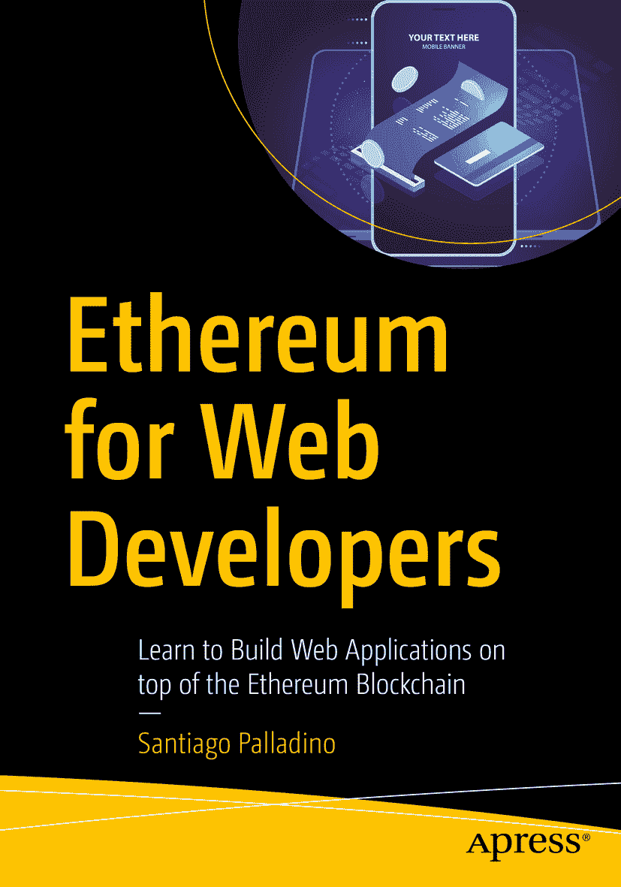

ISBN 978-1-4842-5277-2 e-ISBN 978-1-4842-5278-9 [`doi.org/10.1007/978-1-4842-5278-9`](https://doi.org/10.1007/978-1-4842-5278-9) © Santiago Palladino 2019 本作品受版权保护。出版商保留所有权利，涉及材料整体或部分内容，特别是翻译、重印、重用插图、朗诵、广播、微缩胶片或其他任何物理形式的复制，以及传输或信息存储与检索、电子改编、计算机软件，或目前已知或今后开发的类似或不同方法。书中可能出现商标名称、徽标和图像。我们未在每次出现商标名称、徽标或图像时使用商标符号，而是仅以编辑方式使用这些名称、徽标和图像，以利于商标所有者，无意侵犯商标权。本出版物中使用的商品名称、商标、服务标志及类似术语，即使未明确标识，也不应被视为对其是否受专有权利保护的表述。尽管本书中的建议和信息在出版时被认为是真实准确的，但作者、编辑或出版商均不对可能存在的任何错误或遗漏承担法律责任。出版商对本书所包含的材料不作任何明示或暗示的保证。本书通过 Springer Science+Business Media New York 在全球图书贸易中发行，地址：233 Spring Street, 6th Floor, New York, NY 10013。电话：1-800-SPRINGER，传真：(201) 348-4505，电子邮件：`orders-ny@springer-sbm.com`，或访问`www.springeronline.com`。Apress Media, LLC 是加利福尼亚州的一家有限责任公司，其唯一成员（所有者）是 Springer Science + Business Media Finance Inc (SSBM Finance Inc)。SSBM Finance Inc 是特拉华州的一家公司。

*献给我即将成为我妻子的 Ale，感谢她在撰写本书的漫长日子里给予我的支持。*

*献给我的父母，他们都是计算机科学家，将他们的热情传递给了我。*

## 引言

写一本关于以太坊的书并不容易。以太坊是我见过的演进最快的技术之一。它建立在一种全新的计算模式之上，而这种模式五年前甚至还不存在，并且自其诞生以来经历了无数次的变革。撰写像书这样静态的东西，试图捕捉它的本质，几乎像是徒劳之举。再将其与另一个以其快速变化环境而闻名的领域——Web 开发相结合，似乎是一项艰巨的任务。

尽管如此，一些概念已成为了开发区块链应用的基础。即使这个领域是全新的，我们也看到在比特币和以太坊之后，许多新的链被启动 ^(¹)，它们都共享许多基本的构建模块。正是这些概念，本书试图从一个 Web 开发者的角度来捕捉。我相信，即使我们依赖的工具和实践完全改变，几年后它们仍将像今天一样有用。

在整本书中，你可能会读到许多以*在撰写本文时*形式的免责声明，以强调那些在不久的将来注定会发生变化的事物——其中有些甚至在我撰写和审阅每个章节的过程中就已经发生了变化。然而，你需要牢记，这个免责声明适用于整本书，因为以太坊生态系统正处于不断演进之中。

## 本书的目标读者

这本书是为几年前的、尚未进入区块链领域的我而写的。我曾作为全栈开发者工作多年，而转入以太坊领域动摇了我构建和思考应用的基础。

当时，要找到全面的资料来理解构建去中心化应用所需的以太坊各个方面，出乎意料地困难。时至今日，情况依然如此，因为信息大多是碎片化的，并且常常针对特定的工具集。

因此，本书面向的是有 Web 应用开发经验的开发者，他们希望将自己的技能应用于以太坊这个新的去中心化平台。我们正在目睹的，很像十多年前的移动革命，它彻底改变了我们与 Web 的交互方式。它要求开发者重新学习并适应新的范式。现在，同样的事情正在发生。

基于这一点，本书在传统 Web 开发之外，还介绍了由于你拥有一个以太坊网络所带来的新概念。

## 你应该具备的知识

本书是为 Web 开发者编写的，因此假设你已经知道并掌握什么是 Web 应用，熟悉使用`javascript`作为开发语言，并理解诸如客户端-服务器架构、关系型数据库、HTTP 请求/响应周期和 DNS 等概念。

特别地，我们将使用`React`作为前端库，以简化书中许多示例的开发。考虑到`React`的存在时间比以太坊本身还要长，并且考虑到它当今的流行度，这似乎是一个合适的选择。我们不会依赖任何框架或状态管理解决方案，因为我们将保持示例的简洁，并专注于以太坊方面的内容。

尽管我们将使用一种加密货币，但阅读本书并不需要具备密码学或货币方面的先验知识。我们将在第一章介绍哈希和公钥密码学的基础知识，并在最后几章简要讨论金融激励措施。当然，如果你对这两个领域中的任何一个感兴趣，区块链是一个绝佳的实践场所。

## 工作环境

本书的大部分内容由代码示例组成。即使本书的价值在于它试图传递给你的概念，每个章节都包含了几个代码片段或完整的应用程序来帮助说明这些概念。基于这一点，你可能需要准备一个环境来重现列出的实验。

所有代码示例均使用`ES6`标准的 Javascript 编写，在 Ubuntu Linux 系统上开发和测试，并在`bash` shell 中通过`nodejs` ^(²) `10.16`运行。由于 Javascript 是跨平台的，这些示例应该也能在 OSX 或 Windows 环境中无缝运行，但具体情况可能有所不同。话虽如此，让`npm` ^(³)正常工作并能在本地运行`create-react-app` ^(⁴)应该足以应付大多数代码示例。某些章节可能还需要你安装并运行一个以太坊节点，例如`Geth` ^(⁵)或`Parity Ethereum`。^(⁶) 有关针对特定平台的安装说明，请参考它们各自的网站。

在整本书中，我们将非常有限地使用以太坊特定的工具和库。我们将仅限于使用一个用于与以太坊网络交互的 Javascript 库，^(⁷) 一个用于简化智能合约编译的工具，^(⁸) 以及一个标准合约库，以避免从头开始重新实现它们。^(⁹) 以太坊的工具和框架领域变化很快，我想避免将本书与其中任何一个绑定。然而，当你启动新的以太坊应用时，依靠现有的框架，如`OpenZeppelin`、`Buidler`、`Truffle`、`Embark`或`Etherlime`，可能会帮助你加快速度。

## 各章节概览

第一章将是唯一不涉及代码的章节。它将介绍什么是区块链，并简要回顾从比特币到以太坊的发展历史，同时讲解账户、交易和区块等基本概念，以及贯穿全书所需的基础密码学知识。本章还将简要介绍区块链的用例，并引入去中心化应用的概念。

第二章完全以实践为主。它将弥补前一章代码的缺失，从头开始开发一个完整的去中心化应用。许多概念会快速带过，但这章能帮你从实践角度理解所有组件如何协同工作，从而在后续深入探索时，清楚了解它们各自的角色。

第三章是唯一与网络开发无关的章节。它提供了一个关于智能合约的速成课程，这是以太坊中的关键结构。深入理解智能合约及其能力边界，将有助于你设计应用的架构。本章大部分内容基于 Solidity——编写合约最流行的高级语言。

第四和第五章回到网络开发，深入探讨非常基础的任务：从区块链读取和写入数据。从区块链获取数据不同于向传统关系型数据库发送 `SQL` 查询，而发送交易则需要管理 gas 和签名等概念。在区块链开发中，漫长的确认时间和重组现象，可能让你熟悉的 `NoSQL` 数据库的最终一致性挑战相形见绌。这两章将介绍这些问题以及应对它们的多种技术。

第六章将挑战去中心化本身。在此之前，所有示例都是构建为仅以区块链作为后端静态单页应用。本章将向去中心化应用的架构引入中心化组件，例如索引和存储方案。

最后，第七和第八章讨论当今以太坊开发中最紧迫的两个挑战：用户引导和可扩展性。对于非技术用户而言，进入以太坊领域可能困难重重——他们会被私钥、助记词等概念轰炸，而在一个一旦出错就可能损失全部资金的严苛环境里。此外，平台每秒仅能处理十几笔交易的全局吞吐量，严重限制了其能够运行的应用——想象一下，一个云服务提供商所有客户共享的数据库每秒写入量不超过十二次。这两章深入探讨了这些问题，并调研了当前可用的解决方案。这也是变化最快的两个领域，但本章将为你提供基础知识，帮助你驾驭这一领域，从而构建出卓越的以太坊应用。

## 强制免责声明

软件开发的安全性很难。区块链开发的安全性更难。智能合约应用可能管理着大量资金，在公开的可执行环境中如同待宰的羔羊。

> 我希望你编写一个程序，该程序必须在拜占庭环境下的并发环境中运行，任何对手都可以选择任意参数来调用你的程序。程序执行的环境（以及任何直接或间接的环境依赖）也受对手控制。如果你在实现中，甚至在程序的逻辑设计中犯下一个可被利用的错误或疏忽，那么你个人或你的程序用户可能会损失大量资金。在程序运行的地方，一旦出现问题，你将没有任何法律追索权。而且，一旦你发布了程序的第一版，就永远无法更改。它必须一次性正确无误。
>
> —Adrian Colyer，“Zeus：分析智能合约的安全性”^((10))

尽管本书中的所有代码示例都经过审阅，但并未经过正式审计。即使经过了审计，仍可能存在未被发现的漏洞。本书代码的目标是教你知识，而不是供你复制粘贴到自己的应用中——这方面我们已经有了 `StackOverflow`。本书的作者和出版商均不对你在此处找到的代码的安全性提供任何担保。

归根结底，你不应盲目信任本书中的任何代码片段——也不应信任任何其他来源的代码。始终确保你充分理解自己正在做什么，并在将代码部署到以太坊主网之前，让第三方对其进行审查和审计。

> 本软件“按原样”提供，不附带任何明示或暗示的担保，包括但不限于对适销性、特定用途适用性及不侵权的担保。在任何情况下，作者或版权持有者均不对因本软件或使用本软件或其他相关行为而产生的任何索赔、损害或其他法律责任承担责任。

闲话少叙，让我们开始吧。

## 致谢

首先，我要感谢 `OpenZeppelin` 的出色团队。`OpenZeppelin` 是我接触令人惊叹的以太坊世界的第一个窗口，也是我学到本书中所有知识的地方。

我还要感谢所有与我共享开发者职业生涯的同事，尤其是在 `manas.tech` 工作的同事，我在那里工作和学习了近十年。那些年的经历成就了今天的我。

同时，衷心感谢整个以太坊社区。许多维护着整个基础设施运行的“建设者”^((11))和维护者往往不为人知或不被重视。正是通过他们的巨大努力，这个生态系统才能蓬勃发展和成长。

我对布宜诺斯艾利斯公立免费大学的老师们永怀感激之情，在那里我接受了宝贵的计算机科学教育。尽管在我求学期间区块链甚至还不存在，但我在那里学到的基础至今仍帮助我应对任何新课题。

最后但同样重要的是，特别感谢 `Apress` 团队帮助我完成本书的编写并使其呈现在你面前。

当然，还要感谢我的猫，在我编写本书的每一小时里，它都坚持不懈地睡在我身边。

### 关于作者与技术审校

### 关于作者

### 关于技术审校

## 脚注

1 2 3 4 5 6 7 8 9 10 11

