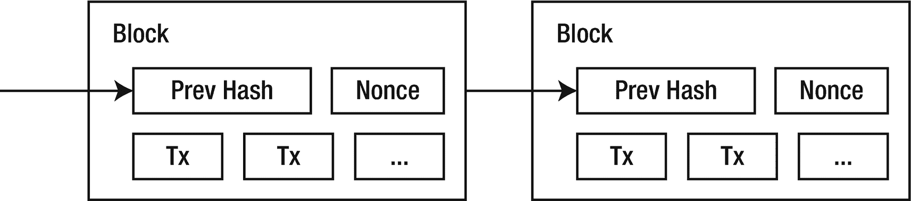

# 1. 区块链

我们将从简要介绍以太坊和区块链技术本身开始我们的旅程，首先从比特币说起。我们将解释区块链的构成要素以及何时使用区块链才有意义。我们还会在开始之前介绍一些密码学基础，之后在实现第一个去中心化应用之前，对去中心化应用开发进行概述（详见第 2 章）。

## 密码学速成

在深入讲解区块链之前，我们先回顾两个密码学概念，它们是大多数区块链的关键基石：哈希和公钥密码学。如果你已经熟悉它们，可以跳过本节。

### 哈希函数

*密码学哈希函数*是一种纯粹的确定性函数，它将来自大空间的输入映射到固定集合中的输出。这些输出通常被称为输入的*摘要*。例如，输入可以是本书序言的全部文本，其摘要可能是来自 128 位值空间的十六进制值`01cc88cda97d50346743ae58bb3ebe75`。

不探讨形式化定义，一个安全的哈希函数应当具有*抗碰撞性*。这意味着，实际上不可能找到两个不同的输入，它们会产生相同的摘要。哈希函数还应当是*不可逆的*：仅凭摘要，实际上不可能找到一个能产生该摘要的输入。此外，对输入的微小改动应当导致输出摘要的巨大变化——两个相似的输入应当产生截然不同的摘要。哈希函数还应当能根据其输入相对快速地计算出来，因此验证输入与其摘要是否匹配是一项简单的任务。

哈希函数是维护区块链完整性的核心，也是工作量证明共识机制的基础。我们将在后文看到这两种应用。

### 公钥密码学

*公钥密码学*（或称*非对称密码学*）是一种依赖于密钥对的加密系统：一把私钥，仅其所有者知晓；一把对应的公钥，与世界共享。用公钥加密的字符串只能用私钥解密。任何想要给用户发送秘密消息的人，都可以使用接收者的公钥进行加密，因为只有私钥持有者才能解密。

密钥对也可以反过来用作*数字签名*。用户可以发送一条消息，以及用其私钥加密的消息摘要。任何接收者随后都可以使用公钥来验证该摘要确实是由私钥所有者签名的。

这些签名是公链中的认证机制。每个公钥都关联一把私钥，私钥应由其所有者安全保管，并授予对区块链中其拥有资产的访问权限。

公钥密码学可以通过多种不同的算法来实现，其中最流行的算法之一是 Rivest–Shamir–Adleman（更广为人知的名字是`RSA`）。然而，以太坊依赖于椭圆曲线数字签名算法，即`ECDSA`。该算法还允许从给定的消息及其签名中*恢复*出公钥。

掌握了这两个密码学概念，我们现在终于可以开始了解区块链是如何构建的了。

## 区块链基础

区块链是一个去中心化的、不可篡改的公共数字账本。我们可以将区块链视为一个分布式数据库，一旦某条记录被确认，就永远无法删除或更改，并且没有任何单一权威机构能够控制这个数据库，该数据库会在点对点网络中的所有节点上复制。这个数据库中实际存储的内容可能各不相同：它可以是货币、资产登记簿，甚至是可执行的代码。

### 交易与区块

在区块链中，每一次状态变更都是一笔*交易*的一部分。可以将交易视为用户对全局数据库的一次原子写入操作，它可能会更改一条或多条记录。网络中的任何用户都可以提交一笔待执行的交易。

交易如何处理是区块链*状态转换规则*的一部分。区块链通过处理其收到的每笔交易，从一个状态转换到另一个状态。例如，管理货币的区块链可以将交易处理为两个账户之间的货币转账：它减少发送方的余额，并增加接收方相同数量的余额。其他区块链甚至允许交易在链上创建和执行完整的程序。

当用户发送交易时，他们必须使用自己的私钥对其进行密码学*签名*。这样，区块链就可以确保只有特定用户才能移动特定的资产或更改特定的记录。这引入了由密钥持有者拥有的*所有权*概念。

### 注

公链不要求其用户注册。他们只需创建一个新的密钥对，即可开始签名交易以参与网络。然而，它们可能要求用户持有与区块链相关的货币，才能处理其交易。

交易会被批量打包成*区块*，这些区块再链接在一起形成实际的区块链。区块构成了区块链的历史，每个区块都打包了一组改变其状态的交易。在每个区块中如何选择和排序交易，取决于区块链的*共识规则*，我们将在后文介绍。

当一个区块被添加到区块链时，它会通过点对点网络传播到所有节点。每个节点都会在本地重新执行区块中的所有交易，以检查它们是否确实有效，如果发现任何非法更改，则拒绝该区块。这意味着每笔交易实际上会在整个网络中的每一个节点上执行一次。这使得区块链能够完全去中心化，因为每个节点都会检查所有运行的交易。然而，这是有代价的：计算开销给网络每秒能处理的交易数量设置了上限。换句话说，用性能换取了去中心化。

鉴于在区块链中处理变更的高昂成本，所有交易都需要支付*费用*。这笔费用通常以区块链的原生货币支付（例如比特币网络中的比特币^(¹²)或以太坊中的以太币）。无论这笔费用的受益者是谁（我们将在后文看到），其目的都是防止攻击者用需要在每个节点上处理的交易来淹没网络，并为添加新区块到链上的节点提供激励。

#### 哈希链

区块链通过在每个区块上保存其整个历史的*摘要*来抵抗更改。链中的每个区块都由一个哈希来标识，该哈希是根据其自身的交易以及前一个区块的哈希计算得出的（图 1-1）。

图 1-1

区块链的构建方式。每个区块由前一个区块的哈希加上其自身的所有交易来标识。我们将在下一节看到随机数的作用。图片来自比特币论文^(¹³)

通过这种方案，对链上任何区块中任何交易的任何更改都会导致所有后续哈希发生改变，使得任何修改都极易被检测。例如，如果攻击者试图篡改十笔交易前的某个交易，不仅该区块的摘要会改变，下一个区块的摘要也会改变（因为它是基于前一个区块哈希计算的），并会一直影响到链头。

然而，要使这种机制有效阻止攻击者修改区块链并向网络分发虚假副本，攻击者必须*很难*重新生成所有区块。这就是工作量证明的用武之地。

#### 达成共识

交易如何被排序并纳入区块链的区块，取决于网络的`共识算法`。由于我们面对的是一个去中心化数据库，因此需要一种方式让所有参与者就变更如何添加到链上达成一致。例如，如果卖家在区块链上提供一项资产，而两位买家争相购买，去中心化网络如何判定谁先成交？更糟的是，如何防止卖家同时告知两位买家都成功购买，从而重复获利？^(¹⁴)我们需要一种方法来确定交易如何被选择和排序，以维护区块链的唯一状态。换句话说，我们需要一种方式来确立哪些区块能够被添加到链上的`共识`。

许多像比特币或以太坊这样的公有区块链，依赖于一种称为`工作量证明`的共识算法。`工作量证明`是一种加密证明，表明已消耗大量 CPU 周期执行计算；在此场景下，即基于一个区块计算出一个复杂的数字。一个区块要能被添加到区块链，必须附带其`工作量证明`。任何节点都可以提议一个新区块，并且如果提交时附带了`工作量证明`，它就会被添加到区块链中。成功添加区块的节点会因其付出的努力而获得奖励。^(¹⁵)在网络中履行此职责的节点被称为`矿工`^(¹⁶)，每当新区块被添加时，所有矿工都会竞相尝试添加下一个区块，以获取相应的奖励。

### 注意

这些证明的机制其实相当简单。链中每个区块的标识符是一个哈希值，它包含了前一个区块的标识符、区块中的所有交易以及一个`随机数`。通过改变`随机数`，计算出的区块摘要会完全不同。要将新区块添加到链上，这个标识符必须具有特定的结构（以 N 个零开头）。由于无法预测摘要的具体样式，矿工只能反复尝试计算区块哈希值，同时改变`随机数`，直到找到一个符合要求的摘要。这需要大量的尝试，因此被视为`工作量证明`。

请记住，整个基础设施运行在一个点对点的去中心化网络上。这使得节点可以随意加入或离开网络，无需中心化服务器。在这里，`工作量证明`算法为新节点提供了一种识别真实链的方法：它们只需寻找累计投入计算力最大的那条链。

这也能防止恶意行为者篡改链上的记录并重新计算所有后续区块的哈希值，正如我们在前一节讨论的那样。要做到这一点，攻击者需要从他篡改的那个区块开始，解决所有后续区块的`工作量证明`，这需要比网络中其他矿工更强大的计算能力。

### 注意

除了`工作量证明`，还有其他的共识机制。在第 8 章中，我们将探讨`权威证明`和`权益证明`作为构建更快、更小规模链的替代方案。

共识算法与网络的`最终性`紧密相关。当一个交易被确认已纳入区块链且不会改变时，我们就称其为`最终`交易。添加在最新区块中的交易远不能被视为`最终`：如果某个矿工成功地从倒数第二个区块开始连续挖出两个区块，他们可能生成一条新链，替换掉最新区块，从而不包含该交易。

这被称为`重组`，在`工作量证明`链中并不罕见。要确认一个交易是`最终`的，我们需要等待其所在区块之上再挖掘出几个区块，以确保它不会改变。所需的区块数量取决于具体的链以及我们需要的置信度。

#### 关于吞吐量

按设计，求解一个`工作量证明`在计算上非常昂贵。这本身就通过对每次要添加一批交易时强制求解一个难题，限制了区块链的吞吐量。

然而，限制每秒添加到链上的交易数量和复杂度还有另一个原因：可验证性。为了保持区块链的去中心化，网络中的每个节点都需要能够验证每一笔交易是否合法，并且是否按照既定规则执行。如果网络每秒接受大量交易，那么只有高性能设备才能验证这条链，从而将无法获得必要硬件的用户排除在网络之外。因此，低吞吐量与保证区块链的公共访问性有关。

特别地，以太坊的设计目标约为每秒处理 15 笔交易。请注意，以太坊中的交易复杂程度可能不同，因为它们可以执行任意计算，因此这个上限实际上与运行和验证每个区块中的交易所需要的工作量有关。

还要注意，这每秒几笔的交易量是由网络中所有用户和应用程序共享的，即使对于单个传统的 Web 应用来说，这也是一个非常低的限制。我们将在第 8 章看到围绕这一限制的一些解决方案。

#### 从比特币到以太坊

到目前为止，我们将区块链定义为一个公共数据库，但尚未深入探讨该数据库*可能包含*什么内容。第一个著名的区块链被用于追踪一种数字货币——比特币的所有权。

我们今天所理解的大部分区块链概念，是由中本聪^(¹⁷)在 2008 年的论文“比特币：一种点对点的电子现金系统”^(¹⁸)中提出的。这篇论文简短易懂，囊括了当今使用的大部分区块链概念。它引入了一种“纯粹的点对点电子现金版本”，没有任何中心化的所有者或发行方。

总而言之，比特币区块链是一个公共的去中心化数据库，它记录其用户的比特币余额，并支持从一个地址向另一个地址转移资金的交易。它是一个去中心化电子支付平台的实现。

值得一提的是，除了简单的转账，比特币还支持一种有限的脚本语言。这种语言允许实现诸如时间锁（限制交易在未来的某个时间点之前无法执行）或多重签名交易（需要多个账户共同同意才能转移资产）等结构。然而，用这种语言能构建的内容仍然有限。

正是为了在网络中支持任意计算，以太坊应运而生。

### 智能合约

以太坊由维塔利克·布特林（Vitalik Buterin）于 2013 年提出，并于 2015 年首次上线。^(¹⁹) 其主要区别在于，它提出了在区块链中以智能合约形式执行任意代码的概念。智能合约是上传至区块链的简短程序，能够对发送给它的交易做出响应，并执行任意逻辑。每个智能合约还拥有自身独立的任意状态，该状态可在任何交易中更新，并能存储任何类型的数据。当然，智能合约也能持有以太坊网络的原生货币`ETH`。

换句话说，以太坊网络既持有数字货币（以太币），又持有带有自身状态的可执行代码（智能合约）。

这种灵活性使以太坊能够实现许多不同的构造。例如，一个全新的代币可以轻松地作为智能合约来实施。该合约只需跟踪每个用户的余额，并提供安全转账的方法。这使得新的加密货币可以毫不费力地在以太坊之上创建。^(²⁰)

然而，请记住，所有交易都由网络中的所有节点为了验证而重新执行。这意味着，虽然智能合约可以执行任意代码，但该代码必须是*确定性的*。无论何时何地运行，它都必须产生相同的结果。它也不能依赖于区块链外部的任何来源；否则，区块链的有效性将依赖于这些外部来源。一个智能合约只能查询或与以太坊网络内的其他智能合约进行交互。

## Gas 费用

允许任何用户发送带有任意代码的交易，并且这些代码将在网络中的每个节点上执行，这潜在风险极高。恶意用户可能会提交一段执行成本极高或永不终止的代码。

为了防止这种情况发生，以太坊引入了一个名为 *gas* 的概念。可以将 gas 视为处理交易所需计算能力的度量单位。在一笔交易中，复杂操作消耗的 gas 会比简单操作更多。例如，修改合约的存储要比执行一个简单的算术表达式昂贵得多。

发送到网络的交易需要分配一定的 gas 才能被发送。这笔 gas 费用用`ETH`支付。交易执行的每一行代码都会消耗其一部分 gas，如果 gas 降至零，处理会立即停止，交易宣告失败。尽管如此，交易发送者仍需为处理这种长时间运行过程所耗费的资源而付费。

交易发送者还可以设置 gas 价格，表明他们愿意比其他用户支付更多（或更少）的费用来执行自己的交易。通过使自己的交易对矿工更具（或更少）吸引力，这是一种让自己的交易比其他用户的交易更快（或更便宜）地被包含进区块链的方式。

## 去中心化应用

智能合约使得构建*去中心化应用*成为可能，这正是本书关注的焦点。去中心化应用（或称 DApps）是客户端单页 Web 应用，其后台并非服务器，而是区块链上的一组智能合约。应用用户不是向 Web 服务器发送`HTTP`请求，而是向以太坊网络上的智能合约发送交易。甚至可以将 Web 应用本身托管在去中心化文件存储系统上^(²¹)，从而使应用完全独立于任何中心化基础设施。

去中心化应用不是从中心化数据存储中查询数据，而是将区块链作为真相来源。用于填充应用的数据要么存储在区块链上，要么存储在区块链所引用的远程存储位置。同样，应用的业务逻辑也编码在一组智能合约中。用户通过向智能合约发送交易来对应用执行持久性操作。

### 用户体验

DApp 给用户的观感和体验如何？一些 DApp 倾向于将去中心化置于易用性之上，并要求用户使用专门的浏览器或浏览器扩展来访问。这些扩展充当钱包，持有用户的密钥，同时也充当通往区块链的门户，提供与以太坊节点的连接。在底层，它们会注入一个`javascript`对象，该对象提供用于访问区块链数据和代表用户发送交易的低级方法。每当应用请求发送交易时，用户会看到一个弹窗来批准该交易。这虽然将许多复杂性从 DApp 转移到了扩展上，但也要求用户付出巨大努力来安装扩展、创建并备份账户、以及购买`ETH`才能开始操作。我们将在第 2 章中使用这种方法构建第一个 DApp，并在第 5 章中更深入地探讨发送交易的细节时再次回顾。

其他 DApp 则采用更用户友好的方法，代表用户管理密钥。用户甚至可能在毫无察觉的情况下使用 DApp，前提是所有的复杂性都在后台处理。然而，这也意味着用户不再掌握自己的密钥，而是将其委托给应用。此外，如果每个应用都管理自己的一套密钥，互操作性就会变得更加困难，因为用户在每个服务上都会有不同的身份。我们将在第 6 章中探讨用户友好的方法及其带来的挑战。总而言之，优秀的应用会根据用户对以太坊的熟悉程度，为不同用户提供不同的体验。

无论密钥管理方式如何，所有 DApp 都需要考虑网络漫长的确认时间。在传统 Web 应用中，以`HTTP`请求形式执行的操作只需几毫秒就能到达 Web 服务器并返回。然而，在以太坊中，一笔交易可能需要数秒才能被挖出，甚至需要更长时间才能得到确认。DApp 在设计界面时必须考虑到这一点，并准备好应对链重组的情况。我们将在第 4 章，以及主要在第 5 章中，了解更多关于这些挑战的知识。

#### 去中心化的程度

正如我们之前提到的，一个 DApp 可以完全去中心化：它可以托管在去中心化存储位置，从区块链加载数据，并依赖智能合约处理所有业务逻辑。一旦启动，就没有中心化方可以停止或修改该应用，也不会有任何服务宕机导致无法访问。这些应用甚至能抵抗任何代理的审查。

然而，这也需要付出代价。如果内容没有足够的副本，去中心化存储可能会变慢或偶尔不可用。在某些用例中，在以太坊网络上运行查询可能过于缓慢。在某些场景下，即使是设置以太坊账户这一障碍，也可能成为我们用户的绊脚石。幸运的是，我们可以牺牲一定程度的去中心化来换取用户体验的提升。

例如，我们可以不直接从区块链本身加载数据，而是设置一个充当缓存的中心化服务器，从而在客户端更快速地访问所需数据。如果该服务器宕机，Web 应用仍然可以回退到链本身；在进行关键操作时，甚至可以针对区块链验证其提供的数据。我们将在第 6 章探讨这些解决方案。

另一个例子是将用户的交易中继到网络，这样他们就不需要设置账户、购买`ETH`来支付燃料费，甚至完全不需要与以太坊网络交互。我们可以为客户端创建一个临时密钥，并用它在客户端签署交易，然后通过专用服务器代表用户提交到区块链。这缓解了用户入门过程中的许多痛点。我们将在第 8 章探讨这种方法及其他替代方案。

我们甚至可以构建完全中心化的应用，这些应用与以太坊区块链上由智能合约驱动的去中心化协议进行交互。在这里，区块链的价值不在于应用层，而在于协议层。通过在去中心化层管理用户的资产，我们保证了他们数据的安全，并且他们可以随时透明地迁移到基于相同无信任^(²²)协议的其他应用之上。

总而言之，关键在于去中心化并非全有或全无。我们可以而且必须选择适合我们应用的*去中心化程度*，同时意识到这需要与其易用性进行权衡。

### 为什么选择区块链？

在实施基于区块链的系统时，你首先应该问自己的问题是*你是否真的需要区块链。*^(²³)

在技术领域，很容易被炒作周期冲昏头脑：你可能会使用 Kubernetes 集群来水平扩展你的 Web 应用的负载，而它本可以完美地运行在单台服务器上；或者你可能会使用最先进的机器学习算法，从一个只有不到 100 条记录的数据集中推断趋势，而这些数据更适合在 Excel 表格中可视化。数百万美元曾被用于开发仅展示静态信息的原生移动应用，仅仅因为它比*仅仅*做一个普通的响应式网站更酷。

区块链也不例外，它甚至可能被用作金融投机者的工具。永远记住，仅仅因为你手里有了一把闪亮的新锤子，并不意味着所有东西都变成了钉子。你不应该试图将区块链硬塞进每一个系统，而应该先设计解决方案，然后再考虑它是否真的能从区块链中受益。

# 优势与用例

在做出上述免责声明之后，我们现在可以聚焦于区块链真正擅长的领域，以及一些适用于公有区块链或特别是以太坊的用例。^(²⁴)

**去中心化金融**是最流行的用例之一。^(²⁵) 第一个区块链——比特币，是作为去中心化支付平台构建的，但区块链的金融应用可以走得更远。智能合约可用于支持多种金融工作流程，例如去中心化交易所、衍生品、保证金交易、保险、信贷、借贷、投资、预测市场等等。这些`artifacts`传统上要求用户将他们的信任和资产托付给中心化机构——这提高了准入门槛，并且该机构通常会对其服务收取高昂的费用。现在，一个在公开可审计区块链上的智能合约可以充当支持这些金融服务的机构，处理链内的加密货币。

通常，区块链在需要**可信第三方**的场景中大放异彩，因为它作为一个可信的中立平台，允许多个参与者安全地进行交互。这不仅适用于金融应用，也适用于任何需要公开验证过程透明度的场景。例如，在在线拍卖中，可以通过将所有参与者的出价（加密后）提交到区块链来验证其是否被处理。如果某个参与者发现其出价未被考虑，他们只需出示其在区块链上的出价证明即可。

通过消除对可信第三方的需求，智能合约可用于创建无信任的**平台**或**协议**。你无需构建在专有层之上（该层的游戏规则可能被所有者单方面更改），而是可以构建在去中心化平台之上。一个很好的例子是市场：运营应用和服务市场的传统大公司可以随时更改其条款和条件（以及他们的分成！）。另一方面，由智能合约协调的市场是不可变的，由区块链本身而非任何人运行。

区块链也可用于证明数据的存在性。^(²⁶) 通过将文档的签名摘要提交到区块链，任何人都可以证明某些数据是在某个日期之前发布的。但更有趣的是，区块链还可以验证某些数据**未被**发布。例如，如果区块链用于存储证书撤销信息，那么任何人都可以轻松证明某个证书**未被**撤销，只需展示该撤销信息从未被上传到链上即可，而该链充当了一个中立全局数据库的角色。

区块链的另一个优势在于**持久性**。如果你作为用户，在一个数字系统中持有有价值的东西，而该系统的维护者消失了，你的东西也会随之消失。这不仅适用于货币，也适用于数字资产，如收藏品或在线成就。将数字资产注册在区块链上保证了它们独立于创建它们的组织而得以维护。它甚至可以实现这些资产在最初创建的体系边界之外的交易。

一些团体也在探索新的治理机制，通过在以太坊上构建**去中心化自治组织** (DAO)。在 DAO 中，一组参与者持有某种形式的投票权，并可以提交提案，然后通过 DAO 智能合约中编码的机制进行决策。^(²⁷) 区块链确保了流程的绝对透明，并允许围绕共同目标快速实验新的群体组织方式。

然而，尽管公有区块链带来了诸多优势，但它也对可以构建的内容施加了重大限制。

# 局限性

正如我们之前提到的，公有区块链的主要局限之一在于**交易吞吐量**。每秒处理十几笔交易通常不足以支撑单个应用，更不用说让构建在同一条链上的所有应用共享了。然而，这是去中心化所付出的代价。正如维塔利克·布特林本人所言：“区块链的目的并非降低计算成本（至少相对于中心化服务器而言）。区块链的目标是通过承受计算成本增加所带来的牺牲，来实现社会成本的降低。”^(²⁸)

尽管如此，在扩展公有区块链方面已有大量工作。如果每秒十几笔交易对于区块链上所有应用共享来说太少，那么我们可以构建更多区块链并将它们互联。或者，我们可以在区块链外部处理成批的交易，然后通过单笔交易将它们一起结算。我们将在第 8 章中探讨更多关于扩展的方法。

区块链的另一个主要挑战是**用户入门**。尽管去中心化在降低社会成本、移除第三方和提供隐私方面有很多好处，但它也让接近平台变得更加困难。在你踏入平台时，没有中心化机构手把手指导你，如果你弄丢了私钥并损失了所有资金，也无人可以求助。此外，要与以太坊网络交互，你首先需要拥有以太币，更不用说需要一个钱包来存放它们，这使得设置过程比大多数用户愿意接受的要更长、更繁琐。

在应用中使用加密货币时，用户入门被视为主要的痛点之一，许多公司提供中心化解决方案或作为最终用户资产的托管方。去中心化应用也在尝试更流畅的用户入门流程，这样用户就不会在被要求下载专用浏览器扩展来与应用交互时流失。我们将在第 7 章中介绍许多简化用户入门的技术。

请注意，我们迄今为止定义的局限性和用例适用于本质上是公有的区块链，即任何参与者都可以加入并验证历史、提交交易、查询当前数据，甚至充当矿工的网络。然而，还有另一类区块链我们尚未探讨。

# 非公有区块链

当我们最初定义区块链时，将其描述为一个**公有**的数字账本。然而，自比特币出现以来，在**许可型**区块链方面已有大量工作，这些区块链通过移除链的公有性质来挑战我们之前的定义。这类区块链限制了哪些节点被允许加入网络，或者哪些节点可以充当矿工或发送交易。

例如，在企业界一个日益增长的模式是**联盟**或**共同体**区块链。这些区块链由一组（联盟）不同的机构共同管理。联盟的每个成员控制网络中的一个节点，该节点充当列入白名单的**验证者**节点，并参与基于投票的共识算法来添加新区块。^(²⁹) 这消除了工作量证明的需求，因为共识是通过预定义的一组节点之间投票达成的。

这些许可型区块链不仅可能限制充当矿工的节点，还可能限制哪些节点可以加入网络并验证交易，或者哪些账户可以提交交易进行处理。

## 注意

一些公司更进一步，采用完全**私有的区块链**，这些区块链在公司内部使用，并且只有一个节点有权限添加新区块。这些链主要用于可审计性和追溯目的。

这些变化使得联盟区块链能够拥有比公有区块链高得多的交易吞吐量。此外，通过限制可以参与网络的节点集合，它们自动受到保护免受垃圾邮件攻击，并且可以放弃支付交易费用的要求。

这使得许可型区块链能够满足不同的用例需求。例如，联盟链通常用于在组成联盟的不同公司之间结算全球交易，而不受公有区块链施加的每秒交易数量限制。在这里，区块链的价值在于其可审计性，以及消除对**单一**可信方来持有联盟间共享数据的需求。

尽管对于这些许可型链是否可以被视为**真正的区块链**存在一些分歧，但事实是区块链技术正在进入企业界。然而，在本书中，我们将只关注公有区块链，特别是以太坊。不过，公有区块链的许多经验也可以应用于许可型领域。^(³⁰)

# 总结

希望本章能作为区块链和以太坊世界的入门介绍。现在，你应该对什么是区块链、何时使用区块链有意义以及它的局限性有了基本的了解。

我们介绍了一些基本概念，这些概念将在本书中反复出现，例如智能合约、交易、区块、重组、共识和节点。我们从比特币讲到了以太坊，并简要提到了许可型区块链作为公有链的替代方案。

在所有这些理论之后，下一章我们将完全动手实践，实现我们的第一个以太坊 DApp。这将让你更深入地理解我们在本章中介绍的去中心化应用的概念，然后在整本书中我们将深入探讨其不同方面。

脚注 1   2   3   4   5   6   7   8   9   10   11   12   13   14   15   16   17   18   19