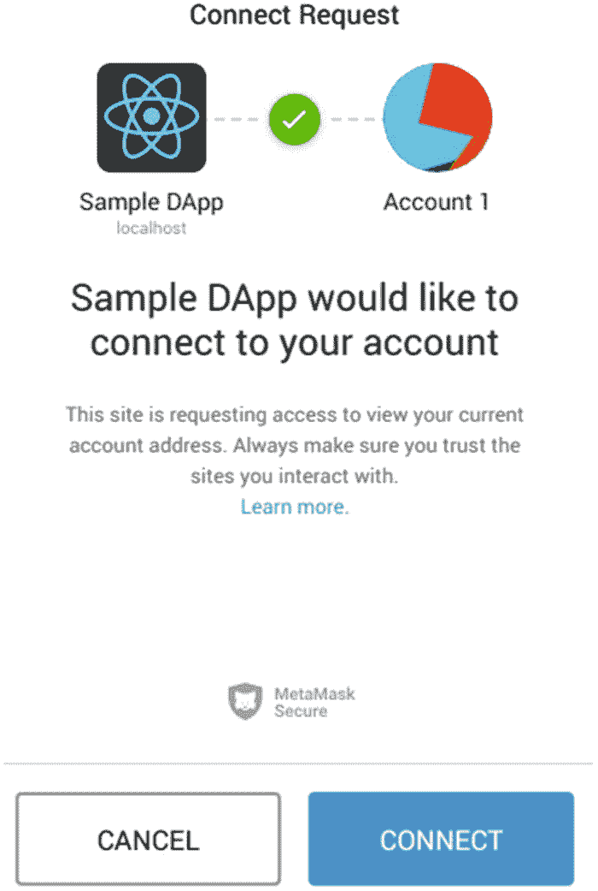
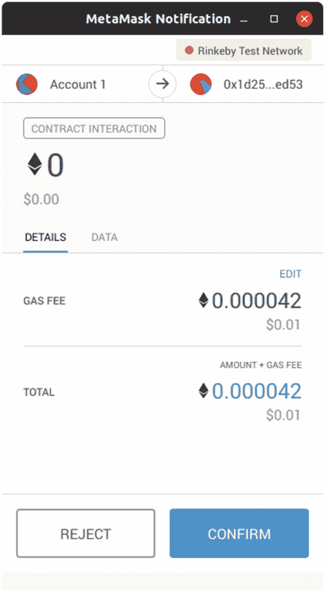

# 一个示例 DApp

在本章中，我们将从头开始构建一个完整的 DApp。虽然我们不会深入探讨每个步骤的细节，但本章将帮助你识别构建去中心化应用所涉及的所有组件。在接下来的章节中，我们将重点讲解每个不同的部分，但你可以随时回顾这些页面，以理解每个部分在整体架构中的位置。

## 关于我们的 DApp

我们将创建一个实现为 DApp 的全局**计数器**。用户应该能够查看计数器的值，并通过发送交易来递增它。尽管这个应用没有实际用途，但它将有助于我们逐一了解 DApp 的各个组件。

### 我们的需求

我们的应用程序将仅维护一个计数器作为其状态，并允许任何以太坊用户通过交易来增加它。同时，任何访问该去中心化应用（DApp）的用户都应能够实时看到计数器数值的更新。

该应用程序完全不管理任何以太币（ETH），也不设置任何访问控制。只要用户能够访问 DApp，他们就可以自由地与之交互。

### 智能合约

以太坊智能合约是部署在以太坊区块链上的小型程序。每个合约都有自己的代码和内部状态。在本应用中，我们将把计数器的数值存储在合约的状态中。合约还将提供一个获取函数（getter），供任何客户端轻松查询其数值，以及一个通过向合约发送交易来增加数值的方法（列表 2-1）。

```
pragma solidity ⁰.5.0;
contract Counter {
    uint256 public value;
    function increase() public {
        value = value + 1;
    }
}
```

智能合约还应提供一个*事件*，供客户端监听其状态的实时更新（列表 2-2）。以太坊中的每笔交易都可以选择触发一个或多个事件，客户端可以订阅特定的事件集，以此作为接收合约状态变更通知的方式。

```
pragma solidity ⁰.5.0;
contract Counter {
    uint256 public value;
    event Increased(uint256 newValue);
    function increase() public {
        value = value + 1;
        emit Increased(value);
    }
}
```

现在，这个实现展示了智能合约为客户端提供交互接口的所有基本方式：

- 一个`获取函数`（getter），用于查询合约的内部状态`value`。该函数是通过在声明字段时使用`public`关键字自动生成的。查询合约速度很快，且无需发送交易，因此不需要燃料费（gas），甚至不需要拥有以太坊账户。
- 一个修改合约状态的函数`increase`。这些函数需要发送交易，执行交易需要消耗以太币（ETH）。因此，它们需要有一个已充值的账户。
- 事件`Increased`，用于监听合约状态的更新。任何客户端都可以请求订阅合约中的一组事件，以获取合约的任何变更通知。

我们将在下一章详细介绍智能合约。目前，这些概念足以帮助我们构建 DApp。

### 架构

我们将在本示例中构建一个传统的 DApp。该应用程序将以以太坊网络中的智能合约作为后端，该合约充当 DApp 用户的分布式数据库。前端将作为一个常规的客户端 JavaScript 应用程序来搭建。

为了连接 JavaScript 前端和以太坊网络，我们将依赖一个支持 web3 的网页浏览器。这种浏览器允许用户不仅连接到互联网，还可以通过自己选择的节点连接到以太坊网络。它还管理用户的私钥和交易签名。

最流行的支持 web3 的浏览器是 MetaMask^((31))，它本身并非浏览器，而是一个插件，提供了所有必需的功能。MetaMask 负责跟踪用户的私钥，允许连接预定义的节点列表或自定义节点，并提示用户接受当前页面代表他们发送的任何交易。

从开发者的角度来看，MetaMask 会向以太坊节点注入一个全局的连接提供者，并拦截所有交易，使用自己的密钥对其进行签名。

### 设置环境

在开始构建 DApp 之前，我们将设置开发环境，以及与 DApp 交互和测试所需的工具。

#### 开发工具链

我们开发环境的基本配置将是构建一个简单的纯客户端 JavaScript 应用程序所需的配置。确保你的开发机器上已经安装了 `nodejs` 和 `npm`^((32)) 才能开始。

我们将依赖 `create-react-app` 包来快速启动我们的应用程序。这是由 Facebook 开发团队提供的一个包，用于初始化一个新的预配置的 React Web 应用程序。这将帮助我们节省大部分设置时间，并专注于构建 DApp。

```
npm init react-app counter-app
```

至于以太坊特定的库，虽然有许多开发框架可用，但本示例中我们将坚持使用最低限度的工具。我们将使用的唯一与以太坊相关的 JavaScript 库是 `web3.js`^((33))。该库的开发由以太坊基金会支持，被许多人视为事实上的标准库。

```
npm install web3@1.2.0
```

关于以太坊构建工具链，我们同样只关注所需的最小工具集。首先，我们将安装 Solidity 编译器，以便编译智能合约^((34))。确保安装 0.5.0 或更高版本。

```
$ solc ––version
solc, the solidity compiler commandline interface
Version: ...
```

然后，为了为我们的应用程序设置自动化测试，我们将安装 `ganache`。`Ganache` 是一个进程，它暴露了与以太坊节点类似的接口，并自行模拟整个以太坊区块链。它在开发环境或运行单元测试时特别有用。

```
npm install -g ganache-cli
```

默认情况下，`ganache` 会为发送的每笔交易立即挖出一个新区块，省去了等待交易确认的时间。这使得它在编码时很容易用作后端，但请记住，`ganache` 环境与真实环境相比会有显著差异，尤其是在用户体验方面。

#### Web3 浏览器

现在，我们将使用 MetaMask 设置一个支持 web3 的浏览器。请记住，还有其他支持 web3 的浏览器，但在撰写本文时，MetaMask 是与 DApp 交互最流行的方式。

首先为你的浏览器安装 MetaMask 插件^((35))——它支持 Chrome、Firefox、Opera 和 Brave。安装后，MetaMask 会提示你创建一个密码来加密你的账户，并会向你显示秘密备份短语。请务必记下这个短语：如果你丢失了 MetaMask 钱包，可以使用这个短语重新生成它。否则，钱包中的所有资金将不可挽回地丢失。

### 警告

安装 `MetaMask` 时要格外小心。大多数与管理用户密钥或交易相关的软件都容易受到网络钓鱼攻击。下载时务必确保你访问的是官方 `MetaMask` 网站。

下一步是为你的账户充值，以便与智能合约进行交互。在本书的示例中，我们将使用 `Rinkeby` 测试网络（或测试网）。`以太坊` 有多个测试网（`Ropsten`、`Rinkeby`、`Kovan` 和 `Goerli`），每个都有其特点，并通过唯一的数字 ID 来标识：

- `Ropsten`（ID `3`）是唯一基于工作量证明的测试网，这使得它与主网最为相似，但也很不可靠。由于网络上实际完成的工作量不多，出块时间不可预测，且该网络极易受到攻击。
- `Rinkeby`（ID `4`）是一个基于权威证明的测试网，这意味着有一组受信任的节点有权向区块链添加新区块。这使得它比 `Ropsten` 更加稳定可靠。然而，由于所使用共识算法的限制，只有 `Geth` 客户端可以连接到 `Rinkeby`。
- `Kovan`（ID `42`）与 `Rinkeby` 类似，也是一个基于权威证明的测试网，但其共识算法与 `Parity` 客户端兼容，而非 `Geth`。
- `Goerli`（ID `6`）是最新设立的测试网。它也使用权威证明，其优势在于与 `Geth` 和 `Parity` 客户端都兼容。

有几个在线水龙头^(³⁶)可以获取测试网 `ETH` 用于尝试。使用其中一个水龙头为你刚刚在 `MetaMask` 上创建的某个账户申请代币。

### 注

你对 `MetaMask` 的入门流程感觉如何？如果你觉得它复杂或有点冗长，现在请考虑一下你的用户。所有 `以太坊` 的新用户都需要经历一个类似的过程，额外的负担是他们必须在一个交易所注册，购买真正的主网 `ETH` 来与你的应用交互，这通常需要完整的 `KYC` 流程。这就是为什么用户入门在 `以太坊` 上是一个巨大的挑战。有一些技术可以缓解这个问题，例如，在绝对必要之前不要求你的用户拥有 `以太坊` 账户，或者基于元交易构建替代的入门流程。更多内容请参见第 `7` 章。

## 构建我们的应用

我们将从 `create-react-app` 模板开始构建。确保已完成“设置环境”部分的所有步骤，你应该有一个简单的 `javascript` 应用，其 `src` 文件夹下包含少量文件，并以 `index.js` 为核心。要验证一切运行正常，请运行 `npm run start`，然后在浏览器中打开 `localhost:3000`。你应该会看到 `create-react-app` 包的默认初始屏幕，包括一个旋转的 `React` 徽标。

### 编译智能合约

我们的 `DApp` 将由一个名为 `Counter` 的智能合约支持。在你的项目根目录下创建一个 `contracts` 文件夹，并添加一个 `Counter.sol` 文件（清单 `2-3`）。

```
// contracts/Counter.sol
pragma solidity ⁰.5.0;
contract Counter {
    uint256 public value;
    event Increased(uint256 newValue);
    function increase() public {
        value = value + 1;
        emit Increased(value);
    }
}
```

清单 2-3
我们将在应用中使用的 Solidity 智能合约实现

我们将在下一章深入探讨智能合约，但现在你可以开始识别合约中的重要部分：

-   合约的状态`value`，定义为`256`位的无符号整数，这是`Solidity`中的默认大小
-   用于访问`value`的getter函数，由字段声明中使用`public`关键字生成
-   `increase`函数，用于通过交易递增`value`
-   `Increased`事件，用于在`value`发生修改时发出信号

你可以通过在其上运行 Solidity 编译器来测试合约是否正常：

```
$ solc contracts/Counter.sol
Compiler run successful, no output requested.
```

我们需要指定编译输出的格式。我们特别关注合约公共接口的规范，即`ABI`（`应用二进制接口`），这是我们的`javascript`应用与合约通信的方式。我们还需要二进制代码，以便在需要时可以将合约部署到网络。我们可以请求`Solidity`编译器将这两个输出合并到一个我们可以使用的`JSON`文件中：

```
solc --pretty-json --combined-json=abi,bin --overwrite \
    -o ./build/contracts contracts/Counter.sol
```

### 注

从编译器输出此信息所需的标志可能因你使用的版本而异。上述代码适用于`Solidity``0.5.1`。

上述命令将生成一个包含所有编译输出的文件`build/contracts/combined.json`。请查看它，我们很快将用它来与我们的合约交互。

### 通过 Web3 连接网络

如前所述，我们将使用`web3.js`连接以太坊网络。这需要一个 web3 *提供者*，它是一个小型对象，知道需要连接哪个节点来调用智能合约并向网络发送交易。换句话说，顾名思义，提供者*提供*了与以太坊节点的连接，并由此连接到整个网络。

根据你所使用的库，提供者有时会与*签名者*混淆。签名者是另一个组件，负责使用用户的密钥对交易进行签名，这种情况适用于密钥不由本地节点管理。大多数 DApp 都是这种情况，因为普通用户不会运行节点，而是依赖公共节点。因此，由 MetaMask 注入的 web3 提供者同时充当了提供者和签名者。我们将在本书后面深入探讨这些差异。

通过代码可以方便地使用`Web3.givenProvider`访问由 MetaMask 注入的 web3 提供者。你可以检查该属性，以了解用户浏览器中是否启用了 MetaMask，如果可用，则创建一个新的 web3 对象。我们可以将此逻辑保存在应用程序的`network.js`文件中（代码清单 2-4）。

```
// src/eth/network.js
import Web3 from 'web3';
let web3;
export function getWeb3() {
    if (!web3) {
        web3 = new Web3(Web3.givenProvider);
    }
    return web3;
}
```

代码清单 2-4
使用 MetaMask 提供者创建 web3 对象的代码片段。请注意，如果用户未安装 MetaMask，此代码将无法运行。

创建的 web3 对象拥有大量可用方法，其中大部分位于`web3.eth`命名空间下。例如，我们可以查询用户账户列表（代码清单 2-5），并检索当前使用的默认账户（即列表中的第一个账户）。

```
// src/eth/network.js
export async function getAccount() {
    const web3 = getWeb3();
    const accounts = await web3.eth.getAccounts();
    return accounts[0];
}
```

代码清单 2-5
用于检索用户当前默认账户的函数

然而，该方法不适用于在*隐私模式*下运行的浏览器。隐私模式限制访问用户账户，直到用户批准应用程序检索 MetaMask 中持有的账户。要解除此限制，我们必须使用全局的`ethereum`对象并进行启用（代码清单 2-6）。

```
export async function getAccount() {
    const accounts = await window.ethereum.enable();
    return accounts[0];
}
```

代码清单 2-6
更新后的函数，用于处理以太坊浏览器的隐私模式

对`ethereum.enable`的异步调用将在用户在 MetaMask 上授予批准后返回。请注意，MetaMask 会记住用户的批准，因此仅首次访问时会提示用户确认（图 2-1）。



图 2-1

用户必须在 MetaMask 中接受 DApp 的连接请求

现在我们已经设置好了`web3`对象，并可以访问用户账户，我们将使用它们来构建与部署在以太坊网络上的`Counter`智能合约的接口。

### 合约接口

为了从应用程序与我们的合约交互，我们需要三样东西：

*   连接到部署了我们合约的以太坊网络
*   合约在网络中的地址
*   合约公共函数的规范，也称为 ABI（应用程序二进制接口）

第一项在上一节中已涵盖，并由我们配置的`web3`对象封装。至于第二项，我们将使用一个已部署在 Rinkeby 网络上的实例，其地址如下：

```
0x1D2561D18dD2fc204CcC8831026d28375065ed53
```

请记住，区块链上的一切都是公开且不可篡改的，因此一旦合约部署，它就会对所有用户公开可用以供交互，并且无法删除。这意味着我们可以自由地使用此实例来测试 DApp。

### 注意

如果你不想使用该特定合约实例，或者更倾向于在其他网络上工作，代码仓库中有一个部署脚本，你可以用它来设置自己的实例。

至于 ABI，我们将使用之前编译器生成的输出。将输出的 json 文件复制到应用程序 `src` 中新建的 `contracts` 文件夹下的 `Artifacts.json` 文件中。现在，我们可以解析它来获取 ABI，并创建一个新的 `web3` 合约实例（代码清单 2-7）。

```
// src/contracts/Counter.js
import Artifacts from './Artifacts.json';
export default function Counter(web3, address, options = {}) {
const name = "contracts/Counter.sol:Counter";
const artifact = Artifacts.contracts[name];
const abi = JSON.parse(artifact.abi);
return new web3.eth.Contract(abi, address, options);
}
```

代码清单 2-7 用于创建 `Counter` `web3` 合约对象的函数。请注意，该函数不会部署新合约，它只是创建一个 `JavaScript` 对象，作为此前在指定地址部署的合约的包装器。

`web3` 的 `Contract` 抽象是一个对象，它充当实际以太坊合约的外观。它为所有公共函数暴露了 `JavaScript` 方法，这些方法在底层会被转换为对网络的调用和交易。我们将在下一节中使用它来实际与合约交互。

现在我们已经有了一个类似工厂的函数，可以根据给定地址创建新的 `Counter` 合约抽象，我们将用它来获取已部署的合约（代码清单 2-8）。

```
// src/contracts/Counter.js
import { getWeb3, getAccount } from '../eth/network.js';
export async function getDeployed() {
const web3 = getWeb3();
const from = await getAccount();
const addr = "0x1D2561D18dD2fc204CcC8831026d28375065ed53";
return Counter(web3, addr, { from });
}
```

代码清单 2-8 用于获取部署在 Rinkeby 网络上的 `Counter` 合约的 `web3` 合约实例的代码。请注意，为了避免硬编码地址，你也可以将地址存储为环境变量，并通过 `process.env` 进行检索。

现在我们已经有了与已部署合约交互的方法，可以构建用于用户界面的 `React` 可视化组件了。

## 与我们的智能合约交互

现在，我们将逐步构建 `Counter` 可视化组件，以允许 DApp 用户与之交互。我们将首先获取计数器的当前值，然后提供发送交易以修改其状态的方法，最后实现对其实时更新的订阅。

### 连接我们的组件

我们首先创建一个文件 `components/Counter.js`（代码清单 2-9）。目前这将是一个空的 `React` 组件^(³⁸)。

```
// src/components/Counter.js
import React, { Component } from 'react';
class Counter extends Component {
render() {
return (
此处显示计数器
);
}
}
```

代码清单 2-9 用于渲染 `Counter` 合约并与之交互的空 `React` 组件。我们将迭代地为其添加功能

这个组件将从 `App.js` 根组件接收 `Counter` 合约实例。检索该实例并在准备好后将其注入 `Counter` 可视化组件是 `App` 的责任。让我们修改由 `create-react-app` 自动生成的 `src/App.js` 文件，以加载合约实例（代码清单 2-10）。

```
import './App.css';
import React, { Component } from 'react';
import Counter from './components/Counter';
import { getDeployed } from './contracts/Counter';
class App extends Component {
state = { counter: null };
async componentDidMount() {
const counter = await getDeployed();
this.setState({ counter });
}
render() {
const { counter } = this.state;
return (

{ counter && <Counter contract={counter} /> }

);
}
}
export default App;
```

代码清单 2-10 `App` 根组件的代码。我们使用根 `App` 状态来存储合约实例，并将其作为属性传递给子组件

我们依赖 `componentDidMount` `React` 事件来加载 `Counter` 合约实例^(³⁹)，并将其存储在组件的状态中。仅当此实例可用时，我们才渲染 `Counter` 可视化组件。

### 注意

到目前为止，你可能已经意识到我们在这个 DApp 中缺少错误管理。例如，我们没有处理用户没有 `MetaMask`、合约地址不正确或网络连接丢失的情况。这是有意为之的决定，因为我们的目标是聚焦于理想路径，并快速概览 DApp 的构成要素。在接下来的章节中，随着我们深入探讨每个主题，我们也将涵盖所有可能出错的情况。

此时，你应该能够通过 `npm start` 运行你的应用程序，并检查一切是否正常渲染。确保已安装并解锁 `MetaMask`，且连接到 Rinkeby 网络。

现在我们已经连接好了整个应用程序，是时候专注于 `Counter` 可视化组件本身了。

### 查询合约状态

我们将从在组件上显示 `Counter` 合约的值开始（代码清单 2-11）。由于在组件的生命周期内我们不会更改 `Counter` 实例，我们可以在 `React` 组件挂载时简单地检索该值。^(⁴⁰)

```
// src/components/Counter.js
async componentDidMount() {
const counter = this.props.contract;
const initialValue = await counter.methods.value().call();
this.setState({ value: initialValue });
}
```

代码清单 2-11 组件挂载时检索 `Counter` 的初始值

请注意调用 `counter` 合约实例以检索初始值的方法。`web3js` 的 `call` API 可能看起来有些别扭，但它背后有其逻辑：

*   `methods` 属性允许访问合约 ABI 中定义的所有公开方法。它们并不直接设置在合约实例本身，这是为了防止与 `web3` 合约对象特有的其他方法发生冲突。
*   `value()` 调用实际上并不查询网络，而是简单地构建一个方法调用。如果该函数需要任何参数，则必须在此处提供。
*   `call()` 调用最终向区块链发出查询。我们将在下一章中审查查询方法与发起交易之间的区别，但目前我们只需要知道，当我们想从合约 *检索* 数据时使用 `call()`。

一旦我们在组件状态中设置了初始值，就可以最终将其渲染给用户了（代码清单 2-12）。

```
render() {
const { value } = this.state;
if (!value) return "加载中";
return (

计数器值: { value.toString() }

);
}
```

代码清单 2-12 用于显示计数器值的渲染方法。请注意，该值仅在初始查询合约返回后才可用，因此我们需要处理值尚未就绪的情况

至此，你应该能够在浏览器中重新加载应用程序，并看到 Rinkeby 网络上 `Counter` 实例的值。

### 提示

你可以通过区块链浏览器（例如 `Etherscan`）来双重核对显示的值。^(⁴¹) `Etherscan` 是一个区块链浏览器，一个为地址和交易提供可视化界面的网站，可用于主网和大多数测试网络。查找合约地址，在 “Read Contract” 选项卡下，你将能够检查计数器的值。

我们的下一步将是允许用户通过发起交易来增加计数器的值。

### 发送交易

首先，我们来编写一个函数，用于发送交易以调用 `Counter` 合约的 `increase` 函数。

```
increaseCounter() {
const counter = this.props.contract;
return counter.methods.increase().send();
}
```

经过上一节的讲解，调用发送交易应该更熟悉了。注意，这里我们使用的是 `send()` 而不是 `call()`。这是因为我们需要实际发送一笔交易来改变合约的状态，而不仅仅是查询网络数据。

现在我们可以将此方法绑定到界面中的一个按钮（代码清单 2-13）并测试它。

```
render() {
const { value } = this.state;
if (!value) return "加载中";
return (

计数器值: { value.toString() }
 this.increaseCounter()}>
增加计数器

);
}
```

代码清单 2-13 更新后的 `render` 方法，用于显示一个增加计数器的按钮

如果你尝试此操作，`Metamask` 会弹出一个确认交易对话框，界面大致如图 2-2 所示。



图 2-2 `Metamask` 确认对话框，用于接受应用程序发出的交易。每次您尝试代表用户发送交易时，用户都会看到此对话框。

如果你在确认交易几秒后刷新页面，你应该会看到计数器的新值。但是，为了避免要求用户刷新页面来更新值，我们将在交易确认后再次查询该值（代码清单 2-14）。

```
increaseCounter() {
const counter = this.props.contract;
return counter.methods.increase().send()
.on('receipt', async () => {
const value = await counter.methods.value().call();
this.setState({ value });
});
}
```

代码清单 2-14 交易被挖矿后查询计数器的值

`send()` 方法返回一个事件发射器，使我们能够监听交易生命周期中的不同事件。目前，我们只关心交易被挖矿（即被包含在区块链的一个区块中）时的事件。此事件称为 `receipt`，因为它对应的是交易收据对象可用的时刻。如果需要，我们也可以检查交易是否已实际发送到节点，或是否已达到合理数量的确认。

现在，即使更新后的代码刷新了计数器的值，我们也需要让用户了解发生了什么。交易确认需要几秒钟的时间，这无疑比常规的 Web 2.0 应用程序通常所需的时间更长。

我们将跟踪交易状态（代码清单 2-15）以显示简单的“等待交易”消息，让用户知道正在发生什么，并在此期间禁用按钮（代码清单 2-16）。我们还将处理交易失败的情况，以免永久禁用按钮。当然，在一个真正的 DApp 中，你可能希望提供更好的视觉提示。

```
render() {
const { value, increasing, error } = this.state;
if (!value) return "加载中";
return (

计数器值: { value.toString() }
 this.increaseCounter()}>
增加计数器

{ increasing && "等待交易" }
{ error && error.message }

);
}
```

代码清单 2-16 更新后的 `render` 方法，用于在交易待处理或失败时显示通知，并在交易完成前禁用按钮

```
increaseCounter() {
const counter  = this.props.contract;
this.setState({ increasing: true, error: null });
return counter.methods.increase().send()
.on('receipt', async () => {
const value = await counter.methods.value().call();
this.setState({ value, increasing: false });
})
.on('error', (error) => {
this.setState({ error, increasing: false })
});
}
```

代码清单 2-15 更新后的 `increaseCounter` 函数，用于跟踪一个标识符以识别待处理的交易和任何返回的错误

### 注意

作为等待交易被挖矿的替代方案，我们也可以采用*乐观更新*的方式更新值。乐观更新是一种用于 DApp 之外的许多异步应用程序中的技术，它包括假设用户执行的交易将成功，并立即在客户端更新值。这样，用户会觉得应用程序几乎瞬时做出了响应，可以继续与其交互，并立即获得他们操作结果的反馈。

虽然对于单个用户与合约交互来说，这个解决方案已经足够，但是在涉及多个用户时，它就显得不足了。你可以通过从两个不同的浏览器窗口打开网站来尝试：在一个窗口中所做的任何更改都不会影响另一个窗口，除非通过刷新页面重新查询合约。为了解决这个问题，我们将依赖于我们在合约接口中介绍的最后一种概念：事件。

### 通过事件监控更新

合约的公共接口不仅仅包含公共函数。合约在特定交易发生时还可以发出自定义的*事件*。我们的 `Counter` 合约在每次调用 `increase` 函数时都会发出一个名为 `Increased` 的事件，并将计数器的新值作为参数包含在内。

为了监控此事件的所有实例，我们将在组件挂载时订阅它，并相应地更新组件状态（代码清单 2-17）。

```
async componentDidMount() {
const counter = this.props.contract;
const initialValue = await counter.methods.value().call();
this.setState({ value: initialValue });
counter.events.Increased()
.on('data', (event) => {
const value = event.returnValues.newValue;
this.setState({ value });
});
}
```

代码清单 2-17 订阅 `Increased` 事件，每当发出事件的新实例时，该订阅会更新组件的状态

注意，这里我们引用的是 `counter.events` 属性，而不是像之前那样引用 `counter.methods`。在这里，事件发射器在每次发现新事件时都会触发一个 `data` 事件，并包含事件的参数。

此外，通过在每次事件时更新组件状态，我们不再需要在交易确认时查询合约状态。`increaseCounter` 函数上的收据事件处理器可以简化为如下所示。

```
.on('receipt', async () => {
this.setState({ increasing: false });
})
```

通过这种新设置，无论状态变更源自何处，您现在都可以接收合约的实时更新。再次尝试打开两个浏览器窗口，并从其中一个窗口增加计数器，看看交易确认后，两个窗口是如何同时反映这一变化的。如果你运气好，甚至可能遇到本书的另一个读者在同一个合约实例上发出的更改。

### 部署应用程序

你可能已经注意到，我们的示例应用程序完全在客户端运行。所有逻辑都在浏览器中进行，而区块链则作为后端来执行简单的计算并在所有用户之间持久化共享状态，充当计数器状态的共识层。这使得部署变得简单，因为 DApp 只需作为静态站点托管即可。

## 总结

在本章中，我们走过了开发一个简单 DApp 的完整流程，为我们的用户提供了一个基于 Web 的基础界面，用于与单个智能合约交互。我们探讨了如何从合约中读取状态、如何向它发送交易，以及如何监听事件以实现实时更新。

我们仅依靠两个库构建了整个应用：用于与以太坊网络交互的 `web3js` 和作为展示框架的 `React`。鉴于 `JavaScript` 和以太坊生态系统中库和框架的变化速度，本书的目标一直是（并且将始终是）尽可能减少依赖，专注于构建 DApp 背后的核心概念，而不是聚焦于当下特定工具的具体 API。当然，这并不意味着你在构建自己的 DApp 时不应该依赖这类工具，因为它们可能会带来极大的帮助。请务必了解一下 `OpenZeppelin`、`Truffle`、`Buidler`、`Etherlime`、`Embark`、`Clevis` 以及任何在你阅读本书时可能出现的工具。

总而言之，本章应能帮助你从整体上概览 DApp 的整个开发流程及其各个组成部分。我们略微跳过了合约本身的部署，以及账户和 ETH 管理的一般性问题。我们也没有涵盖在处理基于区块链的后端时可能出现的许多边界情况或错误场景。尽管如此，在整本书中，我们将深入探讨所有这些主题，以及更新、更高级的内容，并通过更有趣的示例重新审视构建 DApp 的每一步。