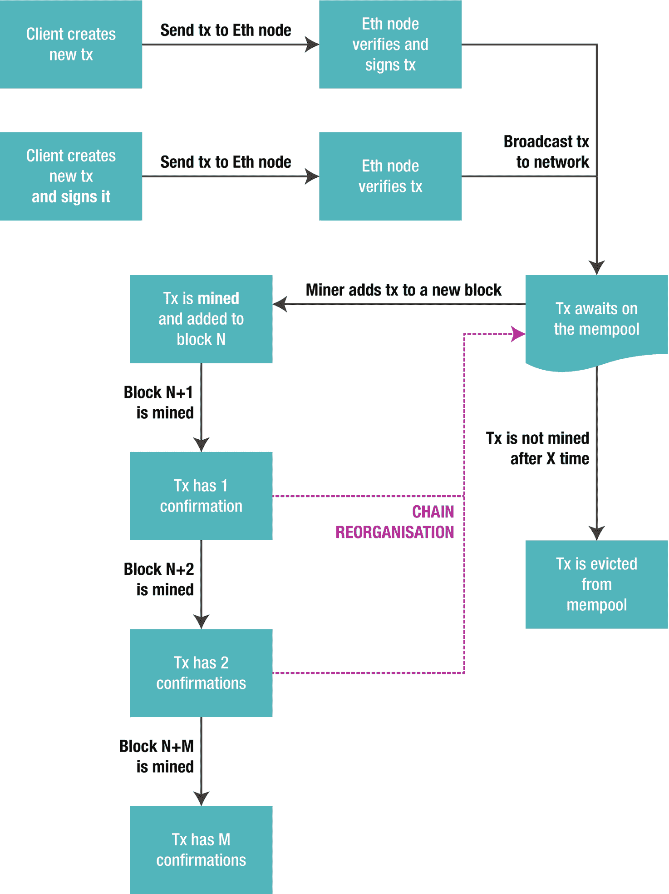
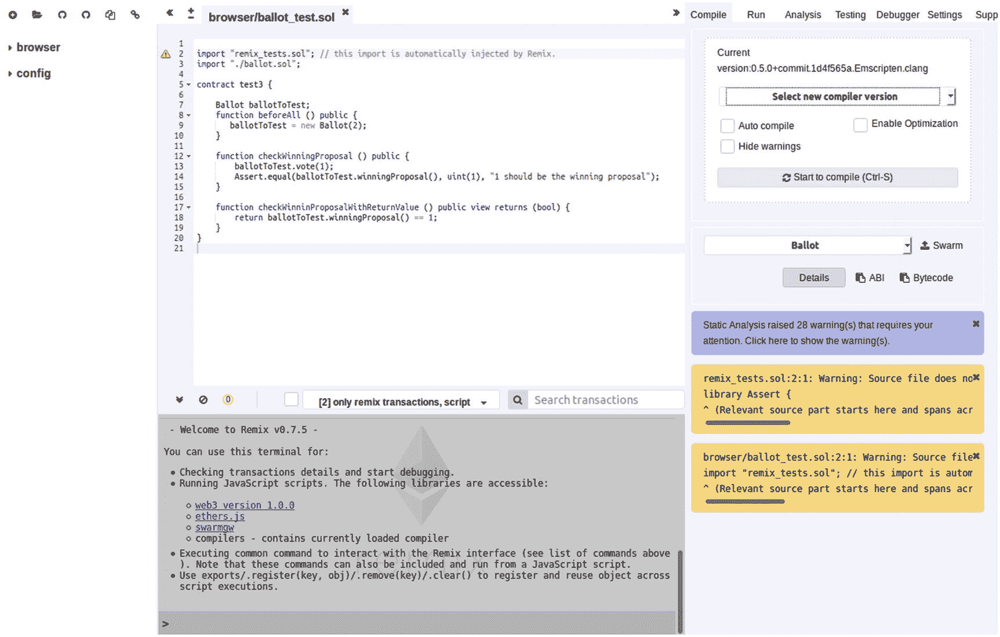
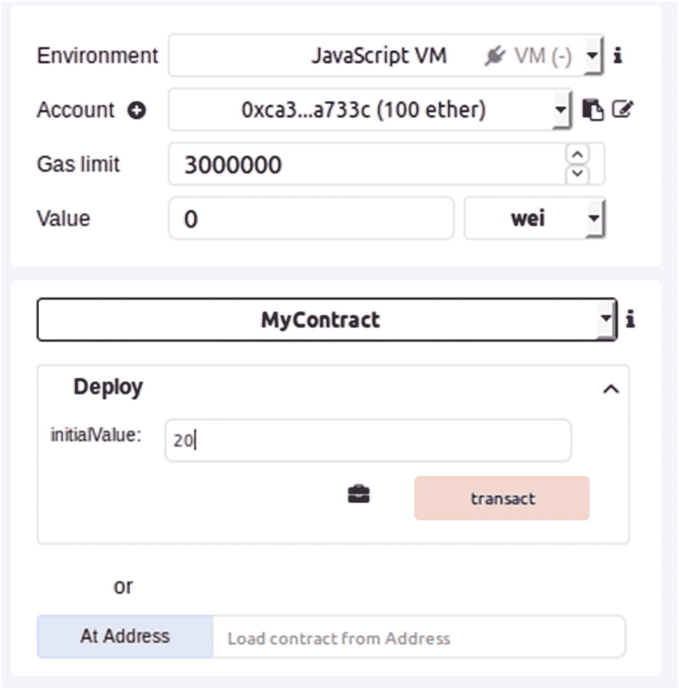
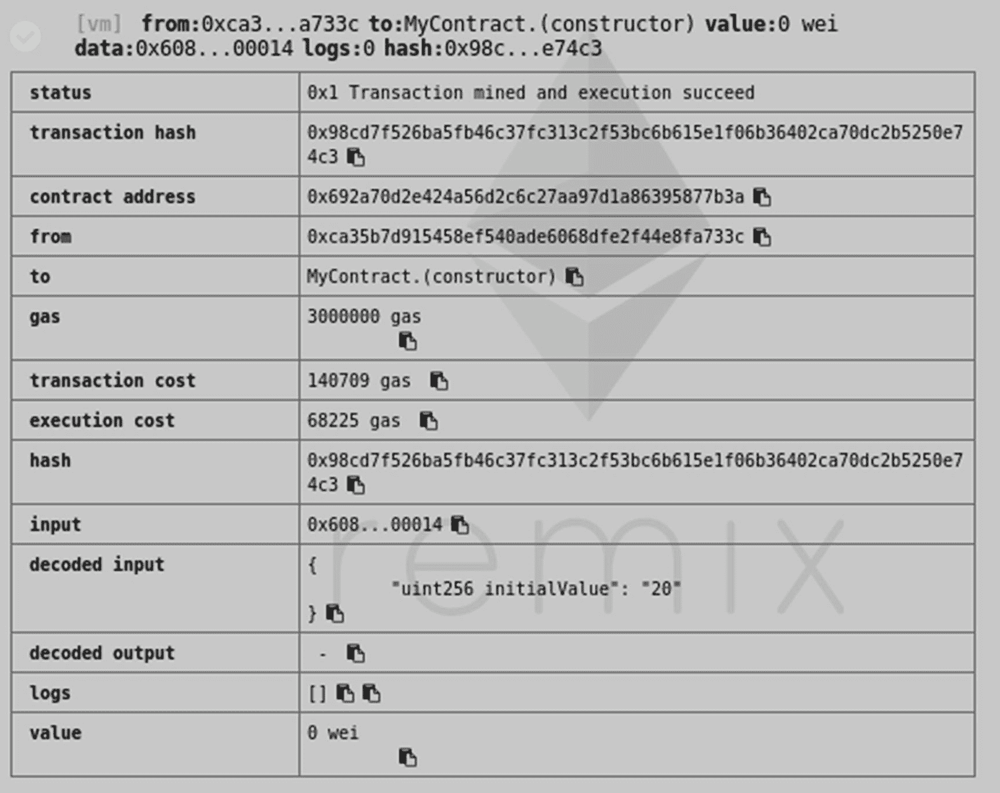
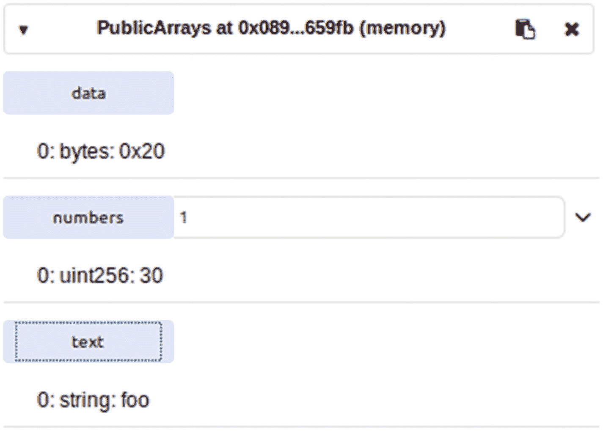
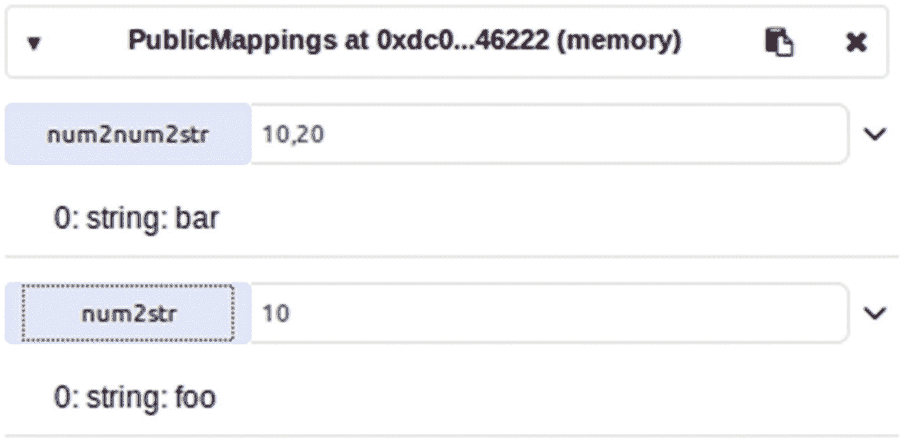
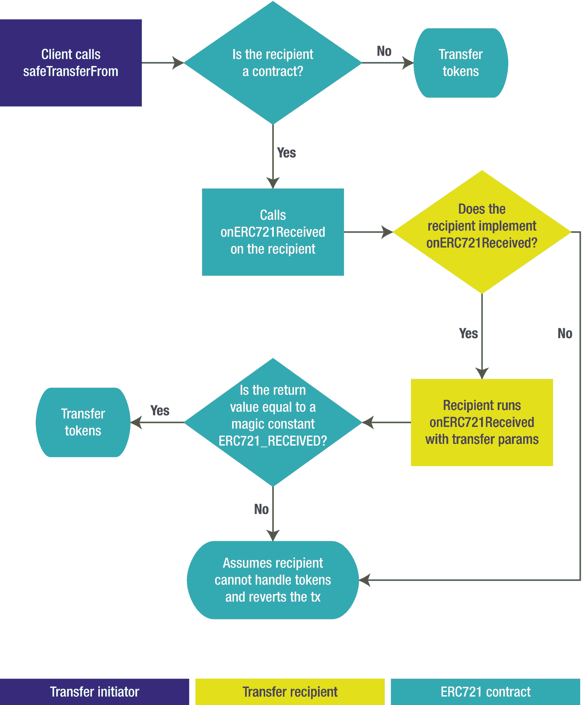

# 3. 智能合约速成课

智能合约是以太坊的核心组成部分。它们持有要在网络上执行的逻辑，跟踪自身的状态，并且还可以与其他智能合约交互。然而，它们也有一些局限性，例如每笔交易的计算能力受限，以及昂贵的存储成本。它们也无法发起新的交易——它们依赖外部账户来触发执行。并且，由于它们在以太坊网络上运行，它们无法直接与网络外部的任何事物交互。在本章中，我们将：

-   定义以太坊智能合约，并将其与外部拥有账户进行对比
-   识别交易的组成部分，例如数据、燃料限制和燃料价格
-   学习如何使用 `Solidity` 编写合约
-   了解 `Solidity` 的修饰器、数据类型和事件
-   回顾 `Solidity` 中的继承机制
-   介绍广泛使用的 `ERC20` 和 `ERC721` 代币标准

## 什么是智能合约？

“智能合约”这个概念的提出者可以追溯到 20 世纪 90 年代的尼克·萨博（Nick Szabo），它指的是在公共网络上能够捕捉现实世界合约概念并通过代码强制执行的自执行代码。

> 智能合约背后的基本思想是，许多种类的合同条款（例如抵押、担保、产权界定等）可以嵌入到我们使用的硬件和软件中，使得违约对违约方代价高昂（如果需要，有时甚至高到令人望而却步）。
>
> ——尼克·萨博

在以太坊网络中，智能合约以代码的形式呈现，部署在一个地址上，并拥有自己的状态。代码会在每次向其发送交易时执行，可以执行任意计算、读写自身的存储空间，并可能调用网络中的其他合约。智能合约也可以像任何其他以太坊地址一样持有和转移 `ETH`。

**注意**：由于智能合约由可以执行任意计算的代码驱动，它们实际上并不局限于金融合约条款。例如，它们可以用来表达不同类型的协议或共识，甚至是治理机制。

在软件领域，一个很好的智能合约类比是**参与者**模型。在参与者模型中，系统由称为参与者的独立单元组成，这些参与者接收消息并执行代码作为响应，修改自己的内部状态，并可能与系统中的其他参与者交互。从功能上讲，智能合约也可以被视为**归约函数**：给定一笔交易和合约的当前状态，智能合约返回一个更新后的状态。

### 外部账户 vs. 智能合约

当一个智能合约部署到以太坊网络时，它会在一个新的**地址**上被创建。这个地址作为智能合约的标识符：每当用户（或其他合约）想要与之交互时，他们会向该特定地址发送一笔**交易**。

另一方面，**外部拥有账户**（通常缩写为 `EOA`）是由现实世界用户——或网络外部的任何代理——拥有的账户。它们也由地址表示，使用的格式与标识智能合约的地址完全相同。因此，在以太坊中，对用户或智能合约的引用是平等的：它们都只是地址。这使得可以向接收方发送 `ETH`，而无需区分该地址是由智能合约支持还是由最终用户管理。

然而，智能合约账户和外部拥有账户之间存在一些值得注意的区别：

-   首先也是最重要的，智能合约账户拥有**代码**，该代码会在每笔交易上执行。向外部拥有账户发送交易不会触发网络上的任何执行。
-   智能合约账户无法发起交易。智能合约只能响应传入的消息，并可能在此过程中调用其他合约，但它们自己无法启动新交易。一个需要按时执行（类似于定时任务）或根据事件（例如余额在特定地址之间转移）执行的合约，需要有一个外部拥有账户（`EOA`）来调用它以触发操作。
-   只有外部拥有账户拥有对应的**私钥**。私钥用于签署发送到网络的新交易，作为身份验证的一种手段。智能合约无法发起新交易，因此它们不需要签署任何操作。

**注意**：最后一个区别的一个影响是，只有外部拥有账户可以**签署**任意消息。私钥不仅可用于签署以太坊交易，还可用于签署包含任何信息的纯文本消息。例如，用户可以签署一条消息来证明其身份（例如“我是 Github 上的 `spalladino`”），任何人（甚至是合约）都可以恢复出与该签名对应的以太坊地址。这使他们能够验证该账户的所有者就是撰写该消息的人。智能合约没有私钥这一事实意味着它不可能签署消息。

### 代码和状态

智能合约有两个主要属性：其代码和其状态。合约的状态由其 `ETH` 余额（因为所有以太坊地址都有关联余额）及其存储空间（其中持久化保存其变量的值）组成。

智能合约中的代码通常很短，因为其执行“时间”有一个由以太坊网络定义的严格上限。合约每次收到交易时都会执行代码，并且代码可以访问合约的本地存储空间以及交易的上下文。

**注意**：智能合约的代码是不可变的。这意味着，一旦部署，智能合约就无法更改。虽然这符合现实世界合约的原始软件概念，但也给开发带来了一些挑战。它使迭代开发变得特别困难，并且合约在推送到生产网络之前必须完全没有错误。这就是为什么智能合约的安全性如此关键：智能合约不仅位于公共网络中，任何攻击者都可以自由与之交互，而且如果发现漏洞，原始开发者也无法修补。如果这个限制的前景令人生畏，请不要担心，因为有一些变通方法（^(⁴⁴)）可用于升级智能合约，即使其代码是不可变的。

所有以太坊代码都不是原生运行的，而是由以太坊节点在以太坊虚拟机（`EVM`）上执行。`EVM` 执行一种低级的、基于栈的汇编语言，操作 32 字节的字（`word`），通常被称为 *EVM 汇编*。该汇编拥有用于传统算术和逻辑运算、基本控制流以及一些以太坊特定操作的操作码，例如访问存储（`storage`）和内存（`memory`），或查询和管理 `ETH` 余额。还有用于计算哈希值或处理椭圆曲线签名（^(⁴⁵)）的原语。值得一提的是，`EVM` 不支持浮点运算，所有操作都在用作定点小数的 256 位整数上完成，以最小化数值错误的风险。

**注意**：在撰写本文时，基于 `WebAssembly` 的第二个后端（名为 `eWASM`）正在开发中，作为执行以太坊代码的替代环境。由于它基于现有的 `WebAssembly` 技术，因此可以利用已经可用的工具链和优化，而无需从头开始重新实现。以太坊节点预计将能够接受并执行上述两种格式的智能合约代码。

`EVM` 的执行模型旨在以性能换取简单性。所有事务都按顺序执行（即一个接一个），并且始终在单个执行线程中。这使得对智能合约的推理变得更容易：当合约响应一个事务执行一段代码时，你可以确保它不会同时收到可能影响当前线程的另一个事务。

然而，由于合约可以调用其他合约，`EVM` 确实允许*重入调用*。例如，如果合约 `A` 调用合约 `B`，`B` 可以在同一笔事务中回调 `A`。重入性可能难以推理，并且已成为生态系统中一些重大黑客事件的根源。2016 年著名的 `The DAO` 黑客事件（该事件在决定将被黑用户资金归还后，促使链分叉为以太坊和以太坊经典）就是由重入性漏洞造成的：

> *在对以太坊代码进行审查时需要特别小心，以确保任何转移价值的函数都发生在所有状态更新之后，否则这些状态值将必然容易受到重入攻击。*
>
> `—`Phil Daian, “Analysis of the DAO exploit”^(⁴⁶)

**注意**：与大多数平台一样，除非你正在处理某些特别晦涩的功能，否则很少会直接用汇编语言编写智能合约。有几种专门为智能合约构建的高级语言，可以编译成 `EVM` 代码。其中最流行的是 `Solidity`，我们将在后续部分进行回顾。

智能合约中的状态由其存储（`storage`）和余额（`balance`）组成。后者是两者中最直接的：以太坊中所有地址类型，无论是外部拥有账户还是智能合约，都有一个以 `ETH` 计价的关联余额。以太坊提供了用于查询这些余额（既可以从智能合约内部，也可以从网络外部）以及轻松转移余额的原语。

至于智能合约中的存储空间，它是极其巨大的：一个由 2²⁵⁶ 个插槽（每个插槽 32 字节）组成的可寻址空间。然而，在 `EVM` 中写入存储非常昂贵，因此应始终谨慎使用。

由于存储使用成本高昂，`EVM` 还提供了另一个 256 位可寻址的临时空间，称为*内存*，它相当于其他环境中的内存堆，并且保证在事务之间被清除。

### Gas 用量

在以太坊网络上执行代码需要消耗 *gas*。智能合约运行的每项操作都会消耗预定义的 `gas` 量，其中更复杂的操作消耗的 `gas` 比简单的操作更多。总而言之，`gas` 只是执行成本的一种度量，旨在防止以太坊上出现过于复杂的计算。由于每笔事务都需要由网络上的每个全节点执行以进行验证，因此保持它们尽可能简单至关重要。这也是为什么在区块链上创建新数据的操作（例如写入存储或创建新合约）是 `gas` 消耗最高的操作之一。

`gas` 是如何获得的？该过程在每个事务上自动处理。每当用户发送新事务时，他们会指定一个 *gas 价格*，即 `ETH` 与 `gas` 之间的兑换率。事务运行后，会计算使用的 `gas` 总量，然后使用此 `gas` 价格将其转换为 `ETH`，并从发送者的余额中扣除。请注意，`gas` 价格没有要求，它可以几乎任意高或低。然而，`gas` 价格非常高的事务发送成本将极其昂贵；另一方面，`gas` 价格非常低的事务对矿工没有吸引力，并且很可能永远不会被包含在区块链中。

**注意**：有些服务，例如 ETH 加油站，^(⁴⁷) 会提供以太坊网络燃料价格的实时统计数据。这为你提供了发送交易时应使用的平均燃料价格信息。

除了燃料价格，交易发送方还必须指定执行期间允许使用的最大燃料限额。如果交易在达到允许使用的全部燃料时仍未执行完毕，它将停止运行并报告燃料耗尽错误。这使用户能够控制他们愿意为交易支付的最高成本。反之，这也允许网络在实际运行代码前，通过检查发送方余额是否至少等于最大燃料限额乘以指定燃料价格，来验证用户是否有足够的 `ETH` 支付执行费用。

请注意，假设运行交易的上下文环境不变，可以使用以太坊节点查询运行该交易所需的预估燃料量。这允许动态计算一笔交易应附带多少燃料，而不必为你系统发出的每次调用都硬编码该数值。

然而，由于实际消耗的燃料量取决于执行了哪些操作，而这些操作又取决于交易运行的上下文环境，因此节点执行的预估并不总能代表实际情况。例如，考虑以下智能合约的伪代码：

```
if balance > 1ETH:
    run_expensive_operation
else:
    return true
```

如果在合约余额低于 1 `ETH` 时进行预估，那么燃料估算值会偏低，用户可能会使用该值将交易发送到网络。但是，在实际被矿工打包之前，可能有另一笔交易抢先于原始交易，并将合约余额增加到超过 1 `ETH`。这将导致原始交易实际需要更高的燃料量，并最终因燃料耗尽错误而失败。在与网络进行交互编码时，你应该意识到这些情况，始终在预估量的基础上为燃料限额增加一个合理的缓冲区，并在需要时使用更新后的预估量重试交易。

### 交易

回顾一下，为了与智能合约交互，外部账户必须签署并广播一笔指向合约地址的交易。然后，网络会以交易中包含的所有数据（以及合约的状态）作为上下文来执行智能合约的代码。

一笔交易是包含以下属性的消息：

*   发送方地址，这始终是一个外部拥有账户
*   目标地址
*   要转移的 `ETH` 数量，可以为 0
*   一个二进制数据字段，用于打包要由智能合约执行的参数
*   一个 `nonce` 值
*   最大燃料限额
*   燃料价格，用于在燃料和 `ETH` 之间进行换算

交易也可以发送给另一个外部拥有账户。在这些情况下，数据域通常为空，因为唯一目的是在账户之间转移 `ETH`。然而，它们同样会消耗燃料，只是与发送给智能合约的交易相比消耗量较少。

**注意**：在最低层面上，交易实际上并不将发送方地址作为属性包含在内。它是从交易的签名中推导出来的。

交易中我们尚未提到的唯一字段是 *nonce*。这是一个递增的整数值，用于确保从一个账户发送的所有交易按顺序处理：`nonce` 不能跳过某个值，并且始终等于该地址已发送的已执行交易与待处理交易的数量之和。它也是网络重放保护的一部分。通常，你无需显式处理 `nonce`。

交易的生命周期有点复杂，因为交易需要被矿工打包并确认，才能被视为最终状态（图 3-1）。



图 3-1 以太坊交易的生命周期

交易生命周期的第一步是发送给一个以太坊节点。这可以是用户拥有的私有节点，也可以是未关联任何账户的公共节点。在前一种情况下，签名通常由持有用户私钥的节点处理；在后一种情况下，交易由客户端软件签名，然后发送给节点。无论哪种情况，节点都会通过尝试在本地执行来检查交易的有效性，如果有效，则将其广播到网络中。

已广播的交易被认为是“待处理”的，因为它们尚未被包含在区块中，而是在所谓的“交易内存池”中等待。交易被矿工处理并添加到区块链所需的时间通常取决于网络拥堵程度和交易本身的燃料价格——正如我们之前提到的，更高的燃料价格会使得交易更具吸引力，从而被更快地挖出。

**注意**：待处理的交易在被挖出之前可以被“替换”。在一笔交易广播之后，在被矿工打包之前，你可以发送另一笔具有相同 `nonce` 但更高燃料价格的交易。矿工看到两笔待处理交易后，会优先选择新交易，这会使原始交易因 `nonce` 过时而失效。替换交易用于纠正错误或提高同一笔交易的燃料价格以加快确认速度，但这并非非常广泛使用的技术。我们将在第 5 章中讨论这一点。

最终，交易会被“挖出”并包含在一个区块中。然而，由于以太坊共识算法的工作方式，仍有可能发生链“重组”，包含此交易的区块被另一个区块取代。这种情况只可能发生在刚刚挖出的区块上。随着在其之上不断挖出新区块，该区块被从链中移除的可能性会越来越小。十几个确认（即新挖出的区块）对于大多数场景来说已经足够，但根据你的用例，你可能希望等待更多确认。

一个账户可能有多个待处理交易，因为协议不要求在发送下一笔交易之前等待前一笔交易被挖出或确认。`Nonce` 确保了所有待处理交易将被矿工按正确顺序处理。

以太坊上的交易并非总能成功。交易可能因多种原因失败，例如执行期间燃料耗尽，或智能合约代码中的前置条件检查失败。智能合约可以对其被调用时的参数执行检查，如果未通过所有前置条件，则可能导致交易失败。交易是原子性的，这意味着就状态变更而言，它们要么全部执行，要么全部不执行。换句话说，失败的交易不会在区块链上持久化任何更改，除了从发送方余额中扣除燃料执行费。因此，当你发送的交易失败时，你可以确信链上合约的状态并未以任何方式被改变。

**注意**：失败的交易要么被 `ABORT`（中止），要么被 `REVERT`（回滚）。两者的区别在于：前者会消耗交易最大许可额度内的全部 `gas`，而后者仅消耗交易失败前的 `gas`。智能合约通常在前提条件检查失败时触发 `REVERT`，以避免浪费用户的 `gas`。

在执行过程中，交易可能会*记录*任意信息。这些日志无法从其他智能合约访问，只能在以太坊网络外部（例如前端界面）查看。日志数据可以是结构化的，甚至可以被*索引*，从而让客户端能够搜索特定事件。在后续探讨 `Solidity` 的*事件*时，我们将更深入地处理日志。

### 调用

虽然交易是在以太坊区块链中执行状态变更的唯一方式，但它们并非与智能合约交互的唯一途径。任何链下客户端都可以通过对智能合约发起静态*调用*来执行查询。

调用与交易的不同之处在于：调用无需签名，也不会广播到以太坊网络，因此无法更改区块链状态，也不需要消耗任何 `gas`。调用始终由接收它的节点处理，仅用于从智能合约中查询数据。

调用执行智能合约代码的方式与交易相同，唯一区别在于：调用期间所做的任何更改都不会持久化，并且调用的返回值会直接返回给发送方（与交易不同——交易发送方无法获取返回值）。如果将交易视为改变智能合约状态的“设置器”，那么调用就是“获取器”。

调用甚至可以对较早的区块发出。由于区块链中的所有数据都是持久化的，每个区块上的链状态都是已知的^(⁴⁸)，因此可以在较早区块的上下文中对智能合约发起调用。这一功能并不常用，但可用于重构合约的历史记录——尽管*日志*是更常用的方法。

## Solidity

`Solidity` 是一种面向对象的静态类型语言，其花括号语法受 Javascript 启发，并支持多重继承。它是智能合约开发中最流行的语言。在撰写本文时，最新的次要版本是 0.5，本书将全程使用该版本。

`Solidity` 代码的基本单元是 `contract`（合约），它类似于类，但编译后会生成部署新智能合约的代码。`Solidity` 合约可以包含状态变量（持久化存储在合约的存储空间中），也可以定义通过调用或交易执行的函数。该语言还支持修饰符、事件、库、复杂数据类型以及其他概念，我们将在本节中逐一探讨。

我们仅对 `Solidity` 进行概述，涵盖理解和微调智能合约系统所需的基本特性。强烈建议你阅读 `Solidity` 文档^(⁴⁹)以更深入地学习该语言，并且在部署合约前审阅安全最佳实践也是个好主意^(⁵⁰)。

### Remix

在深入学习 `Solidity` 之前，我们先介绍 Remix^(⁵¹)——一个用于快速原型化 `Solidity` 代码的工具（图 3-2）。`Remix` 是一个完全在浏览器中运行的 `Solidity` 开发 IDE，集成了 `Solidity` 代码编辑器、编译器和 `EVM` 运行时。`EVM` 运行时允许你在模拟环境中本地部署和测试智能合约。`Remix` 还可以连接到任何以太坊节点，让你能够在任何网络（无论是本地开发网络还是主以太坊网络，也称为*主网*）上管理智能合约。



图 3-2
remix.ethereum.org 上的 `Remix` IDE 截图

`Remix` 提供了开发、分析、部署、交互及调试智能合约的多项功能。我们将聚焦于最基础的功能，但你可以自由探索该工具的其他特性。

首先，点击 IDE 左上角的加号添加新文件，创建一个名为 `MyContract.sol` 的文件。在屏幕右侧的*编译*选项卡中，确保使用编译器版本 0.5.0，并选择*自动编译*合约。我们将用它来测试第一个 `Solidity` 合约。

**注意**：`Solidity` 编译器用 C++编写，不仅会编译为原生代码，还会通过 `Emscripten` 编译为 `JavaScript`。这使你能够直接在浏览器中编译 `Solidity` 智能合约。

### 你的第一个 Solidity 合约

让我们从一个非常简单的 Solidity 合约开始（代码清单 3-1）。该合约将持有一个整型值 `myNumber`，并提供构造函数来设置其初始值、一个公开函数来增加指定数值，以及一个公开的获取器来检索当前值。

```
pragma solidity ⁰.5.0;
contract MyContract {
    uint256 private myNumber;
    constructor(uint256 initialValue) public {
        myNumber = initialValue;
    }
    function increase(uint256 x) public {
        require(x > 0);
        myNumber = myNumber + x;
    }
    function getValue() public view returns (uint256) {
        return myNumber;
    }
}
代码清单 3-1
实现计数器的简单 Solidity 合约
```

让我们逐行分析这个合约。首先注意到的是 `pragma` 指令，它设定了与代码对应的 Solidity 编译器版本要求。不符合所需版本的编译器将拒绝编译该文件。具体来说，`⁰.5.0` 表示任何以 `0.5` 开头的版本。^(⁵²)

接下来是 `contract` 代码块，它定义了一个待部署的智能合约。合约可以定义多个状态变量（如示例中的 `myNumber`），这些变量将保存在 EVM 的存储空间中。

#### 注意

在 EVM 中，存储空间始终初始化为零。这意味着 Solidity 中所有状态变量默认值都是零。为避免任何价值数十亿美元的错误，Solidity 没有 `null` 值。^(⁵³)

合约可以定义多个函数，这些函数将在其上下文中执行，并可访问其存储空间。函数必须始终定义参数类型和返回类型（如有）。此外，函数可以具有不同的可见性，具体取决于它们是仅在合约内部调用还是可从外部调用；也可以限制为不修改合约的存储空间（如示例中的 `getValue`）。可选的 `constructor`（构造函数）在合约部署时执行。

#### 注意

Solidity 支持函数重载，这意味着同一个合约中可以有两个名称相同但参数不同的函数。虽然这在某些场景下很有用，但一些客户端库（尤其是 JavaScript 库）对它们的支持并不总是很好。此外，也有人认为重载函数会使代码更难以理解，而其他一些智能合约语言甚至明确设计为不支持函数重载。

本示例合约中另一个有趣的关键字是 `require`。它允许你检查一个条件，如果不满足则抛出一个错误（EVM 回退）。它通常用于检查函数的前置条件。

请记住，你的合约对区块链上的所有人都是公开的。这意味着任何攻击者都可以使用他们想要的任意参数向任何公共函数发送交易。这构成了一个极具说服力的理由：你应该根据需要添加尽可能多的 `require` 语句，始终验证你函数的输入。

在更深入地探讨 Solidity 代码之前，让我们先在 Remix 中试试我们的第一个合约。将 `MyContract` 的代码复制到 Remix 中新创建的 `MyContract.sol` 文件标签中，并等待它自动编译。然后打开 IDE 右侧的 *运行* 标签（图 3-3）。这将允许你配置想要部署合约的环境：选择 *JavaScript VM* 在浏览器的模拟区块链中运行代码，并选择任意一个提供的 *账户*。



**图 3-3** 通过 Remix 部署合约

要部署你的合约，从合约下拉菜单中选择 `MyContract`，输入一个初始值用于我们定义的构造函数，然后确认交易。这会将合约部署到你浏览器内的环境中，并且几乎会立即执行。请记住，在真实的区块链上工作时，部署实际上需要花费几秒钟。

你会注意到在中间底部面板出现了一个新的日志条目（图 3-4）。它包含了已执行交易的详细信息。花点时间仔细查看并理解列出的所有信息，并参考本章中“交易”部分。



**图 3-4** Remix 控制台中显示的交易详情

此外，在 IDE 右侧边栏的底部，你现在会看到在 *已部署合约* 部分下列出了 `MyContract` 的一个实例，包括其部署地址。展开它，你将可以访问该合约的公共函数：`increase` 和 `getValue`。尝试调用这两个函数，对 `increase` 使用不同的值，来试用这个合约并查看生成的交易。

请记住我们之前对交易和合约调用所做的区分：前者会向整个网络广播一笔可能改变合约状态或地址余额的交易，而后者只是查询单个节点以检索一个值。由于 `getValue` 被标记为不修改合约的方法（通过 `view` 关键字），Remix 在执行它时会自动向合约发起一个调用（call）而非一笔交易（transaction）。另一方面，由于 `increase` 确实会改变合约的状态，因此每次调用它时都会生成一笔新的交易。

我们现在将更深入地探讨 Solidity。请随意将代码示例复制到 Remix 中，部署它们，并与它们交互。请记住，如果你修改了合约的代码，你需要部署它的一个新实例才能与新版本交互，因为已部署的合约是无法修改的。此外，如果你想详细了解某个特定主题，请参考 Solidity 文档。

### 函数里有什么？

Solidity 中的函数定义具有以下结构：

-   函数名
-   一组带类型的参数
-   一个可见性修饰符
-   一个支付能力修饰符
-   一组自定义修饰符
-   一组返回值

一个函数可能看起来像下面这样。注意，一个函数可以返回多个单一值，表示为一个元组。

```
function myFunction(uint256 param1, bool param2)
public payable onlyOwner
returns (uint256, bool);
```

#### 可见性修饰符

与大多数面向对象语言一样，Solidity 中的函数可以指定不同的可见性或访问修饰符，用于控制函数是否可以从合约外部调用。Solidity 提供了以下四个访问级别：

-   外部（External）
-   公共（Public）
-   内部（Internal）
-   私有（Private）

**私有**函数只能从同一个合约内部调用。在底层，它们是通过 `jump` 到合约代码的另一部分来实现的。这意味着对私有函数的调用不会创建一个新的作用域以及相关的调用数据、价值、gas 等。相反，它在调用者相同的作用域内执行，这使得调用本身在 gas 消耗方面比较廉价。**内部**函数的工作机制完全相同，只是它们允许派生合约调用它们（等同于其他语言中的 `protected`）。

另一方面，**外部**函数只能从外部账户或其他合约调用。外部函数用于定义合约的暴露接口，通常也是进行大部分输入参数检查的地方。一个合约调用另一个合约时，是通过发起一个 EVM `call` 来实现的，这会创建一个新的作用域，并带有自己的调用数据、转移的价值、gas 等。这比跳转到内部或私有函数要昂贵，但这是 EVM 的要求。请注意，可以从定义它的同一个合约中调用外部函数，但这同样需要进行一次 EVM 调用。

如果你有一个外部函数，但又需要从合约内部调用它，你应该将其标记为**公共**函数。公共函数是外部函数和内部函数的混合体：它们既支持从合约外部调用，也支持从合约内部调用。编译器足够智能，如果函数是从同一个合约内部调用的，它会使用廉价的内部跳转；但如果是从另一个合约调用一个公共函数，则会创建一个新的 EVM 调用。

请注意，状态变量也有自己的一组可见性修饰符，即 `public`、`internal` 和 `private`，不过它们的语义略有不同。私有状态变量只能从同一个合约内部访问，内部状态变量可以从同一个合约及其任何派生合约访问（与函数的情况相同）。然而，`public` 修饰符应用于状态变量时，其作用类似于内部修饰符，并会定义一个与状态变量同名的隐式 getter 函数（清单 3-2）。

```
contract ExplicitGetter {
    uint256 internal _value;
    function value() public returns (uint256) {
        return _value;
    }
}

contract ImplicitGetter {
    uint256 public value;
}
```

**清单 3-2** 使用 getter 函数与公共状态变量修饰符的示例。就 getter 而言，两个合约是等价的。不过有一点需要注意：隐式 getter 不能被派生合约重写。

#### 可支付修饰器（Payability Modifiers）

函数可以选择定义为 `payable`（清单 3-3）。这告诉 Solidity 该函数在被调用时可以接收 ETH。如果你试图向一个未定义为 `payable` 的函数发送 ETH，编译器会抛出一个错误。这可以防止意外地将余额发送到没有准备处理它的合约，从而可能将 ETH 锁定在合约中。

```
contract Payable {
function canPay() public payable {  }
function cannotPay() public { }
}
contract Payer {
function pay(Payable p, uint256 eth) public {
// 此语法用于在函数调用时发送以太币
p.canPay.value(eth)();
// 此代码无法编译
p.cannotPay.value(eth)();
}
}
清单 3-3
Solidity 中可支付函数与非可支付函数的对比
```

Solidity 还会添加运行时检查，以确保没有余额被发送到非可支付函数。例如，如果你试图从外部账户向合约的非可支付函数发送 ETH，你将收到一个 `revert` 错误。

#### 自定义修饰器（Custom Modifiers）

Solidity 允许你定义自己的函数修饰器。这些代码块可以作为过滤器在函数执行前后运行，甚至可以调用其他合约函数、管理存储或根据当前消息做出反应。

关于当前调用的信息可以通过名为 `msg` 的上下文变量获得，其中包括接收到的 ETH `value`（数量）、调用的 `sender`（发送方）地址、提供的 `gas`（燃料）、`gas price`（燃料价格）等。

修饰器的一个典型用例是访问控制（清单 3-4）。通过定义谁可以调用修饰器中的函数，你随后可以轻松地通过使用修饰器在多个函数间重用该逻辑。

```
contract OwnerDepositable {
address public owner;
constructor(address _owner) public {
owner = _owner;
}
modifier onlyOwner {
require(msg.sender == owner);
_;
}
modifier minDeposit(uint256 value) {
require(msg.value > 0);
_;
}
function ownerDeposits()
onlyOwner minDeposit(1 ether) payable public {
// 这里我们知道发送者是所有者，
// 并且已经转账至少 1 ETH
}
}
清单 3-4
使用自定义修饰器进行访问控制
```

修饰器使用 `modifier` 关键字定义，并通过下划线将调用交还给原始函数。然后，通过在函数的定义中按名称列出它们，将其应用于函数。修饰器甚至可以接受参数，这些参数在应用于函数时必须提供。

#### 回退函数（Fallback Function）

合约可以定义一个没有名称的函数。该函数被称为*回退函数*，如果合约收到一个不匹配任何其他函数的调用，则会调用它。

尽管它们可以用作合约中的兜底函数，但回退函数的主要用例是处理纯 ETH 转账（清单 3-5）。当你向合约地址转账资金时，通常不会在交易的 `data` 中包含任何内容。回退函数允许合约对该转账做出响应，或对转账本身执行检查。

```
contract NotCheap {
function() external payable {
require(msg.value >= 1 ether);
}
}
清单 3-5
使用回退函数防止合约接受低于 1 ETH 的转账
```

请注意，当使用 `transfer` 方法从 Solidity 代码中转账 ETH 时，只会分配非常少量的燃料补贴。这是出于安全原因，以防止在转账资金时发生重入攻击。这意味着回退函数应该只执行非常简单的检查或操作，否则在接收 ETH 时可能会耗尽燃料，从而导致转账交易被回滚。即使是一次存储写入，其成本也高于普通转账中可用的燃料补贴。

#### 警告

回退函数还需要指示合约是否可以接收 ETH。如果合约没有定义可支付的回退函数，则不能向其发送任何纯 ETH 转账。这可以防止意外地将资金发送到无法处理它们的合约，从而导致资金被锁定。

## 值数据类型

Solidity 支持传统的、基本的数据类型，例如 `bool` 或 `uint`，以及一些更复杂的数据类型，例如 `array`、`mapping` 或 `struct`。我们将从最简单的数据类型开始：值类型（清单 3-6）。

```
pragma solidity ⁰.5.0;
contract MyContract {
bool private myFlag;
uint256 private myUnsignedNumber;
int256 private mySignedNumber;
address private myAddress;
}
清单 3-6
合约中值数据类型的概览
```

### 布尔值和相等性

布尔字面量由关键字 `true` 和 `false` 表示。通常的逻辑运算可用，使用相同的符号，并具有与 javascript 相同的短路语义：

*   否定 `!x`
*   合取 `x && y`
*   析取 `x || y`

另一方面，相等比较运算符 `==` 和 `!=` 实际上表现得像 javascript 的 `===` 和 `!==`。Solidity 在进行比较时不会强制转换类型，并且在尝试比较两个不同类型的对象时会抛出编译器错误。这适用于所有数据类型，而不仅仅是布尔值。

### 整数和算术运算

整数类型可以是有符号和无符号的，并且可以定义为不同的大小——从 8 位到 256 位，以 8 位为步长。通常的算术、移位和位运算，以及比较运算符都是可用的：

*   `uint8`、`uint16`、`uint24`、...、`uint256` 是无符号整数类型。
*   `int8`、`int16`、`int24`、...、`int256` 是有符号整数类型。

由于整数类型通常用于表示智能合约中的价值，无符号整数比有符号整数常见得多。此外，由于不（完全）支持定点或浮点数值，通常使用具有固定小数位数的整数来表示所有价值。ETH 余额尤其如此，它总是以 wei（ETH 最小的可分割单位）表示：`1e18 wei` 等于 1 ETH。Solidity 甚至为处理这些单位提供了后缀：字面量 `1 ether` 实际上是整数值 `1e18`。还有用于处理时间值的后缀，例如 `minutes`、`hours`、`days` 和 `weeks`。在这些情况下，基本单位是秒，所以 `3 minutes` 被编译为整数值 `180`。

一句警告：Solidity 中所有整数算术运算都不进行溢出检查；这意味着可能会发生静默溢出。这在处理与价值相关的无符号数时尤其危险。例如，意外地将代表某人余额的变量减少到零以下，实际上会使该值变成接近 `2²⁵⁵`。出于这个原因，强烈建议始终使用 `SafeMath`（清单 3-7），这是一个由 OpenZeppelin 框架提供的库，它为每个算术运算添加了溢出检查（稍后会有更多关于导入和库的内容）。

```
import "openzeppelin-solidity/contracts/math/SafeMath.sol";
contract MyContract {
using SafeMath for uint256;
uint256 private myNumber;
function unsafeDecrease(uint256 x) {
// 如果 x > myNumber，myNumber 将静默地回绕
myNumber = myNumber - x;
}
function safeDecrease(uint256 x) {
// 如果 x > myNumber，这将抛出一个错误
myNumber = myNumber.sub(x);
}
}
清单 3-7
算术运算中使用 SafeMath 的示例
```

我们将在本章稍后部分回顾如何使用导入和库。目前请记住：在 Solidity 中直接使用算术运算符而不通过 `SafeMath`，是一个潜在的安全风险。

### 固定大小字节

Solidity 还以 `bytes1`、`bytes2`、……、`bytes32` 数据类型的形式提供最多 32 字节的固定大小字节字符串。由于它们都适配于 EVM 字，因此它们也都被作为值类型处理，行为与整数类型相似，只是不提供任何算术函数。它们支持比较、按位和移位运算符，以及一个索引访问运算符来从数组中检索单个字节。

```
bytes32 data;
uint8 index;
byte firstByte = data[0];
```

这些类型常用于存储哈希值或标识符，其数值本身并不重要。例如，预编译的哈希函数如 `sha256` 或 `ripemd160` 分别返回 `bytes32` 和 `bytes20`。

### 地址、合约和转账

`address` 数据类型代表任何以太坊地址。虽然任何至少 160 位的整数或字节类型都可以用来存储地址，但 Solidity 专门提供了此类型来处理它们。地址还具有检查 ETH 余额以及转账的特定属性。

Solidity 将地址区分为两种类型：`address` 和 `address payable`。两者的底层表示相同，区别在于只有后者提供了向它发送 ETH 的 `transfer` 方法。这允许你依赖类型系统来决定哪些地址应该被允许从你的合约接收资金。一个非 payable 地址只提供一个 `balance` 属性来查询其 ETH 余额。

下面这个相当无趣的合约（列表 3-8）跟踪了创建合约的 owner，并提供了一个将资金转发给 owner 的函数。

```
contract MyContract {
    address payable private owner;
    address private lastContributor;

    constructor(address payable _owner) public {
        owner = _owner;
    }

    function forward() public payable {
        uint256 ethReceived = msg.value;
        require(ethReceived > 0);
        lastContributor = msg.sender;
        owner.transfer(ethReceived);
    }
}
```

注意 owner 地址需要存储为 `address payable` 类型；否则，在尝试编译 `owner.transfer(ethReceived)` 时，编译器将抛出错误。另一方面，`lastContributor` 可以是一个普通地址，因为它永远不会从合约接收 ETH。

**注意**：Solidity 提供了另一个发送 ETH 的函数：`send`。两者的区别在于，`send` 返回一个布尔值指示 ETH 转账是否成功，而 `transfer` 在失败时会抛出 REVERT。为避免因忘记检查 `send` 返回值而导致的错误，建议始终使用 `transfer`。

在 Solidity 中定义的任何合约也可以用作一种类型（列表 3-9）。合约实例拥有该合约中定义的所有公开函数。

```
contract Provider {
    function answer() public pure returns (uint256) {
        return 42;
    }
}

contract Caller {
    function fetchAnswer(Provider provider) public {
        uint256 answer = provider.answer();
        // 对返回的答案进行处理
    }
}
```

在内部，合约实例以其地址形式存储，因此合约可以与地址类型相互转换。这在尝试检查合约余额或向其转账时非常有用，因为只有 `address` 类型提供了 `balance` 和 `transfer` 方法。

```
function sendFunds(MyContract recipient) {
    recipient.transfer(1 eth); // 编译错误
    address(recipient).transfer(1 eth); // 正确！
}
```

合约类型也可以用于部署合约的新实例（列表 3-10）。你可以利用这一点来创建用于设置和创建其他合约的工厂类合约。

```
contract Box {
    uint256 public value;

    constructor (uint256 _value) public {
        value = _value;
    }
}

contract Factory {
    function create(uint256 _value) public returns (Box) {
        return new Box(_value);
    }
}
```

此外，与许多其他语言一样，Solidity 也提供了一个 `this` 关键字，代表当前合约。`this` 的类型就是合约本身。

```
function forward(address payable beneficiary) public {
    uint256 myBalance = address(this).balance;
    beneficiary.transfer(myBalance);
}
```

## 引用类型

Solidity 中的引用类型包括数组、字符串、映射和结构体。与值类型在赋值或作为参数传递时始终通过拷贝处理不同，引用类型通常传递一个对象的句柄，该对象可以被另一个函数别名引用或修改。我们将结合最常见的引用类型——数组来回顾这是如何工作的。

### 数组、字节数组和字符串

Solidity 支持固定大小和动态数组。数组类型是参数化的，这意味着它们被定义为一个基于基本类型的数组。这允许你定义像 `uint256[]` 这样的动态整数数组，或像 `address[4]` 这样的固定大小地址数组。你甚至可以使用数组的数组，但请注意，Solidity 中的表示法与其他语言相反：`bool[][4]` 是一个包含四个动态数组的固定大小数组。此外，你无法在外部函数调用中返回数组的数组。

数组有一个 `length` 方法来查询其大小，并提供一个索引运算符来访问或修改数组中的某个位置。动态数组还有 `push` 和 `pop` 方法来添加或删除元素。在 Solidity 中，通常使用 for 循环来遍历数组（列表 3-11）。

```
contract ArrayTest {
    uint256[] array;

    function sum() public view returns (uint256) {
        uint256 total = 0;
        for (uint256 i = 0; i < array.length; i++) {
            total += array[i];
        }
        return total;
    }

    function add(uint256 value) public {
        array.push(value);
    }
}
```

**警告**：对无界数组使用 for 循环是危险的，因为它可能消耗任意数量的 gas，甚至可能超过单个区块能容纳的 gas 上限，导致函数无法被调用。应始终避免遍历可能无限增长的数组，或者至少提供按可控大小分批迭代的方法。

请记住，数组是引用类型而非值类型。顾名思义，引用类型包含的是对一个对象的引用，而不是实际的值。这意味着，根据上下文的不同，将一个数组变量赋值给另一个变量并不会创建副本，而是传递一个指向同一数组的引用。

数组是复制还是传递引用，取决于其数据位置。数据位置可能是一个令人困惑的概念，因为它在其他语言中没有直接对应的概念，并且是 EVM 抽象泄漏的体现。Solidity 没有试图隐藏这一区别而导致可能令人惊讶的结果，而是选择将这一差异显式化，迫使程序员意识到这个重要的实现细节。

正如我们之前提到的，每个合约都可以访问一个用于持久化数据的内部存储。由于使用存储空间成本很高，EVM 提供了内存堆用于临时操作。这正是 Solidity 定义的两种主要数据位置：`storage` 和 `memory` 。第三个位置是 `calldata`，它指的是在交易中提供数据的空间。在实际应用中，`calldata` 的工作方式与 memory 类似，只不过它是不可变的。

每个引用类型的局部变量或函数参数都需要指定数据位置。唯一不需要指定数据位置的情况是在声明合约状态变量时，因为它们始终保存在存储中。请注意，为函数参数指定位置时，需要遵循以下规则：

- 外部函数只能接受 `calldata` 引用类型。
- 公有函数只能接受 `memory` 引用类型。
- 内部或私有函数只能接受 `memory` 或 `storage` 引用类型。

赋值语义取决于引用类型的位置（清单 3-12）。从一个 `memory` 引用赋值给另一个只会传递对同一对象的引用，从一个 `storage` 引用赋值给另一个也是如此。但是，当从 `memory` 引用赋值给 `storage` 引用时，Solidity 会将整个内存数组复制到存储中。

```
contract DataLocations {
    uint256[] public storageArray;

    function test(uint256[] memory memoryArray) public {
        // 我们将 memoryArray 别名化为 localMemory
        uint256[] memory localMemory = memoryArray;
        localMemory[0] = 42;
        require(localMemory[0] == memoryArray[0]);

        // 我们将 memoryArray 复制到 storageArray
        storageArray = memoryArray;
        require(storageArray[0] == 42);

        // 我们将 storageArray 别名化为 localStorage
        uint256[] storage localStorage = storageArray;
        localStorage[0] = 21;
        require(localStorage[0] == storageArray[0]);

        // 对 storageArray 的更改不会影响
        // 原始的 memoryArray
        require(storageArray[0] != memoryArray[0]);
    }
}
```

*清单 3-12 – 展示 memory 和 storage 位置修饰符在 Solidity 中的工作方式*

数组的一个特例是 `bytes`，其行为完全类似于 `byte[]`（即一个 `byte` 的动态数组）。不过，该类型在内存或存储中经过了优化和紧凑打包，因此应始终优先使用它而不是 `byte[]`。

另一个特例是字符串。`string` 是一个不可变的 UTF-8 编码字节数组，不允许按索引访问。字符串字面量使用双引号定义。请记住，Solidity 几乎不提供字符串操作函数，因此字符串通常作为不可变的标识符或描述信息存储。

```
string myString = "foo";
```

与值类型不同，当数组状态变量被定义为 public 时，Solidity 生成的隐式 getter 函数会接受一个索引参数，以标识要检索数组中的哪个元素。这仅适用于常规的动态数组：`bytes` 和 `string` 会在单次调用中返回。

例如，给定以下包含公有动态数组、字符串和 bytes 的合约，可使用以下 getter 函数（图 3-5）：



*图 3-5 – 使用需要索引的 getter 访问公有动态数组与获取字符串或 bytes 变量的对比*

```
contract PublicArrays {
    uint256[] public numbers = [20,30,40];
    string public text = "foo";
    bytes public data = hex"20";
}
```

### 映射

映射在其他语言中也称为哈希表或字典，是 Solidity 中的一种关联引用类型。

与数组一样，它们是参数化的，因为它们包含其他类型的元素。映射从键映射到值，它们接受任何值类型（外加 `bytes` 或 `string`）作为键，并且可以处理任何类型（包括其他映射）作为值。然而，与数组不同的是，映射唯一有效的位置是存储，而不是内存或 calldata。

**注意：** 在底层，映射是基于哈希表的，它们依赖于合约的存储空间足够大，以确保两个不同的键不会发生碰撞，从而保证对值的访问始终是常数时间。

映射的自动生成的公有 getter 函数（清单 3-13）与数组的类似，不同之处在于它们接受的是键而不是索引（图 3-6）。对于嵌套映射，嵌套映射的 getter 函数需要为每个嵌套级别的每个键提供一个参数，并且只返回最内层的值。



*图 3-6 – 从嵌套映射中获取值需要为每个嵌套级别的每个键提供一个值*

```
contract PublicMappings {
    mapping(uint256 => string) public num2str;
    mapping(uint256 => mapping(uint256 => string)) public num2num2str;

    constructor() public {
        num2str[10] = "foo";
        num2num2str[10][20] = "bar";
    }
}
```

*清单 3-13 – 示例合约，包含两个映射（一个简单映射和一个嵌套映射）的自动生成 getter 函数*

关于 Solidity 中映射的一个重要注意事项是，与其他语言不同，没有办法遍历映射中存在的键或值。这与映射的实现方式有关。如果你确实需要跟踪插入到映射中的键，则需要维护一个单独的数组来存储它们。

### 结构体

Solidity 中的最后一种引用类型是结构体（清单 3-14）。与 C 语言类似，结构体作为一组其他类型字段的有名称集合。

```
contract HasStruct {
    struct MyStruct {
        uint256 number;
        string text;
    }

    mapping(uint256 => MyStruct) structs;

    constructor() public {
        structs[10] = MyStruct(20, "foo");
    }

    function getStruct(uint256 key) public view returns (uint256, string memory) {
        MyStruct storage s = structs[key];
        return (s.number, s.text);
    }
}
```

*清单 3-14 – 在 Solidity 合约中使用结构体的示例*

结构体是可变的，可以存储在映射或数组中，并且它们可以包含其他结构体或引用类型作为自己的字段。请记住，与任何其他 Solidity 类型一样，结构体被初始化为零值，因此空结构体是指每个字段都为零的结构体。

### 发出事件

Solidity 提供了一种名为`事件`的交易日志抽象。一个 Solidity `事件`通过名称标识，可以包含多个参数以提供附加数据（清单 3-15）。由于`事件`是以日志形式实现的，因此 Solidity `事件`只能被发出，而无法在智能合约内部被观测到。我们稍后将学习如何从客户端监控或查询`事件`。

```
contract EmitsEvents {
    mapping(string => uint256) private counters;
    event CounterIncreased(string indexed key, uint256 newValue);

    function increase(string memory key) public {
        counters[key] += 1;
        emit CounterIncreased(key, counters[key]);
    }
}
```

*清单 3-15 – 一个智能合约，每次调用 `increase` 函数时都会发出一个`事件`*

`事件`通过 `event` 关键字声明，并使用 `emit` 触发。请注意，在`事件`声明中，部分参数可以被标记为 `indexed`。这允许监控或查询该参数具有特定值的`事件`。是否将参数标记为 `indexed` 完全取决于你的具体用例。

**注意：** 由于 EVM 的限制，被索引的可变长度参数并非以其实际值存储，而是以该值的哈希值存储。这意味着，在示例中，你可以在所有 `CounterIncreased``事件`中搜索特定的键，但无法从某个`事件`中检索出该键的实际值。

`事件`不仅用于监控合约变更，还可作为交易中返回值的替代方案。由于客户端无法获取在交易中调用的方法的返回值，通常的做法是用`事件`发出需要获取的值。然后，客户端检索附加在交易收据上的`事件`，并从中提取该值。

### 导入、继承和库

Solidity 文件可以 `import` 其他文件（清单 3-16）。`import` 语句类似于 JavaScript 的 `require`，能够将其他文件中的声明引入当前文件。在 Solidity 中，由于唯一的顶层对象是合约（以及`库`和接口，我们稍后将介绍），因此 `import` 允许你引用在其他文件中定义的合约。

```
// Callee.sol
contract Callee {
    function f() external;
}

// MyContract.sol
import "./Callee.sol";

contract MyContract {
    function call(Callee c) public {
        c.f();
    }
}
```

*清单 3-16 – 使用 `import` 语句加载在其他文件中定义的合约的示例*

在上例中，`MyContract` 通过导入定义了 `Callee` 的文件来获取其定义。请注意，`Callee` 并未定义函数 `f` 的具体实现，因此它实际上是一个抽象合约。由于这对 `MyContract` 来说已足以知道如何调用 `Callee` 的实例，这些文件可以成功编译。此外，由于我们仅将 `Callee` 用作接口定义，我们可以使用 `interface` 关键字重新定义该合约：

```
// Callee.sol
interface Callee {
    function f() external;
}
```

**注意：** 当从依赖项（通常作为 npm 包）导入代码时，`import` 语句引用的是包名。具体语法因使用的构建工具而异，但通常遵循 `import "package-name/contracts/Contract.sol"` 的模式。

导入文件不仅是为了引用另一个合约，还可以用于继承它。Solidity 支持多重继承。这使得继承成为扩展功能或从其他合约引入特性的默认机制，将基础合约视为混入（mixin）来使用（清单 3-17）。

派生合约可以访问基础合约的内部和公共方法，以及所有的结构体、修饰器和`事件`定义。它们还可以重写基础合约中的方法。

```
contract Timelocked {
    uint256 internal locktime;

    modifier whenNotLocked() {
        require(now > locktime);
        _;
    }
}

contract Ownable {
    address internal owner;

    modifier onlyOwner() {
        require(msg.sender == owner);
        _;
    }
}

contract MyContract is Timelocked, Ownable {
    constructor(uint256 _locktime) public {
        locktime = _locktime;
        owner = msg.sender;
    }

    function f() whenNotLocked onlyOwner public {
        // 仅当由 owner 调用且合约未锁定时才能到达此处
    }
}
```

*清单 3-17 – 基础合约的典型模式，提供类似于合约中混入的行为或方面。这些基础合约定义自己的状态，并提供修饰器或内部函数供派生合约使用*

最后但同样重要的是，Solidity 允许定义`库`，它们是辅助函数的模块，可以选择性地应用于特定的数据类型（清单 3-18）。根据其函数是否被定义为内部函数，`库`要么被内联到包含它的合约中，要么被单独部署并进行链接。一个很好的`库`示例是之前提到的 `SafeMath`，它定义了带有溢出检查的简单算术运算。

```
// openzeppelin-solidity SafeMath.sol 代码片段
library SafeMath {
    function add(uint256 a, uint256 b)
    internal pure returns (uint256) {
        uint256 c = a + b;
        require(c >= a);
        return c;
    }
}

// MyContract.sol
import "openzeppelin-solidity/contracts/math/SafeMath.sol";

contract MyContract {
    uint256 value;

    function increase(uint256 x) public {
        value = SafeMath.add(value, x);
    }
}
```

*清单 3-18 – 在合约中使用 `SafeMath` 的示例*

由于`库`经常为特定数据类型定义函数（例如 `SafeMath` 中的 `uint256`），Solidity 提供了一种便捷的 `using` 语句（清单 3-19），该语句将`库`的所有方法添加到指定类型的所有变量中。当与结构体结合使用时，这尤其强大，因为它允许我们定义具有自己函数集的自定义数据类型。

```
contract MyContract {
    using SafeMath for uint256;
    uint256 value;

    function increase(uint256 x) public {
        value = value.add(x);
    }
}
```

*清单 3-19 – 使用 `using` 语句重写的上一个示例。`using` 语句将`库`中的所有方法添加到合约作用域内的一个类型中*

### 知名智能合约

为了结束本章关于智能合约的内容，我们将回顾两种最著名的合约标准：`ERC20` 和 `ERC721`。它们分别对应同质化代币和非同质化代币。然而，在深入探讨它们之前，我们将首先介绍一个超越 Solidity 语言本身的概念：ABI。

### 应用程序二进制接口

合约的应用程序二进制接口（ABI）是合约暴露的所有公共方法的集合。可以将其视为可从外部账户或其他合约调用的公共 API。

ABI 背后的关键概念是它与语言无关。它是一种关于函数调用、参数和返回值如何编码的规范。这使得用 Solidity 编写的合约能够与用其他高级语言（如 Vyper）编写的合约无缝交互。

ABI 拥有一组与 Solidity 相当接近的数据类型，包括地址、整数（有符号和无符号）、布尔值、字符串、数组等。主要例外是合约类型（被当作普通地址处理）和结构体（被编码为包含所有字段的元组）。

### EIP 与 ERC

作为一个去中心化协议，对以太坊的所有改进通常首先以提案（或 EIP，以太坊改进提案）的形式出现，供社区讨论。这些提案涵盖了从核心协议本身的变更到为兼容性定义的应用程序级标准。后者被称为以太坊征求意见稿（或 ERC，沿用了互联网工程任务组使用的 RFC 命名规范）。这些标准尤为重要，因为它们定义了合约要使用的通用 ABI 和语义。它们充当大型应用的构建模块，并通过设定社区达成一致的通用接口来促进可复用性。两种最流行的智能合约标准——同质化代币和非同质化代币，分别被定义为 `ERC20` 和 `ERC721`。

### ERC20 代币

在 `ERC20` 标准中定义的代币，可能是以太坊应用中最常见的构建模块。核心上，一个 `ERC20` 合约会跟踪每个代币持有者地址的余额，并提供查询和管理这些余额的方法（清单 3-20）。代币可以作为任何项目的去中心化货币。因此，任何团队都可以轻松在以太坊网络上推出自己的加密货币，而无需搭建自己的区块链。尽管如此，代币除了作为货币之外还有更多用途。代币的目的由使用它的协议赋予：它可用于表示对某个特定项目的担保，或是在去中心化组织中的投票权。如今许多项目都依赖于一个（有时是多个）`ERC20` 代币。

```
interface ERC20 {
    function totalSupply() external view returns (uint256);
    function balanceOf(address who) external view returns (uint256);
    function allowance(address owner, address spender)
        external view returns (uint256);
    function transfer(address to, uint256 value) external returns (bool);
    function approve(address spender, uint256 value) external returns (bool);
    function transferFrom(
        address from, address to, uint256 value
    ) external returns (bool);
    event Transfer(
        address indexed from,
        address indexed to,
        uint256 value
    );
    event Approval(
        address indexed owner,
        address indexed spender,
        uint256 value
    );
}
```

*清单 3-20 – `ERC20` 标准完整接口*

理解 `ERC20` 代币的第一步是窥探其状态。一个同质化代币由一个从用户到余额的映射支持，该映射通过 `balanceOf` 获取器暴露。

```
function balanceOf(address who) external view returns (uint256);
```

余额通过调用 `transfer` 来修改。用户可以选择将其一定数量的代币转移到另一个地址——无论是合约还是外部账户。每当调用此方法时，会触发 `Transfer``事件`以记录该操作。

```
function transfer(address to, uint256 value) external returns (bool);
```

在余额转移这一基本行为之上，还有一个概念是授权。用户可以批准任何地址代表其管理最多一定数量的代币。代币授权的状态可以通过 `allowance` 获取器查询。

```
function allowance(address owner, address spender)
    external view returns (uint256);
```

要为某个地址设置授权，合约提供了 `approve` 方法，调用时需触发 `Approval``事件`。请注意，用户可以为任意高数量的代币设置授权——无论他们是否实际拥有这些代币。

```
function approve(address spender, uint256 value) external returns (bool);
```

当授权账户转移拥有者的代币时，授权额度会被消耗。如果地址 A 允许 B 代表其最多使用 20 个代币，那么在 B 转移了 A 的 5 个代币后，剩余授权额度将为 15。代表另一个用户进行转移通过 `transferFrom` 方法完成，该方法会同时影响余额和授权。

```
function transferFrom(
    address from, address to, uint256 value
) external returns (bool);
```

此外，该标准还包括三个可选的获取器：`name`、`symbol` 和 `decimals`。它们常被钱包或其他客户端软件用来根据代币地址显示其信息。该标准并未规定代币最初如何分发，或总供应量如何随时间变化。某些代币在创建时设定了固定供应量，并分配到一个单一地址，由该地址手动分发。其他代币则可以随时间铸造，并根据特定规则进行分发。

**提示：** `ERC20` 标准的规范且经过审计的实现可以从 OpenZeppelin 合约包中获得，因此你无需自行实现。

### ERC721 非同质化代币

`ERC721` 标准（`清单 3-21`）定义了数字收藏品的规范，也称为非同质化代币（通常缩写为 NFT）。NFT 与传统的 `ERC20` 代币不同，在于每个代币都是可识别且彼此独特的。因此，用户不再拥有一定数量的代币，而是拥有一组特定的、唯一可识别的代币，每个代币都关联有其自身的元数据。打个比方，如果 `ERC20` 代币可以用于代表一种货币，那么 `ERC721` 代币可以用于代表收藏卡牌。

`ERC721` 的接口在很大程度上借鉴了 `ERC20`，区别在于所有操作都作用于可识别的代币，而非余额。`ERC721` 还在 `ERC20` 的基础上引入了一些新增内容，我们现在就来回顾一下。

```
contract ERC721 is IERC165 {
    function balanceOf(address owner) public view returns (uint256 balance);
    function ownerOf(uint256 tokenId) public view returns (address owner);
    function approve(address to, uint256 tokenId) public;
    function getApproved(uint256 tokenId) public view returns (address operator);
    function setApprovalForAll(address operator, bool _approved) public;
    function isApprovedForAll(address owner, address operator) public view returns (bool);
    function transferFrom(address from, address to, uint256 tokenId) public;
    function safeTransferFrom(address from, address to, uint256 tokenId) public;
    function safeTransferFrom(address from, address to, uint256 tokenId, bytes data) public;
    event Transfer(address indexed from, address indexed to, uint256 indexed tokenId);
    event Approval(address indexed owner, address indexed approved, uint256 indexed tokenId);
    event ApprovalForAll(address indexed owner, address indexed operator, bool approved);
}
```

`清单 3-21` `ERC721` 标准的接口

用于查询某个地址持有的代币数量，以及查询特定代币是否属于某个地址的前几个方法，相当直观。

```
function balanceOf(address owner) public view returns (uint256 balance);
function ownerOf(uint256 tokenId) public view returns (address owner);
```

在整个标准中，代币由一个不透明的 `uint256` 值标识。虽然某些实现使用递增的数字作为 ID，但这一点并非必需。

请注意，该标准并未提供任何实际列出已存在代币或属于某个用户的代币的方法。为了解决这个问题，有一个可选的扩展（`清单 3-22`）提供了枚举所有已存在代币以及特定用户代币的方法。

```
function totalSupply() public view returns (uint256);
function tokenOfOwnerByIndex(address owner, uint256 index) public view returns (uint256 tokenId);
function tokenByIndex(uint256 index) public view returns (uint256);
```

`清单 3-22` `ERC721Enumerable` 可选扩展

为了避免返回包含所有已创建代币或属于某个用户的所有代币的任意大型数组，这个 `Enumerable` 扩展提供了了解代币总数（或属于某个用户的代币数量）并通过索引进行迭代遍历的方法。

与 `ERC20` 类似，`ERC721` 也有授权（allowances）的概念，但管理方式略有不同。`ERC721` 允许所有者为其每个代币单独指定一个或多个花费者，同时也可以指定一个或多个地址代其管理其所有代币。后者有时被称为操作员。这两个概念——针对特定代币或所有代币的授权——通过以下方法进行查询和设置，并由 `Approval` 和 `ApprovalForAll` 事件反映出来。

```
function approve(address to, uint256 tokenId) public;
function getApproved(uint256 tokenId) public view returns (address operator);
function setApprovalForAll(address operator, bool _approved) public;
function isApprovedForAll(address owner, address operator) public view returns (bool);
```

`ERC721` 不包含 `transfer` 方法。相反，所有代币转移都通过 `transferFrom` 处理，这要求花费者不仅要指定要转移的代币和目的地，还要指定当前所有者。如果当前所有者与 `from` 参数不匹配，则转移会被拒绝。

```
function transferFrom(address from, address to, uint256 tokenId) public;
```

该标准还包含另外两个用于管理转移的方法：

```
function safeTransferFrom(address from, address to, uint256 tokenId) public;
function safeTransferFrom(address from, address to, uint256 tokenId, bytes data) public;
```

安全转移方法通过调用接收者中指定的 `onERC721Received` 方法（`图 3-7`）来检查代币的接收者是否确实能管理它们。如果接收者没有实现此方法，则转移会被中止。这防止了代币因被发送到无法管理它们的合约而意外丢失，从而永久锁定，这是 `ERC20` 中的一个常见问题。因此，建议始终优先使用此方法而非普通的 `transferFrom`。



图 3-7 `ERC721` 安全转移的执行流程

此方法的一个重载包含一个额外的 `data` 参数。该数据会在 `onERC721Received` 调用中转发，并可供接收者用于决定是否接受要转移的代币。

`ERC721` 的另一部分是实现 `ERC165`（`清单 3-23`）的要求。`ERC165` 提供了一种查询合约是否实现某个接口的标准方法。这使得用户或其他合约能够在尝试调用某地址的方法之前，实际检查该地址是否会响应。在 `ERC721` 的上下文中，这意味着你可以实际询问某个地址它是否是一个 `ERC721` 合约。但是，请记住，实际实现是否正确或恶意完全是另一回事。

```
function supportsInterface(bytes4 interfaceId) external view returns (bool);
```

`清单 3-23` `ERC165` 的接口。`interfaceId` 是为每个标准设定的已知标识符，通常由公共函数签名的哈希值构成

`ERC721` 最后一个组件是一个可选的元数据扩展（`清单 3-24`）。此扩展不仅包含了 `ERC20` 中也存在的名称和符号获取函数（请注意，在此上下文中小数位数没有意义，因为非同质化代币不可分割），还提供了一种获取任何给定代币元数据信息的方法。

```
function name() external view returns (string);
function symbol() external view returns (string);
function tokenURI(uint256 tokenId) public view returns (string);
```

`清单 3-24` `ERC721` 的可选元数据扩展

虽然 `tokenURI` 的格式并未定义，留待实现者自行选择，^(⁵⁷) 但它提供了一种标准方法来获取特定代币实例的信息，例如描述它的图像或一段文本简介。`tokenURI` 通常指向包含该代币清单的链下^(⁵⁸)资源。

## 本章小结

在本章中，我们介绍了什么是智能合约，以及它如何由代码和状态组成，从而区别于外部拥有账户。我们回顾了什么是交易、交易的生命周期，以及交易如何与智能合约交互并可能修改其状态——这与静态调用（用于查询合约但不修改合约）相反。我们还介绍了一些概念，例如燃料用量和价格，这些对于向网络发送交易的客户端来说尤为重要。

我们还学习了 Solidity 作为编写智能合约的高级编程语言。Solidity 的基本单元是合约，它由状态变量和函数组成，函数可以通过修饰符进行修饰，并可能触发事件。Solidity 合约可以继承自多个其他合约，或者包含库，以此实现代码的模块化。这个介绍远未涵盖所有 Solidity 概念，并且遗漏了开发生产级智能合约代码时至关重要的几个安全见解，但足以让你理解智能合约并能够编写小型系统。

最后，我们回顾了智能合约中最常用的两个构建模块——由 `ERC20` 和 `ERC721` 定义的通证。它们分别代表了同质化通证和数字收藏品，大多数应用都基于其中之一（或两者）运行。

总的来说，本章的主要目标并非让你成为智能合约开发专家，而是理解一些关键概念，这些概念在开发由这些合约支撑的 Web 应用时会非常有用。