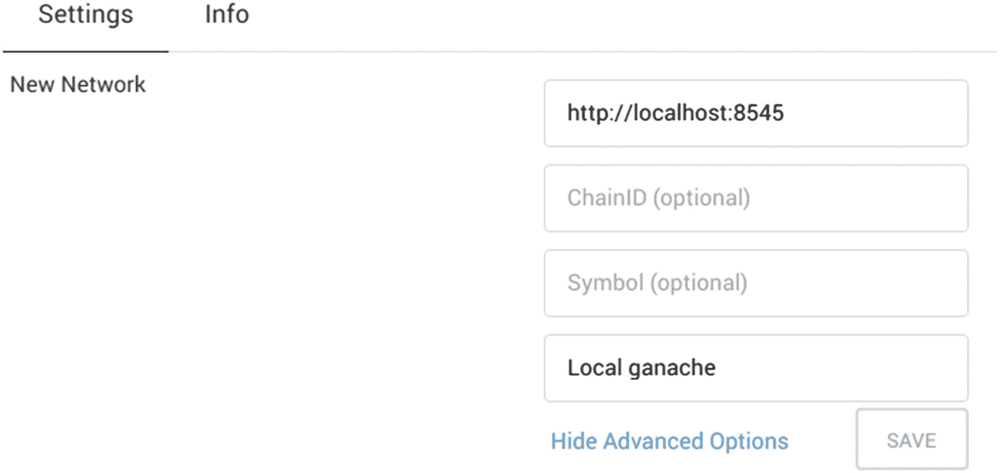
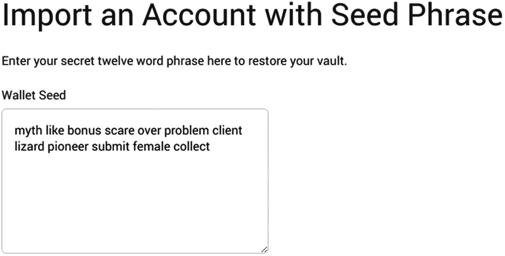
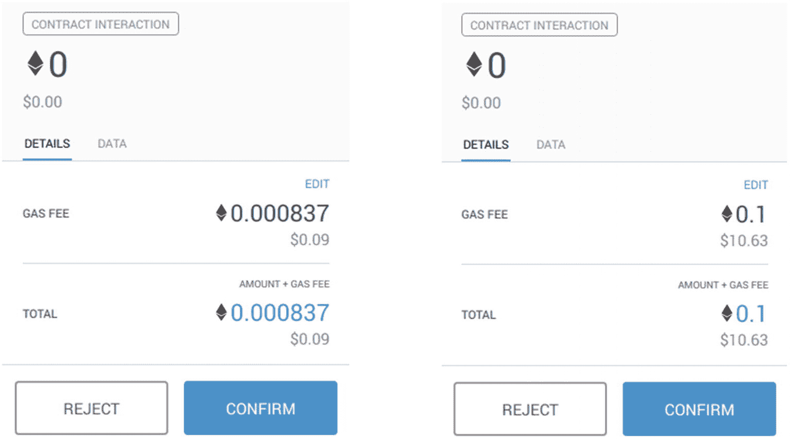

# 5. 发送交易

在上一章中我们回顾了如何读取数据和监控网络变化，现在我们将探讨如何通过发送交易来写入数据。我们将首先搭建一个便于操作智能合约的开发环境，然后过渡到支持`web3`的上下文中，最后深入探讨发起交易和监控其生命周期的细节。同样地，我们将通过一个整合本章所有知识的示例应用程序来收尾。

## 搭建环境

在深入探讨交易细节之前，我们首先搭建一个用于构建和测试应用程序的开发环境。

### 开发节点

这次我们将使用本地私有节点，而不是为应用程序使用远程公共节点。回顾上一章内容，当一个节点持有账户集合及其私钥时，它被称为*私有*节点，因此可用于签署交易。这使得它们更适合脚本编写和测试，因为我们无需在代码中处理账户管理问题，可以将该职责委托给节点自身。

运行本地节点还有另一个好处，即我们可以创建自己的网络，而不是连接到现有网络。这对开发，特别是自动化测试非常有用，因为我们不需要等待漫长的网络或挖矿时间——我们可以建立自己的网络，实现近乎瞬时的挖矿。此类网络通常被称为*开发网络*。

构建应用程序时，通常的工作流程是依赖本地开发节点进行编码和单元测试，然后迁移到测试网以获得更真实的环境，最终在部署到生产环境时上线主网。

#### 使用 Ganache

最广泛使用的开发客户端之一是*ganache*（原名*testrpc*）。Ganache 是专为开发而构建的工具：它不连接任何以太坊网络——它只是启动并运行一条新的开发区块链。它还会创建一组随机测试账户，每个账户预置数量可观的 ETH，并暴露它们的私钥和助记词（代码清单 5-1）。

```
$ npm install -g ganache-cli@6.4
$ ganache-cli -d
Ganache CLI v6.4.3 (ganache-core: 2.5.5)
可用账户
==================
(0) 0x90f8bf6a479f320ead074411a4b0e7944ea8c9c1 (~100 ETH)
(1) 0xffcf8fdee72ac11b5c542428b35eef5769c409f0 (~100 ETH)
...
私钥
==================
(0) 0x4f3edf983ac636a65a...
(1) 0x6cbed15c793ce57650...
...
HD 钱包
==================
助记词:      myth like bonus scare over problem client lizard pioneer submit female collect
基础 HD 路径:  m/44'/60'/0'/0/{账户索引}
...
监听于 127.0.0.1:8545
```

代码清单 5-1：使用 Ganache 全局安装并运行本地开发网络。注意 `-d` 标志，代表确定性模式：启用此模式后，ganache 将始终生成同一组账户。否则，每次运行账户和助记词都会改变。


### 注意

你可能已经注意到 ganache 输出中有一个 HD 钱包部分，其中包含一个助记词和一个 HD 路径。HD 代表分层确定性，这是一个从比特币借鉴而来的概念，用于根据一对*扩展的*私钥/公钥创建任意数量的账户。在不深入技术细节的情况下，可以通过提供不同的*派生路径*（例如 ganache 输出中所示的 `m/44’/60’/0’/0/0`、`m/44’/60’/0’/0/1` 等）从这对扩展密钥创建新的私钥/公钥对。扩展密钥对本身可以从一个*助记词*派生而来：一组随机生成的单词，这些单词更易于记忆或记录。总而言之，这允许从一组单词中安全地派生无限数量的账户。我们将在第 7 章中深入探讨这一点。

Ganache 默认采用即时密封，这意味着每当收到新交易时，系统会自动立即挖掘新区块并将其添加到链中。为了测试这一点，请通过 `ganache-cli`（代码清单 5-3）启动一个新的 ganache 实例。在另一个终端上，使用 `web3@1.2.0` 创建一个新项目并启动一个新控制台（代码清单 5-2），我们将在其中执行一笔交易。

```
> ganache-cli -d
Listening on 127.0.0.1:8545
eth_gasPrice
eth_getBalance
eth_sendTransaction
Transaction: 0x6c79e178...
Gas usage: 21000
Block Number: 1
eth_getTransactionReceipt
eth_getBalance
代码清单 5-3
上述执行过程中 ganache 日志的输出
```

```
$ npm init -y
$ npm install web3@1.2.0
$ node --experimental-repl-await
> // 加载 web3 并打开与节点的连接
> let Web3 = require('web3')
> let web3 = new Web3('http://localhost:8545')
> // 将前两个账户加载为 alice 和 bob
> let [alice, bob] = await web3.eth.getAccounts()
> // 检查 bob 的初始余额（记住 1ETH = 1e18 Wei）
> await web3.eth.getBalance(bob) / 1e18

> // 从 Alice 向 Bob 发送 1ETH
> // 注意交易会被立即挖掘
> web3.eth.sendTransaction({from: alice,to: bob,value: 1e18})
> // 再次检查 bob 的余额，看看增加的 1ETH
>  await web3.eth.getBalance(bob) / 1e18

代码清单 5-2
测试在 ganache 生成的两个账户之间发送 1ETH。在发送交易时留意 ganache 日志：你会注意到交易会被立即处理并挖掘
```

你可以指定一个 `blockTime`（以秒为单位）来指示新区块的生成间隔，而不是让 ganache 为每笔交易都挖掘一个新区块。虽然这比即时密封慢，但它更能代表实际链的工作方式。

你也可以通过 JSON-RPC 接口发送一个特殊的 `evm_mine` 指令（代码清单 5-4）来强制 ganache 随时挖掘新区块。该指令是 ganache 特有的，不属于标准 JSON-RPC API 的一部分。

```
> // 检查当前区块号
> await web3.eth.getBlockNumber()

> // 强制 ganache 挖掘一个新块
> let provider = web3.currentProvider
> let send = util.promisify(provider.send).bind(provider)
> await send({ method: 'evm_mine' })
> // 验证区块号已增加
> await web3.eth.getBlockNumber()

代码清单 5-4
通过提供者直接发送 evm_mine 调用，向 ganache 开发区块链添加新区块。Ganache 还支持 evm_increaseTime 调用来模拟时间流逝，这对于自动化测试特别有用
```

默认情况下，ganache 生成的所有链都是临时的：当 ganache 进程停止时，它们就会丢失。可以通过使用 `db` 选项启动 ganache 来更改此设置，将其状态存储在本地文件夹中，如下所示。

```
$ mkdir -p ganachedb
$ ganache-cli -d --db ganachedb
```

请务必运行 `--help` 来查看所有可用选项：ganache 是一个非常灵活的测试工具，允许你使用任意余额设置任何你想要的账户。它甚至可以分叉现有链，用于在实际网络上进行操作的模拟演练。

#### Geth 或 Parity 开发模式

另一种用于开发的替代方案是使用设置为开发模式的常见以太坊客户端，例如 Geth 或 Parity。此模式会创建一个新的私有区块链，完全由节点管理，并可选择即时密封。虽然它们在测试方面提供的灵活性不如 ganache，但它们更具代表性，因为你将应用连接到与生产环境中相同的客户端。

### 注意

虽然本节剩余部分将重点介绍 Geth，但请务必也要查阅 Parity 的文档，以了解其开发模式可用的选项。

要在开发模式下启动 geth，请将其安装在工作站上并运行以下命令。确保首先停止我们之前启动的 ganache 实例（如果它仍在运行），因为两者都会尝试使用相同的端口。

```
$ geth --datadir=geth-data --rpc --ws --dev --dev.period=1
```

这将在默认的 8545 端口打开 HTTP 接口，在 8546 端口打开 WebSocket 接口。`dev.period` 选项指定了挖掘新区块的时间间隔（以秒为单位）——省略此选项会像 ganache 一样启用即时密封。另外，请注意 `datadir` 选项，它会将所有区块链数据存储在本地 `geth-data` 目录中；如果你不设置此标志，geth 会将所有数据存储在主目录中的默认位置。

启动时，Geth 会创建一个拥有大量 ETH 的单一账户用于开发。尽管如此，如果你想要生成更多账户，可以使用 `account` 子命令，并设置与原始 geth 命令相同的 `datadir`。

```
$ geth --datadir=geth-data account new
Your new account is locked with a password. Please give a password. Do not forget this password.
Passphrase:
Repeat passphrase:
Address: {3975c2...}
```

Geth 会要求你输入密码来加密该账户，对于开发网络，你可以将其留空（但对于真实网络绝对不能！）。所有以太坊客户端都会保持用户账户加密，直到所有者需要使用它们。因此，要实际使用该账户，所有者必须首先通过提供密码来解锁它。让我们测试一下：我们将再次启动一个 `node` 控制台并连接到该节点。

```
$ node --experimental-repl-await
> // 加载 web3 并打开与节点的连接
> let Web3 = require('web3')
> let web3 = new Web3('http://localhost:8545')
> // 列出节点上的账户
> let accounts = await web3.eth.getAccounts()
[ '0xC5A4bA36f7C0B4eD17455C1A578a6ab3Fb738245', ...]
> // 从始终解锁的开发账户发送交易
> await web3.eth.sendTransaction({ from: accounts[0], to: accounts[1], value: 5e18 })
{ transactionHash: '0x18737033...', ... }
> // 尝试从新创建的账户发送交易
> await web3.eth.sendTransaction({ from: accounts[1], to: accounts[0], value: 1e18 })
Returned error: authentication needed: password or unlock
```

解锁账户需要访问 *personal* API，该 API 在 HTTP 接口上默认是禁用的。为了避免深入讨论如何为节点配置 API 访问权限，我们只需重新启动 geth 进程，并提供 `unlock` 选项，其中包含我们希望自由使用的地址列表（以逗号分隔）。Geth 在启动时会提示输入账户密码。

```
$ geth --datadir=geth-data --rpc --ws --dev --dev.period=1
--unlock=3975c2...
```


### 注意

到目前为止，我们仅通过节点的`eth` API 进行交互，该 API 用于与以太坊网络进行常规交互。但节点还提供其他 API，用于管理账户、管理节点、挖矿甚至调试。启动选项控制哪些 API 通过哪些接口提供：默认情况下，像`personal`或`management`这样的敏感 API 仅通过 IPC 接口在本地暴露。

请记住，`geth`节点可以在开发模式、连接测试网或直接连接主网下使用。在实际网络上工作时，你只需将`dev`启动选项替换为指定你所要连接的以太坊网络的`networkid`。

请注意，与比特币不同，以太坊账户在任何网络上都有效，因此要特别小心，不要混淆你的开发账户和主网账户。一个良好的实践是对不同网络使用不同的地址。你总不希望浪费开发环境中默认账户的 10 个 ETH，最后却发现实际上运行在主网上。

### 创建合约

现在我们已经有了一个带有开发网络的本地节点，接下来将经历编译和部署智能合约到该节点的过程。请记住，由于我们在一个全新的开发网络上工作，没有已部署的合约可供交互，因此我们需要自行创建所有合约。

#### 编译

首先，在一个新的项目文件夹中，创建一个新的 `contracts/Greeter.sol` 文件，其中包含我们将用于测试的 `Greeter` 合约。

```solidity
// contracts/Greeter.sol
pragma solidity ⁰.5.0;
contract Greeter {
    string private greeting;
    constructor(string memory _greeting) public {
        greeting = _greeting;
    }
    function greet() public view returns (string memory) {
        return greeting;
    }
}
```

安装 Solidity 编译器^(⁷³) 0.5 或更高版本，然后在项目根目录下运行以下命令以编译合约并将输出保存到本地的 `Artifacts.json` 文件中。

```bash
solc --pretty-json --JSON=abi,bin contracts/*.sol > Artifacts.json
```

这将生成一个 JSON 文件，其中为 contracts 文件夹中的每个 Solidity 文件包含一个条目，同时包含 ABI 和编译后的代码。

```json
{
    "contracts": {
        "contracts/Greeter.sol:Greeter": {
            "abi" : "{\"constant\":true,... ",
            "bin" : "6080..."
        }
    }
}
```

然而，Solidity 编译器的命令行界面功能相当有限。对于更复杂的应用程序，推荐使用标准 JSON 接口，该接口接受一个 JSON 文件来配置编译任务，并为每个合约输出一个文件。需要注意的一点是，该接口手动使用起来相当复杂。

尽管如此，有几个包装器为编译器提供了更友好的界面。这里我们将使用来自 0x 团队的 `sol-compiler`，它是标准 JSON 格式的一个轻量级包装器。通过以下命令安装并运行它，这将在 `artifacts` 文件夹中为每个合约生成一个 JSON 文件。

```bash
$ npm install -g @0x/sol-compiler@3.1
$ sol-compiler
```

由 `sol-compiler` 生成的输出文件具有以下结构。请注意，可以设置一个 `compiler.json` 配置文件^([⁷⁴)来控制生成哪些字段以及一些编译器选项，例如优化器。

```json
{
    "contractName": "Greeter",
    "compilerOutput": {
        "abi": [ {"constant": true, ... } ],
        "evm": {
            "bytecode": {
                "object": "0x6080..."
            }
        }
    }
}
```

*`sol-compiler` 输出样本的节选。*

### 注意

虽然内容与之前通过 `solc` 的 JSON 选项生成的内容相同，但组织方式不同。从现在开始，我们将在所有示例中使用 `sol-compiler` 的输出。

#### 部署

现在我们已经编译了 Solidity 文件，可以将它们部署到开发网络。尽管有许多工具可以为我们管理这个过程，但我们将保持工具链尽可能简单，仅依赖 `web3` 来完成此操作。

要使用 `web3` 部署合约，我们首先需要创建一个 `web3` 合约对象，确保提供合约的二进制代码（我们可以从编译后的构件中提取）。我们将省略构造函数的第二个参数，即合约地址，因为它尚不存在。

```javascript
Greeter = new web3.eth.Contract(abi, null, { data: binary })
```

一旦我们有了合约对象，我们可以通过提供一个已解锁的发送者账户和 gas 限额来调用 `deploy` 方法。返回的对象是一个完整的、可与之交互的 `web3` 合约。

```javascript
greeter = await Greeter.deploy().send({ from, gas: 1e6 })
```

让我们在一个新的 `scripts/deploy.js` 文件（清单 5-5）中将所有这些整合在一起。我们将从 `artifacts` 文件夹中检索 ABI 和字节码，并连接到一个本地节点来运行部署。

```javascript
// scripts/deploy.js
const Web3 = require('web3')
const GreeterJSON = require('../artifacts/Greeter.json')
async function deploy() {
    const web3 = new Web3('http://localhost:8545')
    const [from] = await web3.eth.getAccounts()
    const gas = 1e6
    const arguments = ["Hello world!"]
    const data = GreeterJSON.compilerOutput.evm.bytecode.object
    const abi = GreeterJSON.compilerOutput.abi
    const Greeter = new web3.eth.Contract(abi, null, { data })
    const greeter = await Greeter.deploy({ arguments })
        .send({ from, gas })
    console.log(greeter.options.address);
}
deploy();
清单 5-5
Greeter 合约的部署脚本。注意，`data` 和 `abi` 是从 `sol-compile` 生成的 JSON 文件中获取的，发送者账户设置为节点中的第一个账户
```

为了测试，确保首先像之前演示的那样启动一个 `ganache` 实例（或处于开发模式的 `geth`），监听默认端口 `8545`。然后通过 `node scripts/deploy.js` 运行上述脚本，该脚本应输出部署地址。然后，我们可以启动一个 JavaScript 控制台来连接节点，并运行合约的 `greet` 函数（清单 5-6），以此来验证一切按预期工作。

```javascript
$ node --experimental-repl-await
> Web3 = require('web3')
> GreeterJSON = require('../artifacts/Greeter.json')
> let web3 = new Web3('http://localhost:8545')
> let abi = GreeterJSON.compilerOutput.abi
> let greeter = new web3.eth.Contract(abi, '0xa42d93...')
> await greeter.methods.greet().call()
'Hello world!'
清单 5-6
用于在部署地址初始化 greeter 合约对象并测试调用 `greet` 函数的脚本。确保将示例地址替换为实际的部署地址
```

这个部署脚本虽然简单，但可以推广到应用程序中的任何合约，并且可以修改以接受命令行选项或环境变量，来配置与节点的连接、发送者账户或构造函数参数。此外，将部署地址保存到本地文件，而不仅仅是输出到控制台，也是一个好主意。我们将在本章末尾构建完整应用程序时重新审视这一点。

### 管理账户

我们的下一步将是账户管理，这包括在开发环境中创建和资助账户，以及从我们的 Web 应用程序中访问它们。

#### 重新审视 Metamask

与前几章一样，我们将依赖 `Metamask` 从我们的 Web 应用程序连接到网络。但是，现在我们将不再在真实的以太坊网络上工作，而是在本地的开发网络上工作。我们将在稍后阶段切换到测试网和主网。


### 注意

正如之前所指出的，以太坊地址在所有网络中均有效。这意味着你可以在测试网、主网甚至本地开发网络中使用相同的私钥和地址对。当然，你*可以*这样做并不代表你*应该*这样做。最好使用完全不同的账户，因为你需要特别小心对待*真实*网络中的账户密钥。遗憾的是，`Metamask` 会在所有网络中使用同一套账户，这些账户均由同一个助记词派生而来。为了避免混淆开发账户和真实账户，一些开发者选择为开发环境使用不同的浏览器配置文件，这样就能拥有一套完全独立的账户。

你的第一步是将 `Metamask` 连接到你的开发网络（图 5-1）。点击扩展程序中的网络下拉菜单，选择连接到运行着你开发节点的 *`Localhost 8545`*。

或者，如果你的开发节点设置在不同的端口，你需要将其注册为新网络。具体操作是：进入 *设置*，选择连接到 *新网络*，然后输入 `localhost` 在你启动 `ganache`、`geth` 或 `parity`（默认端口为 8545）时的 HTTP 连接。



图 5-1：在 `Metamask` 中创建新的网络连接

现在我们需要向 `Metamask` 账户中注入资金，以便用它发送交易。请记住，由于这是新网络上的新账户，所以余额为零。复制你的 `Metamask` 地址，然后像之前那样打开控制台，将资金从你的初始账户转移到 `Metamask` 账户。

```
$ node --experimental-repl-await
> // 加载 web3 并打开与节点的连接
> let Web3 = require('web3')
> let web3 = new Web3('http://localhost:8545')
> // 获取节点上的第一个账户
> let [from] = await web3.eth.getAccounts()
 '0xC5A4bA36f7C0B4e17455C1A578a6ab3Fb738245', ...
> // 在此处粘贴你的 Metamask 地址
> let metamask = '0x43a93b...';
> // 从你的开发者账户向 Metamask 地址注入资金
> await web3.eth.sendTransaction({ from, to: metamask, value: 5e18 })
```

手动注入地址的另一种方法是让 `Metamask` 能够使用自动生成的开发账户，如果你使用 `ganache`，这很容易实现。由于 `ganache` 和 `Metamask` 都依赖于助记词来生成新地址，你可以在两者上使用相同的助记词，以确保使用相同的账户。

为此，你需要在 `Metamask` 初始化向导（图 [5-2）中，选择 *用助记词导入* 选项，然后输入 `ganache` 启动时显示的 12 个单词。

### 提示

如果你使用 `--deterministic` 标志启动了 `ganache`，那么助记词应为：`myth like bonus scare over problem client lizard pioneer submit female collect`。请确保不要在开发环境之外使用这个助记词！



图 5-2：将你的 `ganache` 助记词输入到 `Metamask` 中

反过来也是可行的。你可以获取 `Metamask` 生成的助记词，然后将其输入到 `ganache` 中。这样，`ganache` 创建并注入资金的所有开发账户将与 `Metamask` 创建的账户相同。如果你不记得 `Metamask` 的助记词，可以在 *设置* 下找到 *显示种子词* 选项。

```
$ ganache-cli --mnemonic="drink focus interest..."
```

无论你使用了上述三种选项中的哪一种，现在你应该在 `Metamask` 中有一个或多个账户，并且有足够的资金在开发网络中与你的应用程序进行交互。

#### 在我们的应用中检索用户账户

还记得上一章中我们用于从 Web 应用程序连接到网络的脚本吗？这里我们只重现与现代 web3 浏览器对应的代码片段。

```
if (window.ethereum) {
  web3 = new Web3(window.ethereum);
  try {
    accounts = await window.ethereum.enable();
  } catch (error) {
    console.error("无法访问用户账户");
  }
}
```

由 web3 浏览器（在我们的例子中是 `Metamask` 扩展程序）注入的全局 `ethereum` 对象，允许我们与以太坊网络和用户的账户进行交互。这里最重要的方法是 `enable()`，它会向用户弹出一个提示，询问他们是否允许我们的应用列出他们的账户。

需要牢记的是，从 `ethereum.enable()` 或 `web3.eth.getAccounts()` 返回的账户列表是按顺序排列的，用户打算使用的账户始终是第一个。因此，在发送任何交易之前，我们应该首先重新获取用户账户列表，并使用该时刻的第一个账户，因为自从我们初始化 `web3` 实例以来，它可能已经发生了变化。

或者，如果你想持续显示用户当前账户的状态，你可以订阅 `ethereum` 对象上的 `accountsChanged` 事件（清单 5-7），该事件会在用户切换到新账户时触发，使你能够相应地更新界面。

```
ethereum.on('accountsChanged', async function (accounts) {
  currentAccount = accounts[0];
  currentBalance = await web3.eth.getBalance(currentAccount);
  // 在 UI 中显示 currentBalance
})
```

清单 5-7：用于监听 `Metamask` 中用户账户变化并相应更新 UI 的示例代码

现在我们已经搭建好了本地开发环境，终于可以详细讨论如何在此网络中发送交易了。

## 发起交易

尽管发送交易的要点很简单，但仍有几个细节需要注意。我们将在本节中逐一介绍，然后在示例去中心化应用中进行说明。

### 交易参数

我们将首先回顾发送交易时可用的参数：`data`、`value`、`gas` 和 `gas price`，以及发送方和目标地址。


### 发送数值或数据

需要考虑的首要事项之一是你的交易将发送数值、数据，还是两者都发送。这里的数值指的是网络货币 ETH，而数据通常指调用合约中的函数。在某些情况下，可能两者都包含：执行一个需要同时转出 ETH 的合约函数。

单纯向地址发送 ETH 很简单，正如我们在本章中已经看到的，使用 `web3.eth.sendTransaction` 方法即可。请记住，向合约发送纯交易仍然可能执行代码，因为合约可以通过其回退函数对传入的交易做出反应。

另一方面，调用合约中改变状态的函数与静态调用类似：它可以通过低层级方式实现，即发送一个手动构造的 `data` 参数交易，该参数指示在目标合约中必须调用哪个函数及其参数；或者通过与 `web3` 合约对象交互来实现。

为了说明这一点，让我们扩展之前“创建合约”部分中的 Greeter 合约，添加一个额外的 `setGreeting` 方法（清单 5-8）。该方法允许任何用户更改当前的问候语，前提是他们至少支付 1 kWei。

```
// contracts/Greeter.sol
pragma solidity ⁰.5.0;
contract Greeter {
string private greeting;
event GreetingSet(string greeting, uint256 balance);
constructor(string memory _greeting) public {
greeting = _greeting;
emit GreetingSet(_greeting, 0);
}
function greet() public view returns (string memory) {
return greeting;
}
function setGreeting(string memory _greeting)
public payable
returns (string memory, uint256)
{
require(msg.value >= 1000);
greeting = _greeting;
emit GreetingSet(_greeting, address(this).balance);
return (_greeting, address(this).balance);
}
}
```

清单 5-8：包含 `setGreeting` 函数的 Greeter 合约示例。注意，我们发出的事件数据与函数返回的数据相同。本章稍后将解释原因。

使用 `sol-compile` 以及之前编写的部署脚本，将此合约编译并部署到你的本地网络。现在，我们可以像下面这样，在节点控制台与合约进行交互。

```
$ node --experimental-repl-await
> Web3 = require('web3')
> GreeterJSON = require('./artifacts/Greeter.json')
> let web3 = new Web3('http://localhost:8545')
> let abi = GreeterJSON.compilerOutput.abi
> let greeter = new web3.eth.Contract(abi, ADDRESS)
```

我们可以通过调用 `greeter` 实例中的方法来测试 `setGreeting` 函数（清单 5-9）。请注意，与上一章不同，我们使用的是 `send` 而不是 `call`——这将触发一笔新交易，而非静态调用。我们还需要指定一个发送者账户，该账户的余额将被扣除 Gas 费用。由于 `setGreeting` 方法要求我们随交易发送一些 ETH，因此我们还需要包含一个 `value` 选项。

```
> let [from] = await web3.eth.getAccounts()
> let value = 1000
> greeter.methods.setGreeting('Hi there!').send({from, value})
> await greeter.methods.greet().call()
'Hi there!'
```

清单 5-9：发送交易以修改合约的问候语

### 注意

在 `web3.js` 中，属于合约函数的参数设置在相应的合约方法上，而交易选项则通过 `send` 或 `call` 方法传递。

如前所述，我们也可以手动构造交易中要发送的数据，以调用合约中的函数，然后使用底层 `sendTransaction`（清单 5-10）。你实际上不太可能使用这种模式，但了解从 `web3` 合约对象发送交易时后台发生了什么非常有用。

```
> let to = ADDRESS
> let data = greeter.methods.setGreeting('Hi!').encodeABI()
> web3.eth.sendTransaction({ from, value, data, to })
```

清单 5-10：使用底层 `sendTransaction` 调用 `setGreeting`。注意，我们需要将目标地址指定为另一个选项

### 注意

如果你对 `data` 的内容感到好奇，可以查看它包含以下十六进制序列：

`0xa4136862000000000000000000000000000000000000000000000000000000000000002000000000000000000000000000000000000000000000000000000000000000034869210000000000000000000000000000000000000000000000000000000000`

虽然看起来令人望而生畏，但这个序列对应着我们提供的经过 RLP 编码数据的 ABI 调用。RLP（递归长度前缀）是一种对任意长度的任意嵌套数据进行编码的方法。在这种情况下，前 8 个字节（`a4136862`）是函数选择器，它告诉合约必须调用 `setGreeting`。有效载荷的其余部分对应于“Hi！”的 RLP 编码。


## 估算 Gas

让我们再次尝试`setGreeting`方法，但这次使用一个更长的字符串作为函数的参数。

```
> const longGreeting = 'Hi there! This is a very long and costly greeting to set which will require more gas.'
> await greeter.methods.setGreeting(longGreeting)
.send({ from, value})
Error: Returned error: VM Exception while processing transaction: out of gas
```

回忆第 3 章的内容，在以太坊中执行交易需要消耗 Gas。交易的总 Gas 成本与所有执行操作的累积成本成正比，不同操作有不同的 Gas 成本。写入存储是一项特别昂贵的操作，因为它意味着将新状态持久化到区块链中。数据越大，涉及的`store`操作就越多。

在前面的示例中，我们试图将一个非常长的字符串保存到合约状态，这超出了我们交易的 Gas 限额（在`web3@1.2.0`中默认为 90,000），因此交易失败了。

我们可以通过为交易分配更多的 Gas 来使其成功执行（清单 5-11）。例如，尝试使用 100 万 Gas 单位。请记住，这并不意味着交易实际会消耗 100 万 Gas —— 只是我们愿意在其执行过程中花费这么多 Gas。

```
> let gas = 1e6
> await greeter.methods.setGreeting(longGreeting)
.send({ from, value, gas })
{ transactionHash: '0x6eb0fa...',
transactionIndex: 0,
gasUsed: 98097,
... }
> await greeter.methods.greet().call()
'Hi there! This is a very long and costly greeting to set which will require more gas.'
Listing 5-11
Running the previous transaction with a higher gas allocation. Note that the returned transaction receipt includes the actual gas used by the transaction, which is well under 1 million
```

这就引出了一个问题：我们如何知道应该为交易分配多少 Gas？一种选择是简单地指定一个非常高的 Gas 限额：大多数网络的区块 Gas 限制在 400 万到 800 万之间，因此我们可以直接使用这个范围内的数值。

然而，如果这样做，我们的用户将被要求接受一笔可能消耗超出他们愿意支付资金的交易（图 5-3）。任何看一眼 Gas 费用数字的用户很可能都会拒绝在这种条件下执行交易。



图 5-3

使用不同 Gas 限额进行同一交易的 MetaMask 确认对话框：左侧使用默认 Gas 量；右侧使用 500 万。注意美元计价费用的差异：用户被要求投入最多 9 美分 vs 10 美元

为了解决这个问题，我们可以在实际发送交易之前*估算*交易将消耗的 Gas（清单 5-12）。以太坊节点实现了`estimateGas`方法，该方法接受一笔交易并在本地运行它，以确定执行该交易需要多少 Gas。

```
> gas = await greeter.methods.setGreeting(longGreeting)
.estimateGas({ from, value })
> await greeter.methods.setGreeting(longGreeting)
.send({ from, value, gas })
Listing 5-12
Using estimateGas to calculate how much gas is required for a transaction. In this case, the returned value for estimateGas was around 98K
```

在某些情况下，`estimateGas`返回的值可能与实际使用的 Gas 不完全相等。这是因为估算依赖于调用时的网络状态，而实际 Gas 消耗只有在交易被挖矿时才能确定。在这两个事件之间，合约的状态可能已经改变，这会改变所需的 Gas 量。^(⁷⁶)

因此，一个良好的实践是分配比 `estimateGas` 调用返回的 Gas 量略高的数值（清单 5-13）。通常多出 20% 就足够了，但具体数值可能因你使用的合约而异。同时，确保不要设置超过区块 Gas 限制的 Gas 限额，否则交易将被直接拒绝。

```
> let lastBlock = await web3.eth.getBlock('latest')
> let limit = lastBlock.gasLimit
> gas = Math.min(limit - 1, Math.ceil(gas * 1.2))
Listing 5-13
Calculating the actual amount of gas to use in a transaction
```

值得注意的是，如果交易在 Gas 估算过程中失败，估算调用将返回一个“始终失败的交易”错误。这可以防止你向网络发送最终会失败的交易。

### 选择 Gas 价格

交易不仅需要 Gas 限额，还需要 Gas 价格。回忆第 3 章，Gas 价格表示交易执行过程中每使用一单位 Gas 需要支付多少 Wei。虽然在开发或测试网络中这个值不重要，但在主网 —— 或任何其原生货币具有实际货币价值的网络上 —— 正确地设置它至关重要。

毋庸置疑，使用更高的 Gas 价格会导致更高的操作成本。另一方面，高于平均水平的 Gas 价格意味着交易将更早地被矿工打包；这减少了用户等待交易被包含在区块链中的时间。

Gas 价格根据网络总负载而波动。在以太坊网络使用高峰期，将交易包含在下一个区块中的竞争更加激烈，这会推高 Gas 价格。

估算 Gas 价格比估算 Gas 限额困难得多，因为不能仅仅通过试运行交易并检查总消耗量来获得估算值。相反，估算价格需要对过去和待处理的交易进行分析。

获取 Gas 价格估算最直接的方法是依赖以太坊节点的`gasPrice` API 方法（清单 5-14）。节点维护一个 Gas 价格值，该值以预配置的频率更新，并根据最近区块中交易的 Gas 价格的百分位数计算得出。

```
> await web3.eth.getGasPrice()
'20000000000'
Listing 5-14
Querying the Ethereum node for gas price. Note that ganache returns a constant value for gas price, which can be configured at startup
```


### Note

当通过 Metamask 运行`getGasPrice`时，一个子提供者会拦截该调用，并手动将 gas 价格计算为最近 N 个区块的中位数。然而，此方法仅考虑已挖掘交易中的数据，忽略了等待被包含进区块链的内存池中待处理交易的任何信息。

作为替代方案，有一些中心化服务基于更复杂的计算，为以太坊主网提供实时 gas 估算（列表 5-15）。这些服务通常能返回更好的结果，但代价是为你的应用程序引入了中心化依赖。此类服务由 Etherchain 或 EthGasStation 等提供，并为低、标准、快或最快交易处理提供 gas 价格。

```sh
$ npm install axios@0.18.0
$ node --experimental-repl-await
// Setup web3 provider and contract
> Web3 = require('web3')
> GreeterJSON = require('./artifacts/Greeter.json')
> let web3 = new Web3('http://localhost:8545')
> let abi = GreeterJSON.compilerOutput.abi
> let greeter = new web3.eth.Contract(abi, ADDRESS)
// Retrieve gas price and send transaction
> axios = require('axios')
> let URL = 'https://www.etherchain.org/api/gasPriceOracle'
> let { data: gasData } = await axios.get(URL)
> let gasPrice = gasData.fast * 1e9
> await greeter.methods.setGreeting('Hello!')
.send({ from, value, gas, gasPrice })
```

列表 5-15 从 Etherchain API 检索 gas 价格并在交易中使用。此代码片段使用`axios`包执行标准 HTTP GET 请求到该 API。

### 交易的生命周期

现在我们已经知道如何配置交易的主要组成部分，是时候回顾一下交易发送后会发生什么，以及我们如何与之交互。

#### 交易被发送

当交易被发送到节点时，节点会执行一些基本检查，以确保交易有效且可以广播。例如，节点会检查发送者账户是否有足够资金，以及 gas 限额和价格值是否合理。

如果交易被节点接受，它会返回一个交易哈希。此交易哈希充当区块链上交易的全局唯一标识符，并可用于稍后检索交易信息。

```javascript
> let txHash = null
> greeter.methods.setGreeting('Hello!')
.send({ from, value })
.on('transactionHash', (hash) => txHash = hash)
```

### 注意

如果需要，客户端可以在离线状态下计算出交易哈希，只要该客户端拥有发送者的私钥，因为它完全依赖于交易的参数和签名。

在返回交易哈希时，可以从任何已*看到*此交易的节点检索交易信息（列表 5-16），无论该交易是否已被挖掘。这些信息包括发送者、接收者、gas 限额、价格、nonce、输入数据以及在发送交易时可能指定的所有内容。

```javascript
> await web3.eth.getTransaction(txHash)
{ blockHash: '0x0000...0',
blockNumber: null,
from: '0x...',
gas: 90000,
gasPrice: '1000000000',
hash: '...',
input: '0xa41368620...',
nonce: 470,
to: '0x...',
transactionIndex: 0,
value: '1000'
}
```

列表 5-16 交易发送后立即返回的交易信息。注意所有与区块相关的信息都是空的，因为交易尚未被挖掘。

此时，交易尚未被挖掘，被称为处于*待处理*状态。任何尝试检索交易收据的操作都将简单地返回`null`。

#### 交易被挖掘

一段时间后，根据使用的 gas 价格和网络负载，交易应该会被挖掘。注意，无论交易成功与否，它都会被挖掘：回退的交易也会被包含在区块链中，并消耗其发送者的 gas 费用。

一旦交易被挖掘，其`getTransaction`信息将包含它被包含的区块编号和哈希，以及它在区块中的索引。同时，此时交易收据变为可用。

```javascript
> await web3.eth.getTransactionReceipt(txHash)
{ transactionHash: '0x...',
transactionIndex: 0,
blockHash: '0x...',
blockNumber: 29,
gasUsed: 23235,
cumulativeGasUsed: 23235,
logs: [ ... ],
status: true}
```

收据包含交易在挖掘时执行生成的信息，例如实际使用的 gas、交易是否成功（如果交易没有回退，则状态标志为`true`）以及它发出的事件日志。

### 注意

如果你通过`getTransactionReceipt`调用检查交易收据中的日志，你将只能获取事件的原始数据。这是因为客户端库没有足够的上下文来理解如何*解码*日志。它需要一个 ABI 来指示事件名称和参数类型。

我们可以通过检查新区块（通过轮询或订阅`newBlockHeaders`）并在看到新挖掘的区块时尝试检索交易收据（列表 5-17）来等待交易被挖掘。如果交易在新区块中成功挖掘，那么其收据将可用。

```javascript
// Sends a transaction to the network and returns its hash
function sendTransactionReturnHash(opts) {
return new Promise((resolve, reject) => {
web3.eth.sendTransaction(opts)
.on('transactionHash', hash => resolve(hash))
.on('error', err => reject(err));
})
}
// Sends a transaction and awaits for it to be mined
function sendTransactionAwaitReceipt(opts) {
const BLOCKS = 'newBlockHeaders';
return new Promise((resolve, reject) => {
sendTransactionReturnHash(opts).then(hash => {
const sub = web3.eth.subscribe(BLOCKS, (err) => {
if (err) reject(err);
// Check for the receipt on every new block
// If available, it means the tx was mined
web3.eth.getTransactionReceipt(hash).then(receipt => {
if (receipt) {
sub.unsubscribe();
resolve(receipt);
}
});
});
}).catch(reject);
});
}
```

列表 5-17 订阅新区块头部以检查交易何时被成功挖掘。请注意，如果你有多个正在进行的交易，可能值得在所有交易之间共享一个`newBlockHeaders`订阅。

如果使用 web3，也可以通过简单地等待`sendTransaction`方法（对于发送普通交易和触发合约函数上的交易都适用）来获取交易收据。这也提供了对事件的简便访问，这些事件基于发起交易的合约对象的 ABI 进行了解码。

```javascript
> let receipt = await greeter.methods.setGreeting('Hey!')
.send({ from, value: 10000 })
> let { events } = receipt
> let { greeting, balance } = events.GreetingSet.returnValues
> greeting
'Hey!'
> balance
'30000'
```

能够处理交易事件特别重要，因为*无法检索在交易中调用的函数的返回值*。如果你回顾合约代码，会看到我们的函数实际上返回了问候字符串和合约余额。然而，根据设计，这些值不是交易收据的一部分，并且无法从客户端获得。


### 说明

从交易中获取函数返回值的唯一方法是经由另一个合约进行调用：调用 `setGreeting` 的合约可以访问这些返回值，但向 `Greeter` 发送交易的非链上客户端则无法获取。

基于此，在智能合约设计中，一个常见模式是让公开的状态修改函数通过事件携带其返回值（清单 5-18）。这使得外部拥有账户可以调用此类函数，并从事件参数中检索返回值。

```
function setGreeting(string memory _greeting)
public payable returns (string memory, uint256)
{
greeting = _greeting;
// 此操作仅可由非链上客户端访问
emit GreetingSet(_greeting, address(this).balance);
// 此操作仅可由其他调用合约访问
return (_greeting, address(this).balance);
}
清单 5-18
通过发出携带模拟返回值数据的事件，使客户端能够访问这些数据
```

#### 交易已确认

虽然立即对已挖出的交易采取行动可能颇具诱惑力，但由于区块链重组，交易可能会被移出区块链。这意味着，已挖出的交易可能回到待处理状态，随后要么被再次挖出，要么被丢弃——甚至在挖出时因环境不同而产生不同的状态变更。

因此，在实际对交易采取行动之前，等待一定数量的确认或许是明智之举。何为“采取行动”取决于你的使用场景，以及需要等待的确认数量。请记住，确认数是指在包含某交易的区块之后新增的区块数量：每新增一个挖出区块，就相当于你的交易获得了一次新的确认。随着区块链上区块的不断叠加，重组发生的概率会越来越小。

交易确认可以通过订阅网络上的新区块（参见第 4 章），并统计自收到交易回执以来产生的区块数来衡量。我们可以修改上一节的代码，使其不再在回执立即可用时返回，而是等待一定数量的确认后才返回（清单 5-19）。

```
function sendTransactionAwaitConfirmations(opts, confs) {
const BLOCKS = 'newBlockHeaders';
return new Promise((resolve, reject) => {
sendTransactionReturnHash(opts).then(hash => {
const sub = web3.eth.subscribe(BLOCKS, (err, block) => {
if (err) reject(err);
// 现在不仅检查回执是否存在，
// 还会检查回执所在区块的后续区块数量
web3.eth.getTransactionReceipt(hash).then(receipt => {
if (receipt &&
block.number > receipt.blockNumber + confs) {
sub.unsubscribe();
resolve(receipt);
}
});
});
}).catch(reject);
});
}
清单 5-19
修改 sendTransactionAwaitReceipt 函数，使其在返回回执前等待指定的确认数。请注意，在每个新区块上重新获取交易回执非常重要，因为它可能因区块链重组而发生变化
```

另外，`web3` 还提供了一种事件机制，用于在交易发送后跟踪确认状态（清单 5-20），其底层执行了类似的逻辑。

```
> greeter.methods.setGreeting('Hello!')
.send({ from, value })
.on('confirmation', (number, receipt) => {
if (number === 12) {
console.log(receipt.events.GreetingSet.returnValues)
}
})
清单 5-20
利用 web3 的确认事件处理器，在采取行动前等待交易获得 12 次确认
```

### 替换交易

通过操纵 nonce 和 gas 价格参数，发送方可以替换处于待挖矿状态的交易。请记住，一笔交易要有效，其 nonce 不能是发送方之前使用过的。因此，如果发送方在第一笔交易仍处于待处理状态时，广播了第二笔 nonce 相同的交易，那么这两笔交易都有资格被挖出，但最终只会有一笔成功。为了让矿工优先选择第二笔交易，发送方只需将其 gas 价格设置得比第一笔高即可。

测试这一功能的一个简单方法是：先发送一笔 gas 价格极低的交易，确保它需要多个区块才能被挖出，这样我们就有足够的时间发送第二笔交易来替换它。请务必在未启用即时密封的网络中进行测试；否则，第一笔交易会立即被挖出。

```
// 发送第一笔交易，金额为 0.02 ETH
> let to = accounts[1]
> let value = 2e16
> let gasPrice = 100
> let txOpts = { from, to, value, gasPrice };
> let txHash = await sendTransactionReturnHash(txOpts)
// 获取 nonce
> let { nonce } = await web3.eth.getTransaction(txHash)
// 发送替换交易，金额不同，gas 价格更高
> value = 1e16
> gasPrice = 20e9
> txOpts = { from, to, value, gasPrice, nonce}
> let txHashReplace = await sendTransactionReturnHash(txOpts)
// 验证只有替换交易被挖出
> await web3.eth.getTransactionReceipt(txHash)
null
> await web3.eth.getTransactionReceipt(txHashReplace)
{ status: true, ... }
```

替换交易有多种用途，因为第二笔交易除了 nonce 和发送方账户外，无需与原始交易有任何共同之处：

- 替换交易最常见的用途是加速原始交易。如果你发现某笔交易挖矿时间过长，可以直接用完全相同的参数重新提交，但设置更高的 gas 价格，使其对矿工更具吸引力。在用户体验方面，这也是一个简单的实现模式：如果在交易处理期间向用户显示加载指示器，那么在长时间未收到反馈后，你可以提供一个重新提交的选项。`Metamask` 已经在其用户界面中内置了此功能。

- 另一个用途是直接取消交易。如果用户希望撤销已经发送的交易，一个可行的方案是发送一笔无操作替换交易来移除前一笔交易。无操作交易可以非常简单，例如一笔发送方与接收方地址相同、金额为 0 ETH 且不含数据的交易。

- 或者，也可以发送替换交易来更改前一交易的某个参数，以此作为对原始交易的修正。这很大程度上取决于你的具体使用场景，并且需要用户能够快速执行，因为如果原始交易的 gas 价格已经很高，替换交易的时间窗口可能会很短。


## 错误处理

向网络发送交易时，有许多潜在问题可能发生。你的应用程序应做好处理这些问题的准备，并据此告知用户：

-   在任何时间点，你都可能丢失与节点的连接。毋庸置疑，这不仅会影响发送交易，还会影响与网络进行的任何操作（读或写）。在这些场景下，你通常会收到一个*无效的 JSON-RPC 响应*错误，因为你的库无法从不可达的节点获得任何响应。

-   正在发送的交易可能无效。这可能是由于其某个参数格式不正确，例如地址使用了非十六进制字符串，或是某个值完全无效。对于后者，如果你尝试发送一个 gas 限额为 1 的交易，你将收到一个*内在 gas 过低*错误。这些错误通常会在你的库尝试构建待发送交易时被捕获。

-   发送者账户可能没有足够的资金来支付交易的指定金额、gas 限额和 gas 价格。这些错误通常由节点在交易广播之前报告。

-   在替换交易时，尝试替换一个已被挖出的交易会在交易发送到网络之前就产生*nonce 过低*错误。类似地，大多数客户端会阻止你在不提高 gas 价格的情况下尝试替换交易。

-   执行合约代码的交易可能因合约触发的`REVERT`或`ABORT`而失败。使用 Solidity 0.4.22 及以上版本编写的合约可以包含回滚原因，这可用于确定错误原因。这仅在交易实际被挖出之后才能检测到，并且发送者的资金已被用于支付执行的 gas 费用。

-   在估算交易所需 gas 时，*总是失败的交易*错误意味着估算失败，因为交易本身触发了错误。这可用于在实际发送交易并消耗 gas 之前检测到一个失败交易。

-   即使你估算了一笔交易所需的 gas，交易被挖出时的条件也可能与估算 gas 时的条件不同。在这些情况下，会引发“gas 耗尽”错误，并且这只能在交易已被挖出后检测到。

-   交易发送后，如果 gas 价格过低或网络过于拥挤，交易可能无法被挖出。大多数库最终会超时，并通知你在一定数量的区块后未能找到该交易。请注意，如果用户连接的节点不同步，那么交易实际上可能已被挖出，但节点永远不会看到它，从而引发此错误。

### 注意

请记住，实际的错误消息可能取决于你使用的库，以及在某些情况下，你连接的客户端（Geth、Parity 或 Ganache）。

上述大多数错误都可以在 web3 中使用`error`事件处理程序捕获，类似于交易发送、收据或确认事件。另一方面，输入格式错误会立即引发异常。

```
> let [from, to] = await web3.eth.getAccounts()
> web3.eth.sendTransaction({ from, to, gas: 1 })
.on('error', err => console.error(err.message))
Returned error: intrinsic gas too low
```

## 示例应用

如同上一章，我们现在将搭建一个示例应用程序，涵盖本章中我们回顾的许多概念。在这个案例中，我们将搭建一个简单界面，允许用户使用修改过的 ERC721 合约来创建（*铸造*）新的数字收藏品。

### 设置

我们的设置将与前面的章节类似，依赖`create-react-app`作为客户端样板，^(⁷⁷)因为我们构建的是一个纯客户端应用。

```
npm init react-app erc721-app
```

#### 依赖项

除了 ERC20 应用中使用的相同依赖项集合外，我们还将安装 solidity 编译器，以及用于执行 HTTP 请求的`axios`库。

```
$ npm install web3@1.2.0 openzeppelin-solidity@2.1 bignumber.js@8.0 axios@0.18.0
$ npm install --save-dev @0x/sol-compiler@2.0.2
```

请确保你已按照本章前面所述安装了 `ganache-cli`、`Geth` 或 `Parity`，以便启动一个本地开发网络。


#### 合约部署

针对此应用，我们将编写、编译并部署自己的合约 `contracts/ERC721PayPerMint.sol`（列表 5-21）。此合约基于默认的 `ERC721` 实现（我们将从 OpenZeppelin 合约库中获取），并增加了一个额外方法，允许用户以 ETH 支付费用来创建新实例。ETH 将保留在合约中，直到其所有者决定提取。

```
// contracts/ERC721PayPerMint.sol
pragma solidity ⁰.5.2;
import
"openzeppelin-solidity/contracts/math/SafeMath.sol";
import
"openzeppelin-solidity/contracts/ownership/Ownable.sol";
import
"openzeppelin-solidity/contracts/token/ERC721/ERC721.sol";
import
"openzeppelin-solidity/contracts/token/ERC721/ERC721Enumerable.sol";
contract ERC721PayPerMint
is ERC721, ERC721Enumerable, Ownable {
using SafeMath for uint256;
function exists(uint256 tokenId)
public view returns (bool) {
return _exists(tokenId);
}
function mint(address to, uint256 tokenId)
public payable returns (bool) {
require(msg.value >= tokenId.mul(1e12), "Insufficient payment");
_mint(to, tokenId);
return true;
}
function withdraw()
public onlyOwner {
msg.sender.transfer(address(this).balance);
}
}
列表 5-21
经过修改的 ERC721 代币，将作为我们应用的后端支持。它提供了一个公共铸造函数，使用户可以支付费用创建新代币，同时提供了一个视图函数用于检查代币是否存在。
```

现在，我们可以尝试使用 `sol-compiler` 编译合约。

```
$ npx sol-compiler
Artifact for ERC721PayPerMint does not exist
Compiling 1 contracts (ERC721PayPerMint.sol) with Solidity v0.5.2...
ERC721PayPerMint artifact saved!
```

此时，`artifacts` 文件夹中应包含一个 `ERC721PayPerMint.json` 文件。让我们添加一个简短的脚本 `scripts/deploy.js`，用于获取编译后的字节码并将合约部署到本地网络。我们将使用本章前面编写的部署代码的修改版本（列表 5-22）。同时，我们还将部署地址存储在一个 `Deploys.json` 文件中，以便后续从应用中读取。

```
// scripts/deploy.js
const Web3 = require('web3');
const fs = require('fs');
const path = require('path');
// Deploys any artifact from the default account
async function deploy(artifact, arguments, opts) {
const providerUrl = process.env.PROVIDER_URL
|| 'http://localhost:8545';
const web3 = new Web3(providerUrl);
const from = (await web3.eth.getAccounts())[0];
const data = artifact.compilerOutput.evm.bytecode.object;
const abi = artifact.compilerOutput.abi;
const Contract = new web3.eth.Contract(abi, null, { data });
const gasPrice = 1e9;
const instance = await Contract.deploy({ arguments })
.send({ from, gasPrice, ...opts });
const address = instance.options.address;
const network = await web3.eth.net.getId();
save(network, address);
console.log(address);
}
// Saves deployment address to a Deploys.json file
function save(network, address) {
const file = path.join(
__dirname, '..', 'artifacts', 'Deploys.json'
);
const deployments = fs.existsSync(file)
? JSON.parse(fs.readFileSync(file)) : {};
deployments[network] = address;
const content = JSON.stringify(deployments, null, 2);
fs.writeFileSync(file, content);
}
// Deploys our ERC721PayPerMint contract
function main() {
const artifactPath = '../artifacts/ERC721PayPerMint.json';
const artifact = require(artifactPath);
return deploy(artifact, [], { gas: 5e6, gasPrice: 1e9 });
}
main();
列表 5-22
用于将 ERC721PayPerMint 合约部署到 `PROVIDER_URL` 环境变量指定的网络的脚本，并将部署地址按网络 ID 索引存储。请注意，可以修改 `main` 函数以方便地部署其他合约。
```

现在，在 `ganache-cli` 进程（或 `Geth` 或 `Parity` 开发节点）监听端口 `8545` 的情况下，尝试运行部署脚本。

```
node scripts/deploy.js
```

然后，你应该会在 `artifacts` 文件夹中看到一个包含网络 ID 和部署地址的 `Deploys.json` 文件。请注意，你获得的 ID 和部署地址可能有所不同。

```
$  cat artifacts/Deploys.json
{
"155164184873": "0x0E696947A06550DEf604e82C26fd9E493e576337"
}
```

现在，我们已在本地网络上设置好合约，可以开始开发 Web 应用本身了。

### 应用

我们的应用将遵循与上一个应用类似的结构。我们将为与以太坊网络交互、管理合约 `artifacts` 以及 React 组件分别设立独立的文件夹。

#### 初始化 Web3 实例

我们将创建一个 `src/eth/network.js` 文件（列表 5-23），其中包含从注入的提供者实例化新 `web3` 对象所需的代码，以及一些稍后将在整个应用中用到的方法。

```
// src/eth/network.js
import Web3 from 'web3';
let web3;
export function getWeb3() {
if (!web3) {
web3 = new Web3(Web3.givenProvider);
}
return web3;
}
export function hasProvider() {
return !!Web3.givenProvider;
}
export async function getAccount() {
const accounts = await window.ethereum.enable();
return accounts[0];
}
export async function getBlockNumber() {
return web3.eth.getBlockNumber();
}
export async function getNetwork() {
return web3.eth.net.getId();
}
列表 5-23
网络文件，用于根据注入的提供者初始化一个新的 web3 对象
```

请注意，`getAccount` 方法尤其重要，因为它包含了对提供者进行*启用*的调用。这就是我们能够访问用户账户列表的原因。


### 创建合约对象

我们首先创建一个 `src/contracts/ERC721.js` 文件，该文件用于初始化 web3 合约对象，并从 `Deploys.json` 文件中加载部署地址。然而，该文件位于项目根目录的 `artifacts` 文件夹内，在 `src` 文件夹之外。遗憾的是，`create-react-app` 模板禁止我们从 `src` 文件夹外部导入任何内容。如果试图从我们的 React 应用程序中导入它，将会遇到以下错误。

```
You attempted to import ../../artifacts/Deploys.json which falls outside of the project src/ directory. Relative imports outside of src/ are not supported.
```

最简单的解决方法是，在 `src` 文件夹内创建一个指向 `artifacts` 文件夹的符号链接。我们可以通过以下命令来实现。

```
$ cd src
$ ln -ns ../artifacts
```

现在，我们就可以在应用中加载编译输出文件和部署文件了。请注意，从源文件夹外部加载文件的限制是 react-app 独有的。如果你使用任何其他应用模板，很可能不会遇到此问题^(⁷⁸)。

```
// src/contracts/ERC721.js
import Artifact from '../artifacts/ERC721PayPerMint.json';
import Deploys from '../artifacts/Deploys.json';
```

通过从第一个文件获取 ABI，我们可以编写一个函数来为我们的 `ERC721PayPerMint` 创建一个 web3 合约实例。

```
// src/contracts/ERC721.js
export default function ERC721(web3,address=null,options={}) {
const abi = Artifact.compilerOutput.abi;
return new web3.eth.Contract(abi, address, { ...options });
}
```

然后，我们可以从第二个文件中获取部署地址，并使用该地址实例化一个 `ERC721` 合约（代码清单 5-24）。请注意，由于部署文件是按网络索引的，我们需要通过 `web3` 对象获取网络 ID。

```
// src/contracts/ERC721.js
import {
getWeb3, getAccount, getNetwork
} from '../eth/network.js';
export async function getDeployed() {
const web3 = getWeb3();
const from = await getAccount();
const network = await getNetwork();
const address = Deploys[network];
if (!address) throw new Error(`在 ${network} 网络中找不到合约地址`);
return ERC721(web3, address, { from });
}
代码清单 5-24
返回一个 web3 合约，该合约代表当前网络中 ERC721PayPerMint 的已部署实例
```

### 根应用组件

我们的根 `App` 组件（代码清单 5-25）与上一章中的组件类似。该组件的职责是加载默认账户和合约实例，并将其注入到将在 `src/components/ERC721.js` 中定义的主 `ERC721` 组件中。

```
// src/App.js
import React, { Component } from 'react';
import { getDeployed } from './contracts/ERC721';
import { hasProvider, getAccount } from './eth/network';
import ERC721 from './components/ERC721';
class App extends Component {
async componentDidMount() {
if (hasProvider()) {
const contract = await getDeployed();
const sender = await getAccount();
this.setState({ contract, sender });
}
}
render() {
const { contract, sender } = this.state;
return (

{ (hasProvider() && contract && sender)
? 
: 请启用 Metamask 并重新加载
}

);
}
}
代码清单 5-25
根 App 组件的主要方法
```

不过请记住，如果用户在 Metamask 中更改了当前账户，我们需要刷新显示的信息，因为我们将列出用户的代币。我们可以通过在 `ethereum` 对象上安装一个监听器来检测账户变更，并通过将发送者附加为 React key^(⁷⁹) 来强制重新加载 `ERC721` 组件（代码清单 5-26）。

```
// src/App.js
class App extends Component {
async componentDidMount() {
// ...
window.ethereum.on('accountsChanged', async (accounts)=>{
this.setState({ sender: accounts[0] });
});
}
render() {
// ...

// ...
}
}
代码清单 5-26
更新自代码清单 5-25 的方法，用于监听账户变更。当账户变更时，整个 ERC721 组件会自动重新加载
```

### 主 ERC721 组件

该组件将包含我们应用中的大部分逻辑：它将列出用户的代币，并允许用户通过一个简单的 *创建* 按钮来铸造新代币。让我们先从页面加载时列出已存在的代币开始。

#### 列出已存在的代币

枚举用户的非同质化代币可能比较棘手。`ERC721` 标准提供了两个函数来实现此功能：`balanceOf` 和 `tokenOfOwnerByIndex`。前者返回用户的代币数量，后者则根据介于 0 和用户余额之间的索引返回代币 ID。为了避免这两个函数不同步，重要的是在查询时指定同一个区块号。

```
// src/components/ERC721.js
class ERC721 extends Component {
async getTokensAtBlock(blockNumber) {
const { contract, owner } = this.props;
// 加载用户的代币数量
const strBalance = await contract.methods.balanceOf(owner)
.call({}, blockNumber);
const balance = parseInt(strBalance);
// 检索每个代币的 ID
const queries = Array.from({length: balance}, (_,index)=>(
contract.methods.tokenOfOwnerByIndex(owner,index)
.call({}, blockNumber)
));
return await Promise.all(queries);
}
}
```

基于上述函数，我们现在可以在组件的 *didMount* 生命周期事件中，将代币加载到组件的状态中（代码清单 5-27）。

```
async componentDidMount() {
const currentBlock = await getBlockNumber();
const tokenIds = await this.getTokensAtBlock(currentBlock);
const tokens = tokenIds.map(id => ({id, confirmed: true}));
this.setState({ tokens, loading: false });
}
代码清单 5-27
将用户代币加载到状态中。请注意，我们为这些代币添加了一个 confirmed 标志，以便将它们与稍后添加的新铸造代币区分开来
```

我们还需要在组件的构造函数中将其状态初始化为以下默认值，以便组件在用户代币加载完成之前处于加载状态。

```
constructor(props) {
super(props);
this.state = {
tokens: [],
loading: true
};
}
```

让我们用一个简单的 `render` 方法来测试一下，该方法仅通过呈现代币 ID 来列出代币列表，并同时将它们复用为 React key。

```
render() {
const { tokens, loading } = this.state;
if (loading) return "加载中";
return (

收藏编号

{ tokens.map(token => (

{ token.id.toString() }

))}

);
}
```

如果你在浏览器中检查你的 React 应用，假设存在代币，你现在应该能看到属于当前用户的代币列表。现在，我们可以进入本应用的主要功能了：发送一笔交易来铸造一个新的代币。


### 铸造新代币

首先，我们将在 `ERC721` 组件中创建两个方法：一个用于检查用户是否可以铸造特定代币，另一个用于实际执行铸造操作。用户能否铸造代币取决于该 ID 对应的代币是否已存在。

```
// src/components/ERC721.js
class ERC721 extends Component {
// ...
async canMint(id) {
const { contract } = this.props;
const exists = await contract.methods.exists(id).call();
return !exists;
}
}
```

铸造过程需要向合约发送一笔交易，其中包含待铸造的 ID。如本章所述，这需要估算 Gas 并选择合适的 Gas 价格。对于后者，我们将定义一个 `getGasPrice` 辅助函数，用于从 Etherchain 预言机获取当前价格。

```
// src/eth/gasPrice.js
import axios from 'axios';
import BN from 'bignumber.js';
const URL = 'https://www.etherchain.org/api/gasPriceOracle';
async function getGasPrice() {
const { data: gasData } = await axios.get(URL);
const bn = new BN(gasData.fast);
return bn.shiftedBy(9).toString(10);
}
```

借助这个辅助函数，我们现在可以在 `ERC721` 组件中定义 `mint` 函数。请记住，我们需要发送的以太币数量与待创建的 ID 成正比，因此数值越大，铸造所需的 ETH 就越多。

```
// src/components/ERC721.js
import { getGasPrice } from '../eth/gasPrice';
import BN from 'bignumber.js';
class ERC721 extends Component {
// ...
async mint(id) {
const { contract, owner } = this.props;
const from = owner;
const value = new BN(id).shiftedBy(12).toString(10);
const gasPrice = await getGasPrice();
const gas = await contract.methods.mint(owner, id)
.estimateGas({ value, from });
contract.methods.mint(owner, id)
.send({ value, gas, gasPrice, from });
}
}
```

接下来，我们将定义一个新的 `Mint` 小型组件，其中包含一个带有受控组件的表单，使用 `canMint` 检查创建操作是否可用，并在用户选择创建代币时触发 `mint` 方法。我们将把 `mint` 和 `canMint` 方法作为 props 传入。

```
// src/components/Mint.js
import React, { Component } from 'react';
export default class Mint extends Component {
constructor(props) {
super(props);
this.state = { value: "" };
this.handleChange = this.handleChange.bind(this);
this.handleMint = this.handleMint.bind(this);
}
async handleChange(event) {
const value = event.target.value;
this.setState({ value, mintable: false });
if (value && value.length > 0) {
const mintable = await this.props.canMint(value);
if (value === this.state.value) {
this.setState({ mintable });
}
}
}
async handleMint(event) {
event.preventDefault();
this.props.mint(this.state.value);
this.setState({ value: "", mintable: false });
}
render() {
const { value, mintable } = this.state;
return (

Create

);
}
}
```

我们可以通过在主 `ERC721` 组件的 `render` 函数中添加以下标记，将上述组件接入其中。请注意，这需要在 `ERC721` 构造函数中将两个函数都 `bind` 到 `this`。

```
// src/components/ERC721.js
class ERC721 extends Component {
constructor(props) {
// ...
this.mint = this.mint.bind(this);
this.canMint = this.canMint.bind(this);
}
render() {
// ...

// ...
}
}
```

尝试运行这个新版本，当你在 `Mint` 组件中点击 Create 按钮时，应该会看到 Metamask 对话框。如果确认交易，将会铸造一个新代币，但除非你重新加载页面，否则它不会出现在列表中。现在我们来解决这个问题。

### 响应交易事件

方案的最后一步是让我们的应用能够响应已发出交易的生命周期。每当发送一笔铸造新代币的新交易时，我们将在列表中添加一个待定代币，并在新区块被挖出时增加其确认数。为此，我们将在 `ERC721` 组件的 `mint` 方法中，为每种交易事件场景附加事件处理器。

```
// src/components/ERC721.js
class ERC721 extends Component {
async mint(id) {
// ...
contract.methods.mint(owner, id)
.send({ value, gas, gasPrice, from })
.on('transactionHash', () => this.addToken(id))
.on('receipt', () => this.confirmToken(id, 0))
.on('confirmation', (n) => this.confirmToken(id, n))
.on('error', (error) => this.failToken(id, error));
}
}
```

每个处理器将分别执行以下操作：添加代币到列表、将其标记为已确认，或将其标记为错误。对于当前用例，我们假设六次确认就足够了。

```
// src/components/ERC721.js
class ERC721 extends Component {
addToken(id) {
this.setState(state => ({
...state,
tokens: [ ...state.tokens, { id }]
}));
}
confirmToken(id, confirmations) {
const confirmed = confirmations >= 6;
this.setState(state => ({
...state,
tokens: state.tokens.map(token => (
token.id === id ? { id, confirmed } : token
))
}));
}
failToken(id, error) {
this.setState(state => ({
...state,
tokens: state.tokens.filter(token => (
token.id !== id
))
}));
}
}
```

现在我们有了一个 `Token` 对象列表，每个代币由其 ID 以及状态（待定、已挖出或已确认）定义。让我们利用这些信息，在 `src/components/Token.js` 中通过一个简单的 `Token` 视觉组件来展示每个代币，代替仅仅显示代币 ID 的方式。

```
// src/components/Token.js
export default function({ token }) {
const { id, confirmed } = token;
const pending = typeof(confirmed) === "undefined";
let status;
if (pending) {
status = "Pending";
} else if (!confirmed) {
status = "Awaiting confirmation";
} else {
status = "Confirmed";
}
return (

{id.toString()}
{status}

);
}
```

在你的实际应用中，你可能希望使用其他视觉提示来报告每个代币的状态，例如借助颜色代码，并辅以工具提示向用户解释“确认”的概念。


#### 现有代币的确认

在本组件加载初始代币列表时，我们假设所有这些代币都已被*确认*，即它们已在数个区块之前被挖出。但实际情况并非总是如此。您可以通过在发送交易后立即重新加载页面来轻松测试这一点，并观察一个待确认的代币如何错误地进入已确认状态。

处理这种情况有多种技术，其中一些我们将在下一章中看到。在本例中，我们将采用一种简单的方法，优先考虑简洁性而非效率。

首先，我们不再在页面加载时从当前区块加载所有代币，而是加载两组代币：一组来自当前区块，另一组来自六个区块之前。我们将所有来自六个区块之前的代币视为已确认，而当前区块中的所有新代币将被标记为未确认。让我们更新`ERC721`主组件上的`didMount`处理程序（清单 5-28）来实现这一更改。

```
// src/components/ERC721.js
const CONFIRMATIONS = 6;
class ERC721 extends Component {
async componentDidMount() {
const currentBlock = await getBlockNumber();
const confirmedBlock = currentBlock – CONFIRMATIONS;
const confirmedTokenIds = await this
.getTokensAtBlock(confirmedBlock)
.catch(() => []);
const latestTokenIds = await this
.getTokensAtBlock(currentBlock);
const unconfirmedTokenIds = latestTokenIds
.filter(id => !confirmedTokenIds.includes(id));
const tokens = confirmedTokenIds
.map(id => ({ id, confirmed: true }))
.concat(unconfirmedTokenIds
.map(id => ({ id, confirmed: false })
));
this.setState({ tokens, loading: false });
}
}
清单 5-28
获取已确认和未确认的代币列表，并在代币集合上相应地设置已确认标志。注意查询 confirmedTokenIds 时的 catch 块，因为如果在 confirmedBlock 时合约尚未创建，该调用将抛出异常，在这种情况下，所有代币都应视为未确认
```

这将使我们能够在页面加载时正确显示每个代币的状态。然而，任何标记为未确认的代币将保持该状态，直到完全重新加载页面。一旦它们达到所需的确认次数，我们需要更新它们的状态。

我们将通过订阅新区块并重新检查每个未确认代币在*六个区块前*的所有权来实现这一点。一旦挖出足够多的新区块，我们就能将这些新代币移至已确认状态。让我们添加一个新方法（清单 5-29），从`didMount`处理程序中调用它。

```
// src/components/ERC721.js
class ERC721 extends Component {
subscribeUnconfirmedTokens(unconfirmedIds) {
if (unconfirmedIds.length === 0) return;
const { contract, owner } = this.props;
this.newBlocksSub = getWeb3().eth
.subscribe('newBlockHeaders', (err, { number }) => {
unconfirmedIds.forEach(async (id) => {
const confirmedOwner = await contract.methods
.ownerOf(id).call({}, (number – CONFIRMATIONS))
.catch(() => null);
if (areAddressesEqual(confirmedOwner, owner)) {
this.confirmToken(id, CONFIRMATIONS);
unconfirmedIds = unconfirmedIds.filter(i => id!==i);
if (unconfirmedIds.length === 0) {
this.newBlocksSub.unsubscribe();
}
}
});
});
}
}
清单 5-29
订阅新区块，并重新检查每个代币在当前区块之前六个区块时的所有权。如果一个代币在六个区块前属于当前用户，我们就认为它已被确认。一旦所有待处理的代币都被处理完毕，我们就关闭订阅
```

请记住，在此示例中，我们仅跟踪通过铸造创建的新代币，任何*转移*给用户的代币在页面重新加载之前都不会显示。我们还假设用户不会转移出自己的代币。如果您的应用程序需要处理这些场景，那么监控`Transfer`事件是一种比仅跟踪应用程序中用户发送的交易更安全的方法。我们将在下一章围绕这个概念进行构建。

### 后续步骤

您的应用程序的下一步是迁移到更有趣的网络，从`Rinkeby`等测试网开始，最终迁移到`主网`。您可以启动连接到此类网络的本地`Geth`或`Parity`节点（使用`light syncmode`来加速同步过程），并依赖`deploy.js`脚本或使用`MyCrypto`^(⁸⁰)或`Remix`等在线工具来部署合约。一旦部署完成，所有交互将由`Metamask`管理——只需记得切换到正确的网络即可。

## 总结

在本章中，我们回顾了如何通过依赖`ganache`或完整的以太坊客户端来搭建本地开发环境。然后，我们经历了使用原生`solc`编译器或`sol-compiler`包装器将合约编译并部署到网络的过程。我们还回顾了在使用`Metamask`发送交易和解锁用户账户时它的工作原理。

在解决了设置环境的细节之后，我们深入探讨了发送交易的过程，特别关注了 Gas 估算和 Gas 价格的定义。接着，我们回顾了交易的生命周期以及如何访问特定事件，例如交易被挖出或确认时的事件。我们还介绍了一些发送交易时最常见的错误以及替换交易的工作原理。

为了阐明所有这些概念，我们构建了一个小型应用程序，类似于上一章的应用程序，但这次是针对非同质化代币的。我们从用户现有代币的列表开始，允许用户铸造新的代币，并监控这些交易的生命周期。在下一章中，我们将涵盖索引和存储等概念，并学习一些关于处理重组和测试的额外技术，这些技术也可以应用于此类应用程序。

