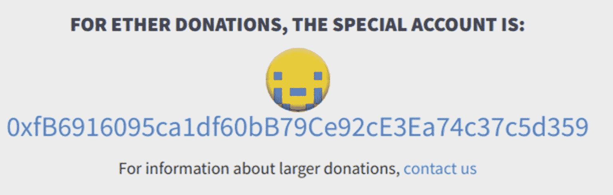
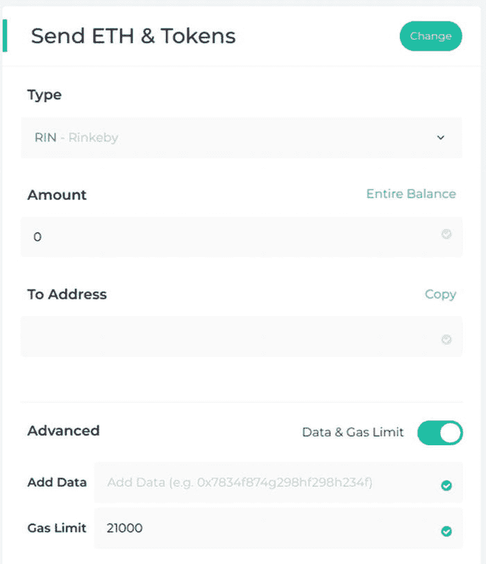

# 7. 用户入门

复杂的用户入门体验是阻碍以太坊实现大规模普及的主要问题之一。新用户需要安装专门的浏览器或扩展程序、创建并备份账户，然后获取 ETH，才能开始与去中心化应用交互。在前几章中，我们处理的是已启用 web3 的用户；在本章中，我们将探讨如何为新用户简化入门体验。

我们将首先探讨无需创建账户或在我们背后为用户创建账户的情况下与区块链交互的场景。我们将更进一步，通过智能账户将账户管理本身移至区块链，并在此过程中探索合约的可升级性。然后，我们会将焦点转向用 ETH 与以太坊交互的问题，并引入无 gas 交易：一种让用户无需支付 gas 费的技术。最后，我们将回顾以太坊名称系统，它用用户友好的名称隐藏了原始地址，使它们更易于用户访问。

## 问题所在

请试着回忆一下你第一次使用以太坊驱动的应用时的步骤。第一步很可能是获取 ETH 来为你的交易提供燃料。如果你没那么幸运，没人送你一些加密货币，那么你需要在交易所注册并可能验证你的账户。根据交易所的不同，有时甚至需要上传手持护照的自拍照或水电费账单来证明你的地址。一旦被列入白名单，你需要通过传统方式（如电汇）将资金汇入交易所，以换取你的 ETH。

下一步是将资金从交易所取出，存入你控制的账户。在对硬件、移动端、桌面端和在线钱包进行仔细研究后，你可以选定一个并实际创建你的账户。无论你选择哪个钱包，这都涉及记下一组 12 个随机单词，并将它们保存在安全的地方——但也不能太安全，因为丢失它们意味着丢失你唯一的备份，从而丢失你所有的加密货币。在为你钱包选择一个密码之后（但你之前不是刚记下了 12 个单词用于安全吗？），你终于看到了你的公共地址，并可以将资金从交易所移出，置于你的控制之下。

现在，你带着注资后的账户，在浏览器中打开一个去中心化应用试试看。但可惜的是，该网站找不到 web3 提供者，并提示你安装专门的浏览器扩展程序（如 `Metamask`）或使用支持 web3 的浏览器（如 Opera）进行交互。完成此操作后，你需要决定是否将你的 12 个单词（本应绝对安全保管）托付给这个新组件——把你刚刚下载的浏览器扩展程序上输入它们，这是个好主意吗？——还是设置另一个新账户。如果你选择后者，你需要再次经历同样的过程：通过 12 个单词备份、选择密码、记下新账户，并将你的 ETH 转入。

完成这些步骤后，你终于可以发送你的第一笔交易，从你最喜欢的去中心化商店购买一个数字收藏品加密帽子了。乌拉！

现在，如果你正在阅读本书，你很可能是一名程序员，并且喜欢技术挑战。设置自己的账户可能很繁琐，但这也带来了成为去中心化革命先锋的兴奋感。

但请站在普通用户的角度想想，如果一个页面加载时间超过几秒，他们就会直接关闭。大多数用户要求即时满足，要求他们经历如此复杂的流程只是为了开始使用你的应用，这无异于一场灾难。

虽然不可能总是消除上述所有必需步骤，但确实有可能向用户隐藏其中一些步骤，或者将它们推迟到用户对你的应用足够投入，愿意花几分钟进入*下一阶段*。我们将在本章中回顾一些实现这一目标的技术。不过要提醒的是——这个问题没有银弹。

## 无需账户进行交互

我们将从处理创建账户这一任务开始——涉及选择钱包、记下助记词、设置密码等。绕过这些步骤最简单的方法就是让你的应用*根本不需要账户*就能与之交互。虽然这并非适用于所有场景，但可以进行调整以覆盖比预期更多的场景。

### 从交易所发送资金

使用此方法最简单的入门场景是直接接收纯 ETH 到某个地址。例如，一个捐赠应用只需列出一个支付地址，用户可以直接从交易所或他们控制的任何钱包发送普通交易，而无需强迫他们使用支持 web3 的浏览器。某些服务甚至提供可嵌入的小部件，你可以将其集成到你的应用中，这样用户甚至无需离开你的网站，就能用法币购买他们所需的 ETH。

### 普通转账与回退函数

对用户而言，仅发送 ETH 是最简单的操作（如图 7-1 所示）。列出的接收地址可以是外部拥有账户，也可以是每次转账时执行简单处理的智能合约。



图 7-1

`ethereum.org` 的捐赠账户。此地址可能已随截图更新而改变，因此在对照原始来源[`www.ethereum.org/donate`](http://www.ethereum.org/donate)前，请勿向其转账任何资金。

#### 谨慎提示

需注意，交易所不会为每个用户或交易生成唯一的 ETH 地址。这意味着，如果您希望用户直接从交易所发送资金，则不能依赖合约中的 `msg.sender` 来识别触发交易的用户。

请记住，每当合约收到普通资金转账时，回退函数都会被执行，这意味着您实际上可以通过特定操作来响应转账。特别是，您可以依赖发送的 ETH 精确数额。然而，某些交易所仅会使用极低 Gas 限额进行转账，因此可能无法执行复杂操作作为 ETH 转账的响应。

#### 注解

若交易所未能为其转账设置合理的 Gas 限额，则可能被恶意利用。正如 Chris Whinfrey 等人在漏洞报告“未设置适当 Gas 限额导致滥用”中所述：“许多交易所允许向任意地址提取以太坊且无 Gas 用量限制。由于向合约地址发送以太坊会执行其回退函数，攻击者可迫使这些交易所为任意计算支付费用。这使得攻击者能强制交易所因高额交易成本而消耗自身以太坊。”所有交易所均应为其出站交易设置严格的 Gas 限额。

### 转发合约

一个巧妙的技巧是：通过部署多个充当转发代理的合约，并在主合约中将特定函数作为其回退函数执行，从而允许用户随捐赠发送额外信息。尽管这无法发送任意数据，但支持运行预定义的函数集。

举例来说，假设我们有一个为两个竞争方（A 和 B）接收资金的合约。该合约的简单实现可能如清单 7-1 所示。

```
// 01-forwarding-contracts/contracts/Donations.sol
pragma solidity ⁰.5.0;
contract Donations {
uint256 fundsA;
uint256 fundsB;
uint256 timeEnd;
address payable walletA;
address payable walletB;
constructor(...) public { ... }
function donateA() external payable {
require(now  0);
fundsA += msg.value;
}
function donateB() external payable {
require(now  0);
fundsB += msg.value;
}
function withdraw() external { ... }
}
```

清单 7-1

为其中一方接受捐赠的合约示例实现。用户发送资金时必须调用 `donateA` 或 `donateB`

按此设计，合约要求用户在每次转账时指定捐赠对象是 A 还是 B——在底层，这意味着需要用户添加调用 `donateA` 或 `donateB` 的数据。请注意，根据合约 ABI 使用 `web3js` 可轻松生成此数据（清单 7-2）。

```
> let donations = new web3.eth.Contract(DonationsABI)
> donations.methods.donateA().encodeABI()
0x63420a5c
```

清单 7-2

根据 `Donations` 合约 ABI，获取 `donateA` 方法交易的数据字段

然而，要求用户在转账时附带任意十六进制字符串可能存在问题，因为大多数交易所不支持在提款时包含数据。而对于常规钱包，添加数据通常作为高级功能呈现（如图 7-2 所示）。



图 7-2

从在线钱包 `myetherwallet.com` 发送 ETH 的对话框。注意，在交易中包含数据的选项位于“高级”部分下方，默认隐藏

更好的方案是：在主合约之外再部署两个小型合约，它们唯一的用途是将每次调用转发至 `donateA` 或 `donateB` 函数（清单 7-3）。这样，用户只需将资金发送至两个地址之一（`DonateA` 或 `DonateB`），即可向所选方捐赠，通过仅向特定地址转移 ETH 即可*实际执行两个函数之一*。

```
// 01-forwarding-contracts/contracts/DonateA.sol
contract DonateA {
Donations donations;
constructor(Donations _donations) public {
donations = _donations;
}
function() external payable {
donations.donateA.value(msg.value)();
}
}
```

清单 7-3

示例 `DonateA` 合约，通过调用 `donateA` 将所有转账转发至主 `Donations` 合约。`DonateB` 代码与此类似

## 一次性地址

如前所述，让用户直接从交易所向智能合约发送 ETH 存在若干限制：

- 无法依赖 `msg.sender`，因为交易所可能对多次提款使用同一地址，或对同一用户使用不同地址。
- 交易附带的 Gas 可能不足以执行计算密集型操作，甚至无法写入存储。
- 转账中无法包含数据。

拥有自有钱包的用户不会面临这些问题，因为他们持有自有资金账户，并可从该账户发送任意交易。尽管我们可以即时为用户创建账户（本章后续将讨论），但对于短期交互存在更简单的解决方案：*一次性地址*。这些外部拥有地址在其生命周期内只能发起一笔预定义交易。交易执行后，该地址便不可再用。

### 如何使用一次性地址

一次性地址可作为中间账户，接收来自交易所的资金并用于执行预定义操作。此类操作可设置任意高的 Gas 限额并包含任意数据。用户流程如下：

1. 用户选择要在应用中执行的操作，包括任意数据、待转账资金或待用 Gas。
2. 生成一个只能执行该交易的一次性地址。
3. 用户从交易所向该一次性地址发送资金。
4. 资金到账后，交易即被触发执行。

请注意，如果来自一次性地址的交易因任何原因失败（无论是合约中的 `require` 失败还是 Gas 不足），都无法发出第二笔交易进行修复。这意味着用户在步骤 3 中发送的任何资金将被永久锁定。因此，在交易可能因状态变化而失败时，务必避免使用一次性地址。

例如，上一节中的 `Donations` 合约就不适用，因为接受捐赠的时间有限。用户可能在捐赠开放期间设置一次性地址，但如果关闭后才注入资金，其资金将被锁定。

一次性地址的另一个陷阱是：必须为其注入执行所需的精确 ETH 数额。任何额外发送至该地址的资金都将无法追回。请务必向用户明确告知这一点！

#### 创建一次性地址

一次性地址是如何创建的？值得注意的是，它们并非以太坊的特殊构造体，而是巧妙技巧的产物。此外，创建此类地址完全无需初始燃料费。

回顾前文，以太坊上的所有交易都必须使用发送者的私钥进行签名才能生效。发送者地址可以从交易签名中推导得出，因此 `from` 实际上从未包含在交易数据中——而是在需要时从签名计算而来。

概括来说，发送交易包含以下步骤：

1. 将交易参数（接收方、燃料费、燃料价格、nonce、数据、价值等）打包成二进制对象。
2. 对交易二进制数据进行哈希，并使用发送者的私钥进行签名。
3. 广播交易二进制数据及其签名。

另一方面，处理交易则包含以下步骤：

1. 计算交易二进制数据的哈希值。
2. 从哈希和签名中推导出发送者地址（即 `from`）。
3. 将交易二进制数据解包为其参数（接收方、燃料费、燃料价格、nonce、数据、价值等）。

生成一次性地址的技巧在于随交易发送一个随机签名。我们并非在步骤 2 中实际签署交易，而是在步骤 3 中仅包含一组随机字节作为签名。这样一来，该过程便没有私钥与之关联。

在处理交易时，这会从签名中推导出一个随机的发送者地址。鉴于与该地址关联的私钥未知，因此无法为同一地址生成任何其他交易。这有效地产生了一个只能广播一笔特定交易的一次性地址。然后，一旦该地址获得 ETH 资金，就能覆盖燃料费，并将交易广播到网络。

#### 示例代码

我们将使用上一节中 `Donations` 示例的一个变体，它只有一个受益人和一个 `donate` 方法，该方法接受一个字符串，该字符串将在每次捐赠时通过事件发出（清单 7-4）。然后我们将依赖一个一次性地址与其交互。

```
// 02-single-use-addresses/contracts/Donations.sol
contract Donations {
address payable wallet;
event Donation(uint256 value, string text);
constructor(address payable _wallet) public {
wallet = _wallet;
}
function donate(string calldata text) external payable {
require(msg.value > 0);
emit Donation(msg.value, text);
}
function withdraw() external { ... }
}
```

清单 7-4

简化的 `Donations` 合约，接受一个自定义字符串，该字符串在每次捐赠时通过事件发出

假设我们的用户想要发送一笔 1 ETH 的捐赠，并附带传统问候语 “Hello world”。我们需要首先生成执行该函数的编码后 `data`，并估算执行该调用的燃料成本。

```
// 02-single-use-addresses/index.js
let donations = new web3.eth.Contract(abi, address);
let call = donations.methods.donate("Hello world");
let data = call.encodeABI();
let gas = await call.estimateGas({ value: 1e18 });
```

#### 警告

请记住，实际的燃料用量可能会根据交易执行时的状态而改变。由于一次性地址的本质特性，如果交易因燃料不足而失败，就无法以更高的限额再次执行该交易。这将导致用户的资金被永久锁定在该地址中。如果你的函数将来可能消耗更多燃料，请确保在后续步骤中构建交易对象时将其考虑在内。

现在我们拥有了所有必要的参数，可以使用随机签名来构造我们的交易。为了构建这个交易对象，我们将使用 `ethereumjs-tx@1.3.7` 库。

```
const Tx = require('ethereumjs-tx');
let tx = new Tx({
value: 1e18,
data,
gas,
gasPrice: 1e9,
to: address,
nonce: "0x0",
v: networkId * 2 + 35,
s: '0x' + '2'.repeat(61),
r: '0x' + '3'.repeat(61)
});
let sender = tx.getSenderAddress().toString('hex');
```

现在，上述代码段中的大多数参数应该很熟悉了：接收方地址、发送的 ETH 数量、燃料限额和价格，以及交易数据。由于这笔交易将从尚未发送过任何交易的新地址发出，因此 nonce 必须为零。

我们在此看到的新参数是 `v`、`r` 和 `s`，它们对应于交易的签名。其中第一个参数必须从链 ID 推导得出，而另外两个通常根据用户的私钥计算得出——这里我们将用任意字节序列替换它们。

#### 注解

使用可识别的虚构序列作为 `r` 和 `s` 非常重要，例如相同字节组的明确重复，或大量前导零。否则，第三方无法知道生成的交易对象是否确实属于一次性地址，或者该签名是使用实际私钥获得的。如果确实使用了私钥来生成交易，那么当用户将资金发送到所谓的“一次性”地址时，其持有者可以生成另一笔不同的交易。

现在，如果你尝试运行上面的代码来获取发送者地址，`getSenderAddress` 调用会抛出一个“无效签名”错误。这是因为并非所有签名在以太坊中都是有效的——大约只有一半是有效的。解决此问题的最简单方法是使用几个不同的值进行测试，直到找到一个有效的任意签名。例如，每次收到无效签名异常时，我们可以将 `r` 增加 1，直到得到一个有效值。

```
const BN = require('bignumber.js');
let sender = null;
while (!sender) {
try {
sender = '0x' + tx.getSenderAddress().toString('hex');
} catch(ex) {
const r = new BN('0x' + tx.r.toString('hex'));
tx.r = '0x' + r.plus(1).toString(16);
}
}
```

有了有效的预签名交易，我们现在可以尝试将其广播到网络。

```
const rawTx = '0x' + tx.serialize().toString('hex');
await web3.eth.sendSignedTransaction(rawTx);
```

然而，由于我们还没有为发送者地址提供资金，我们将收到“发送者没有足够资金发送交易”的错误。记住，推导出的发送者是一个新账户，因此它之前不会有任何资金。

此时，我们应该要求用户为推导出的这个一次性地址提供资金，并监控该地址的余额变化，以便在余额充足时广播交易。为此，我们首先需要计算所需的精确 ETH 数量：即燃料限额乘以燃料价格，再加上交易中发送的任何价值。

```
let required = (new BN(gas)).times(gasPrice).plus(value);
```

### 警告

请记住，发送到一次性地址的任何额外 ETH 都将丢失。

现在让我们模拟用户将那些资金发送到一次性地址的过程。

```javascript
const [funder] = await web3.eth.getAccounts();
await web3.eth.sendTransaction({
  from: funder, value: required, to: sender
});
```

我们现在终于可以将交易发送到网络，并验证事件是否被正确触发了。

```javascript
let rawTx = '0x' + tx.serialize().toString('hex');
await web3.eth.sendSignedTransaction(rawTx);
let events = await donations.getPastEvents('Donation');
console.log(events[0].returnValues.text);
// 打印 "Hello world "
```

## 应用程序本地账户

在前面的章节中，我们了解了一些无需以太坊账户即可与智能合约应用交互的技巧，现在我们将探讨另一种替代方案：在应用程序*内部*为用户创建账户。我们无需要求用户下载支持 Web3 的浏览器或安装扩展程序，而是可以直接在应用中管理创建钱包的完整流程。这样一来，任何访问我们应用的用户都能立即获得一个以太坊地址并开始交互。另一方面，我们也需要为用户提供安全备份新钱包的方法，同时避免成为其资金的托管方。

### 创建并使用本地钱包

创建以太坊账户需要一组随机字节来生成私钥，进而计算出地址。我们可以使用`web3@1.2.0`库中的`accounts`方法集来实现此操作（代码清单 7-5），该方法会自动从浏览器的加密 API 中获取所需的熵值。

```javascript
let account = web3.eth.accounts.create();
```

现在，我们可以使用该账户对象中的私钥对交易进行签名，并将其广播到网络上（代码清单 7-6）。

```javascript
let tx = await web3.eth.accounts.signTransaction({
  to: account.address,
  value: 1e17,
  gas: 21000,
  gasPrice: 1e9 },
  account.privateKey);
await web3.eth.sendSignedTransaction(tx.rawTransaction);
```

为避免手动生成、签名和广播每笔交易，`web3`库允许将账户注册为钱包（代码清单 7-7），该钱包将自动用于发送任何交易。

```javascript
web3.eth.accounts.wallet.add(account);
await web3.eth.sendTransaction({
  from: account.address,
  to: account.address,
  value: 1e17,
  gas: 21000
});
```

### 注意

回顾之前的章节，Metamask 通过`web3`的子提供程序实现了类似行为。交易并非依赖节点签名，而是被拦截后在客户端完成签名，然后再广播出去。

### 加密密钥库

接下来的问题是生成用户钱包后*如何*存储。最直接的方法是将私钥保留在浏览器的本地存储中，这样当用户再次访问我们的网站时，我们可以轻松地重建账户对象。

```javascript
// 将私钥存储到本地存储
localStorage.setItem("ethereum_pk", account.privateKey);
// 从本地存储加载私钥并重新创建账户
let pk = localStorage.getItem("ethereum_pk");
let account = web3.eth.accounts.privateKeyToAccount(pk);
```

然而，这种做法极其不安全，因为浏览器的本地存储绝不应用来保存敏感信息，它很容易受到 XSS 攻击——更不用说如果用户清除站点数据或丢失设备，这些密钥也将一并丢失。仅当管理的 ETH 数量非常少且资金损失可接受时，才建议以这种方式存储明文私钥，换句话说，就是当可用性优先于安全性时。

一种更安全的方法是在存储之前对私钥进行加密（代码清单 7-8）——无论是存储在浏览器的本地存储、远程服务器、下载到用户电脑，还是跨云存储同步。以太坊的*钱包 v3 格式*是一种标准化的 JSON，其中包含用密码加密的私钥，且不易被破解。节点在底层使用这种格式来存储你的密钥，浏览器中也可用它来加密用户账户后再存储。

```bash
$ web3.eth.accounts.encrypt(account.privateKey, 'PASSWORD');
> { version: 3,
  id: 'b8c62b04-041c-49d6-966a-205bb5f70528',
  address: 'af0a9c8d7f74dff1ce64f9c322108c336502bbd4',
  crypto:
    { ciphertext: 'ba09a90b5...7b0e5e24da79d7f9efda613fd298',
      cipherparams: { iv: '2e72184026373b69d21ce157b1d93bba' },
      cipher: 'aes-128-ctr',
      kdf: 'scrypt',
      kdfparams:
        { dklen: 32,
          salt: 'eab3860a...d1d378abbc55a65cae3c83e0a39e',
          n: 8192,
          r: 8,
          p: 1 },
      mac: '60177f2af3...bd900315e46e2d' } }
```

虽然这是一种更安全的选择，但它需要用户输入密码，从而增加了额外的复杂性。尽管密码对网络用户而言是常见的烦恼，但他们也习惯了在忘记密码时能够*重置*密码——而在此情况下，该选项不可用。如果用户忘记了密钥库密码，其中的内容将永久丢失。

除了这个问题，密钥库本身也不得丢失。如果你仅将加密后的私钥存储在浏览器中，而用户恰好清除了本地数据或丢失了设备，那么所有资金都会随之丢失。你必须确保用户进行适当的备份（要求他们从你的页面下载密钥库并保存到其他地方），或者将密钥库保存在你应用服务器的安全位置（假设你有服务器！）。

### 注意

充当用户资金的托管方与充当存储其加密私钥的备份位置之间存在着巨大差异。前者意味着对服务器的任何黑客攻击都会导致用户资金损失，而后者只是方便用户安全保存其加密密钥。

然而，从法律角度来看，这种差异可能没那么大。如果你确实在服务器端存储了用户的加密密钥库，请务必了解你所在司法管辖区的法律要求。

### 助记词

一种去中心化的用户密钥备份替代方案是生成*助记词*。助记词是由一系列单词（通常为 12 到 24 个）组成的序列，便于用户手写保存。你在钱包创建账户时可能已经接触过它们。请记住，助记词仅作为密钥库丢失时的备份手段，因为要求用户每次使用应用时输入 24 个单词序列是不合理的。

助记词的主要优势在于，它提供了一种将数字信息（私钥）存储在传统物理介质（如纸张）中的方式。这样一来，即使用户的所有电子设备被盗或被黑客攻击，他们仍能通过这种传统方法恢复账户。

不幸的是，无法从私钥逆向生成助记词。正如我们在第 5 章所见，推导过程是单向的：助记词用于计算扩展密钥，再由此派生出单个或多个私钥。这意味着如果你希望用户通过此方法备份账户，就需要从头构建该功能。

为了创建助记词并从中派生种子，我们将使用`bip39`库。为了创建分层确定性钱包并派生私钥，我们将使用`ethereumjs-wallet`库（代码清单 7-9）。

```javascript
// 03-mnemonics/index.js
const hdkey = require("ethereumjs-wallet/hdkey");
const bip39 = require("bip39");
let mnemonic = bip39.generateMnemonic();
> sadness brief beauty strike donor capable recipe brand pretty hill orange inflict
let hd = hdkey.fromMasterSeed(bip39.mnemonicToSeed(mnemonic));
let path = "m/44'/60'/0'/0/0";
let wallet = hdwallet.derivePath(path).getWallet();
let pk = wallet.getPrivateKeyString();
> 0xdc68f9ce62dd1f16eed...5f7feba7b3284d9
```

代码清单 7-9
创建助记词并派生对应的私钥。注意，通过使用不同的推导路径，可以从同一组助记词生成更多私钥

这段代码允许你为用户账户生成助记词。请注意，你的用户需要在刷新页面之前将助记词保存在安全位置，因为你绝不应在任何地方存储明文的单词序列，这与存储未加密的私钥同样不安全。

到目前为止，我们已经添加了若干机制来确保用户资金的安全，例如使用密码加密私钥，以及提供一组易于手写的单词用于备份。

然而，我们同时也复制了最初试图避免的复杂性——这种复杂性导致大多数用户难以真正上手以太坊。尽管我们还会探讨其他方法，但本节的核心要点是让你了解可用的工具，从而在安全性、易用性和去中心化之间找到最适合你应用的平衡点。

## 智能账户

本地钱包存在若干缺陷：不仅需要额外的保存步骤，而且对于从多个不同设备访问应用的用户而言，提供的选项非常有限。即使你可以依赖云服务在用户设备间同步加密的私钥，也无法实现从某台设备撤销访问权限。更糟糕的是，如果不将资金托管给第三方，就无法实现关键交易的双重身份验证等附加安全措施。

幸运的是，我们已经拥有一个去中心化且安全的计算平台，可以依赖它为用户账户构建任何额外的安全性或恢复功能。这本质上是将用户的账户本身迁移到区块链上，作为合约存在。

### 身份即智能合约

*智能账户*（也称为*身份合约*）的核心概念是：用户身份（及其资金）由一个智能合约代表，而不是由一个或多个外部拥有账户代表。用户控制着一个合约，该合约将用户的操作转发至其他应用程序，并集中持有用户的资产。从新设备管理此身份只需要注册一个新的外部拥有账户作为该合约的管理者即可。

### 注

关于这些合约的研究有许多名称：身份合约、智能账户、"守门人"代理、多签钱包或钱包合约。这些合约通常与元交易或 Gas 中继（我们将在本章后面讨论）相伴相生。虽然很难确定谁最先提出了这个想法，但值得提及 Alex Van de Sande、Philippe Castonguay、Panashe Mahachi、Austin Griffith、Christian Lundkvist 和 Fabian Vogelsteller 在此主题上的贡献。该领域的工作也受到了 Vitalik Buterin 提出的账户抽象提案^(¹⁰⁴)的启发，该提案旨在将外部拥有账户和合约账户合并为单一类型，并将签名验证的负担转移到 EVM 上。

将用户身份迁移到智能合约，使我们能够以无需信任的方式，直接在链上实现用户习惯的任何账户管理功能：

- 用户可以注册多个设备，每个设备都有自己的外部拥有账户，用于管理同一个身份合约。
- 不同的密钥可以拥有不同的访问权限：从管理身份合约本身，到仅能转移有限数量的资金。
- 重大交易可能需要多个密钥共同确认操作，从而对关键操作实施双重身份验证（2FA）。
- 可以通过指定一组受信任方来实现账户的社交恢复。这意味着你可以选择一个亲密朋友圈子，当你丢失密钥时，他们可以共同授予你重新访问身份合约的权限。该功能甚至可以扩展到遗嘱信托。

请记住，使用智能账户并不能消除生成本地外部拥有账户的需求。如果用户尚未拥有支持 web3 的浏览器，我们的应用仍需要为每个设备创建一个本地密钥来管理身份合约。使用智能合约而非普通账户的改进之处在于，可以以去中心化的方式实现额外的安全性和恢复功能——例如，社交恢复可以作为手写 24 词助记词的一种替代方案。

### 示例实现

最简单的身份账户（清单 7-10）应处理两个主要问题：管理有权在合约上操作用户账户列表，以及转发调用和转账。

```solidity
// 04-identity-contracts/contracts/Identity.sol
pragma solidity ⁰.5.0;
contract Identity {
    mapping(address => bool) public accounts;
    event AccountAdded(address indexed account);
    event AccountRemoved(address indexed account);
    constructor(address owner) public payable {
        accounts[owner] = true;
        emit AccountAdded(owner);
    }
    modifier onlyUser {
        require(accounts[msg.sender], "Sender is not recognized");
        _;
    }
    function addAccount(address newAccount) onlyUser public {
        accounts[newAccount] = true;
        emit AccountAdded(newAccount);
    }
    function removeAccount(address toRemove) onlyUser public {
        accounts[toRemove] = false;
        emit AccountRemoved(toRemove);
    }
    // Forward arbitrary calls and funds to a third party
    function forward(
        address to, uint256 value, bytes memory data
    ) onlyUser public returns (bytes memory) {
        (bool success, bytes memory returnData) =
            to.call.value(value)(data);
        require(success, "Forwarded call failed");
        return returnData;
    }
    // Empty fallback function to accept deposits
    function() external payable { }
}
```

清单 7-10
一个非常基础的身份合约，支持管理用户账户和转发调用

首次部署此合约时，会注册用户的第一个账户。随后可以通过已有设备注册新设备上的任何新账户（清单 7-11）。

```javascript
// 04-identity-contracts/index.js
const identity = await new web3.eth.Contract(identityAbi)
    .deploy({ arguments: [mainDevice], data: identityBytecode })
    .send({ from: mainDevice, gasPrice: 1e9, value: 10e18 });
await identity.methods.addAccount(anotherDevice)
    .send({ from: mainDevice });
```

清单 7-11
创建持有 10 ETH 资金的身份合约并添加第二个设备。本例中，`mainDevice`和`anotherDevice`是在用户设备上创建的账户

此后，两个已注册账户中的任何一个都可以使用`forward`方法将资金从身份合约发送给第三方（清单 7-12）。

```javascript
const emptyData = [];
await identity.methods
    .forward(thirdParty, 1e18.toString(), emptyData)
    .send({ from: anotherDevice });
await web3.eth.getBalance(identity.options.address);
// => 9 ETH
await web3.eth.getBalance(thirdParty);
// => +1 ETH
```

清单 7-12
使用`anotherDevice`从身份合约发送资金

调用另一个合约的过程类似；只需要对合约调用进行编码，并将其作为`data`提供给转发函数即可（清单 7-13）。例如，我们可以调用在前几章编写的`Greeter`合约中的`setGreeter`方法。

```javascript
const data = greeter.methods.setGreeting("Hey").encodeABI();
await identity.methods
    .forward(greeter.options.address, "5000", data)
    .send({ from: anotherDevice });
await greeter.methods.greet().call();
// => "Hey"
```

清单 7-13
从身份合约调用`greeter`合约实例的`setGreeting`方法，交易附带 5000 Wei

之前讨论的大多数特性都可以在此基础合约之上实现：可以为账户分配不同的权限级别，同时可以对转发函数施加基于转账价值的限制。

多签钱包^((105))就是一个很好的例子。这类合约设计为注册 N 个账户，每笔交易需要至少 M 个确认（M < N）。虽然它们通常用于通过将密钥分发给团队不同成员来安全保管大额资金，但也可以通过为不同设备分配不同密钥来管理个人资金。

### 部署智能账户（方案一）

鉴于本章的重点是简化用户上手流程，要求用户不仅生成本地外部拥有账户，还要部署合约、为其提供资金、并在其上注册设备，这似乎是朝着相反方向迈出的一步（甚至很多步）。

尽管如此，其中许多步骤可以由应用程序代表用户执行——包括部署。在用户于我们系统内执行一定数量的操作后，我们可以选择代表他们部署身份合约，并将其所有权转移到他们的账户。尽管这会产生燃料费成本，但在许多情况下，这种补贴可被视为用户获取的必要成本。

然而，一个更去中心化（对我们来说也更便宜）的选择是依赖一次性地址来设置合约。我们的应用程序可以在后台生成一个本地钱包，作为身份合约的初始所有者（如果用户尚未拥有 web3 浏览器），同时生成一个一次性地址，一旦该地址获得资金，即可触发智能账户的部署和配置。当一次性地址从交易所获得资金后，身份合约将被部署，并预存一定数量的 ETH。从那时起，用户直接通过其新的身份合约进行操作。

### 注意

请记住一次性地址部分的内容：发送到该地址的任何额外资金都将无法挽回地丢失。用户必须选择他们最初想发送到身份合约的 ETH 数量，然后创建交易并精确地用该金额提供资金。

为部署合约生成一次性地址与调用合约类似，区别在于交易必须发送到空地址（清单 7-14）。

```javascript
// 05-single-use-address-deploy-identity-contract/index.js
let call = new web3.eth.Contract(identityABI)
.deploy({ arguments:[owner], data: identityBytecode });
let data = call.encodeABI(); // Encode data for deployment
let gas = await call.estimateGas();
let gasPrice = 1e9;
let value = 1e18; // Seed identity with 1ETH on deployment
let nonce = "0x00";
let to = null; // Set tx recipient to null
清单 7-14
用于部署合约的交易参数。注意接收方被设为 null，因为我们是在创建新合约而非与现有合约交互。签名参数按本章一次性地址部分所示进行设置
```

这种方法另一个有趣的特点是，由于合约创建地址是确定性的，因此可以在合约`实际部署之前`向用户展示其身份合约地址（清单 7-15）。合约部署的地址是发送方地址和 `nonce` 的函数。

```javascript
const Util = require('ethereumjs-util');
let deploymentAddress = '0x' + Util.generateAddress(
Buffer.from(sender.substring(2), 'hex'),
Buffer.from(nonce, 'hex')
).toString('hex')
清单 7-15
使用 ethereumjs-util 库预计算部署地址
```

然而，这种方法的一个问题是，我们向用户展示了两个不同的地址：一个是他需要一次性为其提供资金用于部署的地址，另一个将是他的实际身份合约地址。再加上发送到该地址的任何额外 ETH 都会丢失这一事实，这损害了用户在设置智能账户时的体验。在本章稍后熟悉元交易的概念后，我们将分析一种更稳健的方法。

### 注意

一个简单得多的选项是让用户将其资金转移到他们的设备账户（无论是本地于我们的应用程序，还是由 web3 浏览器管理），然后从该账户执行部署。但这仍然存在向用户展示两个地址的问题——一个用于初始资金，另一个用于身份合约。

## 升级用户账户

正如我们所看到的，身份合约可以为用户集成多种功能，例如双因素认证、社交恢复、每日转账限额等。这引出了一个问题：*应该*将这些合约构建成什么样。由于合约是不可变的，任何添加新功能的变更都需要用户放弃当前的身份并部署新的合约。然而，强迫用户将所有资产转移到新合约，就相当于要求他们在想使用新功能时，必须迁移到一个新的电子邮件账户——包括在他们可能使用的所有在线服务中更改电子邮件地址。

尽管如此，在以太坊中，合约部署后实际上是可以升级的，从而允许像传统软件开发一样进行迭代部署和错误修复。要实现这一点，我们首先需要熟悉以太坊虚拟机（`EVM`）中的*委托调用*概念。

### `DELEGATECALL` 指令

在 `EVM` 中，从一个合约到另一个合约的常规 `CALL` 就像从一个角色或进程向另一个发起调用：会创建一个新的上下文，其中加载被调用者的状态（存储和余额），调用者被设置为 `msg.sender`，并执行被调用者的代码。另一方面，`DELEGATECALL` 的工作方式是执行被调用者的代码，但*保持调用者的原始上下文*。换句话说，存储、余额甚至 `msg.sender` 都不会因 `DELEGATECALL` 而改变——只有正在执行的代码会改变。

这个底层指令允许我们跳转到任意合约并执行其代码，而该代码实际上会修改当前合约的状态。被调用的合约则充当库的角色，^(¹⁰⁶) 仅用作共享代码的存储库，而不使用其自身状态。

### 委托代理

`DELEGATECALL` 指令允许我们构建一个合约，该合约简单地将所有调用委托给另一个持有实际执行逻辑的合约。这些合约通常被称为*委托代理*，因为它们将所有调用委托给另一个合约；或者被称为*透明代理*，因为任何与之交互的客户端都察觉不到它们的存在。由代理调用、持有实际执行代码的合约通常被称为*逻辑合约*、*实现合约*或*主副本*。

一个委托代理（列表 7-16）可以在 `Solidity` 中实现为一个合约，该合约将其实现合约的地址作为唯一的 state 变量，并且只有一个回退函数，在该函数中它将所有调用委托给实现合约。代理将在其构造函数中接收实现地址，并可选地接收用于初始化它的 `calldata`。

```solidity
// 06-upgrading-identity-contracts/contracts/DelegateProxy.sol
contract DelegateProxy {
// 将地址存储在第一槽位
// 目标合约必须将地址定义为第一个变量
address private implementation;

constructor(
address _implementation,
bytes memory _data
) public payable {
implementation = _implementation;
if (_data.length > 0) {
(bool success,) = _implementation.delegatecall(_data);
require(success);
}
}

// 回退函数将所有调用委托给实现合约
function () payable external {
address impl = implementation;
assembly {
calldatacopy(0, 0, calldatasize)
let result := delegatecall(
gas, impl, 0, calldatasize, 0, 0
)
returndatacopy(0, 0, returndatasize)
switch result
case 0 { revert(0, returndatasize) }
default { return(0, returndatasize) }
}
}
}
列表 7-16
基于 github.com/zeppelinos/zos 代码实现的委托代理合约。注意回退函数中使用了汇编，因为 Solidity 不允许回退函数返回任意数据。如果我们不返回任何数据，那么任何对合约的调用都将产生空响应
```

### 注意事项

在 `EVM` 中正确实现可升级性可能非常棘手，并且会有一些限制。例如，代理合约在创建时无法执行逻辑合约的构造函数，因此任何需要可升级的合约都必须依赖充当*初始化器*的常规函数。另一个问题是，如果将一个代理更新为具有不同 state 变量集的逻辑合约，可能会无意中损坏合约的状态。如果你计划在应用中使用可升级合约（无论是智能账户还是其他任何合约），强烈建议使用现有的可升级性解决方案，而不是自行开发。

这里的关键概念是，逻辑合约的地址不需要硬编码到代理中——它实际上可以保存在存储中。当这个地址被更改时，这就能有效地更新代理正在执行的代码，同时保留其状态和地址。我们现在可以将此功能添加到我们的身份合约中。

### 可升级身份

有了这个新的构建块，我们可以部署一个单一的身份合约作为逻辑合约，并为每个用户部署一个代理。请记住，由于所有状态都保存在代理中，因此逻辑合约不需要多个副本，单个副本（像一个库）可以在多个代理之间共享。

这不仅节省了部署时的 Gas 费用（因为代理合约比身份合约小得多，因此更便宜），还允许我们的用户在需要时随时升级到不同的身份合约。让我们将*升级*功能构建到我们新的可升级身份中（列表 7-17）。

```solidity
// 06-upgrading-identity-contracts/.../UpgradeableIdentity.sol
contract UpgradeableIdentity {
// 第一个变量用于实现合约地址
// 记住：代理使用了相同的变量位置！
address private implementation;

// 记录此实例是否已被初始化
bool private initialized;

// 初始化函数，替代构造函数
function initialize(address owner) public payable {
require(!initialized);
initialized = true;
accounts[owner] = true;
emit AccountAdded(owner);
}

// 升级到新的实现
function upgradeTo(
address newImplementation
) onlyUserAccount public {
implementation = newImplementation;
}

// 其余的身份合约代码在此...
}
列表 7-17
支持可升级性的身份合约变体。注意，合约的第一个变量是实现合约地址，构造函数已被一个常规函数替代，该函数依靠一个标志来记录实例是否已被初始化。升级到不同的身份实现只需更改存储中第一个位置上的实现地址即可
```

请记住，此合约上定义的任何 `state` 变量实际上都不会存储在此合约的存储中，而是存储在代理的存储中——这要归功于委托调用的魔力。例如，`initialized` 标志实际上并没有在作为共享实现的单个 `UpgradeableIdentity` 合约上设置，而是在每个以此为后端的代理上设置。

因此，此合约声明的第一个变量必须是实现地址，就像在代理中一样。此外，合约不能扩展定义额外合约变量的任何基础合约。这确保了实现地址存储在代理查找它的相同存储位置。^(¹⁰⁷)

### 注意

合约的可升级性是以太坊社区中颇具争议的话题。不可变的合约能让用户通过知晓其规则不可更改来信任应用，而引入可升级性则打破了这一保证。但这并非可升级性本身的问题，关键在于*谁*有權決定合约何时升级。由一个开发者控制的去中心化代币，该开发者可以单方面修改合约（例如增加交易税），这显然是不好的。另一方面，拥有明确所有者（或所有者集合）的合约则更适合作为可升级的候选——在这方面，身份合约就是一个完美的例子。

为用户创建身份合约意味着部署一个代理而非合约实例——假设我们已经部署了单一共享的实现合约（清单 7-18）。

```javascript
// 06-upgrading-identity-contracts/index.js
// 逻辑合约是身份合约的预部署实例
let logic = new web3.eth.Contract(identityABI, identityAddr);
// 构建初始化数据，以便在代理创建时调用 initialize(user)
let initData = logic.methods.initialize(user).encodeABI();
// 使用身份合约作为其实现来部署代理，并将用户设置为其初始所有者
let proxy = await new web3.eth.Contract(proxyABI, null, { data: proxyBin })
.deploy({ arguments: [logic.options.address, initData] })
.send({ from: application, gasPrice: 1e9, value: 1e18 });
清单 7-18
为身份合约创建代理。请注意，我们需要使用逻辑合约的 `ABI` 来构建初始化数据，然后在部署代理时使用它
```

代理部署完成后，我们可以像与普通身份合约交互一样与其交互。我们需要使用身份合约的 `ABI` 和代理的地址创建一个新的 `web3` 合约对象（清单 7-19）。

```javascript
let proxyAddr = proxy.options.address;
let identity = new web3.eth.Contract(identityABI, proxyAddr);
await identity.methods
.addAccount(anotherDevice)
.send({ from: user });
清单 7-19
与新部署的代理交互，就像它是一个普通的身份合约一样。该代理将所有调用委托给逻辑合约，其行为与逻辑合约完全一致
```

与身份合约中的任何其他方法一样，用户可以调用升级函数并切换到不同的实现（清单 7-20）。但需要注意的是，新的实现必须具有与原始实现相同的合约状态变量；否则代理的状态可能会损坏。

```javascript
await identity.methods
.upgradeTo(identityV2addr)
.send({ from: user });
清单 7-20
升级到身份合约的 `V2` 版本。用户的身份地址不变，其余额和状态也不变，但可以访问新的代码，其中可能包含新功能和错误修复
```

在智能账户中实现这种模式，使我们能够通过逐步添加对新功能的支持或修复错误来迭代开发应用，并允许用户在需要时采用这些更新。

我们可能想要添加到身份合约中的一个好例子是元交易支持，这将在下一节中看到。

## 无 Gas 交易

用户入门的一个根本问题在于，与以太坊网络交互首先需要 `ETH` 来支付 Gas 费。这涉及到一系列繁琐的步骤，仅仅是为了用其他货币首次购买 `ETH`。在多设备解决方案中，Gas 费也是个问题：用户的所有设备都必须持有少量 `ETH` 才能执行任何交易，即使依赖智能账户来集中管理用户身份也是如此。

以上所有问题意味着，消除发起以太坊交易所需的 Gas 要求，将在可用性方面带来巨大好处。*无 Gas 交易*，也称为*元交易*，通过提供一种将交易发起者与 Gas 支付者解耦的机制来解决这个问题。换句话说，一个账户可以发起交易，而由另一个账户支付其执行费用。这使得应用中的用户无需担心拥有 `ETH` 来支付 Gas 费即可执行任何交易。

### 注意

无 Gas 交易是撰写本文时以太坊生态系统中最活跃开发的技术之一，并且已经衍生出许多不同的变体。这使得本节成为本书中最复杂的部分之一。您可以略过技术细节，考虑研究一些成熟的库，例如 Universal Login、Marmo 或 Gas Station Network。

### 以太坊中的签名

要理解无 Gas 交易，我们首先需要回顾以太坊中的签名机制。正如我们之前所见，一笔以太坊交易需要用发送者的私钥进行加密*签名*才能生效。然而，用户的密钥不仅可用于签署交易，还可用于签署任何任意消息（清单 7-21）。

```javascript
// 07-signing-messages/index.js
// 导入 web3 并创建一个没有提供者的实例
// 因为目前我们不会连接到节点
> const Web3 = require('web3');
> const web3 = new Web3();
// 示例地址及对应的私钥
> let address = '0xaca94ef8bd5ffee41947b4585a84bda5a3d3da6e';
> let pk = '0x829e924fdf021ba3dbbc4225ed' +
'fece9aca04b929d6e75613329ca6f1d31c0bb4';
// 对任意消息的哈希进行签名
> let message = 'Hello world'
> let hash = web3.utils.keccak256(message);
> let signed = web3.eth.accounts.sign(hash, pk)
> signed.signature
0x7fcfb176706502a00e58f74c15cd8151309d8b8a777eefd387eabc760a1aa7f6705699d1431155dfc7b1b1d7d88b3b24d07180107572b127a558b7a8b118cb4d1b
清单 7-21
使用 web3 通过用户的私钥签署消息 108
```

### 注意

在底层，web3 的 `sign` 方法会在消息前加上字符串 `"\x19Ethereum Signed Message:\n"` 及其长度，然后对其进行哈希运算后再签名。这样做是为了避免用户被诱导签署一笔实际交易。大多数 API，甚至是节点或硬件钱包中的 API，都会自动处理这一过程。

给定原始消息及其签名，可以恢复出最初用于签名的私钥所对应的地址。

```
> hash = web3.utils.keccak256(message);
> web3.eth.accounts.recover(hash, signed.signature)
0xACa94ef8bD5ffEE41947b4585a84BdA5a3d3DA6E
```

这种恢复操作不仅可以从链下脚本中完成，还可以在智能合约内部进行（清单 [7-22]），因为 Solidity 提供了执行此任务的 `ecrecover` 函数。我们将通过 `openzeppelin-solidity@2.2.0` 库中的 `ECDSA` 合约来使用它，该合约提供了更友好的接口并执行额外的检查。

```
// 07-signing-messages/contracts/Signatures.sol
pragma solidity ⁰.5.0;
import "openzeppelin-solidity/contracts/cryptography/ECDSA.sol";
contract Signatures {
    using ECDSA for bytes32;
    function recover(
        string memory message, bytes memory signature
    ) public pure returns (address) {
        bytes32 hash = keccak256(bytes(message));
        return hash.toEthSignedMessageHash().recover(signature);
    }
}
清单 7-22
依赖 OpenZeppelin 的 ECDSA 从消息和其签名中恢复签名者的简单合约
```

我们可以验证，使用与之前相同的参数调用前述合约中的 `recover` 函数会产生相同的签名者（清单 [7-23]）。

```
> await signatures.methods
    .recover(message, signed.signature).call();
0xACa94ef8bD5ffEE41947b4585a84BdA5a3d3DA6E
清单 7-23
使用前面列出的智能合约从原始消息中恢复签名者。此处，`signatures` 是一个代表已部署智能合约实例的 web3 合约实例。
```

以太坊签名通常用于链下验证用户是否控制某个账户，或者账户所有者是否通过签署特定消息表明意图（例如在链下投票中）。但签名也可以用于链上，以验证账户所有者打算*执行*某个特定操作。这就是元交易的应用场景。

### 引入元交易

*元交易*或称*燃气费免除交易*，与常规交易类似，它是由接收方、转移的 ETH 数量、调用中包含的数据集、燃气限额和价格以及 nonce 组成的签名元组。然而，元交易并非直接广播到网络，而是被包装在另一笔交易中，并发送到一个特定的合约。该合约知道如何解包嵌套交易、验证其签名并执行请求的操作。

请注意，首先接收并处理该交易的合约实际上是在复现以太坊协议相同的行为：它验证嵌套交易的签名和 nonce，并使用指定的值和数据对接收方执行调用。

那么，元交易的价值何在？关键在于，元交易可以由*不同于*签署原始意图的账户*中继*到网络。这解耦了打算执行操作的用户和为其支付燃气费的用户，从而有效*允许任何用户在不需任何燃气费的情况下执行交易*，只要另一个用户愿意为其付费即可。因此，元交易涉及两个主要角色：

- **用户**：签署希望执行的元交易，但不会将其发送到网络。
- **中继者**：获取该交易，将其包装在自己的交易中，发送给合约，并为其执行支付费用。

我们将在本章后续部分深入探讨中继者。首先，让我们从智能合约层面深入元交易的实现。

#### 基于我们的智能账户进行构建

元交易需要一个能够处理它们、验证它们、检查签名者是否有权执行请求的操作，并代表其执行操作的合约。幸运的是，我们已经拥有一个可以持有资金并代表用户持有的不同账户执行操作的合约：身份合约。

我们将修改一直在构建的身份合约，以处理元交易。我们的转发函数现在将接收一个由用户账户之一预先签名的元交易，而不是来自其中一个账户的直接调用。

这样一来，用户无需向身份合约发送实际交易，只需签署一个操作，然后由中继者发送即可。这使得用户能够**将他们的所有资金存放在一个智能账户中，而无需在其设备上持有任何 ETH 来支付燃气费**。让我们看看在修改后的身份合约中这看起来如何（清单 [7-24]）。

```
// 08-meta-txs/contracts/IdentityWithMetaTxs.sol
// 防止重放攻击
uint256 public nonce;
// 使用 ECDSA 库来恢复签名者
using ECDSA for bytes32;
// 将操作转发给接收方，并验证签名者
// 注意：不再需要 onlyUser 修饰符
function forward(
    address to, uint256 value, bytes memory data,
    bytes memory signature
) public returns (bytes memory) {
    // 获取被签名的交易的哈希值
    bytes32 hash = getHash(to, value, data)
        .toEthSignedMessageHash();
    // 恢复签名者地址并验证
    address signer = hash.recover(signature);
    require(accounts[signer], "签名者未注册");
    // 增加 nonce 并执行调用
    nonce++;
    (bool success, bytes memory returnData) =
        to.call.value(value)(data);
    require(success, "转发调用失败");
    return returnData;
}
// 返回预签名交易的哈希值
function getHash(
    address to, uint256 value, bytes memory data
) public view returns (bytes32) {
    return keccak256(abi.encodePacked(
        to, value, data, nonce, address(this)
    ));
}
清单 7-24
来自身份合约（本章前面介绍过）的修改后转发函数，用于处理元交易
```

首先要注意的是，`forward` 方法除了需要原始参数外，还需要一个 `signature`。该签名是基于一个哈希值计算得出的，该哈希值包含了所有交易参数（接收方、值和数据），外加两个额外项：

- **验证者地址**：即检查签名的合约地址。
- **nonce**：每执行一笔交易就会递增。

包含验证者地址是为了防止发送给其他验证者的元交易在此处被重复使用，而 nonce 则用于防止重放攻击（即多次中继同一笔交易）。生成的哈希值会加上神奇的前缀 `"\x19Ethereum Signed Message:\n"`，使其能够与常规以太坊交易区分开来，然后再次进行哈希运算。

### 注意

某些实现会追踪每个签名者的 nonce，而不是合约全局共用的 nonce。这严格取决于你的使用场景：如果多个白名单账户可能同时发送元交易，那么你应该使用签名者特定的 nonce。

接下来是对发送者的验证。请注意，合约不再检查 `msg.sender` 是否为注册账户——它现在检查的是交易的*签名者*是否已注册。`msg.sender` 变得无关紧要，因为在此阶段谁中继了交易并不重要。

最后，在执行交易之前，nonce 会递增。这可以防止同一笔交易被恶意中继者多次发送到合约。

### 说明

值得一提的是，几乎所有智能账户、身份合约或弹跳代理的实现都包含了某种元交易的变体。一旦用户身份转移到了链上，继续将其限制在协议规则中（例如要求发送者账户为其交易支付 Gas 费）便不再合理。

#### 发送元交易

我们将以智能账户章节中的示例为基础，这次通过向身份合约中的 `Greeter` 合约发送一笔元交易。第一步（代码清单 7-25）是让用户签署待执行的交易。

```
// 08-meta-txs/01-identity-with-meta-txs.js
let recipient = greeter.options.address;
let value = 5000;
let data = greeter.methods.setGreeting("Hey").encodeABI();
let hash = await identity.methods
    .getHash(recipient, value, data).call();
let signature = web3.eth.accounts.sign(hash, pk).signature;
代码清单 7-25
用户构建并签署待转发的交易。其中 `pk` 是用户的私钥，`greeter` 是一个包含 `setGreeting` 方法的合约实例。
```

生成的交易及其签名随后通过 HTTP 或其他链下传输方式发送给中继器。中继器应验证该交易，将其打包，然后发送到用户的身份合约（代码清单 7-26）。

```
await identity.methods
    .forward(recipient, value, data, signature)
    .send({ from: relayer });
await greeter.methods.greet().call();
// => Hey
代码清单 7-26
中继器使用用户提供的参数和签名，调用身份合约的转发函数。身份合约随后会调用 `greeter` 合约，改变其状态。
```

我们有意在此示例中省略了用户如何与中继器通信，以及中继器如何决定是否为用户支付交易费用的细节。这因应用场景而异。例如，一个应用可以在一个众所周知的 URL 上提供中心化的中继器，为其系统中任何合约的每笔交易支付费用。它也可能强制用户通过验证码，以防止垃圾请求。

此外，人们也在努力构建完全去中心化的中继器网络，其中是否为用户交易支付费用的逻辑，实际上是应用智能合约的一部分。这些努力还包括某些方法，让中继者能够因执行而获得补偿，我们将在下一节中看到这一点。

### 中继器与奖励

中继器本质上是一个具有公共接口（通常是 HTTP）的进程，它接收来自用户的已签名消息，验证消息，将其封装成交易，然后推送到网络中。在执行这最后一步时，中继器使用自己的账户——Gas 费用将从该账户余额中扣除。

在我们目前所有的示例中，我们都假设执行元交易所需的 Gas 费用由应用所有者承担。该所有者会启动一个中继器，并免费为其应用的所有用户转发交易。

然而，用户实际上有可能*补偿*为其服务的中继器。一种对转发功能的补充是向中继器（即 `msg.sender`）发送一些 ETH 以覆盖执行成本。这样一来，用户确实支付了与其交易相关的 Gas 费用——只不过这些费用是从他们的智能账户中支付的，从而完全无需在每个设备中保留用于支付 Gas 的 ETH。

这为新型激励机制打开了大门：中继器不再需要由应用所有者集中控制并补贴执行成本，而是可以成为去中心化的，仅通过中继交易来获取利润。这引出了一个名为*桌面挖矿*的新概念，用户无需进行计算密集型的证明工作量，而是通过为其他用户中继元交易来赚取费用。

#### 中继器奖励

实现向中继器补偿的最简单方法是在每个执行请求中包含一笔*奖励*。然后，中继器可以根据预估的执行成本来决定是否中继该交易。

用户甚至可以为其交易指定特定的 Gas 价格和 Gas 限额，并在身份合约中验证这些要求是否得到满足。这可以防止中继器以极低的 Gas 价格发送交易，从而以牺牲用户的时间为代价来支付更低的费用。

让我们再次修改转发函数，以涵盖上述所有内容（代码清单 7-27）。我们需要添加参数来指定奖励和 Gas 要求，并且这些参数也需要由用户签名。

```
// 08-meta-txs/contracts/IdentityWithRewards.sol
event Forwarded(uint256 nonce, bool success, address relayer);
function forward(
    uint256 reward, uint256 gasPrice, uint256 gasLimit,
    address to, uint256 value, bytes memory data,
    bytes memory signature
) public returns (bytes memory) {
    // 验证交易的 Gas 价格
    require(tx.gasPrice >= gasPrice, "Gas price too low");
    // 获取已签名的交易哈希
    bytes32 hash = getHash(
        reward, gasPrice, gasLimit, to, value, data
    ).toEthSignedMessageHash();
    // 恢复签名者地址并进行验证
    address signer = hash.recover(signature);
    require(accounts[signer], "Signer not registered");
    // 增加 nonce，执行调用，并通知结果
    nonce++;
    require(gasleft() >= gasLimit);
    (bool success, bytes memory returnData) =
        to.call.value(value).gas(gasLimit)(data);
    emit Forwarded(nonce, success, msg.sender);
    // 向中继器支付奖励
    msg.sender.transfer(reward);
    return returnData;
}
function getHash(
    uint256 reward, uint256 gasPrice, uint256 gasLimit,
    address to, uint256 value, bytes memory data
) public view returns (bytes32) {
    return keccak256(abi.encodePacked(
        reward, gasPrice, gasLimit,
        to, value, data, nonce, address(this)
    ));
}
代码清单 7-27
支持中继器奖励的身份合约转发函数。修改部分以粗体高亮显示。
```

在上述代码片段中，一个重要的变化是函数不再要求转发的调用必须成功（`require(success)`）。这样做的理由是：如果转发的调用失败并回滚了整个交易，那么中继器将无法收到任何奖励，但仍然会因执行回滚的交易而损失 Gas 费用。为了避免正确转发交易的中继器因失败的交易而受到惩罚，我们移除了这个要求。此外，为了能够判断转发的调用是否回滚，我们添加了一个事件来报告每笔交易的成功状态。

另外请注意，Gas 价格的验证是在方法开头执行的，因为 Gas 价格针对的是整个交易，并且在合约调用之间无法更改。另一方面，Gas 限额可以在交易内的每次调用上强制执行，因此如果剩余 Gas 不足，我们可以回滚。在这种情况下，中继器有责任在请求中包含额外 Gas 以应对元交易的处理开销（在此实现中约为 60K）。

### 估算利润

在此场景中生成签名交易的代码与前一场景类似，唯一的区别在于用户现在需要包含 gas 价格、gas 上限和奖励的值。前两个值的估算方法可见第 5 章，具体做法是使用类似 `ethgasstation` API 或 `gasPrice` JSON-RPC 方法这类价格预言机来获取 gas 价格，并对即将发送的交易执行 `estimateGas` 来估算 gas 上限。奖励值可能取决于其他因素，但必须大于中继者的总执行成本，这样才能激励其转发交易。

在此场景中，中继者不仅需要转发请求的交易，还需通过计算利润来评估是否应该转发。预估利润低于某个阈值的交易应被丢弃；如果多个交易（来自不同身份）排队等待处理，则可依据利润高低来决定优先执行顺序。

利润可以通过实际估算整个调用过程，将估算结果乘以 gas 价格，再从奖励中减去该值来轻松计算。

```
// 08-meta-txs/02-identity-with-rewards.js
let estimatedGas = await identity.methods
    .forward(reward, gasPrice, gasLimit,
        recipient, value, data, signature)
    .estimateGas({ from: relayer, gasPrice });
let estimatedProfit =
    BN(reward).minus(BN(estimatedGas).times(gasPrice));
```

需要留意的是，如果用户请求了更高的 `gasLimit`，交易实际所需的 gas 值可能会高于估算值。为了实际执行交易，中继者应发送相当于 `gasLimit` 加上处理元交易所需额外 gas 的 gas 配额。这笔额外 gas 大致可以计算为直接向接收方合约发送交易与通过身份合约作为元交易发送之间的差值。在我们的实现中，这个差值约为 60K gas，不过该值并非恒定不变：它会根据交易数据的大小产生轻微波动。

```
await identity.methods
    .forward(reward, gasPrice, gasLimit,
        recipient, value, data, signature)
    .send({ from: relayer, gasPrice, gas: gasLimit + 60000 });
```

请注意，如果估算值与实际使用量存在差异，这个差值实际上可能会导致交易成本超出中继者的预期，因为中继者可能会设置更高的 gas 配额。

### 实物支付

交易执行的 gas 费用以 ETH 支付，因为它是以太坊网络的原生货币。然而，没有任何因素强制我们必须以同种货币向中继者支付奖励，因为在以太坊上还有许多其他交换媒介：每一种可替代代币（ERC20）都是潜在的货币。

这为我们打开了允许用户仅使用代币进行交易的大门，因为不再需要 ETH 来支付 gas 费用。如果我们的应用程序建立在基于代币的协议之上，这一点尤其具有吸引力：我们可以随着用户参与我们的网络，将代币发送给他们，而这些代币又可用于支付中继者奖励。我们的用户永远无需持有或购买任何 ETH；他们只需使用我们应用的代币。

支持代币支付的代码是对之前代码的直接修改。我们在转发函数中添加了一个新的 `rewardToken` 参数，并在此参数设置为零地址时，向该地址发送代币或发送 ETH。

```solidity
// 08-meta-txs/contracts/IdentityWithTokenRewards.sol
import "openzeppelin-solidity/contracts/token/ERC20/IERC20.sol";
function forward(
uint256 reward, address rewardToken,
uint256 gasPrice, uint256 gasLimit,
address to, uint256 value, bytes memory data,
bytes memory signature
) public returns (bytes memory) {
// 验证交易的 gas 价格
require(tx.gasPrice >= gasPrice, "Gas price too low");
// 获取已签名交易的哈希值
bytes32 hash = getHash(
reward, rewardToken, gasPrice, gasLimit, to, value, data
).toEthSignedMessageHash();
// 检索签名者地址并验证
address signer = hash.recover(signature);
require(accounts[signer], "Signer not registered");
// 递增 nonce，执行调用，并通知成功
nonce++;
require(gasleft() >= gasLimit);
(bool success, bytes memory returnData) =
to.call.value(value).gas(gasLimit)(data);
emit Forwarded(nonce, success, msg.sender);
// 向中继者支付奖励
if (rewardToken == address(0)) {
msg.sender.transfer(reward);
} else {
require(IERC20(rewardToken).transfer(msg.sender, reward));
}
return returnData;
}
```

需要牢记的是，虽然这种机制在你的应用启动中继者用代币换取执行服务时特别有用，但它也给去中心化的中继者带来了额外的困难。一个进行桌面挖矿的随机中继者现在需要检查奖励代币相对于执行成本的市场价值，以确定利润。不仅如此，它还需要确保市场上有足够的流动性，以便在想要兑现利润时将该代币兑换为 ETH——而这还没有考虑兑换所需的费用。

换句话说，如果你使用的中继基础设施是特定于你的应用的，那么用协议特定的 ERC20 代币支付中继者奖励是有效的；但若要与去中心化的中继者合作，ETH 或一种广泛流通的 ERC20 代币^(111) 可能是更好的选择。

### 原生元交易

正如我们刚才所见，元交易需要使用身份合约作为“门卫代理”，来桥接用户实际交互的合约。身份合约持有处理已签名交易的逻辑，然后调用第三方合约，而第三方合约无需知晓元交易的存在。

然而，如果应用合约本身已经支持处理元交易，则可以去除对身份合约的需求。这种方法被称为原生元交易，因为它内建在应用合约中，而不是通过代理身份合约来实现。

举个例子，让我们为一个 `ERC721` 合约添加原生元交易支持，允许任何持有非同质化代币的用户签署一笔交易，在不消耗 gas 的情况下完成代币转移（代码清单 7-28）。该代码与我们之前使用的转发函数类似，但专门用于执行代币转移。

```solidity
// 08-meta-txs/contracts/ERC721WithNativeMetaTxs.sol
pragma solidity ⁰.5.0;
import "openzeppelin-solidity/contracts/token/ERC721/ERC721.sol";
import "openzeppelin-solidity/contracts/cryptography/ECDSA.sol";
contract ERC721WithNativeMetaTxs is ERC721 {
using ECDSA for bytes32;
// 追踪每个签名者的 nonce
mapping (address => uint256) nonces;
function signedTransferFrom(
address from, address to, uint256 tokenId,
uint256 nonce, bytes memory signature
) public {
// 检索签名者
bytes32 hash = getTransferHash(
from, to, tokenId, nonce, signature
).toEthSignedMessageHash();
address signer = hash.recover(signature);
// 确保签名者有权处理此代币
require(_isApprovedOrOwner(signer, tokenId));
// 验证 nonce 并递增
require(nonce == nonces[signer]);
nonces[signer]++;
// 执行转移
_transferFrom(from, to, tokenId);
}
// 计算用于转移签名的哈希值
function getTransferHash(
address from, address to, uint256 tokenId, uint256 nonce
) public view returns (bytes32) {
return keccak256(abi.encodePacked(
from, to, tokenId, nonce, address(this)
));
}
}
```
代码清单 7-28
为 ERC721 合约添加原生元交易支持。注意现在需要为每个签名者追踪 nonce

通过将这套逻辑直接整合到奖励代币合约中，我们的用户可以直接签署代币转移，随后由中继者发送并由 `ERC721` 合约执行。这使得拥有现有账户的用户无需部署身份合约即可受益于元交易（交易费用可由我们的应用补贴）。

#### 原生元交易中的奖励

将元交易逻辑直接迁移到应用合约虽然降低了用户的复杂性，但也带来了额外的问题：如何向中继者支付奖励。身份合约没有这个问题，因为它们已经持有用户的所有资产，可以直接转移资产给中继者作为报酬。

对于 `ERC20` 代币，解决方案很简单：代币合约可以管理签名者的代币，并用这些代币直接向交易中继者转移奖励（代码清单 7-29）。

```solidity
// 08-meta-txs/contracts/ERC20WithNativeMetaTxs.sol
function signedTransfer(
address to, uint256 value,
uint256 nonce, uint256 reward, bytes memory signature
) public {
bytes32 hash = getTransferHash(
to, value, nonce, reward
).toEthSignedMessageHash();
address signer = hash.recover(signature);
require(nonce == nonces[signer]);
nonces[signer]++;
_transfer(signer, msg.sender, reward);
_transfer(signer, to, value);
}
```
代码清单 7-29
一个支持元交易的 ERC20 合约中的示例 `signedTransfer` 函数，它使用相同的 ERC20 代币支付中继者奖励

然而，这种方案不允许使用非该代币本身的任何货币作为奖励——例如，在该方案下无法使用 ETH 作为奖励。它也无法很好地适配其他资产。转移一个 `ERC721` 非同质化代币的奖励应该是什么？数字化藏品不能切下一块奖励给中继者。

解决这个问题的一个方法是依赖 `ERC20` 的授权机制。回顾第 3 章，`ERC20` 代币允许持有者指定其他地址来管理他们的资金。这样，用户可以向处理中继者奖励的应用合约授权其代币权限，然后该合约再将代币作为报酬发送给中继者。然而，此方法仍然要求用户在最初的 `approve` 交易中支付 gas 费用——除非奖励代币合约本身原生支持授权的元交易。

另一种选择是直接补贴用户的交易，由应用本身向中继者支付报酬。这需要在应用合约中加入精密的逻辑，以决定何时接受一笔元交易——否则，恶意中继者可能用虚假交易向应用发送 spam，耗尽整个奖励池。这套逻辑将完全取决于你的具体用例，但请记住你有很大的灵活性：你的合约可以要求元交易包含一个由应用密钥签署的附加签名，这样你可以在链下进行验证，再批准交易执行。

### 重访智能账户部署

我们将再次经历部署智能账户合约的过程。在“智能账户”一节中，我们讨论了如何使用一次性地址来完成部署，尽管它存在一些限制。现在我们将探索另一种基于不同 EVM 操作码（`CREATE2`）且支持中继者奖励的方法。

#### `CREATE2` 指令

以太坊自诞生之初就提供了 `CREATE` 指令，用于从另一个合约创建新合约。正如我们之前所见，新创建合约的地址是发送者地址及其 nonce 的函数。虽然这可以实现确定性部署，但也意味着预留地址比较棘手，因为发送者在部署交易之外不得发送任何其他交易，以防止其 nonce 改变。

为了解决这个问题，引入了新的 `CREATE2` 指令。这个底层操作与 `CREATE` 类似，但额外接受一个盐值参数：部署地址现在被计算为发送者、盐值和合约创建代码的函数。这使得通过设置一个工厂合约来使用该指令生成合约，可以实现更有趣的流程。

```solidity
Factory IdentityFactoryWithRewards {
function deploy(
bytes code, uint256 salt
) public returns (address) {
address deployed;
assembly {
deployed:= create2(0, add(code,0x20), mload(code), salt)
if iszero(extcodesize(deployed)) { revert(0, 0) }
}
return deployed;
}
}
```

现在，用户可以选择一个合约及其构造函数参数，生成一个随机盐值，并预先知道最终合约的部署地址。不仅如此，任何知道这些参数的人都可以执行部署。

这意味着用户只需分享创建参数、盐值以及要使用的工厂合约地址，就可以让任何中继者执行交易，甚至无需用户签署交易——当然也无需支付任何 gas 费用。如果中继者试图修改代码或创建参数，合约最终会部署到一个不同的地址。让我们用这种方法来部署我们的身份合约，并向中继者提供奖励。

#### 部署奖励

在深入代码之前，我们需要定义如何管理支付给中继者的费用，以及哪些地址将由用户初始充值。

回顾前文方案，一次性使用地址的缺点之一是：用户需要从交易所向一个地址充值，但其身份合约却部署在另一个不同的地址。更糟的是，任何发送到一次性使用地址的额外资金都会丢失。因此，理想情况是能直接让用户向身份合约地址充值。

解决此问题的最简单方法，是在 Identity 合约部署时（即在构造函数中，参见清单 7-30）向中继者支付奖励。在此场景中，中继者自然就是发起交易的账户 — 即 Solidity 中的 `tx.origin`。

```solidity
// 08-meta-txs/contracts/IdentityFactoryWithRewards.sol
contract IdentityWithReward is Identity {
constructor(
address owner, uint256 reward
) Identity(owner) public {
tx.origin.transfer(reward);
}
}
```
清单 7-30
修改后的 Identity 合约，用于向交易中继者支付奖励

这种方法允许用户只需指定所有者账户和待支付的奖励，并将这些参数与选定的盐值一起广播，因为这些值本身就足够确定部署地址。任何中继者随后都可以接收此交易，验证部署地址上是否有足够资金来支付奖励，并将交易发送至工厂合约。额外的好处是，发送到部署地址的任何多余资金在合约创建后仍会保留在那里，供其所有者使用。

#### 身份合约工厂

工厂合约必须提供一个任何人都可调用的部署函数，该函数接受 Identity 合约的部署参数和盐值（清单 7-31）。此函数会组装创建码，并使用 CREATE2 指令执行实际创建。

```solidity
// 08-meta-txs/contracts/IdentityFactoryWithRewards.sol
contract IdentityFactoryWithRewards {
function deploy(
address owner, uint256 reward, uint256 salt
) public returns (address) {
bytes memory code = getCode(owner, reward);
address identity;
assembly {
identity:= create2(0, add(code,0x20), mload(code), salt)
if iszero(extcodesize(identity)) { revert(0, 0) }
}
return identity;
}
function getCode(
address owner, uint256 reward
) internal pure returns (bytes memory) {
return abi.encodePacked(
type(IdentityWithReward).creationCode,
abi.encode(owner, reward)
);
}
}
```
清单 7-31
IdentityFactory 合约的部署函数。合约类型的 `creationCode` 属性返回创建时使用的字节码，任何构造函数参数只需附加在末尾

注意，无需验证所有者的签名，因为创建参数的任何变更都会产生一个不同的部署地址 — 一个没有资金来偿还中继者奖励的地址。中继者应验证部署地址确实有足够资金用于偿还。

此合约还增加了一个视图函数，用于根据构造函数参数和盐值获取部署地址。该函数可用于告知用户其身份合约将在哪个地址部署，即他们需要充值的地址。

```solidity
function getDeploymentAddress(
address owner, uint256 reward, uint256 salt
) public view returns (address) {
bytes memory code = getCode(owner, reward);
bytes32 codeHash = keccak256(code);
bytes32 rawAddress = keccak256(
abi.encodePacked(
bytes1(0xff),
address(this),
salt,
codeHash
)
);
return address(bytes20(rawAddress << 96));
}
```

使用此策略，你可以预先计算出给定盐值下用户身份将被创建的地址，并与用户共享该地址。用户认可该地址为己所用，并从交易所向其充值。这进而会触发中继者，一旦地址获得资金，便在该地址创建身份合约。

### 注意

实际上，此策略也可以使用一次性使用地址而非 CREATE2 来实现，流程稍微复杂一些。应用程序可以选择一个中继者，创建一个一次性使用地址，该地址将生成新的身份合约并向预选的中继者发送奖励。在用户向身份部署地址充值后，中继者则向一次性使用地址充值，执行部署，并收取奖励。

### 以太坊名称

本章将要解决的最后一个用户入门挑战是以太坊地址本身。虽然地址对于任何以太坊应用都至关重要，因为它们标识着去中心化系统中的参与者，但它们远非用户友好。要求用户将一串 40 字符的乱码理解为自己的全局标识符并非好的设计。为解决此问题，我们将研究 ENS（以太坊名称服务）。

## 以太坊的 DNS

大多数 Web 开发者都熟悉 DNS（域名服务）的概念，这是一种将易于识别的域名（如 `"google.com"`）映射到机器友好地址（如 `172.217.28.206`）的协议，用于标识互联网协议中的服务器。

以太坊名称服务（ENS）是一种类似的协议，它将用户友好的名称（如 `"ethereumfoundation.eth"`）解析为以太坊地址（在此示例中为 `0xfB6916095ca1df60bB79Ce92cE3Ea74c37c5d359`，即以太坊基金会的小费钱包）。与 DNS 类似，它也支持注册非地址记录（如内容哈希或纯文本），以及反向查找。

ENS 涉及的组件大致模仿了 DNS，不同之处在于它们是在以太坊网络内以智能合约形式实现的。ENS `注册表`本身是一个单例合约，负责跟踪所有域名及其所有者，并将每个域名映射到一个`解析器`。解析器合约提供了将名称解析为地址的方法，以及可选的附加信息，如文本、内容哈希或公钥记录。最后，ENS 注册表通过`注册商`进行更新，这些合约负责管理树中不同层级的子域注册，每个都有其自己的策略。

ENS 最广泛使用的顶级域名是 `.eth`，由所谓的 *.eth 永久注册商* 运营。该注册商使用提交-揭示方案来购买二级域名，并允许任何人出资延长名称注册。虽然可以直接与该合约交互，但建议使用工具（如 `mycrypto` 或 `myetherwallet`）来购买和管理你的二级域名。

## 名称解析

让您的应用程序支持 ENS 的关键一步是允许用户在需要输入地址的地方输入 ENS 名称。允许用户在应用中输入 ENS 名称而非地址，有助于抽象掉以太坊地址的复杂性，这意味着用户需要掌握的概念少了一个，从而能更快上手使用。这等同于允许用户通过在浏览器中输入域名来访问“google.com”，而不是迫使他们输入其 IP 地址。

与 DNS 一样，将 ENS 名称转换为地址的过程称为*解析*（列表 7-32）。鉴于 ENS 的架构，解析一个名称需要两步：首先，我们需要查询中央 ENS 注册表，以获取该名称对应的*解析器合约*地址；然后，查询该解析器以获取该名称的真实*地址*。域名还需要通过一个称为 *namehash* 的过程进行标准化和哈希处理。^(119)

```javascript
// 09-ens/01-resolve.js
const ensAddr = '0x314159265dd8dbb310642f98f50c066173c1259b';
async function resolve (domain) {
let domainHash = namehash(domain);
let ens = new web3.eth.Contract(ensABI, ensAddr);
let resAddr = await ens.methods.resolver(domainHash).call();
let resolver = new web3.eth.Contract(resolverABI, resAddr);
return await resolver.methods.addr(domainHash).call();
}
```

*列表 7-32 – 使用主网上的中央 ENS 注册表将域名解析为地址*

由于名称解析是一项常见操作，多个库已经实现了开箱即用的此功能。特别是官方的 `ethereum-ens@0.7.6` JavaScript 包为大多数操作提供了绑定，使得名称解析更加简单。

```javascript
let ens = new ENS(web3.eth.currentProvider);
let domain = "ethereumfoundation.eth";
await ens.resolver(domain).addr();
> 0xfB6916095ca1df60bB79Ce92cE3Ea74c37c5d359
```

让您的用户无需了解以太坊地址也意味着，您的应用在显示信息时应该使用以太坊名称而非原始地址。如果您的用户输入了一个用户友好的以太坊名称，而您的应用却以一大堆 40 字符的十六进制字符串作为回应，那将毫无意义。

ENS 支持反向解析，方法是查询一个特殊的 `"addr.reverse"` 域，该域将地址映射到完整的以太坊名称。这个域与 `"eth"` 是分开管理的，用户可以选择不在此域上注册他们的地址——因此，并非每个拥有以太坊名称的地址都会有反向解析的记录。

```javascript
address = '0xfB6916095ca1df60bB79Ce92cE3Ea74c37c5d359';
await ens.reverse(address).name();
> "ethereumfoundation.eth"
```

## 注意事项

ENS 并不强制反向记录的正确性；这意味着任何人都可以注册声称他们的地址映射到 `"ethereumfoundation.eth"`。为防止这种情况，您应该始终对反向解析的结果执行一次正向名称解析，并验证它是否与原始地址匹配。

## 为我们的用户命名

ENS 是智能账户的完美搭配。我们不需要让用户记住作为其链上身份的智能合约地址，而是可以允许他们为其分配一个以太坊名称。

与 DNS 类似，我们无需让他们直接从网络信息中心（NIC）购买二级域名，而是可以在我们自己的域名下分配名称。电子邮件是一个很好的类比，也是用户习惯的方式——大多数人拥有一个由提供商管理的电子邮件账户，例如 `john@gmail.com`，而不是一个由他们自己管理的账户，例如 `hello@john.com`。类似地，在 ENS 中，我们可以为应用的每个用户分配一个子域名，例如 `john.myapp.eth`。

要实现这一点，我们需要部署我们自己的注册商合约来管理我们的以太坊域名，并管理所有子域名的注册。我们将使用一个简单的 FIFS（先到先得）注册商合约，该合约将免费接受所有子域名注册。我们将使用的该合约以及其他合约的规范实现可以在 `@ensdomains/ens@0.3.5` 和 `@ensdomains/resolver@0.1.3` 包中找到。

第一步是实际获取一个域名。虽然这在主网上是一个复杂的过程，但 ENS 在测试网络上为 `.test` 域提供了 FIFS 注册商，其限制是这些注册会在 4 周后过期。让我们首先在 Rinkeby 测试网上注册一个测试域（列表 7-33）。

```javascript
// 09-ens/02-register.js
let [owner, user] = await web3.eth.getAccounts();
let ensAddress = '0xe7410170f87102df0055eb195163a03b7f2bff4a';
let ens = new web3.eth.Contract(ensABI, ensAddress);
// 获取测试域的顶层注册商
let testRegistrarAddress = await ens.methods
.owner(namehash('test')).call();
let testRegistrar = new web3.eth.Contract(
fifsRegistrarABI, testRegistrarAddress);
// 在您的账户下注册我们的域名
let name = 'myapp'; // 如果已注册，请尝试其他名称
let domain = `${name}.test`;
await testRegistrar.methods
.register(hash(name), owner).send({ from: owner });
```

*列表 7-33 – 在 Rinkeby 上注册以太坊域名 "myapp.test"。此代码片段中的 `hash` 函数是 `keccak256`*

现在，我们可以部署我们的 FIFS 注册商合约，它将自由分配 `"myapp.test"` 的子域名，并将该域名的所有权转移给它。

```javascript
// 部署新的注册商合约
let arguments = [ensAddress, namehash(domain)];
let myRegistrar = await
new web3.eth.Contract(fifsRegistrarABI)
.deploy({ data: fifsRegistrarBytecode, arguments })
.send({ from: owner });
// 将我们域名的所有权转移给我们的注册商
let myRegistrarAddress = myRegistrar.options.address;
await ens.methods
.setOwner(namehash(domain), myRegistrarAddress)
.send({ from: owner });
```

现在，我们可以增强我们的身份合约，增加一个方法，让它们通过此注册商在 ENS 上注册自己（列表 7-34）。此方法包含三个步骤：

1.  在我们的注册商中注册一个自定义名称（例如 `"john"`），并指定身份合约为所有者
2.  在 ENS 注册表中为新的身份名称（`"john.myapp.test"`）设置一个解析器
3.  在上一步的解析器中设置身份合约地址

我们将使用一个*公共解析器*来完成此过程的第二步。公共解析器是一个公共合约，它接受管理任何地址记录的请求，但只能由该地址的所有者发起。这为我们免去了为此应用部署自定义解析器的麻烦。

**注意**

另一种方法是在我们的身份合约中添加解析器方法，并让身份合约在收到解析请求时直接返回自身地址。然而，这会增加我们合约的复杂性。

```solidity
// 09-ens/contracts/IdentityWithENS.sol
contract IdentityWithENS is Identity {
function registerENS(
bytes32 _hashLabel, bytes32 _node,
ENS ens, FIFSRegistrar registrar, PublicResolver resolver
) onlyUserAccount public {
registrar.register(_hashLabel, address(this));
ens.setResolver(_node, address(resolver));
resolver.setAddr(_node, address(this));
}
}
```

*清单 7-34 – 通过我们的自定义注册器与公共解析器，注册名称并将其映射到身份合约自身的身份合约函数。代码改编自 UniversalLoginSDK 仓库 120*

随后，在 ENS 上注册一个身份合约，只需让我们的用户通过其外部账户之一调用此函数即可（清单 7-35）。请注意，注册名称的所有者被设定为身份合约自身，因此用户最终仍然保留对其子域名的控制权。

```javascript
const publicResolverAddress =
'0xb14fdee4391732ea9d2267054ead2084684c0ad8';
let userName = `john`;
let userDomain = `${userName}.${domain}`;
await identity.methods.registerENS(
hash(userName),
namehash(userDomain),
ensAddress,
myRegistrar.options.address,
publicResolverAddress
).send({ from: user });
```

*清单 7-35 – 使用我们的自定义注册器与 Rinkeby 公共解析器，将身份合约注册为 `john.myapp.test`*

为每个新用户执行此过程，可以让他们通过我们应用程序提供的友好名称来引用其身份——该名称可被其他应用程序沿用，并作为由 ENS 处理的全球以太坊身份。

## 总结

我们探讨了几种处理用户引导与账户管理的工具和技术，这使本章成为本书内容最丰富的章节之一：回退函数、转发合约、一次性地址、本地账户、助记词、智能账户、可升级性、元交易、原生元交易、保留部署地址、以及以太坊名称等等。所有这些技术在不同的用户引导方面各有所长，而它们之间的权衡取舍使得很难找到一种适用于所有用例的万能解决方案。

在以太坊领域，关于用户引导的工作仍是一个非常活跃的研究方向，并且新的技术方案预计将在不久的将来不断涌现，为你的工具箱增添新的工具。在撰写本文时，特别值得关注的是在“通用登录（Universal Logins）”框架下进行的相关工作^(121)。通用登录是一个为用户创建智能账户的框架，这些账户由每台设备上自动生成的本地账户进行管理，支持元交易，并利用 ENS 让用户能够轻松连接到自己的账户。此外，该框架还提倡通过补贴早期用户操作来简化引导流程，并奖励在应用内为加强账户安全而付出额外努力的用户。

无论你实施何种方案，请记住：用户为了开始使用你的应用所需经历的步骤越多，他们放弃的可能性就越大。另一方面，为了可用性而牺牲安全性则是一个巨大的风险，因为“最糟糕的用户体验莫过于用户丢失他们的加密资产。”^(122) 在你构建的特定用例中，如何在两者之间找到完美的平衡点绝非易事。

脚注 1   2   3   4   5   6   7   8   9   10   11   12   13   14   15   16   17   18   19   20   21   22   23   24   25   26