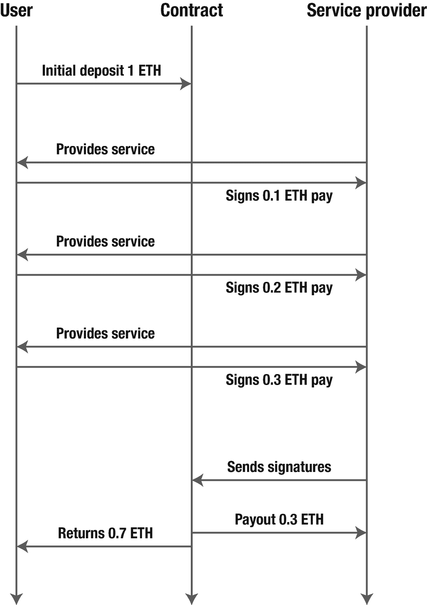
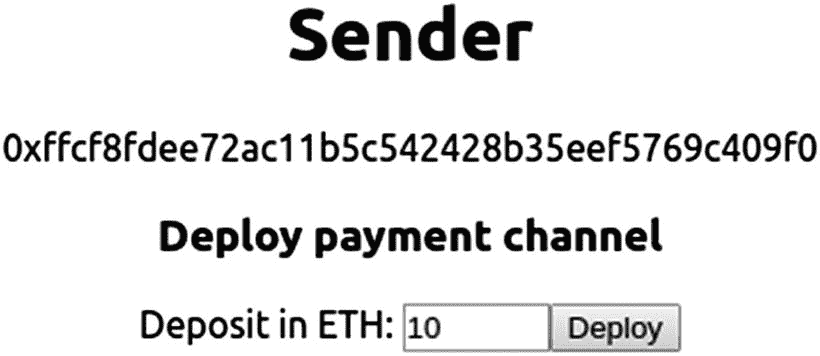
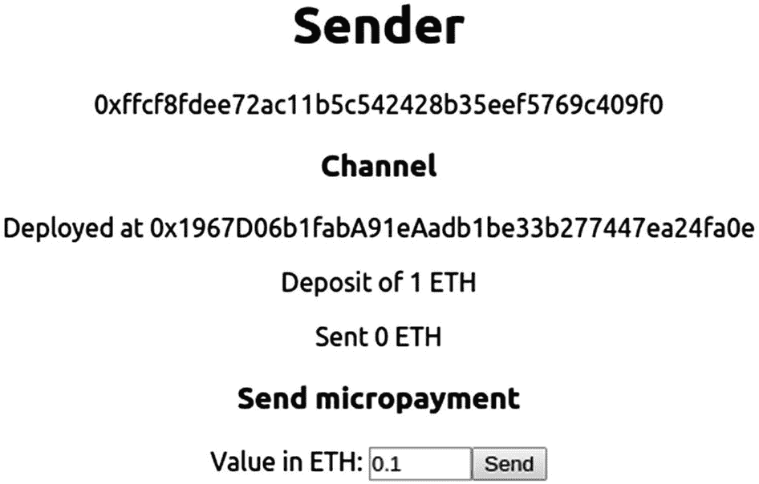
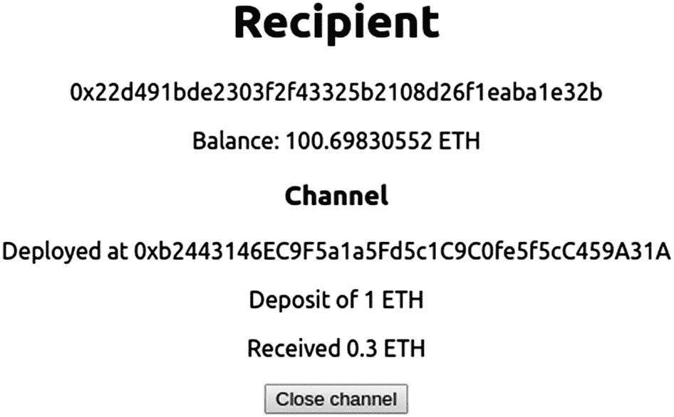
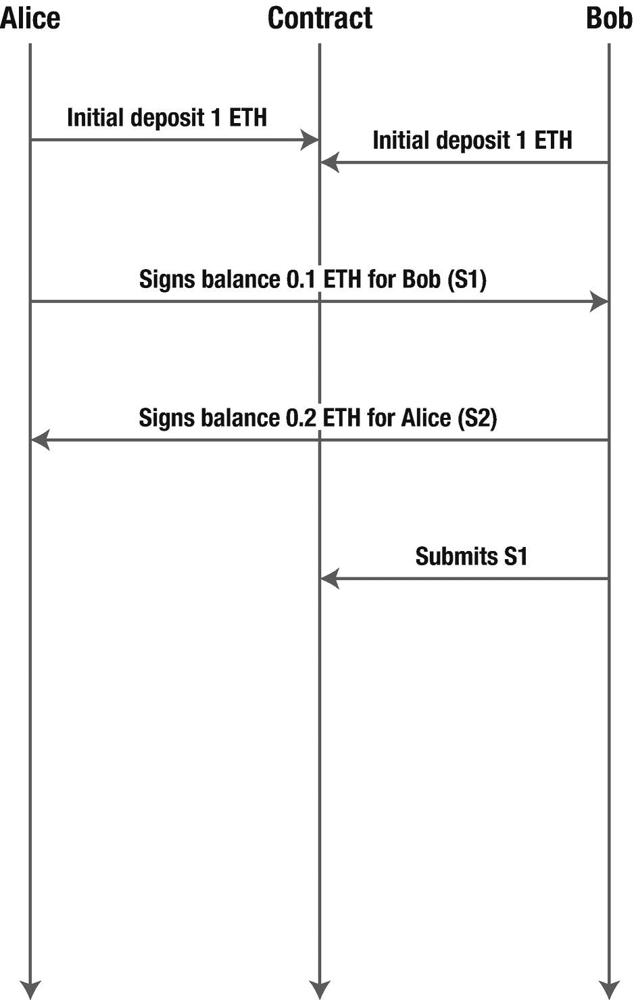
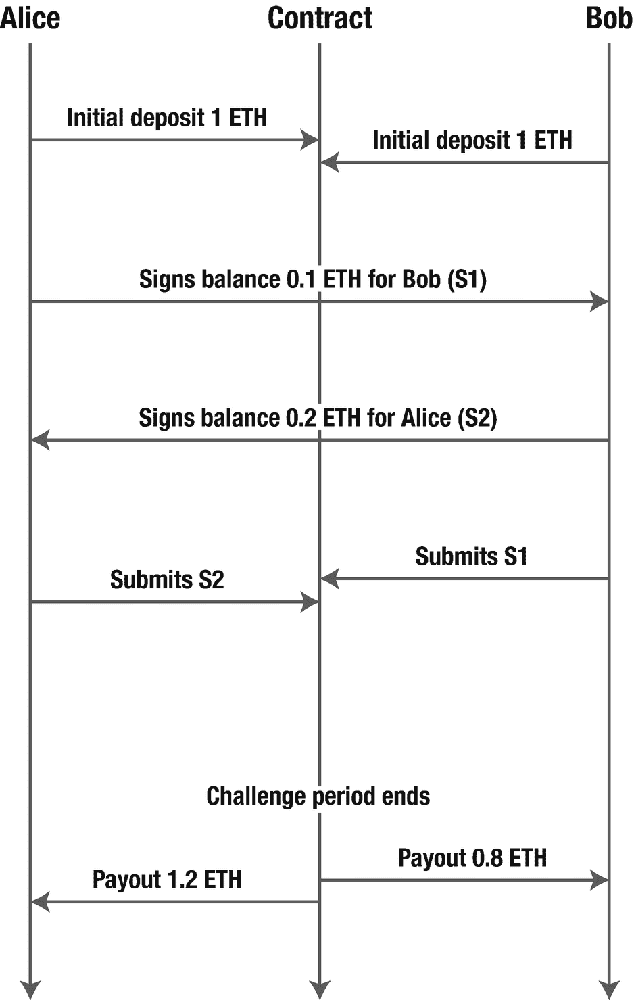

# 8. 可扩展性

在上一章中，我们解决了用户引导的挑战，这是以太坊大规模采用的两大主要问题之一。第二个问题——可扩展性——将是本章的重点。以太坊网络，就目前而言，每秒大约只能处理 15 笔交易——而且这个吞吐量必须由全球所有以太坊应用共享。这导致了单个应用因其使用量激增而堵塞整个网络，以至于在短时间内使所有去中心化应用（dapps）无法使用。在本章中，我们将介绍状态通道和侧链，这是两种被广泛使用的可扩展性解决方案。

## 什么是 Layer 2？

以太坊区块链可视为一个单一的全球数据库，在网络中的每个节点上复制，需要处理每一笔发送的交易。仅仅这一点，在不考虑区块传播时间或工作量证明的情况下，就已经对可处理的交易总量施加了上限。

> *核心限制在于，像以太坊这样的公共区块链要求每一笔交易都由网络中的每个节点处理。(...) 这是设计使然——也是公共区块链具有权威性的部分原因。节点无需依赖他人来告知当前区块链的状态。(...) 这给以太坊的交易吞吐量带来了一个根本性限制：它不能超过我们愿意从单个节点要求的上限。*
>
> ——乔什·斯塔克，《理解以太坊的 Layer 2 扩容解决方案：状态通道、Plasma 和 Truebit》^(¹²³)

但是，如果我们*不*要求每笔交易都通过整个网络运行呢？例如，在一小群参与者之间运行的一组交易，可以在一个独立的网络上处理。只有在特定时期之后，最终的余额才能上传到以太坊主网。

这些并行（或*侧*）网络需要一定的安全保障——否则，我们直接使用常规数据库即可。关键在于，这些网络可以依赖主网作为一个安全的去中心化基础层，在其之上构建新的共识机制。因此，这些扩容解决方案被称为属于*Layer 2*，因为它们并非作为以太坊协议本身的一部分构建，而是构建在其之上。如今，主要有三种类型的 Layer 2 解决方案：

*   `通道`是短期存在的封闭网络，通常在两个参与者之间，他们在其中相互交换多笔交易。每一方都必须通过签署每笔交易来确认。要打开通道，他们首先需要在以太坊网络上的一个智能合约中存入一笔资金。然后，该合约可以在需要时验证他们的签名以执行支付。

*   `侧链`是使用与主网不同的共识算法（如权威证明或权益证明）的并行网络。这些网络通常通过桥接连接到主网，允许用户在其与主链之间转移资产。侧链的一种变体是`Plasma 链`，其中侧链的良好行为可以由主网上的一个智能合约完全强制执行。

*   `外部计算`解决方案并不提供更高的交易吞吐量，但它们确实允许在每个交易中执行更有趣的任务。它们在主网之外运行计算密集型任务——这些任务如果在 EVM 上运行将昂贵得难以承受——然后将结果注入回去。

在本章中，我们将探讨前两种解决方案。如今，有几个团队正在致力于每种方案的实现或新的变体。我们将在过程中提及其中一些方案，但前提是我们先自己尝试每种方案。^(¹²⁴)

## 通道

通道是 Layer 2 扩容解决方案的一个系列，涵盖从单向支付通道到反事实广义状态通道等多种不同变体。它们还可以扩展为完整的通道网络，而非孤立的点对点解决方案。

我们将从`支付通道`开始。^(¹²⁵) 在支付通道中，两个或更多参与者通过在主网上存入初始资金来打开一个通道，然后在通道内进行多笔链下支付。这些支付最终在主网上的一个智能合约中无需信任地进行结算。

### 单向支付通道

支付通道最简单的变体是`单向支付通道`。这里涉及两个不同的参与方：接收方和发送方。通常，一方是随时间提供服务的提供商，它收集多笔支付；另一方是执行这些支付的用户。一个很好的例子是在游戏中进行微交易支付的玩家。

#### 通道如何工作？

假设一个场景，用户需要向一个服务提供商进行多次小额购买。服务提供商提供什么并不重要，关键在于用户需要*在一段时间内向同一个接收方执行多笔支付*，并且提供商需要每笔小额支付的证明才能继续提供服务。

如果每一笔这样的小额支付都作为区块链上的交易来完成，那么累积的交易燃料费相对于实际支付金额来说可能会相当可观。为每笔 20 美分的支付向网络支付 20 美分的手续费并不划算。此外，由于服务提供商在每次支付后都需要一个证明，确认时间会不断给服务带来显著的延迟。

一种解决方案是让一个可信的第三方从用户那里收集一大笔初始存款，并监控正在提供的服务。然后，用户使用他们的私钥签署每一笔`微交易`，确认每笔将要进行的支付。在所有微支付完成后，第三方发起一笔链上交易，其中包括支付给服务提供商的总金额，并将初始存款的剩余部分返还给用户。假设用户和服务提供商都信任这个第三方，这可以将所有微支付减少为网络上的两笔交易：一笔用于存款，另一笔用于支付。

`单向支付通道`是使用智能合约作为可信第三方的此方案实现。当用户部署带有初始存款的支付通道合约时，就被称为向服务提供商`打开`了一个支付通道。用户将每笔微支付作为`签名消息`直接发送给服务提供商。这些消息并非在以太坊网络上发送，而是完全通过一个独立的协议（如 HTTPS）在链下发送。当服务提供商想要兑现时，他们可以将签名消息提交给支付通道合约并收取他们的支付（图 8-1）。



图 8-1

支付通道的流程图。用户首先存入 1 ETH 的初始资金打开通道。每当用户需要向服务提供商进行微支付时，他们改为签署一条带有累计支付金额的消息，并将其在链下发送。当提供商想要兑现时，他们将最新的签名消息提交给合约，并收到他们的支付

在支付通道内，大多数交易完全在链下发生，从用户直接发送给接收方。这就是为什么通道被认为是一种 `Layer 2` 解决方案，构建在以太坊主网（`Layer 1`）之上，同时继承了其许多安全特性。

与 Layer 1 相比，通道具有一些非常有趣的优势。通道打开后，通过其发送的任何交易都没有燃料费，并且一旦发送，它们也可以被认为是即时最终确认的，因为无需等待任何区块被挖出来确认。此外，由于交易在双方之间交换，在提交到区块链之前，它们完全是私密的。

#### 实现单向通道

为了说明单向支付通道的工作原理，我们将从头实现一个（清单 8-1）。我们的支付通道将包含一个`sender`（发送方）和一个`recipient`（接收方），由`sender`存入初始押金，并设定一个预定的结束时间。在此指定结束时间之后，如果`recipient`尚未收取其款项，则允许`sender`提取押金。这一机制是必要的，以防止如果服务提供方从未提交支付消息，用户押金被永久锁定在合约中。

```solidity
// contracts/PaymentChannel.sol
pragma solidity ⁰.5.0;
import "openzeppelin-solidity/contracts/cryptography/ECDSA.sol";
contract PaymentChannel {
using ECDSA for bytes32;
address payable sender;
address payable recipient;
uint256 endTime;
bool closed;
constructor(
address payable _recipient, uint256 _endTime
) public payable {
sender = msg.sender;
recipient = _recipient;
endTime = _endTime;
}
}
```
*清单 8-1* – 单向支付通道合约的定义、状态变量和构造函数。我们将使用 `openzeppelin-solidity@2.1` 中的 `ECDSA` 库来验证合约上的签名。注意构造函数是 `payable` 的，因此 `sender` 可以在部署时存入初始押金。

由于支付通道中的大多数交易发生在链下，我们只需要实现两个方法。第一个方法 `close` 将由服务提供方调用，用于提交带有 payout（支付额）的 `sender` 签名，收取其资金，并关闭通道（清单 8-2）。

### 注意

我们将要求 `sender` 始终为应支付给 `recipient` 的总金额签署消息。这样我们就可以仅向合约提交一条签名的消息，而不必处理多条消息。

此方法仅允许 `recipient` 调用，以防止 `sender` 试图通过签署一条价值为零的消息来提前关闭通道。此外，由于 `sender` 签署的消息总额可能大于通道中现有的押金，我们需要限制转移的金额不超过合约余额。由 `recipient` 决定是否接受一个实际通道无法足额支付的付款单。^(¹²⁶)

向 `recipient` 支付完成后，所有剩余押金将返还给 `sender`。由于此时通道合约不再有用，我们还会销毁合约以获取少量 gas 退款。

```solidity
// contracts/PaymentChannel.sol
function close(
uint256 value, bytes memory signature
) public {
require(msg.sender == recipient);
bytes32 hash = keccak256(
abi.encodePacked(value, address(this))
).toEthSignedMessage();
address signer = hash.recover(signature);
require(signer == sender);
uint256 funds = address(this).balance;
recipient.transfer(funds < value ? funds : value);
selfdestruct(sender); // 销毁合约，并将资金发送给 sender
}
```
*清单 8-2* – 由 `recipient` 关闭支付通道。这需要提交一份由 `sender` 签名的、包含待转移金额的消息。注意，签名的消息中还包含了合约地址，以防止对同一 `sender` 的其他通道进行重放攻击。

需要实现的第二个函数对应不顺利的情况：`recipient` 从未调用 `close` 函数，`sender` 在预定的结束期限后终止合约（清单 8-3）。

```solidity
// contracts/PaymentChannel.sol
function forceClose() public {
require(now > endTime);
require(msg.sender == sender);
selfdestruct(sender);
}
```
*清单 8-3* – 如果 `recipient` 从未兑现，`sender` 可通过强制关闭通道来收回押金。

此实现可以修改为交换 ERC20 代币而非 ETH，从而为`代币支付通道`打开大门。`sender` 无需存入 ETH 押金，而是需要将 ERC20 代币转入通道合约作为押金。这些代币将在通道关闭时再次转出。有关实现，请参阅代码示例中的 `TokenPaymentChannel.sol`。

#### 构建一个支付应用

现在，我们将使用我们的合约来构建一个简单的应用。在该应用中，发送方可以和一个接收方建立支付通道合约，通过直接的链下连接发送多笔微支付，并最终进行结算。和之前的章节一样，我们将使用 `create-react-app` 作为模板。

为了保持应用的简单性，我们将在同一台电脑的同一应用上打开两个浏览器窗口，其中一个充当发送方，另一个充当接收方，并在它们之间建立连接。我们将使用广播频道¹²⁷在两个浏览器窗口之间传递消息。在一个真实的应用中，你可能会想使用不同的方法，例如 WebRTC 数据通道¹²⁸，并配合一个服务器来管理用户之间的发现。

我们将做出另一个简化：我们将直接在 web 应用中管理账户，而不是使用 Metamask。这样做是为了避免在同一台电脑上模拟两个不同账户与同一个应用交互时遇到的困难。当需要从发送方和接收方账户发送交易或签署消息时，我们将直接调用 Ganache。

我们的应用将由两个主要视图构成：一个用于发送方，一个用于接收方，两者都由一个根级 `App` 组件设置。`App` 组件负责设置 `web3` 对象，并将发送方和接收方的地址注入到子组件中。具体实现请参考代码示例中的 `src/App.js`。

我们从发送方视图开始。发送方负责通过部署智能合约并存入初始保证金来开启通道（清单 8-4）。当这一步完成后，我们将通过广播频道通知接收方。我们将使用一个自定义协议进行通信，在该协议中，我们通过 `action` 参数来标识不同的消息类型，此处其值为 `CHANNEL_DEPLOYED`。

```
// src/components/Sender.js
async deployChannel(deposit) {
const { web3, sender, recipient } = this.props;
// 部署合约并存入初始保证金
const from = sender;
const endTime = +(new Date()) +(300 * 1000); // 从现在起 5 分钟
const channel = await PaymentChannel(web3)
.deploy({ arguments: [recipient, endTime] })
.send({ value: deposit.toString(), from, gas: 1e6 });
// 通过广播频道通知接收方
const address = channel.options.address;
this.broadcastChannel.postMessage({
action: "CHANNEL_DEPLOYED", address
});
// 用保证金和通道对象更新发送方状态
this.setState({ channel, deposit, sent: BN(0) });
}
```
清单 8-4
发送方组件功能：部署支付通道合约、为其提供资金，并通知接收方其已部署。`App` 组件将 `web3` 实例以及发送方和接收方地址作为 props 传递。这里，`PaymentChannel` 是一个返回新的 `web3` 合约实例的函数，`BN` 是一个 BigNumber 构造函数

我们将把这个函数连接到一个简单的表单（图 8-2），在表单中我们要求用户选择他们想要存入通道的 ETH 数量。



图 8-2

简单的支付通道部署表单。该表单的代码可以在 `src/components/CreateChannel.js` 中找到

一旦通道部署完成，我们的用户应该能够向接收方发送微支付（清单 8-5）。这涉及到对包含关闭通道后应支付给接收方的 ETH 总额的消息进行签名（而非发送交易）。这些消息通过同一个广播频道，使用不同的 `action` 标识符发送给接收方。

```
// src/components/Sender.js
async sendEth(value) {
const { web3, sender } = this.props;
const { sent, channel } = this.state;
// 计算新的累计已发送 ETH
const newSent = sent.plus(value);
// 用发送方的密钥对其进行签名
const signature = await signPayment(
web3, newSent, channel.options.address, sender
);
// 将消息发送给接收方
this.broadcastChannel.postMessage({
action: "PAYMENT", sent: newSent.toString(), signature
});
// 用新的累计已发送 ETH 总额更新状态
this.setState({ sent: newSent });
}
```
清单 8-5
发送方功能：向接收方发送一笔微支付。每条消息都携带了待支付的 ETH 总额。组件需要跟踪到目前为止已发送的总金额，因此在签名和发送之前，用户选择的微支付金额会被累加到该值上

签名的计算基于待支付总额和通道地址的哈希值（清单 8-6）。在签名中包含通道地址可以防止重放攻击，即防止同一位用户打开的另一个通道中重复使用相同的消息。

```
// src/contracts/PaymentChannel.js
async function signPayment(web3, value, address, sender) {
const hash = web3.utils.soliditySha3(
{ type: 'uint256', value: value.toString() },
{ type: 'address', value: address }
);
const signature = await web3.eth.sign(hash, sender);
return signature;
}
```
清单 8-6
使用 `web3` 对每条微支付消息进行签名¹³⁰

与通道部署类似，该操作也通过一个简单的表单呈现给用户，用户可以在其中选择要转账的金额（图 8-3）。我们还可以展示通道的一些基本统计信息，例如它的地址、总保证金以及到目前为止已承诺的 ETH 数量。



图 8-3

向用户展示通道信息并请求通过通道发送的金额。这些组件的代码可以在 `src/components/ChannelStats.js` 和 `src/components/SendEther.js` 中找到

# 注意事项

为简洁起见，本示例将跳过发送方调用`forceClose`的具体实现。

现在，我们可以将注意力转向接收方视图。在我们的应用中，接收方无需执行任何操作，只需监控发送方的行为，直到他们决定提取资金。我们将首先为发送方的消息安装一个监听器，以便对消息做出反应（代码清单 8-7），并根据消息行为调用不同的函数（代码清单 8-8）。

```
// src/components/Recipient.js
handleMessage(data) {
const action = data.action;
switch (action) {
case "CHANNEL_DEPLOYED":
this.onChannelDeployed(data);
break;
case "PAYMENT":
this.onPaymentReceived(data);
break;
default:
console.error("Unexpected message", data);
}
}
代码清单 8-8
根据消息行为，将任务委派给不同的处理函数
```

```
// src/components/Recipient.js
const bc = new BroadcastChannel('payments');
bc.onmessage = (evt) => this.handleMessage(evt.data);
this.broadcastChannel = bc;
代码清单 8-7
初始化一个新的广播通道，用于接收来自发送方的消息，并添加事件处理程序。此代码是接收方组件构造函数的一部分
```

我们先来看看接收方应如何响应新部署的通道（代码清单 8-9）。除了通过添加通道引用来更新自身状态外，接收方还应检查通道的存款金额，以了解发送方最多能支付多少。接收方还应验证部署的合约确实是支付通道。我们可以通过检查部署的字节码是否与通道的字节码匹配来完成验证（代码清单 8-10）。

```
// src/components/Recipient.js
async function checkBytecode(web3, address) {
const actual = await web3.eth.getCode(address);
const { compilerOutput } = Artifact;
const expected = compilerOutput.evm.deployedBytecode.object;
return actual === expected;
}
代码清单 8-10
检查部署在指定地址上的字节码是否与合约编译产物中的字节码一致。请注意，我们检查的是合约的`deployedBytecode`，而不是`bytecode`，因为后者包含未保存在区块链中的构造函数代码
```

```
// src/components/Recipient.js
async onChannelDeployed(data) {
const { web3 } = this.props;
if (!await checkBytecode(web3, data.address)) {
console.error("Contract bytecode does not match");
return;
}
const deposit = await web3.eth.getBalance(data.address);
this.setState({
channel: PaymentChannel(web3, data.address),
deposit: BN(deposit),
received: BN(0)
});
}
代码清单 8-9
接收方对新部署的通道做出响应：验证通道、检索其存款金额，并更新自身状态。此处，`PaymentChannel`是一个函数，用于返回指定地址处的`web3`合约实例
```

接收方需要处理的另一条消息是支付消息。在这里，我们需要验证发送方的签名，并用最新的转账金额更新接收方状态（代码清单 8-11）。我们还需要保存关联的签名，因为关闭通道时会用到它。

```
// src/components/Recipient.js
onPaymentReceived(data) {
const sent = BN(data.sent);
const received = this.state.received;
if (this.verifyMessage(data) && sent.gt(received)) {
this.setState({
received: sent,
signature: data.signature
});
}
}
verifyMessage(data) {
const { web3, sender } = this.props;
const { channel } = this.state;
const signer = recoverPayment(
web3, data.sent, channel.options.address, data.signature
);
return areAddressesEqual(signer, sender);
}
代码清单 8-11
接收方对支付消息做出响应，更新已收到的 ETH 总额和相应的签名。验证每条消息意味着恢复签名地址并与发送方进行核对，因为无效签名会生成不同的签名者地址。我们还会丢弃任何总支付金额小于最新总额的消息
```

然后，可以使用 `web3` 库中的 `recover` 方法实现恢复发送方签名（代码清单 8-12）。

```
// src/contracts/PaymentChannel.js
function recoverPayment(web3, value, address, signature) {
const hash = web3.utils.soliditySha3(
{ type: 'uint256', value: value.toString() },
{ type: 'address', value: address }
);
return web3.eth.accounts.recover(hash, signature);
}
代码清单 8-12
辅助函数，用于恢复支付消息的签名者。请注意，恢复签名所依据的哈希值计算方式与 `signPayment` 方法中的完全相同
```

接收方界面会展示通道的当前状态、已收到的 ETH 总额，以及随时关闭通道的选项（图 8-4）。



图 8-4

接收方界面，显示当前余额和通道统计信息，包括通过通道发送的 ETH 数量

接收方实现的最后一步是关闭通道：向通道合约发送一笔包含最新金额和签名的交易（代码清单 8-13）。这将结算所有微支付，将累计金额发送给接收方，并将剩余存款退还发送方。

```
// src/components/Recipient.js
async closeChannel() {
const { web3, recipient } = this.props;
const { channel, signature, received } = this.state;
// 发送关闭交易
await channel.methods.close(
received.toString(), signature
).send({ from: recipient });
// 更新接收方余额
const balance = BN(await web3.eth.getBalance(recipient));
this.setState({ channel: null, balance });
}
代码清单 8-13
接收方使用发送方发送的最新金额和签名关闭通道
```

调用此方法后，通道合约应被销毁，接收方应已收到发送方支付的所有微支付总和。

至此，我们已经构建了一个基于单向支付通道的可用应用，现在可以探讨更有趣的通道变体了。

## 双向支付通道

支付通道的另一种场景是两方对等体之间互相交换资金。在这种模式下，没有区分明确的发送方和接收方，通道中的两个参与者都可以发送和接收资金。

参与者角色的这种对称性使得通道实现更加复杂。在这种模型中，允许哪个参与者关闭通道？由于双方是平等的，因此应该都允许关闭，但这会引入一个问题。

假设 Alice 和 Bob 正在进行微交易。某一时刻，Bob 通过通道向 Alice 发送了一笔非常大的支付，但在 Alice 提现之前，Bob 向通道提交了一条旧消息并关闭了通道。问题在于，恶意参与者可能会试图`在对自己有利的旧状态`下关闭通道（图 8-5）。



图 8-5

双向支付通道场景：Bob 试图使用旧状态关闭通道，从而损害 Alice 的利益

### 挑战期

通过在通道关闭时增加一个`挑战期`，可以解决这种情况。当 Bob 请求关闭通道时，通道会进入一个固定时长的“关闭中”状态。在此期间，Alice 可以确认关闭通道，也可以提交一个更新的状态并启动一个新的关闭周期（图 8-6）。

如果她在挑战期内未能向通道发送任何交易，那么通道将关闭，并根据 Bob 提交的状态执行支付。这最后一种情况相当于接收方未提交消息，而发送方强制关闭通道。因此，增加挑战期消除了为通道设定预定义结束时间的必要。

**注**

挑战期是第二层解决方案（不仅仅是通道）中非常常见的机制，我们将在本章稍后部分看到。该机制允许单方面执行某个操作，无需收集所有其他方的确认，但仍可让它们监视并应对不法行为。

这种机制要求智能合约能够识别一条消息是否比另一条`更新`。换句话说，它要求对 Alice 和 Bob 之间交换的消息增加`排序`的概念。在之前的例子中，这使通道能够验证 Alice 的消息比 Bob 的更新，从而丢弃 Bob 的消息而采用 Alice 的。

这种排序是通过在每条消息中增加一个计数器或`nonce`（随机数）来处理的，该数值随着每条发送的消息递增。双方都应验证每条消息的 `nonce` 是否正确递增：如果一方收到一条带有重复 `nonce` 的签名消息，应立即将其丢弃。



图 8-6

延续之前的场景。Alice 发现 Bob 试图提交一个旧状态，于是提交了 `S2` 作为回应。挑战期结束后，合约根据提交的最新状态 `S2` 执行支付。

这种挑战机制有一个重要缺点：通道中的参与方不能离线超过挑战期的时长。在我们的 Alice 和 Bob 示例中，如果通道的挑战期只有几个小时，Bob 完全可以在 Alice 离线时提交对他有利的状态，这样等她重新上线时，通道已经关闭。另一方面，如果挑战期过长，当 Bob 试图合法关闭通道而 Alice 始终不接受关闭时，则可能导致资金被长期锁定。选择合适的挑战期在很大程度上取决于通道部署的具体应用场景。

**注**

作为通道的补充，还有`瞭望塔`服务，它们可以在用户离线且对手方试图非法关闭通道时，代表用户监控通道。这些服务提供商可能会根据通道中锁定的价值，按比例收取费用。

### 一个示例交换

为确保激励机制一致，Alice 会签署一些消息，其中余额向有利于 Bob 的方向变化，反之亦然。一个示例场景（双方初始存款均为 1 ETH）可能如下：

*   Alice 签署了 `0.4 ETH`，即签署余额 `(0.6, 1.4)`^(\(¹³¹\))，`nonce` 为 `1`。
*   Bob 签署了 `0.3 ETH`，即签署余额 `(0.9, 1.1)`，`nonce` 为 `2`。
*   Alice 签署了 `0.1 ETH`，即签署余额 `(0.8, 1.2)`，`nonce` 为 `3`。
*   Alice 签署了 `0.1 ETH`，即签署余额 `(0.7, 1.3)`，`nonce` 为 `4`。

基于这组消息，我们来看几种可能的情景：

*   交换结束时，Bob 合法地选择 Alice 签署的最新消息并用来关闭通道。请注意，他绝无理由选择 `nonce 3` 而非 `nonce 4`，因为 `nonce 4` 的余额对他更有利（这对应于 Alice 支付了一笔款项）。
*   Bob 从未签署另一条消息，也从未关闭通道。作为回应，Alice 上传了最后一条对她有利的消息：Bob 签署的最后一条（`nonce 2`）。她没有理由提交任何她进行额外支付的更新消息。或者，她也可以尝试像从未交换过消息一样关闭通道。
*   Alice 恶意上传 `nonce 2` 的消息，试图关闭通道。Bob 应立即提交一条更新的消息，最好是 `nonce 4` 的那条。
*   Bob 恶意尝试用 `nonce 1` 的消息关闭通道，该消息的余额对他最有利。此时，Alice 应提交 `nonce 2` 的消息作为回应，因为这对她来说更有利。这就回到了前一个情景，Bob 应提交 `nonce 4`。

正如我们所见，通过随着每笔微支付签署递增 `nonce` 的消息，参与者便有了始终提交对手方签署的最新消息的动力。这导致最终使用最新消息来关闭通道。

#### 实现双向通道

现在我们将实现一个示例双向状态通道（参见代码清单 8-14）。在我们的实现中，任何用户都可以通过提供对方签名的消息来请求关闭通道。然后，可以在另一方确认或挑战期结束时执行支付。

我们的通道将追踪每个用户的余额，初始化为他们各自存入的保证金。通道由其中一位用户创建，然后由第二位用户在存入自己的保证金后加入。^(¹³²)

```
contract BidirectionalPaymentChannel {
    using ECDSA for bytes32;
    uint256 constant closePeriod = 1 days;
    address payable user1;
    address payable user2;
    uint256 balance1;
    uint256 balance2;
    uint256 lastNonce;
    uint256 closeTime;
    address closeRequestedBy;
    constructor(address payable _user2) public payable {
        balance1 = msg.value;
        user1 = msg.sender;
        user2 = _user2;
    }
    function join() public payable {
        require(msg.sender == user2 && balance2 == 0);
        balance2 = msg.value;
    }
}
```
*代码清单 8-14 我们的双向状态通道实现的合约变量和初始化函数。我们使用与单向实现相同的 `ECDSA` 库*

完成设置后，我们现在可以查看合约的 `close` 函数（参见代码清单 8-15）。该函数与单向通道中的函数类似，都验证用户对状态签名的有效性。然而，它并非立即执行支付，而是启动挑战（或关闭）周期。

```
function closeWithState(
    uint256 newBalance1, uint256 newBalance2,
    uint256 nonce, bytes memory signature
) public {
    // 检查发送者是否为用户，状态是否合理，以及
    // 在挑战情况下 nonce 是否递增
    require(msg.sender == user1 || msg.sender == user2);
    require(nonce > lastNonce);
    require(newBalance1 + newBalance2 == address(this).balance);
    // 验证签名是否属于另一方用户
    bytes32 hash = keccak256(abi.encodePacked(
        newBalance1, newBalance2, nonce, address(this)
    )).toEthSignedMessageHash();
    address signer = hash.recover(signature);
    require(signer == user1 || signer == user2);
    require(signer != msg.sender);
    // 更新余额、nonce，并启动挑战期
    balance1 = newBalance1;
    balance2 = newBalance2;
    lastNonce = nonce;
    closeRequestedBy = msg.sender;
    closeTime = now;
}
```
*代码清单 8-15 双向状态通道的关闭函数。任何参与者都可以调用，前提是他们提交了由另一方用户签名的消息，且消息包含的 `nonce` 比上次提交的（如果有）更新*

现在我们需要添加一个实际关闭通道的函数，可以由最初未发起关闭的用户调用，或在挑战期结束后被调用（参见代码清单 8-16）。

```
function confirmClose() public {
    require(msg.sender == user1 || msg.sender == user2);
    bool challengeEnded = closeTime != 0
        && closeTime + closePeriod > now;
    require(closeRequestedBy != msg.sender || challengeEnded);
    user2.send(balance2);
    selfdestruct(user1);
}
```
*代码清单 8-16 实际关闭双向支付通道并执行支付*

### 注意

我们在`confirmClose`中使用`send`而不是`transfer`是为了防御攻击。如果`user2`是合约账户而非外部账户（EOA），它可以被编码为在每个传入的交易上回滚。这将使得`user1`永远无法关闭通道并取回初始保证金，因为向`user2`的`transfer`调用会失败并回滚整个交易。通过使用`send`，发送 ETH 可能会失败，但关闭操作允许成功。

我们的实现还需要最后一个函数才能完整。如果其中一位用户从未签署任何消息，另一方需要能够请求关闭，将初始保证金返还给每个用户（参见代码清单 8-17）。否则，最初创建通道的用户的资金可能会被永久锁定。

```
function close() public {
    require(msg.sender == user1 || msg.sender == user2);
    require(closeTime == 0);
    closeRequestedBy = msg.sender;
    closeTime = now;
}
```

*代码清单 8-17 从初始状态启动通道关闭*

请注意，在关闭后，任何用户仍然可以调用`closeWithState`，以防一方恶意尝试在初始状态关闭通道。

### 优化与扩展

我们迄今为止审查的支付通道实现相对简单，但还有很大的改进空间：

*   一种可能的优化是使用**单一合约**来管理所有通道。不为每个通道部署一个合约，而是每个通道实际上是存储在单个支付通道合约中的一个结构体。这大大降低了创建新通道的成本，但代价是增加了复杂性。此外，它将所有参与者的资金集中在一个合约中，为漏洞打开了大门，攻击者可能因此同时耗尽所有通道的资金。

*   通道也可以修改为可重复使用。在我们的实现中，我们要求关闭通道才能执行支付，但我们可以在执行支付后保持通道开放。这使得部分资金可以被提取用于其他应用，而无需销毁通道合约。

*   在双向通道的情况下，可以通过添加一条由双方签名的特殊消息来优化通道关闭，该消息表示在某个状态下达成一致并最终确定。这条消息可以由任何参与者上传，并且不需要第二笔交易来确认关闭，也无需经历挑战期。

*   通道的一个有趣扩展是增加参与者数量。虽然在我们所有的示例中，我们探讨的都是两个成员之间的点对点通道，但可以涉及更多用户。随着用户数量的增加，协调可能变得更加复杂，因为消息可能需要由通道中的多个参与者签名才能被视为有效。

### 状态通道

支付通道可以被视为更通用的通道类别——**状态通道**——的一个特例。状态通道允许用户交换关于*任何状态*的消息，而不是让两方交换关于待支付余额状态的签名消息。

例如，一个简单的游戏可以通过状态通道进行。玩家可以签署关于游戏状态的消息，比如棋盘上棋子的位置。移动棋子是通过发送带有移动信息或棋盘新配置的签名消息来完成的。

状态通道通常涉及初始保证金和支付，就像支付通道一样。决定支付的条件由游戏定义，并可以通过智能合约在链上强制执行。

#### 将游戏编码为状态通道

回合制游戏是状态通道的绝佳用例，因为它们具备一些有用的特性。首先，所有游戏状态都可以在消息之间安全地交换，并在必要时上链处理。其次，在任何时间点，都能明确定义下一步该由哪位玩家行动，且不会因谁先行动而产生争议。此外，解决争议只需要游戏状态本身，因为它们不依赖任何外部状态。^(¹³³)

让我们以井字棋游戏为例。游戏状态可定义为一个 3x3 矩阵，每个单元格有三种可能的值：圆圈、叉号或空。游戏的规则以及获胜（或平局）条件都很容易编码。

在这里，玩家通过交换消息来传递自己的落子，每次落子只能放置一个自己的棋子。然而，与支付通道不同，每次落子（即每条消息）对*发出（签名）该消息的玩家有利*，而不是对接收方有利。这带来了机制上的重大转变：玩家不再有动力提交对手发出的最新状态，而是提交*自己*做出的最后一步行动。让我们看一个例子：

*   爱丽丝在中间下 X，因此她签名了一条只有中心位置是 X 且随机数为 1 的消息，并将其发送给鲍勃。
*   鲍勃在右中位置下 O，签名随机数 2，发送给爱丽丝。
*   爱丽丝在右上位置下 X，签名随机数 3，发送给鲍勃。
*   鲍勃在左中位置下 O，签名随机数 4，发送给爱丽丝。
*   爱丽丝在左下位置下 X 获胜，签名随机数 5，发送给鲍勃。

此时棋盘将如下所示，下标数字表示每次落子的轮次：

|   |   | X[3] |
|---|---|---|
| O[4] | X[1] | O[2] |
| X[5] |   |   |

最后一步之后，鲍勃应该签名爱丽丝发送的消息并将其发回给她，这样她就可以上链并领取奖励。然而，如果鲍勃输不起，他可能会拒绝这样做。在这种情况下，爱丽丝必须能够将她从鲍勃那里收到的最后签名状态（4）连同她的获胜落子一起上链，并让状态通道验证她确实获胜了。请注意，这要求**状态通道必须能够验证她的落子确实是有效且获胜的落子**。

鲍勃也可能简单地拖延游戏。例如，当他收到爱丽丝的消息 3 时，他注意到自己快要输了，于是选择停止游戏。在这种情况下，爱丽丝必须能够将鲍勃签名的最后状态（2）以及她后续的落子（3）一起上链，并*挑战*鲍勃，让他行动。如果他在规定时间内没有在链上响应，那么状态通道应宣布爱丽丝获胜。这里，我们使用挑战期不仅是为了关闭通道，也是为了强制执行落子。

正如我们所说，状态通道必须能够在链上*验证*落子是否有效。让我们看一个场景，这种需求变得显而易见：鲍勃没有在收到爱丽丝的获胜消息 5 时拖延，而是决定忽略该消息。然后他用一个虚假的状态在链上挑战她行动。他拿着爱丽丝之前签名的状态（3），向合约提交了一个新状态，其棋盘无效如下：

| X[3] |   |   |
|---|---|---|
|   | X[1] | O[2] |
|   |   | O[4] |

如果状态通道合约无法验证他的行动无效（他改变了 X[3] 的位置），那么爱丽丝将被迫在链上基于这个无效棋盘做出回应。

### 备注

另一种方案是让状态通道合约默认接受所有状态转换，但接受某个行动无效的证明。在某些情况下，验证一个转换无效的证明可能比验证转换本身要容易得多。国际象棋就是一个很好的例子：验证“将死”的燃料费用可能高得令人望而却步。一种解决方法是允许任何玩家声称“将死”，而让对手通过提交任何有效行动来证明并非如此。^(¹³⁴) 这种模式只是另一种形式的挑战-响应，并遵循智能合约的“*验证，而非计算*”原则。

因此，状态通道本质上比普通的支付通道更复杂，因为它们需要包含所玩游戏本身的逻辑来验证状态转换。

### 备注

为支付通道描述的大多数优化也适用于状态通道。例如，两个参与者可以在一个状态通道上运行多个游戏实例，而不必在每次想要重赛时都要关闭和打开新的通道。此外，状态通道可以设置为接受 ERC20 代币甚至非同质化的 ERC721 代币作为押金——想象一下将一个奖杯表示为数字收藏品！

## 广义状态通道

正如我们所看到的，特定游戏的状态通道有两个主要职责：管理通道本身以及验证游戏的状态转换。由于这两个职责的逻辑相互交织，这使得实现变得更加复杂。同时，这也导致状态通道合约更加昂贵，因为它们需要同时包含通道和游戏两方面的逻辑。

这促使了*广义状态通道*框架的发展。广义状态通道是一种管理用户存款，并允许在通道上逐步*安装*新游戏或应用程序的通道。这有效地将状态通道逻辑与应用程序逻辑解耦。

> *广义状态通道将区块链应用的所有链上状态组件转移到链下。广义状态通道框架并非要求每个应用开发者从头构建整个状态通道架构，而是一种将状态存入一次，之后便可供任何应用或应用集使用的框架。*
> 
> — Jeff Coleman, Liam Horne, 和 Li Xuanji, “反事实：广义状态通道” ^((135))

这为通道的复用开辟了新的层次。用户现在可以在同一个通道上运行一个游戏的多个实例，甚至玩多个不同的游戏，从而在单个通道内创建多个子通道。此外，我们还可以在这些子通道之间建立依赖关系，例如，仅在解决一组游戏子通道后才触发一个支付通道。

不同的团队正在大力开发广义状态通道解决方案，尽管各方正在努力制定一个通用标准以提供一定程度的互操作性。其中一些实现，例如来自 Counterfactual 团队的那个，依赖于*反事实*行动的概念。在这里，术语*反事实*用来指代通道中的任何参与者本可以在链上采取但实际上并未采取，并导致参与者好像它真的发生了那样行动的行为。^((136)) 让我们看看这意味着什么。

在我们的井字棋状态通道中，如果存在一个由 Alice 和 Bob 共同签名、证明她赢得了游戏的状态，我们可以说 Alice *反事实地*赢了。两个玩家都知道，他们中的任何一方都可以随时将这个获胜状态提交给链上的智能合约来触发支付。然而，他们也可以决定继续玩第二局，因为他们知道 Alice 已经赢了第一局，并且该状态可以在需要时随时提交到链上。换句话说，玩家们正在处理反事实状态。

广义状态通道中的应用可以*反事实地安装*：如果所有参与者都表现良好且从未发生争议，那么应用合约实际上无需被创建，整个游戏就可以在链下解决。这也被称为合约的*反事实实例化*：一个可以部署但实际并未部署的合约。

任何玩家都可以上链并强制执行某个特定动作这一事实，足以促进良好的链下行为——只要辅以对恶意玩家（那些强迫对手浪费 Gas 上链的玩家）的一系列惩罚措施。

总而言之，反事实广义状态通道提供了一个有趣的框架，它最大限度地减少了链上操作的数量，从而降低了在以太坊网络上每次执行操作时产生的延迟和 Gas 费用。另一个额外的好处是，它为参与者的行动提供了一层隐私保护：如果除了存款和支付之外没有其他交易上链，那么只有参与者知道通过状态通道交换了哪些消息。

### 通道网络

对于在固定的小规模参与者（通常是两个）之间结算支付或状态，通道是一个有用的解决方案。然而，当我们需要连接一个动态的成员集合时，这个方案就显得力不从心了：对于每个我们想要进行交易的用户，我们都需要上链并打开一个新的通道。

为了解决这个问题，有一些协议用于在两个对等点之间建立*虚拟通道*，这些协议利用了经过多个中介的通道路径。这有效地从一个点到点的连接构建了一个网络，只要任意两个参与者之间存在一条有效路径，他们就可以相互连接，就像互联网本身一样。

### 注意

本节涵盖当前正处于大量研究和持续开发中的主题。如果您正在考虑在状态通道网络之上进行构建，请将其作为进行您自己最新研究的起点。

网络中最简单的构建再次来自比特币，即*多跳支付通道*。这种方法允许通过一个或多个中介安全地路由支付。例如，Alice 可以向与她建立了支付通道的中介 Ingrid 发送付款，然后让 Ingrid 将其转发给 Bob（假设 Ingrid 也与 Bob 有一个通道）。由于这些通道的建立方式，^((137)) Ingrid 无法将这些资金据为己有。

这种类型的通道直接引向一种简单有效的网络布局，即*星型通道网络*，其中多个客户端连接到一个充当所有客户端中介的单一中心枢纽。这样，用户只需与枢纽建立一个通道，就可以与网络上的任何人进行交易。另一方面，它的缺点是中心化，并且要求枢纽保持在线。

还有一些项目正在研究更有趣的网络布局，例如受比特币闪电网络启发的 Raiden 网络。^((138)) 这些网络的最终目标是允许任意两个参与者以无需信任的方式建立一个共享通道，通常称为*虚拟通道*或*元通道*。这些通道无需仅仅是支付通道，它们可以是完整的广义状态通道，并且可能在每次交换中无需中介的主动参与即可运行。

## 侧链

在最基本的版本中，*侧链*是一个并行的以太坊网络，它可能运行不同的共识算法，例如*权威证明*，并通过*桥*与主网络相连。由于在规模较小的网络上运行，侧链能够实现比以太坊主网络高得多的吞吐量。

### 注意

虽然侧链技术上可以使用工作量证明，但这是极不安全的。请记住，工作量证明依赖于攻击者无法生成比网络其余部分更多的算力。由于侧链相比主网络往往规模较小，其难度也相对较低，这使得攻击者更容易对其发动攻击。这就是为什么大多数侧链使用一个封闭的矿工或验证者集合。

### 权威证明

在权威证明（简称 PoA）中，存在一组预定义的节点，它们作为区块的*验证者*，负责向网络中添加新区块。验证者相当于 PoW 中的矿工，其作用是添加新区块。每隔一定秒数，这些验证者会轮流提议一个新的区块。这些区块会被广播给其他验证者，并且需要得到其中大多数验证者的批准，才能被添加到区块链中。验证者集合可以随时间变化，一些验证者可能被投票移除，新的验证者则被允许加入。

区块的广播、批准和达成共识的方式取决于所使用的具体*共识*算法。虽然存在许多不同的共识算法，例如 Clique、^(¹³⁹) Aura、^(¹⁴⁰) Raft、^(¹⁴¹) 或 Istanbul BFT，^(¹⁴²) 但它们都遵循前面概述的基本框架。不同的算法可能针对恶意行为者或节点断连提供不同的保障，性能也各不相同。

侧链的另一个组成部分是与主网络的连接，通常称为*桥梁*。桥梁是一种机制，允许用户在主链和侧链之间转移资产。例如，一个简单的桥梁可以让用户将其特定 ERC20 资产从主网络转移到侧链，具体做法是让用户在特定的主网合约中锁定其资金。侧链验证者会监控这个合约，一旦检测到用户在主链上锁定资金，便在侧链中创建相应的资产。我们将在本章后续部分实现这种机制。

#### 安全与信任

简易版 PoA 侧链的安全性完全依赖于其验证者。如果大多数验证者合谋，他们可以有效地窃取所有锁定在侧链中的用户资金。因此，验证者集合必须由多个不同的参与方组成，而非由一个组织控制，这一点至关重要。只有当用户信任大多数验证节点时，才应该信任 PoA 网络。

为了抑制此类恶意行为，一些网络采用权益证明而非权威证明。在这种机制下，验证节点需要存入（质押）大量资金。如果证实其行为恶意，他们的质押金将被削减作为处罚——尽管具体如何执行削减是另一个问题。

重要的是，验证者通过攻击网络可能获得的收益必须低于其可能损失的质押金，以保持激励机制的一致性。目前存在多种不同的权益证明方法。然而，从用户的角度来看，体验与在权威证明网络中操作非常相似。

### 注意

鉴于恶意验证者可能窃取用户资金，侧链的安全保障比主链要差。这一事实使得侧链在某些定义下**不**被视为二层网络解决方案。不过，存在一些构造（例如我们稍后将介绍的 Plasma）允许用户通过在主网合约上举报违规验证者的行为来保护自己的资产。

#### 部署我们自己的链

为了说明 PoA 网络是如何工作的，^(¹⁴³) 我们将使用 Geth 以太坊节点客户端手动搭建一个。^(¹⁴⁴) Geth 不仅可以在以太坊工作量证明主网络上运行，也可以配置为在采用 Clique 共识算法（例如 Rinkeby 测试网）的 PoA 网络中运行，并充当验证节点。

让我们首先设置三个矿工节点，它们都将运行在同一台计算机上。我们将为每个矿工创建新账户。为方便起见，我们将为所有账户设置相同的密码，因此创建一个文件 `password.txt`，其中包含一个用作密码的随机字符串。然后，为三个矿工分别运行以下命令来创建地址，记得将 `miner1` 替换为 `miner2` 和 `miner3`。确保 `password.txt` 文件位于运行命令的路径下。

```
$ geth --datadir miner1 --password password.txt account new
> Address: {8305ccac...58269a7d}
```

你会得到三个不同的地址，我们将把它们设置为此网络的验证者（请务必记下它们）。现在，我们将为网络创建一个*创世区块*。创世区块是网络的配置信息，包括授权验证者集合、共识引擎、初始余额、区块 gas 限制等。在 Geth 中，这些信息被编译成一个 JSON 配置文件，用于引导每个节点。

Geth 包含一个名为 `puppeth` 的工具，可以简化此类文件的创建过程。只需在控制台中运行 `puppeth`，然后回答提示的问题即可（列表 8-18）。给你的网络命名，创建一个新的创世区块，使用区块间隔为 5 秒的 clique 权威证明，并选择你的矿工作为“允许封印的账户”。你还应该选择第四个账户作为预充值账户，或者选择一个现有的验证者来持有网络的初始以太币。

```
$ puppeth
Please specify a network name to administer (no spaces, hyphens or capital letters please)
> mysidechain
What would you like to do? (default = stats)
1\. Show network stats
2\. Configure new genesis
3\. Track new remote server
4\. Deploy network components
> 2
What would you like to do? (default = create)
1\. Create new genesis from scratch
2\. Import already existing genesis
> 1
Specify your chain/network ID if you want an explicit one (default = random)
> 1212
```

*列表 8-18 使用 Geth 的 puppeth 配置向导为 id 为 1212 的 PoA 网络设置创世区块的片段。完成上述步骤后，你将得到一个新的 mysidechain.json 创世文件。*

在启动我们的 Geth 节点之前，我们将设置一个*引导节点*。引导节点是网络中唯一目的是帮助发现其他节点的节点。我们将用它来简化矿工节点之间的通信。

要设置引导节点，我们首先需要创建一个引导密钥，并用它来生成引导节点的*enode 地址*（列表 8-19）。Enode 地址是去中心化网络中节点的唯一标识符，后跟可找到该节点的 IP 地址和端口。然后，我们将使用生成的引导密钥启动引导节点，并让它监听本地的 `30100` 端口。^(¹⁴⁵)

```
$ bootnode -genkey boot.key
$ bootnode -nodekey boot.key -writeaddress
> c190f2af...ee34b40a
$ bootnode -nodekey boot.key -addr :30100
```

*列表 8-19 生成引导密钥并运行引导节点*

### 注意

我们不需要为引导节点使用创世配置文件，因为引导节点无需了解网络是否运行工作量证明或权威证明，也不关心验证者是谁。它只需知道节点所在位置，以便将信息分享给网络。

现在我们已经启动了一个引导节点并准备好了创世配置文件，是时候真正启动网络了。在三个不同的终端中，启动三个不同的 Geth 验证节点（Listing 8-20），配置它们挖掘（即封印）新区块，并在本地通过 HTTP 暴露 JSON-RPC API。

```
geth \
--datadir miner1 \
--port 30201 \
--rpc --rpcaddr localhost --rpcport 12001 \
--rpcapi 'eth,personal' \
--networkid 1212 \
--gasprice 10000 \
--unlock 8305ccac...58269a7d \
--password password.txt \
--mine \
--bootnodes 'enode://c190f2af...ee34b40a@127.0.0.1:30100'
```
Listing 8-20
使用之前生成的创世配置和引导节点 ID 启动 Geth 验证节点。在三个不同的终端中各运行一次此命令，每次对应一个验证节点，并更改解锁地址、数据目录、端口和 RPC 端口

我们的网络现在应该正在运行，每 5 秒封印一个新区块。查看三个验证节点的日志，以了解它们的进展。

现在我们可以启动一个新的客户端节点并连接到现有网络（Listing 8-21）。请记住，尽管验证节点集合有限，但网络仍然是公开的，任何节点都可以连接。我们可以使用其控制台检查最新区块编号如何每 5 秒增长一次，运行 `web3.eth.blockNumber`。

```
$ geth \
--datadir node1 --port 30204 \
--rpc --rpcaddr localhost --rpcport 12004 \
--rpcapi 'eth,personal' \
--networkid 1212 \
--bootnodes 'enode://c190f2af...ee34b40a@127.0.0.1:30100' \
console
```
Listing 8-21
启动一个新节点加入网络，并启用控制台。注意，我们没有以任何方式验证这个新节点，因为网络是公开的，任何人都可以加入

现在让我们将这个网络与一个现有网络（如 Rinkeby）连接起来。

### 构建一个桥接

我们将构建一个简单的桥接，完全依赖于验证者账户，使用一个部署在主网络和侧链上的合约，以及每个验证者运行的一个脚本。在这个模型中，用户进入侧链然后退出的步骤如下：

1. 用户将资金转移到主网上的桥接合约。
2. 桥接合约保留资金并发出一个事件。
3. 验证者注意到该事件，每个验证者调用侧链上的桥接合约，请求解锁相同数量的资金。
4. 用户在侧链中获得资金并使用它们进行操作。
5. 一旦用户想要退出侧链，重复相同的过程：将侧链资金转移到侧链桥接合约，由验证者在主网桥接合约上解锁它们。

我们将从构建桥接合约开始。该合约有两个主要职责：(1) 接收并锁定用户资金，(2) 根据验证者的请求解锁资金。注意，我们将在每条链上部署合约的两个实例。一条链上的锁定功能对应于另一条链上的解锁功能，反之亦然。

### 注意

在此示例中，我们构建了一个接收 ETH 并在另一端发放侧链原生货币的桥接。然而，我们也可以构建在主链上接受特定 ERC20 代币甚至非可替代的 ERC721 资产的桥接。

首先，桥接合约需要知道验证者的地址（Listing 8-22）。我们还需要指定需要多少验证者同意才能释放用户资金。在我们有三个验证者的场景中，如果其中一个失效，我们只需两个验证者同意即可释放资金。

```
pragma solidity ⁰.5.0;
contract Bridge {
    uint256 threshold;
    mapping(address => bool) validators;
    constructor(
        uint256 _threshold,
        address[] memory _validators
    ) public payable {
        threshold = _threshold;
        for (uint256 i = 0; i < _validators.length; i++) {
            validators[_validators[i]] = true;
        }
    }
}
```
Listing 8-22
桥接合约的定义，使用验证者地址进行初始化

注意我们将构造函数设为可支付。在侧链部署合约时，我们需要向该合约注入我们允许用户从主网络（本例中为 Rinkeby）转移到侧链的最大 ETH 数量，以便合约在验证者提示时可以解锁这些资金。

现在我们来编写锁定函数（Listing 8-23），这个函数相当简单。我们需要接收发送者的资金，允许他们指定桥接另一端的接收者地址，并发出一个事件。我们将为每个锁定操作分配一个自增 ID，以便验证者在另一端解锁时可以引用该 ID。

```
event Locked(uint256 id, uint256 amount, address recipient);
uint256 lastId;
function lock(address recipient) public payable {
    require(msg.value > 0);
    emit Locked(++lastId, msg.value, recipient);
}
```
Listing 8-23
桥接合约的锁定函数

最后但同样重要的是，我们来编写解锁函数（Listing 8-24）。该函数将由桥接另一端的验证者调用。每个验证者应授权解锁与另一端锁定操作对应的资金。请记住，由于桥接两端之间没有链上通信，验证者有责任将正确数量的资金解锁到用户请求的地址。

```
mapping(uint256 => Request) requests;
struct Request {
    uint256 amount;
    address payable recipient;
    bool paid;
    uint256 approveCount;
    mapping(address => bool) approvedBy;
}
event Unlocked(uint256 id, uint256 amount, address recipient);
function unlock(
    uint256 id, uint256 amount, address payable recipient
) public {
    Request storage request = requests[id];
    require(validators[msg.sender]);
    require(!request.approvedBy[msg.sender]);
    require(request.recipient == address(0)
        || request.recipient == recipient);
    require(request.amount == 0 || request.amount == amount);
    request.approveCount++;
    request.approvedBy[msg.sender] = true;
    request.recipient = recipient;
    request.amount = amount;
    if (request.approveCount >= threshold && !request.paid) {
        request.paid = true;
        recipient.transfer(amount);
        emit Unlocked(id, amount, recipient);
    }
}
```
Listing 8-24
代币桥接的解锁函数。当验证者首次请求解锁时，我们将创建一个新的解锁请求，并在每次再次调用时记录一次批准。当达到所需批准数量时，资金即被解锁

### 注意事项

此实现允许恶意验证者阻止用户资金被解锁。验证者可以向桥合约发送针对即将到来请求 ID 的虚假解锁请求，从而发起垃圾攻击。这样一来，当诚实验证者真正尝试执行解锁请求时，参数（如金额或接收方）将不匹配，操作将失败。我们将忽略此攻击，因为该桥仅用于说明基本用法。尽管如此，这提醒我们，即便最简单的实现也可能隐藏安全问题，您应始终使用经过审核和审计的合约。

现在，我们可以使用之前定义的验证者集合并选择两个批准作为解锁阈值，在两个网络上部署此合约（清单 8-25）。请记住，在侧链上部署时，也要向合约转入大量资金，以便在收到请求时有资金可解锁。

```
const Web3 = require('web3');
const Artifact = require('../artifacts/Bridge.json');
const web3 = new Web3(PROVIDER_URL);
const abi = Artifact.compilerOutput.abi;
const data = Artifact.compilerOutput.evm.bytecode.object;
const Bridge = new web3.eth.Contract(abi, null, { data });
const bridge = await Bridge.deploy({
arguments: [THRESHOLD, VALIDATORS]
}).send({
from: FROM, gas: 1e6, gasPrice: GAS_PRICE, value: VALUE
});
console.log("Bridge deployed at", bridge.options.address);
```
清单 8-25
桥合约的部署脚本。请使用不同的 PROVIDER_URL 运行两次：一次用于 Rinkeby 以太坊网络，另一次用于侧链

最后，我们需要设置每个验证者将运行的监控脚本（清单 8-26）。这些脚本将监控一个网络中的桥合约，监听 `Locked` 事件，并在另一侧执行相应的解锁操作。

```
const Web3 = require('web3');
const Artifact = require('../artifacts/Bridge.json');
const abi = Artifact.compilerOutput.abi;
const remoteWeb3 = new Web3(REMOTE_PROVIDER_URL);
const localWeb3 = new Web3(LOCAL_PROVIDER_URL);
const remoteBridge = new remoteWeb3.eth.Contract(abi, REMOTE);
const localBridge = new localWeb3.eth.Contract(abi, LOCAL);
remoteBridge.events.Locked().on('data', function(e) {
const { id, amount, recipient } = e.returnValues;
localBridge.methods
.unlock(id, amount, recipient)
.send({ from: VALIDATOR, gas: 1e6, gasPrice: GAS_PRICE });
});
localBridge.events.Locked().on('data', function(e) {
const { id, amount, recipient } = e.returnValues;
remoteBridge.methods
.unlock(id, amount, recipient)
.send({ from: VALIDATOR, gas: 1e6, gasPrice: GAS_PRICE });
});
```
清单 8-26
每个验证者要运行的监控脚本。注意我们创建了两个 web3 实例：一个连接到主网络，用于监听桥远端的事件；另一个连接到本地网络，用于执行解锁操作。然后我们做相反的操作，允许资金从侧链回到主网络。

现在，我们可以在每个验证节点（或者至少两个节点）上运行此脚本。运行之后，尝试调用 Rinkeby 端桥的 `lock` 函数。几秒钟后，您的资金就可在侧链的指定地址上使用了。

在实际应用中，您需要决定向用户暴露多少这种复杂性。正如我们在第 7 章中所见，用户入门已经够麻烦了，再增加一个需要从一网络向另一网络发送资金的步骤并不是一个好主意。

然而，您实际上可以利用特定于应用的侧链来改进用户入门体验。您可以直接在侧链上为用户的初始账户充值，或者构建一个病毒式邀请机制，让现有用户直接在更便宜、更快的侧链上邀请新用户。这样，桥仅用于那些希望将价值从主网络转移出去或转移进来的高级用户，但对于以太坊新手来说，应用只是流畅快速地运行，而无需了解其背后的支撑机制。

上一章已经提到的一个很好的例子是 Burner 钱包^(¹⁴⁶)。该钱包运行在一个权威证明侧链^(¹⁴⁷)上，由四个不同的团队担任验证者。用户通过接收一个带有预充值账户的链接快速入门，并由于低 gas 成本和 5 秒出块时间而轻松与他人交易。对于更高级的用户，可以选择将资金转移到主以太坊网络，甚至从他们的主网账户为 Burner 钱包充值。

### 等离子链

截至撰写本文时，最先进的第二层解决方案是等离子链^(¹⁴⁸)，最初由 Vitalik Buterin 和 Joseph Poon 于 2017 年设计。

等离子链与侧链的不同之处在于，其安全性可以由主链（在等离子术语中称为*父链*）强制执行，因此不单纯依赖侧链的共识机制。这意味着，如果子链上的验证者集合（称为*等离子操作者*）行为不端，任何用户都可以构建加密证明并将其提交给主链上的智能合约（称为*根合约*）。如果没有不当行为，子链上的交易将以侧链典型的低 gas 成本和低延迟进行。

然而，这种额外的安全性是有代价的。每当用户想要退出子链（即将其资产转回主链）时，他们必须经历一个*挑战期*，类似于我们在状态通道中看到的情况。如果恶意验证者创建了一个伪造区块，在其中窃取了用户的资产，并利用它来获取主链上的这些资产，用户可以在挑战期内提交欺诈证明并收回其资产。因此，退出等离子链并非即时完成，用户需要等待一段时间^(¹⁴⁹)。

此外，由于智能合约需要能够处理子链上一组交易是否合法，子链上允许的操作不能过于复杂。特别是，截至撰写本文时，尚无等离子实现支持任意智能合约，仅提供用户之间交换资产的手段。这方面的研究是在*广义等离子*实现下进行的。

另一方面，等离子链被设计为具有树状结构。等离子链的父链可以是*另一个*等离子链，通过简单地将等离子链嵌套组合，即可实现大规模扩展。这意味着，如果某个特定应用的等离子链变得过于拥挤，它可以简单地生成新的子链并将用户集群迁移到其中。

值得一提的是，等离子本身不是一个规范，而是一个构建可扩展第二层基础设施的框架。这导致不同团队开发出许多不同风格的等离子，例如最小可行等离子、等离子现金、等离子借记或等离子初级版^(¹⁵⁰)。很可能在本书送到您手中时，这方面会有新的重大发展。

## 摘要

像 `Bitcoin` 或 `Ethereum` 这样的公共区块链，传统上为了去信任化和安全性而牺牲了性能。虽然目前有多项工作致力于构建 `Ethereum 2.0`（其中包括有助于网络扩容的分片机制），但有趣的是，我们看到许多解决方案正在现有基础设施之上萌芽，以解决可扩展性问题。

本章介绍的一些解决方案，例如早期版本的 `plasma` 或 `state channels`，目前已准备就绪并投入生产，帮助现实应用突破主 `Ethereum` 网络的性能极限。

这些解决方案不仅能让你的应用获得更高的交易吞吐量，还能用于整体上提供更好的用户体验。如果双方行为得当，`Channels` 可以为点对点交易提供即时最终性，而无需等待数十次确认。`Sidechains` 则能提供远低于主网络的可靠出块时间，并且燃料费显著更低。

这些技术甚至可以组合使用：你可以在侧链中的各方之间设置 `state channels`，甚至将通道本身作为 `plasma chain` 中实际交易的资产。这里的可能性是无限的。

如何利用这些解决方案，并将其呈现给用户（或对用户隐藏），将取决于你正在构建的内容。请记住用户对你的应用的需求，并利用你手头可用的构建模块，来创造最佳体验。

编码愉快！

### A

- `Application Binary Interface (ABI)`
- `Application`
- `local accounts`
- `encrypted keystores`
- `password`
- `private key`
- `XSS attacks`
- `local wallet`
- `Ethereum account`
- `private key`
- `transaction object`
- `web3 library`
- `mnemonics`
- `Archive nodes`
- `Auxiliary function`

### B

`Bidirectional payment channels`
`challenge period`
`exchange, sample based on messages`
`deposit of 1 ETH`
`implementation`
`optimizations/extensions`
`bip39 library`
`Bitcoin`
`Bitcoin blockchain`
`Bitcoin to Ethereum`
`gas fees`
`smart contract`
`Blockchain`
`advantages`
`DAO`
`permanence`
`piece of data`
`smart contracts`
`trusted third party`
`blocks`
`chain of hashes`
`consensus algorithm`
`DApps`
`Decentralized applications`
`decentralized finance`
`defined`
`federated/consortium`
`limitations`
`transaction throughput`
`user onboarding`
`peer-to-peer network`
`reorganization`
`throughput`
`transaction`
`Boolean literals`
`Bridge mechanism`

### C

`Channels`
`Contract upgradeability`
`CREATE2 instruction`

### D

`DApp`
`build application`
`See` `Decentralized applications`
`counter`
`development toolchain`
`client-side-only javascript`
`ganache`
`Solidity compiler`
`requirements`
`smart contract`
`See` `Smart contract interaction`
`web3 browser`
`web3-enabled web browser`
`DApp, build`
`contract interface ABI`
`Counter contract`
`web3`
`create-react-app template`
`smart contract ABI`
`counter solidity compiler`
`web3js`
`MetaMask`
`privacy mode`
`signer`
`web3 provider`
`Data types`
`address/payable`
`arithmetic operation`
`Boolean literals`
`contract`
`fixed size byte`
`integer types`
`transfers value`
`types`
`Decentralized applications`
`blockchain cache`
`defined`
`gas fees`
`queries`
`smart contracts`
`storage`
`user experience`
`Decentralized autonomous organizations (DAOs)`
`DELEGATECALL instruction`
`Desktop mining`
`Development networks`
`Development node`
`account management`
`Metamask`
`user accounts`
`application contract object`
`root app component`
`web3 instance`
`contract creation`
`compiling`
`deploying`
`ERC721`
`confirming existing tokens`
`listing existing tokens`
`minting new tokens`
`transaction events`
`error handling`
`ganache`
`Geth/Parity`
`networks`
`remote public node`
`setup`
`contract deploy`
`dependencies`
`transaction lifecycle`
`confirmations`
`mined`
`sent`
`transaction parameters`
`gas estimation`
`gas price`
`value/data`
`transaction replacement`
`Domain Name Service (DNS)`

### E

`Elliptic Curve Digital Signature Algorithm (ECDSA)`
`ERC20 tokens`
`allowances`
`complete interface`
`getters`
`purpose of`
`transfer`
`ERC721 tokens/NFTs`
`concepts`
`definition`
`extension`
`metadata`
`methods`
`transfer methods`
`URI`
`Ethereum nodes`
`state`
`Ethereum Improvement Proposal (EIP)`
`Ethereum names`
`ENS`
`.eth`
`permanent registrar`
`registrars`
`registry`
`resolver`
`FIFS identity contract`
`NIC`
`public resolver`
`resolution`
`Rinkeby testnet`
`Ethereum Name Service (ENS)`
`Ethereum Request for Comments (ERC)`
`Ethereum Virtual Machine (EVM)`
`Etherscan`
`Event filters`
`External functions`
`Externally owned accounts (EOAs)`

### F

`Fallback functions`
`First-in first-served (FIFS)`
`Funds from exchange`
`ETH`
`fallback functions`
`forwarding contracts`
`ABI`
`advanced feature`
`fallback function`
`implementation`
`small contracts`

### G

`Ganache/testrpc`
`accounts`
`blockTime`
`definition`
`evm_mine`
`call`
`output`
`transaction`
`Gas fees`
`Gasless transactions`
`defined`
`meta transactions`
`multi-device solutions`
`relayer`
`relayer reward`
`desktop mining`
`ERC20 forwarding function`
`gas price validation`
`profit estimation`
`reverted transaction`
`rewardToken parameter`
`send to`
`Greeter contract`
`signatures in Ethereum`
`openzeppelin ECDSA`
`private key`
`recover function`
`smart contract`
`smart accounts`
`identity contract`
`transaction parameters`
`spamming user`
`gasPrice`
`JSON RPC method`
`Goerli`

### H

`Hash functions`
`HTTP protocol`

### I, J

`Identity contract`
`Implicit getter function`
`Indexing data`
`centralization`
`chain reorganizations`
`detecting reverting changes`
`using subscriptions`
`track ERC20 token holders`
`querying transfer events`
`review`
`interface`
`sharing data`
`unit testing`
`choosing node`
`indexer`
`using snapshots`
`Internal functions`
`Interplanetary file system (IPFS)`
`accessing network`
`definition`
`hosting app`
`Inter-process communication (IPC) protocol`

### K, L

`Kovan`
`Kubernetes cluster`

### M

`Mempool`
`Metamask`
`connection`
`ganache`
`ganache mnemonic`
`new account`
`new network`
`miners`
`Mnemonics`
`Multi-signature wallet`

### N

`Native meta transactions`
`ERC721 contract`
`identity contract`
`rewards`
`ERC20 tokens`
`ERC721 tokens`
`user’s transactions`
`Network information center (NIC)`
`Non-fungible tokens (NFTs)`
`Non-payable function`

### O

`Off-chain storage`
`ERC721 metadata extension`
`token metadata`
`OpenZeppelin framework`

### P

`Plasma chains`
`Private functions`
`proof-of-work`
`Public function`
`Public blockchains`
`Public key cryptography`
`Public resolver`

### Q

查询网络存档节点，根据用户选择的连接方式，使用公共节点`web3`连接构建去中心化应用（`DApp`）示例网页应用。构建应用的`ERC20`组件根组件示例网页应用，设置`ERC20`合约，初始化`web3`，使用`openzeppelin-solidity`包示例网页应用。转移事件，加载过去的转账，监控新转账，未确认转账，全节点，`Infura`节点，`JSON-RPC`接口，`Etherscan`，`HTTP`协议，`IPC`协议，`websocket`协议，监控变化，创建订阅，事件过滤器，安装`Polling`，`provider`，`JavaScript`对象，初始化`web3`实例，`Metamask`，`subproviders`，支持`Web3`的浏览器，公共节点，检索数据，账户余额/代码，调用函数，网络信息。

### R

重入调用（Reentrant calls），中继器（Relayer），`Remix`，反向解析（Reverse resolution），`Rinkeby`，`Rivest–Shamir–Adleman`（`RSA`），`Ropsten`。

### S

`SafeMath`，可扩展性（`Scalability`），二层解决方案（layer 2 solutions），侧链（`sidechains`），构建桥（build bridge），部署链（deploying chain），`plasma`链（`plasma chains`），权威证明（proof-of-authority），安全性/信任（security/trust）。侧链（`Sidechains`），一次性地址（Single-use addresses），定义，捐赠合约（donation contract），`ETH`数量（`ETH` amount），`ETH`捐赠（`ETH` donation），`ethereumjs-tx@1.3.7`库，无效签名错误（invalid signature error），监控余额（monitor balance），陷阱（pitfall），随机签名（random signature），交易（transaction），用户流程（user flow）。智能账户（Smart accounts），云服务（cloud services），部署地址（deployment address），`ETH`身份合约（`ETH` identity contract），本地钱包（local wallet），一次性地址（single-use address），转发函数（forwarding function），资金给第三方（funds to third party），身份合约（identity contracts），多签钱包（multi-signature wallet），`setGreeter`方法，用户账户（user accounts），`DELEGATECALL`指令，委托代理（delegating proxies），身份合约（identity contract），`UpgradeableIdentity`合约，升级功能（upgrade feature），用户的身份（user’s identity）。智能账户部署（`Smart accounts deployment`），`CREATE`指令，`CREATE2`指令，身份合约工厂（identity contract factory），中继者奖励（relayer reward），`view`函数。智能合约交互（`Smart contract interaction`），`componentDidMount`，`React`事件，合约实例（contract instance），部署事件（deployment events），监控更新（monitor updates），文件`components/Counter.js`，查询（query），合约状态（contract’s state），交易（transaction），`Metamask`，查询（query），值（value），`render`方法，`send()`，跟踪状态（track state）。智能合约（`Smart contracts`），参与者模型（actor model），地址类型（address types），调用（calls），区块（blocks），日志（logs），节点（node），定义 *vs.* 外部账户（external accounts），`gas`用量（gas usage），属性（properties），伪代码（pseudocode），交易（transaction），区块链（blockchain），广播（broadcasted），缺点（drawbacks），生命周期（lifecycle），日志（logs），挖矿（mined），nonce，属性（properties），重组（reorganization），`Solidity`代码，`ABI`，自动编译（auto-compile），自定义修饰符（custom modifiers），数据类型（data types），参见数据类型定义（`See` `Data types definition`），部署合约（deploy contract），`EIP`，发出事件（emitting events），`ERC`，`ERC20`代币，参见`ERC20`代币，`ERC721`代币，参见`ERC721`代币/`NFT`，回退函数（fallback function），函数结构（function structure），导入语句（import statement），继承（inheritance），库（libraries），`myNumber`，`payability`修饰符，`payable` *vs.* `non-payable`函数，引用类型（reference types），数组（arrays），`bytes`数据位置（`bytes` data location），函数参数（function arguments），映射（mappings），`public`动态数组（`public` dynamic array），字符串（strings），结构体（structs），`Remix`交易，可见性/访问修饰符（visibility/access modifiers）。状态通道（`State channels`），编码游戏（coding a game），定义（definition），通用状态通道框架（generalized state channel framework），网络（networks）。

### T

双因素认证（Two-factor authentication）。

### U

单向支付通道（Unidirectional payment channels），构建支付应用（building payment app），转账金额（amount to transfer），广播通道（broadcast channels），检查字节码（checking bytecode），关闭通道（closing channel），接收方（recipient），发送方（sender），组件函数（component function），发送者消息（sender’s messages），总`ETH`接收量（total `ETH` received），从零开始实现（implement from scratch），`working`，`unsubscribe()`方法。用户入门（User onboarding），`ETH`问题（`ETH` problems），智能账户（smart accounts）。

### V

虚拟通道/元通道（Virtual channel/metachannel）。

### W, X, Y, Z

`wallet` v3 格式，`web3` `Contract`抽象（`web3` `Contract` abstraction），`websocket`协议。