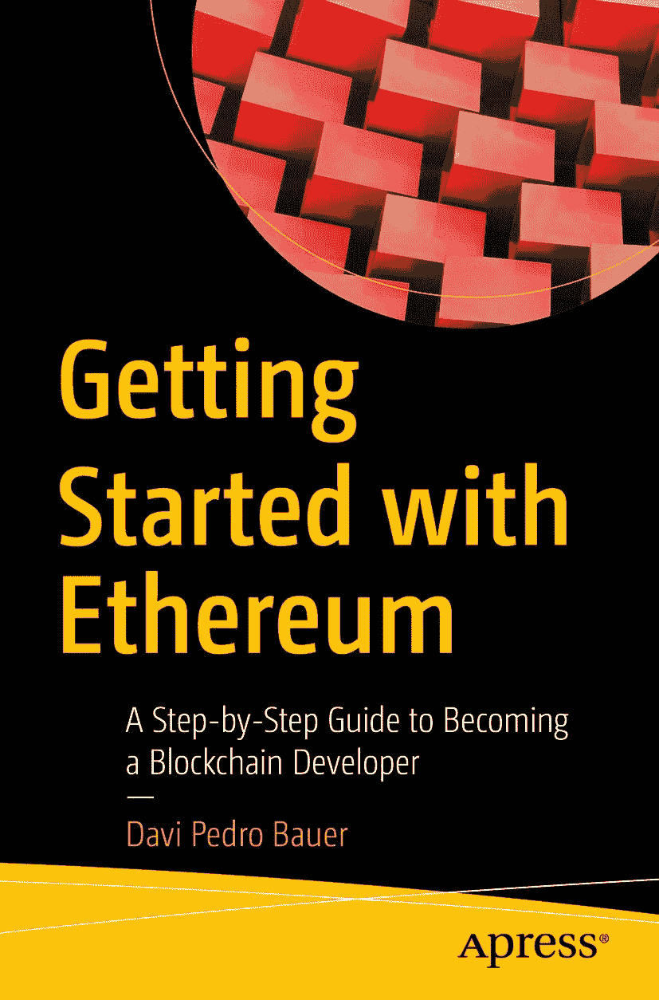

ISBN 978-1-4842-8044-7 e-ISBN 978-1-4842-8045-4 <https://doi.org/10.1007/978-1-4842-8045-4> © Davi Pedro Bauer 2022 Standard Apress 本书中可能出现商标名称、标识和图片。为避免在每个商标名称、标识或图片出现时都使用商标符号，我们仅在编辑风格下使用这些名称、标识和图片，以维护商标所有者的利益，并无意侵犯其商标权。本书中使用的商品名称、商标、服务标志及类似术语，即使未明确标注，也不应被视作对其是否受所有权保护的表述。出版方、作者及编辑假定本书中的建议和信息在出版之日是真实准确的。出版方、作者及编辑均不对本书所含材料或任何可能存在的错误或疏漏提供明示或暗示的担保。出版方对于已出版地图中的管辖权主张及机构隶属关系保持中立。

本 Apress 印记由注册公司 APress Media, LLC（Springer Nature 的一部分）出版。注册公司地址为：1 New York Plaza, New York, NY 10004, U.S.A.

## 引言

本书是一本面向所有希望入门以太坊开发者的分步指南。它专为那些从未在区块链上进行过编程、并希望入门的人而设计。

我将涵盖从基本的安装要求，到编写、测试和部署智能合约的所有内容。我还会涉及诸如`IPFS`、`Filecoin`、`ENS`、`Chainlink`、`Truffle`、`Ganache`、`OpenZeppelin`、`Pinata`、`Fleek`、`Infura`、`MetaMask`和`OpenSea`等主题。

在第 1 章中，我将讲解开始本书所述活动所需的所有必要条件。内容涵盖`Docker`、`Truffle`、`Ganache`、`MetaMask`和`Infura`等软件和工具。

在第 2 章中，你将学习如何使用 VS Code 扩展创建一个基本的 Solidity 项目，然后编译智能合约并将其部署到本地区块链。

在第 3 章中，你将学习如何编写智能合约来创建你自己的代币，并将其部署到本地区块链。同质化代币是可互换的，因此它们非常适合解决双花等问题。你还将能够将此代币添加到自己的钱包中，并将其发送到不同的钱包，以及发送你已有的其他代币。

在第 4 章中，你将学习如何为智能合约创建单元测试文件，以及如何编写测试断言、运行单元测试并检查单元测试结果。

在第 5 章中，你将能够为徽章代币创建智能合约。你可以使用徽章代币（也称为`NFT`）在虚拟世界中代表实物，例如数字收藏品、游戏道具、数字艺术品等。每个`NFT`代币都是唯一的，并且可以拥有独特的价值。在本章中，你将学习如何借助`OpenZeppelin`库来编写智能合约。你还将创建徽章并将其添加到`IPFS`节点。之后，你将学习如何将其固定(pin)，以便任何人都可以随时随地访问。接下来，你将学习如何将合约迁移到不同环境，例如使用`Ganache`迁移到本地区块链，以及使用`Infura`迁移到测试网。最后，你将学习如何在`OpenSea`上出售你自己的`NFT`。

在第 6 章中，我们将介绍使用水龙头(faucets)为你的钱包充值的不同方式。这部分很重要，因为你需要钱包中有一些以太币来支付交易费用。大多数示例将部署在测试网上，因此你无需使用真实货币来执行它们。

在第 7 章中，你将学习如何在去中心化文件系统上创建和保存文件。我还会介绍一些工具，例如一个浏览器扩展，它将帮助你管理节点，以及使用`Pinata`来帮助你远程固定文件，而不是将其保存在本地。此外，你还将能够使用`Fleek`在`IPFS`上托管你自己的网站。

在第 8 章中，我将介绍在本地节点上保存文件的方法。`Filecoin`背后的理念与`IPFS`相同，区别在于`Filecoin`拥有激励机制和激励节点来保存文件。`Filecoin`是建立在`IPFS`之上的。

在第 9 章中，你将学习如何在以太坊名称系统（`ENS`）上注册一个自定义域名。你可以使用它在此域名下托管网站，甚至可以作为你的钱包域名来接收加密货币、代币或`NFT`。

在第 10 章中，我将涵盖需要使用预言机(oracles)从链下拉取数据的用例。你将学习如何在智能合约内部使用价格信息源及加密货币价格。

在第 11 章中，你将学习如何使用`.NET`平台创建一个连接到`Web3`的简单项目，以及如何从区块链检索数据以显示钱包余额。

第 12 章为本书的总结。

## 关于作者 关于技术审校

