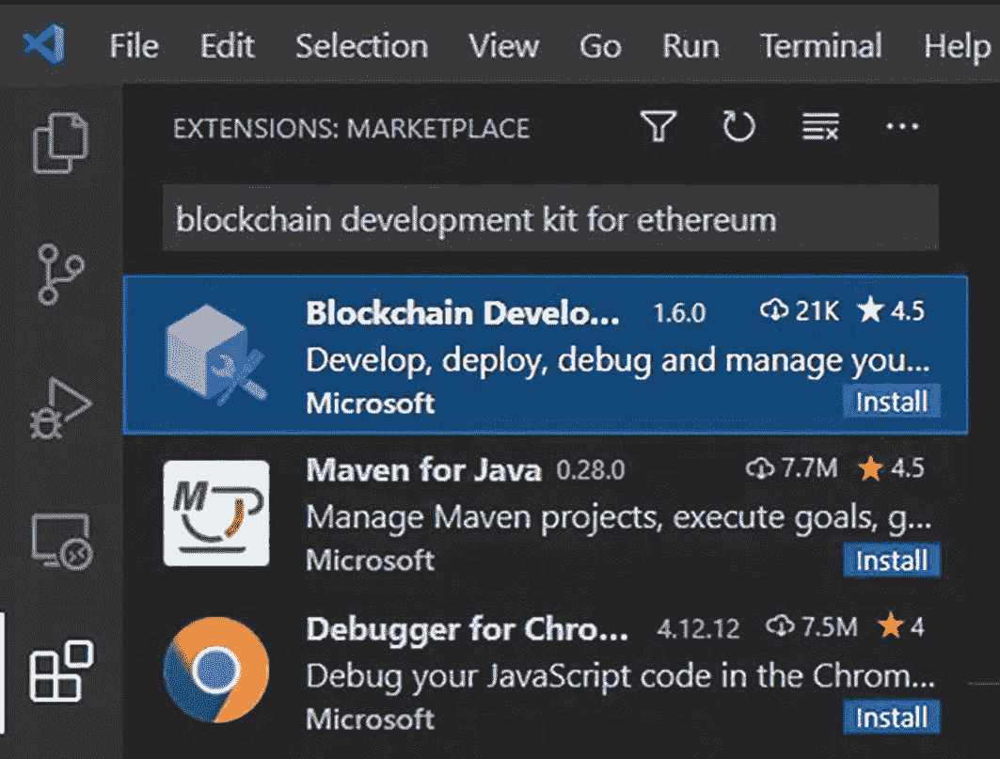
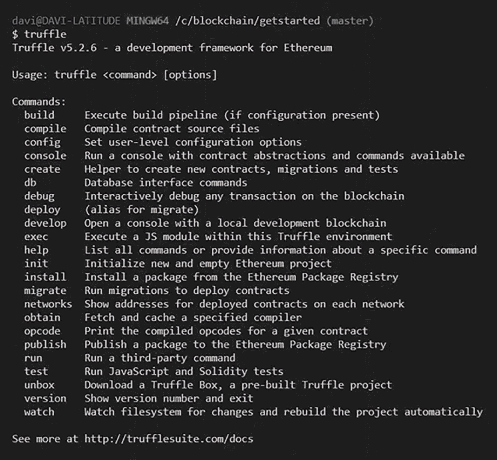
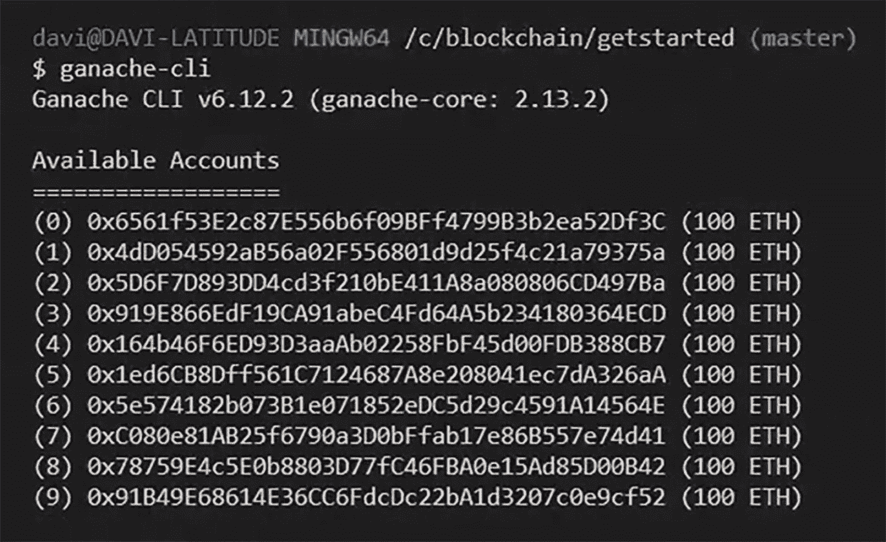
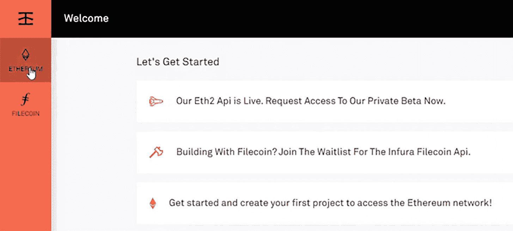
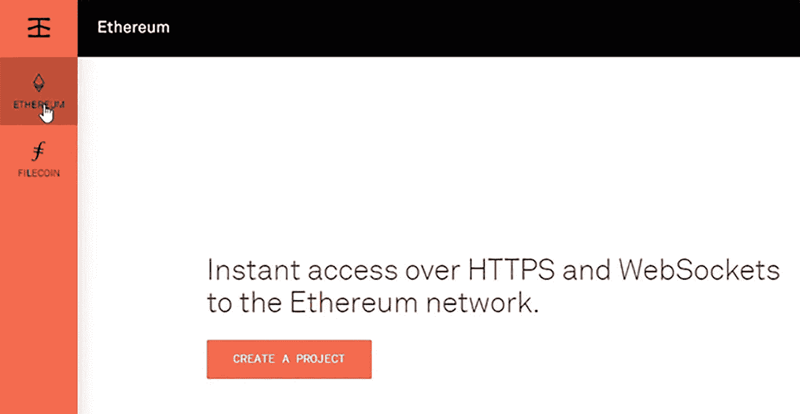
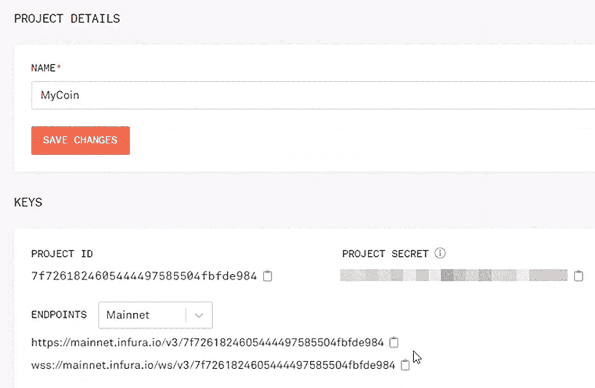

# 1. 开始入门

在本章中，我将解释以太坊是什么，并引导你完成开始使用它之前需要进行的安装操作。

## 什么是以太坊？

以太坊解决的问题超越了比特币。在开发去中心化应用时，我们需要一个平台，在这个平台上我们不仅可以编写代币代码，还可以编写各种解决方案的代码。

以太坊是一个允许你使用 Solidity 语言编写智能合约的平台。使用它，你可以将代码编译成字节码，供以太坊虚拟机（`EVM`）解释执行。

该虚拟机会解释智能合约字节码中包含的指令，并根据合约中描述的规则创建一个新的状态。这就像你手中有一个状态机，每次状态更新时，区块链上就会更新一条新记录。

像`EVM`这样的虚拟机消耗资源，因此你需要一种机制，既能激励更多人成为网络节点，又能防止垃圾邮件攻击。正因如此，执行操作需要一种称为`gas`的元素。

要获取`gas`，你首先必须拥有`ether`，即以太坊网络的货币。你使用`gas`来支付计算费用，所以可以将其视为使用系统的成本。在本书描述的大多数活动中，你都需要用到`gas`。

以太坊平台允许你构建去中心化应用，这类应用的源代码是不可变的，且数据在写入后无法更改。这开辟了一系列新的解决方案，例如投票系统、供应链和去中心化金融等。

学习的最佳方式就是动手编码，那么让我们开始吧。

## 安装 Visual Studio Code

在开始使用以太坊之前，你需要安装一些软件。首先是 Visual Studio Code^(¹)，这是一款开源代码编辑器，包含调试、任务执行和版本管理等功能。它为开发者提供了快速完成代码-构建-调试循环所需的工具，将更复杂的过程留给像 Visual Studio IDE 这样的全功能集成开发环境。

你可以免费下载适用于 Windows、Linux 和 Mac 等不同平台的版本。本书中的所有练习均基于此工具。


### 安装 Docker

`Docker`² 是一个用于创建、交付和运行应用程序的免费开放平台。`Docker` 允许你将应用与基础设施解耦，从而更快速地部署软件。`Docker` 让你能以管理应用的方式来管理基础设施。通过利用 `Docker` 的快速交付、测试和部署代码技术，你可以大幅缩短从编写代码到在生产环境中执行代码之间的时间。在使用 `Truffle` 编译之前，你需要先启动 `Docker`。

### 在 VS Code 上安装区块链开发套件扩展

适用于以太坊³ 的区块链开发者工具包既面向以太坊新手用户，也面向已熟悉相关流程的用户。其主要目标之一是帮助用户为这些智能合约创建项目结构；此外，它还能帮助用户编译和构建资产、将资产部署到区块链端点，并执行合约调试。⁴

#### 安装该扩展

转到扩展，搜索 *Blockchain Development Kit for Ethereum*。点击由 Microsoft 创建的扩展，它通常是第一个（图 1-1）。



市场扩展窗口的截图。搜索栏显示“Blockchain Development Kit for Ethereum”。区块链开发扩展位于首位并被选中。该扩展的属性包括开发、部署、调试和管理。

图 1-1  
安装适用于以太坊的区块链开发套件

点击“安装”并等待安装完成。就这么简单！

### 安装 Truffle

`Truffle`⁵ 是一个以太坊开发环境、测试框架和资产管道，旨在让以太坊开发者的工作更轻松。我们将在本书中全程使用这个工具。⁶

### 安装 Truffle

打开终端窗口并安装 `Truffle` 包。

```
$ npm install -g truffle
```

### 检查 Truffle 安装

现在你可以检查安装是否成功完成。如果你看到如图 1-2 所示的结果，则表示安装成功。



`truffle` 命令输出的截图，顶部显示安装详情，随后是 `Truffle v 5 point 2 point 6`，一个适用于以太坊的开发框架。再往下是使用说明，以及一长串命令及其功能列表。

图 1-2  
`Truffle` 命令输出结果

```
$ truffle
```

## 安装 Ganache CLI

`Ganache`⁷ 是一个个人区块链，支持以太坊和 Corda 分布式应用的快速开发。`Ganache` 可在整个开发生命周期中使用，让你能在安全且确定性的环境中开发、部署和测试你的 DApp。⁸

### 安装 Ganache

打开终端窗口并安装 `Ganache` 命令行工具。

```
npm install -g ganache-cli
```

### 在本地启动 Ganache

使用以下命令在 `127.0.0.1:8545` 上启动 `Ganache CLI`：

```
ganache-cli
```

除了在本地启动 `Ganache` 之外，此命令还会生成十个账户，并附有各自的公钥和私钥，以便你可以将其用于测试目的（图 1-3）。



由 `Ganache` 生成的可用账户截图。顶部显示安装详情，接着是 `Ganache C L 1 v 6. point 12 point 2`，`ganache-core: 2 point 13 point 2`。再往下是一系列可用账户，每个账户都带有长代码和括号内的 `100 E T H`。

图 1-3  
由 `Ganache` 生成的账户

## 安装并设置 MetaMask 钱包

`MetaMask`⁹ 是一款浏览器扩展，可让你访问支持以太坊的分布式应用（又称 DApps）。该扩展将以太坊 `Web3 API`¹⁰ 注入到每个网站的 `JavaScript` 上下文中，从而使 DApps 能够从区块链读取数据。¹¹

当 DApp 想要进行交易并将其发布到区块链时，`MetaMask` 会为用户提供一个安全界面，以便用户通过私钥、本地客户端钱包以及 `Trezor` 等硬件钱包批准或拒绝交易前对其进行评估。¹²

### 安装钱包

访问 [`https://metamask.io`](https://metamask.io) 并点击“安装 MetaMask”。点击“添加到 Brave”或你的浏览器名称，然后点击“添加扩展”。最后，点击“开始使用”。

### 配置钱包

点击“创建钱包”，然后点击“不，谢谢”（如果你愿意，也可以点击“我同意”）。定义用于打开钱包的密码，然后确认密码。同意使用条款。最后，点击“创建”。现在您可以备份您的秘密短语（也可以稍后操作）。暂时点击“稍后提醒我”。您的钱包就创建完成了！

### 访问您的钱包

点击扩展并将 MetaMask 固定到工具栏。现在，点击 MetaMask 图标，您的钱包就会显示出来。

### 查找您的钱包地址

点击右上角的三个点，然后点击“账户详情”。请注意，您可以查看哈希格式和二维码格式的钱包地址。您还可以通过点击账户名称来复制您的钱包地址。大功告成！

## 在 Infura 上创建账户

`Infura`¹³ 提供工具和基础设施，使开发者能够快速将其区块链应用从测试阶段过渡到规模化部署阶段，同时保持对以太坊和 IPFS 的简单、可靠访问。一个使用 `Infura` 作为数据接口的知名应用案例是 `Uniswap`。¹⁴、¹⁵

### 创建新账户

访问 [`Infura`](https://infura.io/)¹⁶ 并点击“免费开始”。输入您的电子邮件和密码，然后点击“注册”。一封验证邮件将发送到您的地址（图 1-4）。



`Infura` 欢迎页面的截图，左侧显示以太坊和 Filecoin。窗口显示：“让我们开始吧。我们的 `E t h 2 A P I` 已上线。立即申请访问我们的私人测试版。正在使用 Filecoin 进行构建？加入 Infura Filecoin A P I 的等待名单。开始使用并创建您的第一个项目以访问以太坊网络！”

图 1-4  
登录后您将看到的 `Infura` 欢迎页面

检查您的电子邮件，并通过点击验证链接确认您的账户。之后，您将被重定向到您的仪表板。点击左侧菜单中的“以太坊”选项卡。

现在您的账户已创建，您可以开始设置一个新项目（图 1-5）。



项目主页的截图，左侧有以太坊和 Filecoin，其中以太坊被选中。窗口显示：“通过 `H T T P S` 和 Web Sockets 即时访问以太坊网络”。文字下方显示了“创建项目”按钮。

图 1-5  
点击以太坊将跳转到项目主页


好的，作为一名高级文档工程师和翻译员，我将严格遵循您提供的注意事项和示例，将以下英文文本翻译成中文。


#### 配置您的 Infura 项目

访问您的控制台，点击 `Ethereum`。然后点击“创建项目”并定义项目名称。请注意，您可以连接不同的测试网，也可以连接到主网。保存更改。

项目创建后，会提供用于连接的 `ID`、`secret` 和 `endpoint` 信息（图 1-6）。



Infura 项目页面顶部是项目详情，下方是密钥。有一个用于输入名称的栏和该栏下方一个标有“保存更改”的按钮。在密钥下方，有显示 `ID` 的 `Project ID` 部分、带有一个输入栏的 `Project Secret` 部分，以及已填入主网的端点。下方有两个链接。

图 1-6  
Infura 项目详情页面

## 总结

在本章中，您了解了什么是 `Ethereum`，以及如何安装开始开发智能合约所需的必要软件。

在下一章中，您将探索 `Solidity`，并学习如何使用该语言设置您的第一个项目。

脚注 1   2   3   4   5   6   7   8   9   10   11   12   13   14   15   16

