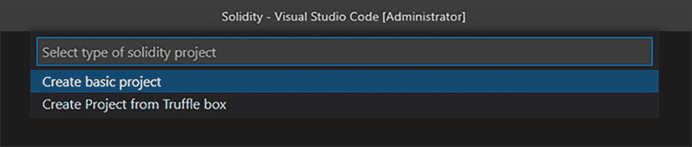
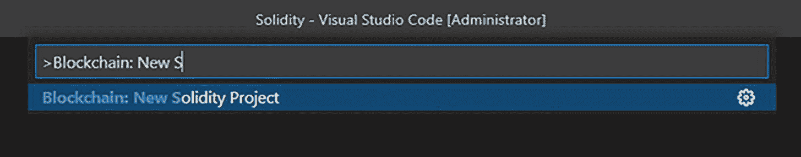
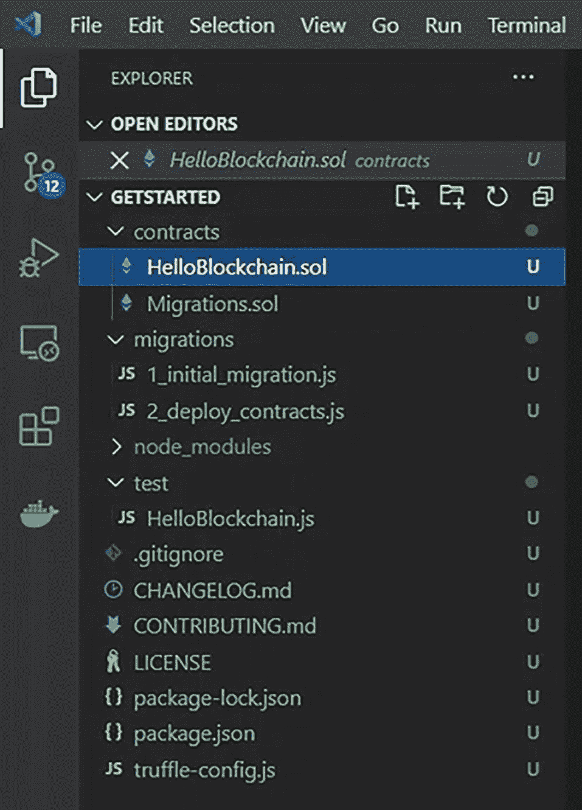

# 2. Solidity

`Solidity` 是一种面向对象的高级编程语言，用于构建自动化区块链交易的智能合约。该语言于 2014 年由 Gavin Wood 提出，并由以太坊项目的参与者共同开发。`Solidity` 受到了 `C++`、`Python` 和 `JavaScript` 的影响，因此您会发现其语言结构与这些语言相似。该语言主要用于在以太坊区块链上构建智能合约，但也可用于在其他区块链上创建智能合约。

作为一种高级语言，`Solidity` 消除了用二进制代码输入的需要。它通过将字母和数字组合起来，使人们能够更容易地以一种他们可以理解的形式创建程序。

因为 `Solidity` 是静态类型语言，每个变量都必须由用户指定。数据类型使编译器能够验证变量的使用情况。`Solidity` 数据类型通常分为两类：值类型和引用类型。

以太坊生态系统的独特之处在于，它可以被广泛的加密货币和去中心化应用所使用。在以太坊上，智能合约使得为各种类型的企业和组织创建解决方案成为可能。

在本章结束时，您将能够完成以下操作：

- 使用 `VS Code` 扩展创建一个基础的 `Solidity` 项目
- 编译合约
- 将合约部署到本地区块链

## 在 VS Code 上开始 Solidity 项目

以太坊是智能合约最常用的平台。以太坊是世界上第一个可编程的区块链。它支持创建智能合约，以协助转移诸如以太币之类的数字资产。

`Solidity` (¹⁷) 是您将用来构建合约的语言；它是图灵完备的，这意味着它允许您以定义良好且编码良好的方式构建复杂的合约。

### 创建新项目

选择“查看 ➤ 命令面板”，然后点击“Blockchain: New Solidity Project”（图 2-1）。最后，点击“创建基础项目”（图 2-2）。

一个 Solidity 命令面板窗口有 3 个带有文本的栏。第一个显示为“选择 Solidity 项目类型”。第二个显示为“创建基础项目”，已被选中。第三个显示为“从 Truffle box 创建项目”。

一个 Solidity 命令面板窗口有 2 个栏。第一个栏的文本是“右尖括号 Blockchain 冒号 New S”，光标在 S 后面。第二个栏显示为“Blockchain colon New Solidity Project”。在该栏的右上角，有一个设置图标。

选择一个将生成项目结构的文件夹，然后等待项目创建完成。确保项目结构已创建，如图 2-3 所示。

一个 Solidity 项目创建面板，左侧有菜单图标。在主屏幕上，有“开始”下的各个部分，例如 contracts、migrations、node_underscore_modules、test 等。在 contracts 下已选中 `Helloblockchain.sol`。

### 编译项目

右键单击 `HelloBlockchain.sol` 文件，选择“构建合约”，然后等待合约构建完成。

### 部署到开发区块链

右键单击 `HelloBlockchain.sol` 文件，选择“部署合约”，然后选择 `Development 127.0.0.1:8545`。等待合约部署到区块链开发网络。就完成了！

## 总结

在本章中，您了解了什么是 `Solidity`，并创建、编译和部署了您的第一个智能合约。

在下一章中，您将探索 `ERC-20` 代币标准，并学习如何创建和部署到开发、测试和生产环境。

脚注 1