# 3. ERC-20：同质化代币

同质化代币是指每个单位都具有相同价值的代币，这与法定货币类似。这意味着您可以将一个单位的这种货币兑换成另一个单位的相同价值的货币。为了在区块链上复制这种行为，Fabian Vogelsteller 和 Vitalik Buterin 于 2015 年 11 月提议创建 `ERC-20`，即“以太坊意见征求稿 20”，旨在为基于以太坊的代币创建一个简单的格式。这些代币在以太坊区块链内运作，并能够与网络上的其他加密货币进行交互。在本章中，您将创建遵循 `ERC-20` 标准的简单合约，并学习如何将它们部署到测试网和生产网络。

在本章结束时，您将能够完成以下操作：

- 编写一个遵循 `ERC-20` 标准的简单合约。
- 编写一个固定供应量的合约。
- 使用 `OpenZeppelin` 继承关键实现。
- 使用 `Truffle` 编译合约。
- 使用 `Ganache` 启动一个本地主机区块链。
- 将现有合约部署到 `Ganache`。
- 配置 `MetaMask` 以连接到 `Ganache`。
- 将已部署的代币合约添加到您的 `MetaMask` 钱包中。
- 将合约迁移到 `Ganache`。
- 在账户之间转移代币。
- 将 `Polygon Mumbai` 添加到 `MetaMask` 网络。
- 在 `Infura` 上激活 `Polygon` 插件。
- 配置私钥以签署合约。
- 在 `Polygon Mumbai` 上部署智能合约。
- 将 `Polygon 主网` 添加到 `MetaMask` 网络。
- 配置网络以使用 `Polygon 主网`。
- 在 `Polygon 主网` 上部署智能合约。
- 在 `Polygon 主网` 上验证智能合约。

## 使用 OpenZeppelin 编写一个简单的 ERC-20 代币

让我们使用 `Truffle` 来开发一个简单的 `ERC-20` 以太坊智能合约，然后导入 `OpenZeppelin` 合约库。

`OpenZeppelin` 是一个开源且可审计的库，它允许你复用常见实现中的代码，从而作为一个始终如一的基础代码库。使用 `OpenZeppelin` 可以让你更专注于编码业务需求，而不是重复编写不必要的代码。

我们将在本示例以及本书的后续章节中使用 `OpenZeppelin` 库。

代币在以太坊中可以代表几乎任何东西，例如：

- 在线平台中的声望值
- 游戏中角色的技能
- 彩票
- 金融资产，如公司股票
- 法定货币，如美元
- 一盎司黄金

### 准备环境

使用以下命令初始化 `Truffle`：

```
$ truffle init
```

现在，初始化项目文件夹。

```
$ npm init
```

最后，安装 `OpenZeppelin` 合约包。

```
$ npm install @openzeppelin/contracts
```

### 编写合约

在 `contracts` 文件夹下创建一个名为 `ERC20MinerReward.sol` 的新文件。添加许可证指令，定义 `Solidity` 最低版本，并导入 `OpenZeppelin` `ERC-20` 合约库。最后，定义合约类、合约构造函数、合约名称和合约符号。

```solidity
// SPDX-License-Identifier: MIT
pragma solidity ⁰.8.0;
import "@openzeppelin/contracts/token/ERC20/ERC20.sol";
contract ERC20MinerReward is ERC20 {
constructor() ERC20("MinerReward", "MRW"){}
}
```

### 设置 Solidity 编译器版本

复制此合约中使用的 `Solidity` 版本，然后打开 `truffle-config.js`。取消注释 `solc` 块，并通过粘贴复制的值来设置 `Solidity` 版本。

```javascript
compilers: {
solc: {
version: "0.8.0",
docker: true,
settings: {
optimizer: {
enabled: false,
runs: 200
},
evmVersion: "byzantium"
}
}
},
```

### 编译合约

现在是编译合约的时候了。

```
$ truffle compile
```

合约编译成功！

### 验证结果

注意，创建了一个新的 `build/contract` 文件夹（图 3-1）。新合约就在那里！

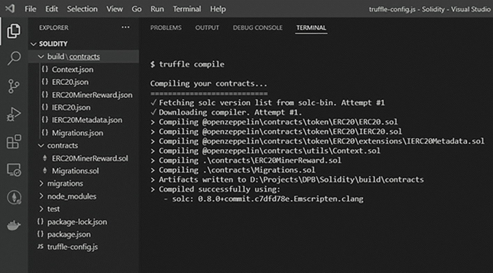

**图 3-1** Truffle 编译结果

## 将 ERC-20 代币部署到 Ganache 开发区块链

以太坊 `Ganache` 是一个本地的内存区块链，专为开发和测试而设计。它模拟真实以太坊网络的特性，包括提供多个带有测试以太币的账户。

这是在将合约迁移到主网之前进行部署的一种好方法。使用开发区块链，你可以专注于实现，而无需担心花费真金白银来部署合约。

### 准备迁移

在 `migrations` 文件夹下创建一个名为 `2_deploy_contracts.js` 的新迁移文件。在第一行中添加对智能合约的引用，并添加一个导出函数来部署智能合约（图 3-2）。

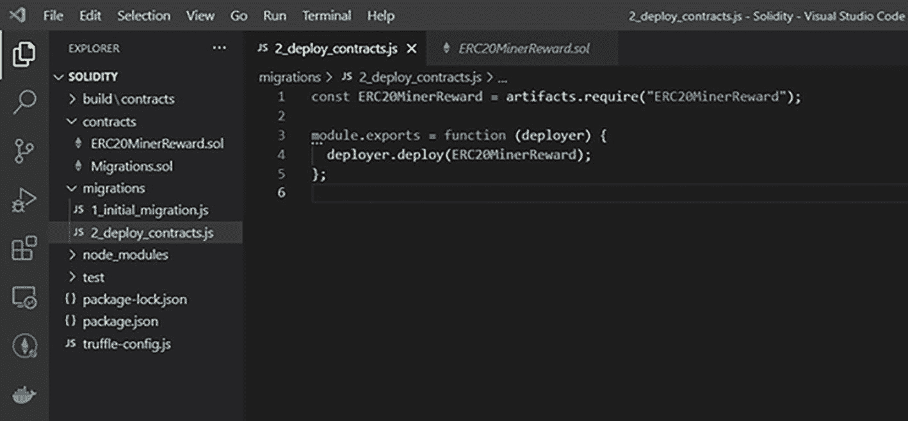

**图 3-2** 新迁移文件

### 启动区块链

打开一个新终端并启动 `Ganache` 区块链。

```
$ ganache-cli
```

一个新的 `Ganache` 区块链正在 `127.0.0.1:8545` 上监听。

### 配置区块链网络

打开 `truffle-config.js` 并从 `networks` 中取消注释 `development` 块。确保 `host` 和 `port` 是正确的（图 3-3）。

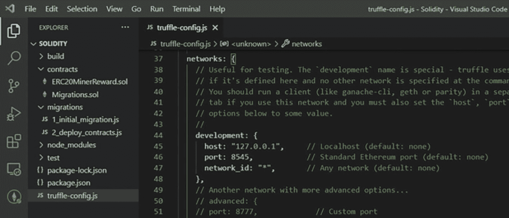

**图 3-3** 开发网络

### 部署合约

使用以下命令编译合约：

```
$ truffle compile
```

使用以下命令迁移合约：

```
$ truffle migrate
```

合约已部署到 `Ganache` 区块链，并创建了一个合约地址（图 3-4）。

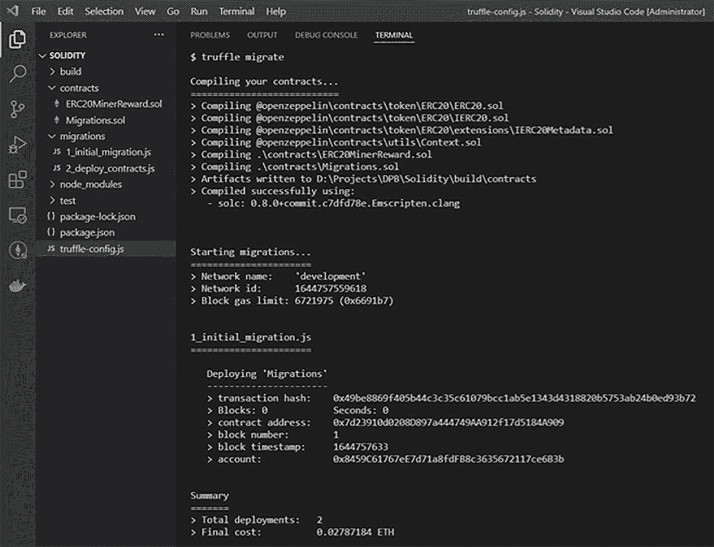

**图 3-4** Truffle 迁移合约

### 将 Ganache 添加到 MetaMask 网络

打开 `MetaMask` 扩展程序，然后点击网络下拉菜单。选择 `Custom RPC` 选项并设置以下字段，如图 3-5 所示：

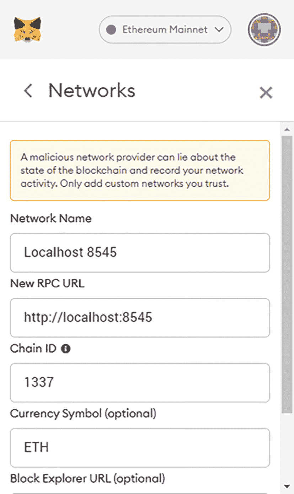

**图 3-5** MetaMask 网络配置

- 将网络名称设置为 `Localhost 8545`。
- 将 RPC URL 设置为 `http://localhost:8545`。
- 将链 ID 设置为 `1337`。
- 将货币符号设置为 `ETH`。

### 将代币添加到钱包

转到 Brave 浏览器（或任何与 `MetaMask` 兼容的浏览器），然后选择 `Localhost 8585` 网络。

点击“添加代币”，然后点击“自定义代币”。复制合约地址。将其粘贴到“代币合约地址”字段。

“代币符号”和“精度位数”字段会自动填充。点击“下一步”，然后点击“添加代币”。代币已添加到 `MetaMask` 钱包中。代币就在那里！

## 创建具有固定供应量的 ERC-20 代币

智能合约中允许的代币总数由 `ERC-20` 固定供应量代币定义。一旦合约部署到区块链上，你就无法再更新它。这意味着你的代币在部署后将拥有固定的数量，并且你之后将无法再增发更多代币。

### 创建项目

初始化一个新的空以太坊项目。

```
$ truffle init
```

为你的项目创建一个 `package.json` 文件。

```
$ npm init
```

安装 `OpenZeppelin` 合约包。它包含了用 `Solidity` 编写的可复用智能合约。

```
$ npm install @openzeppelin/contracts
```

### 编写固定供应合约

创建一个新的 Solidity 文件，并执行以下操作：

1.  包含许可证声明（这是强制性的）。
2.  定义 `Solidity` 的最低版本。
3.  导入 `OpenZeppelin` 的 `ERC-20` 合约库。
4.  定义固定供应合约类，继承自 `ERC20`。
5.  调用构造函数，传入代币名称和符号。
6.  将总供应量分配给发送方地址（即合约创建者）。
7.  重写 `decimals` 函数。
8.  设置该代币的小数位数。

```solidity
// SPDX-License-Identifier: MIT
pragma solidity ⁰.8.0;
import "@openzeppelin/contracts/token/ERC20/ERC20.sol";
contract ERC20FixedSupply is ERC20 {
constructor() ERC20("Fixed", "FIX"){
_mint(msg.sender, 1000);
}
function decimals() public view virtual override returns (uint8){
return 0;
}
}
```

前往 `truffle-config.js` 文件，取消注释 `solc` 代码块（快捷键 `Ctrl+;`）。然后，更新 `Solidity` 版本号。

```javascript
compilers: {
solc: {
version: "0.8.0",
docker: true,
settings: {
optimizer: {
enabled: false,
runs: 200
},
evmVersion: "byzantium"
}
}
},
```

在 `migrations` 文件夹下创建一个新文件。将其命名为 `2_deploy_contracts.sol`。

```bash
$ touch migrations/2_deploy_contracts.sol
```

在该文件中，将所需的方法指向你的合约文件，并导出一个用于部署合约的函数。

```javascript
var ERC20FixedSupply = artifacts.require("./ERC20FixedSupply.sol");
module.exports = function(deployer){
deployer.deploy(ERC20FixedSupply);
}
```

### 编译合约

现在是时候编译合约了。

```bash
$ truffle compile
```

合约已成功编译！

### 启动 Ganache 开发区块链

拆分终端视图。然后，在 `127.0.0.1:8545` 上启动 `Ganache` 开发区块链。

```bash
$ ganache-cli
```

前往 `truffle-config.js` 文件，在 `networks` 下取消注释 `development` 代码块。

```javascript
networks: {
development: {
host: "127.0.0.1",
port: 8545,
network_id: "*"
},
}
```

### 将合约迁移至 Ganache

运行 `migrate` 命令来部署合约，如图 3-6 所示。

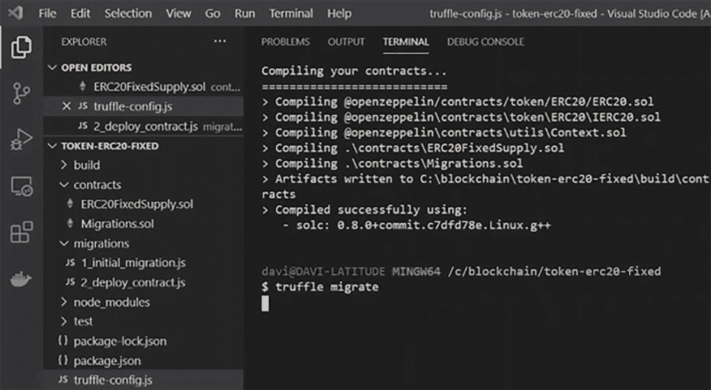

**图 3-6** VS Code：使用 `truffle` 命令行迁移项目

```bash
$ truffle migrate
```

在进入下一部分之前，请复制部署代币的账户私钥。

### 配置 MetaMask

打开 `MetaMask`。点击你的账户，然后点击“导入账户”。在此步骤中，粘贴账户私钥。点击“导入”，如图 3-7 所示。

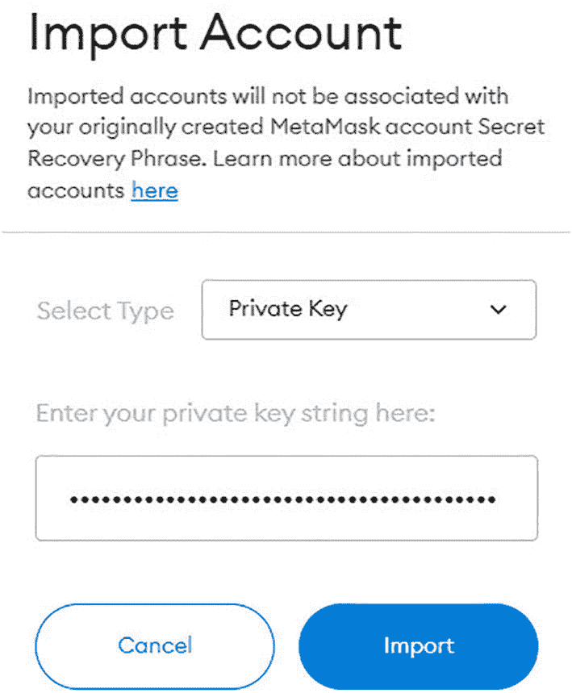

**图 3-7** MetaMask：使用助记词导入现有钱包

点击网络列表，然后点击 `Localhost:8545`。使用 localhost 网络意味着你将把钱包指向你的本地开发区块链，如图 3-8 所示。

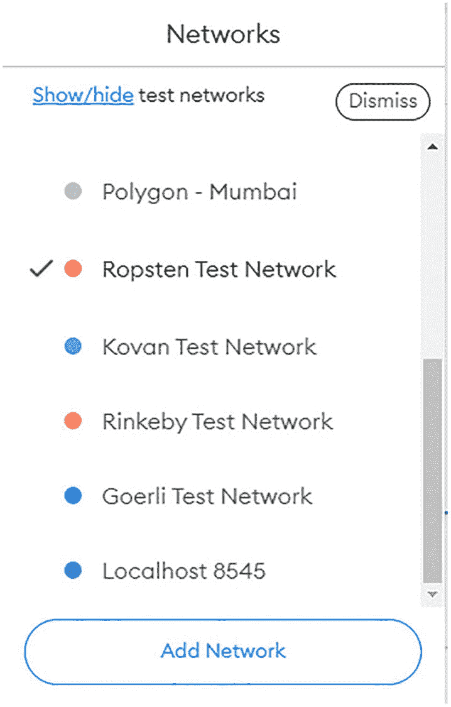

**图 3-8** MetaMask：网络选择列表

### 将代币添加到 MetaMask

点击“添加代币”，然后选择“自定义代币”。粘贴代币合约地址并点击“下一步”。

添加代币就是添加所创建代币的合约公共地址。之后 `MetaMask` 会自动读取代币符号和小数位数。确保你得到的结果如图 3-9 所示。

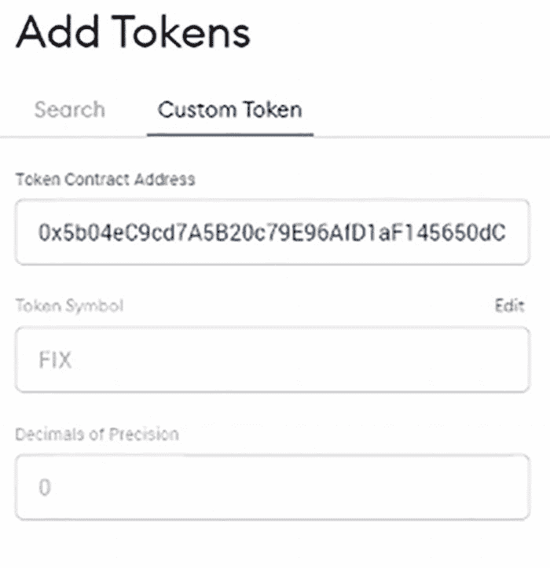

**图 3-9** MetaMask：添加自定义代币

点击“添加代币”。代币符号以及你的余额将显示在此屏幕上（图 3-10）。

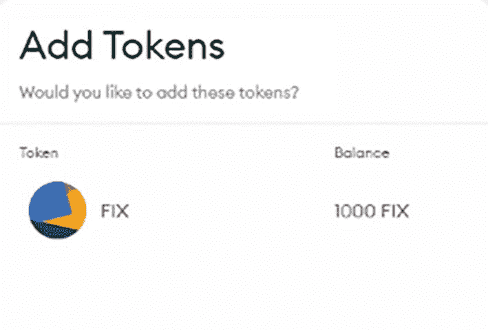

**图 3-10** MetaMask：新自定义代币概览

现在，回到 VS Code（参见图 3-6 中的 `ganache-cli` 终端视图）并复制另一个账户私钥。返回 `MetaMask`，重复你对第一个账户执行的操作，包括添加代币。

### 在账户之间转移代币

现在，切换到第一个导入的账户（即拥有所有代币的账户）。点击“发送”，然后点击“在我的账户之间转账”。选择第二个创建的账户。输入 `115 FIX` 作为转账金额，然后点击“下一步”。最后，点击“确认”。

交易已发送，但处于待处理状态。稍等片刻等待交易被确认。一旦确认完成，代币总数将被更新。选择第二个导入的账户；现在这个账户有了 `115 FIX`！

## 使用 Infura 将 ERC-20 代币部署到测试网

`Infura` 可用于将智能合约部署到 `Ropsten`、`Kovan`、`Rinkeby`、`Goerli` 等测试网络以及主网。对于测试网，你需要在 `Infura` 上创建一个新项目，并获取用于部署合约的钱包私钥。为了执行合约创建交易，该钱包必须拥有以太币余额。

### 安装先决条件

打开一个新终端，安装 `fs` 包。安装此包可提供用于访问和与文件系统交互的有用功能。

```
$ npm install fs
```

现在，安装钱包提供程序 `hdwallet` 包。它用于为从 12 或 24 个单词的助记词派生的地址签署交易。

```
$ npm install @truffle/hdwallet-provider@1.2.3
```

### 设置你的 Infura 项目

访问 `http://infura.io` 并进入你的仪表盘。点击“以太坊”，然后点击“创建项目”。定义项目名称。请注意，你可以连接不同的测试网以及主网。复制项目 ID 并保存更改。

#### 设置你的智能合约

打开 Visual Studio Code 并编辑 `truffle-config.js`。取消四个常量（`hdwalletprovider`、`infurakey`、`fs` 和 `mnemonic`）的注释。将项目 ID 粘贴为 `infurakey` 常量的值。取消 `ropsten` 块的注释。确保你在 `ropsten` 端点中使用了正确的项目 ID。

```
const HDWalletProvider = require('@truffle/hdwallet-provider');
const infuraKey = "fj4jll3k.....";
const fs = require('fs');
const mnemonic = fs.readFileSync(".secret").toString().trim();
```

### 配置私钥

在浏览器中打开已连接到 Infura 网络的 MetaMask 钱包。点击“你的账户”，然后点击“设置”，最后点击“安全与隐私”（图 3-11）。

你可以选择查看种子短语，但请注意此信息非常敏感，如果有人获得访问权限，他们将能够恢复你的钱包并使用你的资金。

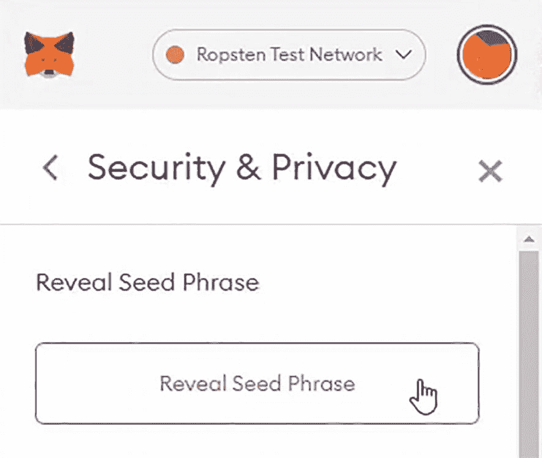

Ropsten 测试网络中“安全与隐私”窗口的截图。屏幕上显示“显示种子短语”文字，并带有一个光标悬停的按钮，按钮上也显示“显示种子短语”。

图 3-11 MetaMask：显示种子短语

点击“显示种子短语”并输入你的钱包密码以继续；然后复制私钥。

返回 Visual Studio Code（图 3-6）并创建一个名为 `.secret` 的新文件。将私钥粘贴到此文件中。你也可以使用命令行创建此文件（图 3-12）。

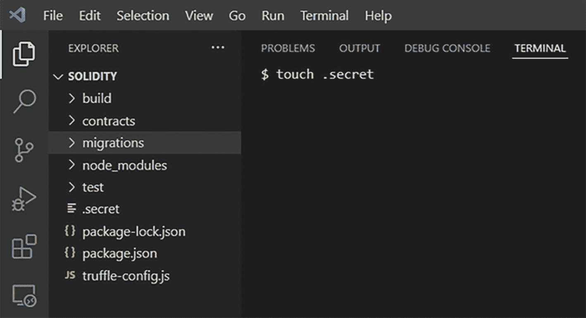

截图显示在 Solidity 块下选中了 migrations 文件夹。命令提示符显示为“美元符号 touch 空格 dot secret”。

图 3-12 Secret 文件

```
$ touch .secret
```

### 部署智能合约

打开终端并运行 `migrate` 命令，以将合约部署到 `Ropsten` 网络。

```
$ truffle migrate --network ropsten
```

### 检查你的钱包余额

再次进入你的 MetaMask 钱包，注意你的余额已经减少。

### 在 Etherscan 上验证智能合约

打开一个新窗口，复制在部署阶段创建的合约地址。访问 `https://ropsten.etherscan.io`，将合约地址粘贴到搜索字段中。点击“查找”按钮。智能合约就在那里！

代币已被创建并转移到创建合约的钱包中。点击“Fixed (FIX)”代币链接。在这里你可以看到新创建代币的概述。

## 将 ERC-20 代币部署到 Polygon 测试网（第 2 层）

Polygon 是一个用于构建和连接兼容以太坊的区块链网络的协议和框架。你可以在以太坊上聚合可扩展的解决方案，以支持多链以太坊生态系统。

`MATIC`，Polygon 的原生代币，是一种在以太坊区块链上运行的 ERC-20 代币。该代币用于 Polygon 上的支付服务，并作为在 Polygon 生态系统中运营的用户之间的结算货币。

### 安装先决条件

打开一个新终端，如果尚未安装，请安装 `fs` 包。此包提供了许多有用的功能来访问和与文件系统交互。

```
$ npm install fs
```

现在，如果尚未安装，请安装钱包提供程序 `hdwallet` 包。它用于为从 12 或 24 个单词的助记词派生的地址签署交易。

```
$ npm install @truffle/hdwallet-provider@1.4.0
```

### 将 Polygon Mumbai 添加到 MetaMask 网络

打开 MetaMask 扩展程序并点击网络下拉菜单。然后选择“自定义 RPC”选项。设置以下值，如图 3-13 所示：

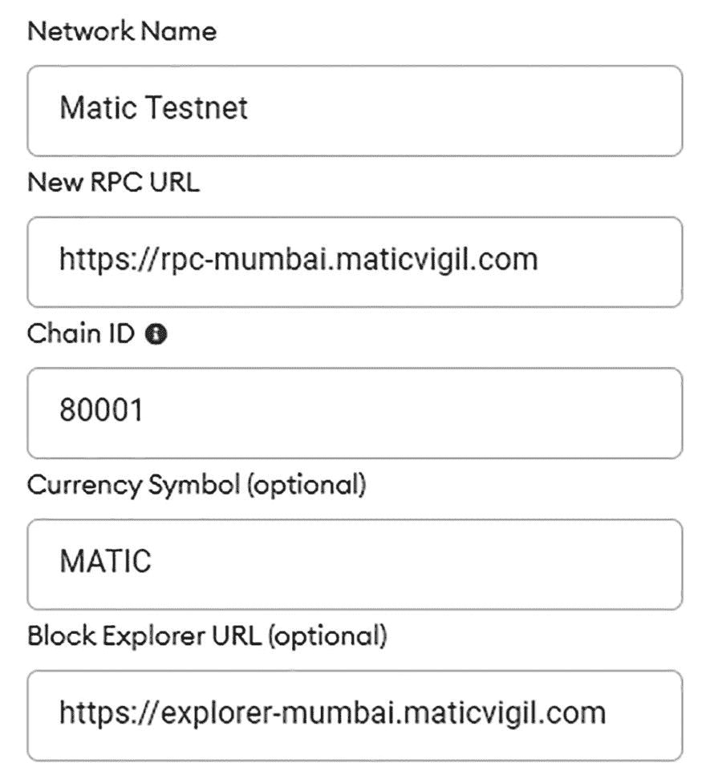

MetaMask 网络配置页面的截图内容如下。网络名称：Matic Testnet。新 RPC URL 下方输入了链接。链 ID：80001；货币符号（可选）：MATIC。最后一行显示区块浏览器 URL（可选），并提供了链接。

图 3-13 MetaMask：网络配置页面

*   将网络名称设置为 `Matic Testnet`。
*   将 RPC URL 设置为 `https://rpc-mumbai.maticvigil.com`。
*   将链 ID 设置为 `80001`。
*   将货币符号设置为 `MATIC`。
*   将区块浏览器 URL 设置为 `https://explore-mumbai.maticvigil.com`。

### 在 Infura 上激活 Polygon 附加组件

访问 `https://infura.io/upgrade`，然后在“网络附加组件”下的“Polygon PoS”中点击“选择附加组件”，如图 3-14 所示。Polygon PoS 目前在 Infura 上处于 beta 版本，你需要激活它。

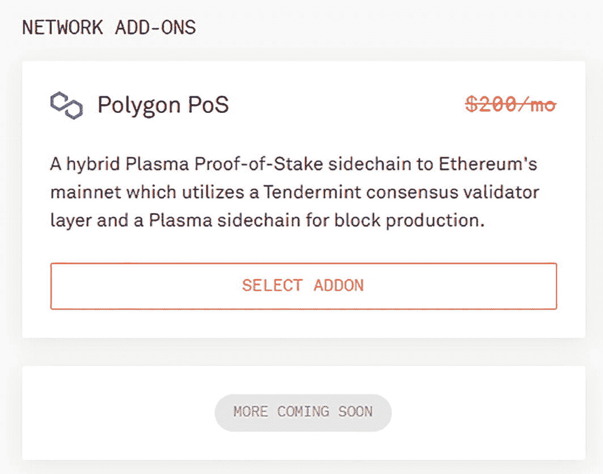

“网络附加组件”窗口的截图将 Polygon PoS 描述为一种以太坊主网的混合 Plasma 权益证明侧链，它利用了 Tendermint 共识验证器层和用于区块生产的 Plasma 侧链。“选择附加组件”和“即将推出更多”按钮显示在下方。每月 200 美元的价格已被划掉。

图 3-14 Infura：Polygon PoS 激活页面

激活后，你将被重定向到摘要页面。免费层限制为每天 100,000 个请求。你将需要提供信用卡以确认；由于总费用为零，你不会被收费。如果你同意，请点击“立即开始”。你应该会看到类似于图 3-15 所示的页面。

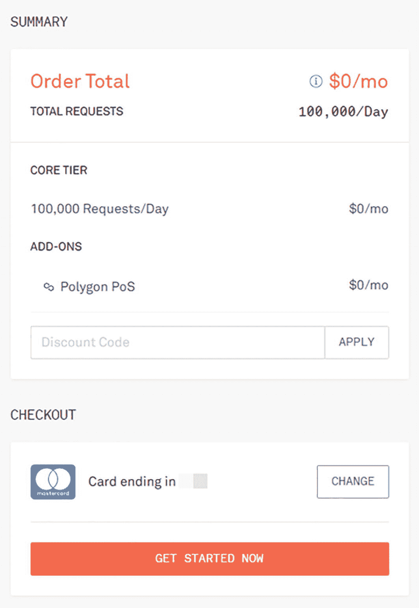

摘要窗口的截图列出了订单总额为每月 0 美元，总请求数为每天 100,000 次，核心层级（每天 100,000 次请求）为每月 0 美元，Polygon PoS 附加组件为每月 0 美元。可以应用折扣代码。下方是结账区域，已保存信用卡。

图 3-15 Infura：添加 Polygon PoS 插件后的订单摘要页面

### 设置你的 Infura 项目

确保你已经在 Infura 上设置了一个项目。如果尚未设置，请按照第 1 章中的步骤进行操作。

#### 设置你的智能合约

进入 Visual Studio Code 并打开 `truffle-config.js` 文件。取消注释四个常量：`hdwalletprovider`、`infurakey`、`fs` 和 `mnemonic`，然后将项目 ID 粘贴为 `infurakey` 常量的值。

```javascript
const HDWalletProvider = require('@truffle/hdwallet-provider');
const infuraKey = "fj4jll3k.....";
const fs = require('fs');
const mnemonic = fs.readFileSync(".secret").toString().trim();
```

#### 配置网络（使用 Matic 端点）

连接到 Polygon 网络的第一种方法是使用 Matic 网络。现在，在 `truffle-config.js` 文件的 `networks` 下创建一个 `matic_testnet` 配置，并设置以下值：

-   将钱包 URL 设置为 `https://rpc-mumbai.maticvigil.com`。
-   将 `network_id` 设置为 `80001`。

```javascript
matic_testnet: {
  provider: () => new HDWalletProvider(mnemonic, `https://rpc-mumbai.maticvigil.com`),
  network_id: 80001,
  confirmations: 2,
  timeoutBlocks: 200,
  skipDryRun: true
},
```

### 配置网络（使用 Infura 端点）

另一种连接到 Polygon 网络的方法是使用 Infura 端点。在 `networks` 下创建一个 `matic_testnet` 配置，并设置以下值：

-   将钱包 URL 设置为 `https://polygon-mumbai.infura.io/v3/${infuraKey}`。
-   将 `network_id` 设置为 `80001`。

```javascript
matic_testnet: {
  provider: () => new HDWalletProvider(mnemonic, `https://polygon-mumbai.infura.io/v3/${infuraKey}`),
  network_id: 80001,
  confirmations: 2,
  timeoutBlocks: 200,
  skipDryRun: true,
  chainId: 80001,
  networkCheckTimeout: 1000000
},
```

要使用 Polygon 网络，您需要激活网络插件。

### 配置私钥

前往浏览器并打开连接到 Infura 网络的 MetaMask 钱包。点击“您的账户”，然后点击“设置”。最后，点击“安全与隐私”，如图 3-16 所示。


Ropsten 测试网络中“安全与隐私”窗口的屏幕截图。屏幕上的短语显示“显示助记词”，并有一个带有光标的长按钮，上面也写着“显示助记词”。

图 3-16 MetaMask：显示助记词

您可以选择查看您的助记词，但请注意此信息非常敏感，如果有人获得了它，他们将能够恢复您的钱包并使用您的资金。

点击“显示助记词”并输入您的钱包密码以继续。复制私钥。

返回 VS Code（在 `ganache-cli` 终端视图中）并创建一个名为 `.secret` 的新文件。将私密的恢复短语粘贴到此文件中。

### 部署智能合约

运行 `migrate` 命令将合约部署到 `matic_testnet` 网络。

```
$ truffle migrate --network matic_testnet
```

如果在终端上遇到此错误，您需要先从水龙头获取测试 MATIC。

```
1_initial_migration.js
======================
Deploying 'Migrations'

Error:  *** Deployment Failed ***
"Migrations" -- insufficient funds for gas * price + value.
```

### 检查钱包余额

再次前往您的 MetaMask 钱包，注意余额已减少。这是因为每次部署合约都需要付费。它有一个等效的 Gas 成本，该成本根据您在智能合约内部使用的指令来计算。这意味着您需要的机器处理越多，执行此合约的 Gas 成本就越高。您可以在[以太坊黄皮书](https://ethereum.github.io/yellowpaper/paper.pdf)中找到关于如何计算此费用的更详细解释。

### 在 PolygonScan 上验证智能合约

复制部署中创建的合约地址（该地址将在 `truffle migrate` 运行完毕后显示在控制台中），然后前往 `https://mumbai.polygonscan.com`。在搜索字段中粘贴合约地址，然后点击“查找”按钮。智能合约就在那里！

代币已创建并转移到创建合约的钱包中。现在，点击 Fixed (FIX) 代币链接，您就可以在此处看到您新创建代币的概览！

## 将 ERC-20 代币部署到 Polygon 主网（第 2 层）

主网用于真实交易，而测试网用于测试智能合约和去中心化应用程序 (DApp)。Polygon 被用作第二层，并因其比主网更低的交易成本而广受欢迎。

### 将 Polygon 主网添加到 MetaMask 网络

打开 MetaMask 扩展程序，点击“网络”下拉菜单，然后选择“自定义 RPC”选项。设置以下值，如图 3-17 所示：

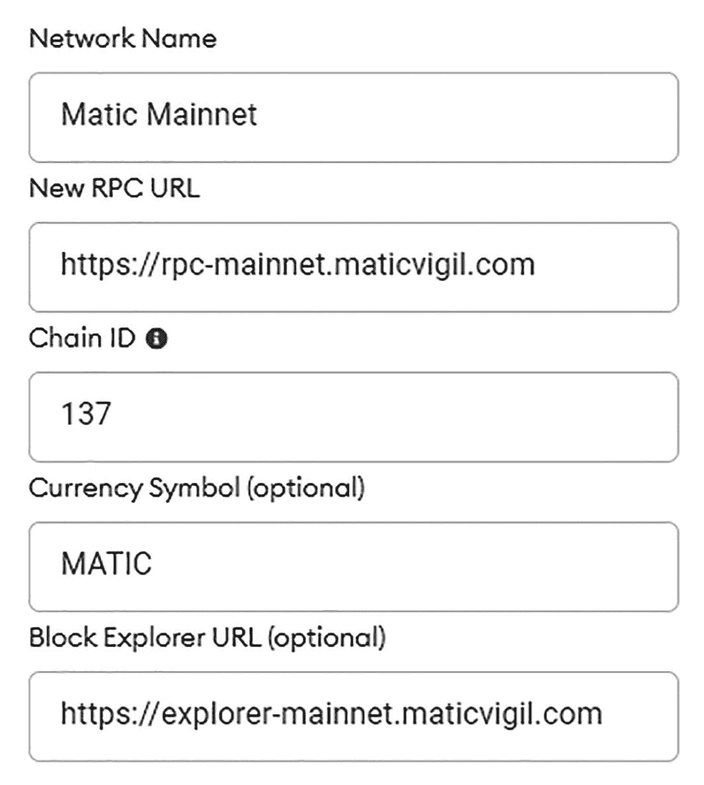

网络配置页面的屏幕截图已填写以下字段。网络名称：Matic Mainnet。新 RPC URL：带有链接。链 ID：137。货币符号（可选）：Matic。区块浏览器 URL（可选）：已添加链接。

图 3-17 MetaMask：网络配置页面

-   将网络名称设置为 Matic Mainnet。
-   将 RPC URL 设置为 `https://rpc-mainnet.maticvigil.com`。
-   将链 ID 设置为 `137`。
-   将货币符号设置为 MATIC。
-   将区块浏览器 URL 设置为 `https://explore-mainnet.maticvigil.com`。

### 配置网络（使用 Infura 端点）

另一种连接到 Polygon 网络的方法是使用 Infura 端点。在 `networks` 下创建一个 `matic_mainnet` 配置，并设置以下值：

-   将钱包 URL 设置为 `https://polygon-mainnet.infura.io/v3/${infuraKey}`。
-   将 `network_id` 设置为 `137`。

```javascript
matic_mainnet: {
  provider: () => new HDWalletProvider(mnemonic, `https://polygon-mainnet.infura.io/v3/${infuraKey}`),
  network_id: 137,
  gasPrice: 100000000,
  confirmations: 2,
  timeoutBlocks: 200,
  skipDryRun: true,
  chainId: 137,
  networkCheckTimeout: 1000000
},
```

### 部署智能合约

运行 `migrate` 命令将合约部署到 `matic_mainnet` 网络。

```
$ truffle migrate --network matic_mainnet
```

### 检查钱包余额

再次前往您的 MetaMask 钱包，注意余额已减少。

### 在 PolygonScan 上验证智能合约

复制部署中创建的合约地址，然后前往 PolygonScan。^((19)) 在搜索字段中粘贴合约地址，然后点击“查找”按钮。智能合约就在那里！

代币已创建并转移到创建合约的钱包中。现在，点击 Fixed (FIX) 代币链接，您就可以在此处看到您新创建代币的概览。

## 总结

在本章中，您学习了什么是 ERC-20 代币标准，并学习了如何在以太坊和 Polygon 区块链上创建同质化代币并将其部署到 Ganache、测试网和主网。

在下一章中，您将探索智能合约的单元测试，并学习如何编写您的第一个单元测试。