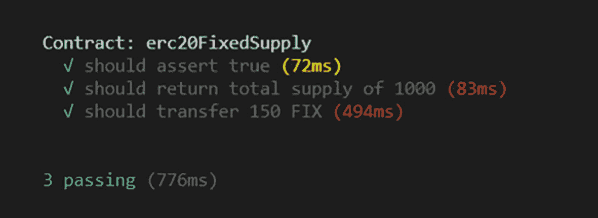
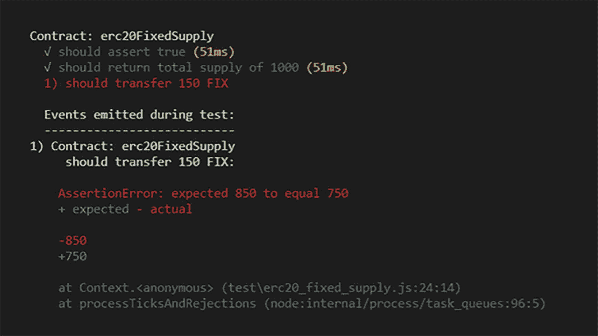

# 4. 智能合约的单元测试

单元测试用于检验代码执行场景，确保其表现符合预期。最关键的是，单元测试允许你重构代码、进行新修改，同时不破坏现有功能。

在智能合约中，单元测试更为重要，因为合约一旦部署，除非部署新合约，否则无法修复。因此，将单元测试纳入你编写的所有智能合约，并尽可能追求高覆盖率，这一点至关重要。

在本章中，你将学习如何使用 `Mocha` 作为测试运行器、`Chai` 作为断言库来编写单元测试。

学完本章，你将能够实现以下目标：

- 创建单元测试文件
- 为智能合约编写单元测试
- 编写测试断言
- 运行单元测试
- 检查单元测试结果

## 为 ERC-20 智能合约编写单元测试

`Truffle` 默认包含一个自动化测试框架，这大大简化了合约测试工作。该框架允许你通过多种方式创建基本且易于管理的测试。让我们开始编写第一个单元测试。

### 创建新的单元测试文件

打开一个新终端，执行以下命令：

```
$ truffle create test erc20FixedSupply
```

### 为总供应量合约编写测试

在 `ERC20FixedSupply.js` 文件中，编写一个新的测试，以断言合约创建时拥有 1,000 枚固定供应的代币。

```javascript
const erc20FixedSupply = artifacts.require("erc20FixedSupply");
contract("erc20FixedSupply", function () {
it("should assert true", async function() {
let token = await erc20FixedSupply.deployed();
let name = await token.name();
assert.equal(name, 'Fixed');
});
it("should return total supply of 1000", async function() {
const instance = await erc20FixedSupply.deployed();
const totalSupply = await instance.totalSupply();
assert.equal(totalSupply, 1000);
});
});
```

使用以下命令进行测试：

```
$ truffle test --network development
```

确保测试能够通过。

### 为余额合约编写测试断言

在 `ERC20FixedSupply.js` 文件中，再添加一个测试，用于断言在两个账户之间进行新转账后，余额是否正确。

```javascript
it("should transfer 150 FIX", async function(){
const instance = await erc20FixedSupply.deployed();
await instance.transfer(account[1], 150);
const balanceAccount0 = await instance.balanceOf(accounts[0]);
const balanceAccount1 = await instance.balanceOf(accounts[1]);
assert.equal(balanceAccount0.toNumber(), 850);
assert.equal(balanceAccount1.toNumber(), 150);
});
```

### 运行单元测试

现在，再次执行测试。

```
$ truffle test --network development
```

再次确保所有测试都通过。如果单元测试通过，将出现一个绿色勾选标记；否则，将出现一个红色 x 符号。

### 检查单元测试结果

确保你得到与 `图 4-1` 相同的输出。



VS Code 的屏幕截图显示以下输出。`Contract: erc20FixedSupply.` 勾选标记：should assert true，72 毫秒。勾选标记：should return total supply of 1000，83 毫秒。勾选标记：should transfer 150 FIX，494 毫秒，3 个通过，776 毫秒。

`图 4-1`

VS Code：单元测试结果成功

尝试更改一些值，例如账户余额，并观察结果如何从通过变为失败，如 `图 4-2` 所示。



VS Code 的屏幕截图显示以下输出。`Contract: erc20FixedSupply;` 勾选标记：should assert true：51 毫秒；勾选标记：should return total supply of 1000，51 毫秒；1，should transfer 150 FIX。下一部分显示测试期间发出的事件及其详细信息和解释。

`图 4-2`

VS Code：单元测试结果失败

```javascript
it("should transfer 150 FIX", async function(){
const instance = await erc20FixedSupply.deployed();
await instance.transfer("account[1]", 150);
const balanceAccount0 = await instance.balanceOf(accounts[0]);
const balanceAccount1 = await instance.balanceOf(accounts[1]);
assert.equal(balanceAccount0.toNumber(), 750);
assert.equal(balanceAccount1.toNumber(), 250);
});
```

## 本章小结

在本章中，你了解了为智能合约编写单元测试的重要性，并编写了你的第一个单元测试。

下一章，我们将探讨 ERC-721 代币标准及其与 ERC-20 的区别。此外，你还将学习如何创建和部署该标准下的合约。