# 5. ERC-721 同质化代币

非同质化代币是一种数字资产，它代表了实物对象，例如艺术品、音乐、游戏内物品和视频。在本章中，我将向你展示如何创建一个 NFT ERC-721 并将其部署到以太坊测试网，以及如何将其添加到你的`MetaMask`移动钱包。

学完本章，你将能够实现以下目标：
- 创建新的 NFT 项目
- 配置部署到`Ganache`的网络
- 配置私钥
- 创建徽章图像
- 将徽章添加到本地`IPFS`
- 将徽章固定到远程`IPFS`
- 创建徽章元数据
- 部署智能合约
- 将徽章授予你的钱包
- 在`Etherscan`上查看徽章
- 将徽章添加到你的移动钱包

## 使用 Ganache 和 OpenZeppelin 创建你的艺术 NFT

让我们使用`OpenZeppelin`库配置你的第一个 NFT，并创建用于存储代币信息的元数据，然后将其部署到测试网络。最后，你将在钱包中查看该代币。

### 创建项目

使用`Truffle`创建一个新项目。

```
$ truffle init
```

安装`OpenZeppelin`合约。

```
$ npm install @openzeppelin/contracts
```

创建一个新的`Solidity`智能合约。

```
$ touch contracts/UniqueAsset.sol
```

打开`UniqueAsset.sol`文件，导入`ERC721URIStorage.sol`扩展和`Counters.sol`工具。创建一个继承自`ERC721URIStorage`的新类。声明计数器变量，并声明构造函数，传入代币名称和代码。

创建一个名为`awardItem`的新方法。在该新方法内部，递增代币 ID。使用`_tokenIds.current()`获取新的代币编号。

使用`_mint`方法铸造一个新项目。最后，使用`_setTokenURI`方法设置传入元数据的代币 URI。

```
// SPDX-License-Identifier: MIT
pragma solidity ⁰.8.0;
import "@openzeppelin/contracts/token/ERC721/extensions/ERC721URIStorage.sol";
import "@openzeppelin/contracts/utils/Counters.sol";
contract UniqueAsset is ERC721URIStorage {
using Counters for Counters.Counter;
Counters.Counter private _tokenIds;
constructor() ERC721("UniqueAsset", "UNA") {}
function awardItem(address recipient, string memory metadata)
public
returns (uint256)
{
_tokenIds.increment();
uint256 newItemId = _tokenIds.current();
_mint(recipient, newItemId);
_setTokenURI(newItemId, metadata);
return newItemId;
}
}
```

使用`touch`命令创建一个新的迁移文件。此命令会在`migrations`文件夹中创建一个新文件。

```
$ touch migrations/2_deploy_contracts.sol
```

在`2_deploy_contracts.js`文件中，在迁移文件中导出智能合约。

```
const UniqueAsset = artifacts.require("UniqueAsset");
module.exports = function (deployer) {
deployer.deploy(UniqueAsset);
}
```

### 配置钱包以签署交易

安装文件系统`fs`包。

```
$ npm install fs
```

安装钱包提供程序`hdwallet`包。

```
$ npm install @truffle/hdwallet-provider@1.2.3
```

打开`truffle-config.js`文件并取消注释`HDWalletProvider`代码段。

```
const HDWalletProvider = require('@truffle/hdwallet-provider');
const infuraKey = '';
const fs = require('fs');
const mnemonic = fs.readFileSync(".secret").toString().trim();
```

将您的 Infura 项目 ID 粘贴为变量`infuraKey`的值。

### 配置网络

在`truffle-config.js`文件内，取消注释`ropsten`网络部分并进行以下更改：
*   将`ropsten`更改为`rinkeby`。
*   将 Ropsten Infura URL 更改为`rinkeby`。
*   将`YOU-PROJECT-ID`更改为`${infuraKey}`。
*   将`network_id`更改为`42`。

```
rinkeby: {
provider: () => new HDWalletProvider(mnemonic, `https://rinkeby.infura.io/v3/${infuraKey}`),
network_id: 42,
gas: 5500000,
confirmations: 2,
timeoutBlocks: 200,
skipDryRun: true
},
```

### 配置 Solidity 编译器

同样，在`truffle-config.js`文件内，取消注释`compilers`部分并将版本更改为 0.8.0。

```
compilers: {
solc: {
version: "0.8.0",
docker: true,
settings: {
optimizer: {
enabled: false,
runs: 200
},
evmVersion: "byzantium"
}
}
},
```

### 配置私钥

转到您的浏览器，打开连接到 Infura 网络的`MetaMask`钱包。点击您的账户，然后点击“设置”。最后，点击“安全与隐私”（图 5-1）。

您可以选择查看您的助记词，但请注意此信息非常敏感，如果有人获取了它，他们将能够恢复您的钱包并使用您的资金。

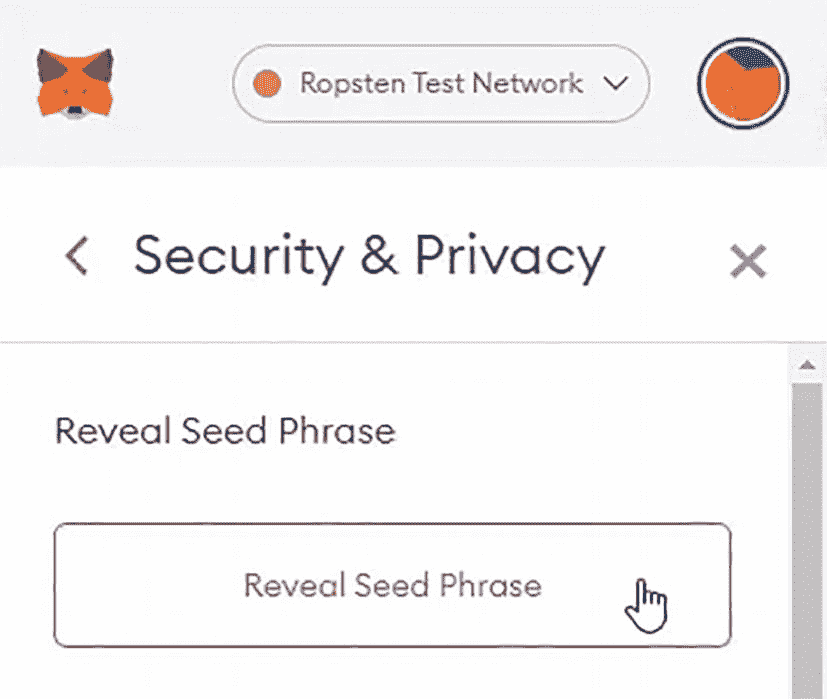

图 5-1 `MetaMask`：显示助记词

点击“显示助记词”并输入您的钱包密码以继续。复制私钥。

返回 Visual Studio Code 并创建一个名为`.secret`的新文件。将私密恢复短语粘贴到此文件中。

#### 创建徽章图像

创建`badge`文件夹。

```
$ mkdir badge
```

现在，进入`badge`根文件夹。

```
$ cd badge
```

从互联网下载您将用作徽章的图像。您也可以将现有图像复制并粘贴到此文件夹中。`curl`命令用于通过 URL 语法传输数据。

```
$ curl https://planouhost.z15.web.core.windows.net/badge.png > badge-image.png
```

#### 将徽章添加到本地 IPFS

初始化本地 IPFS 节点。此命令将在 127.0.0.1:5001 上启动一个 IPFS 本地服务器。

```
$ ipfs daemon
```

将您的徽章图像添加到 IPFS。

```
$ ipfs add badge-image.png
```

运行此命令后，您将收到一个哈希值。此哈希值是您在 IPFS 中的图像地址。确保您看到如图 5-2 所示的输出。

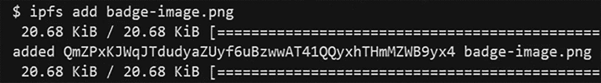

图 5-2 添加文件后的 IPFS 输出

#### 将徽章固定到远程 IPFS 节点

使用 Pinata 作为远程 IPFS 服务固定您的徽章。

```
ipfs pin remote add --service=pinata --name=badge-image.png QmZPxKJWqJTdudyaZUyf6uBzwwAT41QQyxhTHmMZWB9yx4
```

您将收到一条响应，指示文件已成功固定。

```
CID: QmZPxKJWqJTdudyaZUyf6uBzwwAT41QQyxhTHmMZWB9yx4
Name: badge-image.png
Status: pinned
```

#### 创建徽章元数据

创建徽章元数据 JSON 文件。

```
touch badge-metadata.json
```

打开`badge-metadata.json`文件，设置徽章名称、描述和图像地址。对于最后一项，您可以使用 IPFS 网关，以便图像能在任何支持此类徽章类型的钱包中显示；否则，您将依赖于目标钱包能否直接支持从 IPFS 哈希显示图像。

```
{
"name": "我的徽章",
"description": "我的徽章描述",
"image": "https://ipfs.io/ipfs/QmZPxKJWqJTdudyaZUyf6uBzwwAT41QQyxhTHmMZWB9yx4"
}
```

将您的徽章元数据添加到 IPFS。

```
$ ipfs add badge-metadata.json
```

使用远程 IPFS 服务固定您的徽章元数据。

```
$ ipfs pin remote add --service=pinata --name=badge-metadata.json QmRzcwAtLWBeYqyaZUyf6uBzwwAT41QQyxhTHmMZWBfUTa
```

### 编译智能合约

使用 Truffle 编译合约。

```
$ truffle compile
```

### 迁移智能合约

使用 Truffle 将合约迁移到 Rinkeby 网络。

```
$ truffle migrate --network rinkeby
```

### 实例化智能合约

使用 Truffle 控制台实例化合约。

```
$ truffle console --network rinkeby
```

获取已部署合约的实例。

```
truffle(rinkeby) let instance = await UniqueAsset.deployed()
```

### 向钱包授予徽章

调用`awardItem`方法，将以太坊地址作为第一个参数，将徽章元数据的 IPFS 地址作为第二个参数。确保 IPFS 地址与您的徽章元数据对应。

```
truffle(rinkeby) let result = await instance.awardItem("0x62761466bB3A3Da83B408B5F5fE00ac7b2a5A996","https://ipfs.io/ipfs/QmRzcwAtLWBeYqUx3ba1BkYKubSDLNTHCuiUB7WAmdfUTa")
```

### 在 Etherscan 上检查徽章

合约部署后，您将能看到合约的公共地址。在终端中找到创建的合约地址并复制它。

转到`https://rinkeby.etherscan.io`并将合约地址粘贴到搜索栏中（图 5-3）。您可以使用 Rinkeby 测试网浏览器工具查看所创建智能合约的详细信息。

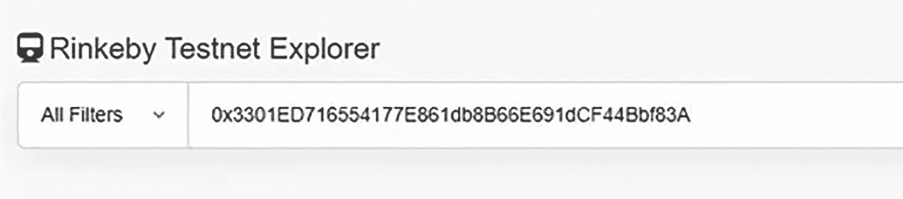

图 5-3 Rinkeby 测试网浏览器：搜索智能合约

点击搜索图标。现在您可以看到合约已成功部署（图 5-4）。在此详情页面上，您可以查看交易等数据。

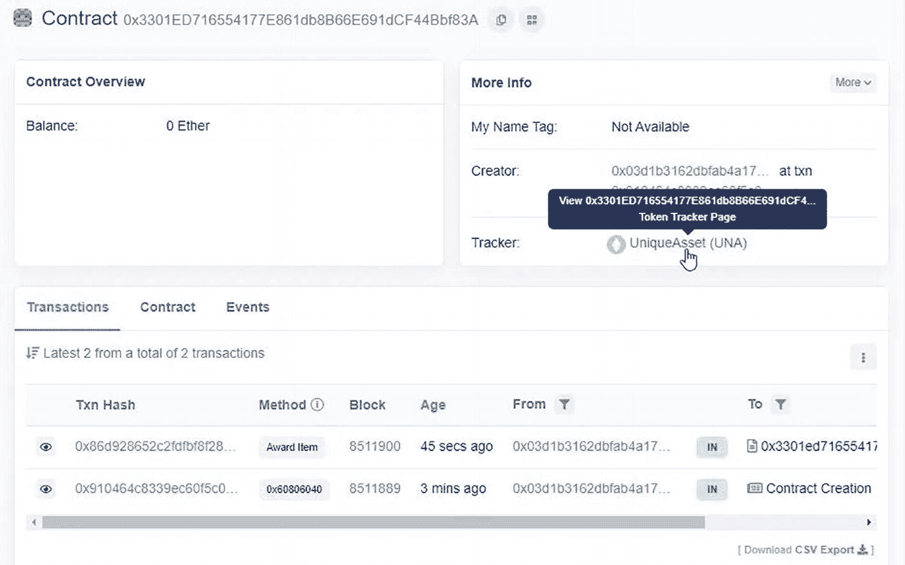

图 5-4 Rinkeby 测试网浏览器：查看智能合约交易

您还可以看到，最后一次交易是为了授予一个新项目。

### 将 NFT 代币添加到你的钱包

在你的手机上打开`MetaMask`钱包，然后点击**收藏品**（图 5-5）。请注意，收藏品仅在移动版本中可用。

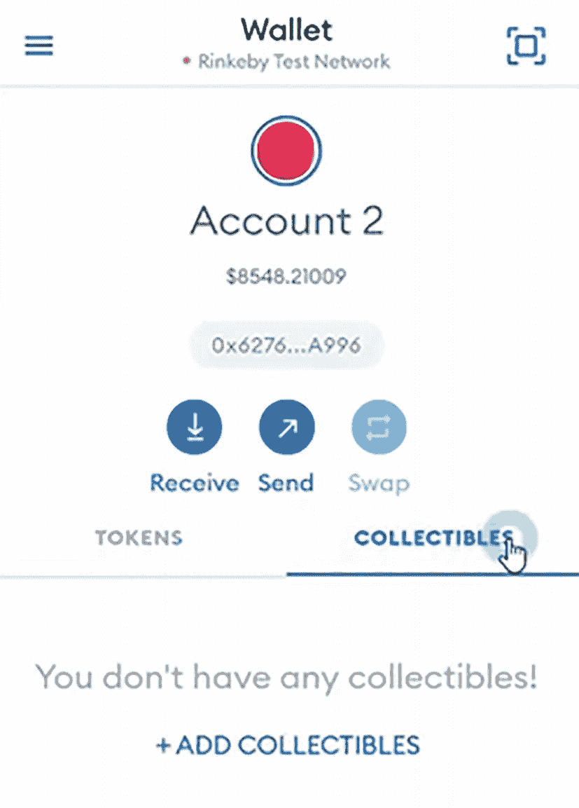

图 5-5 `MetaMask`：收藏品标签页

点击**添加收藏品**。在此处粘贴代币合约地址（与你之前复制的那一个相同），并输入代币 ID（由于这是你的第一个代币，请输入`1`）。

点击**添加**，等待几秒钟（图 5-6）。NFT 代币已添加成功！

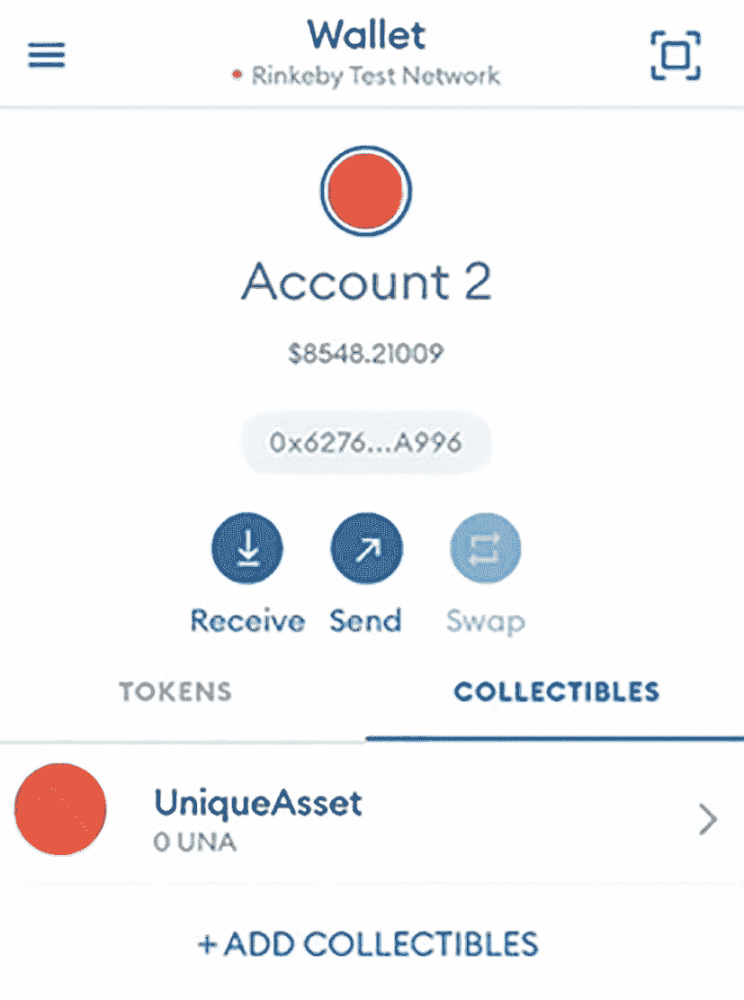

图 5-6 `MetaMask`：添加智能合约后，它将在此处显示

点击`UniqueAsset`。现在你可以看到你获得的所有徽章（图 5-7）。你可以拥有来自同一个智能合约的多个代币，每个代币将通过唯一的标识符进行区分。

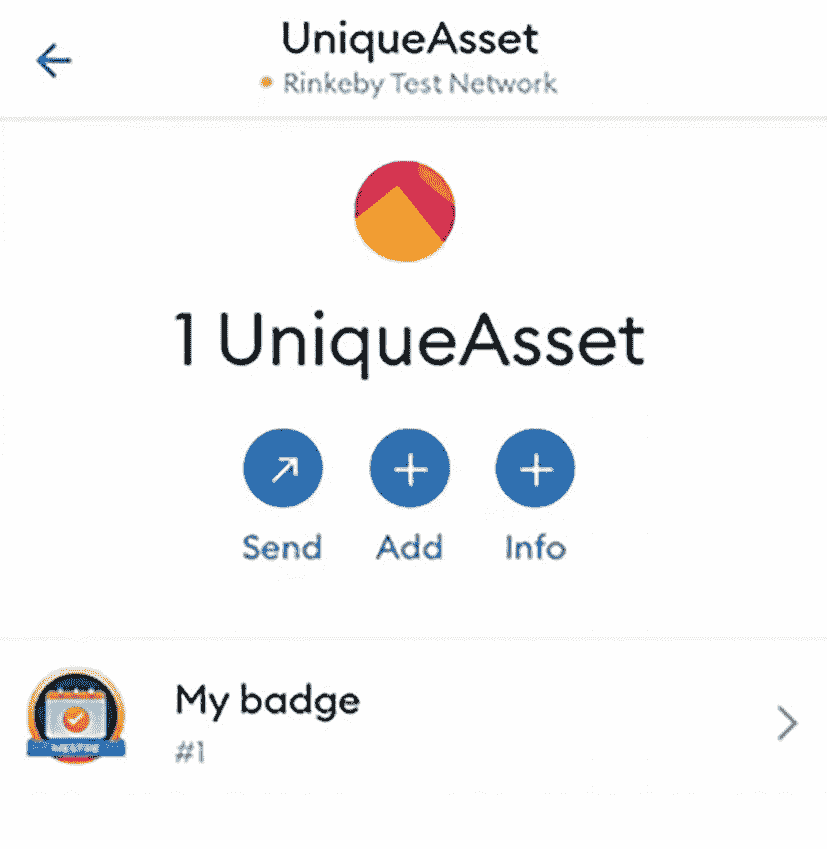

图 5-7 `MetaMask`：徽章列表

点击**我的徽章**。现在你可以看到徽章的详细信息！此外，你还有一个**发送**按钮，可以将徽章发送到另一个钱包（图 5-8）。

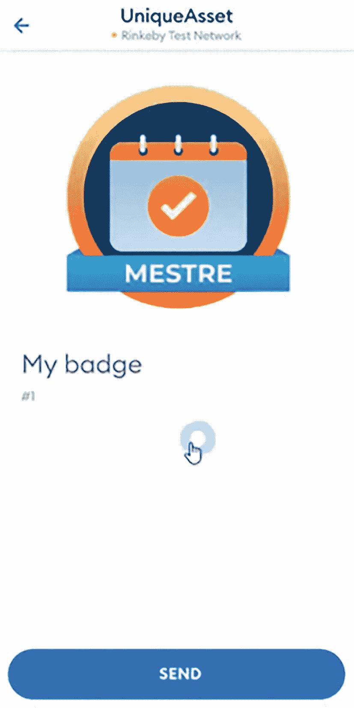

图 5-8 `MetaMask`：徽章展示

就是这样！你刚刚创建了你的第一个 NFT 代币！

## 在 OpenSea 上出售你的艺术品 NFT

OpenSea 是一个数字商品市场，例如收藏品、游戏物品、数字艺术以及其他由以太坊等区块链支持的数字资产。你可以在 OpenSea 上与世界上任何人购买、出售和交易这些物品。

### 连接到 OpenSea

前往 OpenSea^(²⁰)，确保你已连接到包含该 NFT 的钱包，并且你正在使用 `Rinkeby` 测试网络。

### 查看你的徽章

前往“我的个人资料”。点击“活动”，然后点击“徽章标题”。这些就是你的徽章详细信息。详情页面允许你查看与徽章交易相关的各种信息。

### 挂牌出售你的徽章

点击“出售”，然后点击“设置价格”。在“价格”中，设置你期望出售该 NFT 的价格。在此页面，你可以设置徽章的定价方式，并安排其在未来某个日期上架（图 5-9）。

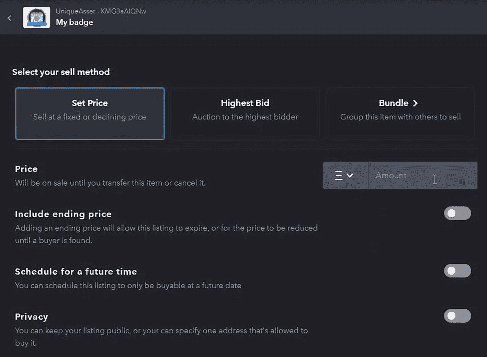
图 5-9 OpenSea：徽章定价页面。截图显示有“设置价格”、“最高出价”和“捆绑”三个选项，下方有价格输入框，以及“包含结束价格”、“安排在未来时间”和“隐私”的开关选项。

点击“发布你的清单”。你将被重定向到“摘要”页面（图 5-10）。在此页面，你可以看到出售徽章时将扣除的总费用。

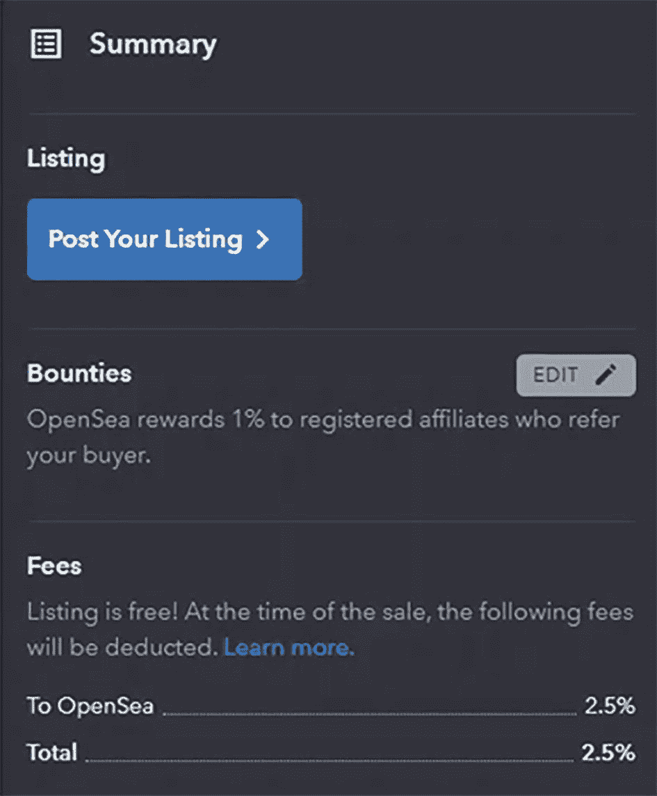
图 5-10 OpenSea：徽章的摘要页面。截图包含“清单”、“赏金”和“费用”三个部分。

`MetaMask` 将被打开以验证交易（图 5-11）。点击“确认”。在此步骤中，你需要批准交易，该交易将确认你的徽章在平台上挂牌出售。

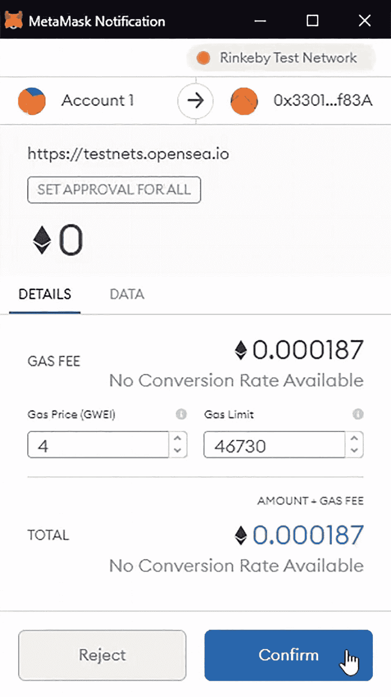
图 5-11 `MetaMask`：确认 OpenSea 交易。通知窗口显示网络和账户信息，并包含“详情”和“数据”标签页以及“拒绝”和“确认”按钮。

现在，你需要提供一些关于你自己的更多详细信息，例如你的电子邮件和昵称。交易被批准后，系统会要求你提供额外信息（图 5-12）。

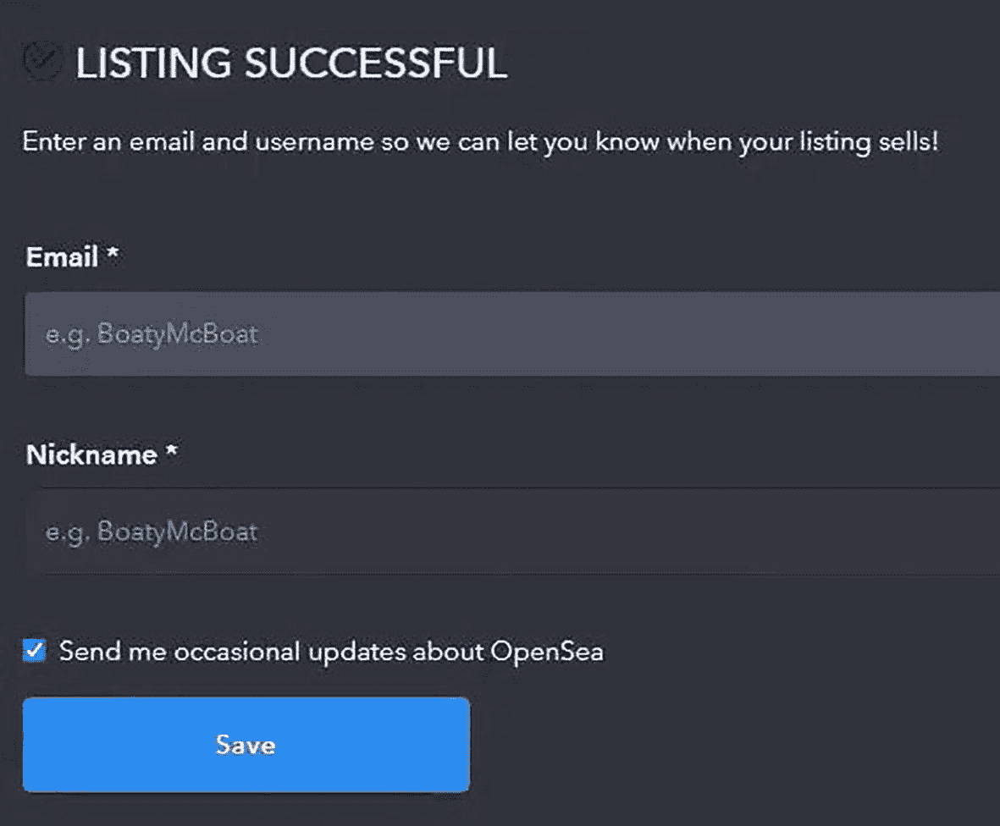
图 5-12 OpenSea：额外信息。窗口标题为“清单创建成功”，要求输入电子邮件和昵称，并有“保存”按钮。

点击“保存”。现在，OpenSea 将为你列出你的 NFT！

### 探索清单详情

向下滚动到“交易历史”（图 5-13）；如你所见，创建了一个名为“清单”的新事件，其“价格”设置为 10 美元。在此页面，你可以查看该徽章在平台上的所有交易历史记录。

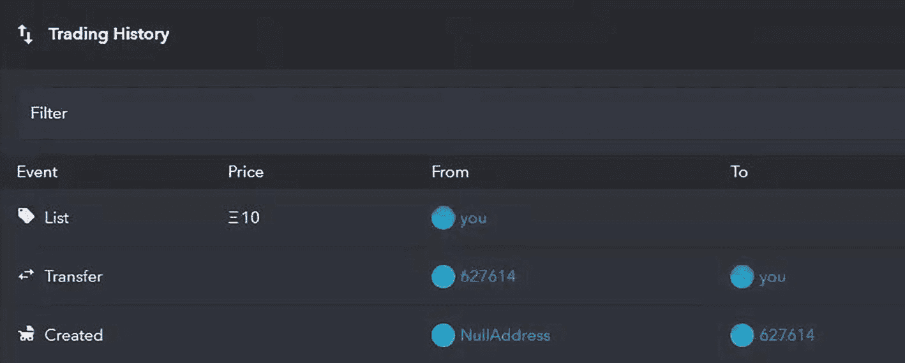
图 5-13 OpenSea：交易历史。页面包含“筛选器”以及“事件”、“价格”、“来自”和“至”列。

点击“分享”图标。你可以复制链接或将其分享到你的社交网络。

## 本章小结

在本章中，你学习了如何创建 `ERC-721` 标准的代币，在 `IPFS` 中固定图像，并将其导入 `OpenSea` 并挂牌出售。

在下一章中，我们将了解如何使用水龙头以及它们为什么在测试网络中很重要。

脚注 1