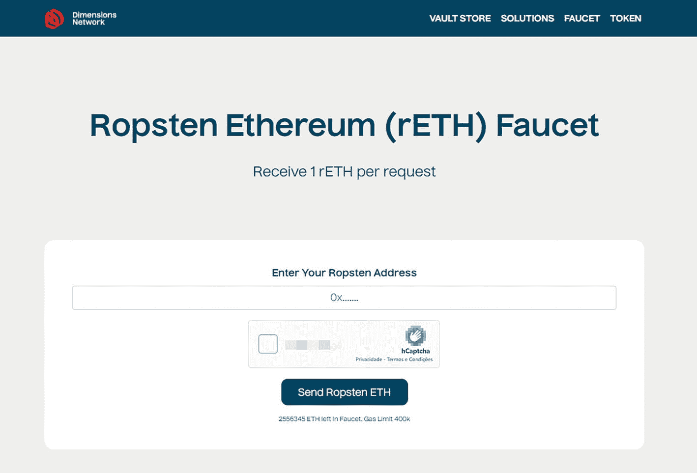
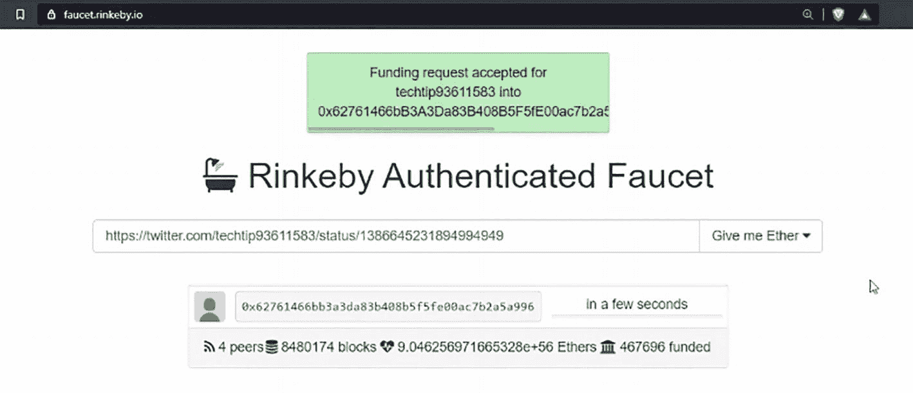
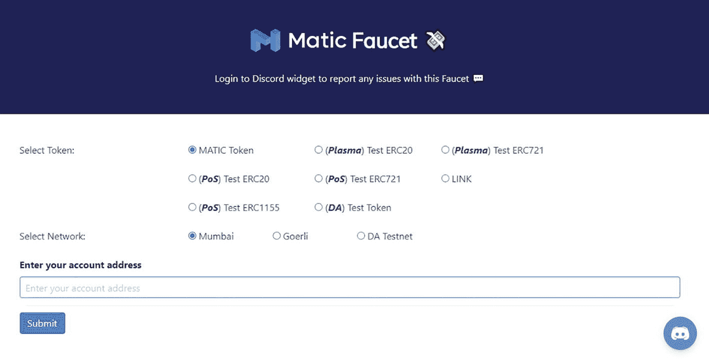
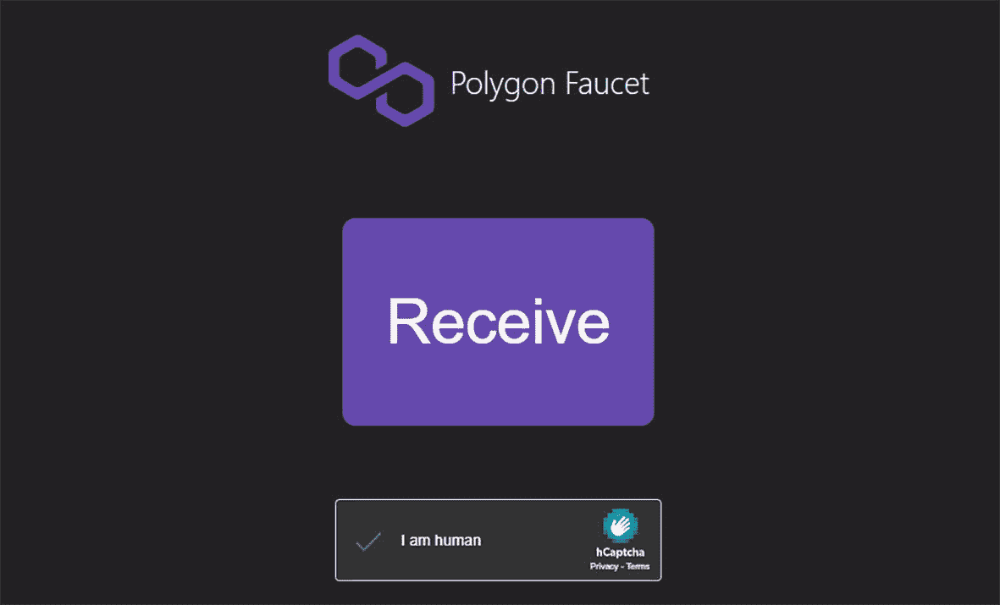

# 水龙头

你可以使用水龙头在测试网络上测试智能合约，而无需为此使用真正的以太币（因为主网上的以太币在测试网络中无效，反之亦然）。测试网络中的以太币除了用于智能合约开发的测试目的外，没有实际价值。

在本章结束时，你将能够执行以下操作：

-   访问 `Ropsten` 网络上的水龙头
-   访问 `Rinkeby` 网络上的水龙头
-   访问 `Polygon Mumbai` 测试网络上的水龙头
-   访问 `Polygon` 主网络上的水龙头
-   将测试以太币发送到你的钱包
-   将测试 `MATIC` 发送到你的钱包
-   检查钱包中的更新余额

## 从 Ropsten 网络的水龙头获取测试以太币

这个以太坊测试水龙头^(²¹)每五秒滴出 1 个以太币。出于防止网络滥用的考虑，你每 24 小时至多只能请求 1 个以太币。

### 访问水龙头

前往 Ropsten 以太坊（rETH）水龙头^(²²)并复制你的钱包地址（确保所选网络为 Ropsten）。将你的合约地址粘贴到表单字段中。点击“发送 Ropsten ETH”，如图 6-1 所示。

Ropsten 水龙头主页截图，中央显示“Ropsten Ethereum r E T H Faucet”。其下方文字为“每次请求可接收 1 r E T H”。再下方提供了一个用于输入 Ropsten 地址的区域，其后是验证码和一个标有“Send Ropsten E T H”的按钮。

**图 6-1**  
Ropsten 水龙头主页

### 等待交易

点击交易哈希（将打开一个新窗口），等待交易完成。一旦交易成功完成，前往你的 MetaMask 钱包，你会看到自己现在拥有了 1 个以太币！

## 从 Rinkeby 测试网的水龙头获取测试以太币

这个以太币水龙头连接到 Rinkeby 网络。请求与常见的第三方社交网络账户绑定，以防止恶意行为者耗尽所有可用资金或积累足够的以太币来发动长期垃圾攻击。任何拥有 Twitter 或 Facebook 账户的人都可以在限额内请求资金。

### 准备充值

打开你的 MetaMask 钱包并将钱包地址复制到剪贴板。前往你的 Twitter 账户并粘贴你的钱包地址。点击你的推文并复制推文地址（地址栏中的 URL）。

### 为钱包充值

访问`https://faucet.rinkeby.io`，在文本字段中粘贴你的推文地址，如图 6-2 所示。点击“Give me Ether”并选择可用的选项之一（例如，3 个以太币 / 8 小时）。请求将在几秒钟内完成充值。

需要注意的是，可用的水龙头有多种多样。其中一些可能会不时枯竭，或者随着时间的推移停止运作。甚至可能会有新的水龙头出现。如果其中任何一个无法使用，你可以在互联网上搜索新的。

Rinkeby 水龙头主页截图显示“Funding request accepted for techtip 9 3 6 1 1 5 8 3 into”，后面跟着 Ropsten 地址。中央文字为“Rinkeby Authenticated Faucet”，带有一个 Twitter 链接和一个“Give me Ether”选项。下方提供了几个代码和其他任务细节。

**图 6-2**  
Rinkeby 水龙头主页

### 检查你的钱包

稍等片刻，检查你的 MetaMask 钱包。你的钱包账户将收到 3 个以太币！

## 从 Mumbai 测试网的水龙头获取测试 MATIC

此水龙头在 Matic 测试网及对应的主链上转移 TestToken/MATIC-ETH。

### 准备充值

打开你的 MetaMask 钱包并将钱包地址复制到剪贴板。

### 为钱包充值

访问`https://faucet.matic.network`。对于代币，选择 MATIC Token，对于网络，选择 Mumbai。在文本字段中粘贴你的钱包地址并点击提交（图 6-3）。将为你提供确认详情。点击确认。请求将在几秒钟内完成充值。

Matic 水龙头网页截图显示：“Login to Discord widget to report any issues with this Faucet”。在“Select token”旁边，提供了许多选项并带有勾选选项。下方有一个“Select Network”部分，提供了 3 个选项。底部有一个输入账户地址并提交数据的栏。

**图 6-3**  
Matic 水龙头主页

### 检查你的钱包

稍等片刻，检查你的 MetaMask 钱包。你的钱包账户将收到 0.1 个 MATIC！

## 从主网的水龙头获取测试 MATIC

此水龙头在 Polygon 测试网及对应的主链上转移 TestToken/MATIC-ETH。

### 准备充值

打开你的 MetaMask 钱包并将钱包地址复制到剪贴板。

### 为钱包充值

访问`https://matic.supply`并点击“Connect”以连接你的 MetaMask 钱包（图 6-4）。确保你的 MetaMask 钱包已连接到 Matic 主网。点击“I am human”并解决验证码。

Polygon 水龙头主页截图，顶部有标志和名称，中央有一个大大的“Receive”按钮。按钮下方是一个带有验证码的复选框。

**图 6-4**  
Polygon 水龙头主页

### 检查你的钱包

稍等片刻，检查你的 MetaMask 钱包。你的钱包刚刚收到了 0.001 个 MATIC！

## 总结

在本章中，你学习了如何从互联网上的水龙头获取测试以太币。这对于在测试网络上部署合约非常有用，因为你无需花费真正的以太币。

脚注 1 2

