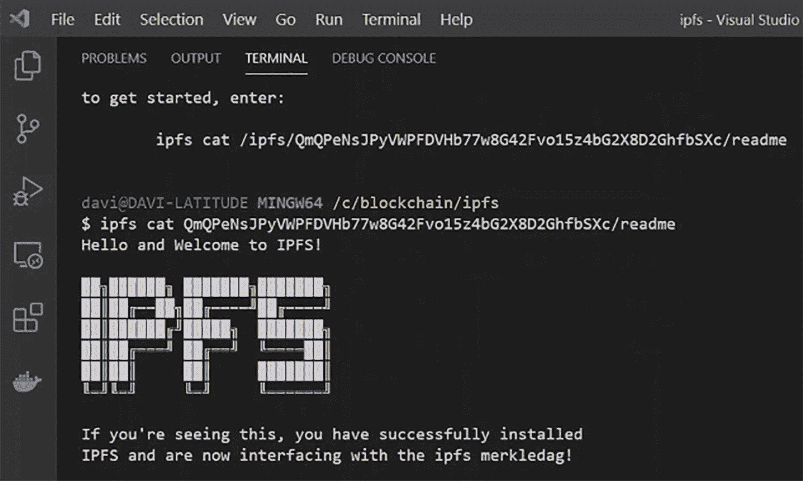
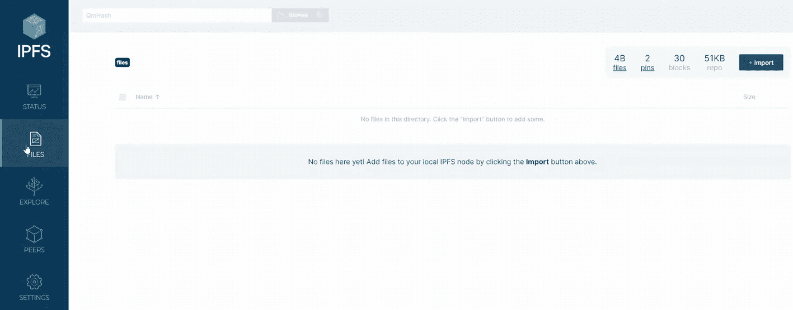
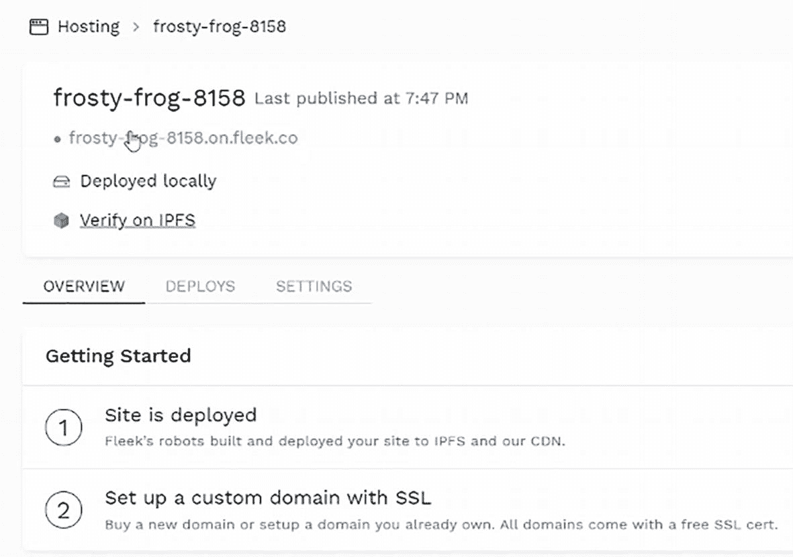

# 7. 星际文件系统

星际文件系统^(²³)（IPFS）是一种协议和点对点网络，允许在分布式文件系统中存储和共享数据。IPFS 采用内容寻址来区分一个连接所有计算设备的全局命名空间中的每个文件。

在本章结束时，你将能够执行以下操作：

- 安装 IPFS 节点包并初始化一个节点
- 查看 IPFS 节点对等点
- 测试和探索 IPFS 节点
- 向 IPFS 添加文件
- 在控制台上查看文件内容并在 Web UI 中检查文件
- 直接在浏览器中查看文件内容
- 安装 IPFS 浏览器扩展
- 配置 IPFS 节点类型并启动一个节点
- 将文件导入 IPFS 节点
- 启动本地 IPFS 节点并向其添加文件
- 检查已添加的文件并验证文件是否已被固定
- 手动固定文件
- 在 Pinata 上设置 API 密钥
- 将 Pinata 设置为远程服务
- 将文件固定到远程 IPFS 节点，并解除固定
- 登录 Fleek
- 克隆现有仓库
- 安装并初始化 Fleek 包
- 将站点部署到 Fleek

## 创建您的 IPFS 节点

现在，让我们使用命令行创建一个 IPFS 节点，并上传您的第一个文件。

### 安装节点

使用 Choco 包管理器安装 IPFS。^((24)) `go-ipfs` 包是用 Go 语言实现的 IPFS 版本。

```
$ choco install go-ipfs
```

### 配置节点

初始化 IPFS 本地仓库。

```
$ ipfs init
```

启动 IPFS 本地服务器。`daemon` 命令会在 `127.0.0.1:5001` 上启动一个 IPFS 本地服务器。

```
$ ipfs daemon
```

### 测试节点

您可以通过显示与您的节点直接连接的对等点来测试 IPFS 节点。

```
$ ipfs swarm peers
```

您还可以使用 `cat` 命令并将哈希值作为参数传递来查看一些 IPFS 文件内容（图 7-1）。



这是一张 IPFS 命令输出的截图，显示已打开的终端标签页并附带了链接。下方文字显示“Hello and Welcome to IPFS”，其中 IPFS 字体较大且样式化。底部文字显示“If you're seeing this, you have successfully installed IPFS and are now interfacing with the ipfs merkledag”。

`图 7-1` IPFS `cat` 命令的输出

```
$ ipfs cat
```

### 探索您的 IPFS 节点

打开浏览器，访问 Web UI 地址 `http://127.0.0.1:5002/`。您的节点已连接到 IPFS！现在，点击“Files”并注意，这里还没有任何文件（图 7-2）。

点击“Explore”，然后点击“Peers”。这些是您连接到的对等点。最后，点击“Settings”。您可以在该界面看到节点设置。



这是一张 IPFS Web UI 的截图，包含以下图标：Status、Files（鼠标悬停在此）、Explore、Peers 和 Settings。在 Files 窗口中，显示一条提示：“No files here yet! Add files to your local IPFS node by clicking the Import button above.”。右上角区域包含导入按钮及其他详细信息。

`图 7-2` IPFS Web UI

## 向 IPFS 添加文件

运行 IPFS 的计算机可以向其连接的所有对等点询问它们是否拥有具有特定哈希值的文件，如果某个对等点拥有该文件，则该对等点会发回整个文件。如果没有一个简短且唯一的标识符（例如加密哈希值），这是不可能实现的。

### 添加文件

启动 IPFS 本地服务器。`daemon` 命令会在 `127.0.0.1:5001` 上启动一个 IPFS 本地服务器。

```
$ ipfs daemon
```

现在，使用 `echo` 命令创建一个名为 `hello.txt` 的新文件。该命令会将给定的文本输出到一个新文件中。

```
$ echo "test" hello.txt
```

使用 `ipfs add` 命令将新创建的文件添加到您的本地 IPFS 节点。

```
$ ipfs add hello.txt
```

该文件已添加到 IPFS，并生成一个哈希标识符。

### 在控制台上查看文件内容

您可以使用 `ipfs cat` 命令加上哈希值来查看这个新添加文件的内容。为此，请将 `<your_hash>` 代码片段替换为上一步中通过命令 `ipfs add hello.txt` 生成的结果哈希标识符。

```
$ ipfs cat
```

运行此命令后，文件内容将显示在终端上。

### 在 Web UI 中检查文件

转到 `http://127.0.0.1:5001/webui` 并点击“Files”。然后，点击“Pins”并复制哈希值。使用此哈希值进行搜索，您将看到该哈希值已存在。

### 在浏览器中查看文件内容

打开一个新标签页，访问 `ipfs://<your_hash>`。现在您可以在浏览器中看到您的文件内容。再次提醒，请将 `<your_hash>` 代码片段替换为通过命令 `ipfs cat <your_hash>` 为您的文件生成的结果哈希标识符。

## 设置 IPFS 浏览器扩展

IPFS Companion 扩展^((25)) 允许您在首选浏览器内本地运行一个 IPFS 节点，支持 `ipfs://` 地址、网站和文件路径的自动 IPFS 网关加载、简单的 IPFS 文件导入和共享等功能。

### 安装浏览器扩展

访问 IPFS Companion 扩展^((26)) 页面，然后点击“Add to Brave”或您浏览器的名称。点击“Add extension”，然后点击“Extensions”图标。最后，将 IPFS Companion 扩展固定在扩展栏上。

### 配置节点类型

点击 IPFS Companion 图标，然后点击齿轮图标。对于“IPFS Node Type”，选择“External”。

### 启动外部节点

打开 Visual Studio Code，并新建一个终端。启动一个新的 IPFS 本地服务器。

```
$ ipfs daemon
```

### 导入文件

点击 IPFS Companion 图标，然后点击“Import”。点击“Pick a file”并从本地磁盘中选择一个文件。该文件将存储在您的 IPFS 节点中。

## 在本地节点上固定和取消固定 IPFS 文件

数据可以固定到一个或多个 IPFS 节点，以确保它保留在 IPFS 上，并且在垃圾回收期间不会被删除。固定文件可以让您管理存储空间和数据保留策略。因此，您应该固定任何您希望永久保留在 IPFS 上的内容。IPFS 的默认行为是将文件固定到您的本地 IPFS 节点。

### 启动本地节点

启动 IPFS 本地服务器。`daemon` 命令会在 `127.0.0.1:5001` 上启动一个 IPFS 本地服务器。

```
$ ipfs daemon
```

### 向节点添加文件

现在，使用 `echo` 命令创建一个名为 `hello.txt` 的新文件。该命令会将给定的文本输出到一个新文件中。

```
$ echo "world" hello.txt
```

使用 `ipfs add` 命令将新创建的文件添加到您的本地 IPFS 节点。

```
$ ipfs add hello.txt
```

该文件已添加到 IPFS，并生成一个哈希标识符。当您添加文件时，它会自动固定到您的本地节点。

### 检查文件是否已添加

要检查文件是否已添加，您可以使用 `ipfs cat` 命令将文件内容输出到终端。

```
$ ipfs cat your_file_hash
```

### 验证文件已固定

转到 `http://127.0.0.1:5001/webui`，点击“Files”，然后点击“Pins”。您的文件就在那里！

### 取消固定文件

您可以使用以下命令简单地取消文件中您在本地 IPFS 节点的固定：

```
$ ipfs pin rm
```

### 手动固定文件

您可以使用以下命令手动固定文件。请记住，您需要复制文件的哈希值才能固定或取消固定它。

```
$ ipfs pin add
```

完成！您的文件已再次被固定。

## 使用 Pinata 在远程节点上固定与取消固定文件

您还可以将文件固定到远程固定服务。这些第三方服务允许您将文件固定到它们运营的节点上，而非您自己的本地节点。您无需担心自己节点的磁盘空间或运行时间。

虽然您可以使用远程固定服务自身的图形用户界面、命令行或其他开发工具来管理固定到该服务的 IPFS 文件，但您也可以利用本地 IPFS 安装直接与固定服务交互，从而无需学习固定服务特有的 API 或其他工具。

### 在 Pinata 上设置 API 密钥

登录您的 Pinata 账户，进入 API 密钥页面。点击“新建密钥”，然后勾选“管理员”框。输入 `admin-cli` 作为密钥名称，最后点击“创建密钥”。系统将为您生成一个新密钥。请从此窗口中复制 JWT 值。

### 在终端中将 Pinata 设置为远程服务

将 Pinata 添加为远程固定服务。将您的 JWT 粘贴到 `<your_jwt_key>` 部分中。

```
$ ipfs pin remote service add pinata https://api.pinata.cloud/psa 
```

列出所有现有的远程服务，并确认 Pinata 已包含在内。

```
$ ipfs pin remote service ls
```

### 向本地 IPFS 节点添加新文件

向您的 IPFS 本地节点添加一个新文件。

```
$ echo "world" > hello.txt
$ ipfs add hello.txt
```

复制将文件添加到本地节点后生成的哈希标识符。

### 将文件固定到远程 IPFS 节点

使用以下命令固定您的文件。将文件哈希粘贴到 `<your_file_hash>` 部分中。

```
$ ipfs pin remote add --service=pinata -name=hello.txt 
```

返回 Pinata 网站，点击“固定管理器”。您的文件将出现在此页面上！

### 从远程 IPFS 节点取消固定文件

使用以下命令取消固定您的文件。将文件哈希粘贴到 `<your_file_hash>` 部分中。

```
$ ipfs pin remote rm --service=pinata -name=hello.txt 
```

返回 Pinata 网站，点击“固定管理器”。您的文件将不再出现在此页面上；这意味着您的文件已被取消固定。

## 使用 Fleek 在 IPFS 上托管您的网站

Fleek 使您能够基于开放 Web 协议创建基础层架构。在无需信任、无需许可、开放的技术上创建并托管您的网站、应用、去中心化应用和其他服务，这些技术旨在实现用户控制、加密、私密、点对点的体验。

### 登录 Fleek

访问 `https://fleek.co` 并使用您的账户登录；然后进入您的 VS Code 编辑器。

### 克隆您现有的仓库

克隆一个包含示例代码的现有仓库。

```
$ git clone https://github.com/johnnymatthews/random-planet-facts
```

### 安装 Fleek

安装 Fleek 命令行工具。

```
$ npm install -g @fleekhq/fleek-cli
```

登录到您的 Fleek 账户（系统将提示您在浏览器中完成流程）。

```
$ fleek login
```

### 初始化 Fleek

在当前目录中初始化 Fleek 站点。

```
$ fleek site:init
```

系统会要求您选择要使用的团队（使用方向键进行选择）。同时，选择要使用的站点。最后，选择用于部署的公共目录。

### 部署您的站点

在您的 `publish` 目录中部署更改。

```
$ fleek site:deploy
```

返回 Fleek 网站，点击“托管”，然后点击“在 IPFS 上验证”。这就是您在 IPFS 上托管的站点。您现在可以在线查看已部署的站点。

返回“托管”并点击 `your-site.on.fleek.co`。这是您站点主机的友好地址（如图 7-3 所示）。



`图 7-3` Fleek 托管概览

## 总结

在本章中，您学习了如何安装和创建 IPFS 节点，以及如何使用此协议管理文件。

在下一章中，您将学习如何创建一个 Filecoin 项目。