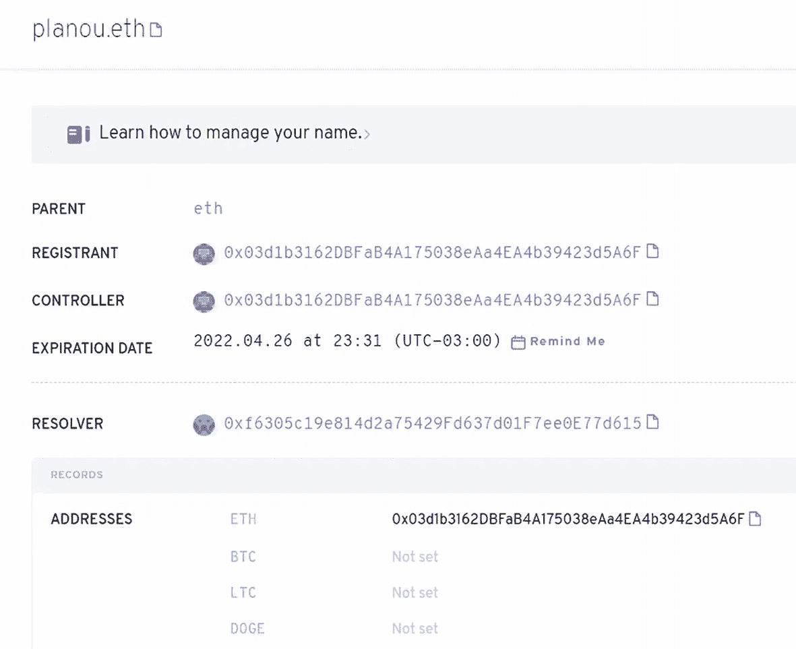
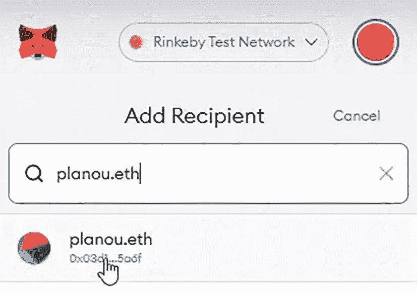

# 以太坊名称服务

## 注册你的 ENS 以在钱包中接收加密货币、代币或 NFT

让我们在 ENS 中搜索一个可用的域名并注册它。接下来，你将通过注册页面管理地址。最后，你将检查域名是否正确地解析到已配置的地址。

以太坊名称服务（ENS）允许用户使用简单名称而非冗长复杂的字母数字序列来发送和接收以太币，以及访问特定网站。

在本章结束时，你将能够完成以下任务：
*   在 ENS 网络上搜索域名
*   注册一个可用的域名
*   管理一个 ENS 注册名称
*   检查 ENS 名称解析

### 搜索你的域名

前往 ENS Domains^(²⁷) 页面，然后点击“启动应用程序”。搜索你想要注册的域名（例如，`planou.eth`）。检查注册期限（例如，至少一年）和注册价格。

### 注册你的名称

点击“请求注册”。将打开一个 MetaMask 通知以确认交易。点击“确认”并等待交易在区块链上被确认。一旦确认，点击“注册”。将出现一个新的 MetaMask 通知。再次点击“确认”并等待交易在区块链上被确认。

### 管理你的注册名称

点击“管理名称”并向下滚动到“地址”。注意，ETH 地址被设置为了创建该域名的钱包，在本例中就是你的钱包（图 9-1）。

网页截图显示标题为“planou 点 e t h”，描述为“了解如何管理您的名称”。父字段设置为“e t h”，注册者和控制器设置为以 0 开头的字母数字字符串，过期日期设置为某个日期和时间，解析器设置为一个字母数字字符串。记录表列出了地址。

图 9-1：ENS 域名注册页面

### 检查名称解析

点击你的 MetaMask 钱包，然后点击“发送”。输入你的 ENS 名称（例如，`planou.eth`）。注意，该名称已解析为一个钱包地址（图 9-2）。

“添加接收人”窗口的截图，顶部有 Rinkeby 测试网络下拉菜单。下方是“输入接收人”区域，其中输入了“planou 点 e t h”，光标悬停在下拉选项上以选择“planou 点 e t h”，并显示部分十六进制代码。

图 9-2：MetaMask ENS 解析名称

现在，你可以在交易中使用 ENS 名称作为接收方，而无需使用钱包的哈希地址。

## 总结

在本章中，你了解了配置 ENS 域名是多么简单，并且学会了如何立即开始使用它。

在下一章中，你将开始学习如何通过 Chainlink 使用预言机获取链下数据。