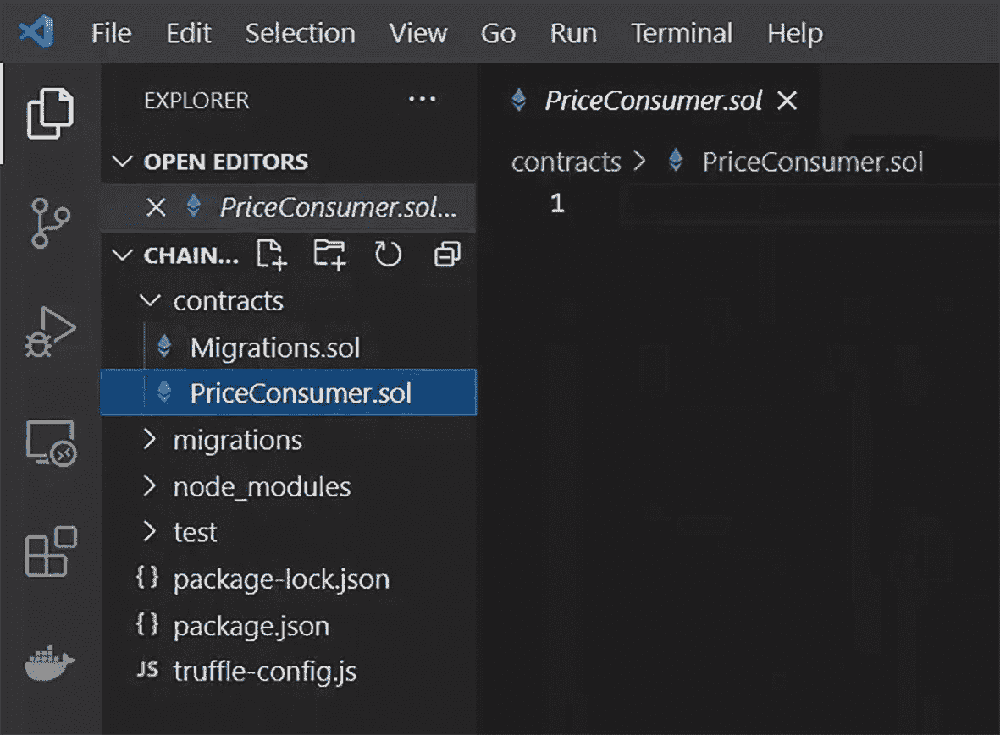
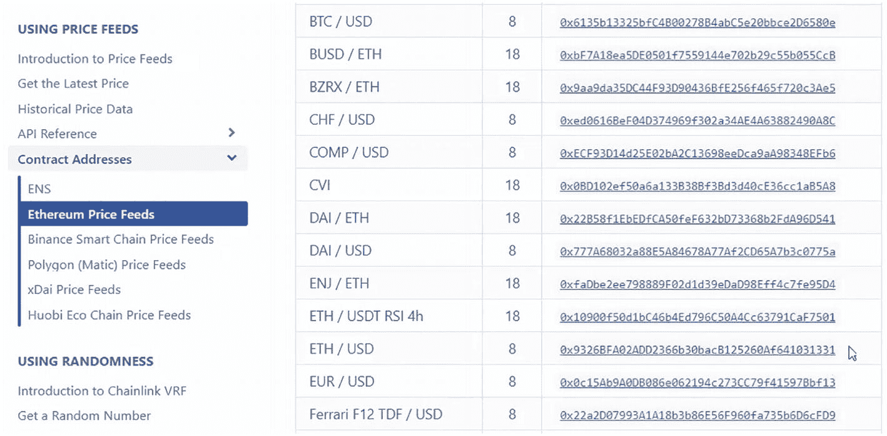
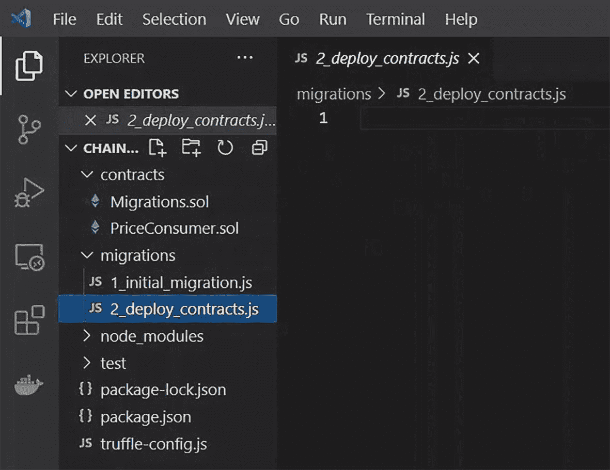
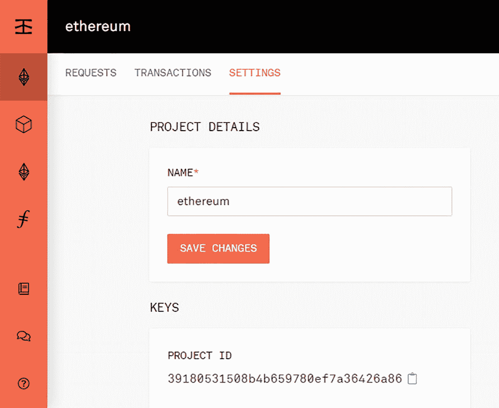
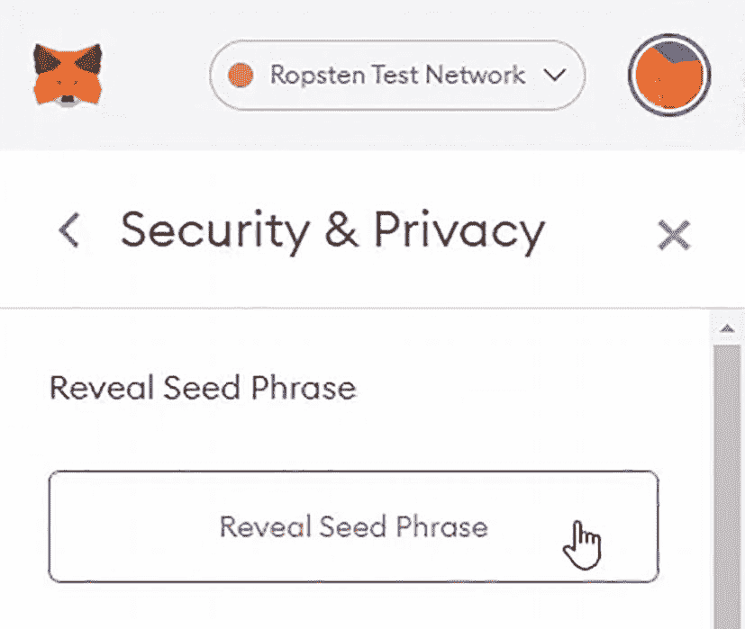
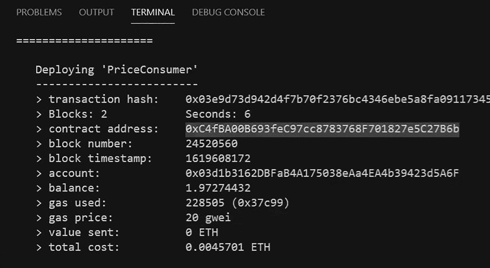

# Chainlink

Chainlink^(²⁸) 是一个由节点组成的去中心化网络，它使用预言机将数据从区块链外源传输到区块链上的智能合约中。在本章中，你将学习如何使用 Kovan 测试网上的 ETH/USD 价格信息，在智能合约中访问最新的加密货币价格。

在本章结束时，你将能够完成以下任务：

*   创建一个用于价格消费的简单智能合约
*   设置一个 Infura 项目
*   配置签署交易的私钥
*   在 Kovan 网络上部署智能合约
*   从 Kovan 网络上的智能合约获取价格信息

## 使用 Chainlink 预言机在智能合约内获取加密货币价格

让我们从创建一个新项目开始，然后安装 Chainlink 合约包。你将使用一个现有的合约地址，该地址会告诉你 ETH/USD 交易对的价格，然后你将能够看到该价格被你的智能合约返回。

### 创建项目

前往“终端”菜单，点击“新建终端”，并初始化一个新的 Truffle 项目。

```
$ truffle init
```

现在，初始化项目文件夹。

```
$ npm init
```

最后，安装 Chainlink 合约包。^(²⁹)

```
$ npm install @chainlink/contracts@0.1.9
```


### 创建智能合约

为价格消费创建一个新的智能合约。

```
$ touch contracts/PriceConsumer.sol
```

打开 `PriceConsumer.sol` 文件（图 10-1）。



VS Code 合约文件夹的截图，其中 `PriceConsumer.sol` 标签页已打开。左侧的“资源管理器”面板包含其他部分：“Contracts”下存在 `Migrations.sol` 和 `PriceConsumer.sol`（已选中），以及 `migrations`、`node_modules`、`test` 文件夹和两个 `.json` 文件与一个 `.js` 文件。

图 10-1 VS Code 合约文件夹

在 `PriceConsumer.sol` 文件中，定义 Solidity 版本，然后导入 Chainlink 合约接口。之后，定义合约名称和合约构造函数。

```
// SPDX-License-Identifier: MIT
pragma solidity ⁰.8.0;
import "@chainlink/contracts/src/v0.6/interfaces/AggregatorV3Interface.sol";
contract PriceConsumer {
    AggregatorV3Interface internal priceFeed;
    constructor() {
        priceFeed = AggregatorV3Interface();
    }
}
```

访问 [`https://docs.chain.link/docs/ethereum-addresses`](https://docs.chain.link/docs/ethereum-addresses) 并向下滚动到 Kovan 部分。复制“ETH/USD”行上的代理地址（图 10-2）。



Chainlink 价格供给的截图，左侧列出了“Using Price Feeds”。其下有多个选项，其中“Contact Addresses”已被选中。在其下，“Ethereum Price Feeds”已被选中。右侧是一个包含 3 列的表格，显示了价格供给的详细信息。

图 10-2 Chainlink 价格供给

将该地址粘贴到 `AggregatorV3Interface` 构造函数中。之后，创建用于获取价格的函数。

```
// SPDX-License-Identifier: MIT
pragma solidity ⁰.8.0;
import "@chainlink/contracts/src/v0.6/interfaces/AggregatorV3Interface.sol";
contract PriceConsumer {
    AggregatorV3Interface internal priceFeed;
    constructor() {
        priceFeed = AggregatorV3Interface(0x9326BFA02ADD2366b30bacB125260Af641031331);
    }
    function getThePrice() public view returns (int) {
        (
            uint80 roundID,
            int price,
            uint startedAt,
            uint timeStamp,
            uint80 answeredInRound
        ) = priceFeed.latestRoundData();
        return price;
    }
}
```

### 创建迁移

在 `migrations` 文件夹中创建迁移文件。

```
$ touch migrations/2_deploy_contracts.sol
```

编写用于部署 `PriceConsumer` 智能合约的代码（图 10-3）。



VS Code migrations 文件夹的截图，其中 `2_deploy_contracts.js` 标签页已打开。窗口上显示数字 1。

图 10-3 VS Code migrations 文件夹

```
const PriceConsumer = artifacts.require("PriceConsumer");
module.exports = function(deployer) {
    deployer.deploy(PriceConsumer);
};
```

### 设置你的 Infura 项目

访问 [`https://infura.io`](https://infura.io) 并进入你的仪表盘。点击 Ethereum，然后点击“Create a project”。最后，定义项目名称并复制项目 ID（图 10-4）。请注意，你可以连接到不同的测试网以及主网。



Infura 设置的截图，左侧有一个仪表盘。顶部的栏标题为“ethereum”。“Settings”标签页已打开。需要在主屏幕上输入项目详情。第一部分是名称为“ethereum”的“Name”（必填字段），第二部分是“Keys”，显示了项目 ID。

图 10-4 Infura 设置

现在，点击 Save Changes。

### 配置钱包以签署交易

安装文件系统 `fs` 包。该包提供了许多有用的功能来访问和与文件系统交互。

```
$ npm install fs
```

安装钱包提供程序 `hdwallet` 包。这也会安装支持 HD 钱包的 Web3 提供程序，用于为从 12 或 24 词助记词派生的地址签署交易。

```
$ npm install @truffle/hdwallet-provider@1.2.3
```

打开 `truffle-config.js` 文件并取消注释 `HDWalletProvider` 代码部分。

```
const HDWalletProvider = require('@truffle/hdwallet-provider');
const infuraKey = '';
const fs = require('fs');
const mnemonic = fs.readFileSync(".secret").toString().trim();
```

将你的 Infura 项目 ID 粘贴为变量 `infuraKey` 的值。

### 配置网络

在 `truffle-config.js` 中，取消注释 `ropsten` 网络部分并更改以下值：

- 将 `ropsten` 更改为 `kovan`。
- 将 Ropsten Infura URL 更改为 `kovan`。
- 将 `YOUR-PROJECT-ID` 更改为 `${infuraKey}`。
- 将 `network_id` 更改为 `42`。

```
kovan: {
    provider: () => new HDWalletProvider(mnemonic, `https://kovan.infura.io/v3/${infuraKey}`),
    network_id: 42,
    gas: 5500000,
    confirmations: 2,
    timeoutBlocks: 200,
    skipDryRun: true
},
```

### 配置 Solidity 编译器

仍在 `truffle-config.js` 中，取消注释 `compilers` 部分并将版本更改为 `0.8.0`。

```
compilers: {
    solc: {
        version: "0.8.0",
        docker: true,
        settings: {
            optimizer: {
                enabled: false,
                runs: 200
            },
            evmVersion: "byzantium"
        }
    }
},
```

### 配置私钥

按如下方式创建秘密文件：

```
$ touch .secret
```

前往浏览器，打开连接到 Infura 网络的 MetaMask 钱包。点击“Your Account”，然后点击“Settings”。最后，点击“Security & Privacy”（图 10-5）。



安全与隐私窗口的截图，显示了“Reveal Seed Phrase”设置。其中文字显示“Reveal Seed Phrase”，下方有一个相同文字的按钮，光标悬停于此。

图 10-5 MetaMask：揭示助记词

你可以查看你的助记词，但请注意，此信息非常敏感，如果有人能够访问它，他们就能恢复你的钱包并使用你的资金。

点击 Reveal Seed Phrase 并输入你的钱包密码以继续。复制私钥。返回 Visual Studio Code 并将私密恢复短语粘贴到 `.secret` 文件中。

### 编译智能合约

使用 Truffle 编译合约。

```
$ truffle compile
```

### 部署智能合约

使用 Truffle 将合约部署到 Kovan 网络。`migrate` 命令运行迁移，以在 Kovan 网络上部署合约。

```
$ truffle migrate --network kovan
```

等待合约部署完成且交易在区块链上得到确认。现在，检查已创建的合约地址（图 10-6）。



VS Code 部署合约输出窗口的截图，包含“Problems”、“Output”、“Terminal”和“Debug console”标签页。代码显示在“Terminal”标签页中，包含交易、区块、合约地址、区块号和时间戳、账户、余额、已用 Gas、Gas 价格、发送值和总成本的详细信息。

图 10-6 VS Code 部署合约输出


#### 从智能合约获取价格信息

使用 Truffle 控制台实例化合约。该控制台命令会打开一个基础交互式控制台，该控制台连接到 Kovan 网络上的以太坊客户端：

```
$ truffle console --network kovan
```

现在，使用 `deployed` 命令返回在 Kovan 网络上已部署的合约实例，如下所示：

```
truffle(kovan) let instance = await PriceConsumer.deployed()
```

调用 `getThePrice` 方法。`let` 命令将方法结果存储在变量 `price` 中，`await` 命令将异步执行该方法。

```
truffle(kovan) let price = await instance.getThePrice()
```

最后，将结果输出为数字。方法 `toNumber()` 将大数对象转换为常规数字。

```
truffle(kovan) price.toNumber()
```

就这样，你刚刚创建了一个智能合约并使用了 Chainlink 价格馈送预言机！

## 总结

在本章中，你学习了如何创建一个简单的智能合约，以使用 Chainlink 从 Chainlink 预言机获取价格信息。

在下一章中，你将学习 Nethereum，一个用于以太坊的 .NET 库。

