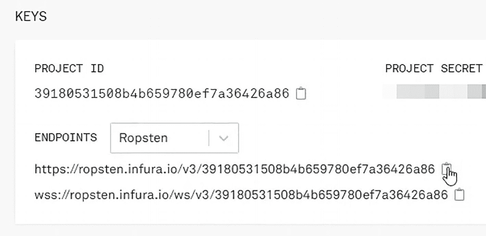

# Nethereum

Nethereum 是一个用于以太坊的开源 .NET 集成库，它简化了智能合约的维护以及与公共和私有以太坊节点的交互。该框架暴露了一个 `Web3` 类，通过它可以与钱包或智能合约的方法进行交互。在本章你将看到的示例中，你将使用钱包的 `GetBalance` 方法来查询其余额。

在本章结束时，你将能够做到以下几点：

- 使用 `dotnet` 创建一个新的控制台项目
- 创建一个使用 Nethereum 获取钱包余额的方法
- 在控制台中显示结果

## 使用 Nethereum 获取你的以太币余额

让我们从创建一个新的控制台项目并将 Nethereum 的 `Web3` 包添加到我们的应用程序开始。然后，你将创建获取特定钱包地址余额的方法。最后，你将把以 wei 和 ether 为单位的信息打印到控制台。

### 创建项目

进入终端并点击“新建终端”。如下所示创建一个新的 `dotnet` 控制台项目。此命令根据指定的模板创建一个新项目、配置文件或解决方案：

```
$ dotnet new console -o sample
```

进入项目的根目录。

```
$ cd sample
```

### 安装 Web3

安装 Nethereum 的 `Web3` 包。此命令向项目文件添加包引用：

```
$ dotnet add package Nethereum.Web3
```

还原所有项目包。此命令还原项目的依赖项和工具：

```
$ dotnet restore
```

### 创建方法

打开 `Program.cs` 文件，添加线程和 `Web3` 的引用。现在，添加一个用于获取账户余额的新方法，然后实例化一个新的 `Web3` 对象。

进入你的 Infura 项目设置并选择 Ropsten 网络。复制 Ropsten 的 `https` 端点（图 11-1）。



图 11-1：Infura 项目密钥

将此端点作为 `Web3` 对象构造函数的参数。在 `Program.cs` 文件中，使用你的钱包公钥作为参数从 `Web3` 获取余额。编写代码以 wei 为单位输出余额，然后将 wei 余额转换为 ether。最后，编写以 ether 为单位输出余额的代码。现在，修改你的 main 方法来调用 `GetAccountBalance()`。

```csharp
using System;
using System.Threading.Tasks;
using Nethereum.Web3;

namespace NethereumSample
{
    class Program
    {
        static void Main(string[] args)
        {
            GetAccountBalance().Wait();
            Console.ReadLine();
        }

        static async Task GetAccountBalance()
        {
            var web3 = new Web3("https://ropsten.infura.io/v3/39180531508b4b659780ef7a36426a86");
            var balance = await web3.Eth.GetBalance.SendRequestAsync("0x03d1b3162DBFaB4A175038eAa4EA4b39423d5A6F");
            Console.WriteLine($"Balance in Wei: {balance.Value}");
            var etherAmount = Web3.Convert.FromWei(balance.Value);
            Console.WriteLine($"Balance in Ether: {etherAmount}");
        }
    }
}
```

### 获取余额

构建项目。此命令构建项目及其所有依赖项：

```
$ dotnet build
```

运行项目。此命令运行源代码，无需任何显式的编译或启动命令：

```
$ dotnet run
```

检查终端输出，确保你得到如图 11-2 所示的结果。


图 11-2：VS Code 中 wei 和 ether 的余额

## 总结

在本章中，你学习了如何创建一个使用 Nethereum 获取钱包余额的控制台项目。