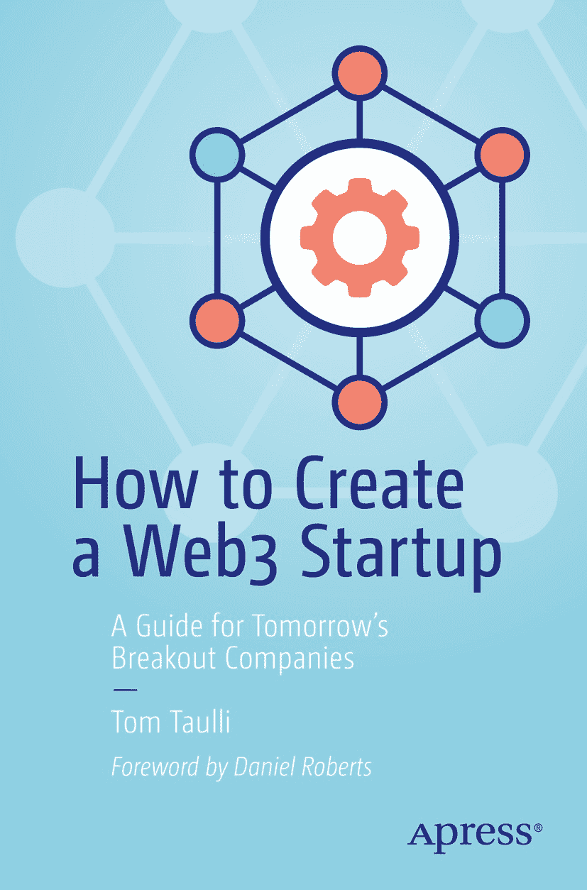

ISBN 978-1-4842-8682-1（纸书） e-ISBN 978-1-4842-8683-8 [`doi.org/10.1007/978-1-4842-8683-8`](https://doi.org/10.1007/978-1-4842-8683-8)
© Tom Taulli 2022

本作品受版权保护。版权的所有相关权利，无论全部或部分，均独家授权给出版商，具体包括翻译、重印、复用插图、朗诵、广播、以缩微胶片或任何其他物理形式复制，以及信息存储与检索的电子化改编、计算机软件，或任何类似或不同的现有或未来方法。书中使用的通用描述性名称、注册商标名称、商标、服务标志等，即使未明确声明，也不意味着此类名称免于相关保护法律和法规的约束，因此可供一般性使用。出版商、作者和编辑假定本书中的建议和信息在出版时是真实且准确的。出版商、作者或编辑均不对本书内容中的任何错误或遗漏提供明示或暗示的担保。出版商在地图及机构归属的管辖权主张上保持中立。

本 Apress 印记由注册公司 APress Media, LLC（Springer Nature 的一部分）出版。注册公司地址为：1 New York Plaza, New York, NY 10004, U.S.A.

## 前言

Web3 真的很奇怪。

其最坚定的支持者们在 Twitter 和 Discord 聊天室里花着大量时间鼓吹他们最爱的加密货币，并自豪地使用卡通风格的 NFT 头像（从无聊猿到加密朋克再到酷猫）作为个人资料图片——然后在把这些头像转手获利后，再换一个。他们中许多人都自豪地标榜自己属于特定的代币阵营，从“比特币极端主义者”到“以太坊人”到“LINK 海军陆战队”再到“XRP 军团”。他们用“gm”、“WAGMI”、“NGMI”、“HODL”、“down bad”和“rekt”这类圈内黑话互相识别。

然而，将 Web3 斥为一时热潮（或者像加密怀疑论者喜欢坚持的那样，视为一种骗局、欺诈或庞氏骗局）将是极其短视的。它已经证明了自身的持久力：比特币交易已有超过 13 年，以太坊也已七年，两条区块链都从未被黑客攻破过，这两种货币也从未归零。

而在加密货币经历其迄今为止最大的主流牛市——2020 年和 2021 年疫情期间，借助散户投资者的革命和 Reddit 推动的模因股票浪潮之后，比以往任何时候都有更多的大人物（无论个人还是公司）成为 Web3 的信仰者。华尔街对冲基金巨头改变了对加密货币作为投资工具的看法；特斯拉和 Square 等上市公司将比特币纳入资产负债表；PayPal 和 Robinhood 等金融科技巨头推出了加密货币购买功能；从百威到 Visa 到蒂芙尼到古驰等消费品牌纷纷拥抱 NFT。

所有这些都指向一个非常明确的结论：Web3 将持续存在，尽管它仍处于早期阶段，但现在是时候开始构建了。

Coinbase 成立于 2012 年，由一位前 Airbnb 工程师和一位前高盛交易员创立；如今它已上市，在美国家喻户晓。加密货币交易所的名称和标志装饰着洛杉矶湖人队和迈阿密热火队的主场，以及每位 MLB 裁判的衬衫。DraftKings 这家顽强拼搏的波士顿初创公司 CEO——该公司历经多年与州监管机构的法律斗争，最终成长为百亿美元的体育博彩巨头——是加密货币的坚定信仰者，他今年对《解密》杂志表示：“在互联网早期，并没有太多主流的互联网消费方式……但一切最终都围绕着万维网，所有底层技术都以此为基础构建。然后突然之间，视频以及其他对普通人来说更主流、更易于消费的东西就出现了。”

经济学家兼《纽约时报》专栏作家保罗·克鲁格曼在 1998 年曾豪言写道：“互联网的增长将急剧放缓……到 2005 年左右，人们会清楚地发现，互联网对经济的影响不会比传真机更大。”他错得非常、非常离谱，这段话每隔几年就会被翻出来，被 Web 世界的居民们狠狠嘲讽。

但为了确保如今那些否定区块链技术的怀疑论者同样被证明是错误的，构建 Web3 初创公司的企业家们需要打造出具有真实用例、解决实际需求、并能展示去中心化技术所向的工具。

许多人已经在这么做了，他们将区块链应用于去中心化数据存储和视频托管、点对点支付、闪电般的国际汇款、更快更私密的慈善捐赠，以及为团体项目提供更公平的投票。但就像任何新技术行业一样，其中也充斥着骗局和昙花一现的捞钱手段。为了避免重蹈过去的覆辙（还记得 2018 年的 ICO 热潮吗？），并让接下来的数百万人进入 Web3，这一领域的企业家需要做到诚实、耐心、具有战略眼光，并且最重要的是，打造出真正有意义的产品。

> *——丹尼尔·罗伯茨，《解密》杂志主编*

### 关于作者

### 关于技术审校