# 3. 比特币

在上一章中，您看到了区块链技术如何在没有中央权威的情况下，借助所讨论的技术和算法，在参与者之间建立信任，并认证分布式账本的不可篡改性。区块链本身非常适合数字货币的理想模型，在这些模型中不需要像银行、保险公司和其他中央组织这样的中介和第三方。事实上，区块链正是因比特币而诞生并得以普及。

2008 年，一位（或一群）名为中本聪的人发布了一篇题为《比特币：一种点对点的电子现金系统》的研究论文。这篇论文描述了一个点对点的现金系统，它允许网络交易直接从一方发送到另一方，而无需经过任何中介/银行组织，并对比特币进行了非常详细的说明。

与那些通过共同可信实体管理交易的系统相比，加密货币这一术语描述了所有使用密码学来保护数字交易的系统、网络和媒介。

本章将介绍比特币协议。它将详细分析构成该协议的主要部分——公钥和私钥、比特币地址以及区块。接着，本章将阐释其网络和共识机制，包括工作量证明。

## 3.1 比特币的历史

比特币的几乎所有技术部分都诞生于 20 世纪 80 年代和 90 年代的学术出版物中。“我们需要强调的是，我们的目标不是贬低中本聪的工作和成就，而只是强调其真正的直觉飞跃是什么。实际上，通过追溯比特币中存在的想法的起源，我们可以关注这些想法被整合到底层组件的具体而复杂的方式。”^(¹)

比特币的历史本身就是一个案例研究，因为它证明了学术界、外部科学家、工程师和专业人士之间的关系，并展示了这些团队如何相互学习。许多专业人士研究过比特币并发表了大量研究论文。

请注意，账本的想法是比特币的初始起点。如果你理解了账本，你就会理解该系统的结构及其通信方式。账本是所有交易发生的地方。它对系统中的所有参与方和组件都是开放和可信的（见图 3-1）。

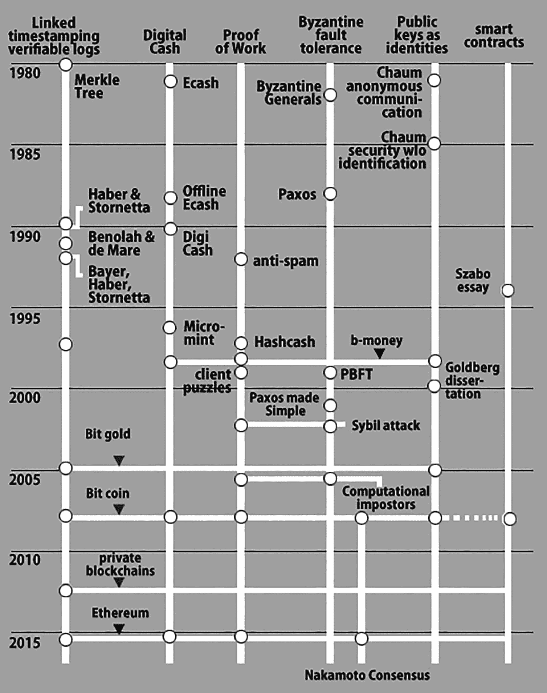
**图 3-1** 比特币背后的主要思想

为了支持数字货币，账本必须具有以下基本属性：

- **仅可追加：** 只能向账本中添加新的交易。不能废弃、修改或重新排序现有的账本条目。
- **不可篡改：** 账本中存在的任何信息都不能被改变。
- **防止双重支付：** 不能多次使用同一数字货币单位进行支付。

### 3.1.1 链式时间戳与默克尔树

比特币账本的数据结构，在适当修改后，借鉴自斯图尔特·哈伯和斯科特·斯托内塔（1990 年和 1997 年）的几篇文章。

正如我们所知，中本聪在比特币白皮书中指出，哈伯和斯托内塔的论文探讨了文档的时间戳问题。请注意，在涉及商业合同、专利及其他文件时，可以确定该文件是在某个特定时间点生成的。我们理解他们所说的“文档”概念相当宽泛，可以包含不同类型的数据。

他们曾顺带提及银行交易作为一种可能的应用，但请注意，这并非他们的目标。每份文档的发起者确认生成时间，并对文档及其日期和时间进行签名。这份初始文档由创建者批准/签名，因此文档形成了一条指向过去的长链。第三方用户无法编辑已加时间戳的消息，因为它已由发起者批准；此外，发起者或创建者若想编辑该消息，则必须更改后续的整个消息链。

哈伯和斯托内塔还在他们的文章中提出了若干想法，以使这种数据结构更快速、高效和精确：

-   文档之间的链可以通过使用哈希值而非签名来创建；请注意，这些哈希值计算起来更简单、更快速，并且在作为数据标识符时更强大。我们将此类链接称为指针。
-   与其单独为文档加盖时间戳（如果同时生成大量文档，这种方式效率低下），不如将文档合并成批次或区块，并为这些文档使用相同的时间戳。
-   每个区块中的文档应通过一个称为默克尔树的哈希指针二叉树来关联。乔什·贝纳洛先生和迈克尔·德·马雷先生在哈伯的文章发表后不久，于 1991 年独立提出了这些想法。

请注意，默克尔树以拉尔夫·默克尔的名字命名，他在 1980 年的文档中提出了非对称加密的逻辑。

无论是哪种方式，比特币都采用了哈伯和斯托内塔研究中的数据结构，并通过加入工作量证明机制重新设计了其安全特性。

### 3.1.2 分布式共识

互联网货币或货币交易需要一个共同的权威机构。

对于分布式账本，你会看到自动产生分叉的情况，这意味着某些节点会认定区块 A 是最后一个区块，而所有其他节点则会认定区块 B 是最后一个区块。^(²)

在这种情况下，你需要明白，这是由于对手试图中断账本交易，或者由于网络延迟，偶尔导致不同节点几乎同时生成了区块，而彼此不知晓对方的存在。链式时间戳不足以解决分叉问题，这一点由迈克在 1997-1998 年指出。

在可能出错的情况下如何达成共识的问题被称为拜占庭将军问题。在第 2 章中曾非正式地讨论过这个问题。拜占庭故障既包括自然故障，也包括恶意行为。

这个想法最初由莱斯利·兰波特与罗伯特和马歇尔于 1982 年共同撰写的一篇文章中讨论。1999 年，米格尔·卡斯特罗和芭芭拉·利斯科夫发表了一份文档，提出了 PBFT 算法，该算法能够以出色的性能解决拜占庭将军问题。（请注意，PBFT 代表实用拜占庭容错。）

该复制算法可以管理拜占庭缺陷。拜占庭容错算法在不久的将来将变得越来越重要，因为在网络世界中，恶意攻击和软件错误变得非常普遍，这可能导致故障节点产生任意行为。

但对于之前的算法来说，它们需要一个特殊的同步系统，并且速度很慢。本书中描述的算法非常实用，因为它能在异步环境中快速工作。

中本聪在他的最初白皮书中既没有引用同一篇文章，也没有使用他的措辞。然而，他采用了一些概念，将自己的协议称为共识协议，并考虑了入侵者形式的故障，以及节点加入和退出基础设施的情况。

当在一个邮件列表中被问及比特币与拜占庭将军问题之间的联系时，中本聪声称工作量证明链解决了这个问题。

几乎所有的故障系统都假设系统中的大多数节点既是可信的，也是诚实的（例如，超过一半或三分之二）。开放对等网络中的节点可以随时自由加入和离开。

因此，可以利用女巫攻击来绕开系统的共识或质量保证。约翰·杜塞于 2002 年定义了女巫攻击，并提出了一种名为工作量证明的密码学突破来对抗它。

## 3.2 工作量证明

本节将介绍工作量证明的早期阶段，以便你更好地理解它。辛西娅·德沃克和莫尼·纳尔于 1992 年提出了第一个倡议，标题为“工作量证明”。他们当时的目的是阻止垃圾邮件。

例如，hashcash 是一种工作量证明方法，已被用作多种系统中的拒绝服务攻击对策。一个 hashcash 印章是一种工作量证明，发送者需要花费可参数化的计算时间才能生成。接收者可以快速验证收到的 hashcash 印章。

虽然 `hashcash` 的设计初衷是给发送电子邮件增加成本，以防止大量发送垃圾邮件的发送者，但现在它可以被引入到任何互联网服务中，对那些可能滥用服务器资源的用户施加计算成本。

然而，一个想要发送一百万封电子邮件的垃圾邮件发送者，如果使用类似的方法，可能需要数周时间。有时，工作量证明实例（也称为谜题）被要求用于识别电子邮件和收件人。

否则，垃圾邮件发送者可以仅花费发送一条消息给一个接收者的成本，就将大量消息发送给同一接收者（或将同一条消息发送给多个接收者）。第二个关键特性是，接收者的计算成本应尽可能低；无论计算谜题答案多么复杂，验证起来都应该很简单。

德沃克和纳尔的建议催生了一个完整的研究领域。亚当·贝克，当时是赛博朋克研究社区的一名博士后，于 1997 年独立设计了一个类似的概念，称为 `hashcash`。

赛博朋克是反政府和反中央集权机构的活动家，他们利用密码学来推动社会和政治变革。

`Hashcash` 只不过是一种工作量证明算法；它被用作不同系统中针对垃圾邮件和拒绝服务攻击的措施。它基于一个与哈希函数相关的简单原理：要找出一个其哈希值为给定输出的输入，唯一的方法就是测试各种输入，直到在哈希函数中得到所需的数据。因此，要找出一个其哈希值与任意一系列输出匹配的输入，唯一的方法就是尝试一个接一个地对不同输入进行哈希运算。

### 3.2.1 中本聪的天才之处

理解构成比特币设计要素的所有前身技术，有助于我们领会中本聪真正伟大的发现。

`工作量证明`（`PoW`）用于保护总账或分类账。`工作量证明`的求解工作由矿工完成。每位矿工解决的挑战形式略有不同；因此，其成功概率与其所拥有的全球算力比例成正比。解决难题的矿工可以向账本提交一个新的交易区块，该区块将根据时间戳被添加到账本中。贡献区块的矿工将获得新铸造的比特币作为奖励，以换取维护账本的服务。如果某个矿工贡献了一个无效的区块或交易，它很可能会被其他大多数为后续区块做出贡献的矿工所剔除，从而使错误区块的区块奖励失效。

通过这种方式，由于货币激励的存在，矿工们相互之间形成了保险机制。与用于协调计算机系统的复杂方法不同，中本聪的天才之处在于比特币的各个组成部分。以前没人想到要激励节点保持诚实，也没人想到要使用共识算法来避免双重支付问题。

为了消除双重支付并确保货币具有价值，比特币需要一个安全的账本。矿工必须以某种方式获得奖励。而矿工的算力反过来又用于保护账本的安全。否则，一个拥有超过全球 51%挖矿能力的敌手，可能比网络中的其他节点更快地生成区块，进行双重支付计算或交易，并通过绕过计算机系统来彻底重写历史。

因此，比特币的诞生依赖于这三个组件之间精心设计的平衡关系。

## 3.3 密钥与地址

为了拥有自己的比特币，即能够花费它们，你需要具备：

- 一组数字密钥，包括一个私钥和一个公钥
- 一个比特币地址
- 一个数字签名

`椭圆曲线数字签名算法`是一种加密算法，是比特币私钥和公钥的基础。它用于确保只有合法的所有者才能花费比特币。

### 3.3.1 私钥

在比特币的语境中，私钥是一个秘密数字，允许你花费比特币。每个比特币钱包都包含一个或多个存储在钱包文件中的私钥。它也被用于生成数字签名。

私钥只是一个随机生成的数字。它是一个有符号的 256 位（32 字节）整数。然而，并非所有 256 位无符号整数都是比特币私钥。事实上，比特币采用的标准 `secp256k1` 限制了有效私钥的数量。`Secp256k1` 在高效加密标准中有详细描述，它对应于比特币公钥加密中所使用的椭圆曲线参数（SEC）。请记住，私钥用于生成公钥。

### 3.3.2 公钥

关键在于，公钥可以用来验证签名的真实性（即，该签名是使用正确的私钥生成的）。通常，公钥是通过将私钥与椭圆曲线上的一个点相乘来生成的。比特币使用 `secp256k1` 常数中定义的固定椭圆曲线和一组数学常数。

从私钥 `<< privkey >>` 开始，将其与曲线上一个称为生成点 `G` 的预定义点相乘，会在曲线上产生另一个不同的点，该点就对应着公钥 `<< pubKey >>`。通常，公钥可以用点 `«privkey»*G=«pubKey» = (x,y)` 的坐标来定义（见图 3-2）。

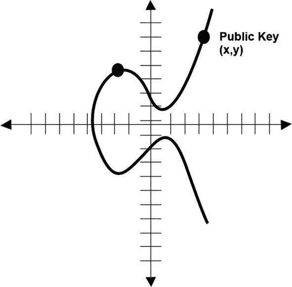
**图 3-2** 用于计算公钥的椭圆曲线密码函数示例

生成点 `G` 是 `secp256k1` 标准的一部分，对于比特币中的所有密钥都是相同的。私钥 `<< privKey >>` 乘以 `G` 的结果将得到与之对应的唯一公钥 `<< pubKey >>`。`<<privKey >>` 与 `<< pubKey >>` 之间的关系是固定的，但只能以单向方式计算，即从 `<< privKey >>` 到 `<< pubKey >>`。

椭圆曲线上点的 (x, y) 坐标可用于描述公钥。十六进制是最常用的数据存储格式。

因此，公钥有两种格式：

- 非压缩公钥
- 压缩公钥

请注意，非压缩公钥是旧格式。现在通常已不再使用，转而采用压缩格式。比特币最初使用 `x` 和 `y` 坐标来存储公钥。在这种非压缩格式中，坐标被简单地串联起来，并添加前缀 `04` 以表明这是一个非压缩公钥，如图 3-3 所示。

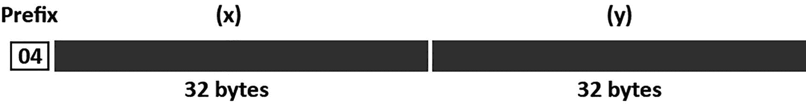
**图 3-3** 非压缩公钥

对于压缩公钥，椭圆曲线沿 X 轴对称，如图 3-4 所示。

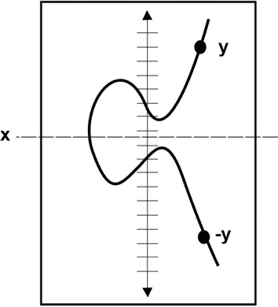
**图 3-4** 椭圆曲线的对称性

因此，在压缩公钥格式中（见图 3-5），你只需存储完整的 `x` 坐标，以及一个指示 `y` 坐标是偶数还是奇数的前缀。

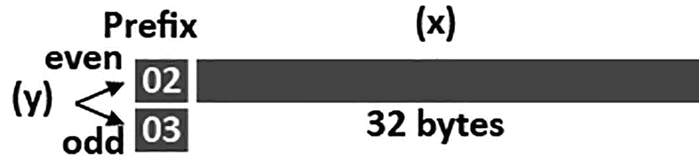
**图 3-5** 压缩公钥

这种格式在区块链上节省了大量空间。

### 3.3.3 比特币地址

比特币地址，或简称地址，是由 26-35 个字母数字字符组成的标识符，以数字 1、3 或 `bc1` 开头，代表比特币支付的一个可能目的地。比特币（加密货币，BTC）中的交易可以通过地址进行，有点像发送电子邮件。然而，与电子邮件地址不同，人们拥有不同的比特币地址，并且每笔交易应使用一个唯一的地址。

一个人可以创建无限数量的地址，从而提高支付的匿名性。一个地址由三个元素构成：

*   公钥哈希
*   前缀
*   校验和

让我们详细分析这三个组成部分。

公钥哈希无非是对公钥应用双重哈希。具体来说，它是通过 `SHA-256` 和 `RIPEMD160` 获得的哈希，因此：

```
> = RIPEMD160 (SHA-256 (>))
```

它有时被称为 `HASH160 (<< publickey >>)`，因为这比写 `RIPEMD160 (SHA256 (<< publickey >>))` 更简单。

前缀表示要创建的区块类型。最常用的有：

*   `00`：用于 `P2PKH` 锁定脚本（你将在后面了解它是什么）
*   `05`：用于 `P2SH` 锁定脚本

最后，校验和是通过对公钥哈希进行两次 `SHA-256` 哈希并取前四个字节获得的。然后，你将这些元素按顺序排列得到一个队列（见图 3-6 和 3-7）：

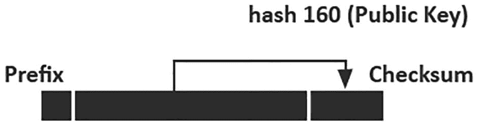
**图 3-6** 构成比特币地址的元素

1.  `prefix`
2.  `HASH160(«public key»)`
3.  `checksum`

然后应用 `Base58` 函数，该函数最终将提供比特币地址，如图 3-7 所示。

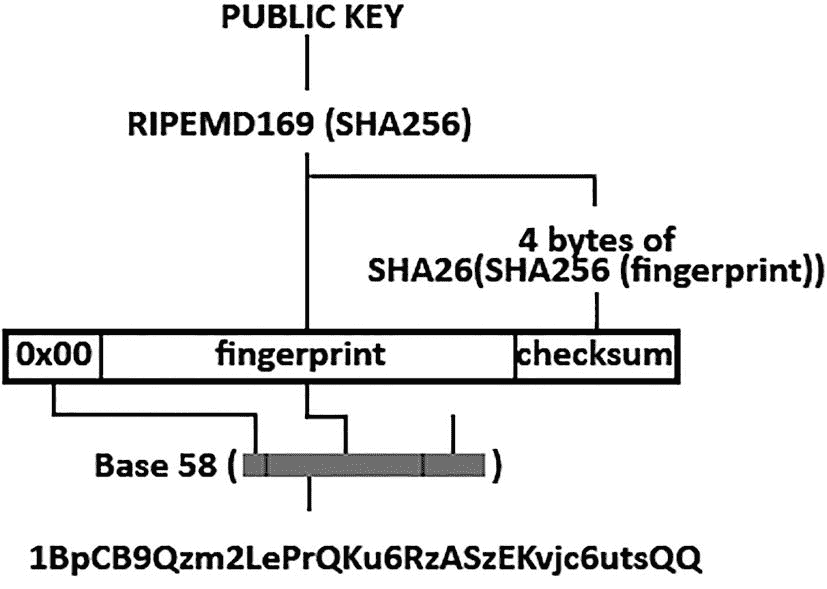
**图 3-7** 比特币地址

`Base58` 是一个转换器，你可以用它以更短、更直观的格式表示大数字，从而得到字母数字文本。显然，这些操作是在应用程序层面实现的，用户无需执行所有这些步骤。

## 3.3.4 数字签名

数字签名是一种数学手段，用于证明你知道与公钥关联的私钥，而无需泄露实际的私钥。在进行交易时，你首先必须解锁你想要使用的余额（UTXO，你将在下一节中了解）。这可以通过证明你“拥有”该余额，并且你知道存储该余额的地址的私钥来实现。因此，为了在不提供私钥的情况下解锁余额，你使用数字签名。通过这种方式，你表明你拥有私钥，但无需将其交给网络。然后在交易中使用这些签名来证明你拥有正在花费的余额。

是什么阻止了有人利用某笔交易的数字签名来解锁你地址上的其他输出？每笔交易都有自己的数字签名。

换句话说，你不仅使用私钥，还使用私钥和交易数据来构造数字签名。因此，任何数字签名都与使用它的交易相关联。因此，如果有人试图在一笔新交易中使用某笔交易的数字签名，它将与数字签名中的交易数据冲突，并被比特币网络节点拒绝。

因此，数字签名也能保护其使用的交易不被篡改。数字签名由两部分组成：
*   一个随机部分
*   签名部分，由以下内容组成：
    *   一个私钥
    *   你正在为其创建数字签名的数据

对于随机部分，设 `n` 为第二条椭圆曲线标准 `secp256k1` 上点 `G` 的阶。你生成一个随机数 2 [1; n - 1] 并称这个随机数为 `k`。

然后，你将此随机数乘以椭圆曲线的点 `G`（生成点）。这与你用于公钥并由标准 `secp256k1` 指示的 `G` 相同。为简洁起见，你将此随机数称为变量 `k`。

`k G = (xr; yr)`

该数字签名的随机部分是你获得的曲线上的点（见图 3-8）。但你只取 `xr` 坐标。

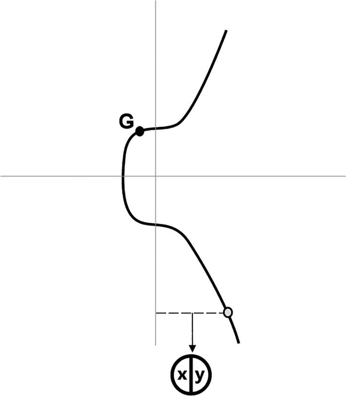

图 3-8 曲线上获得的随机数，取其中的 X 坐标

为简洁起见，你可以将从

`r = randomPart = xr mod n`

获得的 `r` 称为 `randomPart` 值。

对于签名部分，你需要获取私钥用于随机部分。

`r * privKey`

然后包含你想要创建签名的数据。

在比特币中，这由包含你想要解锁的余额（UTXO）的交易哈希表示。你定义 `h (msg) = SHA-256 (<<transaction >>)` 并得到：

`[r * privKey] + h(msg)`

交易哈希的包含将签名绑定到一笔交易（因此它不能用于另一笔不同的交易）。最后，你将其除以初始随机数 `k`：

`s = sign = k-1 (r privKey + h(msg)) (mod n)`

你已经得到了数字签名的基本部分。数字签名由 `r` 和 `s` 组成。

如果有人要求你证明你知道某个公钥的私钥，你可以给他们数字签名 (`r`; `s`) 作为证明。

### 3.3.4.1 验证数字签名

为了验证数字签名是使用正确的私钥创建的，收到此数字签名的人必须使用这两部分 (`r`; `s`) 在椭圆曲线上找到两个新点并检查签名。

从现在开始，乘号仅在严格需要分隔变量时才使用，否则假定为隐式乘法运算。

首先，让我们获取被附加了数字签名的数据。在这种情况下，它是应用于交易的 `SHA-256` 哈希。

你将此值除以 `s`（数字签名的核心部分）并乘以 `G`（生成点），如下所示：

`u1 = (x1; y1) = (h(msg) s-1 mod n) G`

然后你找到点 1（见图 3-9）。

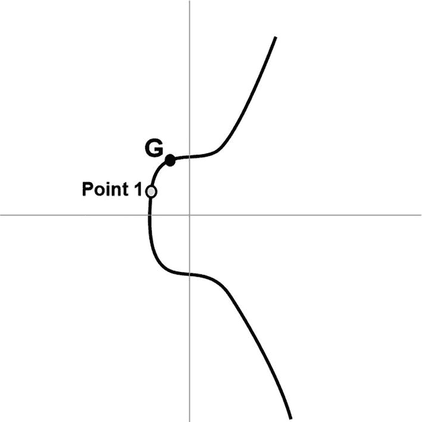

图 3-9 点 1 的图形表示示例

然后你将 `r` 除以 `s` 并乘以 `< < publickey > >`：

`u2 = (x2; y2) = (r s-1 mod n) pubKey`

然后你得到点 2（见图 3-10）。

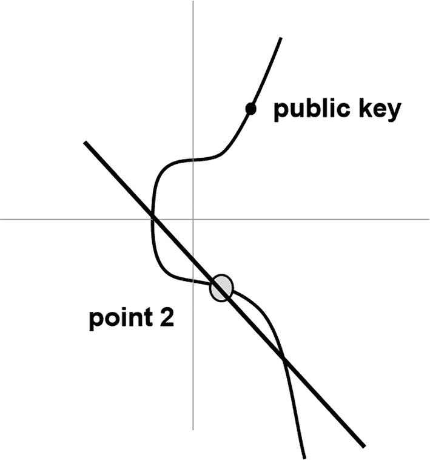

图 3-10 点 2 的图形表示示例

最后，将这两点相加，你会得到椭圆曲线上的第三个点（见图 3-11）。

`Rv = (xv; yv) = u1 + u2`

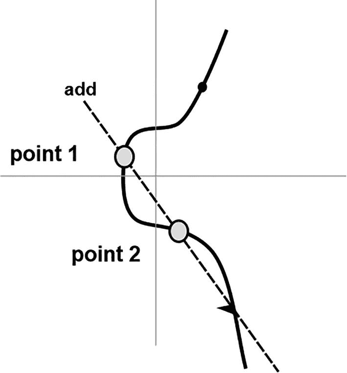

图 3-11 点 1 与点 2 之和的图形表示示例

如果椭圆曲线上获得的这个点 `Rv = (xv; yv)` 的值 `c = xv mod n` 等于 `r`，即 `c == 初始 r`，那么就证明了该数字签名是使用与公钥关联的私钥创建的。

### 3.3.4.2 理解 ECDSA 签名/验证的数学原理

ECDSA 签名的描述很简单：

请注意，签名过程通过椭圆曲线的变换，使用私钥 `privKey` 对随机点 `R`（仅用 X 坐标表示，即 `r = randomPart = xr mod n`）进行编码。然后，它将消息 `h(msg)` 的哈希编码为一个数字签名 `sign`，这证明了签名者知晓私钥 `privKey`。由于 ECDLP 问题的复杂性，签名（`randomPart`, `sign`）可能会泄露私钥。

验证签名时，使用公钥 `pubKey` 和消息哈希 `h(msg)` 对证明数字 `sign` 进行编码。然后恢复出用于创建签名的原始点 `R`，称为 `Rv`。接着，比较检索到的 `Rv` 的 `X` 坐标（`xv mod n`）与签名中的 `r = randomPart` 值。

那么，所描述的签名和验证方案是如何工作的呢？我们首先考虑验证过程，然后是推导 `Rv` 的方程。接着，我们将方程写成扩展形式。

`Rv = (xv; yv) = h(msg) s⁻¹ (mod n) G + r s⁻¹ (mod n) pubKey`

将 `pubKey` 替换为 `privKey G`：

`Rv = (xv; yv) = h(msg) s⁻¹ (mod n) G + r s⁻¹ (mod n) privKey G`

提取公因子 `G` 和 `s⁻¹ (mod n)`，得到：

`Rv = (xv; yv) = (h(msg) + r privKey) s⁻¹ (mod n) G`

我们知道：

`s⁻¹ (mod n) = (k⁻¹ (h(msg) + r privKey))⁻¹ (mod n)`

因此：

`s⁻¹ (mod n) = k (h(msg) + r privKey)⁻¹ (mod n)`

将其代入 `Rv` 的方程：

`Rv = (h(msg) + r privKey) k (h(msg) + r privKey)⁻¹ (mod n) G = k G`

最后一步是比较点 `Rv` 与点 `R`。点 `R` 由 `privKey` 编码。该算法会比较 `Rv` 的 `X` 坐标与 `R` 的 `X` 坐标（其中 `R = (xr; yr)` 且 `r = randomPart = xr mod n`）。更精确地说，如果给定 `c = xv mod n`，且 `c == r`，则签名被认为是有效的。

图 3-12 从高层次说明了比特币交易中的数字签名是如何工作的。

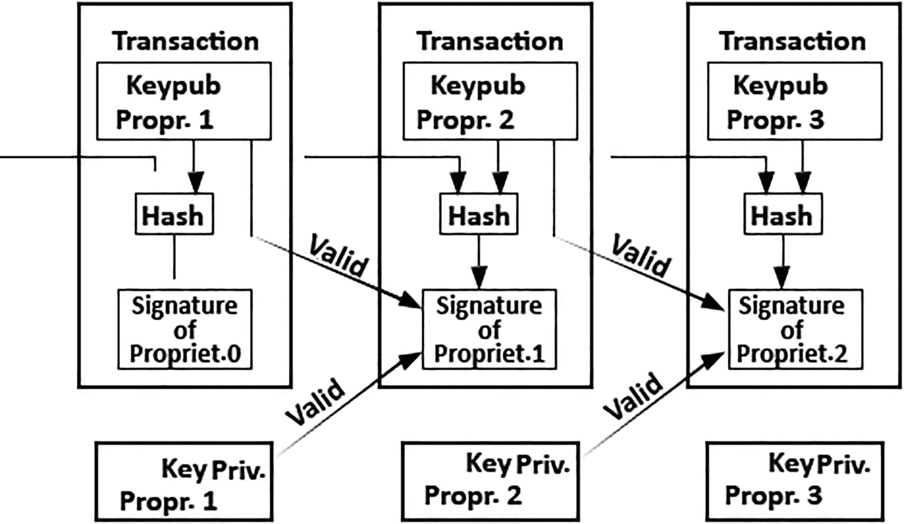

图 3-12 交易与数字签名

## 3.4 交易

交易是比特币区块链中最基本的组成部分。交易经过验证后被发送出去。许多交易组合在一起形成一个区块。此外，通过数字数据链接形成一条区块链。^(³)

为了选择下一个要添加到链上的区块，区块会经过一个共识过程。被选中的区块会经过验证并被添加到现有的链上。

矿工是执行验证和共识过程的特殊对等节点。需要明确的是，它们并非特殊或强大的机器，而是运行着区块链协议特定软件的计算机。让我们来看一下单个比特币交易的具体细节。

### 3.4.1 未花费交易输出（UTXO）

未花费交易输出（UTXO）是比特币网络中的一个基本概念。UTXO 是与某个特定用户相关联的一组比特币。它们只能在交易中被完整花费。一个用户可以拥有零个、一个或多个 UTXO。显然，一旦用户使用某个 UTXO 完成了一笔交易，其他用户就不能再使用它。与某个用户关联的 UTXO 之和就是该用户的总余额。

换句话说，比特币以 UTXO 的形式存储与交易和用户余额相关的数据。UTXO 是发送给用户且该用户可能可以花费的“未花费”比特币数量。

网络中所有 UTXO 的集合构成了比特币区块链的状态。一笔比特币交易由输入和输出组成。

一笔交易以一个或多个 UTXO 作为输入，并根据发送方发起的请求，生成一个或多个 UTXO 作为输出，以支付交易请求指定的金额。因此，未花费交易输出是用户接收并可以在以后花费的交易结果。

例如，假设 John 有一个价值 10 比特币的 UTXO 和另一个价值 5 比特币的 UTXO，他想发送 8 比特币给 Sara（Sara 的钱包中没有 UTXO）。John 可以创建一笔交易，指定要支付给 Sara 的金额，并将 10 比特币的 UTXO 作为交易输入。

因此，这笔交易将如下所示：

- **输入：** 10 比特币 Mario UTXO
- **输出：**
    - 一个与 Sara 关联的 8 比特币 UTXO
    - 一个与 Mario 关联的 2 比特币 UTXO（交易的找零）

因此，一旦交易被记录，Mario 的钱包中将有一个 5 比特币的 UTXO 和一个 2 比特币的 UTXO，总余额为 7 比特币。Sara 将拥有一个 8 比特币的 UTXO，总余额为 8 比特币。UTXO 的结构非常简单。（见图 3-13。）

有两种脚本：锁定脚本和解锁脚本。根据该术语的定义，以及解锁所有权是转移 UTXO 的第一步，输入值包含术语*解锁脚本*。另一方面，输出值由于锁定过程将是*锁定脚本*。“脚本”一词意为“栈结构”，但我们将关注其方法而非定义。

交易输出 UTXO 具有以下结构（见图 3-13）。

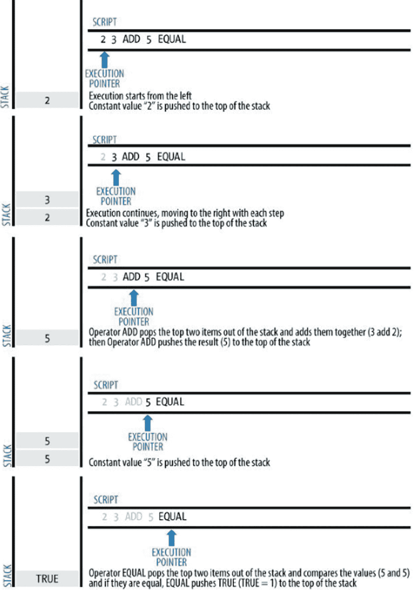

图 3-13 UTXO 结构

### 3.4.2 输入与输出 (I&O)

这指的是“列出”交易的收入来源（输入）和支出（输出）的概念，而不是通过设置输入和输出结果来转移资金的概念。也就是说，当你支付金额时，你首先说明你想要花费的 UTXO 的收入来源，然后说明你想要在输出项上投资的金额。让我们先看看输出的结构。（见图 3-14。）

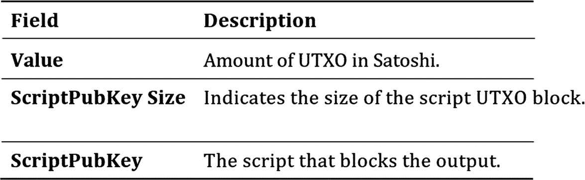

图 3-15 UTXO 描述

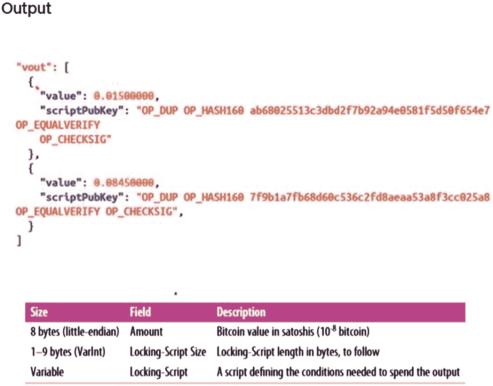

图 3-14 输入与输出

当创建一笔用于转账的交易时，交易输入必须指定将使用哪个 UTXO。简单来说，交易的输入是指向 UTXO 的指针。它们定义了一个特定的 UTXO，该 UTXO 与交易的哈希值和交易输出的索引号相关。为了输出 UTXO，交易输入还包含一个解锁脚本，该脚本满足 UTXO 给定的输出条件（见图 3-15 和 3-16）。解锁脚本通常是一个签名，用于验证区块脚本中标识的比特币地址属于所有者。

因此，一笔交易的 UTXO 输入结构如图 3-16 所示。

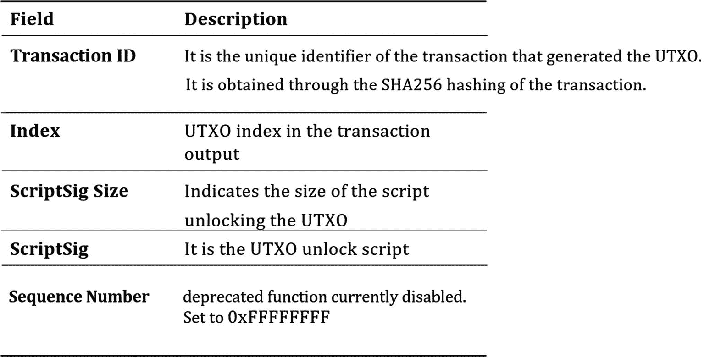

图 3-16 UTXO 描述

这种交易输入和输出的结构引出了如图 3-17 所示的交易链接设计。

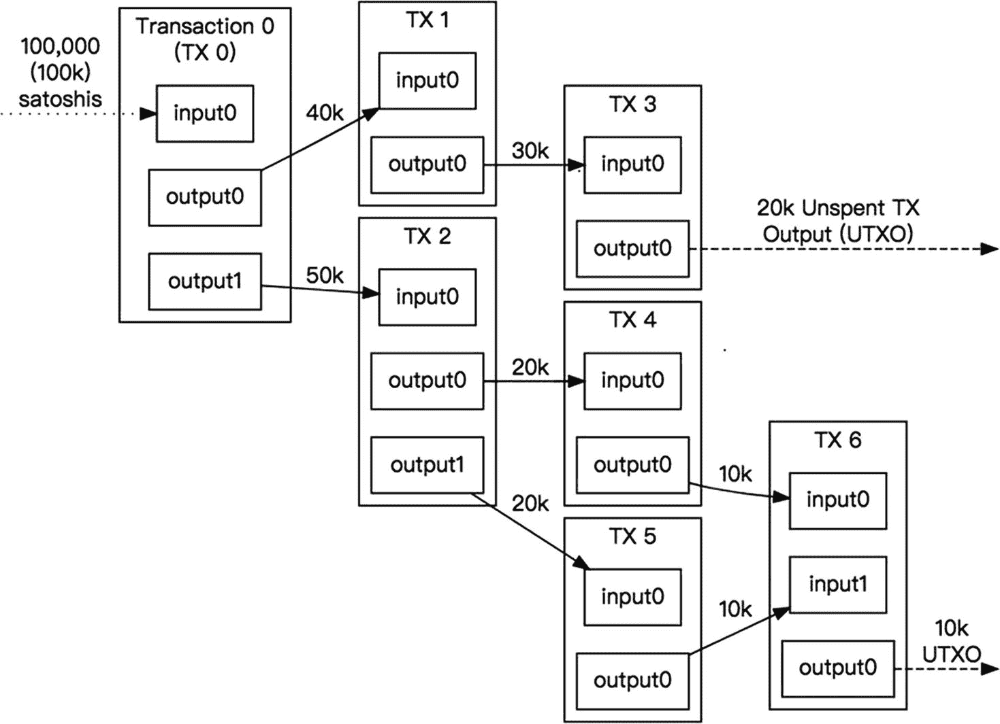

图 3-17 比特币交易输入与输出

### 3.4.3 支付到公钥哈希（P2PKH）

在了解了交易如何发生的高级描述之后，本节将介绍其技术和结构细节，以理解其实现方式。

`P2PKH`（支付到公钥哈希）是一种用于完成比特币交易或向某人发送资金的脚本模板。它是最常用的脚本，用于将输出锁定在某人的公钥上。它确保只有 UTXO 的受益人，或拥有私钥（从而拥有与 UTXO 的比特币受益人地址相关的公钥）的人，才能花费它。

为了更深入地理解，让我们先分析交易过程的输出部分，暂时忽略输入的细节。然后，我们将讨论该过程的输入方面，并深入探讨检查两部分组合的流程。

### 3.4.4 观察输出方

假设马里奥想向萨拉发送 20 个比特币。因此，萨拉必须生成一个与之关联的公钥/私钥对。然后，萨拉将向马里奥提供她的比特币地址（请参阅“比特币地址”一节）。

该地址可以通过任何方式传输，包括以单向方式传输，从而停止发送方和接收方之间的通信，并且可以进一步编码为不同的格式，例如包含`Bitcoin:` URI 的二维码。

然后，交易的花费者马里奥将收到萨拉的比特币地址，并可以将其指定为交易的受益人/收款人。这将用于创建交易的 UTXO 锁定脚本，以确保只有萨拉，或者任何能够证明拥有与萨拉提供的比特币地址相关的公钥所对应的私钥的人，才能花费它。

然后，马里奥将广播该交易。一旦交易被验证、添加到区块并达成共识，它将成为比特币区块链的一部分。

因此，网络将其归类为未花费交易输出（UTXO），萨拉的钱包软件将其显示为可花费余额。换句话说，萨拉现在钱包里有一个从马里奥那里收到的 20 比特币的 UTXO。

因此，在每个 UTXO 中都有一个`PubKey`脚本，该脚本将 UTXO 的使用权限锁定给受益人，或任何拥有私钥的人。然后在交易验证过程中使用它。其结构如图 3-18 所示。


图 3-18 PubKey 脚本结构

以`OP`开头的字段表示一个操作，其他字段表示一个值。

- `OP_DUP`：执行复制操作；用于复制`scriptSig`（稍后会看到）中存在的公钥，将对其应用哈希函数，以将获得的结果与此`scriptPubKey`中的`pubKeyHash`进行比较。
- `OP_HASH160`：首先对复制的`scriptSig`中的公钥应用 SHA-256 哈希函数，然后应用`RIPEMD160`。
- `PubKeyHash`：公钥哈希；来自对提供给发送方的比特币地址进行解码。
- `OP_EQUALVERIFY`：验证两个公钥哈希（一个来自`scriptSig`中的完整公钥，另一个来自此`PubKey`脚本）是否相同的操作。如果相同则返回`True`，不同则返回`False`。
- `OP_CHECKSIG`：此操作因此在脚本上执行。“根据公钥`<pubKey>`检查签名`<sig>`”。如果用于公钥的签名是使用所有必需的签名数据生成的，则`OP_CHECKSIG`返回`True`。

为了能够花费这个 UTXO，需要一个已解决的脚本。要解决此脚本，然后使用该 UTXO 进行交易，您必须证明您拥有与 UTXO 发送到的比特币地址相关的私钥和公钥。

### 3.4.5 观察输入方

让我们从花费者的角度来看看创建交易的过程是如何进行的。假设萨拉想向法比奥发送 20 个比特币。一旦法比奥向萨拉提供了比特币地址，萨拉就会将其与金额一起作为交易的受益人输入。

法比奥提供的比特币地址也将用于`PubKey`脚本，该脚本将允许他专有地将交易输出花费给相关私钥的所有者。

然后，萨拉将填写交易输入，对于每个 UTXO，她必须定位并解锁图 3-19 所示的信息。

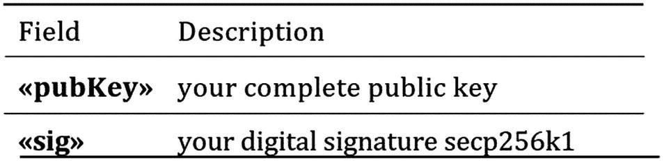

图 3-19 脚本结构 `Sig`

### 3.4.6 验证流程
所使用的语言`Script`是基于栈的，并且允许有限的操作，以避免代码中出现循环而导致执行问题。由于其低复杂性和可预测的执行时间，这些语言被认为是非图灵完备的语言。栈是一种类似于一叠扑克牌的数据结构。
有两种可用的操作：压入和弹出。压入是将一张牌放在牌堆顶部，而弹出则是将其移除。在这种情况下，牌就是数据。任何想向某人汇款的人都必须证明他们确实拥有该币。输入的`scriptSig`和所引用输出的`scriptPubKey`被合并并评估。
最初，输入到`Sig`脚本中的数据被添加到交易输入的栈中（因此，先是`sig`，然后是`pubKey`）。
该脚本从栈中提取公钥，该公钥与`scriptSig`中的`pubKey`一致，并对其应用哈希：先是`SHA-256`，然后是`RIPEMD160`。然后，它将结果与`PubKey`脚本中的公钥哈希进行比较。如果成功，则继续验证数字签名；否则，交易被拒绝。
因此，如果用于公钥的签名是使用所有需要签名的数据生成的，那么交易就是有效的。
您可以通过图 3-20 到 3-26 中的图表更详细地看到这些操作。
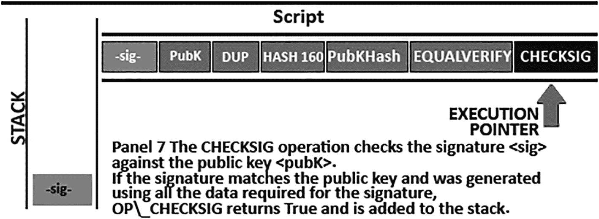
**图 3-26** 交易验证流程，步骤 7
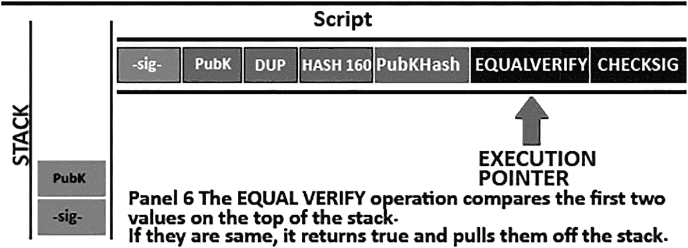
**图 3-25** 交易验证流程，步骤 6
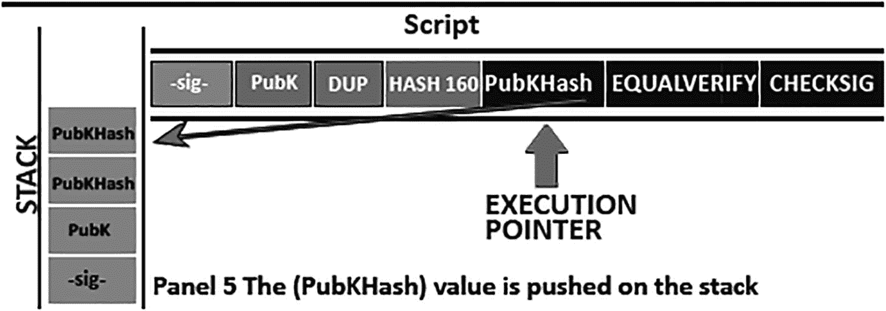
**图 3-24** 交易验证流程，步骤 5
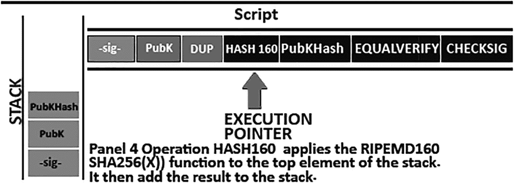
**图 3-23** 交易验证流程，步骤 4
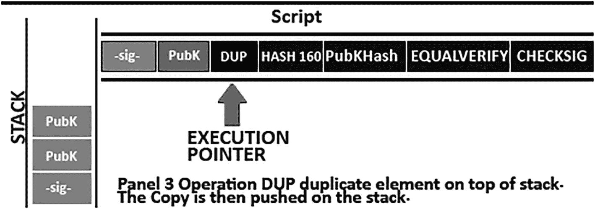
**图 3-22** 交易验证流程，步骤 3
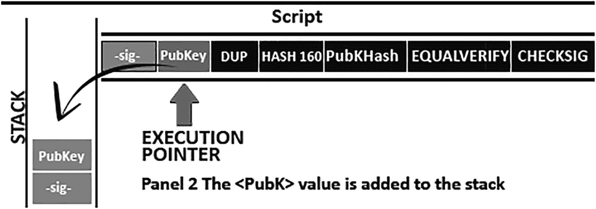
**图 3-21** 交易验证流程，步骤 2
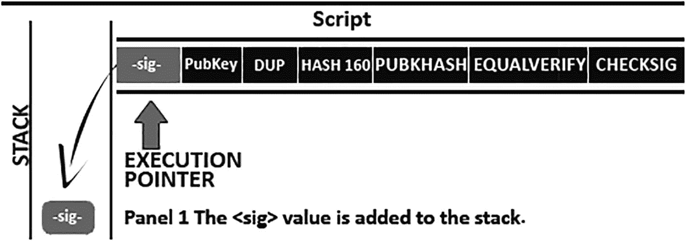
**图 3-20** 交易验证流程，步骤 1
因此，如果在评估了`scriptSig`和`scriptPubKey`之后，栈顶不是`False`，那么交易就是有效的。
事实上，交易的完整验证过程，除了对于接收它的每个节点是独立的之外，还包括您稍后会看到的其他步骤和检查。

### 3.4.7 交易结构
了解了操作过程并分析了基本组成部分之后，现在你将学习交易是如何构成的。（见图 3-27）。
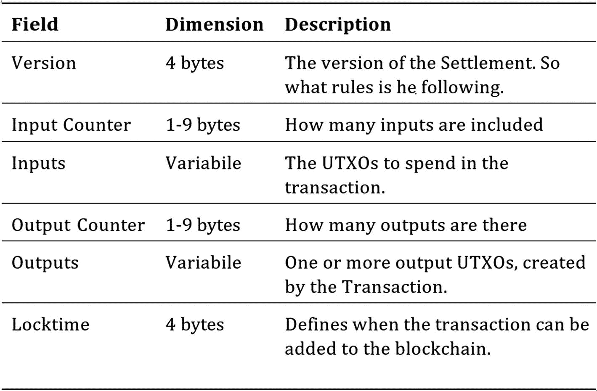
图 3-27
交易结构
`Locktime`变量是一个有趣的变量。它定义了交易可以首次被添加到区块链的时间。在大多数交易中，它被设置为 0，表示立即执行。
如果区块时间大于 0 但小于 400 毫秒，则被视为区块高度，这意味着交易直到达到该区块高度时才会被包含在区块链中。如果它超过 400 毫秒，则被解释为`UNIX`时间戳，并且在所需时间之前，交易不会被包含在区块链中。`Locktime`类似于远期支票。

### 3.4.8 交易费用
通过为每笔交易收取少量费用，交易费用既作为一种激励，促使交易被包含在下一个区块中，也作为一种威慑，防止“垃圾邮件”交易或其他形式的系统滥用。
挖掘该区块并将交易存储到区块链中的矿工收取交易费用。而且，与比特币交易的金额不同，交易费用是根据交易的大小（以字节为单位）计算的。
*   请注意，比特币区块的大小限制为 1MB（1,000,000 字节）。
*   交易数据会占用区块中的空间。
因此，当矿工填满一个交易区块时，他们会希望最大化自己能够收取的费用。他们通过选择那些为它们所占用的区块空间提供最多佣金（手续费）的交易来实现这一点。因此，在处理交易费用的价值时，重要的衡量标准是每字节的佣金。矿工根据多种因素对交易进行优先级排序，在某些情况下，他们甚至可能免费处理交易。
由于交易费用影响处理优先级，带有佣金的交易更有可能被包含在下一个被挖掘出的区块中，而佣金不足或没有佣金的交易可能会被推迟处理。
在大多数情况下，交易费用并非必需，没有费用的交易也可能稍后被处理；然而，包含交易费用可以鼓励优先处理。交易数据结构中也缺少一个费用字段。
费用是隐含存在的，即作为输入总额与输出总额之间的差额。
丢失比特币的风险很小，因为大多数钱包会自动计算并处理交易费用。但是，如果交易是通过编程方式或通过命令行创建的，则必须手动输入并核算费用。
从所有输入中扣除所有支出后剩余的任何超出的金额，就是矿工收取的佣金。
因此，如果你不想损失比特币，为你的钱包指定交易中`UTXO`（未花费交易输出）的找零也很重要。

## 3.5 交易流程
一旦产生了一笔新交易，它就会被转发到比特币网络附近的节点，以便在整个网络中传播。
然而，每个收到交易的比特币节点在将其发送给邻居之前，都会先对其进行验证。只有合法的交易才会在网络中传播，无效的交易会被第一个遇到它的节点丢弃。
如果传输的交易是合法的，该节点会将其转发给它所连接的其他节点，并同步地向发送方返回一条成功消息。如果交易无效，节点将拒绝它，并向发送方发送一条同步的拒绝消息。
因此，无效交易将被拒绝，而有效的交易则会通过网络传播，并形成交易池。交易池是已通过验证、等待被确认并添加到新区块中的交易的集合。
因此，它充当了新交易的等待区域。
为了生成新区块，矿工从交易池中选择交易。这个新区块被称为候选区块。然后，每个矿工都试图通过挖矿过程将他们的候选区块添加到区块链中。
假设当一个`UTXO`被花费时，交易 A 是交易 B 的子交易。交易 A 依赖于父交易（B）的输出`UTXO`。交易在网络中广播时并不总是按相同的顺序到达。
子交易有可能先于父交易到达。在这种情况下，首次看到该子交易的节点可能会注意到它属于一个未知的父交易。节点不会拒绝它，而是将其放入一个临时池中，等待父交易到达，之后再将子交易传递给所有其他节点。
孤儿交易池，也称为孤立交易池，是一个存放无父交易的池。一旦父交易到达，所有引用了该父交易`UTXO`的孤儿交易都会从池中被释放出来，并递归地重新验证，从而使完整的交易链能够被包含在交易池中，等待被拉入区块。
孤儿池的滞留机制确保了本来可以接受的交易不会仅仅因为其父交易迟到而被拒绝，并且无论到达顺序如何，归属链最终都能以正确的顺序重建。交易链可以是你想要的任意长度。每个节点都会根据一长串标准来检查它收到的每一笔交易。以下是基本的验证标准：
*   交易的语法和数据结构必须正确。
*   输入或输出列表都不能为空。
*   `MAX BLOCK SIZE`（最大区块大小）大于交易的字节大小。
*   对于每个输入，其引用的输出必须存在且未被花费（以防止双重支付）。
*   如果池中任何其他交易的任何输入存在被引用的输出，则该交易必须被取消（以防止双重支付）。
*   为了找到每个输入所引用的输出交易，扫描主链和交易池。请注意，如果任何输入缺少对应的输出交易，则该交易将成为孤儿交易。如果交易匹配项尚未在池中，则将其添加到孤儿交易池。
每个输入的解锁脚本必须与相应的输出锁定脚本进行比较。这些是最重要的验证规则，由每个接收交易的节点执行。此列表可能会根据更新的协议而变化。（见图 3-28）。
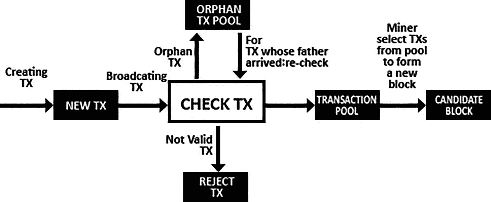
图 3-28
交易的生命周期

## 3.6 区块
区块链的数据结构是一个有序列表，其中包含交易区块的反向链接。区块链可以保存为简单的数据库或平面文件。区块链的元数据由比特币核心客户端存储在谷歌的`LevelDB`数据库中。^(⁴)
区块以“向后”的方式连接，每个区块都引用链中它之前的区块。
区块链中的每个区块都由其头部通过`SHA-256`加密哈希技术生成的哈希值来标识。此外，每个区块在其头部中使用前一个区块的哈希字段来引用其父区块，即前一个区块。
换句话说，每个区块的头部都包含其父区块的哈希值。这个将每个区块与其父区块连接起来的哈希序列，一直追溯到被称为创世区块的第一个区块，形成了一条链条。
一个区块只有一个父区块，但可以在任何时候有多个子区块。每个子区块都引用同一个父区块，并且前一个区块的`hash`字段包含相同的哈希值（父区块）。在区块链分叉期间——这是一种多个矿工几乎同时挖出多个区块的临时状态——会出现更多的子区块。
最终，“分叉”被纠正，只有一个子区块成为区块链的一部分。尽管一个区块可以有多个子区块，但它只能有一个父区块。这是由于区块的单个字段`previous block hash`引用了其唯一的父区块。
前一个区块的哈希位于区块及其头部中，其后是当前区块的哈希。
请记住，当父区块的身份发生变化时，子区块的身份也会随之改变。如果父区块以任何方式被修改，其哈希值就会改变。因此，父区块修改后的哈希值要求子区块的指针`pre-block hash`也发生改变。这又改变了子区块的哈希值，进而改变了侄区块的`preceding block hash`字段以及侄区块本身的哈希值，依此类推，直至链中的最后一个区块。
由于这种级联效应，一个拥有众多后续区块的区块，在不重新计算所有后续区块的情况下是无法被篡改的。
由于这种重新计算需要巨大的计算能力，因此一条长链的存在造就了区块链深厚的历史，这也是比特币的一个重要安全要素。前六个区块被视为对第七个区块的确认。
随着你对区块链技术的深入了解，你会发现区块变得越来越难以更改。最终，区块是一种数据结构，它包含了一组上传到区块链的交易。

### 3.6.1 区块的结构
区块由一个包含元数据或模型的头部组成，其后面跟着一系列交易，这些交易占据了区块的大部分空间。一个区块的平均大小被设置为 1MB。区块头部长度为 80 字节，而平均每笔交易至少为 250 字节。（见图 3-29。）
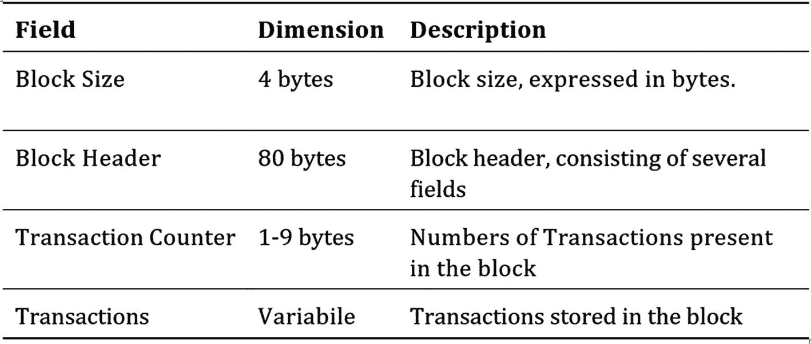
图 3-29
区块的结构

### 3.6.2 区块头部
区块头部包含三组区块元数据：
*   指向前一个区块哈希的引用，将此区块连接到区块链的前一个区块。
*   术语“目标”、“随机数”和“时间戳”均与比特币挖矿相关。
*   默克尔根是默克尔树的根，用于高效且安全地汇总区块中的交易。
默克尔树是一种树形结构。借助默克尔树，一个节点只需下载少量区块头部（每个区块 80 字节），就能检测到某笔交易是否包含在某个区块中。它通过从全节点恢复一条小的默克尔路径来实现这一点，而无需存储或扩展大部分区块链（其大小可达数 GB）。
`SPV`节点（简单支付验证节点）是不保留完整区块链并使用默克尔路径来验证交易而无需下载完整区块的节点。`SPV`节点经常使用默克尔树。`SPV`节点只下载区块头部，不保存完整的交易数据，也不下载所有区块。
它们使用认证或默克尔路径来检查某笔交易是否包含在某个区块中，而无需下载该区块的所有交易。区块头部的详细结构如图 3-30 中的表格所示。
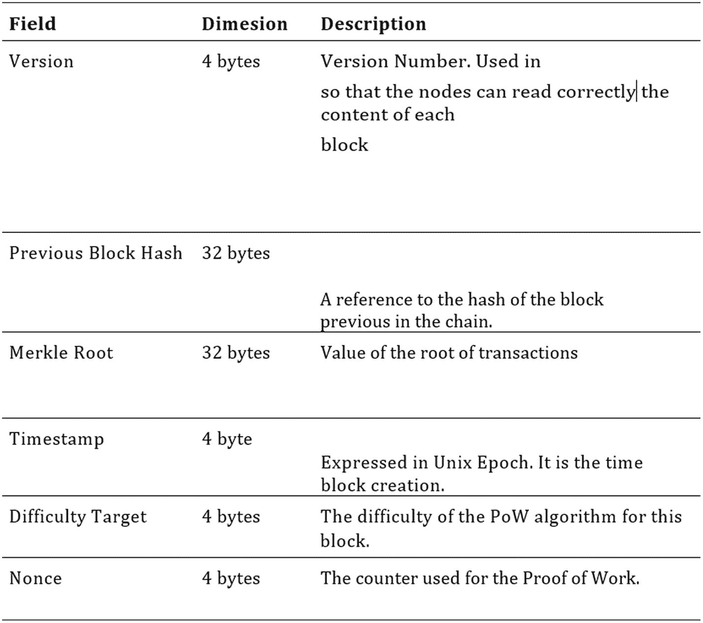
图 3-30
区块头部详情
图 3-31 展示了比特币区块链区块结构的图形示例。
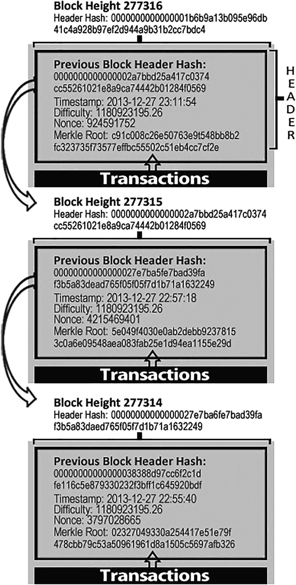
图 3-31
比特币区块链结构
正如你所见，无论是通过网络广播还是存储在区块链中，区块哈希都不包含在区块的结构化数据中。
相反，当网络收到一个区块时，每个节点都会计算该区块的哈希值。区块高度，即其在区块链中的位置，是识别区块的第二种方式。因此，一个区块可以通过两种方式识别：查看其哈希值或查看其高度。
每个连续放置在区块链“第一个”区块“之上”的区块，其位置都“更高”一个单位，就像盒子堆叠在一起一样。
认识到区块高度并非像区块哈希那样的唯一标识符至关重要。区块高度并不总是意味着唯一的一个区块。正如你将看到的，两个或更多具有相同高度的区块可能会竞争区块链中的同一个位置。区块的数据结构不包含区块高度，它不保存在区块中。
当比特币网络收到一个区块时，每个节点都会动态地确定其在区块链中的位置（高度）。

## 3.7 中本聪共识
此外，所有传统的支付系统都依赖于对中央权威机构的信任，该机构管理交易并因此管理账本。
比特币没有中央权威机构，但每个全节点都拥有一份区块链的副本，以及一个你可以信赖作为记录的公共账本。区块链并非由中央权威机构建立，而是由每个网络节点独立工作构建而成。利用网络上提供的信息，网络的每个节点都能得出相同的结论，并组装出相同的账本副本。
这种通过涌现共识实现的去中心化技术，是中本聪的关键发明。
之所以称为涌现共识，是因为它并非明确达成。没有产生共识的选举。相反，共识是数百个独立节点在简单规则和条例下异步交互而产生的涌现结果。
网络上节点独立运行的四个过程的相互作用，产生了比特币的去中心化共识：
*   每个全节点使用一套详尽的标准独立验证每一笔交易。
*   挖矿节点将这些交易自主分组到新块中，并通过工作量证明算法进行经过证明的计算。
*   每个节点在将新区块添加到区块链之前，都独立验证这些新区块。
*   每个节点独立选择更长的工作量证明链（即被证明具有比短链更高的计算能力）。

### 3.7.1 `矿工节点`
某些节点是特殊节点，称为挖矿节点或矿工节点。它们负责创建新区块并将其注册到账本中。这些节点相互竞争，以将新区块添加到区块链上。
它们之所以相互竞争，是因为谁能成功赢得区块并将其添加到链上，就能获得比特币奖励，作为对其为比特币网络共识做出贡献的激励。
为了形成新区块，矿工从交易池中选择交易，从而获得一个待注册到账本的候选区块。在选择交易时，矿工会应用一种交易属性度量标准，优先处理那些输入中包含更久远`UTXO`且金额更高的交易，而非那些较新且金额较小的交易。换句话说，给定一笔交易`Tx`。设`N`为其输入的`UTXO`数量，对于每个输入`UTXO i`。我们将`Tx`的优先级定义如下：
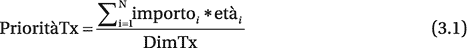
同时，它们会赋予每千字节手续费更高的交易更大的权重，而不是手续费较低的交易。
比特币区块的平均大小设定为 1MB。因此，矿工会尝试选择一系列交易，在遵循优先级（根据时效和金额）以及最大区块大小的前提下，使其获得更高的收入。
因此，交易手续费通常根据交易的规模来评估。

### 3.7.2 `Coinbase 交易`

添加到区块中的第一笔交易是一种独一无二的交易，与常规交易不同。它被称为`Coinbase 交易`。

这笔交易允许挖出区块的矿工获得以下奖励：
- 因参与并贡献于添加新区块的共识过程而获得的激励。
- 其添加到区块中的所有交易的手续费总和。

显然，这笔交易的受益比特币地址就是挖出该区块的矿工的地址。每笔交易的输入总值与输出总值之间的差额用于计算总手续费。也就是说：

- 设 `N` 为输入总数，`I` 为每个输入的索引，`Vi` 为输入 `i` 的金额。
- 设 `M` 为输出总数，`O` 为每个输出的索引，`Vo` 为输出的金额。那么：

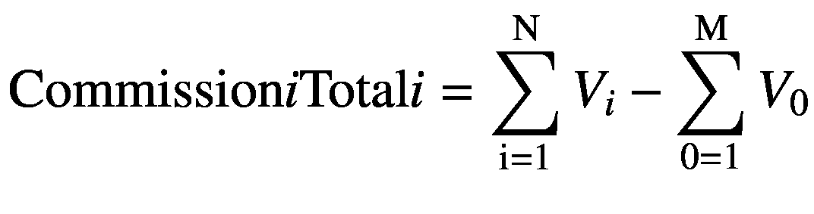
(3.2)

相反，矿工奖励最初为 50 个比特币，之后每 210,000 个区块减半一次。这意味着比特币在每个区块的构建过程中，以既定且递减的速率被“铸造”出来。每十分钟形成一个新区块，其中包含一个从零开始新创建的比特币。每 210,000 个区块（大约每四年），货币发行率会降低 50%。在网络运行的头四年里，每个区块包含 50 个新比特币。^(⁵)

奖励基于区块高度，初始值为每个区块 50 个比特币，每 210,000 个区块减半。由于该区块的高度为 277,316，因此当前正确的奖励是 25 个比特币。

该计算过程可以在比特币核心客户端的 `GetBlockValue` 函数中看到，如代码清单 3-1 所示。

```cpp
int64_t GetBlockValue(int nHeight, int64_t nFees)
{
    int64_t nSubsidy = 50 * COIN;
    int halvings = nHeight / Params().SubsidyHalvingInterval();
    if (halvings >= 64)
        return nFees;
    // 每 210,000 个区块（大约每 4 年），区块奖励减半。
    nSubsidy >>= halvings;
    return nSubsidy + nFees;
}
```

代码清单 3-1
`GetBlockValue` 函数

### 3.7.3 构建区块头

在从交易池和 `Coinbase 交易` 中计算出交易后，矿工会继续构建区块头，以生成候选区块。接下来将执行以下步骤：

1.  指明区块的版本号，该版本号说明了区块的架构。
2.  添加其接受的父区块的哈希值。
3.  将 Merkle 树根值加入计算。因此，在对每笔交易计算 SHA-256 哈希值后，将这些哈希值成对合并，形成树的每一层，直到所有交易都被汇总到树“根”的一个节点中。结果，Merkle 树根将*所有交易*存储在一个 32 字节的值中。
4.  添加以 Unix 纪元格式表示的时间戳，该时间戳对应区块创建的当前时间。
5.  通过填充难度目标，定义使区块成为合法区块所需的工作量证明难度。
6.  最后一个字段是随机数，初始化为 0。

此时，区块头的所有其他字段都已填充完毕，挖矿操作可以开始。现在的目标是找到一个随机数值，使得区块头的哈希值低于难度目标。

### 3.7.4 难度目标

目标值在挖矿中使用。它是一个数字（以十六进制表示），区块哈希值必须小于等于该数字，该区块才能被添加到账本中。

目标值每 2016 个区块（大约两周）调整一次，以确保区块平均每十分钟被挖出一个。

`工作量证明` 的复杂度由移动平均值决定，该平均值旨在使每小时的平均区块数适应硬件速度的持续提升以及节点运行兴趣随时间的变化。如果区块生成过快，难度就会增加。

目标值由网络中的每个节点独立计算，但需遵循比特币协议规则。

规则规定，每 2,016 个区块后，所有节点自动重新调整 `工作量证明` 的难度。重新调整难度的计算会将寻找剩余 2,016 个区块所花费的实际时间与预期的 20,160 分钟（基于每十分钟生成一个区块的目标，相当于两周）进行比较。

然后计算实际时间与预期时间的比率，并据此对难度进行调整。如果网络发现区块的速度快于每十分钟一个，难度就会上升。如果发现区块的速度慢于预期，难度就会下降。

设 `RecentBlockTime` 为表示寻找最新 2016 个区块所花费时间的变量。计算*难度目标*的公式为：

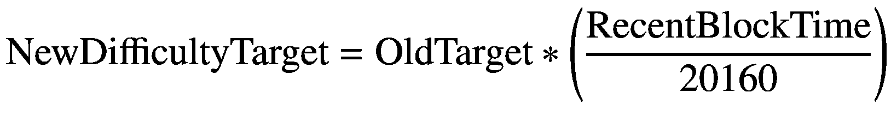
(3.3)

每个周期的调整必须小于 4 倍，以避免难度目标出现显著波动。

如果所需的难度调整超过 4 倍，则将其限制在允许的最大值内。

所有剩余的修改将在下一个周期进行。由于每个节点都遵循相同的共识规则，并且所有区块都相同，因此它们都将得出相同的难度值。

如果一个节点错误计算了目标值（或对此说谎），并基于该值生成了一个区块，网络中的其他节点将拒绝该区块，因为它不符合目标值的要求，并且投入在该区块挖掘上的所有工作都将白费。

### 3.7.5 工作量证明

一旦矿工节点生成了一个候选区块，该区块必须由节点的硬件平台进行提取。它必须解决工作量证明算法，以使该区块有效。比特币挖矿过程中使用了 `SHA-256` 哈希函数。

简单来说，*挖矿*就是通过反复修改 `nonce` 参数来对区块头进行哈希处理的过程，直到生成的哈希值不匹配特定的目标。哈希函数的结果无法提前预测，也无法生成产生特定哈希值的模式。哈希函数具有此特性，这意味着达到与特定目标相匹配的哈希结果的唯一方法是重复输入，直到随机出现所需的哈希结果。^(⁶)

因此，我们必须明白，矿工会计算此区块头的哈希值，以判断其是否小于当前目标。如果哈希值不小于目标，矿工就会增加 `nonce`（通常加一）并再次尝试。“在比特币网络当前的难度级别下，矿工必须尝试数百万次才能找到一个 `nonce`，使得区块头的哈希值足够低。”

此外，虽然在早期可以用普通家用电脑挖矿，但如今你必须使用专门的昂贵硬件，并通过加入矿池与其他用户共享你的算力。当挖矿节点解决了问题，它会将区块发送给所有相邻节点，以便其在网络中传播、被验证，并最终添加到账本中。

### 3.7.6 验证新区块

在区块链上达成共识的第三步是独立验证，由每个接收到新区块的节点执行。

随着新解出的区块在网络中传播，每个节点在将其转发给对等节点之前，会运行一系列测试以确保其有效。因此，只有合法的区块才会在网络中传播。独立验证也确保了诚实的矿工能将自己的区块添加到区块链上并从中获利。

那些行为不诚实的矿工，其区块会被拒绝，不仅无法获得奖励，而且寻找工作量证明解决方案的努力也会付之东流，因此还要承担无法收回的电费成本。

当一个节点收到新区块时，它会将其与必须满足的大量要求集合进行比较以进行验证；否则，该区块会被丢弃。

以下是可以总结的最重要的特征列表：

- 区块的结构和语法正确。
- 目标值准确。
- 必须认识到，区块头哈希值比目标难度更低（工作量证明检查）。
- 区块时间戳的未来时间不超过两小时（容纳时间错误）。
- 区块大小符合协议的标准。
- 初始交易是币基交易。
- 其中包含的交易是有效的（使用交易流程中概述的验证标准重新检查交易）。

因此，独立验证确保了矿工无法作弊。矿工必须根据所有节点共同遵守的共享协议或规则集构建一个完整的区块，并使用适当的工作量证明解决方案来提取它。他们为此消耗大量电力，如果作弊，所有的电力和努力都将白费。因此，不依赖他人的验证是去中心化共识的关键部分。

### 3.7.7 区块链分叉

由于区块链是一种去中心化的数据架构，其不同的副本并非总是一致的。区块可能在不同时间到达不同节点，使节点对区块链产生不同的视角。为了解决这个问题，每个节点都会选择工作量证明最强的区块链，也称为最长链或累积难度最大的链，并尽可能扩展它。

节点可以通过将每个区块中记录的难度相加，来计算用于形成一条链的累计工作量证明总量。

通过让所有节点都选择累积难度最长的链，全球比特币网络最终会收敛到一个一致的状态。

节点管理三组区块：

- 第一组是链接到主区块链的区块。
- 第二组是那些在已知链中没有已知父块的区块。
- 第三组是构成主区块链分支的区块（侧链）（孤块）。

当任何一项验证标准失败时，无效区块会被移除或拒绝，并且不会包含在链中。你必须认识到，在任何给定时间，主链就是具有最大或最高累积难度的区块链。

除非有两条等长的链，其中一条有更大量的有效工作量证明，否则这通常就是区块数量最多的链。当发现新区块时，节点会尝试将其整合到当前的区块链中。

节点会检查上一个区块的哈希字段，该字段包含新区块的父块地址。然后，节点会在当前区块链中搜索该父块。在最近的情况下，父块通常是主链的“顶端”，这意味着这个新区块扩展了主链。

此外，新区块有时可能会扩展一条非主链的链。在这种情况下，节点会将新区块连接到侧链上，从而能够比较侧链与主链的难度。

如果侧链的累积难度高于主链，节点就会回退到侧链，使侧链成为新的父链，而原来的主链则变为侧链。

如果收到一个有效的区块，但在当前链中未发现其父块，则该区块被称为*孤块*。孤块会被放入孤块池中，并一直留在那里，直到它们的父块出现。

一旦父块到达或被接收并连接到现有链中，孤块就可以从孤块池中取出并链接到父块上。请记住，孤块通常发生在短时间内挖出的两个区块以相反顺序被接收到时。通过选择难度最高的链，所有节点最终都能达成网络层面的共识。

临时的链变更最终会通过用新的工作量证明扩展现有的一条链来解决。挖矿节点使用它们的算力来“投票”决定下一个要被提取的区块。当它们提取新区块以扩展链时，这个新区块就代表了它们的投票。

### 3.8 总结

当你想到“区块链”这个词时，脑海中应该浮现的主要概念是比特币，你在本章中已经了解了这一点。我通过示例解释了比特币的技术细节、比特币区块链的区块结构以及区块链中的交易流程。要开发区块链应用程序，你必须理解这些基本概念。

下一章将重点介绍以太坊，这是一个基于区块链的软件平台，主要用于支持市值仅次于比特币的全球第二大加密货币。

脚注 1   2   3   4   5   6