# 4. 以太坊

比特币区块链模型已被证明是一种适用于加密货币的有效范式，这激发了人们对区块链在各个应用领域的研究和兴趣，并使其日益受到关注。

维塔利克·布特林（Vitalik Buterin）很早就意识到了区块链模型的潜力。他认为其远不止是一个加密货币平台。

对比特币的热情促使他在 17 岁时与米哈伊·阿利西（Mihai Alisie）共同创办了*《比特币杂志》*，这是一家涵盖比特币相关话题的网站和印刷杂志。维塔利克很快意识到，区块链技术所能做到的远不止于此。

2013 年，他宣称比特币需要一种脚本语言，用于开发和创建*去中心化应用程序*。

在未能说服比特币社区后，他开始基于区块链技术开发一个新的分布式信息平台。于是，以太坊于 2015 年 7 月 30 日诞生，并引入了一项名为*智能合约*的新功能。

新一代区块链由此开启，并且至今仍是最为突出的——即区块链 2.0。

请参考图 4-1，其中对比了比特币和以太坊。左侧是比特币，其堆栈顶层是用于进行转账操作的**钱包**应用程序。右侧是以太坊，它将区块链转变为一个计算系统框架或架构，并在去中心化领域开启了一个充满机遇的全新世界。注意，以太坊支持智能合约以及运行这些合约的以太坊虚拟机（EVM）。而智能合约则进一步实现了超越单纯价值转移的去中心化应用程序。通过这种方式，区块链被注入了逻辑和计算能力。

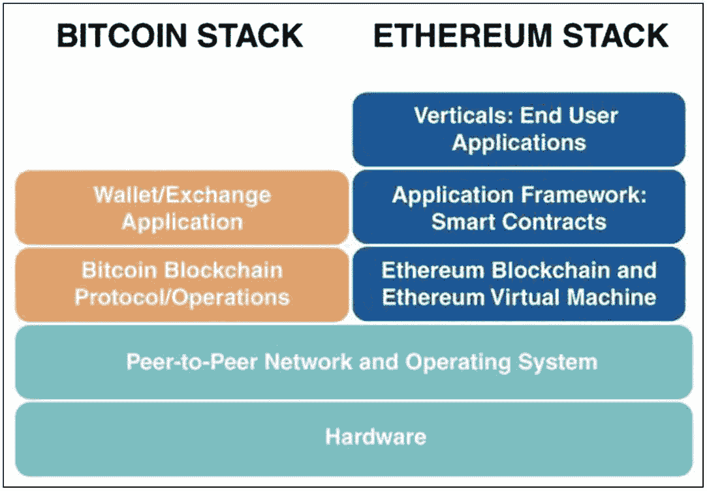

图 4-1
比特币与以太坊堆栈对比

以太坊用户不仅可以通过交易转移数字货币，还能开发智能合约，从而在特定条件下执行交易。从各方面来看，他们可以为价值转移的方式设定条件。可以理解，“可编程货币”的理念吸引了世界各地的用户、开发者和公司。

此外，开发者还可以实现并创建在以太坊区块链分布式网络中运行的应用程序，即去中心化应用程序。

有了以太坊，区块链成为一个去中心化的 IT 平台。在此平台上，除了转移数字货币，还可以分发新的应用程序，并与网络中的其他用户进行交互。

任何人都可以编写新的应用程序在区块链网络上运行，而非在中心化服务器上。这不仅意味着可以规避任何来自中央权威的审查，而且还能抵御篡改，并允许所有用户在与应用程序交互之前检查其代码。

借助以太坊，区块链的应用范围当然不局限于金融领域；它还可以应用于选举系统、域名注册、众筹平台和知识产权等领域，仅举几例。

简而言之，以太坊是一个具有革命性和远见的项目。它除了被公认为最佳在线投资之一外，还为其年轻的创始人带来了世界声誉。这项发明在 2014 年获得了享有盛誉的世界技术奖。

本章将详细介绍定义以太坊区块链的组件和技术。

## 4.1 区块链作为状态转换系统

*以太坊区块链*是一个开源的公共区块链。以太坊实现的模型可以用三个定义来概括：

*   **密码学安全：** 账本中的信息安全由复杂的数学算法和难以破解的密码学技术保证。换句话说，几乎不可能欺骗这个系统。

*   **交易单例机器：** 根据其构建范式，系统中存在一个单一的、规范的机器实例，负责处理系统中生成的所有交易。存在着一个所有人都相信的全局真相。

*   **共享状态：** 此机器中存储的状态是共享的，并且所有参与者都可访问。

因此，以太坊区块链的范式是一个密码学安全的、共享状态的交易单例机器。以太坊区块链本质上是一个基于交易的状态机。

状态机是一个由状态和转换组成的图。

*   **状态**描述了一个对象在其生命周期中的某段时间，由顶点或*节点*表示。

*   **转换**连接两个状态，由有向弧表示。

状态的退出定义了对象对事件发生的响应。事件是在时间和空间中发生的某种现象的反复出现。

因此，状态机是一个自动机，它根据一系列输入数据改变其内部状态。（见图 4-2）

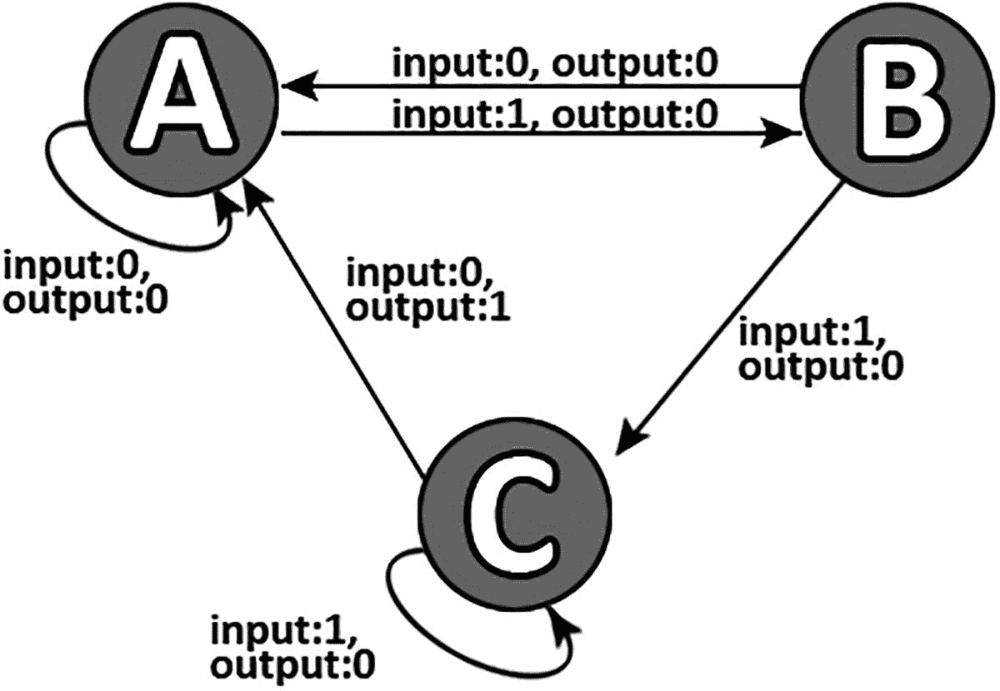

图 4-2
有限状态机示例

由此，你可以推导出：

*   区块链的状态是账本中所有交易的集合。
*   区块链中的事件，例如创建一笔交易。
*   区块链中的交易函数，它接收一个状态和新交易，并生成一个新状态。

所以，令 `S` 为一个状态，`TX` 为一笔交易，`APPLY` 为状态转换函数。它可以被正式定义为：

`APPLY (S; TX) -> S0` 或 `ERROR`

注意，以太坊的状态机从一个创世状态开始，类似于网络中尚未进行任何交易时的空列表。

为了引起从一个状态到另一个状态的转换，交易必须是有效的。当各种交易被执行时，这个创世状态会随时间推移转换到后续状态。（见图 4-3）

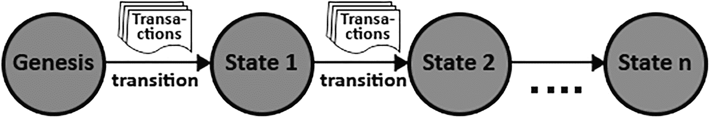

图 4-3
基于交易的状态转换

在任何交汇点，最终状态都代表了以太坊的全局状态。

以太坊的全局状态包含交易。这些交易被分组到区块中。每个区块包含一定数量的交易，并链接到前一个区块。见图 4-4

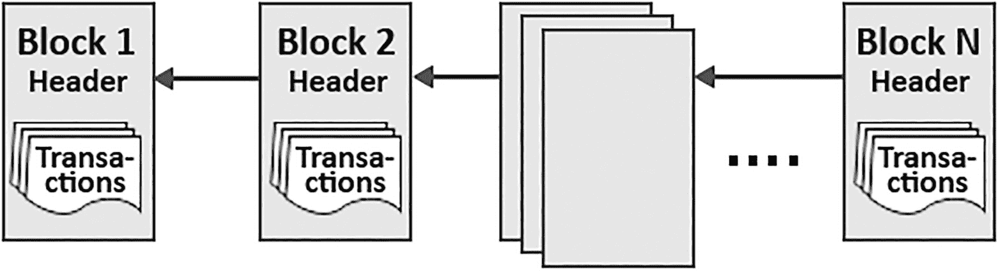

图 4-4
交易流程

从技术角度来看，总账可以被视为一个状态转换系统。其中存在一个包含所有总账交易的状态，以及一个接收状态和交易并返回新状态的转换函数。

例如，在传统的银行系统中，状态是账户余额表，交易是将 `X` 金额从账户 `A` 转移到账户 `B` 的请求，而状态转换函数则是减少账户 `A` 中的 `X` 金额，并增加账户 `B` 中的 `X` 金额。

如果账户 `A` 的余额开始时少于 `X`，那么状态转换函数会报错。令 `TX = 从 Luca 向 Sara 发送 70`。

`APPLY ((Luca: e50; Sara: e50); TX) = ERROR`

或者，令 `TX = 从 Luca 向 Sara 发送 e20`。

`APPLY ((Luca: e50; Sara: e50); TX) = Luca: e30; Sara: e70`


## 4.2 以太坊账户

在以太坊中，状态是由被称为*账户*的对象累积而成的，这些对象扮演着核心角色。共有两种类型的账户：

- 外部拥有账户（EOA）
- 合约账户

通常，EOA 是用户账户，由私钥控制，并且没有关联的代码。而合约账户由其合约代码控制，并且有关联的代码。（见图 4-5。）

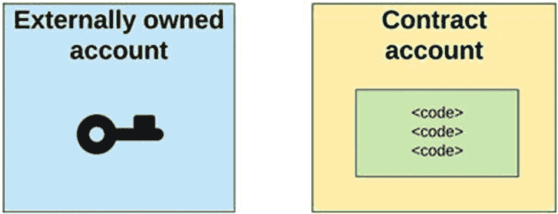

图 4-5 — 以太坊账户

### 4.2.1 账户状态

此账户状态由四个元素组成，无论账户类型如何，这些元素都存在：（见图 4-6。）

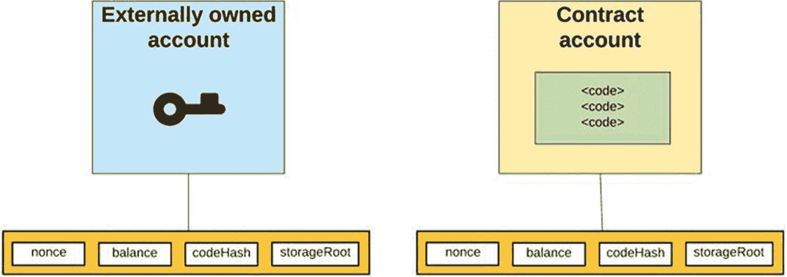

图 4-6 — 以太坊中的账户状态

- **Nonce（仅使用一次的数字）：** 如果账户由外部拥有，此数字表示从该账户地址发送的交易数量。如果账户是合约账户，则 Nonce 是该账户创建的合约数量。
- **Balance（余额）：** 这是此地址拥有的`Wei`数量。一个以太币等于`10¹⁸` Wei。
- **StorageRoot（存储根）：** 一棵帕特里夏默克尔树（Merkle Patricia Tree，请参阅第 2 章）根节点的 256 位哈希值。此树编码了该账户的存储账户哈希值，默认为空。对于合约账户，这是智能合约存储。
- **CodeHash（代码哈希）：** 这是 EVM（以太坊虚拟机）账户的哈希代码。对于合约账户，这是经过哈希并以`codeHash`形式存储的代码。对于外部拥有账户，`codeHash`是空字符串的哈希值。

### 4.2.2 外部拥有账户（EOA）

外部拥有账户：

- 拥有以太币余额。
- 可以发送交易（它们可以转移资金或激活合约的代码）。
- 由私钥控制。
- 没有关联的代码。

请注意，每个账户都由一个密钥对定义——一个私钥和一个公钥。与比特币类似，以太坊也使用 ECDSA（椭圆曲线数字签名算法）。以太坊也使用标准`secp256k1`规定的曲线。

您应该已经了解私钥和相应公钥的工作原理。然而，以太坊在生成*以太坊地址*方面与比特币不同。

这些地址与比特币一样，是从公钥派生出来的。但在此过程中，会应用哈希函数`Keccak 256`。从这个函数的结果中，您会得到*公钥哈希值*。从该哈希值中，取最右边的 20 个字节，您将得到以太坊地址。所有以太坊地址都以`0x`前缀开头。

- 账户基于其地址进行索引。
- 创建外部拥有账户没有成本。
- EOA 使用交易（或者如您将看到的消息）来与以太坊区块链网络交互。
- 它们可以发送交易，将数字货币转移到其他外部属性账户。
- 它们可以向合约账户发送交易以调用智能合约。

### 4.2.3 合约账户

合约账户代表一个智能合约，这意味着：

- 它有一个地址。
- 它有一个以太币余额。
- 它有关联的代码。
- 它由关联的代码控制。
- 代码的执行由从其他账户（EOA 或合约账户）接收的交易或消息（调用）触发/调用。
- 一旦执行，它将执行任意复杂度的操作（图灵完备），并操作其自己的持久存储；它可以拥有自己的永久状态，并可以调用其他合约。

合约地址是通过对发送方账户地址及其 nonce 进行 SHA-3 哈希（也称为`Keccak-256`），然后取此结果的最右边 20 个字节生成的。合约账户在创建和使用（执行）时都有成本，因为它们使用计算资源和网络存储。

### 4.2.4 外部拥有账户与合约账户的区别

首先，需要明确的是，要参与以太坊网络，需要一个外部拥有账户。此外，通过以太坊网络发送的任何类型的消息都有成本，因为它会使用计算和存档资源。

这意味着外部拥有账户可以向其他外部拥有账户或创建其他合约的账户发送或传递消息。（见图 4-7。）


图 4-7 — 来自 EOA 的交易

这意味着两个外部拥有账户之间的消息仅仅是价值的转移。

然而，从外部拥有账户发送到合约账户的消息会激活合约账户的代码，使其能够执行各种操作（例如，转移代币、写入内部存储器、铸造新代币、运行一些计算、创建全新的合约等）。

换句话说，通过从外部拥有账户发送到合约账户的消息来调用智能合约。（见图 4-8。）

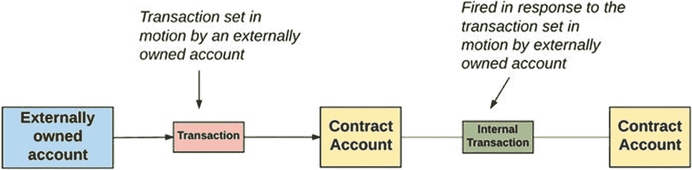

图 4-8 — 合约账户的交易示例

与外部拥有账户不同，合约账户无法发起新的交易。相反，合约账户只能响应收到的不同交易（来自外部拥有账户或另一个合约账户）来生成交易。您将在“交易和消息”一节中找到更多关于合约调用的信息。

因此，以太坊区块链上发生的任何操作，总是由受外部监管账户激活的交易触发的。


### 4.2.5 存储密钥：加密密钥库

每个私钥/地址对都编码在一个密钥文件中，这些密钥文件是 JSON 文本文件。此外，密钥文件的关键组成部分——账户的私钥——始终使用账户创建时输入的密码进行加密。

密钥文件位于创建或导入该账户的以太坊节点数据目录的 `keystore` 子目录中。

该密钥库使用椭圆曲线 `secp256k1`（依据高效加密标准定义），由 `libsecp256k` 库实现，您可以在 `github.com/ethereum/go-ethereum/accounts` 找到它。账户以 Web3 秘密存储格式存储在磁盘上。

为以太坊账户创建加密密钥库后，您可以使用此账户管理器来满足账户生命周期的所有需求。这包括以下基本功能：

- 创建新账户
- 删除现有账户
- 更新访问凭证
- 导出现有账户
- 导入到另一台设备

尽管密钥库定义了用于存储账户的加密级别，但并没有一个全局主密码可以授予所有人访问权限。相反，每个账户都是单独管理的，并以各自独立的加密格式存储在磁盘上，从而确保隔离更加彻底，并使用更严格的凭证。

这种独立性意味着，任何需要访问账户的操作都必须以密码短语的形式，提供该特定账户所需的身份验证凭证：

- 创建新账户时，调用者必须提供一个密码短语来加密该账户。此密码短语将在后续任何访问时被要求提供。
- 删除现有账户时，调用者必须提供密码短语以验证账户所有权。
- 更新现有账户时，调用者必须同时提供当前密码短语和新密码短语。操作完成后，该账户将无法再通过之前的密码短语访问。
- 导出现有账户时，调用者必须同时提供一个当前密码短语来解密账户，以及一个用于在返回密钥文件给用户之前重新编码该账户的密码短语。这是为了在不共享凭证的情况下，允许账户在机器和应用程序之间迁移。
- 导入新账户时，调用者必须同时提供待导入密钥文件的加密密码短语，以及一个用于存储该账户的新密码短语。这是为了允许使用与迁移时不同的凭证来存储账户。

因此，密码短语丢失后没有任何恢复机制。加密密钥库的密码特性确保了账户凭证无法以任何方式被暴力破解。对于账户管理，有多种钱包应用程序可以高效管理。

## 4.3 世界状态

以太坊区块链的世界状态是以太坊地址（160 位标识符）与账户状态之间的映射。这种映射通过一种称为“修改版默克尔帕特里夏树”的数据结构来维护。让我们来看看它究竟是什么。

### 4.3.1 字典树

字典树，也称为*数字树*或*前缀树*，是一种有序树状数据结构，用于存储动态集合或关联数组，其中键通常是字符串。通常，树中节点的位置定义了与其关联的键。节点不保存自身键的副本，而是依赖节点在树中的位置。（见图 4-9。）

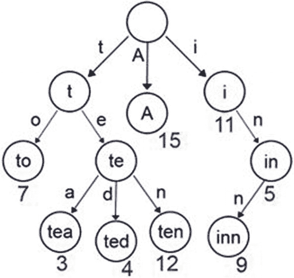

**图 4-9** 字典树示例

树的根节点关联空字符串，一个节点的所有后代共享与该节点关联的前缀。并非所有节点都必然代表一个有效的键，有效的键通常出现在叶子节点，有时也可能出现在某些内部节点中。

### 4.3.2 基数树

请注意，基数树，也称为紧凑前缀树或基数特里树，是一种对空间进行优化的字典树数据结构。在这棵树中，与字典树不同，每个叶子节点如果只有一个子节点，就会与其父节点合并。（见图 4-10。）

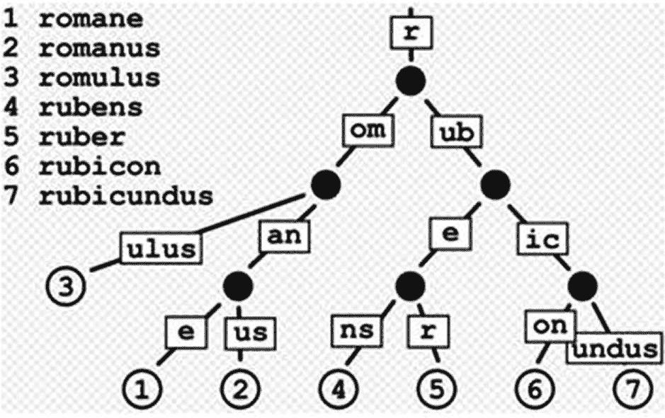

**图 4-10** 基数树示例

这样做的结果是，每个内部节点的子节点数量最多为值 `r`，`r` 是赋给基数树基数变量的正整数。该值是 `2x` 的幂，其中 `x` 大于或等于 1。这使得基数树对于键是长字符串的集合，以及键共享长前缀的集合，效率高得多。因此，如果基数等于 2，就得到一棵二进制基数树。

设 `k` 为键的长度。基数树允许在 `O(k)` 时间内完成搜索、插入和删除操作。这看起来似乎不太有优势，但它们可以用更少的比较次数完成这些操作，并且所需的节点数远少于平衡树。

通常，基数树用于构建键可以表示为字符串的关联数组。它们在 IP 路由中有特殊应用，因为其能够用少量例外包含大范围值的能力，特别适合 IP 地址的层次化组织。


### 4.3.3 Patricia Trie

注意，`Patricia trie`是一种`Radix tree`，其中基数为 2。（见图 4-11。）

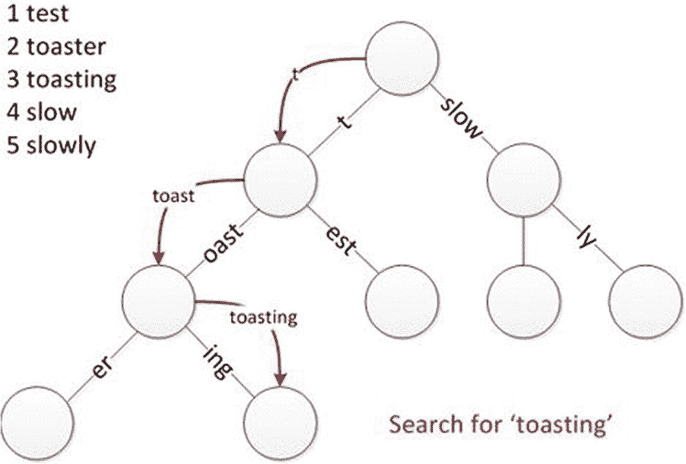

**图 4-11**
树基数，`radix = 2`

换句话说，它是一个二叉树（`radix = 2`），其中每个节点有两个子节点。因此，在树的每个分叉处，每个非叶子节点都面临一个二元选择（两个分支）。这意味着键的每一位都会被单独比较，每个节点都是一个双向分支（即左和右）。

`Patricia trie`是二叉树（`radix = 2`）的一个特殊变体，它不是显式存储每个键的每一位，而是只存储区分两个子树的第一位的位置。

在交集操作期间，算法会检查搜索键的索引位，并选择合适的右子树或左子树。`Patricia trie`的显著特点之一是，它为每个存储的键仅插入一个节点，这使得`Patricia trie`比标准的二叉树紧凑得多。我们提供一个示例来帮助理解`Patricia trie`。假设你在`Patricia trie`中放入三个键：`smiled`、`smiles`和`smile`。

这三个键的二进制表示如图 4-12 所示。

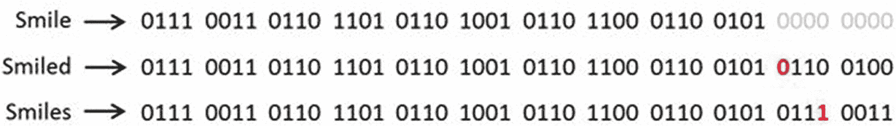

**图 4-12**
`Patricia trie`示例

我们注意到`smile`是`smiled`和`smiles`的前缀。

分析二进制表示，我们可以看到第一个不同的位（从左到右）是`0`（在第二行中以红色突出显示）。因此，`smiled`将是`smile`的左子节点。同样地，`smiles`将是`smiled`的右子节点，因为它们共享相同的前缀，直到某一位的值为`1`（在第三行中以红色突出显示）。插入这三个键后得到的`Patricia trie`如图 4-13 所示。

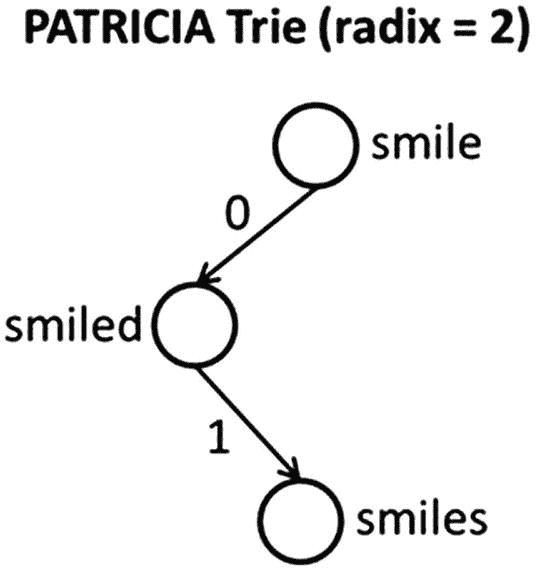

**图 4-13**
`Patricia trie`示例

此外，由于实际键不再显式存储，你需要在索引的记录上对键进行完全比较以确认匹配。关于这一点，`Patricia trie`与使用哈希表的索引有特别的相似之处。

### 4.3.4 以太坊修改版默克尔帕特里夏树

本节解释以太坊如何修改了默克尔帕特里夏树。

在修改版默克尔帕特里夏树中，树的键由以太坊地址（20 字节，160 位地址）表示，并以十六进制表示法（16 个字符）呈现。账户状态中的值对应于该以太坊地址。

对于密码学安全的默克尔树，每个节点都通过其哈希值被引用，树的根作为整个树的密码学印记。换句话说，每个节点的确定性密码学哈希被精确地用作指向该节点本身的指针。

这为数据提供了一种密码学认证形式。如果某个树的根哈希是公开已知的，那么任何人都可以提供证据，证明该树在特定路径上具有给定值，前提是逐级提供节点。攻击者无法提供不存在的（路径，值）对证明，因为根哈希基于所有底层哈希，任何更改都会改变根哈希。这就是树的“默克尔”部分。

此外，修改版默克尔帕特里夏树中有三种不同类型的节点：

- **扩展节点：** 包含多个节点的公共键的一部分（编码路径），并包含对后续节点的引用（键），或下一个节点的哈希。因此，该节点由这两个字段（编码路径，键）构成。
- **分支节点：** 包含指向具有相同键前缀的不同节点的指针。一个分支节点有 17 个字段，分别对应十六进制字母表的每个字符（16 个字符）和一个值字段，用于在路径已完全遍历时包含最终的目标值，即如果存在键值对（键：以太坊地址，值：账户状态）且键（以太坊地址）终止于该分支节点。该节点由 17 个字段（`v0` ... `v15`，`value`）组成。
- **叶子节点：** 包含一个值和键的剩余部分（称为`key-end`）。指向叶子节点的键（以及因此你的以太坊地址）是其所有父节点的前缀与叶子节点的`key-end`的串联。

一个扩展节点永远只有一个子节点。出于这个原因，该子节点只能是一个分支节点。事实上，如果它指向一个叶子节点，它们将被合并为一个单独的叶子节点。如果它指向一个扩展节点，它们将被合并为一个单独的扩展节点。在图 4-14 中，你可以看到各种类型节点的结构。

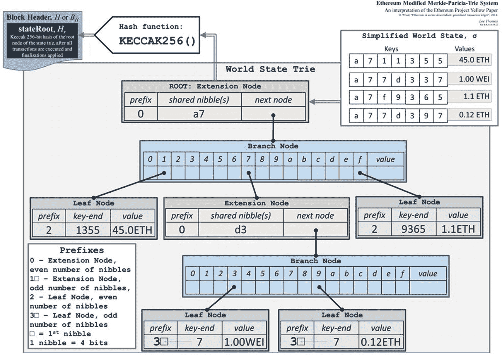

**图 4-14**
以太坊修改版默克尔帕特里夏树

为简单起见，`value`字段存放账户余额。但实际上，它存放的是应用了`RLP`函数（序列化函数）于账户状态（包含四个字段）后的结果。相反，节点使用的哈希函数是`SHA 3`。

如你所见，扩展节点和叶子节点都由两个字段组成：一个专门用于地址路径的字段，以及一个专门用于值的字段。对于扩展节点，这个值是它所指向节点的哈希。对于叶子节点，它是被序列化的账户。

但是以太坊如何区分这两种节点呢？

它添加了一个前缀。这是图中称为`prefix`的字段。假设一个十六进制字符等于 1 个`nibble`的单位。所以，一个`nibble`相当于 4 位。因此，使用以下前缀：

- `0` 表示路径字段中`nibble`数量为偶数的扩展节点。
- `1` 表示路径字段中`nibble`数量为奇数的扩展节点。
- `2` 表示路径字段中`nibble`数量为偶数的叶子节点。
- `3` 表示路径字段中`nibble`数量为奇数的叶子节点。

为什么区分扩展节点和叶子节点很重要？

因为如果是扩展节点，那么`value`是一个指向分支节点的指针（即它的哈希）。而如果是叶子节点，那么`value`是通过`RLP`函数序列化后的账户状态。

以太坊中的所有默克尔树都是以太坊默克尔帕特里夏树。这种结构通过一个扁平的键/值数据库来维护。

### 4.3.5 存储根

一个 256 位的哈希根节点或`Merkle Patricia`树的基节点，将账户存储的内容编码为从`Keccak`哈希（256 位）到 256 位`RLP`编码整数值的映射。然后，对于合约账户而言，这就是智能合约的存储。图 4-15 展示了这一概念。

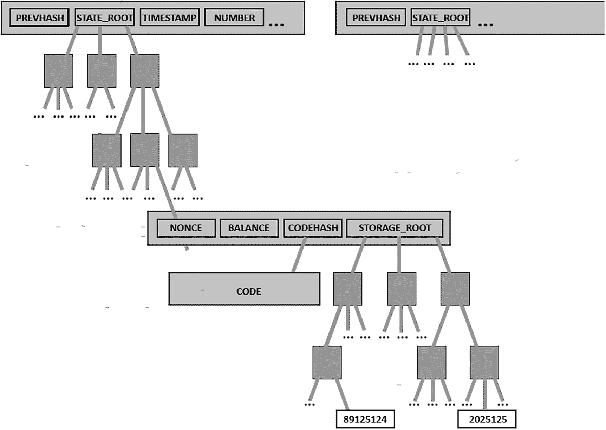

**图 4-15**
存储根是用于账户存储的`Merkle Patricia Trie`的根或基


### 4.3.6 为什么要用默克尔树？

能够高效地将所有这些信息存储在默克尔树中，在以太坊中极具价值，尤其对于我们称之为*轻节点*的节点而言。区块链由一组节点共同处理。通常，节点分为两类：全节点和轻节点。

全节点通过归档从创世区块到最新区块的整个链来同步区块链，并执行其中包含的所有操作。矿工通常为了挖矿过程而保留全节点。

也可以在不挖矿的情况下下载全节点。无论如何，每个全节点都包含整个区块链。但只要一个节点不需要执行每笔交易或查询历史数据，就没有必要存储整个区块链。

这就是轻量级节点的概念应运而生的原因。它们不需要下载和存储整个链并执行所有轻节点的交易，而只需下载从创世区块到当前区块的区块头链，而不执行任何交易或检索任何状态。由于轻节点可以访问包含三个默克尔帕特里夏树哈希值的区块头，它们仍然可以轻松生成并接收关于交易、事件、余额等信息的可验证响应。

## 4.4 以太坊虚拟机

以太坊虚拟机（通常缩写为 EVM）是计算核心，允许在以太坊平台之上执行复杂的代码（智能合约）。因此，它是一个虚拟机，即能够通过虚拟化过程在各方面模拟物理机器的软件。在虚拟化过程中，物理资源（CPU、RAM、硬盘等）被分配给在虚拟机上运行的应用程序（包括其操作系统）。它的作用类似于 Java 虚拟机（JVM）对 Java 的作用，即提供一个安全、隔离且受保护的环境，与主机上运行的其他进程或文件隔离开。

EVM 的崩溃或故障不会对主机的文件系统和操作系统进程造成副作用。EVM 还充当网络节点的担保人，这些节点为存储和处理潜在有害的智能合约“贡献”自己的物理基础设施。以太坊区块链（与比特币类似）的开放和无许可特性实际上允许任何人加入其中并部署潜在的恶意智能合约。

## 4.5 什么是 Gas？

以太坊中一个非常重要的概念是手续费。考虑到每个节点在验证和确认协议中都要运行 EVM。网络上的每个节点都会在 EVM 上执行每笔交易和每个智能合约。

显然，这并非为了优化计算效率。这种并行处理是冗余的并行处理。其目标是在无需可信第三方的情况下提供一种更高效的达成共识的方法。*智能合约和交易的执行*通过节点被冗余复制，这使得它们非常昂贵。

这就产生了避免使用区块链进行计算的动机，而计算可以在平台之外执行。任何因以太坊网络上的交易而产生的计算都是有成本的。

请注意，*gas*是交易发送方为在以太坊区块链上执行的每项任务所需支付的手续费的名称。

之所以称之为 gas，是因为这笔费用就像加密燃料一样，驱动着智能合约和*交易*的运行。Gas 和以太币被有意地分离开来，因为 Gas 单位对应于具有自然成本的计算单位，而以太币的价格通常会因市场力量而波动。Gas 是用来计量特定计算所需费用的单位。

Gas 的价格是我们愿意为每单位 Gas 支付的以太币数量，以`gwei`为单位计量。请注意，Wei 是以太币的最小单位，1 个以太币等于 10¹⁸ Wei。1 `gwei`等于 1,000,000,000 Wei。在每次计算/交易中，发送方会设置一个`gasLimit`（Gas 上限），这代表了 Gas 成本或价格（`gasprice`）。在这种情况下，Gas 上限指的是我们愿意为特定计算或交易花费的 Gas 总量。Gas 成本指的是我们愿意支付的`gwei`数量。Gas 成本与 Gas 上限的乘积代表发送方愿意为执行计算或交易而支付的以太币数量。

这里我们考虑一个发送方设置 Gas 上限和 Gas 价格的例子。假设发送方设置 Gas 上限为 50,000，Gas 价格为 20 `gwei`。这意味着发送方愿意花费高达`50000 x 20 gwei = 1,000,000,000,000,000 Wei = 0.001 Ether`来执行该计算或交易。（见图 4-16。）

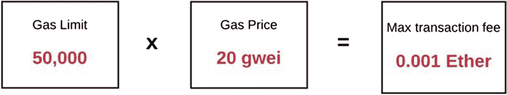

图 4-16

交易手续费支付示例

如果用户的余额账户中有足够多的以太币来支付这笔费用，那么交易或计算就可以被执行。在交易或计算的最后阶段，发送方将获得未使用的 Gas 的退款。

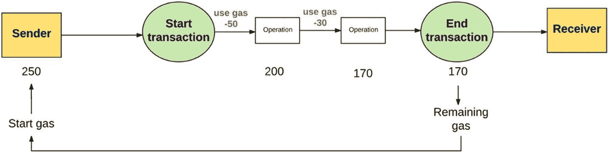

图 4-17

计算结束时未使用 Gas 的退款示例

如果发送方未提供执行交易所需的 Gas，则交易将因 Gas 耗尽而不会被认定为有效。在这种情况下，交易处理会停止，并且任何路径更改都将被回滚，以返回到计算之前的以太坊状态。此外，失败的交易会被记录，以显示尝试了什么操作以及在何处失败。并且，由于车辆在 Gas 耗尽之前已经消耗了资源进行计算，因此不会向发送方退还任何金额。（见图 4-18。）

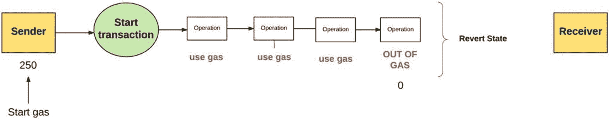

图 4-18

因 Gas 不足导致交易失败的示例

请注意，发送方为 Gas 支付的全部费用都会被发送到矿工地址。由于矿工们正在消耗自己的资源来运行计算和识别计算任务，他们因此获得 Gas 费用作为奖励。（见图 4-19。）

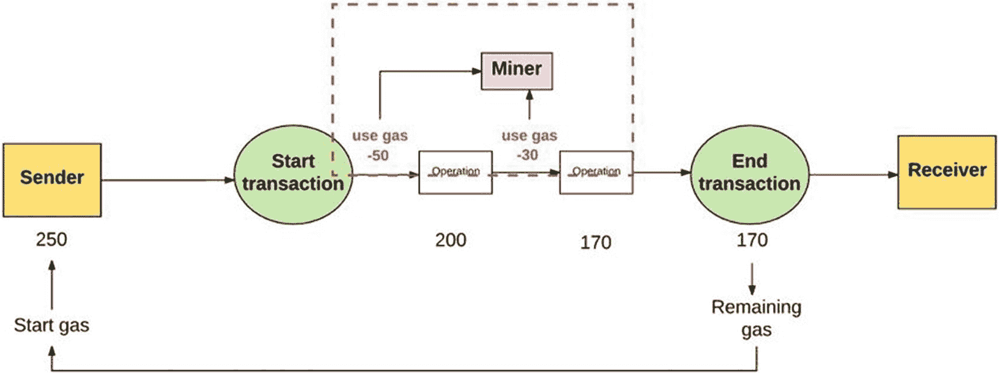

图 4-19

矿工收到手续费的示例

所以，很明显，Gas 价格越高，矿工从计算中获得的收益就越高。通过这种方式，矿工可以自由选择验证哪些计算以及避免哪些计算。为了引导发送方设定他们可以接受的 Gas 价格，矿工可以宣传他们愿意执行交易的较低费用。矿工会优先打包手续费最高的交易，因此用户愿意支付的 Gas 价格越高，他们的交易就越快被纳入区块。你可以在这张表上查看每项操作所需的 Gas。


### 存储的 Gas 费用

`gas`不仅用于支付计算步骤，还用于支付内存使用。归档费用的计算有一些细微的差别。例如，由于内存的大幅增加会增加所有节点上以太坊状态数据库的大小，因此在归档时需要激励用户保持较小的数据量。

因此，如果某笔交易存在一个清除存储空间条目的阶段，该交易的执行费用将被取消，并会发放退款以释放存储空间。此外，存储成本非常高。在开发智能合约时，我们有三种方式访问内存：

- **栈**：访问易失性栈。
- **内存**：访问易失性存储或内存。
- **存储**：访问非易失性存储。其中非易失性存储的成本最高。

图 4-20 展示了一个表格，列出了每次内存操作所需的 gas。

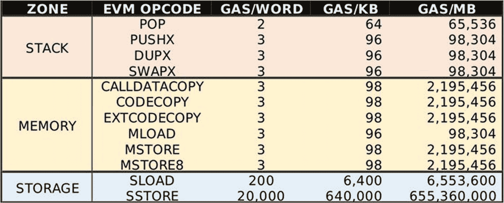

**图 4-20** 每次内存操作的 gas 费用列表

总之，在以太坊上持续存储数据的成本极高。使用以太坊来存储数据是没有意义的。只应存储当前操作所需的数据；将归档任务委托给其他解决方案。

然而，一个很好的方法是将默克尔树的根或基础哈希作为数据防篡改证明，仅归档到以太坊中，而数据本身存储在外部分布式服务上。

理解智能合约在 gas 消耗或计算方面的情况，对于控制运营成本至关重要。

有一些 API 可以估算交易成本以及智能合约的成本，但这超出了本书的讨论范围。最终，无论是计算操作还是归档操作，其成本都以 gas 单位进行衡量。当用户提交交易时，他们会为每个 gas 单位提供一个 ETH 价格，以及他们愿意花费的 gas 单位数量。代码消耗的 gas 越低，其在执行代码所需的资源方面效率就越高。

### Gas 的目的

以太坊运行的一个重要方面是，网络执行的每一个操作都是由所有全节点共同完成的。但你已经看到，以太坊虚拟机上的计算步骤可能成本更高。

因此，以太坊智能合约主要用于基础活动，例如执行简单的业务策略、验证数字签名和其他加密对象，而非用于文件归档、电子邮件、机器学习以及通常会加重网络负担的更复杂用途。

费用机制的引入可以防止用户过度使用。请注意，以太坊是一种完全图灵完备的语言，简而言之，它能够模拟任何算法。这也使得它可以创建循环，从而使以太坊容易面临程序无限执行的问题。

如果没有费用机制，攻击者可能会通过在一个操作或动作中运行无限循环来企图拖垮网络，而无需承担任何后果。

## 交易与消息

我们将以太坊区块链定义为一个基于交易的机器状态。因此，交易是一个可以改变以太坊区块链状态的事件。交易可以出于不同目的而创建：

- 外部拥有账户之间的数字货币转账
- 在以太坊区块链上部署智能合约
- 在已部署的智能合约上执行函数

交易只能由外部拥有账户创建和发送。

### 交易结构

一条以太坊交易是一个字节数组。该数组被分为多个字段，如图 4-21 所示。

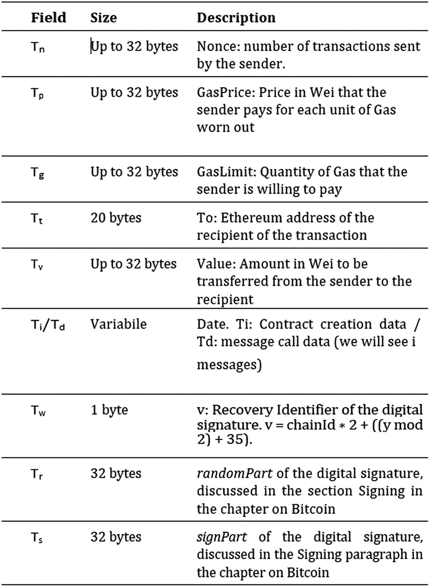

**图 4-21** 交易结构

交易通过修改后的默克尔帕特里夏树进行维护，这在前文关于世界状态的章节中已详细讨论过。

在此逻辑中，键由交易 ID 表示，值则正是交易本身。

### 交易数字签名流程

我们按照维塔利克·布特林在影响以太坊的硬分叉后提出的 EIP（以太坊改进提案）方案，来演示签名交易的具体步骤，该方案可防范可能的重放攻击。使用旧方案也可以工作，但以太坊创始人建议使用新方案来保护自己免受重放攻击。可以在此处看到：


这由以太坊创始人提出，并附带了所有链的 ID 列表。

一旦创建了交易，就会通过`RLP`函数对其进行序列化：

```
L1 = RLP(T(T[n]; T[p]; T[g]; T[t]; T[v]; p; chainID; (); ()))
```
其中，如果`T[t] = 0`，则 `p = T[i]`，否则 `p = T[d]`。

序列化后，将应用名为 SHA-3（也称为 Keccak-256）的加密哈希函数：

```
h1 = KEC(L(T))
```

完成此步骤后，即可应用签名：

```
ECDSASIGN(h(T); privKey) = (T[w]; T[r]; T[s])
```

其中：

- `T[w]` 是一个恢复标识符，其值为双倍再加 35 或 36
- `T[r]` 是数字签名的 `randomPart`（随机部分）
- `T[s]` 是数字签名的签名值

因此，`T[r]` 和 `T[s]` 构成了 ECDSA 数字签名的输出（`randomPart`；`sign`），而 `T[w]` 则根据 `EIP155` 计算得出，具有双重目的：

- 防范重放攻击
- 允许检索信息以快速恢复公钥

实际上，发送者的地址并不存在于交易中。完成这一步骤后，字段 `T[w]`、`T[r]` 和 `T[s]` 会被添加到交易中，得到 `T(T[n]; T[p]; T[g]; T[t]; T[v]; p; T[w]; T[r]; T[s])`。

然后，对此应用 `RLP` 序列化函数：

```
L2 = RLP(T(T[n]; T[p]; T[g]; T[t]; T[v]; p; T[w]; T[r]; T[s]))
```

并再次应用 SHA-3 哈希函数：

```
h2))
```

最终得到的就是交易 ID。


### 4.6.3 从数字签名中恢复公钥

对于数字签名，以太坊与比特币一样，使用带有标准`secp256k1`的 ECDSA 算法。

我们在此讨论的是 EIP-155 提案中的数字签名方案。在本例中，我们将指代以太坊主网链。但对于使用此方案的每条链，流程都是相同的，只需将`chainId`更改为相应的值即可。

正如你所见，交易中并没有发送方地址字段。

实际上，这个信息是后来获取的。正因如此，你有了变量`v`，它提供了关于奇偶性的信息，以及曲线点（其中`randomPart`是其`x`值）的有限性。计算`v`的公式是：

`v = chainId * 2 + ((y mod 2) + 35)`

- `chainID` 是所用链的 ID。对于以太坊主网，此变量的值为`1`。
- `y` 是曲线点的 y 坐标，其中`randomPart`是该曲线的 x 值。它是 ECDSA 签名的一部分。

分析这个用于计算`v`的公式，你会发现有趣的部分是`y mod 2`，它扮演了恢复标识符的角色。

它用于加速检索签名者公钥的过程。实际上，如果信息正确，此操作有两个可能的结果：
- `0`： -> y 坐标是偶数。
- `1`： -> y 坐标是奇数。

因此，我们发现`((y mod 2) + 35)`可能有两个值：
- `35`： -> y 坐标是偶数。
- `36`： -> y 坐标是奇数。

给定 X 坐标的一个固定值，并截断与 Y 坐标相关的信息，就可能存在多个具有相同`x`的点对`(x; y)`。

那么，为了验证签名，我们需要检索公钥，执行一个循环，在每次迭代中，比较可能的点对之一是否与签名匹配。可能的点对与签名匹配。所以，让我们看看发送者的公钥。我们简要说明 ECDSA 算法如何计算数字签名的随机部分。

给定曲线`secp256k1`。设`G`为由标准`secp256k1`定义的生成点。设`n`为曲线上点`G`的阶。然后，我们需要理解在区间`[1, n-1]`内生成一个随机数。我们称此值为`randomNumber`。我们这样找到`randomPart`：

`randomNumber * G = (x1; y1)`

因此：

`randomPart = x1 mod n`

设`h`为椭圆曲线的余因子，则`2 * (h + 1)`告诉我们，给定 X 坐标的`randomPart`，我们有多少个可能的点。对于`secp256k1`，余因子等于`1`。所以，我们有四个可能的点：
- 两个，因为每个 X 坐标有两个可能的 Y 坐标，一个为正，一个为负。
- 两个，因为`R.x = randomPart + j * n`，其中`j`取`{0, 1, 2, ..., h}`（在我们的例子中`h = 1`）。

然而，`R.x`可以从`randomPart`唯一恢复，因为整数中只有一个：

`R.x = randomPart + j * n`

对于`j = 0, 1, 2, ..., h`，代表一个有效的 x 坐标，即`G`的倍数。

出于这个原因，[`SEC2`]加密标准推荐使用余因子`h = 1`或`h = 2`的椭圆曲线。对于这些由[`SEC2`]推荐的曲线，有效 x 坐标的数量通常是一个，因此这个检查是空的。

在最坏的情况下，从`randomPart`找到`R.x`只需要`log2(h) + 1`个比特。

因此，给定点`R`的 X 坐标的固定`randomPart`信息，并截断与 Y 坐标相关的信息，可能存在两个可能的点对`(x; y)`，其 X 坐标相同有效。也就是说，一个是 Y 坐标为正的点`(x; y)`，另一个是 Y 坐标为负的点`(x; -y)`。

那么，为了验证签名，你需要运行一个循环，在每次迭代中，确定可能的点对之一是否与签名匹配。然而，多亏了关于 Y 坐标奇偶性的信息，我们可以一次性获得点`R`的`yr`值，从而推导出与签名对应的公钥。实际上，由于`v`给了我们坐标 Y 的奇偶性信息（对于该坐标 Y，`randomPart`是坐标 X 的信息），我们可以计算出`R = (xr; yr)`。

设`h(msg)`为交易的哈希值。通过这种方式，我们得到相应的公钥`Q`：

1. 对于`j`从`0`到`h`（对于`secp256k1`，`h = 1`）：
    1. 设 `x[r] = randomPart + j * n`

2. 从`y[r]`的奇偶性信息，推导出点`R`。 `R = (x[r]; y[r])`

3. 计算候选公钥：  
   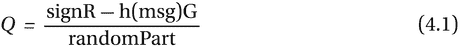

4. 用数字签名验证公钥：
   1. `u1 = h(msg) * sign-1 mod n`
   2. `u2 = randomPart * sign-1 mod n`
   3. 计算：  
      `R = (xr, yr) = u1 * G + u2 * Q`
   4. 设 `c = xr mod n`。那么，如果 `c == randomPart` 为真，则签名被验证。返回 `True`（有效）。

否则，如果循环结束后未返回`True`值，则信息中存在不一致之处。这样，公钥就从带有标准`secp256k1`的 ECDSA 签名中推导出来，并且签名得到了验证。

### 4.6.4 三种交易类型

本节涵盖三种类型的交易：

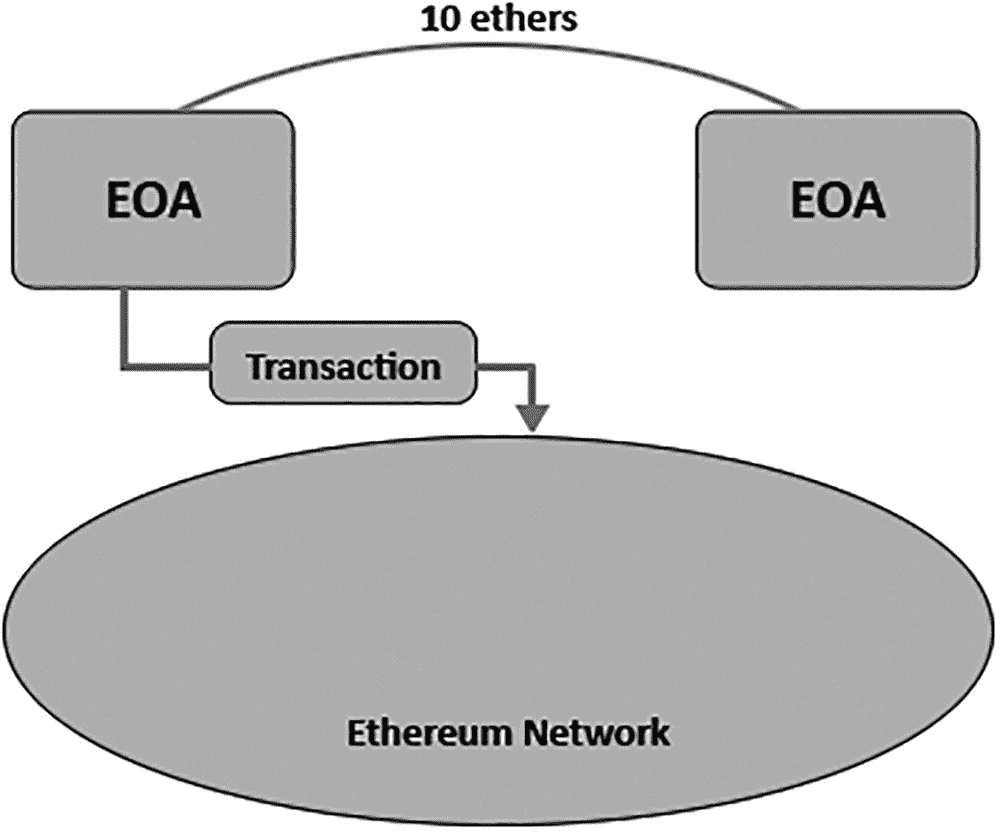

**图 4-22** – EOA 之间的资金转移

- **EOA（外部拥有账户）之间的资金转移：** 当一个 EOA 向另一个 EOA 转移资金时，使用此交易。此交易的`Data`字段为空。（见图 4-22）

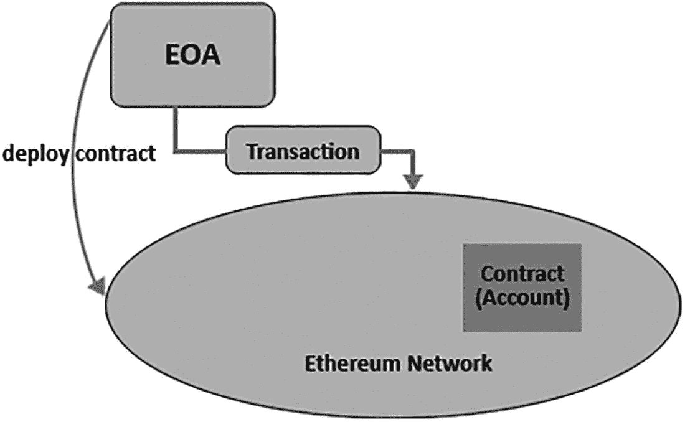

**图 4-23** – 在已部署的智能合约上运行以太坊函数的智能合约分发

- **在以太坊网络上存储智能合约：** 在以太坊中，分发合约是通过交易进行的。此交易的目标地址字段为空。然而，在`Data`字段中，包含智能合约的字节码，如果需要，还有一些参数。如果成功，发送方会收到一个收据，其中包含他们使用该智能合约所需的合约地址（见图 4-23）。

部署合约后，EOA 可以执行此合约中定义的函数。同样，这是通过提交一笔以太坊交易来实现的。在这种情况下，交易的目标地址是智能合约地址。而在`Data`字段中，包含要调用的函数选择器以及要输入函数的数据。（见图 4-24）

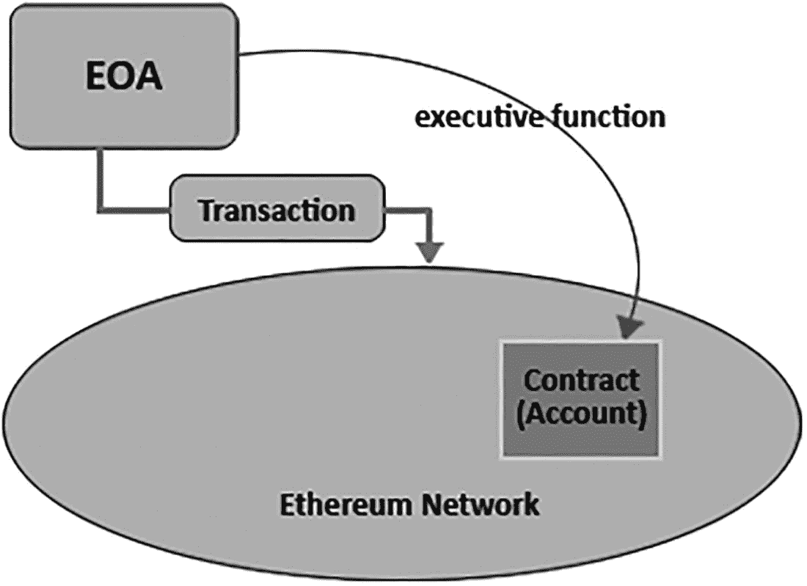

**图 4-24** – 调用智能合约上的函数

显然，关于谁可以执行操作的智能合约的权限，是在智能合约代码中定义的，代码中包含了操作的逻辑。


### 4.6.5 消息

消息是 EVM 代码从一个智能合约发送到另一个智能合约的一种虚拟交易。请注意，以太坊中的交易和消息是不同的。以太坊术语中的*交易*特指一份经数字签名的数据，该数据源自 EVM 代码执行过程之外，并将在区块链中注册。消息只能由 EVM 代码发送，且永远不会在数据中体现。因此，它们表达了智能合约向不同智能合约发送消息的能力。

这些是虚拟对象，从未被序列化，只存在于以太坊运行时环境中。它们也可以被理解为智能合约之间的函数调用。

基本上，你需要理解消息类似于交易，区别在于它是由合约而非外部参与者产生的。在消息生成后，当一个合约正在执行时，代码会执行主要的`CALL`或`DELEGATE THE CALL`操作码，从而生成一条消息。

因此，一个合约可以像外部参与者一样，与其他智能合约建立关系。它们也被称为内部计算或内部交易，当一个合约在内部向另一个合约发送交易时，代码会被执行并与接收方合约账户关联。（参见图 4-25。）

通常，消息来自智能合约，其执行会触发来自 EOA（外部拥有账户）的交易。

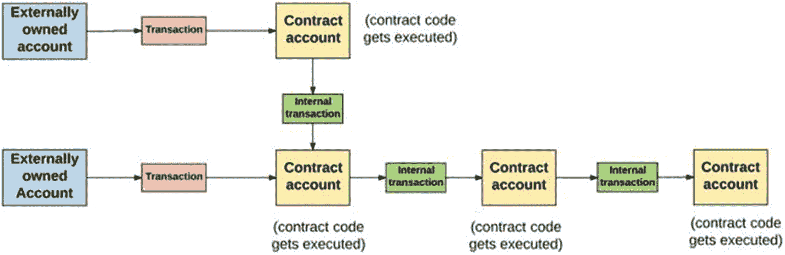

**图 4-25** 交易与消息（内部交易）

`gasLimit`由外部拥有账户设置，因此其值足够高，以允许整个操作（包括因操作本身而产生的任何子执行，即合约间的消息）顺利执行。

对于整个交易链，当某条消息的特定执行结束时，该消息的执行及其后续激活的所有消息的执行，都可以恢复到初始状态。

## 4.7 以太坊状态转换函数

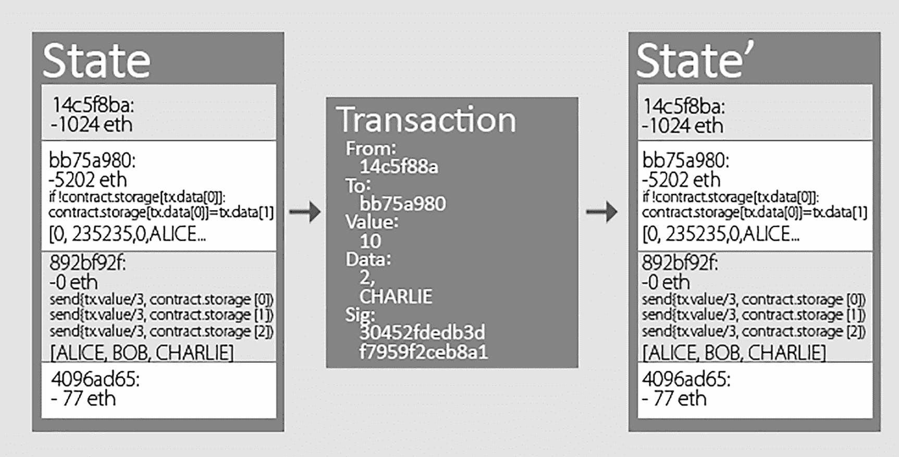

**图 4-26** 由新交易触发的状态改变与状态转换函数

本节讨论交易的验证以及状态转换函数。当且仅当交易有效，并且你已经安排好完成其执行所需的所有资源时，此函数允许你转换到一个新状态。参见图 4-26。

让我们来看一下以太坊状态转换函数的步骤：

`APPLY (S; TX) -> S0` 或 `ERROR` 定义如下：

1. 检查交易的结构和语法，验证签名的有效性，并确定交易的 nonce 是否与发送者匹配。如果不成功，则返回错误。
2. 然后，你可以将交易成本计算为`GASLIMIT * GASPRICE`，并确定签名发送者的地址。如果发送者的账户余额充足，则扣除刚计算出的金额并增加 nonce；否则，返回错误。
3. 初始化变量`GAS = GAS_LIMIT`。每消耗一个字节，就按一定数量减少 gas，以支付所消耗的每个字节的资源。
4. 将交易的数字货币从发送者账户转移至接收者账户。注意，如果接收者账户不存在，则创建它。然后，如果收款人账户是智能合约，则运行合约代码，直到操作完成，或至少直到 gas 耗尽。
5. 如果交易因发送者资金不足或代码执行耗尽 gas 而失败，则恢复所有状态更改，支付税费，并将税费添加到矿工账户。
6. 否则，如果成功，则向发送者退还未消耗的 gas 费用，并将已消耗的费用奖励给包含该交易的区块的获胜矿工。

在恢复管理方面，消息的工作方式与交易等效：如果正在运行的消息耗尽 gas，并且由此触发的所有其他执行都被恢复，这没有问题。在其他情况下，它会返回一个错误或一个`STOP/RETURN`语句。

如前所述，智能合约开发者可以访问三种类型的存储内存：

* LIFO（后进先出）栈（易失性），可以在其中压入或弹出数据（范围从 0 到 1024）。
* （易失性）内存，是一个可无限扩展的字节数组。
* 以太坊的（非易失性）存储。

代码还可以获取消息的值和传入数据。它可以访问区块头数据，并且也可以返回一个字节数组作为输出。

EVM 的功能状态可以由数据集定义。在这种情况下，区块状态是包含所有账户、余额和存储的全局状态。

务必注意，在每一轮运行的开始，当前指令是通过程序计数器指向的字节来识别的。每个操作在与数据集交互方面都有其自身的定义。


## 4.8 以太坊区块链中的交易流程

本节讨论以太坊区块链中的交易生命周期。我们以一笔调用智能合约函数的交易为例——该示例有效且适用于任何类型的交易。假设你希望通过一个部署在以太坊网络上的去中心化应用进行选举投票。图 4-27 展示了该应用的图形界面，你通过安装了用于管理以太坊账户插件的浏览器访问该界面。

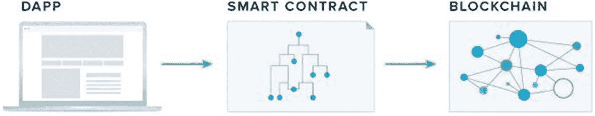

图 4-27

调用智能合约函数的交易

该应用为我们提供了一个选举列表，我们选择自己有权投票的那一项。

我们点击的投票功能是一个通过名为 `Web3.js` 的以太坊通信库由 JavaScript 处理的事件。该事件连接到以太坊网络的一个节点，创建一个投票智能合约代理的实例，并调用其 `castVote()` 函数，传入选定的候选人。这个函数调用是一笔交易，因为它会改变投票应用的状态（通过其 `castVote()` 函数），并且需要现场生成数字签名。参见图 4-28。

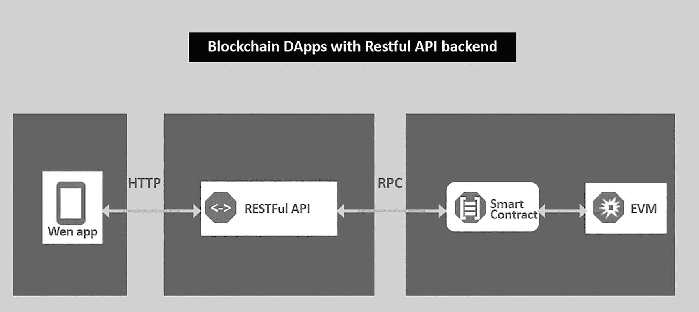

图 4-28

区块链去中心化应用

这笔投票交易由提交它的本地以太坊节点进行验证。验证涉及检查以下事项：

- 结构和语法格式正确。
- 数字签名与发送者地址及交易内容一致。
- 交易的 nonce 值必须有效。请记住，账户的 nonce 是该账户账簿或账单发送的计算次数或交易计数。要成为有效交易，交易的 nonce 应与发送者用户账户的 nonce 匹配。
- 发送者拥有足够的以太币来处理交易。
- 发送的数据不会导致 `castVote()` 函数执行失败。

因此，如果验证成功，当前节点会将交易广播到其所有邻近的对等节点。如果验证失败，交易不会被传输，而是直接消失。随后，交易通过各个完整节点在网络中传输，这些节点会依次执行前述验证过程。

然后，交易通过网络传播，到达矿工节点。每个矿工节点根据其收到的交易，拥有自己的交易池，用于添加到账本中。（参见图 4-29。）

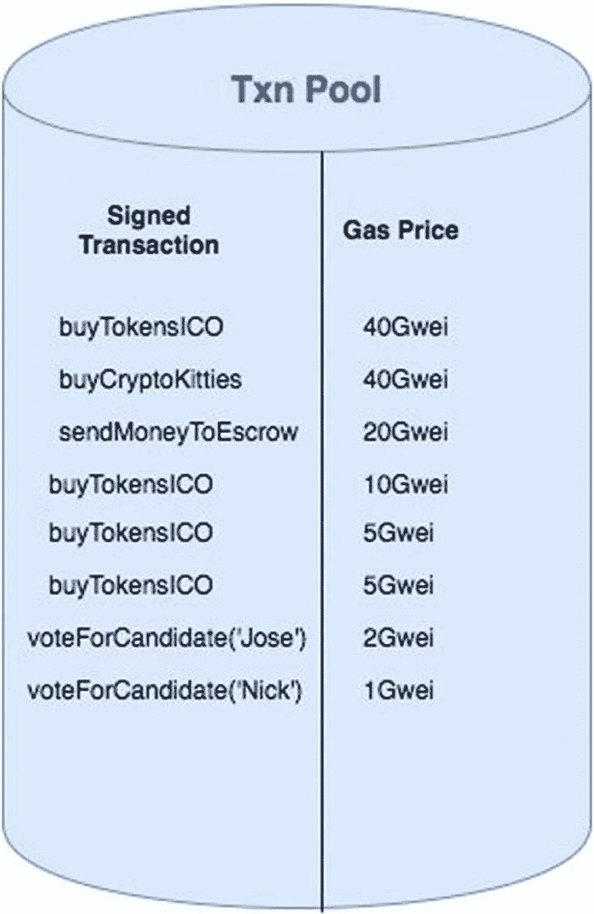

图 4-29

内存池

矿工节点随后选择要包含在候选区块中的交易。

因此，我们假设 `n` 是交易数量，并令 `APPLI (S; TX)` 为之前定义的状态转换函数。

令 `S [0]` 为上一个区块结束时的状态。

*对于 i = 0; 1; ... n–1，S (i+1) = APP (S (i); TX (i))*

如果状态转换函数的每次应用都没有返回错误，则交易有效并可被添加到区块中，否则将丢弃无效交易。

然后，矿工将获得的奖励增加到 `S [n]` 中，并定义区块的最终状态。接着矿工构建区块，解决共识算法，并将区块传播到网络中以供添加到区块链。一旦投票交易在区块验证过程中被执行，智能合约将发布 `VoteConfirmation()` 事件。

该事件将被投票者的网络用户界面接收，你已在该界面上注册以监听该事件。

随后，`VoteConfirmation()` 事件将由界面的 JavaScript 网络用户进行处理，屏幕上会显示一条消息，告知用户投票成功。

图 4-30 展示了交易的整个生命周期，从发起到确认事件。

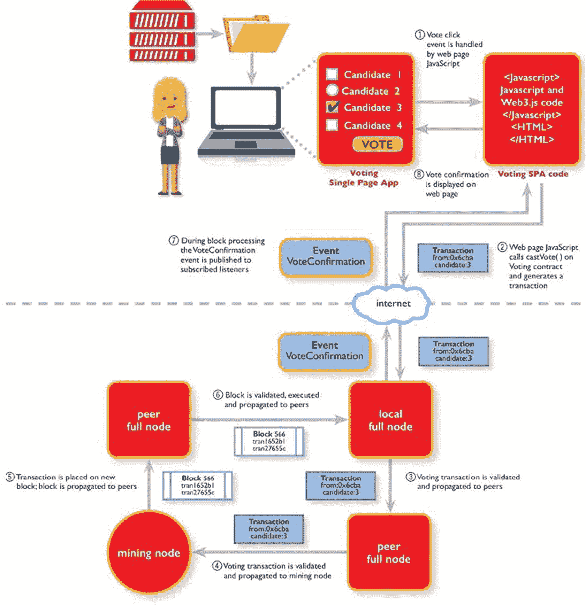

图 4-30

交易池系统

## 4.9 交易状态

一笔交易会经历一系列状态，直到它被确认并添加到账本的区块中。（参见图 4-31。）

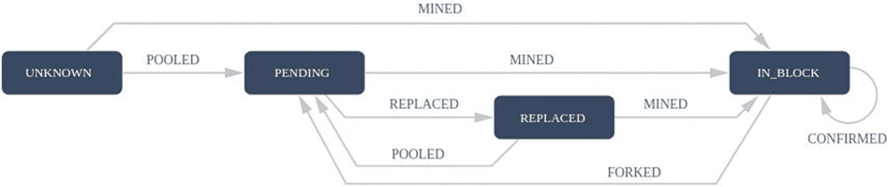

图 4-31

交易状态

我们来逐一分析这些状态：

- **未知：** 网络既未查看也未处理的交易。
- **待定：** 处于待定状态，等待被矿工选择和处理。它位于所谓的交易池中。
- **已入块：** 当矿工正确选择交易并将其提取到区块中时，交易进入已入块状态。一旦进入区块，如果该区块发生分叉，交易可以回滚至待定状态。
- **已替换：** 当发生以下事件之一时，交易可以从待定状态进入已替换状态：
  - 来自同一发送者且具有相同 nonce 的另一笔交易进入已入块状态。
  - 来自同一发送者、具有相同 nonce 但 gas 价格更高的另一笔交易进入待定状态。

那么，让我们看看交易的 *状态转换*。

- **入池：** 从未知状态到待定状态的转换。这涉及进入某个节点交易池的交易。它们因此等待被选中以组成候选区块。
- **已挖出：** 已挖出的交易已被矿工处理，创建了一个区块。一旦矿工签出交易，它便进入已入块状态。由于以太坊网络的*点对点*特性，从某些节点的角度来看，交易可以直接从未知状态转换到已入块状态，而无需经过待定状态。
- **已替换：** 从待定状态转换到已替换状态被称为已替换。这发生在以下情况：
  - 来自同一发送者且具有相同 nonce 的另一笔交易进入已入块状态。
  - 来自同一发送者、具有相同 nonce 但 gas 价格更高的另一笔交易进入待定状态。
- **已分叉：** 当区块交易所在的区块被网络逆转时，会发生此情况。该区块内的所有交易将从已入块状态转换到待定状态。
- **已确认：** 每当新区块被提取并添加到链中时，处于已入块状态的交易即被确认。


## 4.10 区块结构

以太坊区块链的一个区块分为以下部分：

- 区块头
- 叔块头列表
- 区块数据

叔块头的格式与前述相同。（见图 4-32。）

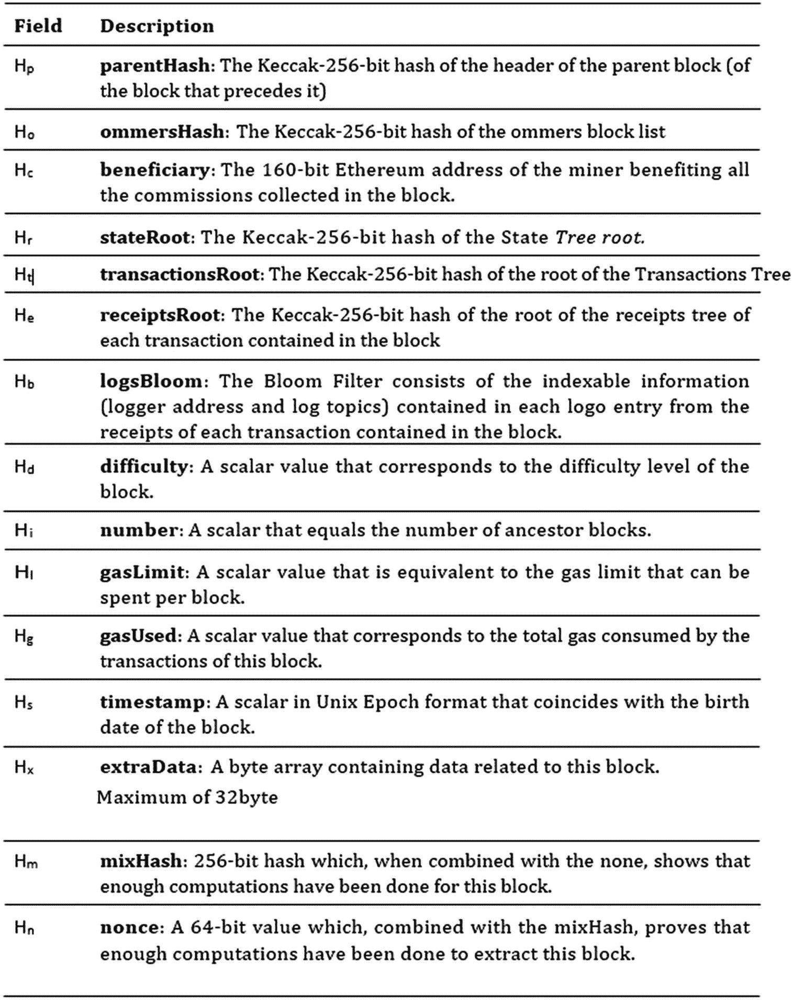

图 4-32 区块结构

叔块头列表用 `B[U]` 表示，交易列表用 `B[T]` 表示。因此，正式地，我们将区块 `B` 表示如下：

`B = (B[H]; B[T]; B[U])`

请记住，以太坊中的每棵树都是修改版默克尔帕特里夏树（Modified Merkle Patricia trie），这在世界状态（World State）一节中有详细阐述。

这种方法乍看起来可能非常低效，因为每个区块都必须捕获整个状态，但实际上，每个区块之后只需改变其中极少部分数据。由于所有状态信息都是最终区块的一部分，因此无需记录区块链的完整历史。

通常，两个相邻区块之间的大部分树结构是相同的，因此只需记录一次信息，并通过哈希指针引用两次。此外，值得补充的是，智能合约的代码执行过程由一个交易生成，该交易通过状态计算或状态转换函数来执行。

根据区块验证算法，如果计算或交易被添加到名为 `X` 的区块中，则由该交易生成的代码执行将在网络的所有节点上执行，从而验证并添加 `X` 区块。

图 4-33 总结了这些以太坊区块。

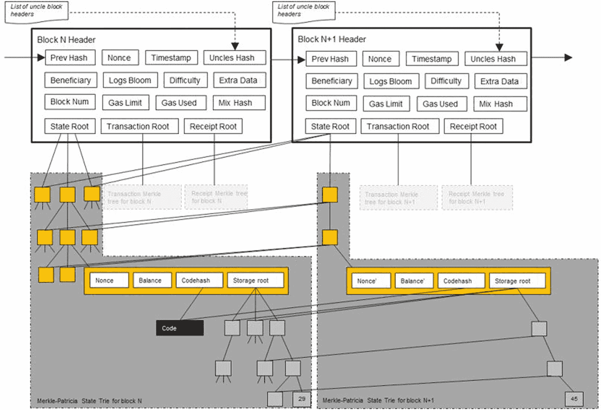

图 4-33 以太坊中的区块结构

### 4.10.1 交易收据

每笔交易在执行并验证后，都会改变区块链的状态。因此，每笔有效交易都会产生一个结果。交易收据记录了每笔交易的结果。每个计算或交易收据是一个由四个元素组成的元组：

- `Ru`：累计消耗的 gas
- `Rl`：通过交易执行生成的一组日志
- `Rb`：由这些日志中的信息组成的布隆过滤器
- `Rz`：交易后的状态

因此，交易收据定义如下：

`R = (R[u]; R[b]; R[l]; R[z])`

### 4.10.2 叔块

与比特币相比，以太坊的区块处理时间要短得多。一方面，这允许更快速地处理交易；另一方面，多个矿工可能同时解出更多的区块。这些并发的区块被称为**叔块**。

叔块不会进入主链。然而，将这些区块整合到已获得主区块链位置的主块中，其目标是帮助奖励生成这些区块的矿工。

为了使矿工因叔块而获得奖励，该叔块必须是有效的。因此，叔块的目标是奖励表现良好的矿工，同时奖励孤块。

这具有双重效果：

1.  **促进网络去中心化。** 事实上，即使是那些因以下原因挖出孤块的矿工也能获得奖励：
    -   更大的网络延迟，导致数据传播延迟
    -   更低的算力，导致挖出区块的难度更大
        -   这减少了中心化趋势，并避免了拥有更高算力的矿池攫取大部分奖励，而对个体矿工毫无保留。

2.  **通过增加主链的工作量来提高链的安全性。** 从而减少工作量浪费。

赢得主链位置的区块，通常是拥有最大工作量证明份额的区块。而叔块则是通常共享较少工作量证明的区块。每个区块最多可以包含两个叔块。

## 4.11 以太坊简化版 GHOST 协议

GHOST 协议旨在为区块处理速度极快的区块链提出一种解决方案。事实上，确认时间极快的链会受到“降低的”安全性的影响，因为矿工挖出的区块在网络中传播得更慢。

基本上，解决方案是将潜在区块纳入主区块链的计算中。

此外，产生快速区块的区块链很容易面临向拥有高比例网络哈希率的矿池中心化的风险，从而控制挖矿过程。

为了避免这种情况，以太坊采用了 GHOST 协议的**简化版本**，它能够克服困扰快速处理区块的区块链的两个问题。

以太坊采用的解决方案是为潜在区块提供降低的奖励。不仅如此，它们还为包含这些潜在区块的“孙子辈”区块提供奖励。

以太坊简化版 GHOST 协议定义如下：

-   一个区块必须指定一个父区块，以及 0、1 或 2 个叔块。
-   包含在某个区块中的叔块应具备以下属性：
    -   它必须是 `B` 的 k 代祖先的直接子块，其中 `k` 介于 2 和 7 之间。
    -   因此，它不能是 `B` 的祖先。
    -   它必须是一个有效区块。
    -   该叔块必须与之前区块中包含的所有叔块以及同一区块中包含的所有其他叔块不同。

叔块可以被包含在最多七代之内，有两个原因：

-   没有代际限制的 GHOST 协议会给计算特定区块的哪些叔块有效带来复杂性。
-   此外，如果像在以太坊中实现的那样采用无限制的 GHOST 协议，会削弱矿工挖主链的动力，转而偏向攻击者的链。


## 4.12 以太坊共识机制

我们来看看，即便在此处，它如何成为一种涌现式共识，并且以太坊将其共识机制建立在工作量证明（POW）之上。

以太坊使用的 POW 算法是 `Ethash`，它基于 `Keccak-256-bit` 加密哈希函数。

正如你所见，当一笔交易被创建并签名后，在传输到网络之前，它会通过本地以太坊节点进行验证。

此验证包括以下检查项：

*   交易的结构和语法格式正确。
*   数字签名与发送者地址和交易内容一致。
*   交易的 `nonce` 值必须有效。要使 `nonce` 有效，交易的 `nonce` 必须与发送者账户的 `nonce` 相匹配。
*   发送者有足够的以太币来支付交易的 gas 费用。
*   发送的数据一致且格式正确，因此不会导致任何被调用的操作失败。

如果这些验证步骤中的任何一个失败，那么交易将失败并传输到网络。相反，如果验证通过，它就会通过相邻节点在网络中传播。每个接收到交易的节点都会依次对交易的有效性进行验证。

同样，如果验证成功，该交易将在网络中继续传递，否则将被忽略。通过这种方式，可以避免网络被无效交易堵塞，因为此类交易不会导致任何状态变更。

当交易到达矿工手中时，矿工会对其进行验证并将其添加到交易池中。事实上，与比特币一样，矿工在本地维护一个交易池，等待被添加到一个候选区块中。

矿工根据多种标准选择要添加到区块中的交易，但主要依据是交易提供的费用。矿工每个区块都有 gas 上限，他们不能突破这个限制。

然后，他们选择一定数量 `n` 的交易添加到区块中，并为每个交易应用状态转换函数。

```
APPLY (S; TX) -> S 或 ERROR
```

因此，矿工最终可以用新状态 `S0` 构建区块，填写各字段，并解决我们在专门介绍比特币的章节中讨论过的 Nakamoto 共识部分提到的 PoW 难题。一旦难题被解决，矿工就可以将区块发送到网络。每个接收到该区块的节点都会对其进行验证。以太坊中基本的区块验证算法按以下方式工作：

*   检查前一个引用区块是否仍然存在且有效。
*   查看该区块的时间戳是否大于前一个区块的时间戳，并且小于未来 15 分钟的时间戳。
*   验证区块编号、难度、交易来源、衍生交易和 gas 上限是否有效。
*   验证区块上的 POW 是否仍然有效。
*   `S [0]` 可以是最后一个区块结束时的状态，`TX` 可以是该区块的计算或交易列表，共 `n` 步。

对于 `i = 0 ... n - 1`，设置 `S (i+1) = APPLY (S (i); TX (i))`。

然后检查应用是否出错，或者截至当前区块消耗的最终或总 gas 是否超过了 `GASLIMIT`；如果超出，也会报错。

*   假设 `S FINALS (n)`，然后加上支付给矿工区块的区块奖励。
*   需要验证 Merkle 树的原始状态 `S_FINAL` 是否与区块头中给出的最终步骤或状态一致。如果一致，则该区块有效；否则，无效。

### 4.12.1 工作量证明算法 (PWA)

PWA 的形式化定义如下：

`(n; m) = PoW (H; H[n]; d)`

其中

*   `(n; m)`
    *   `m` 是 mixHash
    *   `n` 是 nonce
*   `H` 是不包含 nonce 和 mixHash 的区块头。
*   `Hn` 是定义为加密伪随机数的 nonce，它并非独立于 `H` 和 `d`。
*   `d` 是 DAG，它是计算 mix-hash 所需的一大组数据。简单来说，矿工通过 DAG 不断生成此类 mixHash，直到输出结果具有低于目标值的 nonce 值。

nonce 与区块难度之间的关系在此形式化定义：

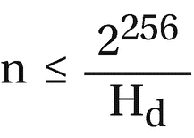

## 4.13 以太坊 2.0

你已经看到，与比特币一样，以太坊是一种涌现式共识。以太坊用于挖矿的算法是*工作量证明*算法。

然而，不久之后，以太坊将迎来从 1.0 到 2.0 的升级。这次更新不会一蹴而就，而是会通过多个阶段逐步推进。

这次更新最重要的一个方面是用于挖矿算法的创新。事实上，随着升级到以太坊 2.0，将过渡到权益证明算法。工作量证明是一种挖矿算法，其计算负担不轻。为了能够赢得一个区块，你需要从昂贵的专用硬件中获得必要的计算能力。

这会导致非常高的能源消耗，并对环境造成污染。所以，总而言之，与 PoW 相关的问题有：

*   由于所需计算资源和能源的数量，这是一个非常低效的过程。
*   能够负担得起更强大硬件来执行 PoW 的个人和组织比其他人更有可能使用它，这意味着存在挖矿过程向组织中心化的风险。

图 4-34 显示了以太坊网络内算力分布的一个统计示例。

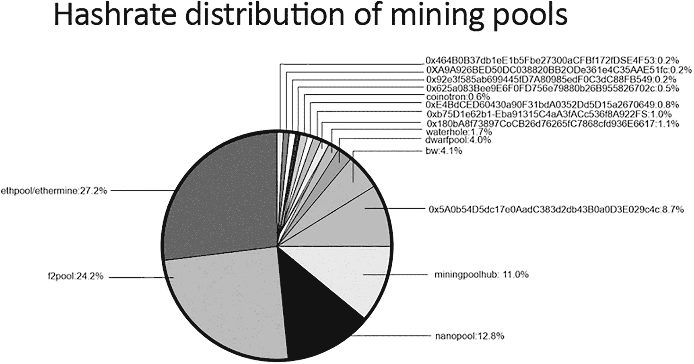

图 4-34 — 以太坊哈希率分布

因此，从图中可以清楚地看到，以太坊总挖矿算力的 51% 以上掌握在三个组织手中。为了解决这些问题，以太坊考虑将权益证明作为一种解决方案。

## 4.14 总结

在本章中，你学习了以太坊及其结构（状态和交易函数）。本章解释了以太坊是如何创建的，以使开发者能够构建和发布智能合约和分布式应用，这些应用可以在没有停机问题、欺诈或第三方干扰的情况下使用。下一章将重点介绍基于权益证明算法的共识机制，相关研究正日益深入。越来越多的区块链正在考虑转向这种算法共识，以太坊首当其冲。本章最后涵盖了以太坊 Casper，这是以太坊开发者正在实现的权益证明机制。


